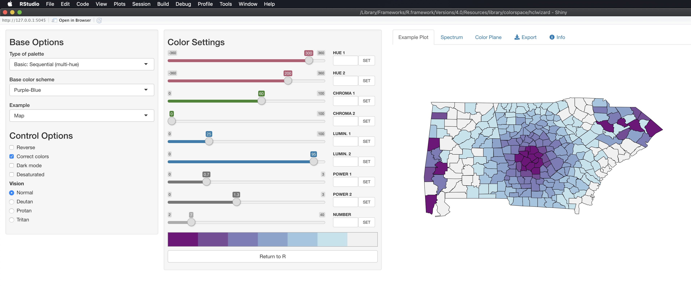
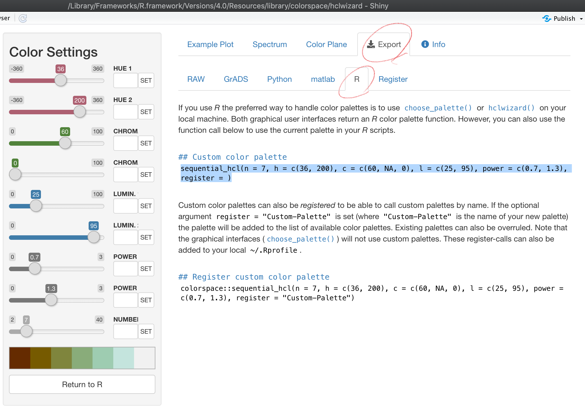

# (PART) Extensions {-}

# Creating Maps using `ggplot2` {#create-maps}

## Before you start {-}

In previous chapters, we have shown how to create very simple maps quickly from vector and raster data. This section focuses on using the `ggplot2` package to create high-quality maps that are publishable in journal articles, conference presentations, and any kind of professional reports. This requires fine-tuning the aesthetics of maps beyond default maps, such as using the appropriate color scheme, removing unnecessary information, formatting legends, etc. This chapter focuses on creating static maps, and does not cover interactive maps that you often see on the web.

Creating maps differs from creating non-spatial figures in some ways. However, the underlying principle and syntax under `ggplot2` to create maps and non-spatial figures are very similar. Indeed, you will find map making very intuitive and rather easy if you already have some knowledge of how `ggplot2` works even if you have not created maps using `ggplot2` before. Indeed, the only major difference between them is the choice of `geom_*()` types. We have several `geom_*()` types at our disposal for spatial data visualization.

+ `geom_sf()` for `sf` (vector) objects
+ `geom_raster()` for raster data
+ `geom_stars()` for `stars` (both vector and raster) object

These `geom_*()`s allow for visualizing both vector and raster data through consistent and simple `ggplot2` syntax. It provides direct supports to `sf` and `stars` objects, meaning that no transformation of those objects is necessary prior to creating maps. On the other hand, (a very simple) data transformation is necessary for `Raster`$^*$ objects by the `raster` package and `SpatRaster` or `SpatVector` by the `terra` package. We will look at each of the `geom`s individually to understand their basic usage below in sections \@ref(geom-sf) and \@ref(geom-raster). You will notice that there is nothing spatial about the sections following these sections. They are general and applicable to any kind of figures.

<span style="color:red"> **Note** </span>: While this chapter does not assume much knowledge of `ggplot2`, the basic knowledge of `ggplot2` is extremely helpful. If you do not know anything about `ggplot2` or you are afraid that your knowledge of `ggplot2` is insufficient, Appendix \@ref(ggplot2-minimals) provides **minimal** knowledge of data visualization using the `ggplot2` package so you can at least understand what is happening in this Chapter.

---

**Useful resources**

As mentioned earlier, general knowledge of how `ggplot2` works is very useful. So, any resources for learning `ggplot2` are useful. Some of them are:

+ [ggplot2: Elegant Graphics for Data Analysis](https://ggplot2-book.org/)

The following book provides numerous map making examples using `ggplot2`. It is a good place to further improve your map making skills after completing this chapter.

+ [Bob Rudis' Code Examples](https://rud.is/books/30-day-map-challenge/)

### Direction for replication {-}

**Datasets**

All the datasets that you need to import are available [here](https://www.dropbox.com/sh/6utlzzzj2zzr079/AACu5QxM_-bgwWzVzd5xcX4fa?dl=0). In this chapter, the path to files is set relative to my own working directory (which is hidden). To run the codes without having to mess with paths to the files, follow these steps:

+ set a folder (any folder) as the working directory using `setwd()`
+ create a folder called "Data" inside the folder designated as the working directory (if you have created a "Data" folder previously, skip this step)
+ download the pertinent datasets from [here](https://www.dropbox.com/sh/6utlzzzj2zzr079/AACu5QxM_-bgwWzVzd5xcX4fa?dl=0)
+ place all the files in the downloaded folder in the "Data" folder

**Packages**

+ Run the following code to install or load (if already installed) the `pacman` package, and then install or load (if already installed) the listed package inside the `pacman::p_load()` function.

```{r Chap9_packages, results = "hide"}
if (!require("pacman")) install.packages("pacman")
pacman::p_load(
  stars, # spatiotemporal data handling
  raster, # raster data handling
  terra, # raster data handling
  sf, # vector data handling
  dplyr, # data wrangling
  stringr, # string manipulation
  lubridate, # dates handling
  data.table, # data wrangling
  patchwork, # arranging figures
  tigris, # county border
  colorspace, # color scale
  viridis, # arranging figures
  tidyr, # reshape
  ggspatial, # north arrow and scale bar
  ggplot2 # make maps
)
```

<!--
#/*=================================================*/
#' # Creating maps from `sf` objects
#/*=================================================*/
-->

## Creating maps from `sf` objects {#geom-sf}

This section explains how to create maps from vector data stored as an `sf` object via `geom_sf()`.

### Datasets

The following datasets will be used for illustrations.

**Points**

+ `af_used`: total annual groundwater pumping at individual irrigatiton wells

```{r import_KS_wells_ch_9, results = "hide"}
#--- read in the KS wells data ---#
(
gw_KS_sf <- readRDS( "Data/gw_KS_sf.rds")
)
```

```{r echo = F}
gw_KS_sf
```

**Polygons**

```{r county-KS, results = "hide", cache = F}
(
KS_county <- counties(state = "Kansas", cb = TRUE) %>%
  st_as_sf() %>%
  st_transform(st_crs(gw_KS_sf))
)
```

```{r echo = F}
KS_county
```

**Lines**

```{r import-railroads, results = "hide"}
(
KS_railroads <- st_read(dsn = "Data/", layer = "tl_2015_us_rails") %>%
  st_crop(KS_county)
)
```

```{r echo = F}
KS_railroads
```

### Basic usage of `geom_sf()`

`geom_sf()` allows for visualizing `sf` objects. Conveniently, `geom_sf()` automatically detects the geometry type of spatial objects stored in `sf` and draw maps accordingly. For example, the following codes create maps of Kansas wells (points), Kansas counties (polygons), and railroads in Kansas (lines):


```{r wells-map}
(
g_wells <- ggplot(data = gw_KS_sf) +
	geom_sf()
)
```

```{r county-map}
(
g_county <- ggplot(data = KS_county) +
	geom_sf()
)
```

```{r lines-map}
(
g_rail <- ggplot(data = KS_railroads) +
	geom_sf()
)
```

As you can see, the different geometry types are handled by a single `geom` type, `geom_sf()`. Notice also that neither of the x-axis (longitude) and y-axis (latitude) is provided to `geom_sf()` in the example codes above. When you create a map, longitude and latitude are always used for x- and y-axis. `geom_sf()` is smart enough to know the geometry types and draw spatial objects accordingly.


### Specifying the aesthetics

There are various aesthetics options you can use. Available aesthetics vary by the type of geometry. This section shows the basics of how to specify the aesthetics of maps. Finer control of aesthetics will be discussed later.

#### Points

+ **color**: color of the points
+ **fill**: available for some shapes (but likely useless)
+ **shape**: shape of the points
+ **size**: size of the points (rarely useful)

For illustration here, let's focus on the wells in one county so it is easy to detect the differences across various aesthetics configurations.

```{r , results = "hide"}
#--- wells in Stevens County ---#
gw_Stevens <- KS_county %>%
	filter(NAME == "Stevens") %>%
	st_crop(gw_KS_sf, .)
```

**example 1**

+ **color**: dependent on `af_used` (the amount of groundwater extraction)
+ **size**: constant across the points (bigger than default)

```{r wells-map-e1}
(
ggplot(data = gw_Stevens) +
	geom_sf(aes(color = af_used), size = 2)
)
```

**example 2**

+ **color**: constant across the points (blue)
+ **size**: dependent on `af_used`
+ **shape**: constant across the points (square)

```{r wells-map-e2}
(
ggplot(data = gw_Stevens) +
	geom_sf(aes(size = af_used), color = "blue", shape = 15)
)
```

**example 3**

+ **color**: dependent on whether located east of west of -101.3 in longitude
+ **shape**: dependent on whether located east of west of -101.3 in longitude

```{r wells-map-e3}
(
gw_Stevens %>%
	cbind(., st_coordinates(.)) %>%
	mutate(east_west = ifelse(X < -101.3, "west", "east")) %>%
	ggplot(data = .) +
		geom_sf(aes(shape = east_west, color = east_west))
)
```

#### Polygons

+ **color**: color of the **borders** of the polygons
+ **fill**: color of the **inside** of the polygons
+ **shape**: not available
+ **size**: not available

**example 1**

+ **color**: constant (red)
+ **fill**: constant (dark green)

```{r county-map-e1}
ggplot(data = KS_county) +
	geom_sf(color = "red", fill = "darkgreen")
```

**example 2**

+ **color**: default (black)
+ **fill**: dependent on the total amount of pumping in 2010

```{r county-map-e2}
KS_county_with_pumping <- gw_KS_sf %>%
	#--- only year == 2010 ---#
	filter(., year == 2010) %>%
	#--- get total pumping by county ---#
	aggregate(., KS_county, sum, na.rm = TRUE)

ggplot(data = KS_county_with_pumping) +
	geom_sf(aes(fill = af_used))
```

### Plotting multiple spatial objects in one figure

You can combine all the layers created by `geom_sf()` additively so they appear in a single map:

```{r g-multiple-1}
ggplot() +
	#--- this one uses KS_wells ---#
	geom_sf(data = gw_KS_sf, size = 0.4) +
	#--- this one uses KS_county ---#
	geom_sf(data = KS_county) +
	#--- this one uses KS_railroads ---#
	geom_sf(data = KS_railroads, color = "red")
```

Oops, you cannot see wells (points) in the figure. The order of `geom_sf()` matters. The layer added later will come on top of the preceding layers. That's why wells are hidden beneath Kansas counties. So, let's do this:

```{r g-multiple-2}
ggplot(data = KS_county) +
	#--- this one uses KS_county ---#
	geom_sf() +
	#--- this one uses KS_county ---#
	geom_sf(data = gw_KS_sf, size = 0.4) +
	#--- this one uses KS_railroads ---#
	geom_sf(data = KS_railroads, color = "red")
```

Better.

Note that since you are using different datasets for each layer, you need to specify the dataset to use in each layer except for the first `geom_sf()` which inherits `data = KS_wells` from `ggplot(data = KS_wells)`. Of course, this will create exactly the same map:

```{r g-multiple-3}
(
g_all <- ggplot() +
	#--- this one uses KS_county ---#
	geom_sf(data = KS_county) +
	#--- this one uses KS_wells ---#
	geom_sf(data = gw_KS_sf, size = 0.4) +
	#--- this one uses KS_railroads ---#
	geom_sf(data = KS_railroads, color = "red")
)
```

There is no rule that you need to supply data to `ggplot()`.^[Supplying data in `ggplot()` can be convenient if you are creating multiple `geom` from the data because you do not need to tell what data to use in each of the `geom`s.]

Alternatively, you could add `fill = NA` to `geom_sf(data = KS_county)` instead of switching the order.

```{r g-multiple-4}
ggplot() +
	#--- this one uses KS_wells ---#
	geom_sf(data = gw_KS_sf, size = 0.4) +
	#--- this one uses KS_county ---#
	geom_sf(data = KS_county, fill = NA) +
	#--- this one uses KS_railroads ---#
	geom_sf(data = KS_railroads, color = "red")
```

This is fine as long as you do not intend to color-code counties.


### CRS

`ggplot()` uses the CRS of the `sf` to draw a map. For example, right now the CRS of `KS_county` is this:

```{r check-crs}
st_crs(KS_county)
```

Let's convert the CRS to WGS 84/ UTM zone 14N (EPSG code: 32614), make a map, and compare the ones with different CRS side by side.

```{r wells-map-14N}
g_32614 <- st_transform(KS_county, 32614) %>%
	ggplot(data = .) +
		geom_sf()
```

```{r patchwork}
g_county/g_32614
```

Alternatively, you could use `coord_sf()` to alter the CRS on the map, but not the CRS of the sf object itself.

```{r wells-map-crs}
ggplot() +
	#--- epsg: 4269 ---#
	geom_sf(data = KS_county) +
	coord_sf(crs = 32614)
```

When multiple layers are used for map creation, the CRS of the first layer is applied for all the layers.

```{r wells-map-crs-order}
ggplot() +
	#--- epsg: 32614 ---#
	geom_sf(data = st_transform(KS_county, 32614)) +
	#--- epsg: 4269 ---#
	geom_sf(data = KS_railroads)
```

`coord_sf()` applies to all the layers.

```{r wells-map-coodsf}
ggplot() +
	#--- epsg: 32614 ---#
	geom_sf(data = st_transform(KS_county, 32614)) +
	#--- epsg: 4269 ---#
	geom_sf(data = KS_railroads) +
	#--- using 4269 ---#
	coord_sf(crs = 4269)
```

Finally, you could limit the geographic scope of the map to be created by adding `xlim()` and `ylim()`.

```{r wells-map-coodsf-lim}
ggplot() +
	#--- epsg: 32614 ---#
	geom_sf(data = st_transform(KS_county, 32614)) +
	#--- epsg: 4269 ---#
	geom_sf(data = KS_railroads) +
	#--- using 4269 ---#
	coord_sf(crs = 4269) +
	#--- limit the geographic scope of the map ---#
	xlim(-99, -97) +
	ylim(37, 39)

```

### Faceting

Faceting splits the data into groups and generates a figure for each group, where the aesthetics of the figures are consistent across the groups. Faceting can be done using `facet_wrap()` or `facet_grid()`. Let's try to create a map of groundwater use at wells by year where the points are color differentiated by the amount of groundwater use (`af_used`).

```{r facet-1}
ggplot() +
	#--- KS county boundary ---#
	geom_sf(data = st_transform(KS_county, 32614)) +
	#--- wells ---#
	geom_sf(data = gw_KS_sf, aes(color = af_used)) +
	#--- facet by year (side by side) ---#
	facet_wrap(. ~ year)
```

Note that the above code creates a single legend that applies to both panels, which allows you to compare values across panels (years here). Further, also note that the values of the faceting variable (`year`) are displayed in the gray strips above the maps. You can have panels stacked vertically by using the `ncol` option (or `nrow` also works) in `facet_wrap(. ~ year)` as follows:

```{r facet-2}
ggplot() +
	#--- KS county boundary ---#
	geom_sf(data = st_transform(KS_county, 32614)) +
	#--- wells ---#
	geom_sf(data = gw_KS_sf, aes(color = af_used)) +
	#--- facet by year (side by side) ---#
	facet_wrap(. ~ year, ncol = 1)
```

Two-way faceting is possible by supplying a variable name (or expression) in place of `.` in `facet_wrap(. ~ year)`. The code below uses an expression `(af_used > 200)` in place of `.`. This divides the dataset by whether water use is greater than 200 or not and by year.

```{r facet-3}
ggplot() +
	#--- KS county boundary ---#
	geom_sf(data = st_transform(KS_county, 32614)) +
	#--- wells ---#
	geom_sf(data = gw_KS_sf, aes(color = af_used)) +
	#--- facet by year (side by side) ---#
	facet_wrap((af_used > 200) ~ year)
```

The values of the expression (`TRUE` or `FALSE`) appear in the gray strips, which is not informative. We will discuss in detail how to control texts in the strips section \@ref(fine-tune).

If you feel like the panels are too close to each other, you could provide more space between them using `panel.spacing` (both vertically and horizontally), `panel.spacing.x` (horizontally), and `panel.spacing.y` (vertically) options in `theme()`. Suppose you would like to place more space between the upper and lower panels, then you use `panel.spacing.y` like this:

```{r }
ggplot() +
	#--- KS county boundary ---#
	geom_sf(data = st_transform(KS_county, 32614)) +
	#--- wells ---#
	geom_sf(data = gw_KS_sf, aes(color = af_used)) +
	#--- facet by year (side by side) ---#
	facet_wrap((af_used > 200) ~ year) +
	#--- add more space between panels ---#
	theme(panel.spacing.y = unit(2, "lines"))

```


### Adding texts (labels) on a map

You can add labels to a map using `geom_sf_text()` or `geom_sf_label()` and providing `aes(label = x)` inside it where **x** is the variable that contains labels to print on a map.

```{r add-labels, warnings = F}
ggplot() +
	#--- KS county boundary ---#
	geom_sf(data = KS_county) +
	geom_sf_text(
		data = KS_county,
		aes(label = NAME),
		size = 3,
		color = "blue"
	)
```

If you would like to have overlapping labels not printed, you can add `check_overlap = TRUE`.

```{r add-labels-overlap, warnings = F}
ggplot() +
	#--- KS county boundary ---#
	geom_sf(data = KS_county) +
	geom_sf_text(
		data = KS_county,
		aes(label = NAME),
		check_overlap = TRUE,
		size = 3,
		color = "blue"
	)
```

The `nudge_x` and `nudge_y` options let you shift the labels.

```{r nudge, warnings = F}
ggplot() +
	#--- KS county boundary ---#
	geom_sf(data = KS_county) +
	geom_sf_text(
		data = KS_county,
		aes(label = NAME),
		check_overlap = TRUE,
		size = 3,
		color = "blue",
		nudge_x = -0.1,
		nudge_y = 0.1
	)
```

If you would like a fine control on a few objects, you can always work on them separately.

```{r sep}
Cheyenne <- filter(KS_county, NAME == "Cheyenne")
KS_less_Cheyenne <- filter(KS_county, NAME != "Cheyenne")
```

```{r nudge-sep, warnings = F}
ggplot() +
	#--- KS county boundary ---#
	geom_sf(data = KS_county) +
	geom_sf_text(
		data = KS_less_Cheyenne,
		aes(label = NAME),
		check_overlap = TRUE,
		size = 3,
		color = "blue",
		nudge_x = -0.1,
		nudge_y = 0.1
	) +
	geom_sf_text(
		data = Cheyenne,
		aes(label = NAME),
		size = 2.5,
		color = "red",
		nudge_y = 0.2
	)
```

You could also use `annotate()` to place texts on a map, which can be useful if you would like to place arbitrary texts that are not part of `sf` object.

```{r nudge-sep-annotate, warnings = F}
ggplot() +
	#--- KS county boundary ---#
	geom_sf(data = KS_county) +
	geom_sf_text(
		data = KS_less_Cheyenne,
		aes(label = NAME),
		check_overlap = TRUE,
		size = 3,
		color = "blue",
		nudge_x = -0.1,
		nudge_y = 0.1
	) +
	#--- use annotate to add texts on the map ---#
	annotate(
		geom = "text",
		x = -102,
		y = 39.8,
		size = 3,
		label = "Cheyennes",
		color = "red"
	)
```

As you can see, you need to tell where the texts should be placed with `x` and `y`, provide the texts you want on the map to `label`.


<!--
#/*=================================================*/
#' # Raster data visualization: `geom_raster()`
#/*=================================================*/
-->


## Raster data visualization: `geom_raster()` and `geom_stars()` {#geom-raster}

This section shows how to use `geom_raster()` and `geom_stars()` to create maps from raster datasets of two object classes: `Raster`$^*$ objects from the `raster` package and `stars` objects from the `stars` package. `geom_raster` does not accept either `Raster`$^*$ or `stars` as the input. Instead, `geom_raster()` accepts a `data.frame` with coordinates to create maps. So, it is a two-step procedure

+ convert raster dataset into a `data.frame` with coordinates
+ use `geom_raster()` to make a map

`geom_stars()` from the `stars` package accepts a `stars` object, and no data transformation is necessary.

We use the following objects that have the same information but come in different object classes for illustration in this section.

**Raster as stars**

```{r echo = F, eval = F}
tmax_Jan_09 <- read_stars("Data/PRISM/PRISM_tmax_y2009_m1.tif") %>%
	#--- change the variable name ---#
	setNames("tmax") %>%
	#--- first five days of January ---#
	filter(band <= 5) %>%
	#--- set the date values ---#
	st_set_dimensions("band",
		values = seq(ymd("2009-01-01"), ymd("2009-01-05"), by = "days"),
 		names = "date"
 	)
```

```{r tmax-data-get}
tmax_Jan_09 <- readRDS("Data/tmax_Jan_09_stars.rds")
```

**Raster as RasterStack**

```{r echo = F, eval = F}
as(tmax_Jan_09, "Raster") %>%
	writeRaster("Data/tmax_Jan_09.tif")
```

```{r tmax-data-get-brick, cache = F}
tmax_Jan_09_rs <- stack("Data/tmax_Jan_09.tif")
```

### Visualize `Raster`$^*$ with `geom_raster()`

In order to create maps from the information stored in `Raster`$^*$ objects, you first convert them to a regular `data.frame` using `as.data.frame()` as follows:


```{r convert-df, eval = F}
#--- convert to data.frame ---#
tmax_Jan_09_df <- as.data.frame(tmax_Jan_09_rs, xy = TRUE) %>%
	#--- remove cells with NA for any of the layers ---#
  na.omit() %>%
  #--- change the variable names ---#
 	setnames(
 		paste0("tmax_Jan_09.", 1:5),
		seq(ymd("2009-01-01"), ymd("2009-01-05"), by = "days") %>%
 		as.character()
 	)

#--- take a look ---#
head(tmax_Jan_09_df)
```

```{r get-df, echo = F}
# saveRDS(tmax_Jan_09_df, "Data/tmax_Jan_09_df.rds")
tmax_Jan_09_df <- readRDS("Data/tmax_Jan_09_df.rds")

head(tmax_Jan_09_df)
```

The `xy = TRUE` option adds the coordinates of the centroid of the raster cells, and `na.omit()` removes cells that are outside of the Kansas border and have NA values. Notice that each band comprises a column in the `data.frame`.

Once the conversion is done, you can use `geom_raster()` to create a map. Unlike `geom_sf()`, you need to supply the variables names for the geographical coordinates (here `x` for longitude and `y` for latitude). Further, you also need to specify which variable to use for fill color differentiation.

```{r tmax-rs}
(
g_tmax_map <- ggplot(data = tmax_Jan_09_df) +
  geom_raster(aes(x = x, y = y, fill = `2009-01-01`)) +
  scale_fill_viridis_c() +
  theme_void() +
  theme(
  	legend.position = "bottom"
  )
)
```

You can add `coord_equal()` so that one degree in latitude and longitude are the same length on the map. Of course, one degree in longitude and one degree in latitude are not the same length for US. However, distortion is smaller compared to the default at least.

```{r tmax-rs-ce}
g_tmax_map + coord_equal()
```

We only visualized tmax data for one day (`layer.1`) out of five days of tmax records. To present all of them at the same time we can facet using `facet_wrap()`. However, before we do that we need to have the data in a long format like this:

```{r tmax-long}
tmax_long_df <- tmax_Jan_09_df %>%
  pivot_longer(
    c(-x, -y),
    names_to = "date",
    values_to = "tmax"
  )

#--- take a look ---#
head(tmax_long_df)
```

Let's now use `facet_wrap()` to create a series of tmax maps.

```{r tmax-rs-facet}
ggplot() +
  geom_raster(data = tmax_long_df, aes(x = x, y = y, fill = tmax)) +
	facet_wrap(date ~ .) +
	coord_equal() +
  scale_fill_viridis_c() +
  theme_void() +
  theme(
  	legend.position = "bottom"
  )
```

### Visualize `stars` with `geom_raster()`

Similarly with `Raster`$^*$ objects, we first need to convert a `stars` to a regular `data.frame` using `as.data.frame()` as follows:

```{r stars-df}
#--- converting to a data.frame ---#
tmax_long_df <- as.data.frame(tmax_Jan_09, xy = TRUE) %>%
  na.omit()

#--- take a look ---#
head(tmax_Jan_09_df)
```

One key difference from the conversion of `Raster`$^*$ objects is that the `data.frame` is already in the long format, which means that you can immediately make faceted figures like this:

```{r tmax-stars-facet}
ggplot() +
  geom_raster(data = tmax_long_df, aes(x = x, y = y, fill = tmax)) +
	facet_wrap(date ~ .) +
	coord_equal() +
  scale_fill_viridis_c() +
  theme_void() +
  theme(
  	legend.position = "bottom"
  )
```

### Visualize `stars` with `geom_stars()`

We saw above that `geom_raster()` requires converting a `stars` object to a `data.frame` first before creating a map. `geom_stars()` from the `stars` package lets you use a `stars` object directly to easily create a map under the `ggplot2` framework. `geom_stars()` works just like `geom_sf()`. All you need to do is supply a `stars` object to `geom_stars()` as data.

```{r stars-stars}
ggplot() +
	geom_stars(data = tmax_Jan_09) +
	theme_void()
```

The fill color of the raster cells are automatically set to the attribute (here tmax) as if `aes(fill = tmax)`. It is a good idea to add `coord_equal()` because of the same issue we saw with `geom_raster()`.

```{r stars-stars-ce}
ggplot() +
	geom_stars(data = tmax_Jan_09) +
	theme_void() +
	coord_equal()
```

By default, `geom_stars()` plots only the first band. In order to present all the layers at the same time, you can add `facet_wrap( ~ x)` where **x** is the name of the third dimension of the stars object (`date` here).

```{r stars-stars-facet}
ggplot() +
	geom_stars(data = tmax_Jan_09) +
	facet_wrap( ~ date) +
	coord_equal() +
	theme_void()
```

### adding `geom_sf()` layers

You can easily add `geom_sf()` layers to a map created with `geom_raster()` or `geom_stars()`. Let's crop the tmax data to Kansas and create a map of tmax values displayed on top of the Kansas county borders.

```{r add-sf, results = "hide"}
#--- crop to KS ---#
KS_tmax_Jan_09_stars <- tmax_Jan_09 %>%
	st_crop(., KS_county)

#--- convert to a df ---#
KS_tmax_Jan_09_df <- as.data.frame(KS_tmax_Jan_09_stars, xy = TRUE) %>%
  na.omit()
```

#### adding `geom_sf()` to a map with `geom_raster()`

```{r raster-sf}
ggplot() +
  geom_raster(data = KS_tmax_Jan_09_df, aes(x = x, y = y, fill = tmax)) +
 	geom_sf(data = KS_county, fill = NA) +
	facet_wrap(date ~ .) +
  scale_fill_viridis_c() +
  theme_void() +
  theme(
  	legend.position = "bottom"
  )
```

Notice that `coord_equal()` is not necessary in the above code. Indeed, if you try to add `coord_equal()`, you will have an error.

```{r raster-sf-error, error = TRUE}
ggplot() +
  geom_raster(data = KS_tmax_Jan_09_df, aes(x = x, y = y, fill = tmax)) +
 	geom_sf(data = KS_county, fill = NA) +
	facet_wrap(date ~ .) +
	coord_equal() +
  scale_fill_viridis_c() +
  theme_void() +
  theme(
  	legend.position = "bottom"
  )
```

Further, the original `stars` or `Raster`$^*$ must have the same CRS as the `sf` objects. The following code transforms the CRS of `KS_county` to `32614` and try to plot them together.

```{r raster-sf-cs}
ggplot() +
  geom_raster(data = KS_tmax_Jan_09_df, aes(x = x, y = y, fill = tmax)) +
 	geom_sf(data = st_transform(KS_county, 32614), fill = NA) +
	facet_wrap(date ~ .) +
  scale_fill_viridis_c() +
  theme_void() +
  theme(
  	legend.position = "bottom"
  )
```

When plotting multiple `sf` objects, the CRS for the map was set to the CRS of the `sf` objects used for the first `geom_sf()` layer, and the rest of the `sf` objects followed suit. That is not the case here.


#### adding `geom_sf()` to a map with `geom_stars()`

This is basically the same as the case with `geom_stars()`

```{r stars-sf}
ggplot() +
	geom_stars(data = KS_tmax_Jan_09_stars) +
	geom_sf(data = KS_county, fill = NA) +
	facet_wrap( ~ date) +
	theme_void()
```

Just like the case with `geom_raster()`, `coord_equal()` is not necessary and the `stars` and `sf` objects must have the same CRS.

```{r stars-sf-cs}
ggplot() +
	geom_stars(data = KS_tmax_Jan_09_stars) +
	geom_sf(data = st_transform(KS_county, 32614), fill = NA) +
	facet_wrap( ~ date) +
	theme_void()
```

<!--
#/*=================================================*/
#' # Color scales
#/*=================================================*/
-->

## Color scale {#color-scale}

<!-- https://www.datanovia.com/en/blog/top-r-color-palettes-to-know-for-great-data-visualization/ -->

Color scale refers to the way variable values are mapped to colors on a figure. For example, in the example below, the color scale for `fill` maps the value of `af_used` to a gradient of colors: dark blue for low values to light blue for high values of `af_used`.


```{r tmax-long-sf-color}
tmax_long_df <- readRDS("Data/tmax_Jan_09_stars.rds") %>%
	as.data.frame(xy = TRUE) %>%
	na.omit()
```

```{r tmax-long-sf-color-def}
g_col_scale <- ggplot() +
  geom_raster(data = tmax_long_df, aes(x = x, y = y, fill = tmax)) +
	facet_wrap(date ~ .) +
	coord_equal() +
  theme_void() +
  theme(
  	legend.position = "bottom"
  )
```

Often times, it is aesthetically desirable to change the default color scale of `ggplot2`. For example, if you would like to color-differentiate temperature values, you might want to start from blue for low values to red for high values.

You can control the color scale using `scale_*()` functions. Which `scale_*()` function to use depends on the type of aesthetics (`fill` or `color`) and whether the aesthetic variable is continuous or discrete. Providing a wrong kind of `scale_*()` function results in an error.

<!-- Does not matter if geom_stars, geom_sf,  -->

### Viridis color maps

The `ggplot2` packages offers `scale_A_viridis_B()` functions for `viridis` color map, where `A` is the type of aesthetics attribute (`fill`, `color`), and `B` is the type of variable. For example, `scale_fill_viridis_c()` can be used for `fill` aesthetics applied to a continuous variable.

There are five types of palettes available under the `viridis` color map and can be selected using the `option = ` option. Here is a visualization of all the five palettes.

```{r viridis-ex, fig.height = 12}
data("geyser", package="MASS")

ggplot(geyser, aes(x = duration, y = waiting)) +
  xlim(0.5, 6) + ylim(40, 110) +
  stat_density2d(aes(fill = ..level..), geom="polygon") +
  theme_bw() +
  theme(panel.grid=element_blank()) -> gg

(gg + scale_fill_viridis_c(option="A") + labs(x="magma", y=NULL))/
(gg + scale_fill_viridis_c(option="B") + labs(x="inferno", y=NULL))/
(gg + scale_fill_viridis_c(option="C") + labs(x="plasma", y=NULL))/
(gg + scale_fill_viridis_c(option="D") + labs(x="viridis", y=NULL))/
(gg + scale_fill_viridis_c(option="E") + labs(x="cividis", y=NULL))

```

Let's see what the PRISM tmax maps look like using Option `A` and `D` (default). Since the aesthetics type is `fill` and `tmax` is continuous, `scale_fill_viridis_c()` is the appropriate one here.

```{r tmax-viridis-A}
g_col_scale	+ scale_fill_viridis_c(option = "A")
```

```{r tmax-viridis-D}
g_col_scale	+ scale_fill_viridis_c(option = "D")
```

You can reverse the order of the color by adding `direction = -1`.

```{r tmax-viridis-D-direc}
g_col_scale	+ scale_fill_viridis_c(option = "D", direction = -1)
```

Let's now work on aesthetics mapping based on a discrete variable. The code below groups `af_used` into five groups of ranges.

```{r tmax-viridis-D-discrete}
#--- convert af_used to a discrete variable ---#
gw_Stevens <- mutate(gw_Stevens, af_used_cat = cut_number(af_used, n = 5))

#--- take a look ---#
head(gw_Stevens)
```

Since we would like to control `color` aesthetics based on a discrete variable, we should be using `scale_color_viridis_d()`.

```{r viridis-color}
ggplot(data = gw_Stevens) +
	geom_sf(aes(color = af_used_cat), size = 2) +
	scale_color_viridis_d(option = "C")
```

### `RColorBrewer`: `scale_*_distiller()` and `scale_*_brewer()`

The `RColorBrewer` package provides a set of color scales that are useful. Here is the list of color scales you can use.

```{r brewer-disp, fig.height = 8}
#--- load RColorBrewer ---#
library(RColorBrewer)

#--- disply all the color schemes from the package ---#
display.brewer.all()
```

The first set of color palettes are **sequential** palettes and are suitable for a variable that has ordinal meaning: temperature, precipitation, etc. The second set of palettes are **qualitative** palettes and suitable for qualitative or categorical data. Finally, the third set of palettes are **diverging** palettes and can be suitable for variables that take both negative and positive values like changes in groundwater level.

Two types of `scale` functions can be used to use these palettes:

+ `scale_*_distiller()` for a continuous variable
+ `scale_*_brewer()` for a discrete variable

To use a specific color palette, you can simply add `palette = "palette name"` inside `scale_fill_distiller()`. The codes below applies "Spectral" as an example.

```{r brewer-spectral}
g_col_scale + theme_void() +
	scale_fill_distiller(palette = "Spectral")
```

You can reverse the color order by adding `trans = "reverse"` option.

```{r brewer-spectral-reverse}
g_col_scale + theme_void() +
	scale_fill_distiller(palette = "Spectral", trans = "reverse")
```

If you are specifying the `color` aesthetics based on a continuous variable, then you use `scale_color_distiller()`.

```{r brewer-spectral-reverse-color}
ggplot(data = gw_Stevens) +
	geom_sf(aes(color = af_used), size = 2) +
	scale_color_distiller(palette = "Spectral")
```

Now, suppose the variable of interest comes with categories of ranges of values. The code below groups `af_used` into five ranges using `ggplo2::cut_number()`.

```{r brewer-spectral-reverse-color-disc}
gw_Stevens <- mutate(gw_Stevens, af_used_cat = cut_number(af_used, n = 5))
```

Since `af_used_cat` is a discrete variable, you can use `scale_color_brewer()` instead.

```{r brewer-spectral-brewer}
ggplot(data = gw_Stevens) +
	geom_sf(aes(color = af_used_cat), size = 2) +
	scale_color_brewer(palette = "Spectral")
```

### `colorspace` package

If you are not satisfied with the `viridis` color map or the `ColorBrewer` palette options, you might want to try the `colorspace` package.

Here is the palettes the `colorspace` package offers.

```{r palettes-colorspace}
#--- plot the palettes ---#
hcl_palettes(plot = TRUE)
```

The packages offers its own `scale_*()` functions that follows the following naming convention:

`scale_aesthetic_datatype_colorscale` where

+ aesthetic: `fill` or `color`
+ datatype: `continuous` or `discrete`
+ colorscale: `qualitative`, `sequential`, `diverging`, `divergingx`

For example, to add a sequential color scale to the following map, we would use `scale_fill_continuous_sequential()` and then pick a palette from the set of  sequential palettes shown above. The code below uses the Viridis palette with the reverse option:

```{r base-map-viridis, eval = F}
ggplot() +
	geom_sf(data = gw_by_county, aes(fill = af_used)) +
	facet_wrap(. ~ year) +
	scale_fill_continuous_sequential(palette = "Viridis", trans = "reverse")
```

---

If you still cannot find a palette that satisfies your need (or obsession at this point), then you can easily make your own. The package offers `hclwizard()`, which starts shiny-based web application to let you design your own color palette.

After running this,

```{r eval = F}
hclwizard()
```

you should see a web application pop up that looks like this.



After you find a color scale you would like to use, you can go to the **Export**tab, select the **R** tab, and then copy the code that appear in the highlighted area.



You could register the color palette by completing the `register =` option in the copied code if you think you will use it other times. Otherwise, you can delete the option.

```{r }
col_palette <- sequential_hcl(n = 7, h = c(36, 200), c = c(60, NA, 0), l = c(25, 95), power = c(0.7, 1.3))
```

We then use the code as follows:

```{r }
g_col_scale + theme_void() +
	scale_fill_gradientn(colors = col_palette)
```

Note that you are now using `scale_*_gradientn()` with this approach.

For a discrete variable, you can use `scale_*_manual()`:

```{r error = TRUE}
col_discrete <- sequential_hcl(n = 5, h = c(240, 130), c = c(30, NA, 33), l = c(25, 95), power = c(1, NA), rev = TRUE)

ggplot() +
	geom_sf(data = gw_Stevens, aes(color = af_used_cat), size = 2) +
	scale_color_manual(values = col_discrete)
```

<!--
#/*=================================================*/
#' # Arranging maps
#/*=================================================*/
-->

## Arranging maps

### Multiple panels of figures as a single figure

Faceting using `facet_wrap()` or `facet_grid()` allows for dividing the data into groups and creating a map for each group. It is particularly suitable for visualizing one variable at different facets. A good example is a collection of maps of tmax observed at different dates (see figure below). Faceting provides a single consistent color scale shared across the facets.

```{r ex-facet}
ggplot() +
  geom_raster(data = tmax_long_df, aes(x = x, y = y, fill = tmax)) +
	facet_wrap(date ~ .) +
	coord_equal() +
  scale_fill_viridis_c() +
  theme_void() +
  theme(
  	legend.position = "bottom"
  )
```

However, faceting is not suitable for creating maps of different variables. To see this let's plot tmax and precipitation on Jan 1, 2009 together.

```{r ppt-get}
#--- import precip data ---#
ppt_long_df <- read_stars("Data/PRISM/PRISM_ppt_y2009_m1.tif") %>%
	#--- change the variable name ---#
	setNames("ppt") %>%
	#--- first five days of January ---#
	filter(band <= 5) %>%
	#--- set the date values ---#
	st_set_dimensions("band",
		values = seq(ymd("2009-01-01"), ymd("2009-01-05"), by = "days"),
 		names = "date"
 	) %>%
 	as.data.frame(xy = TRUE) %>%
 	na.omit()
```

Let's extract tmax and precipitation on Jan 1, 2009 from their respective datasets, and combine them.

```{r }
#--- get tmax on Jan 1, 2009 ---#
tmax_df <- filter(tmax_long_df, date == ymd("2009-01-01")) %>%
	setnames("tmax", "value") %>%
	mutate(type = "tmax")

#--- get precipitation on Jan 1, 2009 ---#
ppt_df <- filter(ppt_long_df, date == ymd("2009-01-01")) %>%
	setnames("ppt", "value") %>%
	mutate(type = "ppt")

#--- combine them ---#
combined_df <- rbind(tmax_df, ppt_df)
```

Here is the map faceted for tmax and precipitation:

```{r }
ggplot() +
	geom_raster(data = combined_df, aes(x = x, y = y, fill = value)) +
	facet_grid(type ~ .) +
	scale_fill_viridis() +
	theme_void()
```

As you can see, a single color scale is created for precipitation recorded in mm and temperature observed in Celsius. On this particular day, precipitation of more than 150 mm was observed on a part of the west coast. Consequently, you see almost no color differentiation on the tmax map which ranges roughly from -20 to 30. It is simply not a good idea to facet for two variables observed at different scales.

Instead, you should have an independent color scale for each of the variables and then just combine them. Now, you might ask if you really need to combine the two. Can't you just have two figures and arrange them in the manner you would like on a pdf or WORD document? If you are still convinced that you need to have two panels of figures as one figure, then you can use the `patchwork` package.

```{r patchwork-load}
library(patchwork)
```

`patchwork` combines `ggplot` objects (maps) using simple operators: `+`, `/`, and `|`. Let's first create maps of tmax and precipitation separately.


```{r }
#--- tmax ---#
(
g_tmax <- ggplot() +
	geom_raster(data = tmax_df, aes(x = x, y = y, fill = value)) +
	scale_fill_viridis() +
	theme_void() +
	coord_equal() +
	theme(legend.position = "bottom")
)

#--- ppt ---#
(
g_ppt <- ggplot() +
	geom_raster(data = ppt_df, aes(x = x, y = y, fill = value)) +
	scale_fill_viridis() +
	theme_void() +
	coord_equal() +
	theme(legend.position = "bottom")
)

```

It is best to just look at examples to get the sense of how `patchwork` works. A fuller treatment of `patchwork` is found at its `packagedown` website (<https://patchwork.data-imaginist.com/index.html>).

**Example 1**

```{r }
g_tmax + g_ppt
```

**Example 2**

```{r }
g_tmax / g_ppt / g_tmax
```

**Example 3**

```{r }
g_tmax + g_ppt + plot_layout(nrow = 2)
```

**Example 4**

```{r }
g_tmax + g_ppt + g_tmax + g_ppt + plot_layout(nrow = 3, byrow = FALSE)
```

**Example 5**

```{r }
g_tmax | (g_ppt/g_tmax)
```

---

Sometimes figures are placed too close to each other. In such a case, you can pad a figure at the time of generating individual figures by adding the `plot.margin` option to `theme()`. For example, the following code creates space at the bottom of `g_tmax` (5 cm), and vertically stack `g_tmax` and `g_ppt`.

```{r }
#--- space at the bottom ---#
g_tmax <- g_tmax + theme(plot.margin = unit(c(0, 0, 5, 0), "cm"))

#--- vertically stack ---#
g_tmax/g_ppt
```

In `plot.margin = unit(c(a, b, c, d), "cm")`, here is which margin `a`, `b`, `c`, and `d` refers to.

+ a: top
+ b: right
+ c: bottom
+ d: left

### A map in a map: inset

Sometimes, it is useful to present a map that covers a larger geographical range than the area of interest in the same map. This provides a better sense of the geographic extent and  location of the area of interest relative to the larger geographic extent that the readers are more familiar with. For example, suppose your work is restricted to three counties in Kansas: Cheyenne, Sherman, and Wallace. Here is the map of three counties:

```{r }
three_counties <- filter(KS_county, NAME %in% c("Cheyenne", "Sherman", "Wallace"))

(
g_three_counties <- ggplot() +
	geom_sf(data = three_counties) +
	geom_sf_text(data = three_counties, aes(label = NAME)) +
	theme_void()
)
```

Well, for those who are not familiar with Kansas, it might be useful to show where in Kansas they are located on the same map (or even where Kansas is in the U.S.). This can be achieved using `ggplotGrob()` and `annotation_custom()`. The steps are the following:

+ create a map of the area of interest and turn it into a `grob` object using `ggplotGrob()`
+ create a map of the region that includes the area of interest and turn it into a `grob` object using `ggplotGrob()`
+ combine the two using `annotation_custom()`

```{r }
#--- convert the ggplot into a grob ---#
grob_aoi <- ggplotGrob(g_three_counties)

#--- check the class ---#
class(grob_aoi)
```

```{r }
#--- create a map of Kansas ---#
g_region <- ggplot() +
	geom_sf(data = KS_county) +
	geom_sf(data = three_counties, fill = "blue", color = "red", alpha = 0.5) +
	theme_void()

#--- convert to a grob ---#
grob_region <- ggplotGrob(g_region)
```

Now that we have two maps, we can now put them on the same map using `annotation_custom()`. The first task is to initiate a `ggplot` with `coord_equal()` as follows:

```{r }
(
g_inset <- ggplot() +
  coord_equal(xlim = c(0, 1), ylim = c(0, 1), expand = FALSE)
)
```

You now have a blank canvas to put the images on. Let's add a layer to the canvas using `annotation_custom()` in which you provide the `grob` object (a map) and specify the range of the canvas the map occupies. Since the extent of x and y are set to [0, 1] above with `coord_equal(xlim = c(0, 1), ylim = c(0, 1), expand = FALSE)`, the following code put the `grob_aoi` to cover the entire y range and up to 0.8 of x from 0.

```{r }
g_inset +
    annotation_custom(grob_aoi, xmin = 0, xmax = 0.8, ymin = 0,
        ymax = 1)
```

Similarly, we can add `grob_region` using `annotation_custom()`. Let's put it at the right lower corner of the map.

```{r }
g_inset +
    annotation_custom(grob_aoi, xmin = 0, xmax = 0.8, ymin = 0,
        ymax = 1) +
    annotation_custom(grob_region, xmin = 0.6, xmax = 1, ymin = 0,
        ymax = 0.3)
```

Note that the resulting map still has the default theme because it does not inherit the theme of maps added by `annotation_custom()`. So, you can add `theme_void()` to the map to make the border disappear.

```{r }
g_inset +
    annotation_custom(grob_aoi, xmin = 0, xmax = 0.8, ymin = 0,
        ymax = 1) +
    annotation_custom(grob_region, xmin = 0.6, xmax = 1, ymin = 0,
        ymax = 0.3) +
    theme_void()
```

<!-- ### A table in a map

see [here](https://rud.is/books/30-day-map-challenge/lines-01.html#lines-05)
 -->

<!--
#/*=================================================*/
#' # Fine-tune maps for publication
#/*=================================================*/
-->

## Fine-tuning maps for publication {#fine-tune}

This section presents a number of small tips to beautify your maps so that they can be publishable in professional reports. Often times, academic journals have their own particular sets of rules about figures, and reviewers or your boss might have their own views of what maps should look like. Whatever the requirements or requests, you need to accommodate their requests and modify the maps accordingly. It is worth mentioning that there is really nothing specific to creating maps here. Techniques presented here are applicable to any kind of figure. It is just that we limit ourselves to specific components of a figure that you are likely to want to modify from the default when creating maps. Specifically, pre-made `ggplot2` themes and how to modify legends and facet strips are discussed.


```{r total-gw-county}
(
gw_by_county <- st_join(KS_county, gw_KS_sf) %>%
	data.table() %>%
	.[, .(af_used = sum(af_used, na.rm = TRUE)), by = .(COUNTYFP, year)] %>%
	left_join(KS_county, ., by = c("COUNTYFP")) %>%
	filter(!is.na(year))
)
```

```{r base-map-fine}
(
g_base <- ggplot() +
	geom_sf(data = gw_by_county, aes(fill = af_used)) +
	facet_wrap(. ~ year)
)
```

### Setting the theme {#theme}


<!-- https://ggplot2-book.org/polishing.html -->

Right now, the map shows geographic coordinates, gray background, and grid lines. They are not very aesthetically appealing. Adding the pre-defined theme by `theme_*()` can alter the theme of a map very quickly. One of the themes suitable for maps is `theme_void()`.

```{r }
g_base + theme_void()
```

As you can see, all the axes information (`axis.title`, `axis.ticks`, `axis.text`,) and panel information (`panel.background`, `panel.border`, `panel.grid`) are gone among other parts of the figure. You can confirm this by evaluating `theme_void()`.

```{r }
theme_void()
```

Applying the theme to a map obviates the need to suppress parts of a figure individually. You can suppress parts of the figure individually using `theme()`. For example, the following code gets rid of `axis.text`.

```{r }
g_base + theme(axis.text = element_blank())
```

So, if `theme_void()` is overdoing things, you can build your own theme specifically for maps. For example, this is the theme I used for maps in Chapter \@ref(demo).

```{r }
theme_for_map <- theme(
  axis.ticks = element_blank(),
  axis.text= element_blank(),
  axis.line = element_blank(),
  panel.border = element_blank(),
  panel.grid = element_line(color='transparent'),
  panel.background = element_blank(),
  plot.background = element_rect(fill = "transparent",color='transparent')
)

```

Applying the theme to the map:

```{r }
g_base + theme_for_map
```

This is very similar to `theme_void()` except that `strip.background` is not lost.

You can use `theme_void()` as a starting point and override components of it like this.

```{r }
#--- bring back a color to strip.background  ---#
theme_for_map_2 <- theme_void() + theme(strip.background = element_rect(fill = "gray"))

#--- apply the new theme ---#
g_base + theme_for_map_2
```

---

`theme_bw()` is also a good theme for maps.

```{r }
ggplot() +
	geom_sf(data = gw_by_county, aes(fill = af_used)) +
	facet_grid(year ~ .) +
	theme_bw()
```

If you do not like the gray grid lines, you can remove them like this.

```{r }
ggplot() +
	geom_sf(data = gw_by_county, aes(fill = af_used)) +
	facet_grid(year ~ .) +
	theme_bw() +
	theme(
		panel.grid = element_line(color='transparent')
	)

```


---

Not all themes are suitable for maps. For example, `theme_classic()` is not a very good option as you can see below:

```{r }
g_base + theme_classic()
```

If you are not satisfied with `theme_void()` and not willing to make up your own theme, then you may want to take a look at other pre-made themes that are available from `ggplot2` (see [here](https://ggplot2.tidyverse.org/reference/ggtheme.html)) and `ggthemes` (see [here](https://yutannihilation.github.io/allYourFigureAreBelongToUs/ggthemes/)). Note that some themes are more invasive than `theme_void()`, altering the default color scale.

### Legend

Legends can be modified using `legend.*()` options for `theme()` and `guide_*()`. It is impossible to discuss every single one of all the options for these functions. So, this section focuses on the most common and useful (that I consider) modifications you can make to legends.

A legend consists of three elements: legend title, legend key (e.g., color bar), and legend label (or legend text). For example, in the figure below, `af_used` is the legend title, the color bar is the legend key, and the numbers below the color bar are legend labels. Knowing the name of these elements helps because the name of the options contains the name of the specific part of the legend.

```{r }
(
g_legend <- ggplot() +
	geom_sf(data = gw_by_county, aes(fill = af_used)) +
	facet_wrap(. ~ year) +
	theme_void()
)
```

Let's first change the color scale to Viridis using `scale_fill_viridis_c()` (see section \@ref(color-scale) for picking a color scale).

```{r }
g_legend +
	scale_fill_viridis_c()
```

Right now, the legend title is `af_used`, which does not tell the readers what it means. In general, you can change the title of a legend by using the `name` option inside the `scale` function for the legend (here, `scale_fill_viridis_c()`). So, this one works:


```{r }
g_legend +
	scale_fill_viridis_c(name = "Groundwater pumping (acre-feet)")
```

Alternatively, you can use `labs()` function.^[`labs()` can also be used to specify the x- and y-axis titles.]. Since the legend is for the `fill` aesthetic attribute, you should add `fill = "legend title"` as follows:

```{r }
g_legend +
	scale_fill_viridis_c() +
	labs(fill = "Groundwater pumping (acre-feet)")
```

Since the legend title is long, the legend is taking up about the half of the space of the entire figure. So, let's put the legend below the maps (bottom of the figure) by adding `theme(legend.position = "bottom")`.

```{r }
g_legend +
	scale_fill_viridis_c() +
	labs(fill = "Groundwater pumping (acre-feet)") +
	theme(legend.position = "bottom")
```

It would be aesthetically better to have the legend title on top of the color bar. This can be done by using the `guides()` function. Since we would like to alter the aesthetics of the legend for `fill` involving a color bar, we use `fill = guide_colorbar()`. To place the legend title on top, you add `title.position="top"` inside the `guide_colorbar()` function as follows:

```{r }
g_legend +
	scale_fill_viridis_c() +
	labs(fill = "Groundwater pumping (acre-feet)") +
	theme(legend.position = "bottom") +
	guides(fill = guide_colorbar(title.position="top"))
```

This looks better. But, the legend labels are too close to each other so it is hard to read them because the color bar is too short. Let's elongate the color bar so that we have enough space between legend labels using `legend.key.width = ` option for `theme()`. Let's also make the legend thinner using `legend.key.height = ` option.

```{r }
g_legend +
	scale_fill_viridis_c() +
	labs(fill = "Groundwater pumping (acre-feet)") +
	theme(
		legend.position = "bottom",
		#--- NEW LINES HERE!! ---#
		legend.key.height = unit(0.5, "cm"),
		legend.key.width = unit(2, "cm")
	) +
	guides(fill = guide_colorbar(title.position="top"))

```

If the journal you are submitting an article to is requesting a specific font family for the texts in the figure, you can use `legend.text = element_text()` and `legend.title = element_text()` inside `theme()` for the legend labels and legend title, respectively. The following code uses the font family of "Times" and font size of 12 for both the labels and the title.

```{r }
g_legend +
	scale_fill_viridis_c() +
	labs(fill = "Groundwater pumping (acre-feet)") +
	theme(
		legend.position = "bottom",
		legend.key.height = unit(0.5, "cm"),
		legend.key.width = unit(2, "cm"),
		legend.text = element_text(size = 12, family = "Times"),
		legend.title = element_text(size = 12, family = "Times")
		#--- NEW LINES HERE!! ---#
	) +
	guides(fill = guide_colorbar(title.position="top"))

```

For the other options to control the legend with a color bar, see [here](https://ggplot2.tidyverse.org/reference/guide_colorbar.html).

---

When the legend is made for discrete values, you can use `guide_legend()`. Let's use the following map as a starting point.

```{r tmax-viridis-D-discrete-guide}
#--- convert af_used to a discrete variable ---#
gw_Stevens <- mutate(gw_Stevens, af_used_cat = cut_number(af_used, n = 5))

(
g_legend_2 <- ggplot(data = gw_Stevens) +
	geom_sf(aes(color = af_used_cat), size = 2) +
	scale_color_viridis(discrete = TRUE, option = "C") +
	labs(color = "Groundwater pumping (acre-feet)")  +
	theme_void() +
	theme(legend.position = "bottom")
)
```

The legend is too long, so first put the legend title on top of the legend labels using the code below:

```{r }
g_legend_2 +
	guides(
		color = guide_legend(title.position="top")
	)

```

Since the legend is for the `color` aesthetic attribute, `color = guide_legend()` was used. The legend labels are still a bit too long, so let's arrange them in two rows using the `nrow = ` option.

```{r }
g_legend_2 +
	guides(
		color = guide_legend(title.position="top", nrow = 2)
	)

```

For the other options for `guide_legend()`, see [here](https://ggplot2.tidyverse.org/reference/guide_legend.html).

<!--
#/*=================================================*/
#' # Saving a `ggplot` object as an image
#/*=================================================*/
-->

### Facet strips

Facet strips refer to the area of boxed where the values of faceting variables are printed. In the figure below, it's gray strips on top of the maps. You can change how they look using `strip.*` options in `theme()` and also partially inside `facet_wrap()` and `facet_grid()`. Here is the list of available options:

+ `strip.background`, `strip.background.x`, `strip.background.y`
+ `strip.placement`
+ `strip.text`, `strip.text.x`, `strip.text.y`
+ `strip.switch.pad.grid`
+ `strip.switch.pad.wrap`


```{r }
ggplot() +
	#--- KS county boundary ---#
	geom_sf(data = st_transform(KS_county, 32614)) +
	#--- wells ---#
	geom_sf(data = gw_KS_sf, aes(color = af_used)) +
	#--- facet by year (side by side) ---#
	facet_wrap((af_used > 500) ~ year) +
	theme_void() +
	scale_color_viridis_c() +
	theme(legend.position = "bottom")

```

To make texts in the strips more descriptive of what they actually mean you can make variable that have texts you want to show on the map as their values.

```{r }
gw_KS_sf <- gw_KS_sf %>%
	mutate(
		high_low = ifelse(af_used > 500, "High water use", "Low water use"),
		year_txt = paste("Year: ", year)
	)

(
g_facet <- ggplot() +
	#--- KS county boundary ---#
	geom_sf(data = st_transform(KS_county, 32614)) +
	#--- wells ---#
	geom_sf(data = gw_KS_sf, aes(color = af_used)) +
	#--- facet by year (side by side) ---#
	facet_wrap(high_low ~ year_txt) +
	theme_void() +
	scale_color_viridis_c() +
	theme(legend.position = "bottom")
)

```

You probably noticed that the high water use cases are now appear on top. This is because the panels of figures are arranged in a way that the strip texts are alphabetically ordered. `High water use` precedes `Low water use`. Sometimes, this is not desirable. To force a specific order, you can turn the faceting variable (here `high_low`) into a `factor` with the order of its values defined using `levels =`. The following code converts `high_low` into a factor where "Low water use" is the first level and "High water use" is the second level.

```{r }
gw_KS_sf <- mutate(gw_KS_sf, high_low = factor(high_low, levels = c("Low water use", "High water use")))
```

Now, "Low water use" cases appear first (on top).

```{r }
g_facet <- ggplot() +
	#--- KS county boundary ---#
	geom_sf(data = st_transform(KS_county, 32614)) +
	#--- wells ---#
	geom_sf(data = gw_KS_sf, aes(color = af_used)) +
	#--- facet by year (side by side) ---#
	facet_wrap(high_low ~ year_txt) +
	theme_void() +
	scale_color_viridis_c() +
	theme(legend.position = "bottom")

g_facet
```

You can control how strip texts and strip boxes appear using `strip.text` and `strip.background` options. Here is an example:

```{r }
g_facet + theme(
	strip.text.x = element_text(size = 12, family = "Times", color = "blue"),
	strip.background = element_rect(fill = "red", color = "black")
)

```

Instead of having descriptions of cases on top of the figures, you could have one of the descriptions on the right side of the figures using `facet_grid()`.

```{r }
g_facet +
	#--- this overrides facet_wrap(high_low ~ year_txt) ---#
	facet_grid(high_low ~ year_txt)

```

Now case descriptions for `high_low` are too long and it is squeezing the space for maps. Let's flip `high_low` and `year`.

```{r }
g_facet +
	#--- this overrides facet_grid(high_low ~ year_txt) ---#
	facet_grid(year_txt ~ high_low)

```

This is slightly better than before, but not much. Let's rotate strip texts for `year` using the `angle = ` option.

```{r }
g_facet +
	#--- this overrides facet_grid(high_low ~ year_txt) ---#
	facet_grid(year_txt ~ high_low) +
	theme(
		strip.text.y = element_text(angle = - 90)
	)

```

Since we only want to change the angle of strip texts for the second faceting variable, we need to work on `strip.text.y` (if you want to work on the first one, you use `strip.text.x`.).

Let's change the size of the strip texts to 12 and use `Times` font family.

```{r }
g_facet +
	#--- this overrides facet_grid(high_low ~ year_txt) ---#
	facet_grid(year_txt ~ high_low) +
	theme(
		strip.text.y = element_text(angle = - 90, size = 12, family = "Times"),
		#--- moves up the strip texts ---#
		strip.text.x = element_text(size = 12, family = "Times")
	)

```

The strip texts for `high_low` are too close to maps that letter "g" in "High" is truncated. Let's move them up.

```{r }
g_facet +
	#--- this overrides facet_grid(high_low ~ year_txt) ---#
	facet_grid(year_txt ~ high_low) +
	theme(
		strip.text.y = element_text(angle = - 90, size = 12, family = "Times"),
		#--- moves up the strip texts ---#
		strip.text.x = element_text(vjust = 2, size = 12, family = "Times")
	)

```

Now the upper part of the letters is truncated. We could just put more margin below the texts using the `margin = margin(top, right, bottom, left, unit in text)` option.

```{r }
g_facet +
	#--- this overrides facet_grid(high_low ~ year_txt) ---#
	facet_grid(year_txt ~ high_low) +
	theme(
		strip.text.y = element_text(angle = - 90, size = 12, family = "Times"),
		strip.text.x = element_text(margin = margin(0, 0, 0.2, 0, "cm"), size = 12, family = "Times")
	)

```

For completeness, let's make the legend look better as well (this is discussed in section \@ref(theme)).

```{r }
(
g_facet <- g_facet +
	#--- this overrides facet_grid(high_low ~ year_txt) ---#
	facet_grid(year_txt ~ high_low) +
	theme(
		strip.text.y = element_text(angle = - 90, size = 12, family = "Times"),
		strip.text.x = element_text(margin = margin(0, 0, 0.2, 0, "cm"), size = 12, family = "Times")
	) +
	theme(legend.position = "bottom") +
	labs(color = "Groundwater pumping (acre-feet)")  +
	theme(
		legend.position = "bottom",
		legend.key.height = unit(0.5, "cm"),
		legend.key.width = unit(2, "cm"),
		legend.text = element_text(size = 12, family = "Times"),
		legend.title = element_text(size = 12, family = "Times")
		#--- NEW LINES HERE!! ---#
	) +
	guides(color = guide_colorbar(title.position="top"))
)
```

Alright, setting aside the problem of whether the information provided in the maps is meaningful or not, the maps look great at least.

### North arrow and scale bar

The `ggspatial` package lets you put a north arrow and scale bar on a map using `annotation_scale()` and `annotation_north_arrow()`.

```{r }
#--- get North Carolina county borders ---#
nc <- st_read(system.file("shape/nc.shp", package="sf"))

(
#--- create a simple map ---#
g_nc <- ggplot(nc) + geom_sf() + theme_void()
)
```

Here is an example code that adds a scale bar:

```{r eval = F}
#--- load ggspatial ---#
library(ggspatial)

#--- add scale bar ---#
g_nc +
  annotation_scale(
  	location = "bl",
  	width_hint = 0.2
  )
```

`location` determines where the scale bar is. The first letter is either `t` (top) or `b` (bottom), and the second letter is either `l (left)` or `r` (right). `width_hint` is the length of the scale bar relative to the plot. The distance number (200 km) was generated automatically according to the length of the bar.

You can add pads from the plot border to fine tune the location of the scale bar:

```{r echo = F}
g_nc +
  annotation_scale(
  	location = "bl",
  	width_hint = 0.2,
		pad_x = unit(3, "cm"),
    pad_y = unit(2, "cm")
  )
```

A positive number means that the scale bar will be placed further away from closest border of the plot.

You can add a north arrow using `annotation_north_arrow()`. Accepted arguments are similar to those for `annotation_scale()`.

```{r }
g_nc +
  annotation_scale(
  	location = "bl",
  	width_hint = 0.2,
		pad_x = unit(3, "cm")
  ) +
  #--- add north arrow ---#
  annotation_north_arrow(
  	location = "tl",
    pad_x = unit(0.5, "in"),
    pad_y = unit(0.1, "in"),
    style = north_arrow_fancy_orienteering
   )

```

There are several `style`s you can pick from. Run `?north_arrow_orienteering` to see other options.

<!-- ----

Sometimes, it is hard to find the right place to put a scale bar or north arrow. For example, the bottom right corner of each panel seems to be the right place to put a scale bar for the following map:

```{r eval = F}
g_facet_gw <- ggplot() +
	#--- KS county boundary ---#
	geom_sf(data = st_transform(KS_county, 32614)) +
	#--- wells ---#
	geom_sf(data = gw_KS_sf, aes(color = af_used)) +
	#--- facet by year (side by side) ---#
	facet_wrap(high_low ~ year_txt) +
	theme_void() +
	scale_color_viridis_c() +
	theme(legend.position = "bottom")
```

Let's add a scale bar:

```{r eval = F}
g_facet_gw +
	#--- add a scale bar ---#
	annotation_scale(
  	location = "br",
  	width_hint = 0.2,
		pad_x = unit(1, "cm"),
		pad_y = unit(0.3, "cm")
  )

```

Well, it is hard to see the scale bars, and it is probably better to put them outside of the Kansas state border.


```{r eval = F}
g_facet_gw +
	#--- add a scale bar ---#
	annotation_scale(
  	location = "br",
  	width_hint = 0.2,
		pad_x = unit(1, "cm"),
		pad_y = unit(-0.1, "cm")
  )

```

```{r eval = F}
	 +
	annotation_scale(
  	location = "bl",
  	width_hint = 0.2,
		pad_y = unit(-0.1, "cm")
  )

KS_county_buf <- st_transform(KS_county, 32614) %>%
	st_bbox() %>%
	st_as_sfc() %>%
	st_buffer(15000)

g_facet +
	geom_sf(data = KS_county_buf, fill = NA)
```

```{r eval = F}
g_facet +
	geom_sf(data = KS_county_buf, fill = NA, color = NA) +
  annotation_scale(
  	location = "br",
  	line_width = 0.4,
		pad_x = unit(0.3, "in"),
		pad_y = unit(-0.001, "in")
  )
```

 -->

## Saving a `ggplot` object as an image {#ggsave}

Maps created with `ggplot2` can be saved using `ggsave()` with the following syntax:

```{r eval = F}
ggsave(filename = file name, plot = ggplot object)

#--- or just this ---#
ggsave(file name, ggplot object)
```

Many different file formats are supported including pdf, svg, eps, png, jpg, tif, etc. One thing you want to keep in mind is the type of graphics:

+ vector graphics (pdf, svg, eps)
+ raster graphics (jpg, png, tif)

While vector graphics are scalable, raster graphics are not. If you enlarge raster graphics, the cells making up the figure become visible, making the figure unappealing. So, unless it is required to save figures as raster graphics, it is encouraged to save figures as vector graphics.^[One potential advantage of the eps format is that you can adjust parts of the output figure or change the font of characters using a vector graphics editor application such as the Adobe Illustrator. I personally prefer to do everything in R, but you may find this feature appealing and often much quicker.]

Let's try to save the following `ggplot` object.

```{r }
#--- get North Carolina county borders ---#
nc <- st_read(system.file("shape/nc.shp", package="sf"))

(
#--- create a map ---#
g_nc <- ggplot(nc) + geom_sf()
)
```

`ggsave()` automatically detects the file format from the file name. For example, the following code saves `g_nc` as nc.pdf. `ggsave()` knows the `ggplot` object was intended to be saved as a pdf file from the extension of the specified file name.

```{r eval = F}
ggsave("nc.pdf", g_nc)
```

Similarly,

```{r eval = F}
#--- save as an eps file ---#
ggsave("nc.eps", g_nc)

#--- save as an eps file ---#
ggsave("nc.svg", g_nc)
```

You can change the output size with `height` and `width` options. For example, the following code creates a pdf file of `height = 5` inches and `width = 7` inches.

```{r eval = F}
ggsave("nc.pdf", g_nc, height = 5, width = 7)
```

You change the unit with the `units` option. By default, `in` (inches) is used.

You can control the resolution of the output image by specifying DPI (dots per inch) using the `dpi` option. The default DPI value is 300, but you can specify any value suitable for the output image, including "retina" (320) or "screen" (72). 600 or higher is recommended when a high resolution output is required.

```{r}
#--- dpi = 320 ---#
ggsave("nc_dpi_320.png", g_nc, height = 5, width = 7, dpi = 320)

#--- dpi = 72 ---#
ggsave("nc_dpi_screen.png", g_nc, height = 5, width = 7, dpi = "screen")
```


