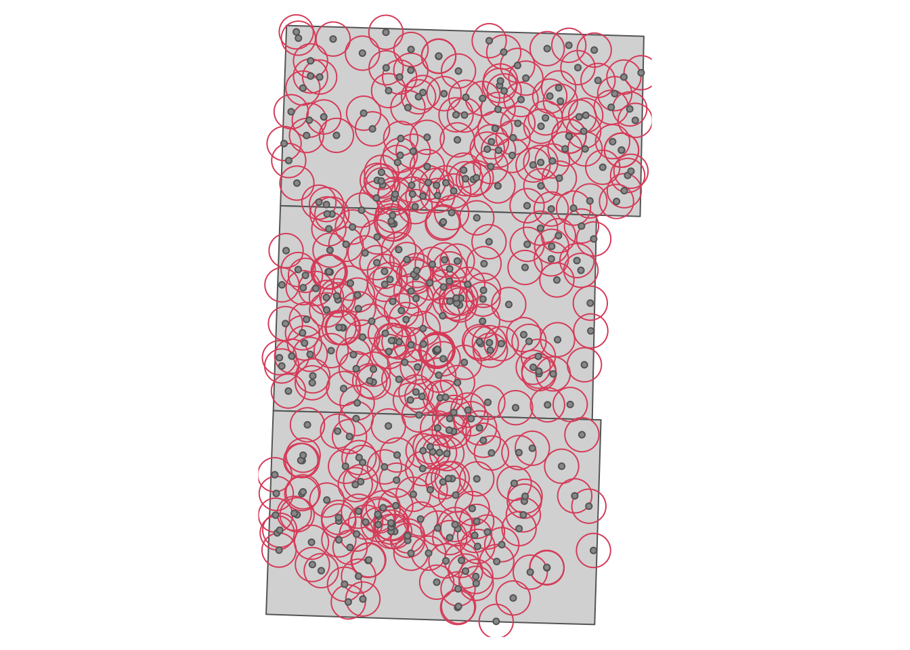
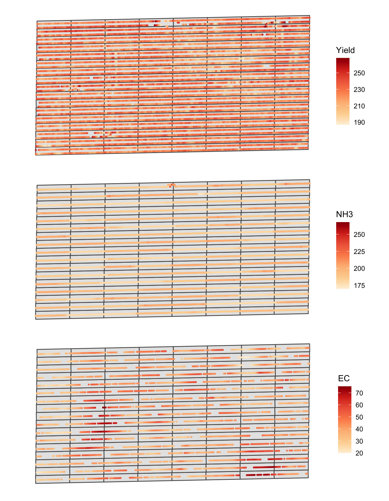
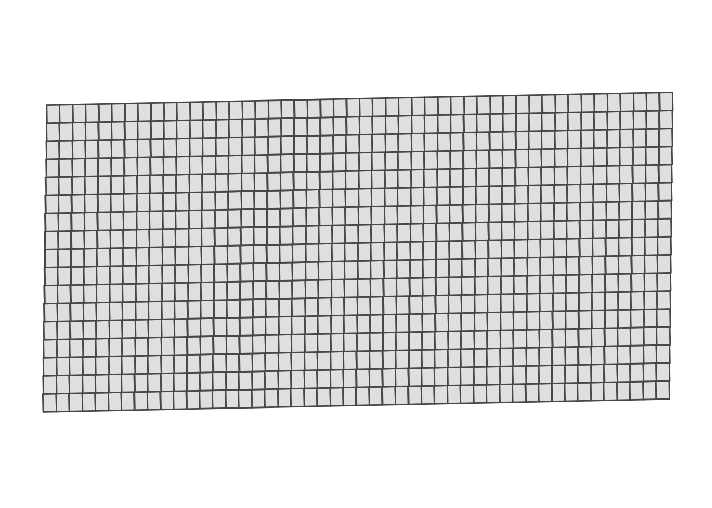
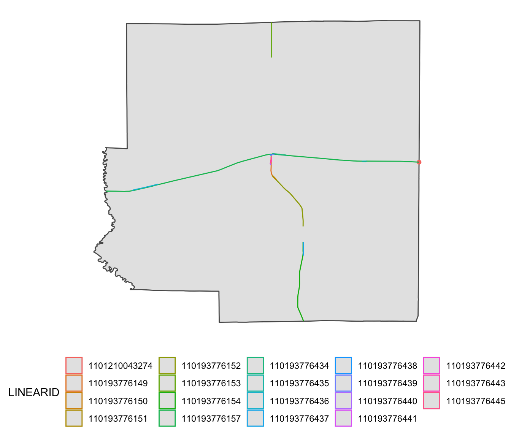
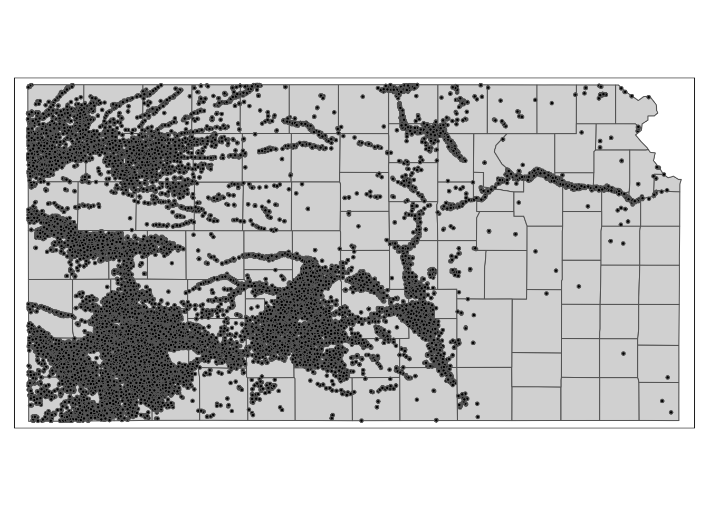

# R as GIS: Demonstrations {#demo} 


## Before you start {-}

The primary objective of this chapter is to showcase the power of R as GIS through demonstrations using mock-up econometric research projects^[Note that this lecture does not deal with spatial econometrics at all. This lecture is about spatial data processing, not spatial econometrics. [This](http://www.econ.uiuc.edu/~lab/workshop/Spatial_in_R.html) is a great resource for spatial econometrics in R.]. Each project consists of a project overview (objective, datasets used, econometric model, and GIS tasks involved) and demonstration. This is really not a place you learn the nuts and bolts of how R does spatial operations. Indeed, we intentionally do not explain all the details of how the R codes work. We reiterate that the main purpose of the demonstrations is to get you a better idea of how R can be used to process spatial data to help your research projects involving spatial datasets. Finally, note that these *mock-up* projects use extremely simple econometric models that completely lacks careful thoughts you would need in real research projects. So, don't waste your time judging the econometric models, and just focus on GIS tasks. If you are not familiar with html documents generated by `rmarkdown`, you might benefit from reading the conventions of the book in the Preface.

### Target Audience {-}

The target audience of this chapter is those who are not very familiar with R as GIS. Knowledge of R certainly helps. But, I tried to write in a way that R beginners can still understand the power of R as GIS^[I welcome any suggestions to improve the reading experience of unexperienced R users.]. Do not get bogged down by all the complex-looking R codes. Just focus on the narratives and figures to get a sense of what R can do.

### Direction for replication {-}

Running the codes in this chapter involves reading datasets from a disk. All the datasets that will be imported are available [here](https://www.dropbox.com/sh/cyx9clgmshwc8eo/AAApv03Qpx84IGKCyF5v2rJ6a?dl=0). In this chapter, the path to files is set relative to my own working directory (which is hidden). To run the codes without having to mess with paths to the files, follow these steps:^[I thought about using the `here` package, but I found it a bit confusing for unexperienced R users.]

+ set a folder (any folder) as the working directory using `setwd()`  
+ create a folder called "Data" inside the folder designated as the working directory  
+ download the pertinent datasets from [here](https://www.dropbox.com/sh/cyx9clgmshwc8eo/AAApv03Qpx84IGKCyF5v2rJ6a?dl=0) and put them in the "Data" folder
+ run _Chap_1_Demonstration.R_ which is included in the datasets folder you have downloaded


```r
source("Data/Chap_1_Demonstration.R")
```

Note that the data folder includes 183-day worth of PRISM precipitation data for Demonstration 3, which are quite large in size (slightly less than 1 GB). If you are not replicating Demonstration 3, you can either choose not to download them or discard them if you have downloaded them already.

## Demonstration 1: The impact of groundwater pumping on depth to water table {#Demo1}

<!-- this is for making stargazer table nicer -->

<style>
.book .book-body .page-wrapper .page-inner section.normal table
{
  width:auto;
}
.book .book-body .page-wrapper .page-inner section.normal table td,
.book .book-body .page-wrapper .page-inner section.normal table th,
.book .book-body .page-wrapper .page-inner section.normal table tr
{
  padding:0;
  border:0;
  background-color:#fff;
}
</style>

### Project Overview

---

**Objective:**

* Understand the impact of groundwater pumping on groundwater level. 

---

**Datasets**

* Groundwater pumping by irrigation wells in Chase, Dundy, and Perkins Counties in the southwest corner of Nebraska 
* Groundwater levels observed at USGS monitoring wells located in the three counties and retrieved from the National Water Information System (NWIS) maintained by USGS using the `dataRetrieval` package.

---

**Econometric Model**

In order to achieve the project objective, we will estimate the following model:

$$
 y_{i,t} - y_{i,t-1} = \alpha + \beta gw_{i,t-1} + v
$$

where $y_{i,t}$ is the depth to groundwater table^[the distance from the surface to the top of the aquifer] in March^[For our geographic focus of southwest Nebraska, corn is the dominant crop type. Irrigation for corn happens typically between April through September. For example, this means that changes in groundwater level ($y_{i,2012} - y_{i,2011}$) captures the impact of groundwater pumping that occurred April through September in 2011.] in year $t$ at USGS monitoring well $i$, and $gw_{i,t-1}$ is the total amount of groundwater pumping that happened within the 2-mile radius of the monitoring well $i$. 

---

**GIS tasks**

* read an ESRI shape file as an `sf` (spatial) object 
  - use `sf::st_read()`
* download depth to water table data using the `dataRetrieval` package developed by USGS 
  - use `dataRetrieval::readNWISdata()` and `dataRetrieval::readNWISsite()`
* create a buffer around USGS monitoring wells
  - use `sf::st_buffer()`
* convert a regular `data.frame` (non-spatial) with geographic coordinates into an `sf` (spatial) objects
  - use `sf::st_as_sf()`  and `sf::st_set_crs()`
* reproject an `sf` object to another CRS
  - use `sf::st_transform()`
* identify irrigation wells located inside the buffers and calculate total pumping
  - use `sf::st_join()`

---

**packages**

+ Load (install first if you have not) the following packages if you intend to replicate the demonstration.


```r
library(sf)
library(dplyr)
library(lubridate)
library(stargazer)
```

There are other packages that will be loaded during the demonstration.

### Project Demonstration

The geographic focus of the project is the southwest corner of Nebraska consisting of Chase, Dundy, and Perkins County (see Figure \@ref(fig:NE-county) for their locations within Nebraska). Let's read a shape file of the three counties represented as polygons. We will use it later to spatially filter groundwater level data downloaded from NWIS.


```r
three_counties <- st_read(dsn = "./Data", layer = "urnrd") %>% 
  #--- project to WGS84/UTM 14N ---#
  st_transform(32614)
```

```
Reading layer `urnrd' from data source `/Users/tmieno2/Dropbox/TeachingUNL/RGIS_Econ/Data' using driver `ESRI Shapefile'
Simple feature collection with 3 features and 1 field
geometry type:  POLYGON
dimension:      XY
bbox:           xmin: -102.0518 ymin: 40.00257 xmax: -101.248 ymax: 41.00395
CRS:            4269
```

<div class="figure">

<p class="caption">(\#fig:NE-county)The location of Chase, Dundy, and Perkins County in Nebraska</p>
</div>
---

We have already collected groundwater pumping data, so let's import it. 


```r
#--- groundwater pumping data ---#
(
urnrd_gw <- readRDS("./Data/urnrd_gw_pumping.rds")
)
```

```
       well_id year  vol_af      lon     lat
    1:    1706 2007 182.566 245322.3 4542717
    2:    2116 2007  46.328 245620.9 4541125
    3:    2583 2007  38.380 245660.9 4542523
    4:    2597 2007  70.133 244816.2 4541143
    5:    3143 2007 135.870 243614.0 4541579
   ---                                      
18668:    2006 2012 148.713 284782.5 4432317
18669:    2538 2012 115.567 284462.6 4432331
18670:    2834 2012  15.766 283338.0 4431341
18671:    2834 2012 381.622 283740.4 4431329
18672:    4983 2012      NA 284636.0 4432725
```

`well_id` is the unique irrigation well identifier, and `vol_af` is the amount of groundwater pumped in acre-feet. This dataset is just a regular `data.frame` with coordinates. We need to convert this dataset into a object of class `sf` so that we can later identify irrigation wells located within a 2-mile radius of USGS monitoring wells (see Figure \@ref(fig:sp-dist-wells) for the spatial distribution of the irrigation wells).


```r
urnrd_gw_sf <- urnrd_gw %>% 
  #--- convert to sf ---#
  st_as_sf(coords = c("lon", "lat")) %>% 
  #--- set CRS WGS UTM 14 (you need to know the CRS of the coordinates to do this) ---# 
  st_set_crs(32614) 

#--- now sf ---#
urnrd_gw_sf
```

```
Simple feature collection with 18672 features and 3 fields
geometry type:  POINT
dimension:      XY
bbox:           xmin: 239959 ymin: 4431329 xmax: 310414.4 ymax: 4543146
CRS:            EPSG:32614
First 10 features:
   well_id year  vol_af                 geometry
1     1706 2007 182.566 POINT (245322.3 4542717)
2     2116 2007  46.328 POINT (245620.9 4541125)
3     2583 2007  38.380 POINT (245660.9 4542523)
4     2597 2007  70.133 POINT (244816.2 4541143)
5     3143 2007 135.870   POINT (243614 4541579)
6     5017 2007 196.799 POINT (243539.9 4543146)
7     1706 2008 171.250 POINT (245322.3 4542717)
8     2116 2008 171.650 POINT (245620.9 4541125)
9     2583 2008  46.100 POINT (245660.9 4542523)
10    2597 2008 124.830 POINT (244816.2 4541143)
```

<div class="figure">

<p class="caption">(\#fig:sp-dist-wells)Spatial distribution of irrigation wells</p>
</div>
---

Here are the rest of the steps we will take to obtain a regression-ready dataset for our analysis.

1. download groundwater level data observed at USGS monitoring wells from National Water Information System (NWIS) using the `dataRetrieval` package 
2. identify the irrigation wells located within the 2-mile radius of the USGS wells and calculate the total groundwater pumping that occurred around each of the USGS wells by year 
3. merge the groundwater pumping data to the groundwater level data

---

Let's download groundwater level data from NWIS first. The following code downloads groundwater level data for Nebraska from Jan 1, 1990, through Jan 1, 2016.


```r
#--- load the dataRetrieval package ---#
library(dataRetrieval)

#--- download groundwater level data ---#
NE_gwl <- readNWISdata(
    stateCd="Nebraska", 
    startDate = "1990-01-01", 
    endDate = "2016-01-01", 
    service = "gwlevels"
  ) %>% 
  dplyr::select(site_no, lev_dt, lev_va) %>% 
  rename(date = lev_dt, dwt = lev_va) 

#--- take a look ---#
head(NE_gwl, 10)
```


```
           site_no       date   dwt
1  400008097545301 2000-11-08 17.40
2  400008097545301 2008-10-09 13.99
3  400008097545301 2009-04-09 11.32
4  400008097545301 2009-10-06 15.54
5  400008097545301 2010-04-12 11.15
6  400008100050501 1990-03-15 24.80
7  400008100050501 1990-10-04 27.20
8  400008100050501 1991-03-08 24.20
9  400008100050501 1991-10-07 26.90
10 400008100050501 1992-03-02 24.70
```

`site_no` is the unique monitoring well identifier, `date` is the date of groundwater level monitoring, and `dwt` is depth to water table. 

We calculate the average groundwater level in March by USGS monitoring well (right before the irrigation season starts):^[`month()` and `year()` are from the `lubridate` package. They extract month and year from a `Date` object.]


```r
#--- Average depth to water table in March ---#
NE_gwl_march <- NE_gwl %>% 
  mutate(
    date = as.Date(date),
    month = month(date),
    year = year(date),
  ) %>% 
  #--- select observation in March ---#
  filter(year >= 2007, month == 3) %>% 
  #--- gwl average in March ---#
  group_by(site_no, year) %>% 
  summarize(dwt  = mean(dwt))

#--- take a look ---#
head(NE_gwl_march, 10)
```

```
# A tibble: 10 x 3
# Groups:   site_no [2]
   site_no          year   dwt
   <chr>           <dbl> <dbl>
 1 400032101022901  2008 118. 
 2 400032101022901  2009 117. 
 3 400032101022901  2010 118. 
 4 400032101022901  2011 118. 
 5 400032101022901  2012 118. 
 6 400032101022901  2013 118. 
 7 400032101022901  2014 116. 
 8 400032101022901  2015 117. 
 9 400038099244601  2007  24.3
10 400038099244601  2008  21.7
```

Since `NE_gwl` is missing geographic coordinates for the monitoring wells, we will download them using the `readNWISsite()` function and select only the monitoring wells that are inside the three counties.  


```r
#--- get the list of site ids ---#  
NE_site_ls <- NE_gwl$site_no %>% unique()

#--- get the locations of the site ids ---#  
sites_info <- readNWISsite(siteNumbers = NE_site_ls) %>% 
  dplyr::select(site_no, dec_lat_va, dec_long_va) %>% 
  #--- turn the data into an sf object ---#
  st_as_sf(coords = c("dec_long_va", "dec_lat_va")) %>% 
  #--- NAD 83 ---#
  st_set_crs(4269) %>% 
  #--- project to WGS UTM 14 ---#
  st_transform(32614) %>% 
  #--- keep only those located inside the three counties ---#
  .[three_counties, ]
```

---

We now identify irrigation wells that are located within the 2-mile radius of the monitoring wells^[This can alternatively be done using the `st_is_within_distance()` function.]. We first create polygons of 2-mile radius circles around the monitoring wells (see Figure \@ref(fig:buffer-map)).


```r
buffers <- st_buffer(sites_info, dist = 2*1609.34) # in meter
```

<div class="figure">

<p class="caption">(\#fig:buffer-map)2-mile buffers around USGS monitoring wells</p>
</div>

We now identify which irrigation wells are inside each of the buffers and get the associated groundwater pumping values. The `st_join()` function from the `sf` package will do the trick.


```r
#--- find irrigation wells inside the buffer and calculate total pumping  ---#
pumping_neaby <- st_join(buffers, urnrd_gw_sf)
```

Let's take a look at a USGS monitoring well (`site_no` = $400012101323401$).


```r
filter(pumping_neaby, site_no == 400012101323401, year == 2010)
```

```
Simple feature collection with 7 features and 4 fields
geometry type:  POLYGON
dimension:      XY
bbox:           xmin: 279690.7 ymin: 4428006 xmax: 286128 ymax: 4434444
CRS:            EPSG:32614
          site_no well_id year  vol_af                       geometry
1 400012101323401    6331 2010      NA POLYGON ((286128 4431225, 2...
2 400012101323401    1883 2010 180.189 POLYGON ((286128 4431225, 2...
3 400012101323401    2006 2010  79.201 POLYGON ((286128 4431225, 2...
4 400012101323401    2538 2010  68.205 POLYGON ((286128 4431225, 2...
5 400012101323401    2834 2010      NA POLYGON ((286128 4431225, 2...
6 400012101323401    2834 2010 122.981 POLYGON ((286128 4431225, 2...
7 400012101323401    4983 2010      NA POLYGON ((286128 4431225, 2...
```

As you can see, this well has seven irrigation wells within its 2-mile radius in 2010.   

Now, we will get total nearby pumping by monitoring well and year. 


```r
(
total_pumping_nearby <- pumping_neaby %>% 
  #--- calculate total pumping by monitoring well ---#
  group_by(site_no, year) %>% 
  summarize(nearby_pumping = sum(vol_af, na.rm = TRUE)) %>% 
  #--- NA means 0 pumping ---#  
  mutate(
    nearby_pumping = ifelse(is.na(nearby_pumping), 0, nearby_pumping)
  )
)
```

```
Simple feature collection with 2396 features and 3 fields
geometry type:  POLYGON
dimension:      XY
bbox:           xmin: 237904.5 ymin: 4428006 xmax: 313476.5 ymax: 4545687
CRS:            EPSG:32614
# A tibble: 2,396 x 4
# Groups:   site_no [401]
   site_no      year nearby_pumping                                     geometry
 * <chr>       <int>          <dbl>                                <POLYGON [m]>
 1 4000121013…  2007           571. ((286128 4431225, 286123.6 4431057, 286110.…
 2 4000121013…  2008           772. ((286128 4431225, 286123.6 4431057, 286110.…
 3 4000121013…  2009           500. ((286128 4431225, 286123.6 4431057, 286110.…
 4 4000121013…  2010           451. ((286128 4431225, 286123.6 4431057, 286110.…
 5 4000121013…  2011           545. ((286128 4431225, 286123.6 4431057, 286110.…
 6 4000121013…  2012          1028. ((286128 4431225, 286123.6 4431057, 286110.…
 7 4001301013…  2007           485. ((278847.4 4433844, 278843 4433675, 278829.…
 8 4001301013…  2008           515. ((278847.4 4433844, 278843 4433675, 278829.…
 9 4001301013…  2009           351. ((278847.4 4433844, 278843 4433675, 278829.…
10 4001301013…  2010           374. ((278847.4 4433844, 278843 4433675, 278829.…
# … with 2,386 more rows
```

---

We now merge nearby pumping data to the groundwater level data, and transform the data to obtain the dataset ready for regression analysis.


```r
#--- regression-ready data ---#
reg_data <- NE_gwl_march %>% 
  #--- pick monitoring wells that are inside the three counties ---#
  filter(site_no %in% unique(sites_info$site_no)) %>% 
  #--- merge with the nearby pumping data ---#
  left_join(., total_pumping_nearby, by = c("site_no", "year")) %>% 
  #--- lead depth to water table ---#
  arrange(site_no, year) %>% 
  group_by(site_no) %>% 
  mutate(
    #--- lead depth ---#
    dwt_lead1 = dplyr::lead(dwt, n = 1, default = NA, order_by = year),
    #--- first order difference in dwt  ---#
    dwt_dif  = dwt_lead1 - dwt
  )  

#--- take a look ---#
dplyr::select(reg_data, site_no, year, dwt_dif, nearby_pumping)
```

```
# A tibble: 2,022 x 4
# Groups:   site_no [230]
   site_no          year dwt_dif nearby_pumping
   <chr>           <dbl>   <dbl>          <dbl>
 1 400130101374401  2011   NA              358.
 2 400134101483501  2007    2.87          2038.
 3 400134101483501  2008    0.78          2320.
 4 400134101483501  2009   -2.45          2096.
 5 400134101483501  2010    3.97          2432.
 6 400134101483501  2011    1.84          2634.
 7 400134101483501  2012   -1.35           985.
 8 400134101483501  2013   44.8             NA 
 9 400134101483501  2014  -26.7             NA 
10 400134101483501  2015   NA               NA 
# … with 2,012 more rows
```

---

Finally, we estimate the model using the `lfe` package.


```r
#--- load the lfe package for regression with fixed effects ---#
library(lfe)

#--- OLS with site_no and year FEs (error clustered by site_no) ---#
reg_dwt <- felm(dwt_dif ~ nearby_pumping | site_no + year | 0 | site_no, data = reg_data)
```

Here is the regression result.


```r
stargazer(reg_dwt, type = "html")
```


<table style="text-align:center"><tr><td colspan="2" style="border-bottom: 1px solid black"></td></tr><tr><td style="text-align:left"></td><td><em>Dependent variable:</em></td></tr>
<tr><td></td><td colspan="1" style="border-bottom: 1px solid black"></td></tr>
<tr><td style="text-align:left"></td><td>dwt_dif</td></tr>
<tr><td colspan="2" style="border-bottom: 1px solid black"></td></tr><tr><td style="text-align:left">nearby_pumping</td><td>0.001<sup>***</sup></td></tr>
<tr><td style="text-align:left"></td><td>(0.0001)</td></tr>
<tr><td style="text-align:left"></td><td></td></tr>
<tr><td colspan="2" style="border-bottom: 1px solid black"></td></tr><tr><td style="text-align:left">Observations</td><td>1,342</td></tr>
<tr><td style="text-align:left">R<sup>2</sup></td><td>0.409</td></tr>
<tr><td style="text-align:left">Adjusted R<sup>2</sup></td><td>0.286</td></tr>
<tr><td style="text-align:left">Residual Std. Error</td><td>1.493 (df = 1111)</td></tr>
<tr><td colspan="2" style="border-bottom: 1px solid black"></td></tr><tr><td style="text-align:left"><em>Note:</em></td><td style="text-align:right"><sup>*</sup>p<0.1; <sup>**</sup>p<0.05; <sup>***</sup>p<0.01</td></tr>
</table>

## Demonstration 2: Precision Agriculture


<style>
.book .book-body .page-wrapper .page-inner section.normal table
{
  width:auto;
}
.book .book-body .page-wrapper .page-inner section.normal table td,
.book .book-body .page-wrapper .page-inner section.normal table th,
.book .book-body .page-wrapper .page-inner section.normal table tr
{
  padding:0;
  border:0;
  background-color:#fff;
}
</style>

### Project Overview

---

**Objectives:**

+ Understand the impact of nitrogen on corn yield 
+ Understand how electric conductivity (EC) affects the marginal impact of nitrogen on corn 

---

**Datasets:**

+ The experimental design of an on-farm randomized nitrogen trail on an 80-acre field 
+ Data generated by the experiment
  * As-applied nitrogen rate
  * Yield measures 
+ Electric conductivity 

---

**Econometric Model:**

Here is the econometric model, we would like to estimate:

$$
yield_i = \beta_0 + \beta_1 N_i + \beta_2 N_i^2 + \beta_3 N_i \cdot EC_i + \beta_4 N_i^2 \cdot EC_i + v_i
$$

where $yield_i$, $N_i$, $EC_i$, and $v_i$ are corn yield, nitrogen rate, EC, and error term at subplot $i$. Subplots which are obtained by dividing experimental plots into six of equal-area compartments.  

---

**GIS tasks**

* read spatial data in various formats: R data set (rds), shape file, and GeoPackage file
  - use `sf::st_read()` 
* create maps using the `ggplot2` package
  - use `ggplot2::geom_sf()`
* create subplots within experimental plots
  - use-defined function that makes use of `st_geometry()` 
* identify corn yield, as-applied nitrogen, and electric conductivity (EC) data points within each of the experimental plots and find their averages
  - use `sf::st_join()` and   `sf::aggregate()`

---

**Preparation for replication**

+ Source (run) *Chap_1_Demonstration.R* to define `theme_map` and `gen_subplots()`


```r
source("Codes/Chap_1_Demonstration.R")
```

+ Load (install first if you have not) the following packages (There are other packages that will be loaded during the demonstration).


```r
library(sf)
library(dplyr)
library(ggplot2)
library(stargazer)
```

### Project Demonstration

We have already run a whole-field randomized nitrogen experiment on a 80-acre field. Let's import the trial design data


```r
#--- read the trial design data ---#
trial_design_16 <- readRDS("./Data/trial_design.rds")
```

Figure \@ref(fig:trial-fig) is the map of the trial design generated using `ggplot2` package.^[`theme_for_map` is a user defined object that defines the theme of figures generated using `ggplot2` for this section. You can find it in **Chap_1_Demonstration.R**.].


```r
#--- map of trial design ---#
ggplot(data = trial_design_16) +
  geom_sf(aes(fill = factor(NRATE))) +
  scale_fill_brewer(name = "N", palette = "OrRd", direction = 1) +
  theme_for_map
```

<div class="figure">

<p class="caption">(\#fig:trial-fig)The Experimental Design of the Randomize Nitrogen Trial</p>
</div>

---

We have collected yield, as-applied NH3, and EC data. Let's read in these datasets:^[Here we are demonstrating that R can read spatial data in different formats. R can read spatial data of many other formats. Here, we are reading a shapefile (.shp) and GeoPackage file (.gpkg).]


```r
#--- read yield data (sf data saved as rds) ---#
yield <- readRDS("./Data/yield.rds")

#--- read NH3 data (GeoPackage data) ---#
NH3_data <- st_read("Data/NH3.gpkg")

#--- read ec data (shape file) ---#
ec <- st_read(dsn="Data", "ec")
```

Figure \@ref(fig:Demo2-show-the-map) shows the spatial distribution of the three variables. A map of each variable was made first, and then they are combined into one figure using the `patchwork` package^[Here is its [github page](https://github.com/thomasp85/patchwork). See the bottom of the page to find vignettes.].


```r
#--- yield map ---#
g_yield <- ggplot() +
  geom_sf(data = trial_design_16) +
  geom_sf(data = yield, aes(color = yield), size = 0.5) +
  scale_color_distiller(name = "Yield", palette = "OrRd", direction = 1) +
  theme_for_map

#--- NH3 map ---#
g_NH3 <- ggplot() +
  geom_sf(data = trial_design_16) +
  geom_sf(data = NH3_data, aes(color = aa_NH3), size = 0.5) +
  scale_color_distiller(name = "NH3", palette = "OrRd", direction = 1) +
  theme_for_map

#--- NH3 map ---#
g_ec <- ggplot() +
  geom_sf(data = trial_design_16) +
  geom_sf(data = ec, aes(color = ec), size = 0.5) +
  scale_color_distiller(name = "EC", palette = "OrRd", direction = 1) +
  theme_for_map

#--- stack the figures vertically and display  ---#
library(patchwork)
g_yield/g_NH3/g_ec
```

<div class="figure">

<p class="caption">(\#fig:Demo2-show-the-map)Spatial distribution of yield, NH3, and EC</p>
</div>

---

Instead of using plot as the observation unit, we would like to create subplots inside each of the plots and make them the unit of analysis because it would avoid masking the within-plot spatial heterogeneity of EC. Here, we divide each plot into six subplots^[`gen_subplots` is a user-defined function. See **Chap_1_Demonstration.R**.]:


```r
#--- generate subplots ---#
subplots <- lapply(
  1:nrow(trial_design_16), 
  function(x) gen_subplots(trial_design_16[x, ], 6)
  ) %>% 
  do.call('rbind', .) 
```

Figure \@ref(fig:map-subgrid) is a map of the subplots generated.


```r
#--- here is what subplots look like ---#
ggplot(subplots) +
  geom_sf() +
  theme_for_map
```

<div class="figure">

<p class="caption">(\#fig:map-subgrid)Map of the subplots</p>
</div>

---

We now identify the mean value of corn yield, nitrogen rate, and EC for each of the subplots using `sf::aggregate()` and `sf::st_join()`.


```r
(
reg_data <- subplots %>% 
  #--- yield ---#
  st_join(., aggregate(yield, ., mean), join = st_equals) %>%
  #--- nitrogen ---#
  st_join(., aggregate(NH3_data, ., mean), join = st_equals) %>%
  #--- EC ---#
  st_join(., aggregate(ec, ., mean), join = st_equals)
)
```

```
Simple feature collection with 816 features and 3 fields
geometry type:  POLYGON
dimension:      XY
bbox:           xmin: 560121.3 ymin: 4533410 xmax: 560758.9 ymax: 4533734
CRS:            EPSG:26914
First 10 features:
      yield   aa_NH3       ec                       geometry
1  220.1789 194.5155 28.33750 POLYGON ((560121.3 4533428,...
2  218.9671 194.4291 29.37667 POLYGON ((560134.5 4533428,...
3  220.3286 195.2903 30.73600 POLYGON ((560147.7 4533428,...
4  215.3121 196.7649 32.24000 POLYGON ((560160.9 4533429,...
5  216.9709 195.2199 36.27000 POLYGON ((560174.1 4533429,...
6  227.8761 184.6362 31.21000 POLYGON ((560187.3 4533429,...
7  226.0991 179.2143 31.99250 POLYGON ((560200.5 4533430,...
8  225.3973 179.0916 31.56500 POLYGON ((560213.7 4533430,...
9  221.1820 178.9585 33.01000 POLYGON ((560227 4533430, 5...
10 219.4659 179.0057 41.89750 POLYGON ((560240.2 4533430,...
```

Here are the visualization of the subplot-level data (Figure \@ref(fig:Demo2-subplot-fig)):  


```r
(ggplot() +
  geom_sf(data = reg_data, aes(fill = yield), color = NA) +
  scale_fill_distiller(name = "Yield", palette = "OrRd", direction = 1) +
  theme_for_map)/
(ggplot() +
  geom_sf(data = reg_data, aes(fill = aa_NH3), color = NA) +
  scale_fill_distiller(name = "NH3", palette = "OrRd", direction = 1) +
  theme_for_map)/
(ggplot() +
  geom_sf(data = reg_data, aes(fill = ec), color = NA) +
  scale_fill_distiller(name = "EC", palette = "OrRd", direction = 1) +
  theme_for_map)
```

<div class="figure">

<p class="caption">(\#fig:Demo2-subplot-fig)Spatial distribution of subplot-level yield, NH3, and EC</p>
</div>

---

Let's estimate the model and see the results:


```r
lm(yield ~ aa_NH3 + I(aa_NH3^2) + I(aa_NH3*ec) + I(aa_NH3^2*ec), data = reg_data) %>% 
  stargazer(type = "html")
```


<table style="text-align:center"><tr><td colspan="2" style="border-bottom: 1px solid black"></td></tr><tr><td style="text-align:left"></td><td><em>Dependent variable:</em></td></tr>
<tr><td></td><td colspan="1" style="border-bottom: 1px solid black"></td></tr>
<tr><td style="text-align:left"></td><td>yield</td></tr>
<tr><td colspan="2" style="border-bottom: 1px solid black"></td></tr><tr><td style="text-align:left">aa_NH3</td><td>-1.223</td></tr>
<tr><td style="text-align:left"></td><td>(1.308)</td></tr>
<tr><td style="text-align:left"></td><td></td></tr>
<tr><td style="text-align:left">I(aa_NH32)</td><td>0.004</td></tr>
<tr><td style="text-align:left"></td><td>(0.003)</td></tr>
<tr><td style="text-align:left"></td><td></td></tr>
<tr><td style="text-align:left">I(aa_NH3 * ec)</td><td>0.002</td></tr>
<tr><td style="text-align:left"></td><td>(0.003)</td></tr>
<tr><td style="text-align:left"></td><td></td></tr>
<tr><td style="text-align:left">I(aa_NH32 * ec)</td><td>-0.00001</td></tr>
<tr><td style="text-align:left"></td><td>(0.00002)</td></tr>
<tr><td style="text-align:left"></td><td></td></tr>
<tr><td style="text-align:left">Constant</td><td>327.993<sup>***</sup></td></tr>
<tr><td style="text-align:left"></td><td>(125.638)</td></tr>
<tr><td style="text-align:left"></td><td></td></tr>
<tr><td colspan="2" style="border-bottom: 1px solid black"></td></tr><tr><td style="text-align:left">Observations</td><td>784</td></tr>
<tr><td style="text-align:left">R<sup>2</sup></td><td>0.010</td></tr>
<tr><td style="text-align:left">Adjusted R<sup>2</sup></td><td>0.005</td></tr>
<tr><td style="text-align:left">Residual Std. Error</td><td>5.712 (df = 779)</td></tr>
<tr><td style="text-align:left">F Statistic</td><td>2.023<sup>*</sup> (df = 4; 779)</td></tr>
<tr><td colspan="2" style="border-bottom: 1px solid black"></td></tr><tr><td style="text-align:left"><em>Note:</em></td><td style="text-align:right"><sup>*</sup>p<0.1; <sup>**</sup>p<0.05; <sup>***</sup>p<0.01</td></tr>
</table>


## Demonstration 3: Land Use and Weather


<style>
.book .book-body .page-wrapper .page-inner section.normal table
{
  width:auto;
}
.book .book-body .page-wrapper .page-inner section.normal table td,
.book .book-body .page-wrapper .page-inner section.normal table th,
.book .book-body .page-wrapper .page-inner section.normal table tr
{
  padding:0;
  border:0;
  background-color:#fff;
}
</style>

### Project Overview

---

**Objective**

Understand the impact of past precipitation on crop choice in Iowa (IA). 

---

**Datasets**

+ IA county boundary 
+ Regular grids over IA, created using `sf::st_make_grid()` 
+ PRISM daily precipitation data downloaded using `prism` package
+ Land use data from the Cropland Data Layer (CDL) for IA in 2015, downloaded using `cdlTools` package

---

**Econometric Model**

The econometric model we would like to estimate is:

$$
 CS_i = \alpha + \beta_1 PrN_{i} + \beta_2 PrC_{i} + v_i
$$
where $CS_i$ is the area share of corn divided by that of soy in 2015 for grid $i$ (we will generate regularly-sized grids in the Demo section), $PrN_i$ is the total precipitation observed in April through May and September  in 2014, $PrC_i$ is the total precipitation observed in June through August in 2014, and $v_i$ is the error term. To run the econometric model, we need to find crop share and weather variables observed at the grids. We first tackle the crop share variable, and then the precipitation variable.

---

**GIS tasks**

+ download Cropland Data Layer (CDL) data by USDA NASS 
  * use `cdlTools::getCDL()`
+ download PRISM weather data
  * use `prism::get_prism_dailys()`
+ crop PRISM data to the geographic extent of IA 
  * use `raster::crop()`
+ create regular grids within IA, which become the observation units of the econometric analysis
  * use `sf::st_make_grid()` 
+ remove grids that share small area with IA 
  * use `sf::st_intersection()` and `sf::st_area`
+ assign crop share and weather data to each of the generated IA grids (parallelized)
  * use `exactextractr::exact_extract()` and `future.apply::future_lapply()`
+ create maps 
  * use `tmap` package

---

**Preparation for replication**

+ Load (install first if you have not) the following packages (There are other packages that will be loaded during the demonstration).


```r
library(sf)
library(data.table)
library(dplyr)
library(raster)
library(lubridate)
library(tmap)
library(future.apply)
library(stargazer)
```

### Project Demonstration

The geographic focus of this project is IA. Let's get IAs state border (see Figure \@ref(fig:IA-map) for its map).


```r
library("maps")

#--- IA state boundary ---#
IA_boundary <- st_as_sf(map("state", "iowa", plot = FALSE, fill = TRUE)) 
```

<div class="figure">

<p class="caption">(\#fig:IA-map)IA state boundary</p>
</div>

The unit of analysis is artificial grids that we create over IA. The grids are regularly-sized rectangles except around the edge of the IA state border^[We by no means are saying that this is the right geographical unit of analysis. This is just about demonstrating how R can be used for analysis done at the higher spatial resolution than county.]. So, let's create grids and remove those that do not overlap much with IA.


```r
#--- create regular grids (40 cells by 40 columns) over IA ---#
IA_grids <- IA_boundary %>% 
  #--- create grids ---#
  st_make_grid(, n = c(40, 40)) %>% 
  #--- convert to sf ---#
  st_as_sf() %>% 
  #--- find the intersections of IA grids and IA polygon ---#
  st_intersection(., IA_boundary) %>% 
  #--- calculate the area of each grid ---#
  mutate(
    area = as.numeric(st_area(.)),
    area_ratio = area/max(area)
  ) %>% 
  #--- keep only if the intersected area is large enough ---#
  filter(area_ratio > 0.8) %>% 
  #--- assign grid id for future merge ---#
  mutate(grid_id = 1:nrow(.))
```

Here is what the generated grids look like (Figure \@ref(fig:Demo4-IA-grids-map)):


```r
#--- plot the grids over the IA state border ---#
tm_shape(IA_boundary) +
  tm_polygons(col = "green") +
tm_shape(IA_grids) +
  tm_polygons(alpha = 0) +
  tm_layout(frame = FALSE)
```

<div class="figure">

<p class="caption">(\#fig:Demo4-IA-grids-map)Map of regular grids generated over IA</p>
</div>

---

Let's work on crop share data. You can download CDL data using the `getCDL()` function from the `cdlTools` package.


```r
#--- load the cdlTools package ---#
library(cdlTools)

#--- download the CDL data for IA in 2015 ---#
(
IA_cdl_2015 <- getCDL("Iowa", 2015)$IA2015
)
```

```
class      : RasterLayer 
dimensions : 11671, 17795, 207685445  (nrow, ncol, ncell)
resolution : 30, 30  (x, y)
extent     : -52095, 481755, 1938165, 2288295  (xmin, xmax, ymin, ymax)
crs        : +proj=aea +lat_1=29.5 +lat_2=45.5 +lat_0=23 +lon_0=-96 +x_0=0 +y_0=0 +ellps=GRS80 +towgs84=0,0,0,0,0,0,0 +units=m +no_defs 
source     : /private/var/folders/t4/5gnqprbn38nftyxkyk5hdwmd8hnypy/T/RtmpUSOffv/CDL_2015_19.tif 
names      : CDL_2015_19 
values     : 0, 255  (min, max)
```

The cells (30 meter by 30 meter) of the imported raster layer take a value ranging from 0 to 255. Corn and soybean are represented by 1 and 5, respectively (visualization of the CDL data is on the right).

Figure \@ref(fig:overlap-cdl-grid) shows the map of one of the IA grids and the CDL cells it overlaps with.

<div class="figure">

<p class="caption">(\#fig:overlap-cdl-grid)Spatial overlap of a IA grid and CDL layer</p>
</div>

We would like to extract all the cell values within the blue border. 

We use `exactextractr::exact_extract()` to identify which cells of the CDL raster layer fall within each of the IA grids and extract land use type values. We then find the share of corn and soybean for each of the grids.


```r
#--- reproject grids to the CRS of the CDL data ---#
IA_grids_rp_cdl <- st_transform(IA_grids, projection(IA_cdl_2015))

#--- load the exactextractr package for fast rater value extractions for polygons ---#
library(exactextractr)

#--- extract crop type values and find frequencies ---#
cdl_extracted <- exact_extract(IA_cdl_2015, IA_grids_rp_cdl) %>% 
  lapply(., function (x) data.table(x)[,.N, by = value]) %>% 
  #--- combine the list of data.tables into one data.table ---#
  rbindlist(idcol = TRUE) %>% 
  #--- find the share of each land use type ---#
  .[, share := N/sum(N), by = .id] %>% 
  .[, N := NULL] %>% 
  #--- keep only the share of corn and soy ---#
  .[value %in% c(1, 5), ]  
```

We then find the corn to soy ratio for each of the IA grids.


```r
#--- find corn/soy ratio ---#
corn_soy <- cdl_extracted %>% 
  #--- long to wide ---#
  dcast(.id ~ value, value.var = "share") %>% 
  #--- change variable names ---#
  setnames(c(".id", "1", "5"), c("grid_id", "corn_share", "soy_share")) %>% 
  #--- corn share divided by soy share ---#
  .[, c_s_ratio := corn_share / soy_share]
```

---

We are still missing daily precipitation data at the moment. We have decided to use daily weather data from PRISM. Daily PRISM data is a raster data with the cell size of 4 km by 4 km. Figure \@ref(fig:Demo4-show-prism-data) the right presents precipitation data downloaded for April 1, 2010. It covers the entire contiguous U.S.     

<div class="figure">

<p class="caption">(\#fig:Demo4-show-prism-data)Map of PRISM raster data layer</p>
</div>

Let's now download PRISM data^[You do not have to run this code to download the data. It is included in the data folder for replication ([here](https://www.dropbox.com/sh/cyx9clgmshwc8eo/AAApv03Qpx84IGKCyF5v2rJ6a?dl=0)).]. This can be done using the `get_prism_dailys()` function from the `prism` package.^[[prism github page](https://github.com/ropensci/prism)]  

<!-- not to be seen -->

```r
options(prism.path = "./Data/PRISM")

get_prism_dailys(
  type = "ppt", 
  minDate = "2014-04-01", 
  maxDate = "2014-09-30", 
  keepZip = FALSE 
)
```

When we use `get_prism_dailys()` to download data^[For this project, I could have just used monthly PRISM data, which can be downloaded using the `get_prism_monthlys()` function. But, in many applications, daily data is necessary, so I wanted to illustrate how to download and process them.], it creates one folder for each day. So, I have about 180 folders inside the folder I designated as the download destination above with the `options()` function. 

<!-- The name of the folder is expressive about what the data inside it is about. For example, the precipitation data for April 1st, 2010 is stored in the folder called "PRISM_ppt_stable_4kmD2_20100401_bil." Inside it, you will see bunch of files with exactly the same prefix, but with different extensions.   --> 

---

We now try to extract precipitation value by day for each of the IA grids by geographically overlaying IA grids onto the PRISM data layer and identify which PRISM cells each of the IA grid encompass. Figure \@ref(fig:Demo4-prism-crop) shows how the first IA grid overlaps with the PRISM cells^[Do not use `st_buffer()` for spatial objects in geographic coordinates (latitude, longitude) if you intend to use the created buffers for any serious IA (it is difficult to get the right distance parameter anyway.). Significant distortion will be introduced to the buffer due to the fact that one degree in latitude and longitude means different distances at the latitude of IA. Here, I am just creating a buffer to extract PRISM cells to display on the map.]. 


```r
#--- read a PRISM dataset ---#
prism_whole <- raster("./Data/PRISM/PRISM_ppt_stable_4kmD2_20140401_bil/PRISM_ppt_stable_4kmD2_20140401_bil.bil") 

#--- align the CRS ---#
IA_grids_rp_prism <- st_transform(IA_grids, projection(prism_whole))

#--- crop the PRISM data for the 1st IA grid ---#
PRISM_1 <- crop(prism_whole, st_buffer(IA_grids_rp_prism[1, ], dist = 0.05))

#--- map them ---#
tm_shape(PRISM_1) +
  tm_raster() +
tm_shape(IA_grids_rp_prism[1, ]) +
  tm_polygons(alpha = 0) +
  tm_layout(frame = NA)
```

<div class="figure">

<p class="caption">(\#fig:Demo4-prism-crop)Spatial overlap of an IA grid over PRISM cells</p>
</div>

As you can see, some PRISM grids are fully inside the analysis grid, while others are partially inside it. So, when assigning precipitation values to grids, we will use the coverage-weighted mean of precipitations^[In practice, this may not be advisable. The coverage fraction calculation by `exact_extract()` is done using latitude and longitude. Therefore, the relative magnitude of the fraction numbers incorrectly reflects the actual relative magnitude of the overlapped area. When the spatial resolution of the sources grids (grids from which you extract values) is much smaller relative to that of the target grids (grids to which you assign values to), then a simple average would be very similar to a coverage-weighted mean. For example, CDL consists of 30m by 30m grids, and more than $1,000$ grids are inside one analysis grid.]. 

Unlike the CDL layer, we have 183 raster layers to process. Fortunately, we can process many raster files at the same time very quickly by first "stacking" many raster files first and then applying the `exact_extract()` function. Using `future_lapply()`, we let $6$ cores take care of this task with each processing 31 files, except one of them handling only 28 files.^[Parallelization of extracting values from many raster layers for polygons are discussed in much more detail in Chapter \@ref(Efficient). When I tried stacking all 183 files into one stack and applying `exact_extract`, it did not finish the job after over five minutes. So, I terminated the process in the middle. The parallelized version gets the job done in about $30$ seconds on my desktop.]
We first get all the paths to the PRISM files. 


```r
#--- get all the dates ---#
dates_ls <- seq(as.Date("2014-04-01"), as.Date("2014-09-30"), "days") 

#--- remove hyphen ---#
dates_ls_no_hyphen <- str_remove_all(dates_ls, "-")

#--- get all the prism file names ---#
folder_name <- paste0("PRISM_ppt_stable_4kmD2_", dates_ls_no_hyphen, "_bil") 
file_name <- paste0("PRISM_ppt_stable_4kmD2_", dates_ls_no_hyphen, "_bil.bil") 
file_paths <- paste0("./Data/PRISM/", folder_name, "/", file_name)

#--- take a look ---#
head(file_paths)
```

```
[1] "./Data/PRISM/PRISM_ppt_stable_4kmD2_20140401_bil/PRISM_ppt_stable_4kmD2_20140401_bil.bil"
[2] "./Data/PRISM/PRISM_ppt_stable_4kmD2_20140402_bil/PRISM_ppt_stable_4kmD2_20140402_bil.bil"
[3] "./Data/PRISM/PRISM_ppt_stable_4kmD2_20140403_bil/PRISM_ppt_stable_4kmD2_20140403_bil.bil"
[4] "./Data/PRISM/PRISM_ppt_stable_4kmD2_20140404_bil/PRISM_ppt_stable_4kmD2_20140404_bil.bil"
[5] "./Data/PRISM/PRISM_ppt_stable_4kmD2_20140405_bil/PRISM_ppt_stable_4kmD2_20140405_bil.bil"
[6] "./Data/PRISM/PRISM_ppt_stable_4kmD2_20140406_bil/PRISM_ppt_stable_4kmD2_20140406_bil.bil"
```

We now prepare for parallelized extractions and then implement them using `future_apply()`.


```r
#--- define the number of cores to use ---#
num_core <- 6

#--- prepare some parameters for parallelization ---#
file_len <- length(file_paths)
files_per_core <- ceiling(file_len/num_core)

#--- prepare for parallel processing ---#
plan(multiprocess, workers = num_core)

#--- reproject IA grids to the CRS of PRISM data ---#
IA_grids_reprojected <- st_transform(IA_grids, projection(prism_whole))
```

Here is the function that we run in parallel over 6 cores. 


```r
#--- define the function to extract PRISM values by block of files ---#
extract_by_block <- function(i, files_per_core) {

  #--- files processed by core  ---#
  start_file_index <- (i-1) * files_per_core + 1

  #--- indexes for files to process ---#
  file_index <- seq(
    from = start_file_index,
    to = min((start_file_index + files_per_core), file_len),
    by = 1
  )

  #--- extract values ---# 
  data_temp <- file_paths[file_index] %>% # get file names
    #--- stack files ---#
    stack() %>% 
    #--- extract ---#
    exact_extract(., IA_grids_reprojected) %>% 
    #--- combine into one data set ---#
    rbindlist(idcol = "ID") %>% 
    #--- wide to long ---#
    melt(id.var = c("ID", "coverage_fraction")) %>% 
    #--- calculate "area"-weighted mean ---#
    .[, .(value = sum(value * coverage_fraction)/sum(coverage_fraction)), by = .(ID, variable)]

  return(data_temp)
}
```

Now, let's run the function in parallel and calculate precipitation by period.


```r
#--- run the function ---#
precip_by_period <- future_lapply(1:num_core, function(x) extract_by_block(x, files_per_core)) %>% rbindlist() %>% 
  #--- recover the date ---#
  .[, variable := as.Date(str_extract(variable, "[0-9]{8}"), "%Y%m%d")] %>% 
  #--- change the variable name to date ---#
  setnames("variable", "date") %>% 
  #--- define critical period ---#
  .[,critical := "non_critical"] %>% 
  .[month(date) %in% 6:8, critical := "critical"] %>% 
  #--- total precipitation by critical dummy  ---#
  .[, .(precip=sum(value)), by = .(ID, critical)] %>%
  #--- wide to long ---#
  dcast(ID ~ critical, value.var = "precip")
```


We now have grid-level crop share and precipitation data. 

---

Let's merge them and run regression.^[We can match on `grid_id` from `corn_soy` and `ID` from "precip_by_period" because `grid_id` is identical with the row number and ID variables were created so that the ID value of $i$ corresponds to $i$ th row of `IA_grids`.]


```r
#--- crop share ---#
reg_data <- corn_soy[precip_by_period, on = c(grid_id = "ID")]

#--- OLS ---#
reg_results <- lm(c_s_ratio ~ critical + non_critical, data = reg_data)
```

Here is the regression results table.


```r
#--- regression table ---#
stargazer(reg_results, type = "html")
```


<table style="text-align:center"><tr><td colspan="2" style="border-bottom: 1px solid black"></td></tr><tr><td style="text-align:left"></td><td><em>Dependent variable:</em></td></tr>
<tr><td></td><td colspan="1" style="border-bottom: 1px solid black"></td></tr>
<tr><td style="text-align:left"></td><td>c_s_ratio</td></tr>
<tr><td colspan="2" style="border-bottom: 1px solid black"></td></tr><tr><td style="text-align:left">critical</td><td>-0.002<sup>***</sup></td></tr>
<tr><td style="text-align:left"></td><td>(0.0003)</td></tr>
<tr><td style="text-align:left"></td><td></td></tr>
<tr><td style="text-align:left">non_critical</td><td>-0.0003</td></tr>
<tr><td style="text-align:left"></td><td>(0.0003)</td></tr>
<tr><td style="text-align:left"></td><td></td></tr>
<tr><td style="text-align:left">Constant</td><td>2.701<sup>***</sup></td></tr>
<tr><td style="text-align:left"></td><td>(0.161)</td></tr>
<tr><td style="text-align:left"></td><td></td></tr>
<tr><td colspan="2" style="border-bottom: 1px solid black"></td></tr><tr><td style="text-align:left">Observations</td><td>1,218</td></tr>
<tr><td style="text-align:left">R<sup>2</sup></td><td>0.058</td></tr>
<tr><td style="text-align:left">Adjusted R<sup>2</sup></td><td>0.056</td></tr>
<tr><td style="text-align:left">Residual Std. Error</td><td>0.743 (df = 1215)</td></tr>
<tr><td style="text-align:left">F Statistic</td><td>37.234<sup>***</sup> (df = 2; 1215)</td></tr>
<tr><td colspan="2" style="border-bottom: 1px solid black"></td></tr><tr><td style="text-align:left"><em>Note:</em></td><td style="text-align:right"><sup>*</sup>p<0.1; <sup>**</sup>p<0.05; <sup>***</sup>p<0.01</td></tr>
</table>

Again, do not read into the results as the econometric model is terrible.  


## Demonstration 4: The Impact of Railroad Presence on Corn Planted Acreage {#demo4}


<style>
.book .book-body .page-wrapper .page-inner section.normal table
{
  width:auto;
}
.book .book-body .page-wrapper .page-inner section.normal table td,
.book .book-body .page-wrapper .page-inner section.normal table th,
.book .book-body .page-wrapper .page-inner section.normal table tr
{
  padding:0;
  border:0;
  background-color:#fff;
}
</style>

### Project Overview

---

**Objective**

+ Understand the impact of railroad on corn planted acreage in Illinois

---

**Datasets**

+ USDA corn planted acreage for Illinois downloaded from the USDA  NationalAgricultural Statistics Service (NASS) QuickStats service using `tidyUSDA` package 
+ US railroads (line data) downloaded from [here](https://catalog.data.gov/dataset/tiger-line-shapefile-2015-nation-u-s-rails-national-shapefile)

---

**Econometric Model**

We will estimate the following model:

$$
  y_i = \beta_0 + \beta_1 RL_i + v_i
$$

where $y_i$ is corn planted acreage in county $i$ in Illinois, $RL_i$ is the total length of railroad, and $v_i$ is the error term.

---

**GIS tasks**

+ Download USDA corn planted acreage by county as a spatial dataset (`sf` object)
  * use `tidyUSDA::getQuickStat()`
+ Import US railroad shape file as a spatial dataset (`sf` object) 
  * use `sf:st_read()`
+ Spatially subset (crop) the railroad data to the geographic boundary of Illinois 
  * use `sf_1[sf_2, ]`
+ Find railroads for each county (cross-county railroad will be chopped into pieces for them to fit within a single county)
  * use `sf::st_intersection()`        
+ Calculate the travel distance of each railroad piece
  * use `sf::st_length()`

---

**Preparation for replication**

+ Load (install first if you have not) the following packages (There are other packages that will be loaded during the demonstration).


```r
library(sf)
library(ggplot2)
library(dplyr)
library(stargazer)
```

### Project Demonstration

We first download corn planted acreage data for 2018 from USDA NASS QuickStat service using `tidyUSDA` package^[In order to actually download the data, you need to obtain the API key [here](https://quickstats.nass.usda.gov/api). Once the API key was obtained, I stored it using `set_key()` from the `keyring` package, which was named "usda_nass_qs_api". In the code to the left, I retrieve the API key using `key_get("usda_nass_qs_api")` in the code.].


```r
library(keyring)
library(tidyUSDA)

(
IL_corn_planted <- getQuickstat(
    key = key_get("usda_nass_qs_api") ,
    program = "SURVEY",
    data_item = "CORN - ACRES PLANTED",
    geographic_level = "COUNTY",
    state = "ILLINOIS",
    year = "2018",
    geometry = TRUE
  )  %>% 
  #--- keep only some of the variables ---#
  dplyr::select(year, NAME, county_code, short_desc, Value)
)
```


```
Simple feature collection with 90 features and 5 fields (with 6 geometries empty)
geometry type:  MULTIPOLYGON
dimension:      XY
bbox:           xmin: -91.51308 ymin: 36.9703 xmax: -87.4952 ymax: 42.50848
CRS:            +proj=longlat +ellps=GRS80 +towgs84=0,0,0,0,0,0,0 +no_defs
First 10 features:
   year        NAME county_code           short_desc  Value
1  2018      Bureau         011 CORN - ACRES PLANTED 264000
2  2018     Carroll         015 CORN - ACRES PLANTED 134000
3  2018       Henry         073 CORN - ACRES PLANTED 226500
4  2018  Jo Daviess         085 CORN - ACRES PLANTED  98500
5  2018         Lee         103 CORN - ACRES PLANTED 236500
6  2018      Mercer         131 CORN - ACRES PLANTED 141000
7  2018        Ogle         141 CORN - ACRES PLANTED 217000
8  2018      Putnam         155 CORN - ACRES PLANTED  32300
9  2018 Rock Island         161 CORN - ACRES PLANTED  68400
10 2018  Stephenson         177 CORN - ACRES PLANTED 166500
                         geometry
1  MULTIPOLYGON (((-89.8569 41...
2  MULTIPOLYGON (((-90.16133 4...
3  MULTIPOLYGON (((-90.43227 4...
4  MULTIPOLYGON (((-90.50668 4...
5  MULTIPOLYGON (((-89.63118 4...
6  MULTIPOLYGON (((-90.99255 4...
7  MULTIPOLYGON (((-89.68598 4...
8  MULTIPOLYGON (((-89.33303 4...
9  MULTIPOLYGON (((-90.33573 4...
10 MULTIPOLYGON (((-89.9205 42...
```

A nice thing about this function is that the data is downloaded as an `sf` object with county geometry with `geometry = TRUE`. So, you can immediately plot it (Figure \@ref(fig:map-il-corn-acreage)) and use it for later spatial interactions without having to merge the downloaded data to an independent county boundary data.^[`theme_for_map` is a user defined object that defines the theme of figures generated using `ggplot2` for this section. You can find it in **Chap_1_Demonstration.R**.]. 


```r
ggplot(IL_corn_planted) +
  geom_sf(aes(fill = Value/1000)) +
  scale_fill_distiller(name = "Planted Acreage (1000 acres)", palette = "YlOrRd", trans = "reverse") +
  theme(
    legend.position = "bottom"
  ) +
  theme_for_map
```

<div class="figure">

<p class="caption">(\#fig:map-il-corn-acreage)Map of Con Planted Acreage in Illinois in 2018</p>
</div>

---

Let's import the U.S. railroad data and reproject to the CRS of `IL_corn_planted`:


```r
rail_roads <- st_read(dsn = "./Data/", layer = "tl_2015_us_rails") %>% 
  st_transform(st_crs(IL_corn_planted))
```

```
Reading layer `tl_2015_us_rails' from data source `/Users/tmieno2/Dropbox/TeachingUNL/RGIS_Econ/Data' using driver `ESRI Shapefile'
Simple feature collection with 180958 features and 3 fields
geometry type:  MULTILINESTRING
dimension:      XY
bbox:           xmin: -165.4011 ymin: 17.95174 xmax: -65.74931 ymax: 65.00006
CRS:            4269
```

Here is what it looks like:


```r
ggplot(rail_roads) +
  geom_sf() +
  theme_for_map
```

<div class="figure">

<p class="caption">(\#fig:Demo5-rail-plot)Map of Railroads</p>
</div>

We now crop it to the Illinois state border (Figure \@ref(fig:Demo5-rail-IL-plot)) using `sf_1[sf_2, ]`:


```r
rail_roads_IL <- rail_roads[IL_corn_planted, ]
```


```r
ggplot() +
  geom_sf(data = rail_roads_IL) +
  theme_for_map
```

<div class="figure">

<p class="caption">(\#fig:Demo5-rail-IL-plot)Map of railroads in Illinois</p>
</div>

Let's now find railroads for each county, where cross-county railroads will be chopped into pieces so each piece fits completely within a single county, using `st_intersection()`.


```r
rails_IL_segmented <- st_intersection(rail_roads_IL, IL_corn_planted) 
```

Here are the railroads for Richland County:


```r
ggplot() + 
  geom_sf(data = dplyr::filter(IL_corn_planted, NAME == "Richland")) +
  geom_sf(data = dplyr::filter(rails_IL_segmented, NAME == "Richland"), aes( color = LINEARID )) +
  theme(
    legend.position = "bottom"
  ) +
  theme_for_map
```



We now calculate the travel distance (Great-circle distance) of each railroad piece using `st_length()` and then sum them up by county to find total railroad length by county.


```r
(
rail_length_county <- mutate(
    rails_IL_segmented, 
    length_in_m = as.numeric(st_length(rails_IL_segmented)),
  ) %>% 
  #--- group by county ID ---#
  group_by(county_code) %>% 
  #--- sum rail length by county ---#
  summarize(length_in_m = sum(length_in_m)) %>% 
  #--- geometry no longer needed ---#
  st_drop_geometry()
)
```

```
# A tibble: 82 x 2
   county_code length_in_m
 * <chr>             <dbl>
 1 001              77221.
 2 003              77290.
 3 007              36764.
 4 011             255441.
 5 015             161726.
 6 017              30585.
 7 019             389226.
 8 021             155794.
 9 023              78587.
10 025              92030.
# … with 72 more rows
```

---

We merge the railroad length data to the corn planted acreage data and estimate the model.


```r
reg_data <- left_join(IL_corn_planted, rail_length_county, by = "county_code") 
```


```r
lm(Value ~ length_in_m, data = reg_data) %>% 
  stargazer(type = "html")
```


<table style="text-align:center"><tr><td colspan="2" style="border-bottom: 1px solid black"></td></tr><tr><td style="text-align:left"></td><td><em>Dependent variable:</em></td></tr>
<tr><td></td><td colspan="1" style="border-bottom: 1px solid black"></td></tr>
<tr><td style="text-align:left"></td><td>Value</td></tr>
<tr><td colspan="2" style="border-bottom: 1px solid black"></td></tr><tr><td style="text-align:left">length_in_m</td><td>0.092<sup>*</sup></td></tr>
<tr><td style="text-align:left"></td><td>(0.047)</td></tr>
<tr><td style="text-align:left"></td><td></td></tr>
<tr><td style="text-align:left">Constant</td><td>108,154.800<sup>***</sup></td></tr>
<tr><td style="text-align:left"></td><td>(11,418.900)</td></tr>
<tr><td style="text-align:left"></td><td></td></tr>
<tr><td colspan="2" style="border-bottom: 1px solid black"></td></tr><tr><td style="text-align:left">Observations</td><td>82</td></tr>
<tr><td style="text-align:left">R<sup>2</sup></td><td>0.046</td></tr>
<tr><td style="text-align:left">Adjusted R<sup>2</sup></td><td>0.034</td></tr>
<tr><td style="text-align:left">Residual Std. Error</td><td>69,040.680 (df = 80)</td></tr>
<tr><td style="text-align:left">F Statistic</td><td>3.866<sup>*</sup> (df = 1; 80)</td></tr>
<tr><td colspan="2" style="border-bottom: 1px solid black"></td></tr><tr><td style="text-align:left"><em>Note:</em></td><td style="text-align:right"><sup>*</sup>p<0.1; <sup>**</sup>p<0.05; <sup>***</sup>p<0.01</td></tr>
</table>

## Demonstration 5: Groundwater use for agricultural irrigation


<style>
.book .book-body .page-wrapper .page-inner section.normal table
{
  width:auto;
}
.book .book-body .page-wrapper .page-inner section.normal table td,
.book .book-body .page-wrapper .page-inner section.normal table th,
.book .book-body .page-wrapper .page-inner section.normal table tr
{
  padding:0;
  border:0;
  background-color:#fff;
}
</style>

### Project Overview

---

**Objective**
+ Understand the impact of monthly precipitation on groundwater use for agricultural irrigation

---

**Datasets**

+ Annual groundwater pumping by irrigation wells in Kansas for 2010 and 2011 (originally obtained from the Water Information Management & Analysis System (WIMAS) database)
+ Daymet^[[Daymet website](https://daymet.ornl.gov/)] daily precipitation and maximum temperature downloaded using `daymetr` package

---

**Econometric Model**

The econometric model we would like to estimate is:

$$
   y_{i,t}  = \alpha +  P_{i,t} \beta + T_{i,t} \gamma + \phi_i + \eta_t + v_{i,t}
$$

where $y$ is the total groundwater extracted in year $t$, $P_{i,t}$ and $T_{i,t}$ is the collection of monthly total precipitation and mean maximum temperature April through September in year $t$, respectively, $\phi_i$ is the well fixed effect, $\eta_t$ is the year fixed effect, and $v_{i,t}$ is the error term. 

---

**GIS tasks**

+ download Daymet precipitation and maximum temperature data for each well from within R in parallel
  * use `daymetr::download_daymet()` and `future.apply::future_lapply()`

---

### Project Demonstration

We have already collected annual groundwater pumping data by irrigation wells in 2010 and 2011 in Kansas from the Water Information Management & Analysis System (WIMAS) database. Let's read in the groundwater use data.  


```r
#--- read in the data ---#
(
gw_KS_sf <- readRDS( "./Data/gw_KS_sf.rds") 
)
```

```
Simple feature collection with 56225 features and 3 fields
geometry type:  POINT
dimension:      XY
bbox:           xmin: -102.0495 ymin: 36.99561 xmax: -94.70746 ymax: 40.00191
CRS:            EPSG:4269
First 10 features:
   well_id year   af_used                   geometry
1        1 2010  67.00000 POINT (-100.4423 37.52046)
2        1 2011 171.00000 POINT (-100.4423 37.52046)
3        3 2010  30.93438 POINT (-100.7118 39.91526)
4        3 2011  12.00000 POINT (-100.7118 39.91526)
5        7 2010   0.00000 POINT (-101.8995 38.78077)
6        7 2011   0.00000 POINT (-101.8995 38.78077)
7       11 2010 154.00000 POINT (-101.7114 39.55035)
8       11 2011 160.00000 POINT (-101.7114 39.55035)
9       12 2010  28.17239 POINT (-95.97031 39.16121)
10      12 2011  89.53479 POINT (-95.97031 39.16121)
```

We have 28553 wells in total, and each well has records of groundwater pumping (`af_used`) for years 2010 and 2011. Here is the spatial distribution of the wells. 



<!-- 
#=========================================
# Daymet data download and processing 
#=========================================
-->

--- 

We now need to get monthly precipitation and maximum temperature data. We have decided that we use [Daymet](https://daymet.ornl.gov/) weather data. Here we use the `download_daymet()` function from the `daymetr` package^[[daymetr vignette](https://cran.r-project.org/web/packages/daymetr/vignettes/daymetr-vignette.html)] that allows us to download all the weather variables for a specified geographic location and time period^[See [here]() for a fuller explanation of how to use the `daymetr` package.]. We write a wrapper function that downloads Daymet data and then processes it to find monthly total precipitation and mean maximum temperature^[This may not be ideal for a real research project because the original raw data is not kept. It is often the case that your econometric plan changes on the course of your project (e.g., using other weather variables or using different temporal aggregation of weather variables instead of monthly aggregation). When this happens, you need to download the same data all over again.]. We then loop over the 56225 wells, which is parallelized using the `future_apply()` function^[For parallelized computation, see Chapter \@ref(prallel)] from the `future.apply` package. This process takes about an hour on my Mac with parallelization on 7 cores. The data is available in the data repository for this course (named as "all_daymet.rds"). 


```r
library(daymetr)
library(future.apply)

#--- get the geographic coordinates of the wells ---#
well_locations <- gw_KS_sf %>%
  unique(by = "well_id") %>% 
  dplyr::select(well_id) %>% 
  cbind(., st_coordinates(.))

#--- define a function that downloads Daymet data by well and process it ---#
get_daymet <- function(i) {

  temp_site <- well_locations[i, ]$well_id
  temp_long <- well_locations[i, ]$X
  temp_lat <- well_locations[i, ]$Y

  data_temp <- download_daymet(
      site = temp_site,
      lat = temp_lat,
      lon = temp_long,
      start = 2010,
      end = 2011,
      #--- if TRUE, tidy data is returned ---#
      simplify = TRUE,
      #--- if TRUE, the downloaded data can be assigned to an R object ---#
      internal = TRUE
    ) %>% 
    data.table() %>% 
    #--- keep only precip and tmax ---#
    .[measurement %in% c("prcp..mm.day.", "tmax..deg.c."), ] %>%  
    #--- recover calender date from Julian day ---#
    .[, date := as.Date(paste(year, yday, sep = "-"), "%Y-%j")] %>% 
    #--- get month ---#
    .[, month := month(date)] %>% 
    #--- keep only April through September ---#
    .[month %in% 4:9,] %>% 
    .[, .(site, year, month, date, measurement, value)] %>% 
    #--- long to wide ---#
    dcast(site + year + month + date~ measurement, value.var = "value") %>% 
    #--- change variable names ---#
    setnames(c("prcp..mm.day.", "tmax..deg.c."), c("prcp", "tmax")) %>% 
    #--- find the total precip and mean tmax by month-year ---#
    .[, .(prcp = sum(prcp), tmax = mean(tmax)) , by = .(month, year)] %>% 
    .[, well_id := temp_site]

  return(data_temp)
  gc()
}
```

Here is what one run (for the first well) of `get_daymet()` returns 


```r
#--- one run ---#
(
returned_data <- get_daymet(1)[]
)
```

```
    month year prcp     tmax well_id
 1:     4 2010   42 20.96667       1
 2:     5 2010   94 24.19355       1
 3:     6 2010   70 32.51667       1
 4:     7 2010   89 33.50000       1
 5:     8 2010   63 34.17742       1
 6:     9 2010   15 31.43333       1
 7:     4 2011   25 21.91667       1
 8:     5 2011   26 26.30645       1
 9:     6 2011   23 35.16667       1
10:     7 2011   35 38.62903       1
11:     8 2011   37 36.90323       1
12:     9 2011    9 28.66667       1
```

We get the number of cores you can use by `RhpcBLASctl::get_num_procs()` and parallelize the loop over wells using `future_lapply()`.^[For Mac users, `mclapply` or `pbmclapply` (`mclapply` with progress bar) are good alternatives.]


```r
#--- prepare parallelized process ---#
library(RhpcBLASctl) 
num_core <- get_num_procs() - 1

#--- run get_daymet with parallelization ---#
(
all_daymet <- future_lapply(1:nrow(well_locations), get_daymet) %>% 
  rbindlist() 
)
```


```
        month year prcp     tmax well_id
     1:     4 2010   42 20.96667       1
     2:     5 2010   94 24.19355       1
     3:     6 2010   70 32.51667       1
     4:     7 2010   89 33.50000       1
     5:     8 2010   63 34.17742       1
    ---                                 
336980:     5 2011   18 26.11290   78051
336981:     6 2011   25 34.61667   78051
336982:     7 2011    6 38.37097   78051
336983:     8 2011   39 36.66129   78051
336984:     9 2011   23 28.45000   78051
```

---

Before merging the Daymet data, we need to reshape the data into a wide format to get monthly precipitation and maximum temperature as columns.  


```r
#--- long to wide ---#
daymet_to_merge <- dcast(all_daymet, well_id + year ~ month, value.var = c("prcp", "tmax"))

#--- take a look ---#
daymet_to_merge
```

```
       well_id year prcp_4 prcp_5 prcp_6 prcp_7 prcp_8 prcp_9   tmax_4   tmax_5
    1:       1 2010     42     94     70     89     63     15 20.96667 24.19355
    2:       1 2011     25     26     23     35     37      9 21.91667 26.30645
    3:       3 2010     85     62    109    112     83     41 19.93333 21.64516
    4:       3 2011     80    104     44    124    118     14 18.40000 22.62903
    5:       7 2010     44     83     23     99    105     13 18.81667 22.14516
   ---                                                                         
56160:   78049 2011     27      6     38     37     34     36 22.81667 26.70968
56161:   78050 2010     35     48     68    111     56      9 21.38333 24.85484
56162:   78050 2011     26      7     44     38     34     35 22.76667 26.70968
56163:   78051 2010     30     62     48     29     76      3 21.05000 24.14516
56164:   78051 2011     33     18     25      6     39     23 21.90000 26.11290
         tmax_6   tmax_7   tmax_8   tmax_9
    1: 32.51667 33.50000 34.17742 31.43333
    2: 35.16667 38.62903 36.90323 28.66667
    3: 30.73333 32.80645 33.56452 28.93333
    4: 30.08333 35.08065 32.90323 25.81667
    5: 31.30000 33.12903 32.67742 30.16667
   ---                                    
56160: 35.01667 38.32258 36.54839 28.80000
56161: 33.16667 33.88710 34.40323 32.11667
56162: 34.91667 38.32258 36.54839 28.83333
56163: 32.90000 33.83871 34.38710 31.56667
56164: 34.61667 38.37097 36.66129 28.45000
```

Now, let's merge the weather data to the groundwater pumping dataset.


```r
(
reg_data <- data.table(gw_KS_sf) %>% 
  #--- keep only the relevant variables ---#
  .[, .(well_id, year, af_used)] %>% 
  #--- join ---#
  daymet_to_merge[., on = c("well_id", "year")]
)
```

```
       well_id year prcp_4 prcp_5 prcp_6 prcp_7 prcp_8 prcp_9   tmax_4   tmax_5
    1:       1 2010     42     94     70     89     63     15 20.96667 24.19355
    2:       1 2011     25     26     23     35     37      9 21.91667 26.30645
    3:       3 2010     85     62    109    112     83     41 19.93333 21.64516
    4:       3 2011     80    104     44    124    118     14 18.40000 22.62903
    5:       7 2010     44     83     23     99    105     13 18.81667 22.14516
   ---                                                                         
56221:   79348 2011     NA     NA     NA     NA     NA     NA       NA       NA
56222:   79349 2011     NA     NA     NA     NA     NA     NA       NA       NA
56223:   79367 2011     NA     NA     NA     NA     NA     NA       NA       NA
56224:   79372 2011     NA     NA     NA     NA     NA     NA       NA       NA
56225:   80930 2011     NA     NA     NA     NA     NA     NA       NA       NA
         tmax_6   tmax_7   tmax_8   tmax_9   af_used
    1: 32.51667 33.50000 34.17742 31.43333  67.00000
    2: 35.16667 38.62903 36.90323 28.66667 171.00000
    3: 30.73333 32.80645 33.56452 28.93333  30.93438
    4: 30.08333 35.08065 32.90323 25.81667  12.00000
    5: 31.30000 33.12903 32.67742 30.16667   0.00000
   ---                                              
56221:       NA       NA       NA       NA  76.00000
56222:       NA       NA       NA       NA 182.00000
56223:       NA       NA       NA       NA   0.00000
56224:       NA       NA       NA       NA 134.00000
56225:       NA       NA       NA       NA  23.69150
```

---

Let's run regression and display the results.


```r
#--- load lfe package ---#
library(lfe)

#--- run FE ---#
reg_results <- felm(
  af_used ~ 
  prcp_4 + prcp_5 + prcp_6 + prcp_7 + prcp_8 + prcp_9 +
  tmax_4 + tmax_5 + tmax_6 + tmax_7 + tmax_8 + tmax_9
  |well_id + year| 0 | well_id,
  data = reg_data
)

#--- display regression results ---#
stargazer(reg_results, type = "html")
```


<table style="text-align:center"><tr><td colspan="2" style="border-bottom: 1px solid black"></td></tr><tr><td style="text-align:left"></td><td><em>Dependent variable:</em></td></tr>
<tr><td></td><td colspan="1" style="border-bottom: 1px solid black"></td></tr>
<tr><td style="text-align:left"></td><td>af_used</td></tr>
<tr><td colspan="2" style="border-bottom: 1px solid black"></td></tr><tr><td style="text-align:left">prcp_4</td><td>-0.053<sup>***</sup></td></tr>
<tr><td style="text-align:left"></td><td>(0.017)</td></tr>
<tr><td style="text-align:left"></td><td></td></tr>
<tr><td style="text-align:left">prcp_5</td><td>0.112<sup>***</sup></td></tr>
<tr><td style="text-align:left"></td><td>(0.010)</td></tr>
<tr><td style="text-align:left"></td><td></td></tr>
<tr><td style="text-align:left">prcp_6</td><td>-0.073<sup>***</sup></td></tr>
<tr><td style="text-align:left"></td><td>(0.008)</td></tr>
<tr><td style="text-align:left"></td><td></td></tr>
<tr><td style="text-align:left">prcp_7</td><td>0.014</td></tr>
<tr><td style="text-align:left"></td><td>(0.010)</td></tr>
<tr><td style="text-align:left"></td><td></td></tr>
<tr><td style="text-align:left">prcp_8</td><td>0.093<sup>***</sup></td></tr>
<tr><td style="text-align:left"></td><td>(0.014)</td></tr>
<tr><td style="text-align:left"></td><td></td></tr>
<tr><td style="text-align:left">prcp_9</td><td>-0.177<sup>***</sup></td></tr>
<tr><td style="text-align:left"></td><td>(0.025)</td></tr>
<tr><td style="text-align:left"></td><td></td></tr>
<tr><td style="text-align:left">tmax_4</td><td>9.159<sup>***</sup></td></tr>
<tr><td style="text-align:left"></td><td>(1.227)</td></tr>
<tr><td style="text-align:left"></td><td></td></tr>
<tr><td style="text-align:left">tmax_5</td><td>-7.505<sup>***</sup></td></tr>
<tr><td style="text-align:left"></td><td>(1.062)</td></tr>
<tr><td style="text-align:left"></td><td></td></tr>
<tr><td style="text-align:left">tmax_6</td><td>15.134<sup>***</sup></td></tr>
<tr><td style="text-align:left"></td><td>(1.360)</td></tr>
<tr><td style="text-align:left"></td><td></td></tr>
<tr><td style="text-align:left">tmax_7</td><td>3.969<sup>**</sup></td></tr>
<tr><td style="text-align:left"></td><td>(1.618)</td></tr>
<tr><td style="text-align:left"></td><td></td></tr>
<tr><td style="text-align:left">tmax_8</td><td>3.420<sup>***</sup></td></tr>
<tr><td style="text-align:left"></td><td>(1.066)</td></tr>
<tr><td style="text-align:left"></td><td></td></tr>
<tr><td style="text-align:left">tmax_9</td><td>-11.803<sup>***</sup></td></tr>
<tr><td style="text-align:left"></td><td>(1.801)</td></tr>
<tr><td style="text-align:left"></td><td></td></tr>
<tr><td colspan="2" style="border-bottom: 1px solid black"></td></tr><tr><td style="text-align:left">Observations</td><td>55,754</td></tr>
<tr><td style="text-align:left">R<sup>2</sup></td><td>0.942</td></tr>
<tr><td style="text-align:left">Adjusted R<sup>2</sup></td><td>0.883</td></tr>
<tr><td style="text-align:left">Residual Std. Error</td><td>46.864 (df = 27659)</td></tr>
<tr><td colspan="2" style="border-bottom: 1px solid black"></td></tr><tr><td style="text-align:left"><em>Note:</em></td><td style="text-align:right"><sup>*</sup>p<0.1; <sup>**</sup>p<0.05; <sup>***</sup>p<0.01</td></tr>
</table>

That's it. Do not bother to try to read into the regression results. Again, this is just an illustration of how R can be used to prepare a regression-ready dataset with spatial variables.  

