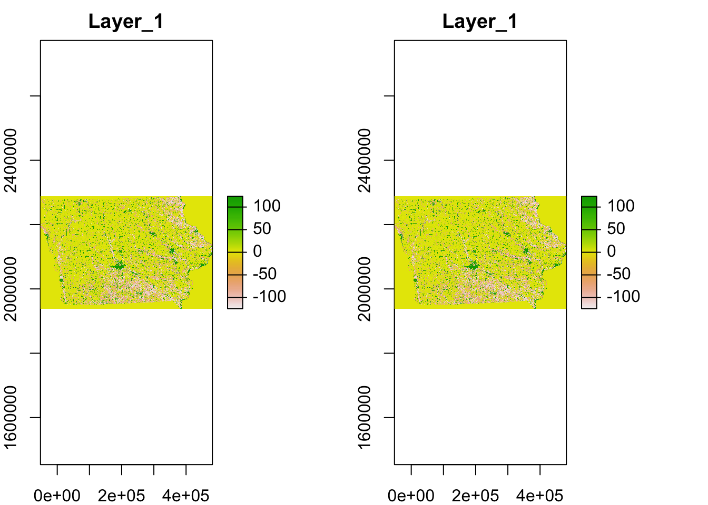

# Raster Data Handling with `terra` {#raster-basics}


## Before you start {-}

In this chapter, we will learn how to use the `terra` package to handle raster data. The `raster` package has been (and I must say still is) **THE** package for raster data handling. However, we are in the period of transitioning from the `raster` package to the `terra` package. The `terra` package has been under active development to replace the `raster` package, and its first beta version^[[github page](https://github.com/rspatial/terra)] was just released on CRAN on March 20, 2020. `terra` is written in C++ and thus is faster than the `raster` package in many raster data operations. The `raster` and `terra` packages share the same function name for most of the raster operations. Therefore, learning the `terra` package is almost the same as learning the `raster` package. Key differences will be discussed and will become clear later.

For economists, raster data extraction for vector data will be by far the most common use case of raster data and also the most time-consuming part of the whole raster data handling experience. Therefore, we will introduce only the essential knowledge of raster data operation required to effectively implement the task of extracting values, which will be covered extensively in Chapter \@ref(int-RV). For example, we do not cover raster arithmetic, focal operations, or aggregation. Those who are interested in a fuller treatment of the `terra` or `raster` package are referred to [Spatial Data Science with R and “terra”](https://rspatial.org/terra/spatial/index.html) or Chapters 3, 4, and 5 of [Geocomputation with R](https://geocompr.robinlovelace.net/), respectively.

We still learn the raster object classes defined by the `raster` package and how to switch between the `raster` and `terra` object classes. This is because other useful packages for us economists were written to work with the `raster` object classes and have still not been adapted to support `terra` object classes at the moment. In particular, `exactextractr` is critical for economists who regularly use large spatially fine raster datasets with many temporal dimensions because of its speed advantage over the `terra` package. `terra::extract()` is much faster than `raster::extract()`, which is unbearably slow for large datasets. Unfortunately, `terra::extract()` is still much slower than the extraction function provided by `exactextractr` packages for large datasets^[CDL data is a good example]. Since `exactextractr` works only with objects defined by the `raster` package, you need to convert a `terra` object to a `raster` object if you would like to take advantage of the function. This also means that we need to learn the difference in raster object classes between the two packages. This problem should be resolved in a matter of a year, and most of the spatial packages will add support for `terra`.

### `stars` package {-}

Finally, another package you might want to keep an eye on for raster (and vector data) handling is the `stars` package. It provides a more consistent way of handling spatiotemporal data than the `raster` and `terra` packages. We do not cover this package in this chapter because it is not clear (at least to me) how much benefit this package brings. However, this might change quickly. For those who are interested in exploring this package, [this](https://r-spatial.github.io/stars/index.html) is the best resource. A few vignettes are available from the "Articles" tab. 

### Direction for replication {-}

**Datasets**
No external datasets are necessary for this Chapter.

**Packages**

Run the following code to install or load (if already installed) the `pacman` package, and then install or load (if already installed) the listed package inside the `pacman::p_load()` function.


```r
if (!require("pacman")) install.packages("pacman")
pacman::p_load(
  terra, # handle raster data
  raster, # handle raster data
  cdlTools # download CDL data
)  
```

## Raster data object classes  

### `raster` package: `RasterLayer`, `RasterStack`, and `RasterBrick`

Let's start with taking a look at raster data. We will download CDL data for Iowa in 2015. 


```r
library(cdlTools)

#--- download the CDL data for Iowa in 2015 ---#
IA_cdl_2015 <- getCDL("Iowa", 2015)$IA2015

#--- take a look ---#
IA_cdl_2015
```

```
class      : RasterLayer 
dimensions : 11671, 17795, 207685445  (nrow, ncol, ncell)
resolution : 30, 30  (x, y)
extent     : -52095, 481755, 1938165, 2288295  (xmin, xmax, ymin, ymax)
crs        : +proj=aea +lat_1=29.5 +lat_2=45.5 +lat_0=23 +lon_0=-96 +x_0=0 +y_0=0 +ellps=GRS80 +towgs84=0,0,0,0,0,0,0 +units=m +no_defs 
source     : /private/var/folders/t4/5gnqprbn38nftyxkyk5hdwmd8hnypy/T/Rtmp5g1PCO/CDL_2015_19.tif 
names      : CDL_2015_19 
values     : 0, 255  (min, max)
```

Evaluating the imported raster object provides you with information about the raster data, such as dimensions (number of cells, number of columns, number of cells), spatial resolution (30 meter by 30 meter for this raster data), extent, CRS and the minimum and maximum values recorded in this raster layer. The class of the downloaded data is `RasterLayer`, which is a raster data class defined by the `raster` package.^[This is what I meant by the `raster` being THE package for raster data handling. The default object class for many raster-related packages is a `raster` object class, instead of a `terra` object class.] A `RasterLayer` consists of only one layer, meaning that only a single variable is associated with the cells (here it is land use category code in integer). Among these spatial characteristics, you often need to extract the CRS of a raster object before you interact it with vector data^[e.g., extracting values from a raster layer to vector data, or cropping a raster layer to the spatial extent of vector data.], which can be done using `projection()`: 


```r
projection(IA_cdl_2015)
```

```
[1] "+proj=aea +lat_1=29.5 +lat_2=45.5 +lat_0=23 +lon_0=-96 +x_0=0 +y_0=0 +ellps=GRS80 +towgs84=0,0,0,0,0,0,0 +units=m +no_defs"
```

---

You can stack multiple raster layers of the **same spatial resolution and extent** to create a `RasterStack` using `raster::stack()`. Often times, processing a multi-layer object has computational advantages over processing multiple single-layer one by one^[You will see this in Chapter \@ref(int-RV) where we learn how to extract values from a raster layer for a vector data.]. 

To create a `RasterStack` and `RasterBrick`, let's download the CDL data for IA in 2016 and stack it with the 2015 data.


```r
#--- download the CDL data for Iowa in 2016 ---#
IA_cdl_2016 <- getCDL("Iowa", 2016)$IA2016 

#--- stack the two ---#
IA_cdl_stack <- stack(IA_cdl_2015, IA_cdl_2016)

#--- take a look ---#
IA_cdl_stack
```

```
class      : RasterStack 
dimensions : 11671, 17795, 207685445, 2  (nrow, ncol, ncell, nlayers)
resolution : 30, 30  (x, y)
extent     : -52095, 481755, 1938165, 2288295  (xmin, xmax, ymin, ymax)
crs        : +proj=aea +lat_1=29.5 +lat_2=45.5 +lat_0=23 +lon_0=-96 +x_0=0 +y_0=0 +ellps=GRS80 +towgs84=0,0,0,0,0,0,0 +units=m +no_defs 
names      : CDL_2015_19, CDL_2016_19 
min values :           0,           0 
max values :         255,         255 
```

`IA_cdl_stack` is of class `RasterStack`, and it has two layers of variables: CDL for 2015 and 2016. You can make it a `RasterBrick` using `raster::brick()`:


```r
#--- stack the two ---#
IA_cdl_brick <- brick(IA_cdl_stack)

#--- or this works as well ---#
# IA_cdl_brick <- brick(IA_cdl_2015, IA_cdl_2016)

#--- take a look ---#
IA_cdl_brick
```

```
class      : RasterBrick 
dimensions : 11671, 17795, 207685445, 2  (nrow, ncol, ncell, nlayers)
resolution : 30, 30  (x, y)
extent     : -52095, 481755, 1938165, 2288295  (xmin, xmax, ymin, ymax)
crs        : +proj=aea +lat_1=29.5 +lat_2=45.5 +lat_0=23 +lon_0=-96 +x_0=0 +y_0=0 +ellps=GRS80 +towgs84=0,0,0,0,0,0,0 +units=m +no_defs 
source     : /private/var/folders/t4/5gnqprbn38nftyxkyk5hdwmd8hnypy/T/Rtmp5g1PCO/raster/r_tmp_2020-05-27_205015_64951_93006.grd 
names      : CDL_2015_19, CDL_2016_19 
min values :           0,           0 
max values :         229,         241 
```

You probably noticed that it took some time to create the `RasterBrick` object^[Read [here](https://geocompr.robinlovelace.net/spatial-class.html#raster-classes) for the subtle difference between `RasterStack` and `RasterBrick`]. While spatial operations on `RasterBrick` are supposedly faster than `RasterStack`, the time to create a `RasterBrick` object itself is often long enough to kill the speed advantage entirely^[We will see this in Chapter , where we compare the speed of data extraction from `RasterStack` and `RasterBrick` objects.]. Often, the three raster object types are collectively referred to as `Raster`$^*$ objects for shorthand in the documentation of the `raster` and other related packages.

### `terra` package: `SpatRaster`

`terra` package has only one object class for raster data, `SpatRaster` and no distinctions between one-layer and multi-layer rasters are necessary. Let's first convert a `RasterLayer` to a `SpatRaster` using `terra::rast()` function.


```r
#--- convert to a SpatRaster ---#
IA_cdl_2015_sr <- rast(IA_cdl_2015)

#--- take a look ---#
IA_cdl_2015_sr
```

```
class       : SpatRaster 
dimensions  : 11671, 17795, 1  (nrow, ncol, nlyr)
resolution  : 30, 30  (x, y)
extent      : -52095, 481755, 1938165, 2288295  (xmin, xmax, ymin, ymax)
coord. ref. : +proj=aea +lat_1=29.5 +lat_2=45.5 +lat_0=23 +lon_0=-96 +x_0=0 +y_0=0 +ellps=GRS80 +towgs84=0,0,0,0,0,0,0 +units=m +no_defs  
data source : /private/var/folders/t4/5gnqprbn38nftyxkyk5hdwmd8hnypy/T/Rtmp5g1PCO/CDL_2015_19.tif 
names       : Layer_1 
```

You can see that the number of layers (`nlyr`) is $1$ because the original object is a `RasterLayer`, which by definition has only one layer. Now, let's convert a `RasterStack` to a `SpatRaster` using `terra::rast()`.  


```r
#--- convert to a SpatRaster ---#
IA_cdl_stack_sr <- rast(IA_cdl_stack)

#--- take a look ---#
IA_cdl_stack_sr
```

```
class       : SpatRaster 
dimensions  : 11671, 17795, 2  (nrow, ncol, nlyr)
resolution  : 30, 30  (x, y)
extent      : -52095, 481755, 1938165, 2288295  (xmin, xmax, ymin, ymax)
coord. ref. : +proj=aea +lat_1=29.5 +lat_2=45.5 +lat_0=23 +lon_0=-96 +x_0=0 +y_0=0 +ellps=GRS80 +towgs84=0,0,0,0,0,0,0 +units=m +no_defs  
data sources: /private/var/folders/t4/5gnqprbn38nftyxkyk5hdwmd8hnypy/T/Rtmp5g1PCO/CDL_2015_19.tif  
              /private/var/folders/t4/5gnqprbn38nftyxkyk5hdwmd8hnypy/T/Rtmp5g1PCO/CDL_2016_19.tif  
names       : Layer_1, Layer_1 
```

Again, it is a `SpatRaster`, and you now see that the number of layers is 2. We just confirmed that `terra` has only one class for raster data whether it is single-layer or multiple-layer ones.

Instead of `projection()`, you use `crs()` to extract the CRS.


```r
crs(IA_cdl_2015_sr)
```

```
[1] "+proj=aea +lat_1=29.5 +lat_2=45.5 +lat_0=23 +lon_0=-96 +x_0=0 +y_0=0 +ellps=GRS80 +towgs84=0,0,0,0,0,0,0 +units=m +no_defs "
```

### Converting a `SpatRaster` object to a `Raster`$^*$ object.

You can convert a `SpatRaster` object to a `Raster`$^*$ object using `raster()`, `stack()`, and `brick()`. Keep in mind that if you use `rater()` even though `SpatRaster` has multiple layers, the resulting `RasterLayer` object has only the first of the multiple layers. 


```r
#--- RasterLayer (only 1st layer) ---#
IA_cdl_stack_sr %>% raster()
```

```
class      : RasterLayer 
dimensions : 11671, 17795, 207685445  (nrow, ncol, ncell)
resolution : 30, 30  (x, y)
extent     : -52095, 481755, 1938165, 2288295  (xmin, xmax, ymin, ymax)
crs        : +proj=aea +lat_1=29.5 +lat_2=45.5 +lat_0=23 +lon_0=-96 +x_0=0 +y_0=0 +ellps=GRS80 +towgs84=0,0,0,0,0,0,0 +units=m +no_defs 
source     : /private/var/folders/t4/5gnqprbn38nftyxkyk5hdwmd8hnypy/T/Rtmp5g1PCO/CDL_2015_19.tif 
names      : Layer_1 
values     : 0, 255  (min, max)
```

```r
#--- RasterLayer ---#
IA_cdl_stack_sr %>% stack()
```

```
class      : RasterStack 
dimensions : 11671, 17795, 207685445, 2  (nrow, ncol, ncell, nlayers)
resolution : 30, 30  (x, y)
extent     : -52095, 481755, 1938165, 2288295  (xmin, xmax, ymin, ymax)
crs        : +proj=aea +lat_1=29.5 +lat_2=45.5 +lat_0=23 +lon_0=-96 +x_0=0 +y_0=0 +ellps=GRS80 +towgs84=0,0,0,0,0,0,0 +units=m +no_defs 
names      : CDL_2015_19, CDL_2016_19 
min values :           0,           0 
max values :         255,         255 
```

```r
#--- RasterLayer (this takes some time) ---#
IA_cdl_stack_sr %>% brick()
```

```
class      : RasterBrick 
dimensions : 11671, 17795, 207685445, 2  (nrow, ncol, ncell, nlayers)
resolution : 30, 30  (x, y)
extent     : -52095, 481755, 1938165, 2288295  (xmin, xmax, ymin, ymax)
crs        : +proj=aea +lat_1=29.5 +lat_2=45.5 +lat_0=23 +lon_0=-96 +x_0=0 +y_0=0 +ellps=GRS80 +towgs84=0,0,0,0,0,0,0 +units=m +no_defs 
source     : /private/var/folders/t4/5gnqprbn38nftyxkyk5hdwmd8hnypy/T/Rtmp5g1PCO/raster/r_tmp_2020-05-27_205102_64951_75945.grd 
names      : CDL_2015_19, CDL_2016_19 
min values :           0,           0 
max values :         229,         241 
```

### Vector data in the `terra` package

`terra` package has its own class for vector data, called `SpatVector`. While we do not use any of the vector data functionality provided by the `terra` package, we learn how to convert an `sf` object to `SpatVector` because `terra` functions do not support `sf` as of now (this will likely be resolved very soon). We will see some use cases of this conversion in the next chapter when we learn raster value extractions for vector data using `terra::extract()`. 

As an example, let's use Illinois county border data. 


```r
library(maps)
#--- Illinois county boundary ---#
(
IL_county <- st_as_sf(map("county", "illinois", plot = FALSE, fill = TRUE))
)
```

```
Simple feature collection with 102 features and 1 field
geometry type:  MULTIPOLYGON
dimension:      XY
bbox:           xmin: -91.50136 ymin: 37.00161 xmax: -87.49638 ymax: 42.50774
CRS:            EPSG:4326
First 10 features:
                   ID                           geom
1      illinois,adams MULTIPOLYGON (((-91.49563 4...
2  illinois,alexander MULTIPOLYGON (((-89.21526 3...
3       illinois,bond MULTIPOLYGON (((-89.27828 3...
4      illinois,boone MULTIPOLYGON (((-88.94024 4...
5      illinois,brown MULTIPOLYGON (((-90.91121 3...
6     illinois,bureau MULTIPOLYGON (((-89.63351 4...
7    illinois,calhoun MULTIPOLYGON (((-90.93414 3...
8    illinois,carroll MULTIPOLYGON (((-89.91999 4...
9       illinois,cass MULTIPOLYGON (((-90.51014 3...
10 illinois,champaign MULTIPOLYGON (((-88.46468 4...
```

You cannot convert an `sf` object directly to `SpatVector`. You first need to turn an `sf` into a spatial object class supported by the `sp` package, and then turn that into a `SpatVector` object using `terra::vect()`.


```r
IL_county_sv <-	as(IL_county, "Spatial") %>% # to SpatialPolygonsDataFrame  
	#--- to SpatVectgor ---#
	vect()
```

You just need to put the name of your `sf` object in place of `IL_county`. You do not have to understand what `SpatialPolygonsDataFrame` is if you are not familiar with the `sp` package. It is just an intermediate object that you do not really need to understand. Indeed, when the next version of the `terra` packages comes out (The version currently available on CRAN is `0.6-9` at the time of writing), `vect()` will be able to convert a `SpatVector` object to an `sf` object directly without the intermediate step like this (see [here](https://github.com/rspatial/terra/issues/38)):


```r
#--- NOT RUN ---#	
IL_county_sv <- vect(IL_county)
```

To install the development version, visit [here](https://github.com/rspatial/terra) and follow the direction.


## Read and write a raster data file  

Sometimes we can download raster data as we saw in Section 3.1. But, most of the time you need to read raster data stored in a file. Raster data files come in numerous formats. For example, PRPISM comes in the Band interleaved by line (BIL) format, some of the Daymet data comes in netCDF format. Other popular formats include GeoTiff, SAGA, ENVI, and many others. 

### Read raster file(s)

You use `terra::rast()` to read raster data of many common formats, and it should be almost always the case that the raster data you got can be read using this function. Here, we read a GeoTiff file (a file with .tif extension):


```r
(
IA_cdl_2015_sr <- rast("./Data/IA_cdl_2015.tif") 
)
```

```
class       : SpatRaster 
dimensions  : 11671, 17795, 1  (nrow, ncol, nlyr)
resolution  : 30, 30  (x, y)
extent      : -52095, 481755, 1938165, 2288295  (xmin, xmax, ymin, ymax)
coord. ref. : +proj=aea +lat_1=29.5 +lat_2=45.5 +lat_0=23 +lon_0=-96 +x_0=0 +y_0=0 +ellps=GRS80 +towgs84=0,0,0,0,0,0,0 +units=m +no_defs  
data source : ./Data/IA_cdl_2015.tif 
names       : IA_cdl_2015 
```

One important thing to note here is that the cell values of the raster data are actually not in memory when you "read" raster data from a file. 
You basically just established a connection to the file. This helps to reduce the memory footprint of raster data handling. You can check this by `raster::inMemory()` function for `Raster`$^*$ objects, but the same function has not been implemented for `terra` yet. 

You can read multiple single-layer raster datasets of the same spatial extent and resolution at the same time to have a multi-layer `SpatRaster` object. Here, we import two single-layer raster datasets (IA_cdl_2015.tif and IA_cdl_2016.tif) to create a two-layer `SpatRaster` object.


```r
#--- the list of path to the files ---#
files_list <- c("./Data/IA_cdl_2015.tif", "./Data/IA_cdl_2016.tif")

#--- read the two at the same time ---#
(
multi_layer_sr <- rast(files_list) 
)
```

```
class       : SpatRaster 
dimensions  : 11671, 17795, 2  (nrow, ncol, nlyr)
resolution  : 30, 30  (x, y)
extent      : -52095, 481755, 1938165, 2288295  (xmin, xmax, ymin, ymax)
coord. ref. : +proj=aea +lat_1=29.5 +lat_2=45.5 +lat_0=23 +lon_0=-96 +x_0=0 +y_0=0 +ellps=GRS80 +towgs84=0,0,0,0,0,0,0 +units=m +no_defs  
data sources: ./Data/IA_cdl_2015.tif  
              ./Data/IA_cdl_2016.tif  
names       : IA_cdl_2015, Layer_1 
min values  :          ? ,       0 
max values  :          ? ,     241 
```

Of course, this only works because the two datasets have the identical spatial extent and resolution. There are, however, no restrictions on what variable each of the raster layers represent. For example, you can combine PRISM temperature and precipitation raster layers.

### Write raster files

You can write a `SpatRaster` object using `terra::writeRaster()`.


```r
terra::writeRaster(IA_cdl_2015_sr, "./Data/IA_cdl_stack.tif", format = "GTiff", overwrite = TRUE)
```

The above code saves `IA_cdl_2015_sr` (a `SpatRaster` object) as a GeoTiff file.^[There are many other alternative formats (see [here](https://www.rdocumentation.org/packages/raster/versions/3.0-12/topics/writeRaster))] The format option can be dropped as `writeRaster()` infers the format from the extension of the file name. The `overwrite = TRUE` option is necessary if a file with the same name already exists and you are overwriting it. This is one of the many areas `terra` is better than `raster`. `raster::writeRaster()` can be frustratingly slow for a large `Raster`$^*$ object. `terra::writeRaster()` is much faster.

You can also save a multi-layer `SpatRster` object just like you save a single-layer `SpatRster` object. 


```r
terra::writeRaster(IA_cdl_stack_sr, "./Data/IA_cdl_stack.tif", format = "GTiff", overwrite = TRUE)
```

The saved file is a multi-band raster datasets. So, if you have many raster files of the same spatial extent and resolution, you can "stack" them on R and then export it to a single multi-band raster datasets, which cleans up your data folder.
 
## Access values and quick plotting

Sometime, it is nice to be able to see the data values in a raster dataset or visualize the data for various kinds of checks. You can access the values stored in a `SpatRaster` object using `values()` function:


```r
#--- terra::values ---#
values_from_rs <- values(IA_cdl_stack_sr) 

#--- take a look ---#
head(values_from_rs)
```

```
     Layer_1 Layer_1
[1,]       0       0
[2,]       0       0
[3,]       0       0
[4,]       0       0
[5,]       0       0
[6,]       0       0
```

The returned values come in a matrix form of two columns because we are getting values from a two-layer `SpatRaster` object (one column for each layer). 

To have a quick visualization of the data values of `SpatRaster` objects, you can simply use `plot()`:


```r
plot(IA_cdl_stack_sr)
```



<!-- Instead of getting all the values, you could get a portion of them by using `getValuesBlock()` by specifying the region for which you would like to get values. It is used extensively in `exact_extract()` function, which we show as one of the fastest ways to extract values. However, if you are finding yourself using `getValuesBlock()`, it is very much likely that you are wasting your time by not using a faster alternative. See Chapter X for further discussion of fast value extraction.   -->


<!-- [RasterOption](https://www.gis-blog.com/increasing-the-speed-of-raster-processing-with-r-part-13/) -->

<!-- ### Speed comparison

Here, we compare the speed of writing raster data using  


```r
#--- terra::writeRaster (faster) ---#
tic()
terra::writeRaster(IA_cdl_2015_sr, "./Data/IA_cdl_stack.tif", format = "GTiff", overwrite = TRUE)
tic()

#--- raster::writeRaster (slow) ---#
tic()
raster::writeRaster(IA_cdl_stack, "./Data/IA_cdl_stack.tif", format = "GTiff", overwrite = TRUE)
toc()
```

You can save a `Raster`$^*$ object using `terra::writeaRaster()`, but you do not get any speed advantage.


```r
#--- terra::writeRaster with RasterStack (no speed advantage) ---#
tic()
terra::writeRaster(IA_cdl_stack, "./Data/IA_cdl_stack.tif", format = "GTiff", overwrite = TRUE)
toc() 
``` -->
```
