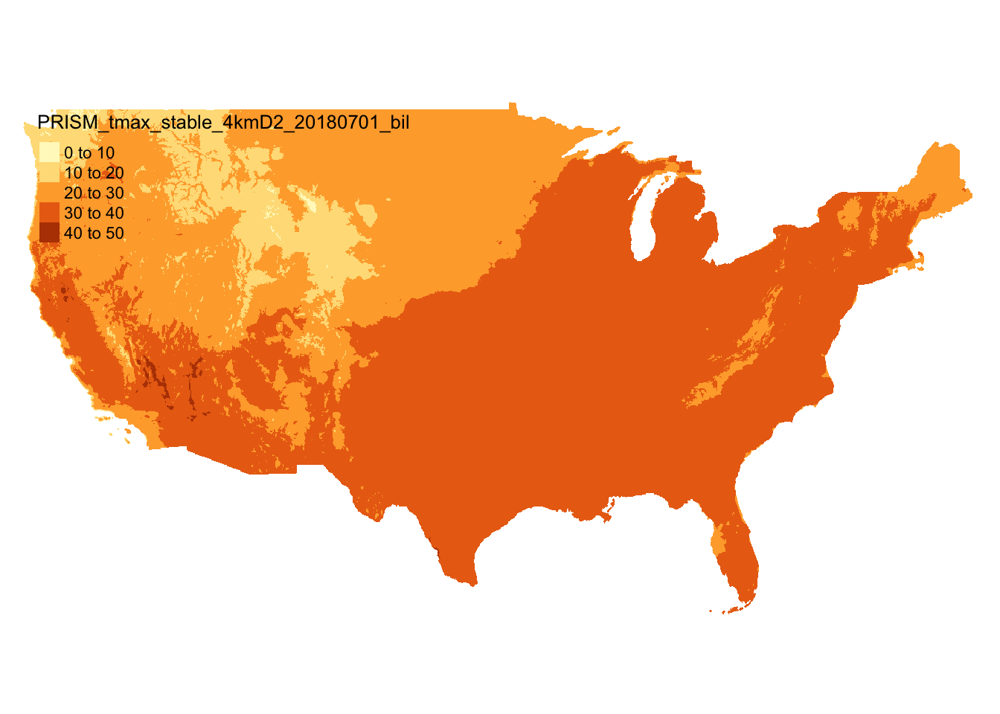
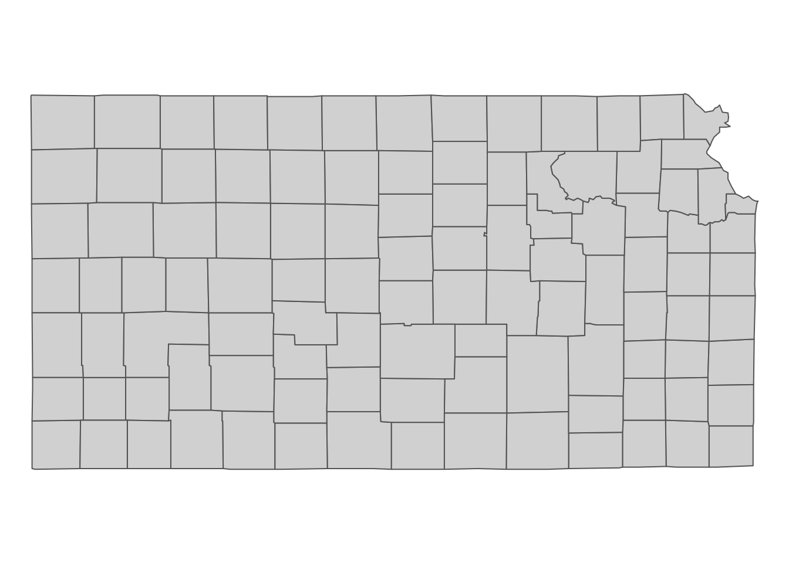
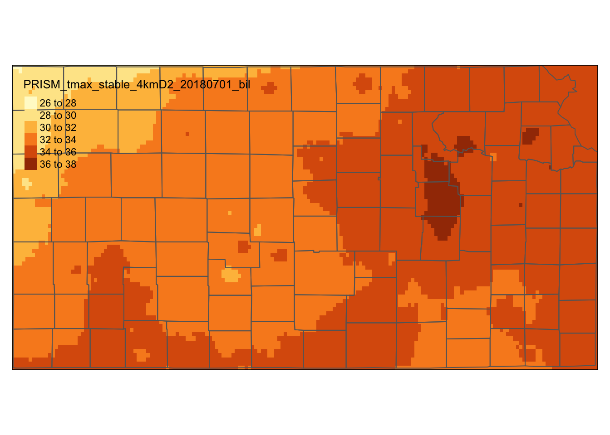
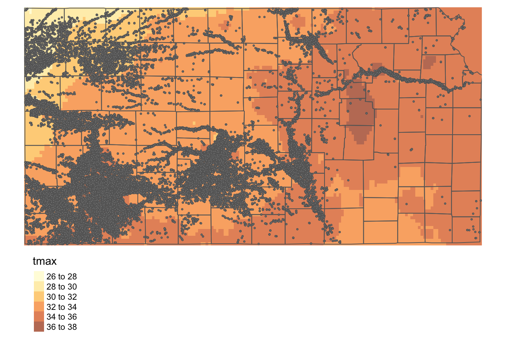

# Spatial Interactions of Vector and Raster Data {#int-RV}


## Before you start {-}

In this chapter we learn the spatial interactions of a vector and raster dataset. We first look at how to crop (spatially subset) a raster dataset based on the geographic extent of a vector dataset. We then cover how to extract values from raster data for points and polygons. To be precise, here is what we mean by raster data extraction and what it does for points and polygons data:

+ **Points**: For each of the points, find which raster cell it is located within, and assign the value of the cell to the point.  
 
+ **Polygons**: For each of the polygons, identify all the raster cells that intersect with the polygon, and assign a vector of the cell values to the polygon

This is probably the most important operation economists run on raster datasets. 

You will see conversions between `Raster`$^*$ (`raster` package) objects and `SpatRaster` object (`terra` package) because of the incompatibility of object classes across the key packages. I believe that these hassles will go away soon when they start supporting each other.  

### Direction for replication {-}

**Datasets**

All the datasets that you need to import are available [here](https://www.dropbox.com/sh/ayw6rz1wg0fmz2v/AADgKprG9P5xRBjvWE4eRSN2a?dl=0). In this chapter, the path to files is set relative to my own working directory (which is hidden). To run the codes without having to mess with paths to the files, follow these steps:

+ set a folder (any folder) as the working directory using `setwd()`  
+ create a folder called "Data" inside the folder designated as the working directory (if you have created a "Data" folder previously, skip this step)
+ download the pertinent datasets from [here](https://www.dropbox.com/sh/ayw6rz1wg0fmz2v/AADgKprG9P5xRBjvWE4eRSN2a?dl=0) and put them in the "Data" folder

**Packages**

Run the following code to install or load (if already installed) the `pacman` package, and then install or load (if already installed) the listed package inside the `pacman::p_load()` function.


```r
if (!require("pacman")) install.packages("pacman")
pacman::p_load(
  terra, # handle raster data
  raster, # handle raster data
  exactextractr, # fast extractions
  sf, # vector data operations
  dplyr, # data wrangling
  data.table, # data wrangling
  prism # download PRISM data
)  
```

## Cropping (Spatial subsetting) to the Area of Interest {#raster-crop}

Here we use PRISM maximum temperature (tmax) data as a raster dataset and Kansas county boundaries as a vector dataset. 

Let's download the tmax data for July 1, 2018 (Figure \@ref(fig:prism-tmax-map)).


```r
#--- set the path to the folder to which you save the downloaded PRISM data ---#
# This code sets the current working directory as the designated folder
options(prism.path = "./Data")

#--- download PRISM precipitation data ---#
get_prism_dailys(
  type = "tmax", 
  date = "2018-07-01", 
  keepZip = FALSE 
)

#--- the file name of the PRISM data just downloaded ---#
prism_file <- "./Data/PRISM_tmax_stable_4kmD2_20180701_bil/PRISM_tmax_stable_4kmD2_20180701_bil.bil"

#--- read in the prism data ---#
prism_tmax_0701 <- rast(prism_file) 
```

<div class="figure">

<p class="caption">(\#fig:prism-tmax-map)Map of PRISM tmax data on July 1, 2018</p>
</div>

We now get Kansas county data from the `maps` package (Figure \@ref(fig:ks-county-map)) as `sf`. We then convert it to a `SpatVector` object. Remember that the `terra` packages does not support an `sf` object yet. So, an `sf` object needs to be converted to a `SpatVector` object before we use any functions from the `terra` packages that involve vector data including `terra::crop()` and `terra::extract()` for raster data cropping and extraction, respectively.^[See Chapter \@ref(raster-basics) to learn what `SpatVector` is and how to convert `sf` to `SpatRaster`.] 


```r
library(maps)

#--- Kansas boundary (sf) ---#
KS_county_sf <- st_as_sf(maps::map("county", "kansas", plot = FALSE, fill = TRUE)) %>% 
  #--- transform using the CRS of the PRISM tmax data  ---#
  st_transform(crs(prism_tmax_0701)) 

#--- Kansas boundary (SpatVector) ---#
KS_county_sv <- KS_county_sf %>% 
  #--- convert to a SpatVector object ---#
  as(., "Spatial") %>% vect()
```

<div class="figure">

<p class="caption">(\#fig:ks-county-map)Kansas county boundaries</p>
</div>

---

Sometimes, it is convenient to crop a raster layer to the specific area of interest so that you do not have to carry around unnecessary parts of the raster layer. Moreover, it takes less time to extract values from a raster layer when the size of the raster layer is smaller. You can crop a raster layer by using `terra::crop()`. It works like this:


```r
#--- syntax (NOT RUN) ---#
crop(raster object, geographic extent)
```

To find the geographic extent of a vector data, you can use `terra::ext()` (it is `raster::extent()` if you are using the `raster` package). 


```r
KS_extent <- terra::ext(KS_county_sv)
```

As you can see, it consists of four points. Four pairs of these values (xmin, ymin), (xmin, ymax), (xmax, ymin), and (xmax, ymax) form a rectangle that encompasses the Kansas state boundary. We will crop the PRISM raster layer to the rectangle:


```r
#--- crop the entire PRISM to its KS portion---#
prism_tmax_0701_KS_sr <- terra::crop(prism_tmax_0701, KS_extent)
```

The figure below (Figure \@ref(fig:prism-ks-viz)) shows the PRISM tmax raster data cropped to the geographic extent of Kansas. Notice that the cropped raster layer extends beyond the outer boundary of Kansas state boundary (it is a bit hard to see, but look at the upper right corner).  

<div class="figure">

<p class="caption">(\#fig:prism-ks-viz)PRISM tmax raster data cropped to the geographic extent of Kansas</p>
</div>

<!-- 
You can mask the values (set values to NA) outside of the vectors data.


```r
#--- syntax ---#
mask(raster object, sf object)

#--- example ---#
masked_prism_IL <- mask(prism_for_IL, IL_county)
```


```r
tm_shape(masked_prism_IL) +
  tm_raster() +
tm_shape(IL_county) +
  tm_polygons(alpha = 0)
```

 -->


## Extracting Values from Raster Layers for Vector Data 

In this section, we will learn how to extract information from raster layers for spatial units represented as vector data (points and polygons). For the illustrations in this section, we use the following datasets:

+ Raster: PRISM tmax data cropped to Kansas state border for 07/01/2018 (obtained in \@ref(raster-crop)) and 07/02/2018 (downloaded below)
+ Polygons: Kansas county boundaries (obtained in \@ref(raster-crop))
+ Points: Irrigation wells in Kansas (imported below) 

**PRISM tmax data for 07/02/2018**


```r
#--- download PRISM precipitation data ---#
get_prism_dailys(
  type = "tmax", 
  date = "2018-07-02", 
  keepZip = FALSE 
)

#--- the file name of the PRISM data just downloaded ---#
prism_file <- "Data/PRISM_tmax_stable_4kmD2_20180702_bil/PRISM_tmax_stable_4kmD2_20180702_bil.bil"

#--- read in the prism data and crop it to Kansas state border ---#
prism_tmax_0702_KS_sr <- rast(prism_file) %>% 
  terra::crop(KS_extent)
```

**Irrigation wells in Kansas:**


```r
#--- read in the KS points data ---#
(
KS_wells <- readRDS("./Data/Chap_5_wells_KS.rds") 
)
```

```
Simple feature collection with 37647 features and 1 field
geometry type:  POINT
dimension:      XY
bbox:           xmin: -102.0495 ymin: 36.99552 xmax: -94.62089 ymax: 40.00199
CRS:            EPSG:4269
First 10 features:
   well_id                   geometry
1        1 POINT (-100.4423 37.52046)
2        3 POINT (-100.7118 39.91526)
3        5 POINT (-99.15168 38.48849)
4        7 POINT (-101.8995 38.78077)
5        8  POINT (-100.7122 38.0731)
6        9 POINT (-97.70265 39.04055)
7       11 POINT (-101.7114 39.55035)
8       12 POINT (-95.97031 39.16121)
9       15 POINT (-98.30759 38.26787)
10      17 POINT (-100.2785 37.71539)
```

---

Here is how the wells are spatially distributed over the PRISM grids and Kansas county borders (Figure \@ref(fig:tmax-prism-wells)):

<div class="figure">

<p class="caption">(\#fig:tmax-prism-wells)Map of Kansas county borders, irrigation wells, and PRISM tmax</p>
</div>


### Points 

You can extract values from raster layers to points using `terra::extract()`. `terra::extract()` finds which raster cell each of the points is located within and assigns the value of the cell to the point. One complication that we have to deal with at the moment is the fact that `terra` does not support `sf` yet. However, `terra::extract()` accepts a longitude and latitude matrix. Therefore, the following works:^[I believe this issue will be resolved soon and you can just supply an `sf` object instead of coordinates.]  


```r
#--- syntax (NOT RUN) ---#
terra::extract(raster object, st_coordinates(sf object)) 
```

Let's extract tmax values from the PRISM tmax layer to the irrigation wells:


```r
#--- extract tmax values ---#
tmax_from_prism <- terra::extract(prism_tmax_0701_KS_sr, st_coordinates(KS_wells))

#--- take a look ---#
head(tmax_from_prism)
```

```
     PRISM_tmax_stable_4kmD2_20180701_bil
[1,]                               34.241
[2,]                               29.288
[3,]                               32.585
[4,]                               30.104
[5,]                               34.232
[6,]                               35.168
```

`terra::extract()` returns the extracted values as a vector when the raster object is single-layer raster data. Since the order of the values are consistent with the order of the observations in the points data, you can simply assign the vector as a new variable of the points data as follows:


```r
KS_wells$tmax_07_01 <- tmax_from_prism
```

Extracting values from a multi-layer `SpatRaster` works the same way. Here, we combine `prism_tmax_0701_KS_sr` and `prism_tmax_0703_KS_sr` to create a multi-layer `SpatRaster`.


```r
#--- create a multi-layer SpatRaster ---#
prism_tmax_stack <- c(prism_tmax_0701_KS_sr, prism_tmax_0702_KS_sr)

#--- extract tmax values ---#
tmax_from_prism_stack <- raster::extract(prism_tmax_stack, st_coordinates(KS_wells))

#--- take a look ---#
head(tmax_from_prism_stack)
```

```
     PRISM_tmax_stable_4kmD2_20180701_bil PRISM_tmax_stable_4kmD2_20180702_bil
[1,]                               34.241                               30.544
[2,]                               29.288                               29.569
[3,]                               32.585                               29.866
[4,]                               30.104                               29.819
[5,]                               34.232                               30.481
[6,]                               35.168                               30.640
```

Instead of a vector, the returned object is a matrix with each of the raster layers forming a column.    

### Polygons (`terra` way)

**Caution:** Recently, `terra::extract()` crashed R sessions on RStudio several times when I tried to extract values from a large raster dataset (1.6 GB) for polygons. I did not see any problem when extracting for points data even if the raster data is very large, For now, I recommend `exact_extract()` to extract values for polygons, which is detailed in the next section. `exact_extract()` is faster for a large raster dataset anyway.  
You can use the same `terra::extract()` function to extract values from a raster layer for polygons. For each of the polygons, it will identify all the raster cells whose center lies inside the polygon and assign the vector of values of the cells to the polygon (You can change this to the cells that intersect with polygons using the `touch = TRUE` option). 


```r
#--- extract values from the raster for each county ---#
tmax_by_county <- terra::extract(prism_tmax_0701_KS_sr, KS_county_sv)  

#--- take a look at the first 2 elements of the list ---#
tmax_by_county[1:2] 
```

```
[[1]]
[[1]][[1]]
 [1] 34.393 34.456 34.450 34.460 34.483 34.566 34.588 34.616 34.623 34.556
[11] 34.231 34.145 34.188 34.247 34.289 34.279 34.282 34.417 34.483 34.585
[21] 34.151 34.114 34.174 34.138 34.136 34.235 34.351 34.494 34.591 34.563
[31] 34.183 34.198 34.117 34.049 34.100 34.193 34.294 34.431 34.521 34.484
[41] 34.088 34.121 34.170 34.142 34.156 34.203 34.176 34.249 34.356 34.454
[51] 34.126 34.072 34.088 34.091 34.123 34.145 34.238 34.306 34.359 34.511
[61] 34.043 34.079 34.048 33.977 34.113 34.203 34.273 34.308 34.387 34.543


[[2]]
[[2]][[1]]
 [1] 35.316 35.289 35.072 35.014 34.995 34.996 34.990 34.953 35.042 35.034
[11] 35.112 35.186 35.087 34.977 34.890 34.838 34.838 34.844 34.926 34.858
[21] 34.948 35.037 35.182 35.080 34.945 34.856 34.897 34.911 35.021 34.990
[31] 34.919 34.963 35.055 34.935 34.899 34.910 34.903 34.936 34.961 34.983
[41] 35.006 34.827 35.215 35.093 34.867 34.876 34.856 34.932 34.919 35.003
[51] 34.943 34.835 35.491 35.215 34.927 34.818 34.854 34.834 34.758 34.763
[61] 34.749 34.717 35.285 35.008 34.869 34.801 34.774 34.798 34.694 34.626
[71] 34.644 34.637 34.821 34.819 35.000 34.877 34.821 34.780 34.714 34.658
[81] 34.552 34.547 34.605 34.672 34.599 34.678 34.666 34.822 34.825 34.721
[91] 34.666 34.616
```

`terra::extract()` returns a list, where its $i$th element corresponds to the $i$th row of observation in the polygon data (`KS_county_sv`). Each of the list elements is also a list, and the list has a vector of extracted values for the corresponding polygon.  


```r
#--- see the first element of the list ---#
tmax_by_county[[1]]
```

```
[[1]]
 [1] 34.393 34.456 34.450 34.460 34.483 34.566 34.588 34.616 34.623 34.556
[11] 34.231 34.145 34.188 34.247 34.289 34.279 34.282 34.417 34.483 34.585
[21] 34.151 34.114 34.174 34.138 34.136 34.235 34.351 34.494 34.591 34.563
[31] 34.183 34.198 34.117 34.049 34.100 34.193 34.294 34.431 34.521 34.484
[41] 34.088 34.121 34.170 34.142 34.156 34.203 34.176 34.249 34.356 34.454
[51] 34.126 34.072 34.088 34.091 34.123 34.145 34.238 34.306 34.359 34.511
[61] 34.043 34.079 34.048 33.977 34.113 34.203 34.273 34.308 34.387 34.543
```

```r
#--- check the class ---#
tmax_by_county[[1]] %>% class()
```

```
[1] "list"
```

In order to make the results usable, you can process them to get a single `data.frame`, taking advantage of `dplyr::bind_rows()` to combine the list of the datasets into one dataset. In doing so, you can use `.id` option to create a new identifier column that links each row to its original data (`data.table` users can use `rbindlist()` with the `idcol` option).


```r
(
tmax_by_county_df <- tmax_by_county %>%  
  #--- apply unlist to the lists to have vectors as the list elements ---#
  lapply(unlist) %>% 
  #--- convert vectors to data.frames ---#
  lapply(as_tibble) %>% 
  #--- combine the list of data.frames ---#
  bind_rows(., .id = "rowid") %>% 
  #--- rename the value variable ---# 
  rename(tmax = value)
)
```

```
# A tibble: 12,730 x 2
   rowid  tmax
   <chr> <dbl>
 1 1      34.4
 2 1      34.5
 3 1      34.5
 4 1      34.5
 5 1      34.5
 6 1      34.6
 7 1      34.6
 8 1      34.6
 9 1      34.6
10 1      34.6
# … with 12,720 more rows
```

Note that `rowid` represents the row number of polygons in `KS_county_sv`. Now, we can easily summarize the data by polygon (county). For example, the code below finds a simple average of tmax by county.


```r
tmax_by_county_df %>% 
  group_by(rowid) %>% 
  summarize(tmax = mean(tmax))
```

```
# A tibble: 105 x 2
   rowid  tmax
   <chr> <dbl>
 1 1      34.3
 2 10     33.4
 3 100    30.7
 4 101    34.1
 5 102    32.6
 6 103    34.2
 7 104    33.8
 8 105    35.2
 9 11     34.8
10 12     29.3
# … with 95 more rows
```

For `data.table` users, here is how you can do the same:


```r
tmax_by_county %>%  
  #--- apply unlist to the lists to have vectors as the list elements ---#
  lapply(unlist) %>% 
  #--- convert vectors to data.frames ---#
  lapply(data.table) %>% 
  #--- combine the list ---#
  rbindlist(., idcol = "rowid") %>% 
  #--- rename the value variable ---# 
  setnames("V1", "tmax") %>% 
  #--- find the mean of tmax ---#
  .[, .(tmax = mean(tmax)), by = rowid]
```

```
     rowid     tmax
  1:     1 34.28574
  2:     2 34.89871
  3:     3 35.30388
  4:     4 34.04197
  5:     5 32.92819
 ---               
101:   101 34.12691
102:   102 32.58354
103:   103 34.20999
104:   104 33.80209
105:   105 35.19768
```

---

Extracting values from a multi-layer raster data works exactly the same way except that data processing after the value extraction is slightly more complicated. 


```r
#--- extract from a multi-layer raster object ---#
tmax_by_county_from_stack <- terra::extract(prism_tmax_stack, KS_county_sv) 

#--- take a look at the first element ---#
tmax_by_county_from_stack[[1]]
```

```
[[1]]
 [1] 34.393 34.456 34.450 34.460 34.483 34.566 34.588 34.616 34.623 34.556
[11] 34.231 34.145 34.188 34.247 34.289 34.279 34.282 34.417 34.483 34.585
[21] 34.151 34.114 34.174 34.138 34.136 34.235 34.351 34.494 34.591 34.563
[31] 34.183 34.198 34.117 34.049 34.100 34.193 34.294 34.431 34.521 34.484
[41] 34.088 34.121 34.170 34.142 34.156 34.203 34.176 34.249 34.356 34.454
[51] 34.126 34.072 34.088 34.091 34.123 34.145 34.238 34.306 34.359 34.511
[61] 34.043 34.079 34.048 33.977 34.113 34.203 34.273 34.308 34.387 34.543

[[2]]
 [1] 29.570 29.562 29.528 29.497 29.484 29.493 29.468 29.455 29.413 29.347
[11] 29.508 29.472 29.491 29.502 29.485 29.472 29.443 29.450 29.440 29.373
[21] 29.506 29.448 29.451 29.401 29.404 29.440 29.466 29.447 29.428 29.365
[31] 29.470 29.449 29.384 29.328 29.381 29.430 29.454 29.442 29.441 29.341
[41] 29.462 29.442 29.444 29.420 29.424 29.435 29.344 29.339 29.365 29.321
[51] 29.504 29.464 29.454 29.445 29.428 29.353 29.376 29.387 29.377 29.399
[61] 29.517 29.481 29.479 29.415 29.362 29.390 29.402 29.381 29.392 29.424
```

Just like the single-layer case, $i$th element of the list corresponds to $i$th polygon. However, each element of the list has two lists of extracted values because we are extracting from a two-layer raster object. This makes it a bit complicated to process them to have nicely-formatted data. The following code transform the list to a single `data.frame`: 


```r
#--- extraction from a multi-layer raster object ---#
tmax_long_from_stack <- tmax_by_county_from_stack %>% 
  lapply(., function(x) bind_rows(lapply(x, as_tibble), .id = "layer")) %>% 
  bind_rows(., .id = "rowid")

#--- take a look ---#
head(tmax_long_from_stack)
```

```
# A tibble: 6 x 3
  rowid layer value
  <chr> <chr> <dbl>
1 1     1      34.4
2 1     1      34.5
3 1     1      34.5
4 1     1      34.5
5 1     1      34.5
6 1     1      34.6
```

Note that this code works for a raster object with any number of layers including the single-layer case we saw above. 

We can then summarize the extracted data by polygon and raster layer.   


```r
tmax_long_from_stack %>% 
  group_by(rowid, layer) %>% 
  summarize(tmax = mean(value))
```

```
# A tibble: 210 x 3
# Groups:   rowid [105]
   rowid layer  tmax
   <chr> <chr> <dbl>
 1 1     1      34.3
 2 1     2      29.4
 3 10    1      33.4
 4 10    2      29.7
 5 100   1      30.7
 6 100   2      29.9
 7 101   1      34.1
 8 101   2      28.6
 9 102   1      32.6
10 102   2      30.6
# … with 200 more rows
```

Here is the `data.table` way:


```r
(
tmax_by_county_layer <- tmax_by_county_from_stack %>% 
  lapply(., function(x) rbindlist(lapply(x, data.table), idcol = "layer")) %>% 
  rbindlist(., idcol = "rowid") %>% 
  .[, .(tmax = mean(V1)), by = .(rowid, layer)]
)
```

```
     rowid layer     tmax
  1:     1     1 34.28574
  2:     1     2 29.43364
  3:     2     1 34.89871
  4:     2     2 29.42585
  5:     3     1 35.30388
 ---                     
206:   103     2 29.73917
207:   104     1 33.80209
208:   104     2 29.56691
209:   105     1 35.19768
210:   105     2 29.32252
```

### Polygons (`exactextractr` way)

`exact_extract()` function from the `exactextractr` package is a faster alternative than `terra::extract()` for large raster data as we confirm later (`exact_extract()` does not work with points data at the moment).^[See [here](https://github.com/isciences/exactextract) for how it does extraction tasks differently from other major GIS software.] `exact_extract()` also provides a coverage fraction value for each of the cell-polygon intersections. However, as mentioned in Chapter \@ref(raster-basics), it only works with `Raster`$^*$ objects. So, we first need to convert a `SpatRaster` object to a `Raster`$^*$ object. The syntax of `exact_extract()` is very much similar to `terra::extract()`. 


```r
#--- syntax (NOT RUN) ---#
exact_extract(raster, sf) 
```

So, to get tmax values from the PRISM raster layer for Kansas county polygons, the following does the job: 


```r
#--- convert to a RasterLayer ---#
prism_tmax_0701_KS_rl <- raster(prism_tmax_0701_KS_sr)

library("exactextractr")

#--- extract values from the raster for each county ---#
tmax_by_county <- exact_extract(prism_tmax_0701_KS_rl, KS_county_sf)  

#--- take a look at the first 6 rows of the first two list elements ---#
tmax_by_county[1:2] %>% lapply(function(x) head(x))
```


```
[[1]]
   value coverage_fraction
1 34.431         0.1455645
2 34.605         0.4065359
3 34.672         0.3808859
4 34.599         0.3552359
5 34.678         0.3295859
6 34.666         0.3039359

[[2]]
   value coverage_fraction
1 35.404        0.04257641
2 35.316        0.95364380
3 35.289        0.95364380
4 35.072        0.95364380
5 35.014        0.95364380
6 34.995        0.95364380
```

`exact_extract()` returns a list, where its $i$th element corresponds to the $i$th row of observation in the polygon data (`KS_county_sf`). For each element of the list, you see `value` and `coverage_fraction`. `value` is the tmax value of the intersecting raster cells, and `coverage_fraction` is the fraction of the intersecting area relative to the full raster grid, which can help find coverage-weighted summary of the extracted values. 


```r
#--- combine ---#
tmax_combined <- bind_rows(tmax_by_county, .id = "id")

#--- take a look ---#
head(tmax_combined)
```

```
  id  value coverage_fraction
1  1 34.431         0.1455645
2  1 34.605         0.4065359
3  1 34.672         0.3808859
4  1 34.599         0.3552359
5  1 34.678         0.3295859
6  1 34.666         0.3039359
```

We can now summarize the data by `id`. Here, we calculate coverage-weighted mean of tmax.


```r
tmax_by_id <- tmax_combined %>% 
  #--- convert from character to numeric  ---#
  mutate(id = as.numeric(id)) %>% 
  #--- group summary ---#
  group_by(id) %>% 
  summarise(tmax = sum(value * coverage_fraction) / sum(coverage_fraction))

#--- take a look ---#
head(tmax_by_id)
```

```
# A tibble: 6 x 2
     id  tmax
  <dbl> <dbl>
1     1  34.3
2     2  34.9
3     3  35.3
4     4  34.1
5     5  32.9
6     6  34.8
```

Remember that `id` values are row numbers in the polygon data (`KS_county_sf`). So, we can assign the tmax values to KS_county_sf as follows:


```r
KS_county_sf$tmax_07_01 <- tmax_by_id$tmax
```

---

Extracting values from `RasterStack` works in exactly the same manner as `RasterLayer`. Do not forget that you need to use `stack()` instead of `raster()` to convert a multi-layer `SpatRaster` to `RasterStack`.


```r
tmax_by_county_stack <- stack(prism_tmax_stack) %>% # convert to RasterStack
  #--- extract from a stack ---#
  exact_extract(., KS_county_sf, progress = F) 

#--- take a look at the first 6 lines of the first element---#
tmax_by_county_stack[[1]] %>% head()
```

```
  PRISM_tmax_stable_4kmD2_20180701_bil PRISM_tmax_stable_4kmD2_20180702_bil
1                               34.431                               29.558
2                               34.605                               29.643
3                               34.672                               29.653
4                               34.599                               29.568
5                               34.678                               29.580
6                               34.666                               29.540
  coverage_fraction
1         0.1455645
2         0.4065359
3         0.3808859
4         0.3552359
5         0.3295859
6         0.3039359
```

As you can see above, `exact_extract()` appends additional columns for additional layers, unlike the results of `terra::extract()` that creates additional lists for additional layers. This makes the post-extraction processing much simpler.


```r
#--- combine them ---#
tmax_all_combined <- tmax_by_county_stack %>% 
  bind_rows(.id = "id") 

#--- take a look ---#
head(tmax_all_combined)
```

```
  id PRISM_tmax_stable_4kmD2_20180701_bil PRISM_tmax_stable_4kmD2_20180702_bil
1  1                               34.431                               29.558
2  1                               34.605                               29.643
3  1                               34.672                               29.653
4  1                               34.599                               29.568
5  1                               34.678                               29.580
6  1                               34.666                               29.540
  coverage_fraction
1         0.1455645
2         0.4065359
3         0.3808859
4         0.3552359
5         0.3295859
6         0.3039359
```

In order to find the coverage-weighted tmax by date, you can first pivot it to a long format using `dplyr::pivot_longer()`.


```r
#--- pivot to a longer format ---#
(
tmax_long <- pivot_longer(
  tmax_all_combined, 
  -c(id, coverage_fraction), 
  names_to = "date",
  values_to = "tmax"
  )  
)
```

```
# A tibble: 30,302 x 4
   id    coverage_fraction date                                  tmax
   <chr>             <dbl> <chr>                                <dbl>
 1 1                 0.146 PRISM_tmax_stable_4kmD2_20180701_bil  34.4
 2 1                 0.146 PRISM_tmax_stable_4kmD2_20180702_bil  29.6
 3 1                 0.407 PRISM_tmax_stable_4kmD2_20180701_bil  34.6
 4 1                 0.407 PRISM_tmax_stable_4kmD2_20180702_bil  29.6
 5 1                 0.381 PRISM_tmax_stable_4kmD2_20180701_bil  34.7
 6 1                 0.381 PRISM_tmax_stable_4kmD2_20180702_bil  29.7
 7 1                 0.355 PRISM_tmax_stable_4kmD2_20180701_bil  34.6
 8 1                 0.355 PRISM_tmax_stable_4kmD2_20180702_bil  29.6
 9 1                 0.330 PRISM_tmax_stable_4kmD2_20180701_bil  34.7
10 1                 0.330 PRISM_tmax_stable_4kmD2_20180702_bil  29.6
# … with 30,292 more rows
```

And then find coverage-weighted tmax by date:


```r
(
tmax_long %>% 
  group_by(id, date) %>% 
  summarize(tmax = sum(tmax * coverage_fraction) / sum(coverage_fraction))
)
```

```
# A tibble: 210 x 3
# Groups:   id [105]
   id    date                                  tmax
   <chr> <chr>                                <dbl>
 1 1     PRISM_tmax_stable_4kmD2_20180701_bil  34.3
 2 1     PRISM_tmax_stable_4kmD2_20180702_bil  29.4
 3 10    PRISM_tmax_stable_4kmD2_20180701_bil  33.4
 4 10    PRISM_tmax_stable_4kmD2_20180702_bil  29.6
 5 100   PRISM_tmax_stable_4kmD2_20180701_bil  30.8
 6 100   PRISM_tmax_stable_4kmD2_20180702_bil  29.9
 7 101   PRISM_tmax_stable_4kmD2_20180701_bil  34.1
 8 101   PRISM_tmax_stable_4kmD2_20180702_bil  28.6
 9 102   PRISM_tmax_stable_4kmD2_20180701_bil  32.6
10 102   PRISM_tmax_stable_4kmD2_20180702_bil  30.6
# … with 200 more rows
```

For `data.table` users, this does the same:


```r
(
tmax_all_combined %>% 
  data.table() %>% 
  melt(id.var = c("id", "coverage_fraction")) %>% 
  .[, .(tmax = sum(value * coverage_fraction) / sum(coverage_fraction)), by = .(id, variable)]
)
```

```
      id                             variable     tmax
  1:   1 PRISM_tmax_stable_4kmD2_20180701_bil 34.29958
  2:   2 PRISM_tmax_stable_4kmD2_20180701_bil 34.89949
  3:   3 PRISM_tmax_stable_4kmD2_20180701_bil 35.26522
  4:   4 PRISM_tmax_stable_4kmD2_20180701_bil 34.10113
  5:   5 PRISM_tmax_stable_4kmD2_20180701_bil 32.93172
 ---                                                  
206: 101 PRISM_tmax_stable_4kmD2_20180702_bil 28.60475
207: 102 PRISM_tmax_stable_4kmD2_20180702_bil 30.61366
208: 103 PRISM_tmax_stable_4kmD2_20180702_bil 29.74647
209: 104 PRISM_tmax_stable_4kmD2_20180702_bil 29.57155
210: 105 PRISM_tmax_stable_4kmD2_20180702_bil 29.33646
```

## Extraction speed comparison

Here we compare the extraction speed of `raster::extract()`, `terra::extract()`, and `exact_extract()`. 

### Points: `terra::extract()` and `raster::extract()`

`exact_extract()` uses C++ as the backend. Therefore, it is considerably faster than `raster::extract()`.


```r
#--- terra ---#
tic()
temp <- terra::extract(prism_tmax_0701_KS_sr, st_coordinates(KS_wells))
toc()
```

```
0.006 sec elapsed
```

```r
#--- raster ---#
tic()
temp <- raster::extract(raster(prism_tmax_0701_KS_sr), KS_wells)
toc()
```

```
0.343 sec elapsed
```

As you can see, `terra::extract()` is much faster. The time differential between the two packages can be substantial as the raster data becomes larger.

### Polygons: `exact_extract()`, `terra::extract()`, and `raster::extract()`

`terra::extract()` is faster than `exact_extract()` for a relatively small raster data. Let's time them and see the difference.  


```r
library(tictoc)

#--- terra extract ---#
tic()
terra_extract_temp <- terra::extract(prism_tmax_0701_KS_sr, KS_county_sv, progress = FALSE)  
toc()
```

```
0.047 sec elapsed
```

```r
#--- exact extract ---#
tic()
exact_extract_temp <- exact_extract(prism_tmax_0701_KS_rl, KS_county_sf, progress = FALSE)  
toc()
```

```
0.257 sec elapsed
```

```r
#--- raster::extract ---#
tic()
raster_extract_temp <- raster::extract(prism_tmax_0701_KS_rl, KS_county_sf)  
toc()
```

```
2.469 sec elapsed
```

As you can see, `raster::extract()` is by far the slowest. `terra::extract()` is faster than `exact_extract()`. However, once the raster data becomes larger (or spatially finer), then `exact_extact()` starts to shine. 

---

Let's disaggregate the prism data by a factor of 10 to create a much larger raster data.^[We did not introduce this function as it is very rare that you need this function in research projects.]


```r
#--- disaggregate ---#
(
prism_tmax_0701_KS_sr_10 <- terra::disaggregate(prism_tmax_0701_KS_sr, fact = 10)
)
```

```
class       : SpatRaster 
dimensions  : 730, 1790, 1  (nrow, ncol, nlyr)
resolution  : 0.004166667, 0.004166667  (x, y)
extent      : -102.0625, -94.60417, 36.97917, 40.02083  (xmin, xmax, ymin, ymax)
coord. ref. : +proj=longlat +datum=NAD83 +no_defs  
data source : memory 
names       : PRISM_tmax_stable_4kmD2_20180701_bil 
min values  :                               27.711 
max values  :                               37.656 
```

```r
#--- convert the disaggregated PRISM data to RasterLayer ---#
prism_tmax_0701_KS_rl_10 <- raster(prism_tmax_0701_KS_sr_10)
```

The disaggregated PRISM data now has 10 times more rows and columns (see below).   


```r
#--- original ---#
dim(prism_tmax_0701_KS_sr)  
```

```
[1]  73 179   1
```

```r
#--- disaggregated ---#
dim(prism_tmax_0701_KS_sr_10)  
```

```
[1]  730 1790    1
```

---

Now, let's compare `terra::extrct()` and `exact_extrct()` using the disaggregated data.


```r
#--- terra extract ---#
tic()
terra_extract_temp <- terra::extract(prism_tmax_0701_KS_sr_10, KS_county_sv)  
toc()
```

```
3.699 sec elapsed
```

```r
#--- exact extract ---#
tic()
exact_extract_temp <- exact_extract(prism_tmax_0701_KS_rl_10, KS_county_sf, progress = FALSE)  
toc()
```

```
0.465 sec elapsed
```

As you can see, `exact_extract()` is considerably faster. The difference in time becomes even more pronounced as the size of the raster data becomes larger and the number of polygons are greater. The time difference of several seconds seem nothing, but imagine processing PRISM files for the entire US over 20 years, then you would appreciate the speed of `exact_extract()`. 

### Single-layer vs multi-layer

Pretend that you have five dates of PRISM tmax data (here we repeat the same file five times) and would like to extract values from all of them. Extracting values from a multi-layer raster objects (`RasterStack` for `raster` package) takes less time than extracting values from the individual layers one at a time. This can be observed below.   

---

**`terra::extract()`**


```r
#--- extract from 5 layers one at a time ---#
tic()
temp <- terra::extract(prism_tmax_0701_KS_sr_10, KS_county_sv)
temp <- terra::extract(prism_tmax_0701_KS_sr_10, KS_county_sv)
temp <- terra::extract(prism_tmax_0701_KS_sr_10, KS_county_sv)
temp <- terra::extract(prism_tmax_0701_KS_sr_10, KS_county_sv)
temp <- terra::extract(prism_tmax_0701_KS_sr_10, KS_county_sv)
toc()
```

```
18.808 sec elapsed
```

```r
#--- extract from a 5-layer stack ---#
prism_tmax_ml_5 <- c(
    prism_tmax_0701_KS_sr_10, 
    prism_tmax_0701_KS_sr_10, 
    prism_tmax_0701_KS_sr_10, 
    prism_tmax_0701_KS_sr_10, 
    prism_tmax_0701_KS_sr_10
  )

tic()
temp <- terra::extract(prism_tmax_ml_5, KS_county_sv)
toc()
```

```
4.595 sec elapsed
```

---

**`exact_extract()`**


```r
#--- extract from 5 layers one at a time ---#
tic()
temp <- exact_extract(prism_tmax_0701_KS_rl_10, KS_county_sf, progress = FALSE)
temp <- exact_extract(prism_tmax_0701_KS_rl_10, KS_county_sf, progress = FALSE)
temp <- exact_extract(prism_tmax_0701_KS_rl_10, KS_county_sf, progress = FALSE)
temp <- exact_extract(prism_tmax_0701_KS_rl_10, KS_county_sf, progress = FALSE)
temp <- exact_extract(prism_tmax_0701_KS_rl_10, KS_county_sf, progress = FALSE)
toc()
```

```
2.697 sec elapsed
```

```r
#--- extract from from a 5-layer stack ---#
prism_tmax_stack_5 <- stack(
    prism_tmax_0701_KS_rl_10, 
    prism_tmax_0701_KS_rl_10, 
    prism_tmax_0701_KS_rl_10, 
    prism_tmax_0701_KS_rl_10, 
    prism_tmax_0701_KS_rl_10
  )

tic()
temp <- exact_extract(prism_tmax_stack_5, KS_county_sf, progress = FALSE)
toc()
```

```
1.154 sec elapsed
```

The reduction in computation time for both methods makes sense. Since both layers have exactly the same geographic extent and resolution, finding the polygons-cells correspondence is done once and then it can be used repeatedly across the layers for the multi-layer `SparRaster` and `RasterStack`. This clearly suggests that when you are processing many layers of the same spatial resolution and extent, you should first stack them and then extract values at the same time instead of processing them one by one as long as your memory allows you to do so. 

<!-- There is much more to discuss about the computation speed of raster data extraction for polygons. For those who are interested in this topic, go to Chapter \@ref(EE). -->

