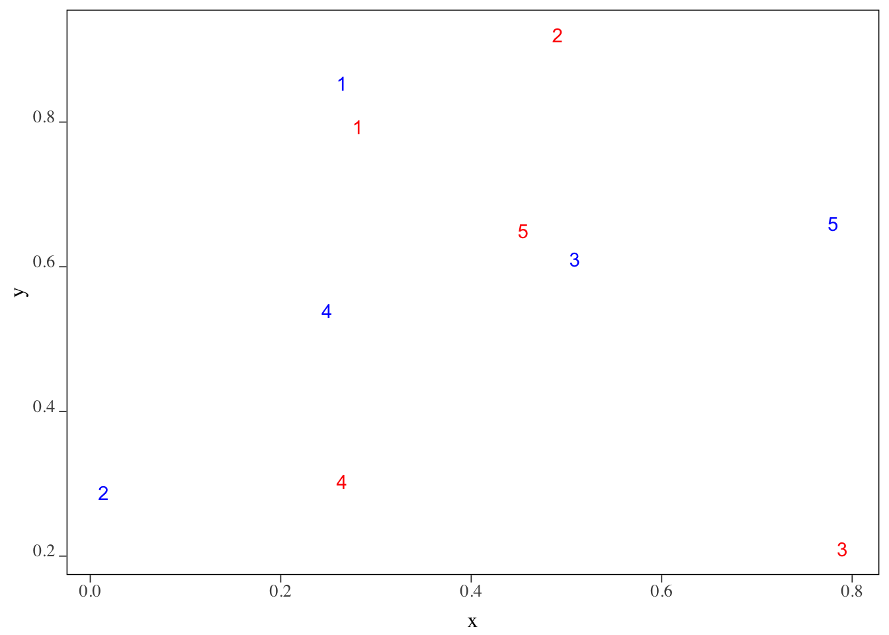
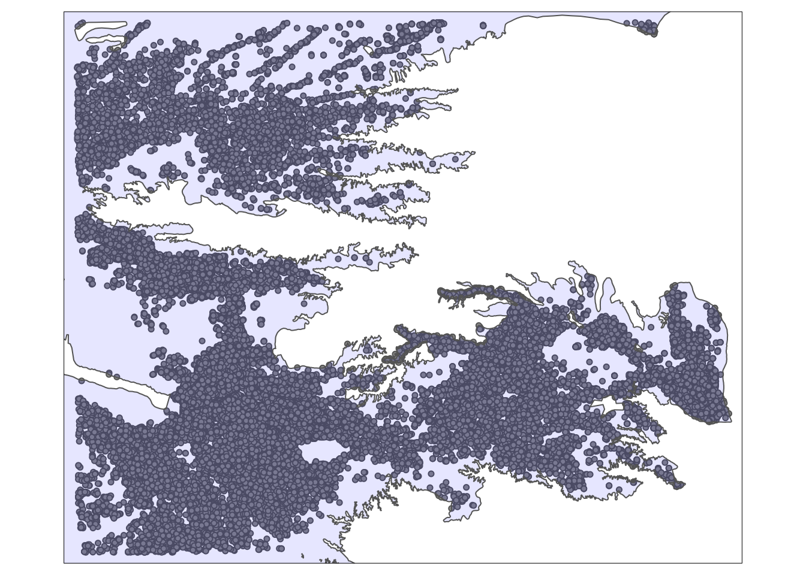
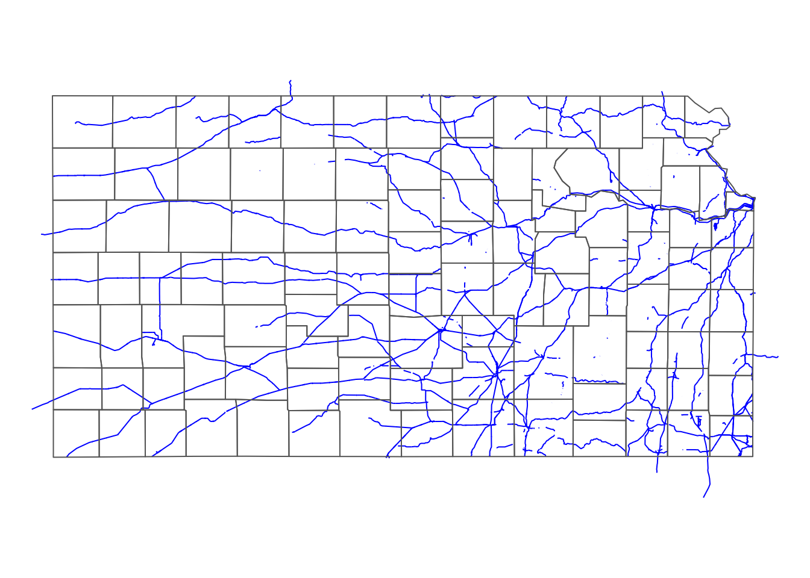
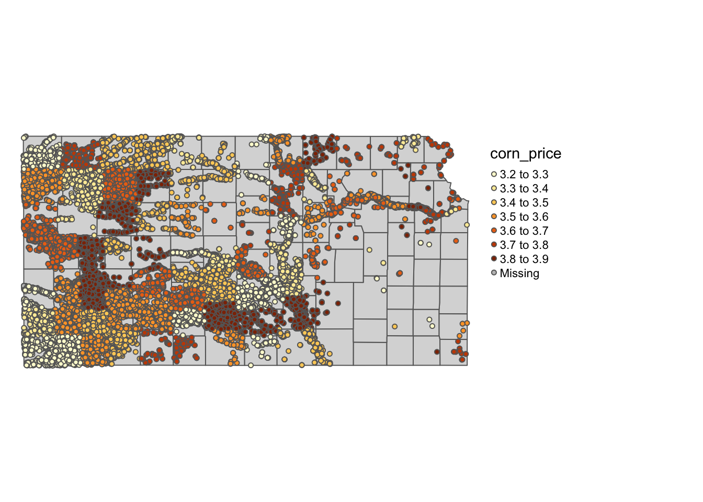
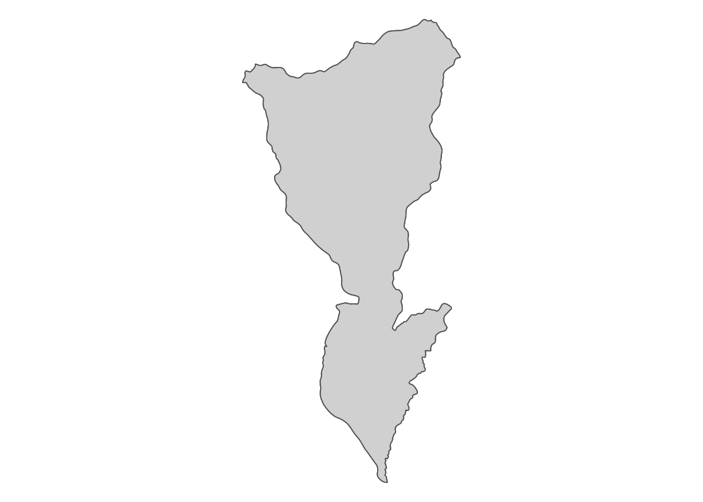
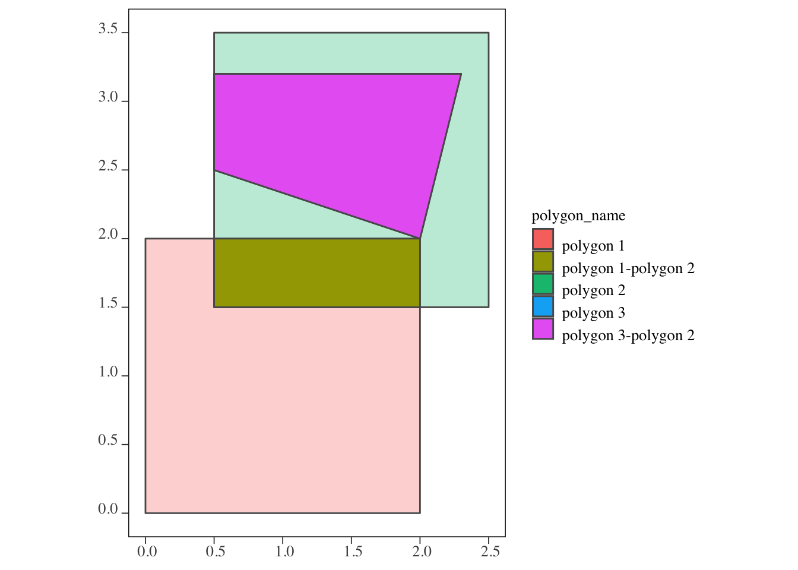

# Spatial Interactions of Vector Data: Subsetting and Joining


## Before you start {-}

In this chapter we learn the spatial interactions of two spatial objects. We first look at the **topological relations** of two spatial objects (how they are spatially related with each other): specifically, `st_intersects()` and `st_is_within_distance()`. `st_intersects()` is particularly important as it is by far the most common topological relation economists will use and also because it is the default topological relation that `sf` uses for spatial subsetting and spatial joining. 

We then follow with spatial subsetting: filtering spatial data by the geographic features of another spatial data. Finally, we will learn spatial joining. Spatial joining is the act of assigning attribute values from one spatial data to another spatial data based on how the two spatial datasets are spatially related (topological relation). This is the most important spatial operation for economists who want to use spatial variables in their econometric analysis. For those who have used the `sp` package, these operations are akin to `sp::over()`.

### Direction for replication {-}

**Datasets**

All the datasets that you need to import are available [here](https://www.dropbox.com/sh/fk149061msu06cj/AACMzyavFJrtOobST3KuxDsQa?dl=0). In this chapter, the path to files is set relative to my own working directory (which is hidden). To run the codes without having to mess with paths to the files, follow these steps:

+ set a folder (any folder) as the working directory using `setwd()`  
+ create a folder called "Data" inside the folder designated as the working directory (if you have created a "Data" folder previously, skip this step)
+ download the pertinent datasets from [here](https://www.dropbox.com/sh/fk149061msu06cj/AACMzyavFJrtOobST3KuxDsQa?dl=0) and put them in the "Data" folder

**Packages**

Run the following code to install or load (if already installed) the `pacman` package, and then install or load (if already installed) the listed package inside the `pacman::p_load()` function.


```r
if (!require("pacman")) install.packages("pacman")
pacman::p_load(
  sf, # vector data operations 
  dplyr, # data wrangling 
  data.table, # data wrangling 
  ggplot2, # for map creation 
  tmap # for map creation 
) 
```

## Topological relations

Before we learn spatial subsetting and joining, we first look at topological relations. Topological relations refer to the way multiple spatial objects are spatially related to one another. You can identify various types of spatial relations using the `sf` package. Our main focus is on the intersections of spatial objects, which can be found using `st_intersects()`.^[I would say it is very rare that you use other topological relations like `st_within()` or `st_touches()`.] We also briefly cover `st_is_within_distance()`^[Run `?geos_binary_pred` to see other topological relations you can find.]. 

---

We first create `sf` objects we are going to use for illustrations.

**POINTS**


```r
#--- create points ---#
point_1 <- st_point(c(2, 2))
point_2 <- st_point(c(1, 1))
point_3 <- st_point(c(1, 3))

#--- combine the points to make a single  sf of points ---#
(
points <- list(point_1, point_2, point_3) %>% 
  st_sfc() %>% 
  st_as_sf() %>% 
  mutate(point_name = c("point 1", "point 2", "point 3"))
)
```

```
Simple feature collection with 3 features and 1 field
geometry type:  POINT
dimension:      XY
bbox:           xmin: 1 ymin: 1 xmax: 2 ymax: 3
CRS:            NA
            x point_name
1 POINT (2 2)    point 1
2 POINT (1 1)    point 2
3 POINT (1 3)    point 3
```

---

**LINES**


```r
#--- create points ---#
line_1 <- st_linestring(rbind(c(0, 0), c(2.5, 0.5)))
line_2 <- st_linestring(rbind(c(1.5, 0.5), c(2.5, 2)))

#--- combine the points to make a single  sf of points ---#
(
lines <- list(line_1, line_2) %>% 
  st_sfc() %>% 
  st_as_sf() %>% 
  mutate(line_name = c("line 1", "line 2"))
)
```

```
Simple feature collection with 2 features and 1 field
geometry type:  LINESTRING
dimension:      XY
bbox:           xmin: 0 ymin: 0 xmax: 2.5 ymax: 2
CRS:            NA
                            x line_name
1   LINESTRING (0 0, 2.5 0.5)    line 1
2 LINESTRING (1.5 0.5, 2.5 2)    line 2
```

---

**POLYGONS**


```r
#--- create polygons ---#
polygon_1 <- st_polygon(list(
  rbind(c(0, 0), c(2, 0), c(2, 2), c(0, 2), c(0, 0)) 
))

polygon_2 <- st_polygon(list(
  rbind(c(0.5, 1.5), c(0.5, 3.5), c(2.5, 3.5), c(2.5, 1.5), c(0.5, 1.5)) 
))

polygon_3 <- st_polygon(list(
  rbind(c(0.5, 2.5), c(0.5, 3.2), c(2.3, 3.2), c(2, 2), c(0.5, 2.5)) 
))

#--- combine the polygons to make an sf of polygons ---#
(
polygons <- list(polygon_1, polygon_2, polygon_3) %>% 
  st_sfc() %>% 
  st_as_sf() %>% 
  mutate(polygon_name = c("polygon 1", "polygon 2", "polygon 3"))
)
```

```
Simple feature collection with 3 features and 1 field
geometry type:  POLYGON
dimension:      XY
bbox:           xmin: 0 ymin: 0 xmax: 2.5 ymax: 3.5
CRS:            NA
                               x polygon_name
1 POLYGON ((0 0, 2 0, 2 2, 0 ...    polygon 1
2 POLYGON ((0.5 1.5, 0.5 3.5,...    polygon 2
3 POLYGON ((0.5 2.5, 0.5 3.2,...    polygon 3
```

---

Figure \@ref(fig:plot-point-polygons) shows how they look: 


```r
ggplot() +
  geom_sf(data = polygons, aes(fill = polygon_name), alpha = 0.3) +
  scale_fill_discrete(name = "Polygons") +
  geom_sf(data = lines, aes(color = line_name)) +
  scale_color_discrete(name = "Lines") + 
  geom_sf(data = points, aes(shape = point_name), size = 3) +
  scale_shape_discrete(name = "Points")  
```

<div class="figure">

<p class="caption">(\#fig:plot-point-polygons)Visualization of the points, lines, and polygons</p>
</div>

### st_intersects()  

This function identifies which `sfg` object in an `sf` (or `sfc`) intersects with `sfg` object(s) in another `sf`. For example, you can use the function to identify which well is located within which county. `st_intersects()` is the most commonly used topological relation. It is important to understand what it does as it is the default topological relation used when performing spatial subsetting and joining, which we will cover later.  

---

**points and polygons**


```r
st_intersects(points, polygons)
```

```
Sparse geometry binary predicate list of length 3, where the predicate was `intersects'
 1: 1, 2, 3
 2: 1
 3: 2, 3
```
As you can see, the output is a list of which polygon(s) each of the points intersect with. The numbers 1, 2, and 3 in the first row mean that 1st (polygon 1), 2nd (polygon 2), and 3rd (polygon 3) objects of the `polygons` intersect with the first point (point 1) of the `points` object. The fact that point 1 is considered to be intersecting with polygon 2 means that the area inside the border is considered a part of the polygon (of course). 

If you would like the results of `st_intersects()` in a matrix form with boolean values filling the matrix, you can add `sparse = FALSE` option. 


```r
st_intersects(points, polygons, sparse = FALSE)
```

```
      [,1]  [,2]  [,3]
[1,]  TRUE  TRUE  TRUE
[2,]  TRUE FALSE FALSE
[3,] FALSE  TRUE  TRUE
```

---

**lines and polygons**


```r
st_intersects(lines, polygons)
```

```
Sparse geometry binary predicate list of length 2, where the predicate was `intersects'
 1: 1
 2: 1, 2
```

The output is a list of which polygon(s) each of the lines intersect with. 

---

**polygons and polygons**

For polygons vs polygons interaction, `st_intersects()` identifies any polygons that either touches (even at a point like polygons 1 and 3) or share some area.


```r
st_intersects(polygons, polygons)
```

```
Sparse geometry binary predicate list of length 3, where the predicate was `intersects'
 1: 1, 2, 3
 2: 1, 2, 3
 3: 1, 2, 3
```


### st_is_within_distance()  

This function identifies whether two spatial objects are within the distance you specify as the name suggests^[This function can be useful to identify neighbors. For example, you may want to find irrigation wells located around well $i$ to label them as well $i$'s neighbor.].  

Let's first create two sets of points. 


```r
set.seed(38424738)

points_set_1 <- lapply(1:5, function(x) st_point(runif(2))) %>% 
  st_sfc() %>% st_as_sf() %>% 
  mutate(id = 1:nrow(.))

points_set_2 <- lapply(1:5, function(x) st_point(runif(2))) %>% 
  st_sfc() %>% st_as_sf() %>% 
  mutate(id = 1:nrow(.))
```

Here is how they are spatially distributed (Figure \@ref(fig:map-points-points-points)). Instead of circles of points, their corresponding `id` (or equivalently row number here) values are displayed.


```r
ggplot() +
  geom_sf_text(data = points_set_1, aes(label = id), color = "red") +
  geom_sf_text(data = points_set_2, aes(label = id), color = "blue") 
```

<div class="figure">

<p class="caption">(\#fig:map-points-points-points)The locations of the set of points</p>
</div>

We want to know which of the blue points (points_set_2) are located within 0.2 from each of the red points (points_set_1). The following figure (Figure \@ref(fig:points-points-within)) gives us the answer visually.


```r
#--- create 0.2 buffers around points in points_set_1 ---#
buffer_1 <- st_buffer(points_set_1, dist = 0.2)

ggplot() +
  geom_sf(data = buffer_1, color = "red", fill = NA) +
  geom_sf_text(data = points_set_1, aes(label = id), color = "red") +
  geom_sf_text(data = points_set_2, aes(label = id), color = "blue") 
```

<div class="figure">

<p class="caption">(\#fig:points-points-within)The blue points within 0.2 radius of the red points</p>
</div>

Confirm your visual inspection results with the outcome of the following code using `st_is_within_distance()` function.


```r
st_is_within_distance(points_set_1, points_set_2, dist = 0.2)
```

```
Sparse geometry binary predicate list of length 5, where the predicate was `is_within_distance'
 1: 1
 2: (empty)
 3: (empty)
 4: (empty)
 5: 3
```

## Spatial Subsetting (or Flagging)

Spatial subsetting refers to operations that narrow down the geographic scope of a spatial object based on another spatial object. We illustrate spatial subsetting using Kansas county borders, the boundary of the High-Plains Aquifer (HPA), and agricultural irrigation wells in Kansas.    

First, let's import all the files we will use in this section. 


```r
#--- Kansas county borders ---#
KS_counties <- readRDS("./Data/KS_county_borders.rds")

#--- HPA boundary ---#
hpa <- st_read(dsn = "./Data", layer = "hp_bound2010") %>% 
  .[1, ] %>% 
  st_transform(st_crs(KS_counties))  

#--- all the irrigation wells in KS ---#
KS_wells <- readRDS("./Data/Kansas_wells.rds") %>% 
  st_transform(st_crs(KS_counties))

#--- US railroad ---#
rail_roads <- st_read(dsn = "./Data", layer = "tl_2015_us_rails") %>% 
  st_transform(st_crs(KS_counties)) 
```

### polygons vs polygons

The following map (Figure \@ref(fig:overlap-KS-county-HPA)) shows the Kansas portion of the HPA and Kansas counties.


```r
#--- add US counties layer ---#
tm_shape(KS_counties) +
  tm_polygons() +
#--- add High-Plains Aquifer layer ---#
tm_shape(hpa) +
  tm_fill(col = "blue", alpha = 0.3)
```

<div class="figure">

<p class="caption">(\#fig:overlap-KS-county-HPA)Kansas portion of High-Plains Aquifer and Kansas counties</p>
</div>

The goal here is to select only the counties that intersect with the HPA boundary. When subsetting a data.frame by specifying the row numbers you would like to select, you can do 


```r
#--- NOT RUN ---#
data.frame[vector of row numbers, ]
```

Spatial subsetting of sf objects works in a similar syntax:   


```r
#--- NOT RUN ---#
sf_1[sf_2, ]
```

where you are subsetting sf_1 based on sf_2. Instead of row numbers, you provide another sf object in place. The following code spatially subsets Kansas counties based on the HPA boundary.


```r
counties_in_hpa <- KS_counties[hpa, ]
```

See the results below in Figure \@ref(fig:default-subset).


```r
#--- add US counties layer ---#
tm_shape(counties_in_hpa) +
  tm_polygons() +
#--- add High-Plains Aquifer layer ---#
tm_shape(hpa) +
  tm_fill(col = "blue", alpha = 0.3)
```

<div class="figure">

<p class="caption">(\#fig:default-subset)The results of spatially subsetting Kansas counties based on HPA boundary</p>
</div>

You can see that only the counties that intersect with the HPA boundary remained. This is because when you use the above syntax of `sf_1[sf_2, ]`, the default underlying topological relations is `st_intersects()`. So, if an object in `sf_1` intersects with any of the objects in `sf_2` even slightly, then it will remain after subsetting. 

You can specify the spatial operation to be used as an option as in 


```r
#--- NOT RUN ---#
sf_1[sf_2, op = topological_relation_type] 
```

For example, if you only want counties that are completely within the HPA boundary, you can do the following (the map of the results in Figure \@ref(fig:within-subset)):


```r
counties_within_hpa <- KS_counties[hpa, , op = st_within]
```
 

```r
#--- add US counties layer ---#
tm_shape(counties_within_hpa) +
  tm_polygons() +
#--- add High-Plains Aquifer layer ---#
tm_shape(hpa) +
  tm_fill(col = "blue", alpha = 0.3)
```

<div class="figure">

<p class="caption">(\#fig:within-subset)Kansas counties that are completely within HPA boundary</p>
</div>

<!-- 
#%%%%%%%%%%%%%%%%%%%%%
# Points vs Polygons 
#%%%%%%%%%%%%%%%%%%%%%
-->

### points vs polygons

The following map (Figure \@ref(fig:map-wells-county)) shows the Kansas portion of the HPA and all the irrigation wells in Kansas.


```r
tm_shape(KS_wells) +
  tm_symbols(size = 0.1) +
tm_shape(hpa) +
  tm_polygons(col = "blue", alpha = 0.1) 
```

<div class="figure">

<p class="caption">(\#fig:map-wells-county)A map of Kansas irrigation wells and HPA</p>
</div>

We can select only wells that reside within the HPA boundary using the same syntax as the above example.


```r
KS_wells_in_hpa <- KS_wells[hpa, ]
```

As you can see in Figure \@ref(fig:map-wells-in-hpa) below, only the wells that are inside (or intersect with) the HPA remained because the default topological relation is `st_intersects()`.  


```r
tm_shape(KS_wells_in_hpa) +
  tm_symbols(size = 0.1) +
tm_shape(hpa) +
  tm_polygons(col = "blue", alpha = 0.1) 
```

<div class="figure">

<p class="caption">(\#fig:map-wells-in-hpa)A map of Kansas irrigation wells and HPA</p>
</div>

<!-- 
#%%%%%%%%%%%%%%%%%%%%%
# Lines vs Polygons 
#%%%%%%%%%%%%%%%%%%%%%
-->

### lines vs polygons {#lines_polygons}

The following map (Figure \@ref(fig:mapl-lines-county)) shows the Kansas counties and U.S. railroads.


```r
ggplot() +
  geom_sf(data = rail_roads, col = "blue") +
  geom_sf(data = KS_counties, fill = NA)  
```

<div class="figure">

<p class="caption">(\#fig:mapl-lines-county)U.S. railroads and Kansas county boundaries</p>
</div>

We can select only railroads that intersect with Kansas.


```r
railroads_KS <- rail_roads[KS_counties, ]
```

As you can see in Figure \@ref(fig:map-rail-ks) below, only the railroads that intersect with Kansas were selected. Note the lines that go beyond the Kansas boundary are also selected. Remember, the default is `st_intersect()`. If you would like the lines beyond the state boundary to be cut out but the intersecting parts of those lines to remain, use `st_intersection()`, which is explained in Chapter \@ref(st_intersection).


```r
tm_shape(railroads_KS) +
  tm_lines(col = "blue") +
tm_shape(KS_counties) +
  tm_polygons(alpha = 0)  +
  tm_layout(frame = FALSE) 
```

<div class="figure">

<p class="caption">(\#fig:map-rail-ks)Railroads that intersect Kansas county boundaries</p>
</div>

### Flagging instead of subsetting

Sometimes, you just want to flag whether two spatial objects intersect or not, instead of dropping non-overlapping observations. In that case, you can use `st_intersects()`.

---

**Counties (polygons) against HPA boundary (polygons)**


```r
#--- county ---#
KS_counties <- mutate(KS_counties, intersects_hpa  = st_intersects(KS_counties, hpa, sparse = FALSE))

#--- take a look ---#
dplyr::select(KS_counties, COUNTYFP, intersects_hpa)
```

```
Simple feature collection with 105 features and 2 fields
geometry type:  MULTIPOLYGON
dimension:      XY
bbox:           xmin: -102.0517 ymin: 36.99308 xmax: -94.59193 ymax: 40.00308
CRS:            EPSG:4269
First 10 features:
   COUNTYFP intersects_hpa                       geometry
1       133          FALSE MULTIPOLYGON (((-95.5255 37...
2       075           TRUE MULTIPOLYGON (((-102.0446 3...
3       123          FALSE MULTIPOLYGON (((-98.48738 3...
4       189           TRUE MULTIPOLYGON (((-101.5566 3...
5       155           TRUE MULTIPOLYGON (((-98.47279 3...
6       129           TRUE MULTIPOLYGON (((-102.0419 3...
7       073          FALSE MULTIPOLYGON (((-96.52278 3...
8       023           TRUE MULTIPOLYGON (((-102.0517 4...
9       089           TRUE MULTIPOLYGON (((-98.50445 4...
10      059          FALSE MULTIPOLYGON (((-95.50827 3...
```

---

**Wells (points) against HPA boundary (polygons)**


```r
#--- wells ---#
KS_wells <- mutate(KS_wells, in_hpa  = st_intersects(KS_wells, hpa, sparse = FALSE))

#--- take a look ---#
dplyr::select(KS_wells, site, in_hpa)
```

```
Simple feature collection with 37647 features and 2 fields
geometry type:  POINT
dimension:      XY
bbox:           xmin: -102.0495 ymin: 36.99552 xmax: -94.62089 ymax: 40.00199
CRS:            EPSG:4269
First 10 features:
   site in_hpa                   geometry
1     1   TRUE POINT (-100.4423 37.52046)
2     3   TRUE POINT (-100.7118 39.91526)
3     5   TRUE POINT (-99.15168 38.48849)
4     7   TRUE POINT (-101.8995 38.78077)
5     8   TRUE  POINT (-100.7122 38.0731)
6     9  FALSE POINT (-97.70265 39.04055)
7    11   TRUE POINT (-101.7114 39.55035)
8    12  FALSE POINT (-95.97031 39.16121)
9    15   TRUE POINT (-98.30759 38.26787)
10   17   TRUE POINT (-100.2785 37.71539)
```

---

**U.S. railroads (lines) against Kansas counties (polygons)**

Unlike the previous two cases, multiple objects (lines) are checked against multiple objects (polygons) for intersection^[Of course, this situation arises for a polygons-polygons case as well. The above polygons-polygons example was an exception because `hpa` had only one polygon object.]. Therefore, we cannot use the strategy we took above of returning a vector of true or false using `sparse = TRUE` option. Here, we need to count the number of intersecting counties and then assign `TRUE` if the number is greater than 0. 


```r
#--- check the number of intersecting KS counties ---#
int_mat <- st_intersects(rail_roads, KS_counties) %>% 
  lapply(length) %>% 
  unlist() 

#--- railroads ---#
rail_roads <- mutate(rail_roads, intersect_ks  = int_mat > 0)

#--- take a look ---#
dplyr::select(rail_roads, LINEARID, intersect_ks)
```

```
Simple feature collection with 180958 features and 2 fields
geometry type:  MULTILINESTRING
dimension:      XY
bbox:           xmin: -165.4011 ymin: 17.95174 xmax: -65.74931 ymax: 65.00006
CRS:            4269
First 10 features:
      LINEARID intersect_ks                       geometry
1  11020239500        FALSE MULTILINESTRING ((-79.47058...
2  11020239501        FALSE MULTILINESTRING ((-79.46687...
3  11020239502        FALSE MULTILINESTRING ((-79.66819...
4  11020239503        FALSE MULTILINESTRING ((-79.46687...
5  11020239504        FALSE MULTILINESTRING ((-79.74031...
6  11020239575        FALSE MULTILINESTRING ((-79.43695...
7  11020239576        FALSE MULTILINESTRING ((-79.47852...
8  11020239577        FALSE MULTILINESTRING ((-79.43695...
9  11020239589        FALSE MULTILINESTRING ((-79.38736...
10 11020239591        FALSE MULTILINESTRING ((-79.53848...
```

## Spatial Join

By spatial join, we mean spatial operations that involve all of the following:

+ overlay one spatial layer (target layer) onto another spatial layer (source layer) 
+ for each of the observation in the target layer
  * identify which objects in the source layer it geographically intersects (or a different  topological relation) with  
  * extract values associated with the intersecting objects in the source layer (and summarize if necessary), 
  * assign the extracted value to the object in the target layer

For economists, this is probably the most common motivation for using GIS software, with the ultimate goal being to include the spatially joined variables as covariates in regression analysis. 

We can classify spatial join into four categories by the type of the underlying spatial objects:

+ vector-vector: vector data (target) against vector data (source)  
+ vector-raster: vector data (target) against raster data (source)  
+ raster-vector: raster data (target) against vector data (source)  
+ raster-raster: raster data (target) against raster data (source)  

Among the four, our focus here is the first case. The second case will be discussed in Chapter 5. We will not cover the third and fourth cases in this course because it is almost always the case that our target data is a vector data (e.g., city or farm fields as points, political boundaries as polygons, etc).  

Category 1 can be further broken down into different sub categories depending on the type of spatial object (point, line, and polygon). Here, we will ignore any spatial joins that involve lines. This is because objects represented by lines are rarely observation units in econometric analysis nor the source data from which we will extract values.^[Note that we did not extract any attribute values of the railroads in Chapter 1, Demonstration 4. We just calculated the travel length of the railroads, meaning that the geometry of railroads themselves were of interest instead of values associated with the railroads.] Here is the list of the types of spatial joins we will learn.  

1. points (target) against polygons (source)
2. polygons (target) against points (source)
3. polygons (target) against polygons (source)

<!-- 
#=========================================
# Spatial Joining 
#=========================================
-->

### Case 1: points (target) vs polygons (source)

Case 1, for each of the observations (points) in the target data, finds which polygon in the source file it intersects, and then assign the value associated with the polygon to the point^[You can see a practical example of this case in action in Demonstration 1 of Chapter X.]. In order to achieve this, we can use the `st_join()` function, whose syntax is as follows:    


```r
#--- NOT RUN ---#
st_join(target_sf, source_sf)
```

Similar to spatial subsetting, the default topological relation is `st_intersects()`^[While it is unlikely you will face the need to change the topological relation, you could do so using the `join` option.]. 

We use the Kansas irrigation well data (points) and Kansas county boundary data (polygons) for a demonstration. Our goal is to assign the county-level corn price information from the Kansas county data to wells. First let me create and add a fake county-level corn price variable to the Kansas county data.  


```r
KS_corn_price <- KS_counties %>%  
  mutate(
    corn_price = seq(3.2, 3.9, length = nrow(.)) 
  ) %>% 
  dplyr::select(COUNTYFP, corn_price)
```

Here is the map of Kansas counties color-differentiated by fake corn price (Figure \@ref(fig:map-corn-price)):


```r
tm_shape(KS_corn_price) + 
  tm_polygons(col = "corn_price") +
  tm_layout(frame = FALSE, legend.outside = TRUE)
```

<div class="figure">

<p class="caption">(\#fig:map-corn-price)Map of county-level fake corn price</p>
</div>

For this particular context, the following code will do the job: 


```r
#--- spatial join ---#
(
KS_wells_County <- st_join(KS_wells, KS_corn_price)
)
```

```
Simple feature collection with 37647 features and 5 fields
geometry type:  POINT
dimension:      XY
bbox:           xmin: -102.0495 ymin: 36.99552 xmax: -94.62089 ymax: 40.00199
CRS:            EPSG:4269
First 10 features:
   site    af_used in_hpa COUNTYFP corn_price                   geometry
1     1 232.099948   TRUE      069   3.556731 POINT (-100.4423 37.52046)
2     3  13.183940   TRUE      039   3.449038 POINT (-100.7118 39.91526)
3     5  99.187052   TRUE      165   3.287500 POINT (-99.15168 38.48849)
4     7   0.000000   TRUE      199   3.644231 POINT (-101.8995 38.78077)
5     8 145.520499   TRUE      055   3.832692  POINT (-100.7122 38.0731)
6     9   3.614535  FALSE      143   3.799038 POINT (-97.70265 39.04055)
7    11 188.423543   TRUE      181   3.590385 POINT (-101.7114 39.55035)
8    12  77.335960  FALSE      177   3.550000 POINT (-95.97031 39.16121)
9    15   0.000000   TRUE      159   3.610577 POINT (-98.30759 38.26787)
10   17 167.819034   TRUE      069   3.556731 POINT (-100.2785 37.71539)
```

You can see from Figure \@ref(fig:map-corn-wells) below that all the wells inside the same county have the same corn price value. 


```r
tm_shape(KS_counties) +
  tm_polygons() +
tm_shape(KS_wells_County) +
  tm_symbols(col = "corn_price", size = 0.1) +
  tm_layout(frame = FALSE, legend.outside = TRUE)
```

<div class="figure">

<p class="caption">(\#fig:map-corn-wells)Map of wells color-differentiated by corn price</p>
</div>

### Case 2: polygons (target) vs points (source)

Case 2, for each of the observations (polygons) in the target data, find which observations (points) in the source file it intersects, and then assign the values associated with the points to the polygon. We use the same function: `st_join()`^[You can see a practical example of this case in action in Demonstration 2 of Chapter X.]. 

Suppose you are now interested in county-level analysis and you would like to get county-level total groundwater pumping. The target file is `KS_counties`, and the source file is `KS_wells`.


```r
#--- spatial join ---#
KS_County_wells <- st_join(KS_counties, KS_wells)

#--- take a look ---#
dplyr::select(KS_County_wells, COUNTYFP, site, af_used)
```

```
Simple feature collection with 37652 features and 3 fields
geometry type:  MULTIPOLYGON
dimension:      XY
bbox:           xmin: -102.0517 ymin: 36.99308 xmax: -94.59193 ymax: 40.00308
CRS:            EPSG:4269
First 10 features:
    COUNTYFP  site   af_used                       geometry
1        133 53861  17.01790 MULTIPOLYGON (((-95.5255 37...
1.1      133 70592   0.00000 MULTIPOLYGON (((-95.5255 37...
2        075   328 394.04513 MULTIPOLYGON (((-102.0446 3...
2.1      075   336  80.65036 MULTIPOLYGON (((-102.0446 3...
2.2      075   436 568.25359 MULTIPOLYGON (((-102.0446 3...
2.3      075  1007 215.80416 MULTIPOLYGON (((-102.0446 3...
2.4      075  1170   0.00000 MULTIPOLYGON (((-102.0446 3...
2.5      075  1192  77.39120 MULTIPOLYGON (((-102.0446 3...
2.6      075  1249   0.00000 MULTIPOLYGON (((-102.0446 3...
2.7      075  1300 320.22612 MULTIPOLYGON (((-102.0446 3...
```

As you can see in the resulting dataset, all the unique polygon - point intersecting combinations comprise the observations. For each of the polygons, you will have as many observations as the number of wells that intersect with the polygon. Once you join the two layers, you can find statistics by polygon (county here). Since we want groundwater extraction by county, the following does the job.


```r
KS_County_wells %>% 
  group_by(COUNTYFP) %>% 
  summarize(af_used = sum(af_used, na.rm = TRUE)) 
```

```
Simple feature collection with 105 features and 2 fields
geometry type:  MULTIPOLYGON
dimension:      XY
bbox:           xmin: -102.0517 ymin: 36.99308 xmax: -94.59193 ymax: 40.00308
CRS:            EPSG:4269
# A tibble: 105 x 3
   COUNTYFP af_used                                                     geometry
   <fct>      <dbl>                                           <MULTIPOLYGON [°]>
 1 001           0  (((-95.51931 37.82026, -95.51897 38.03823, -95.07788 38.037…
 2 003           0  (((-95.50833 38.39028, -95.06583 38.38994, -95.07788 38.037…
 3 005         771. (((-95.56413 39.65287, -95.33974 39.65298, -95.11519 39.652…
 4 007        4972. (((-99.0126 37.47042, -98.46466 37.47101, -98.46493 37.3841…
 5 009       61083. (((-99.03297 38.69676, -98.48611 38.69688, -98.47991 38.681…
 6 011           0  (((-95.08808 37.73248, -95.07969 37.8198, -95.07788 38.0377…
 7 013         480. (((-95.78811 40.00047, -95.78457 40.00046, -95.3399 40.0000…
 8 015         343. (((-97.15248 37.91273, -97.15291 38.0877, -96.84077 38.0856…
 9 017           0  (((-96.83765 38.34864, -96.81951 38.52245, -96.35378 38.521…
10 019           0  (((-96.52487 37.30273, -95.9644 37.29923, -95.96427 36.9992…
# … with 95 more rows
```

Of course, it is just as easy to get other types of statistics by simply modifying the `summarize()` part.

However, this two-step process can actually be done in one step using `aggregate()`, in which you specify how you want to aggregate with the `FUN` option as follows:


```r
#--- mean ---#
aggregate(KS_wells, KS_counties, FUN = mean)
```

```
Simple feature collection with 105 features and 3 fields
geometry type:  MULTIPOLYGON
dimension:      XY
bbox:           xmin: -102.0517 ymin: 36.99308 xmax: -94.59193 ymax: 40.00308
CRS:            EPSG:4269
First 10 features:
       site    af_used    in_hpa                       geometry
1  62226.50   8.508950 0.0000000 MULTIPOLYGON (((-95.5255 37...
2  35184.64 176.390742 0.4481793 MULTIPOLYGON (((-102.0446 3...
3  40086.82  35.465123 0.0000000 MULTIPOLYGON (((-98.48738 3...
4  40179.41 285.672916 1.0000000 MULTIPOLYGON (((-101.5566 3...
5  51249.39  46.048048 0.9743783 MULTIPOLYGON (((-98.47279 3...
6  33033.13 202.612377 1.0000000 MULTIPOLYGON (((-102.0419 3...
7  29840.40   0.000000 0.0000000 MULTIPOLYGON (((-96.52278 3...
8  28235.82  94.585634 0.9736842 MULTIPOLYGON (((-102.0517 4...
9  36180.06  44.033911 0.3000000 MULTIPOLYGON (((-98.50445 4...
10 40016.00   1.142775 0.0000000 MULTIPOLYGON (((-95.50827 3...
```

```r
#--- sum ---#
aggregate(KS_wells, KS_counties, FUN = sum)
```

```
Simple feature collection with 105 features and 3 fields
geometry type:  MULTIPOLYGON
dimension:      XY
bbox:           xmin: -102.0517 ymin: 36.99308 xmax: -94.59193 ymax: 40.00308
CRS:            EPSG:4269
First 10 features:
       site      af_used in_hpa                       geometry
1    124453 1.701790e+01      0 MULTIPOLYGON (((-95.5255 37...
2  12560917 6.297149e+04    160 MULTIPOLYGON (((-102.0446 3...
3   1964254 1.737791e+03      0 MULTIPOLYGON (((-98.48738 3...
4  42389277 3.013849e+05   1055 MULTIPOLYGON (((-101.5566 3...
5  68007942 6.110576e+04   1293 MULTIPOLYGON (((-98.47279 3...
6  15756801 9.664610e+04    477 MULTIPOLYGON (((-102.0419 3...
7    149202 0.000000e+00      0 MULTIPOLYGON (((-96.52278 3...
8  17167377 5.750807e+04    592 MULTIPOLYGON (((-102.0517 4...
9   1809003 2.201696e+03     15 MULTIPOLYGON (((-98.50445 4...
10   160064 4.571102e+00      0 MULTIPOLYGON (((-95.50827 3...
```

Notice that the `mean()` function was applied to all the columns in `KS_wells`, including site id number. So, you might want to select variables you want to join before you apply the `aggregate()` function like this:  


```r
aggregate(dplyr::select(KS_wells, af_used), KS_counties, FUN = mean)
```

```
Simple feature collection with 105 features and 1 field
geometry type:  MULTIPOLYGON
dimension:      XY
bbox:           xmin: -102.0517 ymin: 36.99308 xmax: -94.59193 ymax: 40.00308
CRS:            EPSG:4269
First 10 features:
      af_used                       geometry
1    8.508950 MULTIPOLYGON (((-95.5255 37...
2  176.390742 MULTIPOLYGON (((-102.0446 3...
3   35.465123 MULTIPOLYGON (((-98.48738 3...
4  285.672916 MULTIPOLYGON (((-101.5566 3...
5   46.048048 MULTIPOLYGON (((-98.47279 3...
6  202.612377 MULTIPOLYGON (((-102.0419 3...
7    0.000000 MULTIPOLYGON (((-96.52278 3...
8   94.585634 MULTIPOLYGON (((-102.0517 4...
9   44.033911 MULTIPOLYGON (((-98.50445 4...
10   1.142775 MULTIPOLYGON (((-95.50827 3...
```

### Case 3: polygons (target) vs polygons (source) {#polygon-polygon}

For this case, `st_join(target_sf, source_sf)` will return all the unique intersecting polygon-polygon combinations with the information of the polygon from source_sf attached.  

We will use county-level corn acres in Iowa in 2018 from USDA NASS^[See [here](link_here) for how to download Quick Stats data from within R.] and Hydrologic Units^[See [here](https://water.usgs.gov/GIS/huc.html) for an explanation of what they are. You do not really need to know what HUC units are to understand what's done in this section.] Our objective here is to find corn acres by HUC units based on the county-level corn acres data^[Yes, there will be substantial measurement errors as the source polygons (corn acres by county) are large relative to the target polygons (HUC units). But, this serves as a good illustration of a polygon-polygon join.].   

We first import the Iowa corn acre data:


```r
#--- IA boundary ---#
IA_corn <- readRDS("./Data/IA_corn.rds")

#--- take a look ---#
IA_corn
```

```
Simple feature collection with 93 features and 3 fields
geometry type:  MULTIPOLYGON
dimension:      XY
bbox:           xmin: 203228.6 ymin: 4470941 xmax: 736832.9 ymax: 4822687
CRS:            EPSG:26915
First 10 features:
   county_code year  acres                       geometry
1          083 2018 183500 MULTIPOLYGON (((458997 4711...
2          141 2018 167000 MULTIPOLYGON (((267700.8 47...
3          081 2018 184500 MULTIPOLYGON (((421231.2 47...
4          019 2018 189500 MULTIPOLYGON (((575285.6 47...
5          023 2018 165500 MULTIPOLYGON (((497947.5 47...
6          195 2018 111500 MULTIPOLYGON (((459791.6 48...
7          063 2018 110500 MULTIPOLYGON (((345214.3 48...
8          027 2018 183000 MULTIPOLYGON (((327408.5 46...
9          121 2018  70000 MULTIPOLYGON (((396378.1 45...
10         077 2018 107000 MULTIPOLYGON (((355180.1 46...
```

Here is the map of Iowa counties color-differentiated by corn acres (Figure \@ref(fig:map-IA-corn)):


```r
#--- here is the map ---#
tm_shape(IA_corn) +
  tm_polygons(col = "acres") +
  tm_layout(frame = FALSE, legend.outside = TRUE)
```

<div class="figure">

<p class="caption">(\#fig:map-IA-corn)Map of Iowa counties color-differentiated by corn planted acreage</p>
</div>

Now import the HUC units data:


```r
#--- import HUC units ---#
HUC_IA <- st_read(dsn = "./Data", layer = "huc250k") %>% 
  dplyr::select(HUC_CODE) %>% 
  #--- reproject to the CRS of IA ---#
  st_transform(st_crs(IA_corn)) %>% 
  #--- select HUC units that overlaps with IA ---#
  .[IA_corn, ]
```

Here is the map of HUC units (Figure \@ref(fig:HUC-map)):


```r
tm_shape(HUC_IA) +
  tm_polygons() +
  tm_layout(frame = FALSE, legend.outside = TRUE)
```

<div class="figure">

<p class="caption">(\#fig:HUC-map)Map of HUC units that intersect with Iowa state boundary</p>
</div>

Here is a map of Iowa counties with HUC units superimposed on top (Figure \@ref(fig:HUC-county-map)):


```r
tm_shape(IA_corn) +
  tm_polygons(col = "acres") +
tm_shape(HUC_IA) +
  tm_polygons(alpha = 0) +
  tm_layout(frame = FALSE, legend.outside = TRUE)
```

<div class="figure">

<p class="caption">(\#fig:HUC-county-map)Map of HUC units superimposed on the counties in Iowas</p>
</div>

Spatial joining will produce the following. 


```r
(
HUC_joined <- st_join(HUC_IA, IA_corn)
)
```

```
Simple feature collection with 349 features and 4 fields
geometry type:  POLYGON
dimension:      XY
bbox:           xmin: 154970 ymin: 4346324 xmax: 773307 ymax: 4907737
CRS:            EPSG:26915
First 10 features:
      HUC_CODE county_code year  acres                       geometry
608   10170203         149 2018 226500 POLYGON ((235577 4907515, 2...
608.1 10170203         167 2018 249000 POLYGON ((235577 4907515, 2...
608.2 10170203         193 2018 201000 POLYGON ((235577 4907515, 2...
608.3 10170203         119 2018 184500 POLYGON ((235577 4907515, 2...
621   07020009         063 2018 110500 POLYGON ((408600.2 4880800,...
621.1 07020009         109 2018 304000 POLYGON ((408600.2 4880800,...
621.2 07020009         189 2018 120000 POLYGON ((408600.2 4880800,...
627   10170204         141 2018 167000 POLYGON ((248140.3 4891654,...
627.1 10170204         143 2018 116000 POLYGON ((248140.3 4891654,...
627.2 10170204         167 2018 249000 POLYGON ((248140.3 4891654,...
```

Each of the intersecting HUC-county combinations becomes an observation with its resulting geometry the same as the geometry of the HUC unit. To see this, let's take a look at one of the HUC units.

The HUC unit with `HUC_CODE ==10170203` intersects with four County.


```r
#--- get the HUC unit with `HUC_CODE ==10170203`  ---#
(
temp_HUC_county <- filter(HUC_joined, HUC_CODE == 10170203)
)
```

```
Simple feature collection with 4 features and 4 fields
geometry type:  POLYGON
dimension:      XY
bbox:           xmin: 154970 ymin: 4709628 xmax: 248140.3 ymax: 4907737
CRS:            EPSG:26915
  HUC_CODE county_code year  acres                       geometry
1 10170203         149 2018 226500 POLYGON ((235577 4907515, 2...
2 10170203         167 2018 249000 POLYGON ((235577 4907515, 2...
3 10170203         193 2018 201000 POLYGON ((235577 4907515, 2...
4 10170203         119 2018 184500 POLYGON ((235577 4907515, 2...
```

Figure \@ref(fig:four-county-huc) shows the map of the four observations. 


```r
tm_shape(temp_HUC_county) +
  tm_polygons() +
  tm_layout(frame = FALSE)
```

<div class="figure">

<p class="caption">(\#fig:four-county-huc)Map of the HUC unit</p>
</div>

So, all of the four observations have identical geometry, which is the geometry of the HUC unit, meaning that the `st_join()` did not leave the information about the nature of the intersection of the HUC unit and the four counties. Again, remember that the default option is `st_intersects()`, which checks whether spatial objects intersect or not, nothing more. If you are just calculating the simple average of corn acres ignoring the degree of spatial overlaps, this is just fine. However, if you would like to calculate area-weighted average, you do not have sufficient information. You will see how to find area-weighted average below.

## Spatial Intersection (transformative join)

Sometimes you face the need to crop spatial objects by polygon boundaries. For example, we found the total length of the railroads **inside** of each county in Demonstration 4 in Chapter \@ref(demo4) by cutting off the parts of the railroads that extend beyond the boundary of counties. Also, we just saw that area-weighted averages cannot be found using `st_join()` because it does not provide information about how much area of each HUC unit is intersecting with each of its intersecting counties. If we can get the geometry of the intersecting part of the HUC unit and the county, then we can calculate its area, which in turn allows us to find area-weighted averages of joined attributes. For these purposes, we can use `sf::st_intersection()`. Below, how `st_intersection()` works for lines-polygons and polygons-polygons intersections. Intersections that involve points using `st_intersection()` is the same as using `st_join()` because points are length-less and area-less (nothing to cut). Thus, it is not discussed here.

### `st_intersection()` {#st_intersection}

While `st_intersects()` returns the indices of intersecting objects, `st_intersection()` returns intersecting spatial objects with the non-intersecting parts of the `sf` objects cut out. Moreover, attribute values of the source `sf` will be merged to its intersecting `sfg` in the target `sf`. We will see how it works for lines-polygons and polygons-polygons cases using the toy examples we used to explain how `st_intersects()` work. Here is the figure of the lines and polygons (Figure \@ref(fig:plot-lines-polygons)):


```r
ggplot() +
  geom_sf(data = polygons, aes(fill = name), alpha = 0.3) +
  scale_fill_discrete(name = "Polygons") +
  geom_sf(data = lines, aes(color = name)) +
  scale_color_discrete(name = "Lines") 
```

<div class="figure">

<p class="caption">(\#fig:plot-lines-polygons)Visualization of the points, lines, and polygons</p>
</div>

---

**lines and polygons**

The following code gets the intersection of the lines and the polygons.


```r
(
intersections_lp <- st_intersection(lines, polygons) %>% 
  mutate(int_name = paste0(line_name, "-", polygon_name))
)
```

```
Simple feature collection with 3 features and 3 fields
geometry type:  LINESTRING
dimension:      XY
bbox:           xmin: 0 ymin: 0 xmax: 2.5 ymax: 2
CRS:            NA
  line_name polygon_name                              x         int_name
1    line 1    polygon 1        LINESTRING (0 0, 2 0.4) line 1-polygon 1
2    line 2    polygon 1   LINESTRING (1.5 0.5, 2 1.25) line 2-polygon 1
3    line 2    polygon 2 LINESTRING (2.166667 1.5, 2... line 2-polygon 2
```

As you can see in the output, each instance of the intersections of the lines and polygons become an observation (line 1-polygon 1, line 2-polygon 1, and line 2-polygon 2). The part of the lines that did not intersect with any of the polygons is cut out and does not remain in the returned `sf`. To see this, see Figure \@ref(fig:lines-polygons-int) below: 


```r
ggplot() +
  #--- here are all the original polygons  ---#
  geom_sf(data = polygons, aes(fill = polygon_name), alpha = 0.3) +
  #--- here is what is returned after st_intersection ---#
  geom_sf(data = intersections_lp, aes(color = int_name), size = 1.5)
```

<div class="figure">

<p class="caption">(\#fig:lines-polygons-int)The outcome of the intersections of the lines and polygons</p>
</div>

This further allows us to calculate the length of the part of the lines that are completely contained in polygons, just like we did in Chapter \@ref(demo4). Note also that the attribute (`polygon_name`) of the source `sf` (the polygons) are merged to their intersecting lines. Therefore, `st_intersection()` is transforming the original geometries while joining attributes (this is why I call this transformative join). 


---

**polygons and polygons**

The following code gets the intersection of polygon 1 and polygon 3 with polygon 2.


```r
(
intersections_pp <- st_intersection(polygons[c(1,3), ], polygons[2, ]) %>% 
  mutate(int_name = paste0(polygon_name, "-", polygon_name.1))
)
```

```
Simple feature collection with 2 features and 3 fields
geometry type:  POLYGON
dimension:      XY
bbox:           xmin: 0.5 ymin: 1.5 xmax: 2.3 ymax: 3.2
CRS:            NA
  polygon_name polygon_name.1                              x
1    polygon 1      polygon 2 POLYGON ((0.5 2, 2 2, 2 1.5...
2    polygon 3      polygon 2 POLYGON ((0.5 2.5, 0.5 3.2,...
             int_name
1 polygon 1-polygon 2
2 polygon 3-polygon 2
```

As you can see in Figure \@ref(fig:polygons-polygons-int), each instance of the intersections of polygons 1 and 3 against polygon 2 becomes an observation (polygon 1-polygon 2 and polygon 3-polygon 2). Just like the lines-polygons case, the non-intersecting part of polygons 1 and 3 are cut out and do not remain in the returned `sf`. We will see later that `st_intersection()` can be used to find area-weighted values from the intersecting polygons with help from `st_area()`.  


```r
ggplot() +
  #--- here are all the original polygons  ---#
  geom_sf(data = polygons, aes(fill = polygon_name), alpha = 0.3) +
  #--- here is what is returned after st_intersection ---#
  geom_sf(data = intersections_pp, aes(fill = int_name))
```

<div class="figure">

<p class="caption">(\#fig:polygons-polygons-int)The outcome of the intersections of polygon 2 and polygons 1 and 3</p>
</div>

### Area-weighted average 

Let's now get back to the example of HUC units and county-level corn acres data. We would like to find area-weighted average of corn acres instead of the simple average of corn acres.

Using `st_intersection()`, for each of the HUC polygons, we find the intersecting counties, and then divide it into parts based on the boundary of the intersecting polygons. 


```r
(
HUC_intersections <- st_intersection(HUC_IA, IA_corn) %>% 
  mutate(huc_county = paste0(HUC_CODE, "-", county_code))
)
```

```
Simple feature collection with 349 features and 5 fields
geometry type:  GEOMETRY
dimension:      XY
bbox:           xmin: 203228.6 ymin: 4470941 xmax: 736832.9 ymax: 4822687
CRS:            EPSG:26915
First 10 features:
   HUC_CODE county_code year  acres                       geometry   huc_county
1  07080207         083 2018 183500 POLYGON ((482916.4 4711686,... 07080207-083
2  07080205         083 2018 183500 POLYGON ((499779.4 4696836,... 07080205-083
3  07080105         083 2018 183500 POLYGON ((461846.1 4683469,... 07080105-083
4  10170204         141 2018 167000 POLYGON ((269432.3 4793329,... 10170204-141
5  10230003         141 2018 167000 POLYGON ((271607.5 4754542,... 10230003-141
6  10230002         141 2018 167000 POLYGON ((267630 4790936, 2... 10230002-141
7  07100003         081 2018 184500 POLYGON ((436142.9 4789503,... 07100003-081
8  07080203         081 2018 184500 MULTIPOLYGON (((459473.3 47... 07080203-081
9  07080207         081 2018 184500 POLYGON ((429601.9 4779600,... 07080207-081
10 07100005         081 2018 184500 POLYGON ((420999.1 4772191,... 07100005-081
```

The key difference from the `st_join()` example is that each observation of the returned data is a unique HUC-county intersection. Figure \@ref(fig:inter-ex) below is a map of all the intersections of the HUC unit with `HUC_CODE ==10170203` and the four intersecting counties. 


```r
tm_shape(filter(HUC_intersections, HUC_CODE == "10170203")) + 
  tm_polygons(col = "huc_county") +
  tm_layout(frame = FALSE)
```

<div class="figure">

<p class="caption">(\#fig:inter-ex)Intersections of a HUC unit and Iowa counties</p>
</div>

Note also that the attributes of county data are joined as you can see `acres` in the output above. As I said earlier, `st_intersection()` is a spatial kind of spatial join where the resulting observations are the intersections of the target and source `sf` objects. 

In order to find the area-weighted average of corn acres, you can use `st_area()` first to calculate the area of the intersections, and then find the area-weighted average as follows:


```r
(
HUC_aw_acres <- HUC_intersections %>% 
  #--- get area ---#
  mutate(area = as.numeric(st_area(.))) %>% 
  #--- get area-weight by HUC unit ---#
  group_by(HUC_CODE) %>% 
  mutate(weight = area / sum(area)) %>% 
  #--- calculate area-weighted corn acreage by HUC unit ---#
  summarize(aw_acres = sum(weight * acres))
)
```

```
Simple feature collection with 55 features and 2 fields
geometry type:  GEOMETRY
dimension:      XY
bbox:           xmin: 203228.6 ymin: 4470941 xmax: 736832.9 ymax: 4822687
CRS:            EPSG:26915
# A tibble: 55 x 3
   HUC_CODE aw_acres                                                    geometry
   <chr>       <dbl>                                              <GEOMETRY [m]>
 1 07020009  251140. POLYGON ((421317.4 4797758, 421179.2 4797632, 421079.3 479…
 2 07040008  165000  POLYGON ((602943.6 4817205, 602935.1 4817167, 602875.1 481…
 3 07060001  105224. MULTIPOLYGON (((631611.9 4817707, 631609.2 4817706, 631519…
 4 07060002  140192. POLYGON ((593286.7 4817067, 593403.8 4817047, 593583.8 481…
 5 07060003  149000  MULTIPOLYGON (((646504.9 4762382, 646518 4762383, 646554.8…
 6 07060004  162121. POLYGON ((653200.4 4718423, 652967.7 4718504, 652457.7 471…
 7 07060005  142428. POLYGON ((735347.8 4642385, 734779.1 4642296, 734459 46422…
 8 07060006  159628. POLYGON ((692755.3 4694862, 692788.3 4694758, 692788.3 469…
 9 07080101  115574. POLYGON ((667472 4558778, 667391.8 4558691, 667221.7 45585…
10 07080102  160017. POLYGON ((635032.8 4675786, 635247.8 4675644, 635367.8 467…
# … with 45 more rows
```

