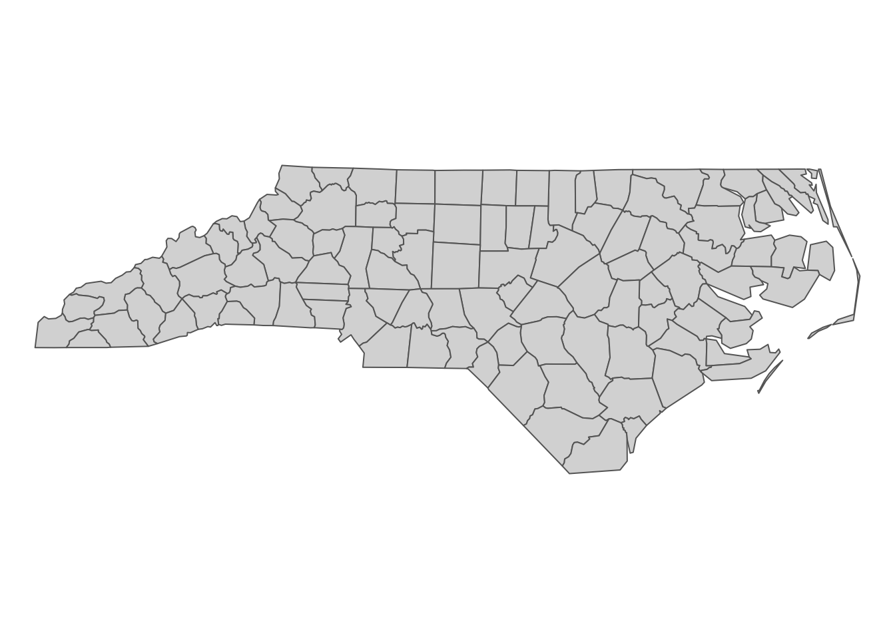
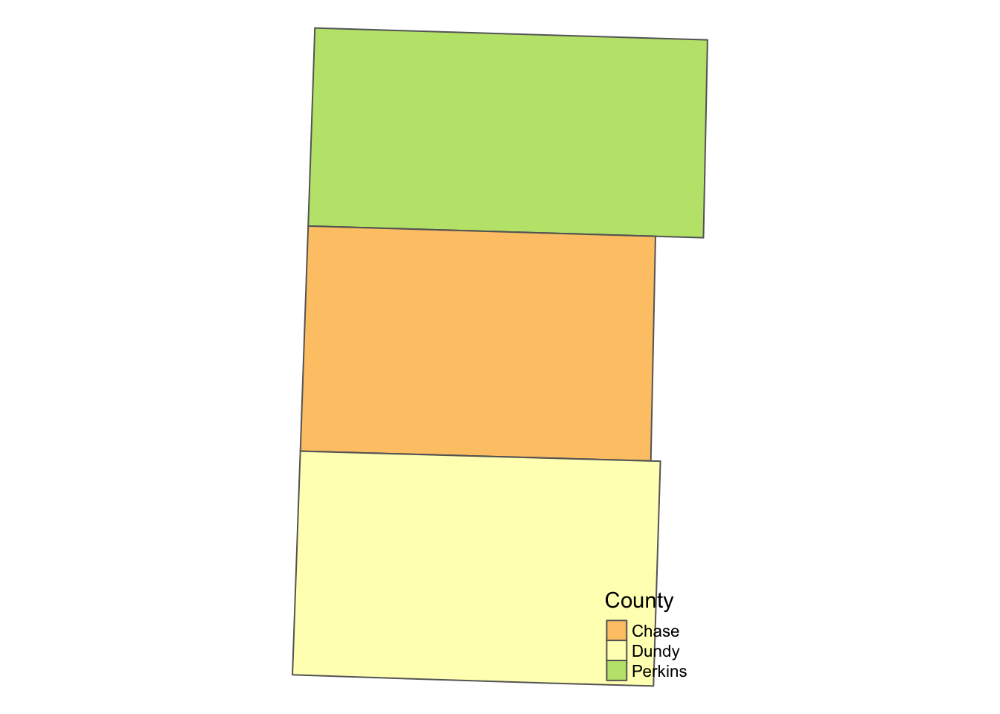
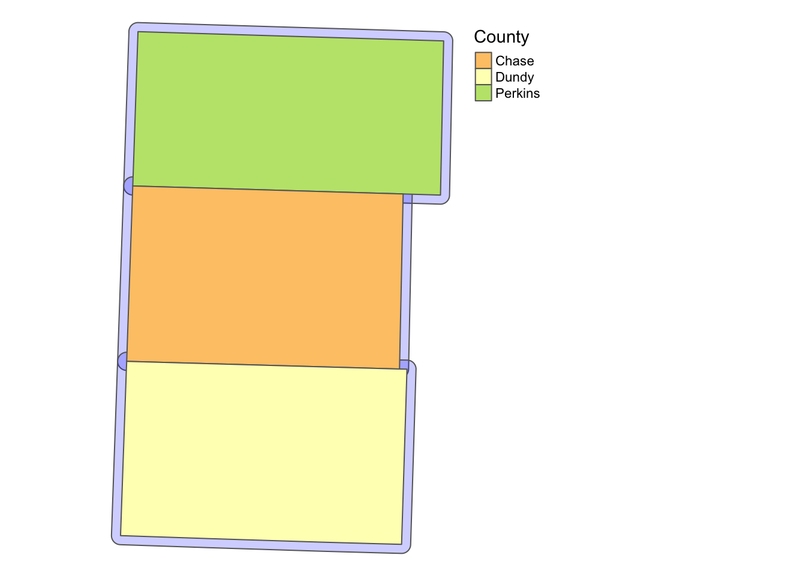

# Vector Data Handling with `sf` {#vector-basics}


## Before you start {-}

In this chapter we learn how to use the `sf` package to handle and operate on spatial datasets. The `sf` package uses the class of simple feature (`sf`)^[Yes, it is the same as the package name.] for spatial objects in R. We first learn how `sf` objects store and represent spatial datasets. We then move on to the following practical topics:

+ read and write a shapefile and spatial data in other formats (and why you might not want to use the shapefile system any more, but use other alternative formats)
+ project and reproject spatial objects
+ convert `sf` objects into `sp` objects, vice versa
+ confirm that `dplyr` works well with `sf` objects
+ implement non-interactive (does not involve two `sf` objects) geometric operations on `sf` objects
  * create buffers 
  * find the area of polygons
  * find the centroid of polygons
  * calculate the length of lines

### `sf` or `sp`? {-}

The `sf` package was designed to replace the `sp` package, which has been one of the most popular and powerful spatial packages in R for more than a decade. It has been about four years since the `sf` package was first registered on CRAN. A couple of years back, many other spatial packages did not have support for the package yet. In this [blog post](https://www.r-bloggers.com/should-i-learn-sf-or-sp-for-spatial-r-programming/) the author responded to the questions of whether one should learn `sp` or `sf` saying,

"That's a tough question. If you have time, I would say, learn to use both. sf is pretty new, so a lot of packages that depend on spatial classes still rely on sp. So you will need to know sp if you want to do any integration with many other packages, including raster (as of March 2018).

However, in the future we should see an increasing shift toward the sf package and greater use of sf classes in other packages. I also think that sf is easier to learn to use than sp."

The future has come, and it's not a tough question anymore. I cannot think of any major spatial packages that do not support `sf` package, and `sf` has largely becomes the standard for handling vector data in $R$^[Even if there are packages that do not support `sf`, you can always go back and forth between `sp` and `sf` objects, which we will learn in Chapter \@ref(conv_sp)]. Thus, this lecture note does not cover how to use `sp` at all.

`sf` has several advantages over the `sp` package [@pebesma2018simple].^[There are cases where `sp` is faster completing the same task than `sf`. For example, see the answer to [this question](https://gis.stackexchange.com/questions/324952/spover-vs-sfst-intersection-in-r). But, I doubt the difference between the two is practically important even with bigger data than the test data.] First, it cut off the tie that `sp` had with ESRI shapefile system, which has a somewhat loose way of representing spatial data. Instead, it uses _simple feature access_, which is an open standard supported by Open Geospatial Consortium (OGC). Another important benefit is its compatibility with the `tidyverse` package, which includes widely popular packages like `ggplot2` and `dplyr`. Consequently, map-making with `ggplot()` and data wrangling with a family of `dplyr` functions come very natural to many $R$ users. `sp` objects have different slots for spatial information and attributes data, and they are not amenable to `dplyr` way of data transformation.

### Direction for replication {-}

**Datasets**

All the datasets that you need to import are available [here](https://www.dropbox.com/sh/c2mxn7bfxepd3wm/AAB77AgOnaCg27gosbAJvrLKa?dl=0). In this chapter, the path to files is set relative to my own working directory (which is hidden). To run the codes without having to mess with paths to the files, follow these steps:

+ set a folder (any folder) as the working directory using `setwd()`  
+ create a folder called "Data" inside the folder designated as the working directory (if you have created a "Data" folder to replicate demonstrations in Chapter \@ref(demo), then skip this step)
+ download the pertinent datasets from [here](https://www.dropbox.com/sh/c2mxn7bfxepd3wm/AAB77AgOnaCg27gosbAJvrLKa?dl=0) and put them in the "Data" folder

**Packages**

Run the following code to install or load (if already installed) the `pacman` package, and then install or load (if already installed) the listed package inside the `pacman::p_load()` function.


```r
if (!require("pacman")) install.packages("pacman")
pacman::p_load(
  sf, # vector data operations
  dplyr, # data wrangling
  data.table, # data wrangling
  tmap, # make maps
  mapview # create an interactive map 
)  
```

## Spatial Data Structure

Here we learn how the `sf` package stores spatial data along with the definition of three key `sf` object classes: simple feature geometry (`sfg`), simple feature geometry list-column (`sfc`), and simple feature (`sf`). The `sf` package provides a simply way of storing geographic information and the attributes of the geographic units in a single dataset. This special type of dataset is called simple feature (`sf`). It is best to take a look at an example to see how this is achieved. We use North Carolina county boundaries with county attributes (Figure \@ref(fig:nc-county)).  


```r
#--- a dataset that comes with the sf package ---#
nc <- st_read(system.file("shape/nc.shp", package="sf")) 
```

```
Reading layer `nc' from data source `/Library/Frameworks/R.framework/Versions/4.0/Resources/library/sf/shape/nc.shp' using driver `ESRI Shapefile'
Simple feature collection with 100 features and 14 fields
geometry type:  MULTIPOLYGON
dimension:      XY
bbox:           xmin: -84.32385 ymin: 33.88199 xmax: -75.45698 ymax: 36.58965
CRS:            4267
```

<div class="figure">

<p class="caption">(\#fig:nc-county)North Carolina county boundary</p>
</div>

As you can see below, this dataset is of class `sf` (and `data.frame` at the same time).


```r
class(nc)
```

```
[1] "sf"         "data.frame"
```

Now, let's take a look inside of `nc`.


```r
#--- take a look at the data ---#
head(nc)
```

```
Simple feature collection with 6 features and 14 fields
geometry type:  MULTIPOLYGON
dimension:      XY
bbox:           xmin: -81.74107 ymin: 36.07282 xmax: -75.77316 ymax: 36.58965
CRS:            4267
   AREA PERIMETER CNTY_ CNTY_ID        NAME  FIPS FIPSNO CRESS_ID BIR74 SID74
1 0.114     1.442  1825    1825        Ashe 37009  37009        5  1091     1
2 0.061     1.231  1827    1827   Alleghany 37005  37005        3   487     0
3 0.143     1.630  1828    1828       Surry 37171  37171       86  3188     5
4 0.070     2.968  1831    1831   Currituck 37053  37053       27   508     1
5 0.153     2.206  1832    1832 Northampton 37131  37131       66  1421     9
6 0.097     1.670  1833    1833    Hertford 37091  37091       46  1452     7
  NWBIR74 BIR79 SID79 NWBIR79                       geometry
1      10  1364     0      19 MULTIPOLYGON (((-81.47276 3...
2      10   542     3      12 MULTIPOLYGON (((-81.23989 3...
3     208  3616     6     260 MULTIPOLYGON (((-80.45634 3...
4     123   830     2     145 MULTIPOLYGON (((-76.00897 3...
5    1066  1606     3    1197 MULTIPOLYGON (((-77.21767 3...
6     954  1838     5    1237 MULTIPOLYGON (((-76.74506 3...
```

Just like a regular `data.frame`, you see a number of variables (attributes) except that you have a variable called `geometry` at the end. Each row represents a single geographic unit (here, county). Ashe County (1st row) has area of $0.114$, FIPS code of $37009$, and so on. And the entry in `geometry` column at the first row represents the geographic information of Ashe County. An entry in the `geometry` column is a simple feature geometry (`sfg`), which is an $R$ object that represents the geographic information of a single geometric feature (county in this example). There are different types of `sfg`s (`POINT`, `LINESTRING`, `POLYGON`, `MULTIPOLYGON`, etc). Here, `sfg`s representing counties in NC are of type `MULTIPOLYGON`. Let's take a look inside the `sfg` for Ashe County using `st_geometry()`.


```r
st_geometry(nc[1, ])[[1]][[1]]
```

```
[[1]]
           [,1]     [,2]
 [1,] -81.47276 36.23436
 [2,] -81.54084 36.27251
 [3,] -81.56198 36.27359
 [4,] -81.63306 36.34069
 [5,] -81.74107 36.39178
 [6,] -81.69828 36.47178
 [7,] -81.70280 36.51934
 [8,] -81.67000 36.58965
 [9,] -81.34530 36.57286
[10,] -81.34754 36.53791
[11,] -81.32478 36.51368
[12,] -81.31332 36.48070
[13,] -81.26624 36.43721
[14,] -81.26284 36.40504
[15,] -81.24069 36.37942
[16,] -81.23989 36.36536
[17,] -81.26424 36.35241
[18,] -81.32899 36.36350
[19,] -81.36137 36.35316
[20,] -81.36569 36.33905
[21,] -81.35413 36.29972
[22,] -81.36745 36.27870
[23,] -81.40639 36.28505
[24,] -81.41233 36.26729
[25,] -81.43104 36.26072
[26,] -81.45289 36.23959
[27,] -81.47276 36.23436
```

As you can see, the `sfg` consists of a number of points (pairs of two numbers). Connecting the points in the order they are stored delineates the Ashe County boundary.


```r
plot(st_geometry(nc[1, ])) 
```


We will take a closer look at different types of `sfg` in the next section. 

Finally, the `geometry` variable is a list of individual `sfg`s, called simple feature geometry list-column (`sfc`).


```r
dplyr::select(nc, geometry)
```

```
Simple feature collection with 100 features and 0 fields
geometry type:  MULTIPOLYGON
dimension:      XY
bbox:           xmin: -84.32385 ymin: 33.88199 xmax: -75.45698 ymax: 36.58965
CRS:            4267
First 10 features:
                         geometry
1  MULTIPOLYGON (((-81.47276 3...
2  MULTIPOLYGON (((-81.23989 3...
3  MULTIPOLYGON (((-80.45634 3...
4  MULTIPOLYGON (((-76.00897 3...
5  MULTIPOLYGON (((-77.21767 3...
6  MULTIPOLYGON (((-76.74506 3...
7  MULTIPOLYGON (((-76.00897 3...
8  MULTIPOLYGON (((-76.56251 3...
9  MULTIPOLYGON (((-78.30876 3...
10 MULTIPOLYGON (((-80.02567 3...
```

Elements of a geometry list-column are allowed to be different in nature from other elements^[This is just like a regular `list` object that can contain mixed types of elements: numeric, character, etc]. In the `nc` data, all the elements (`sfg`s) in `geometry` column are `MULTIPOLYGON`. However, you could also have `LINESTRING` or `POINT` objects mixed with `MULTIPOLYGONS` objects in a single `sf` object if you would like. 

## Simple feature geometry, simple feature geometry list-column, and simple feature

Here, we learn how different types of `sfg` are constructed. We also learn how to create `sfc` and `sf` from `sfg` from scratch.^[Creating spatial objects from scratch yourself is an unnecessary skill for many of us as economists. But, it is still good to know the underlying structure of the data. Also, occasionally the need arises. For example, I had to construct spatial objects from scratch when I designed on-farm randomized nitrogen trials. In such cases, it is of course necessary to understand how different types of `sfg` are constructed, create `sfc` from a collection of `sfg`s, and then create an `sf` from an `sfc`.]    

### Simple feature geometry (`sfg`)

The `sf` package uses a class of `sfg` (simple feature geometry) objects to represent a geometry of a single geometric feature (say, a city as a point, a river as a line, county and school district as polygons). There are different types of `sfg`s. Here are some example feature types that we commonly encounter as an economist^[You will hardly see the other geometry types: MULTIPOINT and GEOMETRYCOLLECTION. You may see GEOMETRYCOLLECTION after intersecting two spatial objects. You can see [here](https://r-spatial.github.io/sf/articles/sf1.html#sfg-simple-feature-geometry-1) if you are interested in learning what they are.]:

+ `POINT`: area-less feature that represents a point (e.g., well, city, farmland) 
+ `LINESTRING`: (e.g., a tributary of a river) 
+ `MULTILINESTRING`: (e.g., river with more than one tributary) 
+ `POLYGON`: geometry with a positive area (e.g., county, state, country)
+ `MULTIPOLYGON`: collection of polygons to represent a single object (e.g., countries with islands: U.S., Japan)

---

`POINT` is the simplest geometry type and is represented by a vector of two^[or three to represent a point in the three-dimensional space] numeric values. An example below shows how a `POINT` feature can be made from scratch:


```r
#--- create a POINT ---#
a_point <- st_point(c(2,1))
```

The `st_point()` function creates a `POINT` object when supplied with a vector of two numeric values. If you check the class of the newly created object,


```r
#--- check the class of the object ---#
class(a_point)
```

```
[1] "XY"    "POINT" "sfg"  
```

you can see that it's indeed a `POINT` object. But, it's also an `sfg` object. So, `a_point` is an `sfg` object of type `POINT`. 

---

A `LINESTRING` objects are represented by a sequence of points:  


```r
#--- collection of points in a matrix form ---#
s1 <- rbind(c(2,3),c(3,4),c(3,5),c(1,5))

#--- see what s1 looks like ---#
s1
```

```
     [,1] [,2]
[1,]    2    3
[2,]    3    4
[3,]    3    5
[4,]    1    5
```

```r
#--- create a "LINESTRING" ---#
a_linestring <- st_linestring(s1)

#--- check the class ---#
class(a_linestring)
```

```
[1] "XY"         "LINESTRING" "sfg"       
```

`s1` is a matrix where each row represents a point. By applying `st_linestring()` function to `s1`, you create a `LINESTRING` object. Let's see what the line looks like.


```r
plot(a_linestring)
```


As you can see, each pair of consecutive points in the matrix are connected by a straight line to form a line. 

---

A `POLYGON` is very similar to `LINESTRING` in the manner it is represented. 


```r
#--- collection of points in a matrix form ---#
p1 <- rbind(c(0,0), c(3,0), c(3,2), c(2,5), c(1,3), c(0,0))

#--- see what s1 looks like ---#
p1
```

```
     [,1] [,2]
[1,]    0    0
[2,]    3    0
[3,]    3    2
[4,]    2    5
[5,]    1    3
[6,]    0    0
```

```r
 #--- create a "LINESTRING" ---#
a_polygon <- st_polygon(list(p1))

#--- check the class ---#
class(a_polygon)
```

```
[1] "XY"      "POLYGON" "sfg"    
```

```r
#--- see what it looks like ---#
plot(a_polygon)
```


Just like the `LINESTRING` object we created earlier, a `POLYGON` is represented by a collection of points. The biggest difference between them is that we need to have some positive area enclosed by lines connecting the points. To do that, you have the the same point for the first and last points to close the loop: here, it's `c(0,0)`. A `POLYGON` can have a hole in it. The first matrix of a list becomes the exterior ring, and all the subsequent matrices will be holes within the exterior ring.  


```r
#--- a hole within p1 ---#
p2 <- rbind(c(1,1), c(1,2), c(2,2), c(1,1))

#--- create a polygon with hole ---#
a_plygon_with_a_hole <- st_polygon(list(p1,p2))

#--- see what it looks like ---#
plot(a_plygon_with_a_hole)
```


---

You can create a `MULTIPOLYGON` object in a similar manner. The only difference is that you supply a list of lists of matrices, with each inner list representing a polygon. An example below: 


```r
#--- second polygon ---#
p3 <- rbind(c(4,0), c(5,0), c(5,3), c(4,2), c(4,0)) 

#--- create a multipolygon ---#
a_multipolygon <- st_multipolygon(list(list(p1,p2), list(p3)))

#--- see what it looks like ---#
plot(a_multipolygon)
```


Each of `list(p1,p2)`, `list(p3,p4)`, `list(p5)` represents a polygon. You supply a list of these lists to the `st_multipolygon()` function to make a `MULTIPOLYGON` object.


### Create simple feature geometry list-column (`sfc`) and simple feature (`sf`) from scratch

To make a simple feature geometry list-column (`sfc`), you can simply supply a list of `sfg` to the `st_sfc()` function as follows:


```r
#--- create an sfc ---#
sfc_ex <- st_sfc(list(a_point,a_linestring,a_polygon,a_multipolygon))
```

To create an `sf` object, you first add an `sfc` as a column to a `data.frame`.  


```r
#--- create a data.frame ---#
df_ex <- data.frame(
  name=c('A','B','C','D')
)

#--- add the sfc as a column ---#
df_ex$geometry <- sfc_ex 

#--- take a look ---#
df_ex
```

```
  name                       geometry
1    A                    POINT (2 1)
2    B LINESTRING (2 3, 3 4, 3 5, ...
3    C POLYGON ((0 0, 3 0, 3 2, 2 ...
4    D MULTIPOLYGON (((0 0, 3 0, 3...
```

At this point, it is not yet recognized as an `sf` by R yet.


```r
#--- see what it looks like (this is not an sf object yet) ---#
class(df_ex)
```

```
[1] "data.frame"
```

You can register it as an `sf` object using `st_as_sf()`.


```r
#--- let R recognize the data frame as sf ---#
sf_ex <- st_as_sf(df_ex)

#--- see what it looks like ---#
sf_ex
```

```
Simple feature collection with 4 features and 1 field
geometry type:  GEOMETRY
dimension:      XY
bbox:           xmin: 0 ymin: 0 xmax: 5 ymax: 5
CRS:            NA
  name                       geometry
1    A                    POINT (2 1)
2    B LINESTRING (2 3, 3 4, 3 5, ...
3    C POLYGON ((0 0, 3 0, 3 2, 2 ...
4    D MULTIPOLYGON (((0 0, 3 0, 3...
```

As you can see `sf_ex` is now recognized also as an `sf` object.  


```r
#--- check the class ---#
class(sf_ex)
```

```
[1] "sf"         "data.frame"
```

## Reading and writing vector data

The vast majority of people still use ArcGIS to handle spatial data, which has its own system of storing spatial data^[See [here]() for how spatial datasets can be stores in various other formats.] called shapefile. So, chances are that your collaborators use shapefiles. Moreover, there are many GIS data online that are available only as shapefiles. So, it is important to learn how to read and write shapefiles. 

### Reading a shapefile

We can use `st_read()` to read a shapefile. It reads in a shapefile and then turn the data into an sf object. Let's take a look at an example. 


```r
#--- read a NE county boundary shapefile ---#
nc_loaded <- st_read(dsn = "./Data", "nc") 
```

Typically, you have two arguments to specify for `st_read()`. The first one is `dsn`, which is basically the path to folder in which the shapefile you want to import is stored. The second one is the name of the shapefile. Notice that you do not add `.shp` extension to the file name: `nc`, not `nc.shp`.^[When storing a spatial dataset, ArcGIS divides the information into separate files. All of them have the same prefix, but have different extensions. We typically say we read a shapefile, but we really are importing all these files including the shapefile with the .shp extension. When you read those data, you just refer to the common prefix because you really are importing all the files, not just a .shp file.].

### Writing to a shapefile

Writing an `sf` object as a shapefile is just as easy. You use the `st_write()` function, with the first argument being the name of the `sf` object you are exporting, and the second being the name of the new shapefile. For example, the code below will export an `sf` object called `nc_loaded` as `nc2.shp` (along with other supporting files). 


```r
st_write(nc_loaded, dsn="./Data", "nc2", driver="ESRI Shapefile", append = FALSE)
```

`append = FALSE` forces writing the data when a file already exists with the same name. Without the option, this happens.


```r
st_write(nc_loaded, dsn="./Data", "nc2", driver="ESRI Shapefile")
```

```
Layer nc2 in dataset ./Data already exists:
use either append=TRUE to append to layer or append=FALSE to overwrite layer
```

```
Error in CPL_write_ogr(obj, dsn, layer, driver, as.character(dataset_options), : Dataset already exists.
```

### Better alternatives 

Now, if your collaborator is using ArcGIS and demanding that he/she needs a shapefile for his/her work, sure you can use the above command to write a shapefile. But, there is really no need to work with the shapefile system. One of the alternative data formats that is considered superior to the shapefile system is GeoPackage^[[here](https://www.geopackage.org/)], which overcomes various limitations associated with shapefile^[see the last paragraph of [chapter 7.5 of this book](https://csgillespie.github.io/efficientR/data-carpentry.html#data-processing-with-data.table), [this blogpost](https://carto.com/blog/fgdb-gpkg/), or [this](http://switchfromshapefile.org/)]. Unlike the shapefile system, it produces only a single file with .gpkg extension.^[Am I the only one who gets very frustrated when your collaborator attaches 15 files for three geographic objects to an email? It could have been just three files using the GeoPackage format.] Note that GeoPackage files can also be easily read into ArcGIS. So, it might be worthwhile to convince your collaborators to stop using shapefiles and start using GeoPackage.  


```r
#--- write as a gpkg file ---#
st_write(nc, dsn = "./Data/nc.gpkg", append = FALSE)

#--- read a gpkg file ---#
nc <- st_read("./Data/nc.gpkg")
```

Or better yet, if your collaborator uses R (or if it is only you who is going to use the data), then just save it as an rds file using `saveRDS()`, which can be of course read using `readRDS()`.


```r
#--- save as an rds ---#
saveRDS(nc, "/Users/tmieno2/Box/Teaching/AAEA R/GIS/nc_county.rds")

#--- read an rds ---#
nc <- readRDS("/Users/tmieno2/Box/Teaching/AAEA R/GIS/nc_county.rds")
```

The use of rds files can be particularly attractive when the dataset is large because rds files are typically more memory efficient than shapefiles, eating up less of your disk memory. 

As you can see here, it is a myth that spatial datasets have to be stored as shapefiles.


## Interactive view of an `sf` object

Sometimes it is useful to be able to tell where spatial objects are and what values are associated with them on a map. The `mapview()` function from the `mapview` package can create an interactive map where you can point to a spatial object and the associated information is revealed on the map. Let's use the North Carolina county map as an example here:


```r
#--- read the NC county map data ---#
nc <- st_read(system.file("shape/nc.shp", package="sf")) 

#--- generate an interactive map ---#
mapview(nc)  
```


```r
mapview(breweries, zcol = c("brewery", "village", "founded"), burst = TRUE) 
```

<!--html_preserve--><div id="htmlwidget-c915bd0a0cf1d4d06e5c" style="width:672px;height:480px;" class="leaflet html-widget"></div>
<script type="application/json" data-for="htmlwidget-c915bd0a0cf1d4d06e5c">{"x":{"options":{"minZoom":1,"maxZoom":52,"crs":{"crsClass":"L.CRS.EPSG3857","code":null,"proj4def":null,"projectedBounds":null,"options":{}},"preferCanvas":false,"bounceAtZoomLimits":false,"maxBounds":[[[-90,-370]],[[90,370]]]},"calls":[{"method":"addProviderTiles","args":["CartoDB.Positron",1,"CartoDB.Positron",{"errorTileUrl":"","noWrap":false,"detectRetina":false}]},{"method":"addProviderTiles","args":["CartoDB.DarkMatter",2,"CartoDB.DarkMatter",{"errorTileUrl":"","noWrap":false,"detectRetina":false}]},{"method":"addProviderTiles","args":["OpenStreetMap",3,"OpenStreetMap",{"errorTileUrl":"","noWrap":false,"detectRetina":false}]},{"method":"addProviderTiles","args":["Esri.WorldImagery",4,"Esri.WorldImagery",{"errorTileUrl":"","noWrap":false,"detectRetina":false}]},{"method":"addProviderTiles","args":["OpenTopoMap",5,"OpenTopoMap",{"errorTileUrl":"","noWrap":false,"detectRetina":false}]},{"method":"createMapPane","args":["point",440]},{"method":"addCircleMarkers","args":[[49.71979,50.125793,49.420804,50.161975,49.977199,49.884051,49.502098,49.892226,49.897336,49.904426,49.889283,49.891858,49.897233,49.274716,49.938394,49.970583,49.963579,49.861905,49.794334,50.136445,49.801844,49.802012,49.701477,49.067436,49.070292,49.93162,50.06583,49.77994,50.008198,49.060542,49.561804,49.595108,49.602554,49.966609,50.243835,49.72581,49.7202,50.075903,49.441712,49.880748,49.881398,49.637445,49.644533,49.645651,49.838404,49.80798,49.615866,50.070044,50.163521,49.534947,49.50683,49.850985,49.81609,48.900742,49.707329,49.884229,50.323171,49.677827,49.792701,49.932447,49.985221,49.450083,49.710838,49.276265,49.82981,50.079029,49.958237,49.554706,49.812436,49.92479,50.441619,49.882777,49.502098,49.861905,49.070292,49.77994,49.060542,49.602554,49.645651,49.50683,48.900742,49.707329,49.276265,49.727998,49.737703,49.755953,49.812489,49.81292,49.794041,49.830486,49.830437,49.844875,49.850922,49.845112,49.864998,49.863762,49.932354,49.914055,49.977985,50.005459,49.86779,49.834755,49.819016,49.868614,49.98679,49.950073,50.035191,49.845585,49.807022,49.770496,49.741394,49.877293,49.311859,49.884663,49.845516,49.841331,49.84127,49.415714,49.358559,49.328201,49.422028,49.912956,49.906281,50.085987,49.800175,49.792423,49.82259,49.882729,49.918533,49.916447,49.916149,49.955219,49.926094,49.756046,49.769699,49.759079,49.759056,49.759369,49.75658,49.75547,49.757275,49.759151,49.759079,49.769176,49.76992,49.760632,49.756065,49.780872,49.681698,50.032757,50.070938,50.03249,50.077583,50.077785,50.116096,50.114841,49.865234,49.969555,49.807861,49.814632,49.924839,49.93961,49.948387,49.866604,49.857391,49.856892,49.894829,49.828178,49.822258,49.75914,49.777538,49.959484,49.958523,50.020378,50.061211,50.180557,49.686993,49.67157,49.67107,49.819889,49.953476,50.079861,50.096077,50.096272,50.066387,50.061771,49.910885,49.923359,49.929886,49.969193,50.019966,49.85778,49.710793,49.701366,50.124729,50.167877,49.979191,48.975365,49.66864,49.977264,49.976788,49.976379,49.67775,49.644543,49.629822,49.524117,49.757332,49.761578,49.756756,49.590153,49.590439,49.970467,49.932583,49.959499,49.940926,50.163834,50.187668,49.505432,49.504299,50.126839,50.072201,50.015476,49.98518,50.0617237],[10.889217,11.238725,10.85194,10.078368,9.97323,11.228988,10.416021,10.884839,10.89281,10.852339,10.887001,10.884856,10.89273,10.928096,11.551041,10.882412,10.882666,11.291932,11.509409,11.24823,11.031657,11.032392,11.163238,10.34418,10.316987,10.859199,10.959201,11.186931,10.905149,10.965571,11.368508,11.009011,11.005049,10.701621,11.935392,11.059662,11.056749,9.462785,10.996247,11.011369,11.014066,10.120459,11.252699,11.248618,10.764381,11.076758,10.630027,10.311011,10.827669,11.157948,11.428338,11.45417,10.986859,11.029479,10.806113,11.267583,11.911507,11.252911,9.623338,11.149891,11.773399,11.308721,11.172792,10.685605,11.53456,11.02381,10.956485,11.22997,11.353455,10.665279,10.11763,11.129541,10.416021,11.291932,10.316987,11.186931,10.965571,11.005049,11.248618,11.428338,11.029479,10.806113,10.685605,11.202701,11.223148,11.175664,11.353571,11.524621,11.510147,11.533767,11.534137,11.509316,11.454213,11.346436,11.337445,11.170451,11.150093,11.235613,11.154755,11.15476,10.997014,10.860221,10.677697,10.812709,10.850785,10.861525,10.879812,10.731019,11.116785,11.057176,10.666598,11.010854,10.390196,10.586872,10.729609,10.733358,10.732983,10.42308,10.697315,10.688195,10.588937,10.751747,10.711439,11.068516,10.924503,10.886357,10.887907,11.129483,11.074138,11.044945,11.050299,11.020145,11.006171,11.175526,10.948509,10.955316,10.954791,10.954485,10.949357,10.947157,10.978947,10.975272,10.982155,11.005458,11.011348,10.894425,10.914654,10.842025,10.882693,11.126538,11.061478,11.126356,11.047853,11.04399,10.965482,11.055395,10.998409,10.885327,11.076536,10.896045,10.664581,10.676866,10.596753,10.65544,10.691162,10.69114,10.724936,10.741153,10.736695,10.900771,11.10287,10.958288,10.956261,10.877286,10.864127,10.995174,11.247886,10.721835,10.723262,11.074085,10.874963,10.990276,10.949882,10.951824,10.958208,10.965541,10.832258,10.778682,10.694327,10.802162,10.827091,10.857496,11.172908,11.163225,10.879002,10.963615,11.090071,10.90459,10.73482,11.036384,11.035488,11.033838,11.253052,11.250622,11.25257,11.585255,10.620051,10.619633,10.617878,10.769536,10.76099,10.721189,10.95277,11.000506,10.971659,10.827574,10.842425,11.737261,11.741035,10.930734,11.545622,11.503718,11.558312,11.0738897],6,null,"brewery",{"crs":{"crsClass":"L.CRS.EPSG3857","code":null,"proj4def":null,"projectedBounds":null,"options":{}},"pane":"point","stroke":true,"color":"#333333","weight":1,"opacity":[0.9,0.9,0.9,0.9,0.9,0.9,0.9,0.9,0.9,0.9,0.9,0.9,0.9,0.9,0.9,0.9,0.9,0.9,0.9,0.9,0.9,0.9,0.9,0.9,0.9,0.9,0.9,0.9,0.9,0.9,0.9,0.9,0.9,0.9,0.9,0.9,0.9,0.9,0.9,0.9,0.9,0.9,0.9,0.9,0.9,0.9,0.9,0.9,0.9,0.9,0.9,0.9,0.9,0.9,0.9,0.9,0.9,0.9,0.9,0.9,0.9,0.9,0.9,0.9,0.9,0.9,0.9,0.9,0.9,0.9,0.9,0.9,0.9,0.9,0.9,0.9,0.9,0.9,0.9,0.9,0.9,0.9,0.9,0.9,0.9,0.9,0.9,0.9,0.9,0.9,0.9,0.9,0.9,0.9,0.9,0.9,0.9,0.9,0.9,0.9,0.9,0.9,0.9,0.9,0.9,0.9,0.9,0.9,0.9,0.9,0.9,0.9,0.9,0.9,0.9,0.9,0.9,0.9,0.9,0.9,0.9,0.9,0.9,0.9,0.9,0.9,0.9,0.9,0.9,0.9,0.9,0.9,0.9,0.9,0.9,0.9,0.9,0.9,0.9,0.9,0.9,0.9,0.9,0.9,0.9,0.9,0.9,0.9,0.9,0.9,0.9,0.9,0.9,0.9,0.9,0.9,0.9,0.9,0.9,0.9,0.9,0.9,0.9,0.9,0.9,0.9,0.9,0.9,0.9,0.9,0.9,0.9,0.9,0.9,0.9,0.9,0.9,0.9,0.9,0.9,0.9,0.9,0.9,0.9,0.9,0.9,0.9,0.9,0.9,0.9,0.9,0.9,0.9,0.9,0.9,0.9,0.9,0.9,0.9,0.9,0.9,0.9,0.9,0.9,0.9,0.9,0.9,0.9,0.9,0.9,0.9,0.9,0.9,0.9,0.9,0.9,0.9,0.9,0.9,0.9,0.9,0.9,0.9,0.9],"fill":true,"fillColor":["#008B98","#00B388","#471E67","#D8E12C","#471E67","#46226A","#00B18A","#481C66","#2F437F","#34C86F","#46CA6A","#009097","#009996","#005A8C","#45266C","#23C771","#00B08B","#4CCB69","#00AE8C","#7CD358","#68D060","#B6DD3A","#412F72","#005D8D","#D2E02E","#363D7C","#00B686","#A3DA44","#A3DA44","#00BC80","#31427F","#41CA6C","#BADD38","#00B884","#98D84A","#00578A","#005E8E","#D2E02E","#C6DF32","#00598B","#007896","#00C179","#254A83","#5FCE63","#007495","#00AF8B","#00A890","#007E97","#92D74D","#83D454","#00B487","#7FD456","#007696","#01C574","#00B289","#00A193","#95D74C","#006D93","#01C574","#2CC770","#007194","#51CC68","#1B4E86","#00C17A","#432B70","#BADD38","#00A392","#00A791","#00C278","#00BD7F","#78D259","#175087","#00B18A","#4CCB69","#D2E02E","#A3DA44","#00BC80","#BADD38","#5FCE63","#00B487","#01C574","#00B289","#00C17A","#008498","#008097","#008298","#00C377","#00568A","#006490","#007A97","#007A97","#00A094","#009D95","#00608E","#009297","#422D71","#00BE7D","#009A95","#16C673","#00A890","#008E98","#3C3777","#00AA8F","#70D15D","#009896","#CFE02F","#2D4580","#006691","#2D4580","#009796","#BDDD37","#00BF7C","#87D553","#3E3475","#6CD05E","#6CD05E","#00C475","#005C8D","#00B586","#63CF61","#008A98","#007996","#009397","#C9DF31","#00A592","#403073","#008197","#008498","#006A92","#006992","#008998","#006E94","#007595","#74D25B","#284882","#00BA82","#5ACE65","#8AD651","#8ED64F","#008D98","#56CD66","#87D553","#007C97","#00A98F","#DBE12C","#284882","#2D4580","#006390","#00B08B","#393A7A","#006691","#007094","#3A3878","#006390","#008898","#00A094","#3AC96D","#007194","#008E98","#9CD848","#008D98","#3D3576","#00AB8E","#009796","#00A691","#45246B","#44286D","#009497","#A6DA43","#00B983","#A9DB41","#007295","#00A293","#015489","#B0DC3D","#343F7D","#00B785","#00AD8D","#008598","#ADDB3F","#00A293","#007A97","#00618F","#009F94","#1F4D85","#33407E","#00AC8D","#007D97","#009E94","#2B4781","#009297","#008197","#383C7B","#422D71","#008F97","#00B785","#00C07B","#D5E12D","#CCE030","#9FD946","#3F3274","#3A3878","#006B93","#224B84","#46CA6A","#008698","#C0DE35","#C3DE34","#009597","#175087","#125187","#481A65","#006791","#3A3878","#0A5388","#008E98","#00BE7D","#00BB81","#B3DC3C","#009B95","#005C8D","#43296E","#472069","#481864"],"fillOpacity":[0.6,0.6,0.6,0.6,0.6,0.6,0.6,0.6,0.6,0.6,0.6,0.6,0.6,0.6,0.6,0.6,0.6,0.6,0.6,0.6,0.6,0.6,0.6,0.6,0.6,0.6,0.6,0.6,0.6,0.6,0.6,0.6,0.6,0.6,0.6,0.6,0.6,0.6,0.6,0.6,0.6,0.6,0.6,0.6,0.6,0.6,0.6,0.6,0.6,0.6,0.6,0.6,0.6,0.6,0.6,0.6,0.6,0.6,0.6,0.6,0.6,0.6,0.6,0.6,0.6,0.6,0.6,0.6,0.6,0.6,0.6,0.6,0.6,0.6,0.6,0.6,0.6,0.6,0.6,0.6,0.6,0.6,0.6,0.6,0.6,0.6,0.6,0.6,0.6,0.6,0.6,0.6,0.6,0.6,0.6,0.6,0.6,0.6,0.6,0.6,0.6,0.6,0.6,0.6,0.6,0.6,0.6,0.6,0.6,0.6,0.6,0.6,0.6,0.6,0.6,0.6,0.6,0.6,0.6,0.6,0.6,0.6,0.6,0.6,0.6,0.6,0.6,0.6,0.6,0.6,0.6,0.6,0.6,0.6,0.6,0.6,0.6,0.6,0.6,0.6,0.6,0.6,0.6,0.6,0.6,0.6,0.6,0.6,0.6,0.6,0.6,0.6,0.6,0.6,0.6,0.6,0.6,0.6,0.6,0.6,0.6,0.6,0.6,0.6,0.6,0.6,0.6,0.6,0.6,0.6,0.6,0.6,0.6,0.6,0.6,0.6,0.6,0.6,0.6,0.6,0.6,0.6,0.6,0.6,0.6,0.6,0.6,0.6,0.6,0.6,0.6,0.6,0.6,0.6,0.6,0.6,0.6,0.6,0.6,0.6,0.6,0.6,0.6,0.6,0.6,0.6,0.6,0.6,0.6,0.6,0.6,0.6,0.6,0.6,0.6,0.6,0.6,0.6,0.6,0.6,0.6,0.6,0.6,0.6]},null,null,["<html><head><link rel=\"stylesheet\" type=\"text/css\" href=\"lib/popup/popup.css\"><\/head><body><div class=\"scrollableContainer\"><table class=\"popup scrollable\" id=\"popup\"><tr class='coord'><td><\/td><td><b>Feature ID<\/b><\/td><td align='right'>1&emsp;<\/td><\/tr><tr class='alt'><td>1<\/td><td><b>brewery&emsp;<\/b><\/td><td align='right'>Brauerei Rittmayer&emsp;<\/td><\/tr><tr><td>2<\/td><td><b>village&emsp;<\/b><\/td><td align='right'>Adelsdorf&emsp;<\/td><\/tr><tr class='alt'><td>3<\/td><td><b>founded&emsp;<\/b><\/td><td align='right'>1422&emsp;<\/td><\/tr><tr><td>4<\/td><td><b>geometry&emsp;<\/b><\/td><td align='right'>sfc_POINT&emsp;<\/td><\/tr><\/table><\/div><\/body><\/html>","<html><head><link rel=\"stylesheet\" type=\"text/css\" href=\"lib/popup/popup.css\"><\/head><body><div class=\"scrollableContainer\"><table class=\"popup scrollable\" id=\"popup\"><tr class='coord'><td><\/td><td><b>Feature ID<\/b><\/td><td align='right'>2&emsp;<\/td><\/tr><tr class='alt'><td>1<\/td><td><b>brewery&emsp;<\/b><\/td><td align='right'>Brauhaus Leikeim&emsp;<\/td><\/tr><tr><td>2<\/td><td><b>village&emsp;<\/b><\/td><td align='right'>Altenkunstadt&emsp;<\/td><\/tr><tr class='alt'><td>3<\/td><td><b>founded&emsp;<\/b><\/td><td align='right'>1887&emsp;<\/td><\/tr><tr><td>4<\/td><td><b>geometry&emsp;<\/b><\/td><td align='right'>sfc_POINT&emsp;<\/td><\/tr><\/table><\/div><\/body><\/html>","<html><head><link rel=\"stylesheet\" type=\"text/css\" href=\"lib/popup/popup.css\"><\/head><body><div class=\"scrollableContainer\"><table class=\"popup scrollable\" id=\"popup\"><tr class='coord'><td><\/td><td><b>Feature ID<\/b><\/td><td align='right'>3&emsp;<\/td><\/tr><tr class='alt'><td>1<\/td><td><b>brewery&emsp;<\/b><\/td><td align='right'>Ammerndorfer Bier Dorn-Braeu H. Murmann GmbH & Co. KG&emsp;<\/td><\/tr><tr><td>2<\/td><td><b>village&emsp;<\/b><\/td><td align='right'>Ammerndorf&emsp;<\/td><\/tr><tr class='alt'><td>3<\/td><td><b>founded&emsp;<\/b><\/td><td align='right'>1730&emsp;<\/td><\/tr><tr><td>4<\/td><td><b>geometry&emsp;<\/b><\/td><td align='right'>sfc_POINT&emsp;<\/td><\/tr><\/table><\/div><\/body><\/html>","<html><head><link rel=\"stylesheet\" type=\"text/css\" href=\"lib/popup/popup.css\"><\/head><body><div class=\"scrollableContainer\"><table class=\"popup scrollable\" id=\"popup\"><tr class='coord'><td><\/td><td><b>Feature ID<\/b><\/td><td align='right'>4&emsp;<\/td><\/tr><tr class='alt'><td>1<\/td><td><b>brewery&emsp;<\/b><\/td><td align='right'>Wittelsbacher Turm Braeu GmbH&emsp;<\/td><\/tr><tr><td>2<\/td><td><b>village&emsp;<\/b><\/td><td align='right'>Bad Kissingen&emsp;<\/td><\/tr><tr class='alt'><td>3<\/td><td><b>founded&emsp;<\/b><\/td><td align='right'>NA&emsp;<\/td><\/tr><tr><td>4<\/td><td><b>geometry&emsp;<\/b><\/td><td align='right'>sfc_POINT&emsp;<\/td><\/tr><\/table><\/div><\/body><\/html>","<html><head><link rel=\"stylesheet\" type=\"text/css\" href=\"lib/popup/popup.css\"><\/head><body><div class=\"scrollableContainer\"><table class=\"popup scrollable\" id=\"popup\"><tr class='coord'><td><\/td><td><b>Feature ID<\/b><\/td><td align='right'>5&emsp;<\/td><\/tr><tr class='alt'><td>1<\/td><td><b>brewery&emsp;<\/b><\/td><td align='right'>Arnsteiner Brauerei&emsp;<\/td><\/tr><tr><td>2<\/td><td><b>village&emsp;<\/b><\/td><td align='right'>Arnstein&emsp;<\/td><\/tr><tr class='alt'><td>3<\/td><td><b>founded&emsp;<\/b><\/td><td align='right'>1885&emsp;<\/td><\/tr><tr><td>4<\/td><td><b>geometry&emsp;<\/b><\/td><td align='right'>sfc_POINT&emsp;<\/td><\/tr><\/table><\/div><\/body><\/html>","<html><head><link rel=\"stylesheet\" type=\"text/css\" href=\"lib/popup/popup.css\"><\/head><body><div class=\"scrollableContainer\"><table class=\"popup scrollable\" id=\"popup\"><tr class='coord'><td><\/td><td><b>Feature ID<\/b><\/td><td align='right'>6&emsp;<\/td><\/tr><tr class='alt'><td>1<\/td><td><b>brewery&emsp;<\/b><\/td><td align='right'>Aufsesser Brauerei&emsp;<\/td><\/tr><tr><td>2<\/td><td><b>village&emsp;<\/b><\/td><td align='right'>Aufsess&emsp;<\/td><\/tr><tr class='alt'><td>3<\/td><td><b>founded&emsp;<\/b><\/td><td align='right'>1886&emsp;<\/td><\/tr><tr><td>4<\/td><td><b>geometry&emsp;<\/b><\/td><td align='right'>sfc_POINT&emsp;<\/td><\/tr><\/table><\/div><\/body><\/html>","<html><head><link rel=\"stylesheet\" type=\"text/css\" href=\"lib/popup/popup.css\"><\/head><body><div class=\"scrollableContainer\"><table class=\"popup scrollable\" id=\"popup\"><tr class='coord'><td><\/td><td><b>Feature ID<\/b><\/td><td align='right'>7&emsp;<\/td><\/tr><tr class='alt'><td>1<\/td><td><b>brewery&emsp;<\/b><\/td><td align='right'>Brauhaus Doebler&emsp;<\/td><\/tr><tr><td>2<\/td><td><b>village&emsp;<\/b><\/td><td align='right'>Bad Windsheim&emsp;<\/td><\/tr><tr class='alt'><td>3<\/td><td><b>founded&emsp;<\/b><\/td><td align='right'>1867&emsp;<\/td><\/tr><tr><td>4<\/td><td><b>geometry&emsp;<\/b><\/td><td align='right'>sfc_POINT&emsp;<\/td><\/tr><\/table><\/div><\/body><\/html>","<html><head><link rel=\"stylesheet\" type=\"text/css\" href=\"lib/popup/popup.css\"><\/head><body><div class=\"scrollableContainer\"><table class=\"popup scrollable\" id=\"popup\"><tr class='coord'><td><\/td><td><b>Feature ID<\/b><\/td><td align='right'>8&emsp;<\/td><\/tr><tr class='alt'><td>1<\/td><td><b>brewery&emsp;<\/b><\/td><td align='right'>Ambraeusianum GmbH&emsp;<\/td><\/tr><tr><td>2<\/td><td><b>village&emsp;<\/b><\/td><td align='right'>Bamberg&emsp;<\/td><\/tr><tr class='alt'><td>3<\/td><td><b>founded&emsp;<\/b><\/td><td align='right'>2004&emsp;<\/td><\/tr><tr><td>4<\/td><td><b>geometry&emsp;<\/b><\/td><td align='right'>sfc_POINT&emsp;<\/td><\/tr><\/table><\/div><\/body><\/html>","<html><head><link rel=\"stylesheet\" type=\"text/css\" href=\"lib/popup/popup.css\"><\/head><body><div class=\"scrollableContainer\"><table class=\"popup scrollable\" id=\"popup\"><tr class='coord'><td><\/td><td><b>Feature ID<\/b><\/td><td align='right'>9&emsp;<\/td><\/tr><tr class='alt'><td>1<\/td><td><b>brewery&emsp;<\/b><\/td><td align='right'>Brauerei Faessla GmbH & Co. KG&emsp;<\/td><\/tr><tr><td>2<\/td><td><b>village&emsp;<\/b><\/td><td align='right'>Bamberg&emsp;<\/td><\/tr><tr class='alt'><td>3<\/td><td><b>founded&emsp;<\/b><\/td><td align='right'>1694&emsp;<\/td><\/tr><tr><td>4<\/td><td><b>geometry&emsp;<\/b><\/td><td align='right'>sfc_POINT&emsp;<\/td><\/tr><\/table><\/div><\/body><\/html>","<html><head><link rel=\"stylesheet\" type=\"text/css\" href=\"lib/popup/popup.css\"><\/head><body><div class=\"scrollableContainer\"><table class=\"popup scrollable\" id=\"popup\"><tr class='coord'><td><\/td><td><b>Feature ID<\/b><\/td><td align='right'>10&emsp;<\/td><\/tr><tr class='alt'><td>1<\/td><td><b>brewery&emsp;<\/b><\/td><td align='right'>Kaiserdom Specialitaeten Brauerei GmbH Bamberg&emsp;<\/td><\/tr><tr><td>2<\/td><td><b>village&emsp;<\/b><\/td><td align='right'>Bamberg&emsp;<\/td><\/tr><tr class='alt'><td>3<\/td><td><b>founded&emsp;<\/b><\/td><td align='right'>1718&emsp;<\/td><\/tr><tr><td>4<\/td><td><b>geometry&emsp;<\/b><\/td><td align='right'>sfc_POINT&emsp;<\/td><\/tr><\/table><\/div><\/body><\/html>","<html><head><link rel=\"stylesheet\" type=\"text/css\" href=\"lib/popup/popup.css\"><\/head><body><div class=\"scrollableContainer\"><table class=\"popup scrollable\" id=\"popup\"><tr class='coord'><td><\/td><td><b>Feature ID<\/b><\/td><td align='right'>11&emsp;<\/td><\/tr><tr class='alt'><td>1<\/td><td><b>brewery&emsp;<\/b><\/td><td align='right'>Klosterbraeu Bamberg&emsp;<\/td><\/tr><tr><td>2<\/td><td><b>village&emsp;<\/b><\/td><td align='right'>Bamberg&emsp;<\/td><\/tr><tr class='alt'><td>3<\/td><td><b>founded&emsp;<\/b><\/td><td align='right'>1533&emsp;<\/td><\/tr><tr><td>4<\/td><td><b>geometry&emsp;<\/b><\/td><td align='right'>sfc_POINT&emsp;<\/td><\/tr><\/table><\/div><\/body><\/html>","<html><head><link rel=\"stylesheet\" type=\"text/css\" href=\"lib/popup/popup.css\"><\/head><body><div class=\"scrollableContainer\"><table class=\"popup scrollable\" id=\"popup\"><tr class='coord'><td><\/td><td><b>Feature ID<\/b><\/td><td align='right'>12&emsp;<\/td><\/tr><tr class='alt'><td>1<\/td><td><b>brewery&emsp;<\/b><\/td><td align='right'>Brauerei Schlenkerla&emsp;<\/td><\/tr><tr><td>2<\/td><td><b>village&emsp;<\/b><\/td><td align='right'>Bamberg&emsp;<\/td><\/tr><tr class='alt'><td>3<\/td><td><b>founded&emsp;<\/b><\/td><td align='right'>1405&emsp;<\/td><\/tr><tr><td>4<\/td><td><b>geometry&emsp;<\/b><\/td><td align='right'>sfc_POINT&emsp;<\/td><\/tr><\/table><\/div><\/body><\/html>","<html><head><link rel=\"stylesheet\" type=\"text/css\" href=\"lib/popup/popup.css\"><\/head><body><div class=\"scrollableContainer\"><table class=\"popup scrollable\" id=\"popup\"><tr class='coord'><td><\/td><td><b>Feature ID<\/b><\/td><td align='right'>13&emsp;<\/td><\/tr><tr class='alt'><td>1<\/td><td><b>brewery&emsp;<\/b><\/td><td align='right'>Brauerei Spezial&emsp;<\/td><\/tr><tr><td>2<\/td><td><b>village&emsp;<\/b><\/td><td align='right'>Bamberg&emsp;<\/td><\/tr><tr class='alt'><td>3<\/td><td><b>founded&emsp;<\/b><\/td><td align='right'>1536&emsp;<\/td><\/tr><tr><td>4<\/td><td><b>geometry&emsp;<\/b><\/td><td align='right'>sfc_POINT&emsp;<\/td><\/tr><\/table><\/div><\/body><\/html>","<html><head><link rel=\"stylesheet\" type=\"text/css\" href=\"lib/popup/popup.css\"><\/head><body><div class=\"scrollableContainer\"><table class=\"popup scrollable\" id=\"popup\"><tr class='coord'><td><\/td><td><b>Feature ID<\/b><\/td><td align='right'>14&emsp;<\/td><\/tr><tr class='alt'><td>1<\/td><td><b>brewery&emsp;<\/b><\/td><td align='right'>Brauerei Gundel GmbH&emsp;<\/td><\/tr><tr><td>2<\/td><td><b>village&emsp;<\/b><\/td><td align='right'>Barthelmesaurach&emsp;<\/td><\/tr><tr class='alt'><td>3<\/td><td><b>founded&emsp;<\/b><\/td><td align='right'>1887&emsp;<\/td><\/tr><tr><td>4<\/td><td><b>geometry&emsp;<\/b><\/td><td align='right'>sfc_POINT&emsp;<\/td><\/tr><\/table><\/div><\/body><\/html>","<html><head><link rel=\"stylesheet\" type=\"text/css\" href=\"lib/popup/popup.css\"><\/head><body><div class=\"scrollableContainer\"><table class=\"popup scrollable\" id=\"popup\"><tr class='coord'><td><\/td><td><b>Feature ID<\/b><\/td><td align='right'>15&emsp;<\/td><\/tr><tr class='alt'><td>1<\/td><td><b>brewery&emsp;<\/b><\/td><td align='right'>Becher Braeu&emsp;<\/td><\/tr><tr><td>2<\/td><td><b>village&emsp;<\/b><\/td><td align='right'>Bayreuth&emsp;<\/td><\/tr><tr class='alt'><td>3<\/td><td><b>founded&emsp;<\/b><\/td><td align='right'>1781&emsp;<\/td><\/tr><tr><td>4<\/td><td><b>geometry&emsp;<\/b><\/td><td align='right'>sfc_POINT&emsp;<\/td><\/tr><\/table><\/div><\/body><\/html>","<html><head><link rel=\"stylesheet\" type=\"text/css\" href=\"lib/popup/popup.css\"><\/head><body><div class=\"scrollableContainer\"><table class=\"popup scrollable\" id=\"popup\"><tr class='coord'><td><\/td><td><b>Feature ID<\/b><\/td><td align='right'>16&emsp;<\/td><\/tr><tr class='alt'><td>1<\/td><td><b>brewery&emsp;<\/b><\/td><td align='right'>Huemmer Braeu&emsp;<\/td><\/tr><tr><td>2<\/td><td><b>village&emsp;<\/b><\/td><td align='right'>Breitenguessbach&emsp;<\/td><\/tr><tr class='alt'><td>3<\/td><td><b>founded&emsp;<\/b><\/td><td align='right'>2011&emsp;<\/td><\/tr><tr><td>4<\/td><td><b>geometry&emsp;<\/b><\/td><td align='right'>sfc_POINT&emsp;<\/td><\/tr><\/table><\/div><\/body><\/html>","<html><head><link rel=\"stylesheet\" type=\"text/css\" href=\"lib/popup/popup.css\"><\/head><body><div class=\"scrollableContainer\"><table class=\"popup scrollable\" id=\"popup\"><tr class='coord'><td><\/td><td><b>Feature ID<\/b><\/td><td align='right'>17&emsp;<\/td><\/tr><tr class='alt'><td>1<\/td><td><b>brewery&emsp;<\/b><\/td><td align='right'>Brauhaus Binkert GmbH & Co. KG&emsp;<\/td><\/tr><tr><td>2<\/td><td><b>village&emsp;<\/b><\/td><td align='right'>Breitenguessbach&emsp;<\/td><\/tr><tr class='alt'><td>3<\/td><td><b>founded&emsp;<\/b><\/td><td align='right'>2012&emsp;<\/td><\/tr><tr><td>4<\/td><td><b>geometry&emsp;<\/b><\/td><td align='right'>sfc_POINT&emsp;<\/td><\/tr><\/table><\/div><\/body><\/html>","<html><head><link rel=\"stylesheet\" type=\"text/css\" href=\"lib/popup/popup.css\"><\/head><body><div class=\"scrollableContainer\"><table class=\"popup scrollable\" id=\"popup\"><tr class='coord'><td><\/td><td><b>Feature ID<\/b><\/td><td align='right'>18&emsp;<\/td><\/tr><tr class='alt'><td>1<\/td><td><b>brewery&emsp;<\/b><\/td><td align='right'>Krug-Braeu&emsp;<\/td><\/tr><tr><td>2<\/td><td><b>village&emsp;<\/b><\/td><td align='right'>Waischenfeld&emsp;<\/td><\/tr><tr class='alt'><td>3<\/td><td><b>founded&emsp;<\/b><\/td><td align='right'>1834&emsp;<\/td><\/tr><tr><td>4<\/td><td><b>geometry&emsp;<\/b><\/td><td align='right'>sfc_POINT&emsp;<\/td><\/tr><\/table><\/div><\/body><\/html>","<html><head><link rel=\"stylesheet\" type=\"text/css\" href=\"lib/popup/popup.css\"><\/head><body><div class=\"scrollableContainer\"><table class=\"popup scrollable\" id=\"popup\"><tr class='coord'><td><\/td><td><b>Feature ID<\/b><\/td><td align='right'>19&emsp;<\/td><\/tr><tr class='alt'><td>1<\/td><td><b>brewery&emsp;<\/b><\/td><td align='right'>Brauerei-Gasthof Herold&emsp;<\/td><\/tr><tr><td>2<\/td><td><b>village&emsp;<\/b><\/td><td align='right'>Buechenbach&emsp;<\/td><\/tr><tr class='alt'><td>3<\/td><td><b>founded&emsp;<\/b><\/td><td align='right'>1568&emsp;<\/td><\/tr><tr><td>4<\/td><td><b>geometry&emsp;<\/b><\/td><td align='right'>sfc_POINT&emsp;<\/td><\/tr><\/table><\/div><\/body><\/html>","<html><head><link rel=\"stylesheet\" type=\"text/css\" href=\"lib/popup/popup.css\"><\/head><body><div class=\"scrollableContainer\"><table class=\"popup scrollable\" id=\"popup\"><tr class='coord'><td><\/td><td><b>Feature ID<\/b><\/td><td align='right'>20&emsp;<\/td><\/tr><tr class='alt'><td>1<\/td><td><b>brewery&emsp;<\/b><\/td><td align='right'>Privatbrauerei Guenther&emsp;<\/td><\/tr><tr><td>2<\/td><td><b>village&emsp;<\/b><\/td><td align='right'>Burgkunstadt&emsp;<\/td><\/tr><tr class='alt'><td>3<\/td><td><b>founded&emsp;<\/b><\/td><td align='right'>1840&emsp;<\/td><\/tr><tr><td>4<\/td><td><b>geometry&emsp;<\/b><\/td><td align='right'>sfc_POINT&emsp;<\/td><\/tr><\/table><\/div><\/body><\/html>","<html><head><link rel=\"stylesheet\" type=\"text/css\" href=\"lib/popup/popup.css\"><\/head><body><div class=\"scrollableContainer\"><table class=\"popup scrollable\" id=\"popup\"><tr class='coord'><td><\/td><td><b>Feature ID<\/b><\/td><td align='right'>21&emsp;<\/td><\/tr><tr class='alt'><td>1<\/td><td><b>brewery&emsp;<\/b><\/td><td align='right'>Loewenbraeu Buttenheim&emsp;<\/td><\/tr><tr><td>2<\/td><td><b>village&emsp;<\/b><\/td><td align='right'>Buttenheim&emsp;<\/td><\/tr><tr class='alt'><td>3<\/td><td><b>founded&emsp;<\/b><\/td><td align='right'>1880&emsp;<\/td><\/tr><tr><td>4<\/td><td><b>geometry&emsp;<\/b><\/td><td align='right'>sfc_POINT&emsp;<\/td><\/tr><\/table><\/div><\/body><\/html>","<html><head><link rel=\"stylesheet\" type=\"text/css\" href=\"lib/popup/popup.css\"><\/head><body><div class=\"scrollableContainer\"><table class=\"popup scrollable\" id=\"popup\"><tr class='coord'><td><\/td><td><b>Feature ID<\/b><\/td><td align='right'>22&emsp;<\/td><\/tr><tr class='alt'><td>1<\/td><td><b>brewery&emsp;<\/b><\/td><td align='right'>St. GeorgenBraeu&emsp;<\/td><\/tr><tr><td>2<\/td><td><b>village&emsp;<\/b><\/td><td align='right'>Buttenheim&emsp;<\/td><\/tr><tr class='alt'><td>3<\/td><td><b>founded&emsp;<\/b><\/td><td align='right'>1624&emsp;<\/td><\/tr><tr><td>4<\/td><td><b>geometry&emsp;<\/b><\/td><td align='right'>sfc_POINT&emsp;<\/td><\/tr><\/table><\/div><\/body><\/html>","<html><head><link rel=\"stylesheet\" type=\"text/css\" href=\"lib/popup/popup.css\"><\/head><body><div class=\"scrollableContainer\"><table class=\"popup scrollable\" id=\"popup\"><tr class='coord'><td><\/td><td><b>Feature ID<\/b><\/td><td align='right'>23&emsp;<\/td><\/tr><tr class='alt'><td>1<\/td><td><b>brewery&emsp;<\/b><\/td><td align='right'>Brauerei Alt Dietzhof&emsp;<\/td><\/tr><tr><td>2<\/td><td><b>village&emsp;<\/b><\/td><td align='right'>Leutenbach&emsp;<\/td><\/tr><tr class='alt'><td>3<\/td><td><b>founded&emsp;<\/b><\/td><td align='right'>1886&emsp;<\/td><\/tr><tr><td>4<\/td><td><b>geometry&emsp;<\/b><\/td><td align='right'>sfc_POINT&emsp;<\/td><\/tr><\/table><\/div><\/body><\/html>","<html><head><link rel=\"stylesheet\" type=\"text/css\" href=\"lib/popup/popup.css\"><\/head><body><div class=\"scrollableContainer\"><table class=\"popup scrollable\" id=\"popup\"><tr class='coord'><td><\/td><td><b>Feature ID<\/b><\/td><td align='right'>24&emsp;<\/td><\/tr><tr class='alt'><td>1<\/td><td><b>brewery&emsp;<\/b><\/td><td align='right'>Brauerei Hauf KG&emsp;<\/td><\/tr><tr><td>2<\/td><td><b>village&emsp;<\/b><\/td><td align='right'>Dinkelsbuehl&emsp;<\/td><\/tr><tr class='alt'><td>3<\/td><td><b>founded&emsp;<\/b><\/td><td align='right'>1901&emsp;<\/td><\/tr><tr><td>4<\/td><td><b>geometry&emsp;<\/b><\/td><td align='right'>sfc_POINT&emsp;<\/td><\/tr><\/table><\/div><\/body><\/html>","<html><head><link rel=\"stylesheet\" type=\"text/css\" href=\"lib/popup/popup.css\"><\/head><body><div class=\"scrollableContainer\"><table class=\"popup scrollable\" id=\"popup\"><tr class='coord'><td><\/td><td><b>Feature ID<\/b><\/td><td align='right'>25&emsp;<\/td><\/tr><tr class='alt'><td>1<\/td><td><b>brewery&emsp;<\/b><\/td><td align='right'>Weib's Brauhaus Dinkelsbuehl&emsp;<\/td><\/tr><tr><td>2<\/td><td><b>village&emsp;<\/b><\/td><td align='right'>Dinkelsbuehl&emsp;<\/td><\/tr><tr class='alt'><td>3<\/td><td><b>founded&emsp;<\/b><\/td><td align='right'>1999&emsp;<\/td><\/tr><tr><td>4<\/td><td><b>geometry&emsp;<\/b><\/td><td align='right'>sfc_POINT&emsp;<\/td><\/tr><\/table><\/div><\/body><\/html>","<html><head><link rel=\"stylesheet\" type=\"text/css\" href=\"lib/popup/popup.css\"><\/head><body><div class=\"scrollableContainer\"><table class=\"popup scrollable\" id=\"popup\"><tr class='coord'><td><\/td><td><b>Feature ID<\/b><\/td><td align='right'>26&emsp;<\/td><\/tr><tr class='alt'><td>1<\/td><td><b>brewery&emsp;<\/b><\/td><td align='right'>Brauerei Eichhorn&emsp;<\/td><\/tr><tr><td>2<\/td><td><b>village&emsp;<\/b><\/td><td align='right'>Hallstadt&emsp;<\/td><\/tr><tr class='alt'><td>3<\/td><td><b>founded&emsp;<\/b><\/td><td align='right'>NA&emsp;<\/td><\/tr><tr><td>4<\/td><td><b>geometry&emsp;<\/b><\/td><td align='right'>sfc_POINT&emsp;<\/td><\/tr><\/table><\/div><\/body><\/html>","<html><head><link rel=\"stylesheet\" type=\"text/css\" href=\"lib/popup/popup.css\"><\/head><body><div class=\"scrollableContainer\"><table class=\"popup scrollable\" id=\"popup\"><tr class='coord'><td><\/td><td><b>Feature ID<\/b><\/td><td align='right'>27&emsp;<\/td><\/tr><tr class='alt'><td>1<\/td><td><b>brewery&emsp;<\/b><\/td><td align='right'>Ebensfelder Brauhaus&emsp;<\/td><\/tr><tr><td>2<\/td><td><b>village&emsp;<\/b><\/td><td align='right'>Ebensfeld&emsp;<\/td><\/tr><tr class='alt'><td>3<\/td><td><b>founded&emsp;<\/b><\/td><td align='right'>1752&emsp;<\/td><\/tr><tr><td>4<\/td><td><b>geometry&emsp;<\/b><\/td><td align='right'>sfc_POINT&emsp;<\/td><\/tr><\/table><\/div><\/body><\/html>","<html><head><link rel=\"stylesheet\" type=\"text/css\" href=\"lib/popup/popup.css\"><\/head><body><div class=\"scrollableContainer\"><table class=\"popup scrollable\" id=\"popup\"><tr class='coord'><td><\/td><td><b>Feature ID<\/b><\/td><td align='right'>28&emsp;<\/td><\/tr><tr class='alt'><td>1<\/td><td><b>brewery&emsp;<\/b><\/td><td align='right'>Schwanenbraeu&emsp;<\/td><\/tr><tr><td>2<\/td><td><b>village&emsp;<\/b><\/td><td align='right'>Ebermannstadt&emsp;<\/td><\/tr><tr class='alt'><td>3<\/td><td><b>founded&emsp;<\/b><\/td><td align='right'>1812&emsp;<\/td><\/tr><tr><td>4<\/td><td><b>geometry&emsp;<\/b><\/td><td align='right'>sfc_POINT&emsp;<\/td><\/tr><\/table><\/div><\/body><\/html>","<html><head><link rel=\"stylesheet\" type=\"text/css\" href=\"lib/popup/popup.css\"><\/head><body><div class=\"scrollableContainer\"><table class=\"popup scrollable\" id=\"popup\"><tr class='coord'><td><\/td><td><b>Feature ID<\/b><\/td><td align='right'>29&emsp;<\/td><\/tr><tr class='alt'><td>1<\/td><td><b>brewery&emsp;<\/b><\/td><td align='right'>Schwanen-Braeu Ebing&emsp;<\/td><\/tr><tr><td>2<\/td><td><b>village&emsp;<\/b><\/td><td align='right'>Ebing&emsp;<\/td><\/tr><tr class='alt'><td>3<\/td><td><b>founded&emsp;<\/b><\/td><td align='right'>1859&emsp;<\/td><\/tr><tr><td>4<\/td><td><b>geometry&emsp;<\/b><\/td><td align='right'>sfc_POINT&emsp;<\/td><\/tr><\/table><\/div><\/body><\/html>","<html><head><link rel=\"stylesheet\" type=\"text/css\" href=\"lib/popup/popup.css\"><\/head><body><div class=\"scrollableContainer\"><table class=\"popup scrollable\" id=\"popup\"><tr class='coord'><td><\/td><td><b>Feature ID<\/b><\/td><td align='right'>30&emsp;<\/td><\/tr><tr class='alt'><td>1<\/td><td><b>brewery&emsp;<\/b><\/td><td align='right'>Fuerst Carl Schlossbrauerei Ellingen&emsp;<\/td><\/tr><tr><td>2<\/td><td><b>village&emsp;<\/b><\/td><td align='right'>Ellingen&emsp;<\/td><\/tr><tr class='alt'><td>3<\/td><td><b>founded&emsp;<\/b><\/td><td align='right'>1690&emsp;<\/td><\/tr><tr><td>4<\/td><td><b>geometry&emsp;<\/b><\/td><td align='right'>sfc_POINT&emsp;<\/td><\/tr><\/table><\/div><\/body><\/html>","<html><head><link rel=\"stylesheet\" type=\"text/css\" href=\"lib/popup/popup.css\"><\/head><body><div class=\"scrollableContainer\"><table class=\"popup scrollable\" id=\"popup\"><tr class='coord'><td><\/td><td><b>Feature ID<\/b><\/td><td align='right'>31&emsp;<\/td><\/tr><tr class='alt'><td>1<\/td><td><b>brewery&emsp;<\/b><\/td><td align='right'>Brauerei Enzensteiner&emsp;<\/td><\/tr><tr><td>2<\/td><td><b>village&emsp;<\/b><\/td><td align='right'>Schnaittach&emsp;<\/td><\/tr><tr class='alt'><td>3<\/td><td><b>founded&emsp;<\/b><\/td><td align='right'>1998&emsp;<\/td><\/tr><tr><td>4<\/td><td><b>geometry&emsp;<\/b><\/td><td align='right'>sfc_POINT&emsp;<\/td><\/tr><\/table><\/div><\/body><\/html>","<html><head><link rel=\"stylesheet\" type=\"text/css\" href=\"lib/popup/popup.css\"><\/head><body><div class=\"scrollableContainer\"><table class=\"popup scrollable\" id=\"popup\"><tr class='coord'><td><\/td><td><b>Feature ID<\/b><\/td><td align='right'>32&emsp;<\/td><\/tr><tr class='alt'><td>1<\/td><td><b>brewery&emsp;<\/b><\/td><td align='right'>Kitzmann-Braeu GmbH & Co. Kg&emsp;<\/td><\/tr><tr><td>2<\/td><td><b>village&emsp;<\/b><\/td><td align='right'>Erlangen&emsp;<\/td><\/tr><tr class='alt'><td>3<\/td><td><b>founded&emsp;<\/b><\/td><td align='right'>1712&emsp;<\/td><\/tr><tr><td>4<\/td><td><b>geometry&emsp;<\/b><\/td><td align='right'>sfc_POINT&emsp;<\/td><\/tr><\/table><\/div><\/body><\/html>","<html><head><link rel=\"stylesheet\" type=\"text/css\" href=\"lib/popup/popup.css\"><\/head><body><div class=\"scrollableContainer\"><table class=\"popup scrollable\" id=\"popup\"><tr class='coord'><td><\/td><td><b>Feature ID<\/b><\/td><td align='right'>33&emsp;<\/td><\/tr><tr class='alt'><td>1<\/td><td><b>brewery&emsp;<\/b><\/td><td align='right'>Steinbach Braeu&emsp;<\/td><\/tr><tr><td>2<\/td><td><b>village&emsp;<\/b><\/td><td align='right'>Erlangen&emsp;<\/td><\/tr><tr class='alt'><td>3<\/td><td><b>founded&emsp;<\/b><\/td><td align='right'>1653&emsp;<\/td><\/tr><tr><td>4<\/td><td><b>geometry&emsp;<\/b><\/td><td align='right'>sfc_POINT&emsp;<\/td><\/tr><\/table><\/div><\/body><\/html>","<html><head><link rel=\"stylesheet\" type=\"text/css\" href=\"lib/popup/popup.css\"><\/head><body><div class=\"scrollableContainer\"><table class=\"popup scrollable\" id=\"popup\"><tr class='coord'><td><\/td><td><b>Feature ID<\/b><\/td><td align='right'>34&emsp;<\/td><\/tr><tr class='alt'><td>1<\/td><td><b>brewery&emsp;<\/b><\/td><td align='right'>Eschenbacher Privatbrauerei GmbH&emsp;<\/td><\/tr><tr><td>2<\/td><td><b>village&emsp;<\/b><\/td><td align='right'>Eltmann&emsp;<\/td><\/tr><tr class='alt'><td>3<\/td><td><b>founded&emsp;<\/b><\/td><td align='right'>1958&emsp;<\/td><\/tr><tr><td>4<\/td><td><b>geometry&emsp;<\/b><\/td><td align='right'>sfc_POINT&emsp;<\/td><\/tr><\/table><\/div><\/body><\/html>","<html><head><link rel=\"stylesheet\" type=\"text/css\" href=\"lib/popup/popup.css\"><\/head><body><div class=\"scrollableContainer\"><table class=\"popup scrollable\" id=\"popup\"><tr class='coord'><td><\/td><td><b>Feature ID<\/b><\/td><td align='right'>35&emsp;<\/td><\/tr><tr class='alt'><td>1<\/td><td><b>brewery&emsp;<\/b><\/td><td align='right'>Schlossbrauerei Stelzer&emsp;<\/td><\/tr><tr><td>2<\/td><td><b>village&emsp;<\/b><\/td><td align='right'>Oberkotzau&emsp;<\/td><\/tr><tr class='alt'><td>3<\/td><td><b>founded&emsp;<\/b><\/td><td align='right'>1353&emsp;<\/td><\/tr><tr><td>4<\/td><td><b>geometry&emsp;<\/b><\/td><td align='right'>sfc_POINT&emsp;<\/td><\/tr><\/table><\/div><\/body><\/html>","<html><head><link rel=\"stylesheet\" type=\"text/css\" href=\"lib/popup/popup.css\"><\/head><body><div class=\"scrollableContainer\"><table class=\"popup scrollable\" id=\"popup\"><tr class='coord'><td><\/td><td><b>Feature ID<\/b><\/td><td align='right'>36&emsp;<\/td><\/tr><tr class='alt'><td>1<\/td><td><b>brewery&emsp;<\/b><\/td><td align='right'>Brauerei Greif&emsp;<\/td><\/tr><tr><td>2<\/td><td><b>village&emsp;<\/b><\/td><td align='right'>Forchheim&emsp;<\/td><\/tr><tr class='alt'><td>3<\/td><td><b>founded&emsp;<\/b><\/td><td align='right'>1848&emsp;<\/td><\/tr><tr><td>4<\/td><td><b>geometry&emsp;<\/b><\/td><td align='right'>sfc_POINT&emsp;<\/td><\/tr><\/table><\/div><\/body><\/html>","<html><head><link rel=\"stylesheet\" type=\"text/css\" href=\"lib/popup/popup.css\"><\/head><body><div class=\"scrollableContainer\"><table class=\"popup scrollable\" id=\"popup\"><tr class='coord'><td><\/td><td><b>Feature ID<\/b><\/td><td align='right'>37&emsp;<\/td><\/tr><tr class='alt'><td>1<\/td><td><b>brewery&emsp;<\/b><\/td><td align='right'>Brauerei Hebendanz GmbH&emsp;<\/td><\/tr><tr><td>2<\/td><td><b>village&emsp;<\/b><\/td><td align='right'>Forchheim&emsp;<\/td><\/tr><tr class='alt'><td>3<\/td><td><b>founded&emsp;<\/b><\/td><td align='right'>1579&emsp;<\/td><\/tr><tr><td>4<\/td><td><b>geometry&emsp;<\/b><\/td><td align='right'>sfc_POINT&emsp;<\/td><\/tr><\/table><\/div><\/body><\/html>","<html><head><link rel=\"stylesheet\" type=\"text/css\" href=\"lib/popup/popup.css\"><\/head><body><div class=\"scrollableContainer\"><table class=\"popup scrollable\" id=\"popup\"><tr class='coord'><td><\/td><td><b>Feature ID<\/b><\/td><td align='right'>38&emsp;<\/td><\/tr><tr class='alt'><td>1<\/td><td><b>brewery&emsp;<\/b><\/td><td align='right'>Waldschlossbrauerei Frammersbach&emsp;<\/td><\/tr><tr><td>2<\/td><td><b>village&emsp;<\/b><\/td><td align='right'>Frammersbach&emsp;<\/td><\/tr><tr class='alt'><td>3<\/td><td><b>founded&emsp;<\/b><\/td><td align='right'>1868&emsp;<\/td><\/tr><tr><td>4<\/td><td><b>geometry&emsp;<\/b><\/td><td align='right'>sfc_POINT&emsp;<\/td><\/tr><\/table><\/div><\/body><\/html>","<html><head><link rel=\"stylesheet\" type=\"text/css\" href=\"lib/popup/popup.css\"><\/head><body><div class=\"scrollableContainer\"><table class=\"popup scrollable\" id=\"popup\"><tr class='coord'><td><\/td><td><b>Feature ID<\/b><\/td><td align='right'>39&emsp;<\/td><\/tr><tr class='alt'><td>1<\/td><td><b>brewery&emsp;<\/b><\/td><td align='right'>Tucher Braeu GmbH & Co. KG&emsp;<\/td><\/tr><tr><td>2<\/td><td><b>village&emsp;<\/b><\/td><td align='right'>Fuerth&emsp;<\/td><\/tr><tr class='alt'><td>3<\/td><td><b>founded&emsp;<\/b><\/td><td align='right'>1672&emsp;<\/td><\/tr><tr><td>4<\/td><td><b>geometry&emsp;<\/b><\/td><td align='right'>sfc_POINT&emsp;<\/td><\/tr><\/table><\/div><\/body><\/html>","<html><head><link rel=\"stylesheet\" type=\"text/css\" href=\"lib/popup/popup.css\"><\/head><body><div class=\"scrollableContainer\"><table class=\"popup scrollable\" id=\"popup\"><tr class='coord'><td><\/td><td><b>Feature ID<\/b><\/td><td align='right'>40&emsp;<\/td><\/tr><tr class='alt'><td>1<\/td><td><b>brewery&emsp;<\/b><\/td><td align='right'>Brauerei Griess&emsp;<\/td><\/tr><tr><td>2<\/td><td><b>village&emsp;<\/b><\/td><td align='right'>Geisfeld&emsp;<\/td><\/tr><tr class='alt'><td>3<\/td><td><b>founded&emsp;<\/b><\/td><td align='right'>1872&emsp;<\/td><\/tr><tr><td>4<\/td><td><b>geometry&emsp;<\/b><\/td><td align='right'>sfc_POINT&emsp;<\/td><\/tr><\/table><\/div><\/body><\/html>","<html><head><link rel=\"stylesheet\" type=\"text/css\" href=\"lib/popup/popup.css\"><\/head><body><div class=\"scrollableContainer\"><table class=\"popup scrollable\" id=\"popup\"><tr class='coord'><td><\/td><td><b>Feature ID<\/b><\/td><td align='right'>41&emsp;<\/td><\/tr><tr class='alt'><td>1<\/td><td><b>brewery&emsp;<\/b><\/td><td align='right'>Brauerei Krug&emsp;<\/td><\/tr><tr><td>2<\/td><td><b>village&emsp;<\/b><\/td><td align='right'>Geisfeld&emsp;<\/td><\/tr><tr class='alt'><td>3<\/td><td><b>founded&emsp;<\/b><\/td><td align='right'>1834&emsp;<\/td><\/tr><tr><td>4<\/td><td><b>geometry&emsp;<\/b><\/td><td align='right'>sfc_POINT&emsp;<\/td><\/tr><\/table><\/div><\/body><\/html>","<html><head><link rel=\"stylesheet\" type=\"text/css\" href=\"lib/popup/popup.css\"><\/head><body><div class=\"scrollableContainer\"><table class=\"popup scrollable\" id=\"popup\"><tr class='coord'><td><\/td><td><b>Feature ID<\/b><\/td><td align='right'>42&emsp;<\/td><\/tr><tr class='alt'><td>1<\/td><td><b>brewery&emsp;<\/b><\/td><td align='right'>Hausbrauerei Duell&emsp;<\/td><\/tr><tr><td>2<\/td><td><b>village&emsp;<\/b><\/td><td align='right'>Marktbreit&emsp;<\/td><\/tr><tr class='alt'><td>3<\/td><td><b>founded&emsp;<\/b><\/td><td align='right'>1654&emsp;<\/td><\/tr><tr><td>4<\/td><td><b>geometry&emsp;<\/b><\/td><td align='right'>sfc_POINT&emsp;<\/td><\/tr><\/table><\/div><\/body><\/html>","<html><head><link rel=\"stylesheet\" type=\"text/css\" href=\"lib/popup/popup.css\"><\/head><body><div class=\"scrollableContainer\"><table class=\"popup scrollable\" id=\"popup\"><tr class='coord'><td><\/td><td><b>Feature ID<\/b><\/td><td align='right'>43&emsp;<\/td><\/tr><tr class='alt'><td>1<\/td><td><b>brewery&emsp;<\/b><\/td><td align='right'>Brauerei Friedmann&emsp;<\/td><\/tr><tr><td>2<\/td><td><b>village&emsp;<\/b><\/td><td align='right'>Graefenberg&emsp;<\/td><\/tr><tr class='alt'><td>3<\/td><td><b>founded&emsp;<\/b><\/td><td align='right'>1875&emsp;<\/td><\/tr><tr><td>4<\/td><td><b>geometry&emsp;<\/b><\/td><td align='right'>sfc_POINT&emsp;<\/td><\/tr><\/table><\/div><\/body><\/html>","<html><head><link rel=\"stylesheet\" type=\"text/css\" href=\"lib/popup/popup.css\"><\/head><body><div class=\"scrollableContainer\"><table class=\"popup scrollable\" id=\"popup\"><tr class='coord'><td><\/td><td><b>Feature ID<\/b><\/td><td align='right'>44&emsp;<\/td><\/tr><tr class='alt'><td>1<\/td><td><b>brewery&emsp;<\/b><\/td><td align='right'>Lindenbraeu&emsp;<\/td><\/tr><tr><td>2<\/td><td><b>village&emsp;<\/b><\/td><td align='right'>Graefenberg&emsp;<\/td><\/tr><tr class='alt'><td>3<\/td><td><b>founded&emsp;<\/b><\/td><td align='right'>1866&emsp;<\/td><\/tr><tr><td>4<\/td><td><b>geometry&emsp;<\/b><\/td><td align='right'>sfc_POINT&emsp;<\/td><\/tr><\/table><\/div><\/body><\/html>","<html><head><link rel=\"stylesheet\" type=\"text/css\" href=\"lib/popup/popup.css\"><\/head><body><div class=\"scrollableContainer\"><table class=\"popup scrollable\" id=\"popup\"><tr class='coord'><td><\/td><td><b>Feature ID<\/b><\/td><td align='right'>45&emsp;<\/td><\/tr><tr class='alt'><td>1<\/td><td><b>brewery&emsp;<\/b><\/td><td align='right'>Brauerei Kaiser&emsp;<\/td><\/tr><tr><td>2<\/td><td><b>village&emsp;<\/b><\/td><td align='right'>Burgebrach&emsp;<\/td><\/tr><tr class='alt'><td>3<\/td><td><b>founded&emsp;<\/b><\/td><td align='right'>1783&emsp;<\/td><\/tr><tr><td>4<\/td><td><b>geometry&emsp;<\/b><\/td><td align='right'>sfc_POINT&emsp;<\/td><\/tr><\/table><\/div><\/body><\/html>","<html><head><link rel=\"stylesheet\" type=\"text/css\" href=\"lib/popup/popup.css\"><\/head><body><div class=\"scrollableContainer\"><table class=\"popup scrollable\" id=\"popup\"><tr class='coord'><td><\/td><td><b>Feature ID<\/b><\/td><td align='right'>46&emsp;<\/td><\/tr><tr class='alt'><td>1<\/td><td><b>brewery&emsp;<\/b><\/td><td align='right'>Brauerei-Gasthof Sauer&emsp;<\/td><\/tr><tr><td>2<\/td><td><b>village&emsp;<\/b><\/td><td align='right'>Gunzendorf&emsp;<\/td><\/tr><tr class='alt'><td>3<\/td><td><b>founded&emsp;<\/b><\/td><td align='right'>1612&emsp;<\/td><\/tr><tr><td>4<\/td><td><b>geometry&emsp;<\/b><\/td><td align='right'>sfc_POINT&emsp;<\/td><\/tr><\/table><\/div><\/body><\/html>","<html><head><link rel=\"stylesheet\" type=\"text/css\" href=\"lib/popup/popup.css\"><\/head><body><div class=\"scrollableContainer\"><table class=\"popup scrollable\" id=\"popup\"><tr class='coord'><td><\/td><td><b>Feature ID<\/b><\/td><td align='right'>47&emsp;<\/td><\/tr><tr class='alt'><td>1<\/td><td><b>brewery&emsp;<\/b><\/td><td align='right'>Brauerei Windsheimer GmbH&emsp;<\/td><\/tr><tr><td>2<\/td><td><b>village&emsp;<\/b><\/td><td align='right'>Gutenstetten&emsp;<\/td><\/tr><tr class='alt'><td>3<\/td><td><b>founded&emsp;<\/b><\/td><td align='right'>1767&emsp;<\/td><\/tr><tr><td>4<\/td><td><b>geometry&emsp;<\/b><\/td><td align='right'>sfc_POINT&emsp;<\/td><\/tr><\/table><\/div><\/body><\/html>","<html><head><link rel=\"stylesheet\" type=\"text/css\" href=\"lib/popup/popup.css\"><\/head><body><div class=\"scrollableContainer\"><table class=\"popup scrollable\" id=\"popup\"><tr class='coord'><td><\/td><td><b>Feature ID<\/b><\/td><td align='right'>48&emsp;<\/td><\/tr><tr class='alt'><td>1<\/td><td><b>brewery&emsp;<\/b><\/td><td align='right'>Brauerei Martin&emsp;<\/td><\/tr><tr><td>2<\/td><td><b>village&emsp;<\/b><\/td><td align='right'>Hausen&emsp;<\/td><\/tr><tr class='alt'><td>3<\/td><td><b>founded&emsp;<\/b><\/td><td align='right'>2008&emsp;<\/td><\/tr><tr><td>4<\/td><td><b>geometry&emsp;<\/b><\/td><td align='right'>sfc_POINT&emsp;<\/td><\/tr><\/table><\/div><\/body><\/html>","<html><head><link rel=\"stylesheet\" type=\"text/css\" href=\"lib/popup/popup.css\"><\/head><body><div class=\"scrollableContainer\"><table class=\"popup scrollable\" id=\"popup\"><tr class='coord'><td><\/td><td><b>Feature ID<\/b><\/td><td align='right'>49&emsp;<\/td><\/tr><tr class='alt'><td>1<\/td><td><b>brewery&emsp;<\/b><\/td><td align='right'>Scharpf Heilgersdorf&emsp;<\/td><\/tr><tr><td>2<\/td><td><b>village&emsp;<\/b><\/td><td align='right'>Heilgersdorf&emsp;<\/td><\/tr><tr class='alt'><td>3<\/td><td><b>founded&emsp;<\/b><\/td><td align='right'>1870&emsp;<\/td><\/tr><tr><td>4<\/td><td><b>geometry&emsp;<\/b><\/td><td align='right'>sfc_POINT&emsp;<\/td><\/tr><\/table><\/div><\/body><\/html>","<html><head><link rel=\"stylesheet\" type=\"text/css\" href=\"lib/popup/popup.css\"><\/head><body><div class=\"scrollableContainer\"><table class=\"popup scrollable\" id=\"popup\"><tr class='coord'><td><\/td><td><b>Feature ID<\/b><\/td><td align='right'>50&emsp;<\/td><\/tr><tr class='alt'><td>1<\/td><td><b>brewery&emsp;<\/b><\/td><td align='right'>Red Castle Brew&emsp;<\/td><\/tr><tr><td>2<\/td><td><b>village&emsp;<\/b><\/td><td align='right'>Heroldsberg&emsp;<\/td><\/tr><tr class='alt'><td>3<\/td><td><b>founded&emsp;<\/b><\/td><td align='right'>2013&emsp;<\/td><\/tr><tr><td>4<\/td><td><b>geometry&emsp;<\/b><\/td><td align='right'>sfc_POINT&emsp;<\/td><\/tr><\/table><\/div><\/body><\/html>","<html><head><link rel=\"stylesheet\" type=\"text/css\" href=\"lib/popup/popup.css\"><\/head><body><div class=\"scrollableContainer\"><table class=\"popup scrollable\" id=\"popup\"><tr class='coord'><td><\/td><td><b>Feature ID<\/b><\/td><td align='right'>51&emsp;<\/td><\/tr><tr class='alt'><td>1<\/td><td><b>brewery&emsp;<\/b><\/td><td align='right'>Buergerbraeu Hersbruck, Deinlein & Co.&emsp;<\/td><\/tr><tr><td>2<\/td><td><b>village&emsp;<\/b><\/td><td align='right'>Hersbruck&emsp;<\/td><\/tr><tr class='alt'><td>3<\/td><td><b>founded&emsp;<\/b><\/td><td align='right'>1920&emsp;<\/td><\/tr><tr><td>4<\/td><td><b>geometry&emsp;<\/b><\/td><td align='right'>sfc_POINT&emsp;<\/td><\/tr><\/table><\/div><\/body><\/html>","<html><head><link rel=\"stylesheet\" type=\"text/css\" href=\"lib/popup/popup.css\"><\/head><body><div class=\"scrollableContainer\"><table class=\"popup scrollable\" id=\"popup\"><tr class='coord'><td><\/td><td><b>Feature ID<\/b><\/td><td align='right'>52&emsp;<\/td><\/tr><tr class='alt'><td>1<\/td><td><b>brewery&emsp;<\/b><\/td><td align='right'>Privatbrauerei Stoeckel&emsp;<\/td><\/tr><tr><td>2<\/td><td><b>village&emsp;<\/b><\/td><td align='right'>Ahorntal&emsp;<\/td><\/tr><tr class='alt'><td>3<\/td><td><b>founded&emsp;<\/b><\/td><td align='right'>1866&emsp;<\/td><\/tr><tr><td>4<\/td><td><b>geometry&emsp;<\/b><\/td><td align='right'>sfc_POINT&emsp;<\/td><\/tr><\/table><\/div><\/body><\/html>","<html><head><link rel=\"stylesheet\" type=\"text/css\" href=\"lib/popup/popup.css\"><\/head><body><div class=\"scrollableContainer\"><table class=\"popup scrollable\" id=\"popup\"><tr class='coord'><td><\/td><td><b>Feature ID<\/b><\/td><td align='right'>53&emsp;<\/td><\/tr><tr class='alt'><td>1<\/td><td><b>brewery&emsp;<\/b><\/td><td align='right'>Brauerei Kraus&emsp;<\/td><\/tr><tr><td>2<\/td><td><b>village&emsp;<\/b><\/td><td align='right'>Hirschaid&emsp;<\/td><\/tr><tr class='alt'><td>3<\/td><td><b>founded&emsp;<\/b><\/td><td align='right'>1664&emsp;<\/td><\/tr><tr><td>4<\/td><td><b>geometry&emsp;<\/b><\/td><td align='right'>sfc_POINT&emsp;<\/td><\/tr><\/table><\/div><\/body><\/html>","<html><head><link rel=\"stylesheet\" type=\"text/css\" href=\"lib/popup/popup.css\"><\/head><body><div class=\"scrollableContainer\"><table class=\"popup scrollable\" id=\"popup\"><tr class='coord'><td><\/td><td><b>Feature ID<\/b><\/td><td align='right'>54&emsp;<\/td><\/tr><tr class='alt'><td>1<\/td><td><b>brewery&emsp;<\/b><\/td><td align='right'>Hochholzer Brauhaus Poeverlein GbR&emsp;<\/td><\/tr><tr><td>2<\/td><td><b>village&emsp;<\/b><\/td><td align='right'>Solnhofen&emsp;<\/td><\/tr><tr class='alt'><td>3<\/td><td><b>founded&emsp;<\/b><\/td><td align='right'>2005&emsp;<\/td><\/tr><tr><td>4<\/td><td><b>geometry&emsp;<\/b><\/td><td align='right'>sfc_POINT&emsp;<\/td><\/tr><\/table><\/div><\/body><\/html>","<html><head><link rel=\"stylesheet\" type=\"text/css\" href=\"lib/popup/popup.css\"><\/head><body><div class=\"scrollableContainer\"><table class=\"popup scrollable\" id=\"popup\"><tr class='coord'><td><\/td><td><b>Feature ID<\/b><\/td><td align='right'>55&emsp;<\/td><\/tr><tr class='alt'><td>1<\/td><td><b>brewery&emsp;<\/b><\/td><td align='right'>Brauhaus Hoechstadt&emsp;<\/td><\/tr><tr><td>2<\/td><td><b>village&emsp;<\/b><\/td><td align='right'>Hoechstadt&emsp;<\/td><\/tr><tr class='alt'><td>3<\/td><td><b>founded&emsp;<\/b><\/td><td align='right'>1926&emsp;<\/td><\/tr><tr><td>4<\/td><td><b>geometry&emsp;<\/b><\/td><td align='right'>sfc_POINT&emsp;<\/td><\/tr><\/table><\/div><\/body><\/html>","<html><head><link rel=\"stylesheet\" type=\"text/css\" href=\"lib/popup/popup.css\"><\/head><body><div class=\"scrollableContainer\"><table class=\"popup scrollable\" id=\"popup\"><tr class='coord'><td><\/td><td><b>Feature ID<\/b><\/td><td align='right'>56&emsp;<\/td><\/tr><tr class='alt'><td>1<\/td><td><b>brewery&emsp;<\/b><\/td><td align='right'>Brauerei und Gasthof Reichold GmbH&emsp;<\/td><\/tr><tr><td>2<\/td><td><b>village&emsp;<\/b><\/td><td align='right'>Aufsess&emsp;<\/td><\/tr><tr class='alt'><td>3<\/td><td><b>founded&emsp;<\/b><\/td><td align='right'>1906&emsp;<\/td><\/tr><tr><td>4<\/td><td><b>geometry&emsp;<\/b><\/td><td align='right'>sfc_POINT&emsp;<\/td><\/tr><\/table><\/div><\/body><\/html>","<html><head><link rel=\"stylesheet\" type=\"text/css\" href=\"lib/popup/popup.css\"><\/head><body><div class=\"scrollableContainer\"><table class=\"popup scrollable\" id=\"popup\"><tr class='coord'><td><\/td><td><b>Feature ID<\/b><\/td><td align='right'>57&emsp;<\/td><\/tr><tr class='alt'><td>1<\/td><td><b>brewery&emsp;<\/b><\/td><td align='right'>Scherdel Bier GmbH & Co. KG&emsp;<\/td><\/tr><tr><td>2<\/td><td><b>village&emsp;<\/b><\/td><td align='right'>Hof&emsp;<\/td><\/tr><tr class='alt'><td>3<\/td><td><b>founded&emsp;<\/b><\/td><td align='right'>1831&emsp;<\/td><\/tr><tr><td>4<\/td><td><b>geometry&emsp;<\/b><\/td><td align='right'>sfc_POINT&emsp;<\/td><\/tr><\/table><\/div><\/body><\/html>","<html><head><link rel=\"stylesheet\" type=\"text/css\" href=\"lib/popup/popup.css\"><\/head><body><div class=\"scrollableContainer\"><table class=\"popup scrollable\" id=\"popup\"><tr class='coord'><td><\/td><td><b>Feature ID<\/b><\/td><td align='right'>58&emsp;<\/td><\/tr><tr class='alt'><td>1<\/td><td><b>brewery&emsp;<\/b><\/td><td align='right'>Brauerei Hofmann/Nentwig GbR&emsp;<\/td><\/tr><tr><td>2<\/td><td><b>village&emsp;<\/b><\/td><td align='right'>Graefenberg&emsp;<\/td><\/tr><tr class='alt'><td>3<\/td><td><b>founded&emsp;<\/b><\/td><td align='right'>1897&emsp;<\/td><\/tr><tr><td>4<\/td><td><b>geometry&emsp;<\/b><\/td><td align='right'>sfc_POINT&emsp;<\/td><\/tr><\/table><\/div><\/body><\/html>","<html><head><link rel=\"stylesheet\" type=\"text/css\" href=\"lib/popup/popup.css\"><\/head><body><div class=\"scrollableContainer\"><table class=\"popup scrollable\" id=\"popup\"><tr class='coord'><td><\/td><td><b>Feature ID<\/b><\/td><td align='right'>59&emsp;<\/td><\/tr><tr class='alt'><td>1<\/td><td><b>brewery&emsp;<\/b><\/td><td align='right'>Homburger Brauscheuere&emsp;<\/td><\/tr><tr><td>2<\/td><td><b>village&emsp;<\/b><\/td><td align='right'>Homburg a. M.&emsp;<\/td><\/tr><tr class='alt'><td>3<\/td><td><b>founded&emsp;<\/b><\/td><td align='right'>2007&emsp;<\/td><\/tr><tr><td>4<\/td><td><b>geometry&emsp;<\/b><\/td><td align='right'>sfc_POINT&emsp;<\/td><\/tr><\/table><\/div><\/body><\/html>","<html><head><link rel=\"stylesheet\" type=\"text/css\" href=\"lib/popup/popup.css\"><\/head><body><div class=\"scrollableContainer\"><table class=\"popup scrollable\" id=\"popup\"><tr class='coord'><td><\/td><td><b>Feature ID<\/b><\/td><td align='right'>60&emsp;<\/td><\/tr><tr class='alt'><td>1<\/td><td><b>brewery&emsp;<\/b><\/td><td align='right'>Huppendorfer Bier&emsp;<\/td><\/tr><tr><td>2<\/td><td><b>village&emsp;<\/b><\/td><td align='right'>Koenigsfeld&emsp;<\/td><\/tr><tr class='alt'><td>3<\/td><td><b>founded&emsp;<\/b><\/td><td align='right'>NA&emsp;<\/td><\/tr><tr><td>4<\/td><td><b>geometry&emsp;<\/b><\/td><td align='right'>sfc_POINT&emsp;<\/td><\/tr><\/table><\/div><\/body><\/html>","<html><head><link rel=\"stylesheet\" type=\"text/css\" href=\"lib/popup/popup.css\"><\/head><body><div class=\"scrollableContainer\"><table class=\"popup scrollable\" id=\"popup\"><tr class='coord'><td><\/td><td><b>Feature ID<\/b><\/td><td align='right'>61&emsp;<\/td><\/tr><tr class='alt'><td>1<\/td><td><b>brewery&emsp;<\/b><\/td><td align='right'>Brauerei Huetten&emsp;<\/td><\/tr><tr><td>2<\/td><td><b>village&emsp;<\/b><\/td><td align='right'>Warmensteinach&emsp;<\/td><\/tr><tr class='alt'><td>3<\/td><td><b>founded&emsp;<\/b><\/td><td align='right'>1887&emsp;<\/td><\/tr><tr><td>4<\/td><td><b>geometry&emsp;<\/b><\/td><td align='right'>sfc_POINT&emsp;<\/td><\/tr><\/table><\/div><\/body><\/html>","<html><head><link rel=\"stylesheet\" type=\"text/css\" href=\"lib/popup/popup.css\"><\/head><body><div class=\"scrollableContainer\"><table class=\"popup scrollable\" id=\"popup\"><tr class='coord'><td><\/td><td><b>Feature ID<\/b><\/td><td align='right'>62&emsp;<\/td><\/tr><tr class='alt'><td>1<\/td><td><b>brewery&emsp;<\/b><\/td><td align='right'>Leinburger Bier&emsp;<\/td><\/tr><tr><td>2<\/td><td><b>village&emsp;<\/b><\/td><td align='right'>Leinburg&emsp;<\/td><\/tr><tr class='alt'><td>3<\/td><td><b>founded&emsp;<\/b><\/td><td align='right'>1617&emsp;<\/td><\/tr><tr><td>4<\/td><td><b>geometry&emsp;<\/b><\/td><td align='right'>sfc_POINT&emsp;<\/td><\/tr><\/table><\/div><\/body><\/html>","<html><head><link rel=\"stylesheet\" type=\"text/css\" href=\"lib/popup/popup.css\"><\/head><body><div class=\"scrollableContainer\"><table class=\"popup scrollable\" id=\"popup\"><tr class='coord'><td><\/td><td><b>Feature ID<\/b><\/td><td align='right'>63&emsp;<\/td><\/tr><tr class='alt'><td>1<\/td><td><b>brewery&emsp;<\/b><\/td><td align='right'>Brauerei Gasthof Drummer&emsp;<\/td><\/tr><tr><td>2<\/td><td><b>village&emsp;<\/b><\/td><td align='right'>Lautenbach&emsp;<\/td><\/tr><tr class='alt'><td>3<\/td><td><b>founded&emsp;<\/b><\/td><td align='right'>1738&emsp;<\/td><\/tr><tr><td>4<\/td><td><b>geometry&emsp;<\/b><\/td><td align='right'>sfc_POINT&emsp;<\/td><\/tr><\/table><\/div><\/body><\/html>","<html><head><link rel=\"stylesheet\" type=\"text/css\" href=\"lib/popup/popup.css\"><\/head><body><div class=\"scrollableContainer\"><table class=\"popup scrollable\" id=\"popup\"><tr class='coord'><td><\/td><td><b>Feature ID<\/b><\/td><td align='right'>64&emsp;<\/td><\/tr><tr class='alt'><td>1<\/td><td><b>brewery&emsp;<\/b><\/td><td align='right'>Hauff Braeu Lichtnerau GmbH & Co. KG&emsp;<\/td><\/tr><tr><td>2<\/td><td><b>village&emsp;<\/b><\/td><td align='right'>Lichtenau&emsp;<\/td><\/tr><tr class='alt'><td>3<\/td><td><b>founded&emsp;<\/b><\/td><td align='right'>NA&emsp;<\/td><\/tr><tr><td>4<\/td><td><b>geometry&emsp;<\/b><\/td><td align='right'>sfc_POINT&emsp;<\/td><\/tr><\/table><\/div><\/body><\/html>","<html><head><link rel=\"stylesheet\" type=\"text/css\" href=\"lib/popup/popup.css\"><\/head><body><div class=\"scrollableContainer\"><table class=\"popup scrollable\" id=\"popup\"><tr class='coord'><td><\/td><td><b>Feature ID<\/b><\/td><td align='right'>65&emsp;<\/td><\/tr><tr class='alt'><td>1<\/td><td><b>brewery&emsp;<\/b><\/td><td align='right'>Brauerei & Gastwirtschaft Kuerzdoerfer&emsp;<\/td><\/tr><tr><td>2<\/td><td><b>village&emsp;<\/b><\/td><td align='right'>Lindenhardt&emsp;<\/td><\/tr><tr class='alt'><td>3<\/td><td><b>founded&emsp;<\/b><\/td><td align='right'>1866&emsp;<\/td><\/tr><tr><td>4<\/td><td><b>geometry&emsp;<\/b><\/td><td align='right'>sfc_POINT&emsp;<\/td><\/tr><\/table><\/div><\/body><\/html>","<html><head><link rel=\"stylesheet\" type=\"text/css\" href=\"lib/popup/popup.css\"><\/head><body><div class=\"scrollableContainer\"><table class=\"popup scrollable\" id=\"popup\"><tr class='coord'><td><\/td><td><b>Feature ID<\/b><\/td><td align='right'>66&emsp;<\/td><\/tr><tr class='alt'><td>1<\/td><td><b>brewery&emsp;<\/b><\/td><td align='right'>Staffelberg-Braeu GmbH & Co. KG&emsp;<\/td><\/tr><tr><td>2<\/td><td><b>village&emsp;<\/b><\/td><td align='right'>Loffeld&emsp;<\/td><\/tr><tr class='alt'><td>3<\/td><td><b>founded&emsp;<\/b><\/td><td align='right'>1856&emsp;<\/td><\/tr><tr><td>4<\/td><td><b>geometry&emsp;<\/b><\/td><td align='right'>sfc_POINT&emsp;<\/td><\/tr><\/table><\/div><\/body><\/html>","<html><head><link rel=\"stylesheet\" type=\"text/css\" href=\"lib/popup/popup.css\"><\/head><body><div class=\"scrollableContainer\"><table class=\"popup scrollable\" id=\"popup\"><tr class='coord'><td><\/td><td><b>Feature ID<\/b><\/td><td align='right'>67&emsp;<\/td><\/tr><tr class='alt'><td>1<\/td><td><b>brewery&emsp;<\/b><\/td><td align='right'>Brauerei Wagner GmbH&emsp;<\/td><\/tr><tr><td>2<\/td><td><b>village&emsp;<\/b><\/td><td align='right'>Merkendorf&emsp;<\/td><\/tr><tr class='alt'><td>3<\/td><td><b>founded&emsp;<\/b><\/td><td align='right'>1797&emsp;<\/td><\/tr><tr><td>4<\/td><td><b>geometry&emsp;<\/b><\/td><td align='right'>sfc_POINT&emsp;<\/td><\/tr><\/table><\/div><\/body><\/html>","<html><head><link rel=\"stylesheet\" type=\"text/css\" href=\"lib/popup/popup.css\"><\/head><body><div class=\"scrollableContainer\"><table class=\"popup scrollable\" id=\"popup\"><tr class='coord'><td><\/td><td><b>Feature ID<\/b><\/td><td align='right'>68&emsp;<\/td><\/tr><tr class='alt'><td>1<\/td><td><b>brewery&emsp;<\/b><\/td><td align='right'>Brauerei Wiethaler&emsp;<\/td><\/tr><tr><td>2<\/td><td><b>village&emsp;<\/b><\/td><td align='right'>Neunhof bei Lauf a.d. Pegnitz&emsp;<\/td><\/tr><tr class='alt'><td>3<\/td><td><b>founded&emsp;<\/b><\/td><td align='right'>1498&emsp;<\/td><\/tr><tr><td>4<\/td><td><b>geometry&emsp;<\/b><\/td><td align='right'>sfc_POINT&emsp;<\/td><\/tr><\/table><\/div><\/body><\/html>","<html><head><link rel=\"stylesheet\" type=\"text/css\" href=\"lib/popup/popup.css\"><\/head><body><div class=\"scrollableContainer\"><table class=\"popup scrollable\" id=\"popup\"><tr class='coord'><td><\/td><td><b>Feature ID<\/b><\/td><td align='right'>69&emsp;<\/td><\/tr><tr class='alt'><td>1<\/td><td><b>brewery&emsp;<\/b><\/td><td align='right'>Held Braeu&emsp;<\/td><\/tr><tr><td>2<\/td><td><b>village&emsp;<\/b><\/td><td align='right'>Ahorntal&emsp;<\/td><\/tr><tr class='alt'><td>3<\/td><td><b>founded&emsp;<\/b><\/td><td align='right'>NA&emsp;<\/td><\/tr><tr><td>4<\/td><td><b>geometry&emsp;<\/b><\/td><td align='right'>sfc_POINT&emsp;<\/td><\/tr><\/table><\/div><\/body><\/html>","<html><head><link rel=\"stylesheet\" type=\"text/css\" href=\"lib/popup/popup.css\"><\/head><body><div class=\"scrollableContainer\"><table class=\"popup scrollable\" id=\"popup\"><tr class='coord'><td><\/td><td><b>Feature ID<\/b><\/td><td align='right'>70&emsp;<\/td><\/tr><tr class='alt'><td>1<\/td><td><b>brewery&emsp;<\/b><\/td><td align='right'>Gasthaus & Brauerei Roppelt&emsp;<\/td><\/tr><tr><td>2<\/td><td><b>village&emsp;<\/b><\/td><td align='right'>Trossenfurt&emsp;<\/td><\/tr><tr class='alt'><td>3<\/td><td><b>founded&emsp;<\/b><\/td><td align='right'>1889&emsp;<\/td><\/tr><tr><td>4<\/td><td><b>geometry&emsp;<\/b><\/td><td align='right'>sfc_POINT&emsp;<\/td><\/tr><\/table><\/div><\/body><\/html>","<html><head><link rel=\"stylesheet\" type=\"text/css\" href=\"lib/popup/popup.css\"><\/head><body><div class=\"scrollableContainer\"><table class=\"popup scrollable\" id=\"popup\"><tr class='coord'><td><\/td><td><b>Feature ID<\/b><\/td><td align='right'>71&emsp;<\/td><\/tr><tr class='alt'><td>1<\/td><td><b>brewery&emsp;<\/b><\/td><td align='right'>Pax Braeu e.K.&emsp;<\/td><\/tr><tr><td>2<\/td><td><b>village&emsp;<\/b><\/td><td align='right'>Oberelsbach&emsp;<\/td><\/tr><tr class='alt'><td>3<\/td><td><b>founded&emsp;<\/b><\/td><td align='right'>NA&emsp;<\/td><\/tr><tr><td>4<\/td><td><b>geometry&emsp;<\/b><\/td><td align='right'>sfc_POINT&emsp;<\/td><\/tr><\/table><\/div><\/body><\/html>","<html><head><link rel=\"stylesheet\" type=\"text/css\" href=\"lib/popup/popup.css\"><\/head><body><div class=\"scrollableContainer\"><table class=\"popup scrollable\" id=\"popup\"><tr class='coord'><td><\/td><td><b>Feature ID<\/b><\/td><td align='right'>72&emsp;<\/td><\/tr><tr class='alt'><td>1<\/td><td><b>brewery&emsp;<\/b><\/td><td align='right'>Brauerei Gasthof Ott&emsp;<\/td><\/tr><tr><td>2<\/td><td><b>village&emsp;<\/b><\/td><td align='right'>Heiligenstadt i. Ofr.&emsp;<\/td><\/tr><tr class='alt'><td>3<\/td><td><b>founded&emsp;<\/b><\/td><td align='right'>1678&emsp;<\/td><\/tr><tr><td>4<\/td><td><b>geometry&emsp;<\/b><\/td><td align='right'>sfc_POINT&emsp;<\/td><\/tr><\/table><\/div><\/body><\/html>","<html><head><link rel=\"stylesheet\" type=\"text/css\" href=\"lib/popup/popup.css\"><\/head><body><div class=\"scrollableContainer\"><table class=\"popup scrollable\" id=\"popup\"><tr class='coord'><td><\/td><td><b>Feature ID<\/b><\/td><td align='right'>73&emsp;<\/td><\/tr><tr class='alt'><td>1<\/td><td><b>brewery&emsp;<\/b><\/td><td align='right'>Brauhaus Doebler&emsp;<\/td><\/tr><tr><td>2<\/td><td><b>village&emsp;<\/b><\/td><td align='right'>Bad Windsheim&emsp;<\/td><\/tr><tr class='alt'><td>3<\/td><td><b>founded&emsp;<\/b><\/td><td align='right'>1867&emsp;<\/td><\/tr><tr><td>4<\/td><td><b>geometry&emsp;<\/b><\/td><td align='right'>sfc_POINT&emsp;<\/td><\/tr><\/table><\/div><\/body><\/html>","<html><head><link rel=\"stylesheet\" type=\"text/css\" href=\"lib/popup/popup.css\"><\/head><body><div class=\"scrollableContainer\"><table class=\"popup scrollable\" id=\"popup\"><tr class='coord'><td><\/td><td><b>Feature ID<\/b><\/td><td align='right'>74&emsp;<\/td><\/tr><tr class='alt'><td>1<\/td><td><b>brewery&emsp;<\/b><\/td><td align='right'>Krug-Braeu&emsp;<\/td><\/tr><tr><td>2<\/td><td><b>village&emsp;<\/b><\/td><td align='right'>Waischenfeld&emsp;<\/td><\/tr><tr class='alt'><td>3<\/td><td><b>founded&emsp;<\/b><\/td><td align='right'>1834&emsp;<\/td><\/tr><tr><td>4<\/td><td><b>geometry&emsp;<\/b><\/td><td align='right'>sfc_POINT&emsp;<\/td><\/tr><\/table><\/div><\/body><\/html>","<html><head><link rel=\"stylesheet\" type=\"text/css\" href=\"lib/popup/popup.css\"><\/head><body><div class=\"scrollableContainer\"><table class=\"popup scrollable\" id=\"popup\"><tr class='coord'><td><\/td><td><b>Feature ID<\/b><\/td><td align='right'>75&emsp;<\/td><\/tr><tr class='alt'><td>1<\/td><td><b>brewery&emsp;<\/b><\/td><td align='right'>Weib's Brauhaus Dinkelsbuehl&emsp;<\/td><\/tr><tr><td>2<\/td><td><b>village&emsp;<\/b><\/td><td align='right'>Dinkelsbuehl&emsp;<\/td><\/tr><tr class='alt'><td>3<\/td><td><b>founded&emsp;<\/b><\/td><td align='right'>1999&emsp;<\/td><\/tr><tr><td>4<\/td><td><b>geometry&emsp;<\/b><\/td><td align='right'>sfc_POINT&emsp;<\/td><\/tr><\/table><\/div><\/body><\/html>","<html><head><link rel=\"stylesheet\" type=\"text/css\" href=\"lib/popup/popup.css\"><\/head><body><div class=\"scrollableContainer\"><table class=\"popup scrollable\" id=\"popup\"><tr class='coord'><td><\/td><td><b>Feature ID<\/b><\/td><td align='right'>76&emsp;<\/td><\/tr><tr class='alt'><td>1<\/td><td><b>brewery&emsp;<\/b><\/td><td align='right'>Schwanenbraeu&emsp;<\/td><\/tr><tr><td>2<\/td><td><b>village&emsp;<\/b><\/td><td align='right'>Ebermannstadt&emsp;<\/td><\/tr><tr class='alt'><td>3<\/td><td><b>founded&emsp;<\/b><\/td><td align='right'>1812&emsp;<\/td><\/tr><tr><td>4<\/td><td><b>geometry&emsp;<\/b><\/td><td align='right'>sfc_POINT&emsp;<\/td><\/tr><\/table><\/div><\/body><\/html>","<html><head><link rel=\"stylesheet\" type=\"text/css\" href=\"lib/popup/popup.css\"><\/head><body><div class=\"scrollableContainer\"><table class=\"popup scrollable\" id=\"popup\"><tr class='coord'><td><\/td><td><b>Feature ID<\/b><\/td><td align='right'>77&emsp;<\/td><\/tr><tr class='alt'><td>1<\/td><td><b>brewery&emsp;<\/b><\/td><td align='right'>Fuerst Carl Schlossbrauerei Ellingen&emsp;<\/td><\/tr><tr><td>2<\/td><td><b>village&emsp;<\/b><\/td><td align='right'>Ellingen&emsp;<\/td><\/tr><tr class='alt'><td>3<\/td><td><b>founded&emsp;<\/b><\/td><td align='right'>1690&emsp;<\/td><\/tr><tr><td>4<\/td><td><b>geometry&emsp;<\/b><\/td><td align='right'>sfc_POINT&emsp;<\/td><\/tr><\/table><\/div><\/body><\/html>","<html><head><link rel=\"stylesheet\" type=\"text/css\" href=\"lib/popup/popup.css\"><\/head><body><div class=\"scrollableContainer\"><table class=\"popup scrollable\" id=\"popup\"><tr class='coord'><td><\/td><td><b>Feature ID<\/b><\/td><td align='right'>79&emsp;<\/td><\/tr><tr class='alt'><td>1<\/td><td><b>brewery&emsp;<\/b><\/td><td align='right'>Steinbach Braeu&emsp;<\/td><\/tr><tr><td>2<\/td><td><b>village&emsp;<\/b><\/td><td align='right'>Erlangen&emsp;<\/td><\/tr><tr class='alt'><td>3<\/td><td><b>founded&emsp;<\/b><\/td><td align='right'>1653&emsp;<\/td><\/tr><tr><td>4<\/td><td><b>geometry&emsp;<\/b><\/td><td align='right'>sfc_POINT&emsp;<\/td><\/tr><\/table><\/div><\/body><\/html>","<html><head><link rel=\"stylesheet\" type=\"text/css\" href=\"lib/popup/popup.css\"><\/head><body><div class=\"scrollableContainer\"><table class=\"popup scrollable\" id=\"popup\"><tr class='coord'><td><\/td><td><b>Feature ID<\/b><\/td><td align='right'>80&emsp;<\/td><\/tr><tr class='alt'><td>1<\/td><td><b>brewery&emsp;<\/b><\/td><td align='right'>Lindenbraeu&emsp;<\/td><\/tr><tr><td>2<\/td><td><b>village&emsp;<\/b><\/td><td align='right'>Graefenberg&emsp;<\/td><\/tr><tr class='alt'><td>3<\/td><td><b>founded&emsp;<\/b><\/td><td align='right'>1866&emsp;<\/td><\/tr><tr><td>4<\/td><td><b>geometry&emsp;<\/b><\/td><td align='right'>sfc_POINT&emsp;<\/td><\/tr><\/table><\/div><\/body><\/html>","<html><head><link rel=\"stylesheet\" type=\"text/css\" href=\"lib/popup/popup.css\"><\/head><body><div class=\"scrollableContainer\"><table class=\"popup scrollable\" id=\"popup\"><tr class='coord'><td><\/td><td><b>Feature ID<\/b><\/td><td align='right'>81&emsp;<\/td><\/tr><tr class='alt'><td>1<\/td><td><b>brewery&emsp;<\/b><\/td><td align='right'>Buergerbraeu Hersbruck, Deinlein & Co.&emsp;<\/td><\/tr><tr><td>2<\/td><td><b>village&emsp;<\/b><\/td><td align='right'>Hersbruck&emsp;<\/td><\/tr><tr class='alt'><td>3<\/td><td><b>founded&emsp;<\/b><\/td><td align='right'>1920&emsp;<\/td><\/tr><tr><td>4<\/td><td><b>geometry&emsp;<\/b><\/td><td align='right'>sfc_POINT&emsp;<\/td><\/tr><\/table><\/div><\/body><\/html>","<html><head><link rel=\"stylesheet\" type=\"text/css\" href=\"lib/popup/popup.css\"><\/head><body><div class=\"scrollableContainer\"><table class=\"popup scrollable\" id=\"popup\"><tr class='coord'><td><\/td><td><b>Feature ID<\/b><\/td><td align='right'>82&emsp;<\/td><\/tr><tr class='alt'><td>1<\/td><td><b>brewery&emsp;<\/b><\/td><td align='right'>Hochholzer Brauhaus Poeverlein GbR&emsp;<\/td><\/tr><tr><td>2<\/td><td><b>village&emsp;<\/b><\/td><td align='right'>Solnhofen&emsp;<\/td><\/tr><tr class='alt'><td>3<\/td><td><b>founded&emsp;<\/b><\/td><td align='right'>2005&emsp;<\/td><\/tr><tr><td>4<\/td><td><b>geometry&emsp;<\/b><\/td><td align='right'>sfc_POINT&emsp;<\/td><\/tr><\/table><\/div><\/body><\/html>","<html><head><link rel=\"stylesheet\" type=\"text/css\" href=\"lib/popup/popup.css\"><\/head><body><div class=\"scrollableContainer\"><table class=\"popup scrollable\" id=\"popup\"><tr class='coord'><td><\/td><td><b>Feature ID<\/b><\/td><td align='right'>83&emsp;<\/td><\/tr><tr class='alt'><td>1<\/td><td><b>brewery&emsp;<\/b><\/td><td align='right'>Brauhaus Hoechstadt&emsp;<\/td><\/tr><tr><td>2<\/td><td><b>village&emsp;<\/b><\/td><td align='right'>Hoechstadt&emsp;<\/td><\/tr><tr class='alt'><td>3<\/td><td><b>founded&emsp;<\/b><\/td><td align='right'>1926&emsp;<\/td><\/tr><tr><td>4<\/td><td><b>geometry&emsp;<\/b><\/td><td align='right'>sfc_POINT&emsp;<\/td><\/tr><\/table><\/div><\/body><\/html>","<html><head><link rel=\"stylesheet\" type=\"text/css\" href=\"lib/popup/popup.css\"><\/head><body><div class=\"scrollableContainer\"><table class=\"popup scrollable\" id=\"popup\"><tr class='coord'><td><\/td><td><b>Feature ID<\/b><\/td><td align='right'>84&emsp;<\/td><\/tr><tr class='alt'><td>1<\/td><td><b>brewery&emsp;<\/b><\/td><td align='right'>Hauff Braeu Lichtnerau GmbH & Co. KG&emsp;<\/td><\/tr><tr><td>2<\/td><td><b>village&emsp;<\/b><\/td><td align='right'>Lichtenau&emsp;<\/td><\/tr><tr class='alt'><td>3<\/td><td><b>founded&emsp;<\/b><\/td><td align='right'>NA&emsp;<\/td><\/tr><tr><td>4<\/td><td><b>geometry&emsp;<\/b><\/td><td align='right'>sfc_POINT&emsp;<\/td><\/tr><\/table><\/div><\/body><\/html>","<html><head><link rel=\"stylesheet\" type=\"text/css\" href=\"lib/popup/popup.css\"><\/head><body><div class=\"scrollableContainer\"><table class=\"popup scrollable\" id=\"popup\"><tr class='coord'><td><\/td><td><b>Feature ID<\/b><\/td><td align='right'>85&emsp;<\/td><\/tr><tr class='alt'><td>1<\/td><td><b>brewery&emsp;<\/b><\/td><td align='right'>Brauerei Penning-Zeissler&emsp;<\/td><\/tr><tr><td>2<\/td><td><b>village&emsp;<\/b><\/td><td align='right'>Pretzfeld&emsp;<\/td><\/tr><tr class='alt'><td>3<\/td><td><b>founded&emsp;<\/b><\/td><td align='right'>1623&emsp;<\/td><\/tr><tr><td>4<\/td><td><b>geometry&emsp;<\/b><\/td><td align='right'>sfc_POINT&emsp;<\/td><\/tr><\/table><\/div><\/body><\/html>","<html><head><link rel=\"stylesheet\" type=\"text/css\" href=\"lib/popup/popup.css\"><\/head><body><div class=\"scrollableContainer\"><table class=\"popup scrollable\" id=\"popup\"><tr class='coord'><td><\/td><td><b>Feature ID<\/b><\/td><td align='right'>86&emsp;<\/td><\/tr><tr class='alt'><td>1<\/td><td><b>brewery&emsp;<\/b><\/td><td align='right'>Brauerei Meister&emsp;<\/td><\/tr><tr><td>2<\/td><td><b>village&emsp;<\/b><\/td><td align='right'>Pretzfeld&emsp;<\/td><\/tr><tr class='alt'><td>3<\/td><td><b>founded&emsp;<\/b><\/td><td align='right'>1865&emsp;<\/td><\/tr><tr><td>4<\/td><td><b>geometry&emsp;<\/b><\/td><td align='right'>sfc_POINT&emsp;<\/td><\/tr><\/table><\/div><\/body><\/html>","<html><head><link rel=\"stylesheet\" type=\"text/css\" href=\"lib/popup/popup.css\"><\/head><body><div class=\"scrollableContainer\"><table class=\"popup scrollable\" id=\"popup\"><tr class='coord'><td><\/td><td><b>Feature ID<\/b><\/td><td align='right'>87&emsp;<\/td><\/tr><tr class='alt'><td>1<\/td><td><b>brewery&emsp;<\/b><\/td><td align='right'>Brauerei Nikl&emsp;<\/td><\/tr><tr><td>2<\/td><td><b>village&emsp;<\/b><\/td><td align='right'>Pretzfeld&emsp;<\/td><\/tr><tr class='alt'><td>3<\/td><td><b>founded&emsp;<\/b><\/td><td align='right'>2008&emsp;<\/td><\/tr><tr><td>4<\/td><td><b>geometry&emsp;<\/b><\/td><td align='right'>sfc_POINT&emsp;<\/td><\/tr><\/table><\/div><\/body><\/html>","<html><head><link rel=\"stylesheet\" type=\"text/css\" href=\"lib/popup/popup.css\"><\/head><body><div class=\"scrollableContainer\"><table class=\"popup scrollable\" id=\"popup\"><tr class='coord'><td><\/td><td><b>Feature ID<\/b><\/td><td align='right'>88&emsp;<\/td><\/tr><tr class='alt'><td>1<\/td><td><b>brewery&emsp;<\/b><\/td><td align='right'>Held-Braeu&emsp;<\/td><\/tr><tr><td>2<\/td><td><b>village&emsp;<\/b><\/td><td align='right'>Oberailsfeld&emsp;<\/td><\/tr><tr class='alt'><td>3<\/td><td><b>founded&emsp;<\/b><\/td><td align='right'>NA&emsp;<\/td><\/tr><tr><td>4<\/td><td><b>geometry&emsp;<\/b><\/td><td align='right'>sfc_POINT&emsp;<\/td><\/tr><\/table><\/div><\/body><\/html>","<html><head><link rel=\"stylesheet\" type=\"text/css\" href=\"lib/popup/popup.css\"><\/head><body><div class=\"scrollableContainer\"><table class=\"popup scrollable\" id=\"popup\"><tr class='coord'><td><\/td><td><b>Feature ID<\/b><\/td><td align='right'>89&emsp;<\/td><\/tr><tr class='alt'><td>1<\/td><td><b>brewery&emsp;<\/b><\/td><td align='right'>Brauerei Gradl&emsp;<\/td><\/tr><tr><td>2<\/td><td><b>village&emsp;<\/b><\/td><td align='right'>Leups&emsp;<\/td><\/tr><tr class='alt'><td>3<\/td><td><b>founded&emsp;<\/b><\/td><td align='right'>NA&emsp;<\/td><\/tr><tr><td>4<\/td><td><b>geometry&emsp;<\/b><\/td><td align='right'>sfc_POINT&emsp;<\/td><\/tr><\/table><\/div><\/body><\/html>","<html><head><link rel=\"stylesheet\" type=\"text/css\" href=\"lib/popup/popup.css\"><\/head><body><div class=\"scrollableContainer\"><table class=\"popup scrollable\" id=\"popup\"><tr class='coord'><td><\/td><td><b>Feature ID<\/b><\/td><td align='right'>90&emsp;<\/td><\/tr><tr class='alt'><td>1<\/td><td><b>brewery&emsp;<\/b><\/td><td align='right'>Brauerei Herold&emsp;<\/td><\/tr><tr><td>2<\/td><td><b>village&emsp;<\/b><\/td><td align='right'>Buechenbach&emsp;<\/td><\/tr><tr class='alt'><td>3<\/td><td><b>founded&emsp;<\/b><\/td><td align='right'>NA&emsp;<\/td><\/tr><tr><td>4<\/td><td><b>geometry&emsp;<\/b><\/td><td align='right'>sfc_POINT&emsp;<\/td><\/tr><\/table><\/div><\/body><\/html>","<html><head><link rel=\"stylesheet\" type=\"text/css\" href=\"lib/popup/popup.css\"><\/head><body><div class=\"scrollableContainer\"><table class=\"popup scrollable\" id=\"popup\"><tr class='coord'><td><\/td><td><b>Feature ID<\/b><\/td><td align='right'>91&emsp;<\/td><\/tr><tr class='alt'><td>1<\/td><td><b>brewery&emsp;<\/b><\/td><td align='right'>Brauerei Kurzdoerfer&emsp;<\/td><\/tr><tr><td>2<\/td><td><b>village&emsp;<\/b><\/td><td align='right'>Lindenhardt&emsp;<\/td><\/tr><tr class='alt'><td>3<\/td><td><b>founded&emsp;<\/b><\/td><td align='right'>NA&emsp;<\/td><\/tr><tr><td>4<\/td><td><b>geometry&emsp;<\/b><\/td><td align='right'>sfc_POINT&emsp;<\/td><\/tr><\/table><\/div><\/body><\/html>","<html><head><link rel=\"stylesheet\" type=\"text/css\" href=\"lib/popup/popup.css\"><\/head><body><div class=\"scrollableContainer\"><table class=\"popup scrollable\" id=\"popup\"><tr class='coord'><td><\/td><td><b>Feature ID<\/b><\/td><td align='right'>92&emsp;<\/td><\/tr><tr class='alt'><td>1<\/td><td><b>brewery&emsp;<\/b><\/td><td align='right'>Brauerei Kurzdoerfer&emsp;<\/td><\/tr><tr><td>2<\/td><td><b>village&emsp;<\/b><\/td><td align='right'>Lindenhardt&emsp;<\/td><\/tr><tr class='alt'><td>3<\/td><td><b>founded&emsp;<\/b><\/td><td align='right'>NA&emsp;<\/td><\/tr><tr><td>4<\/td><td><b>geometry&emsp;<\/b><\/td><td align='right'>sfc_POINT&emsp;<\/td><\/tr><\/table><\/div><\/body><\/html>","<html><head><link rel=\"stylesheet\" type=\"text/css\" href=\"lib/popup/popup.css\"><\/head><body><div class=\"scrollableContainer\"><table class=\"popup scrollable\" id=\"popup\"><tr class='coord'><td><\/td><td><b>Feature ID<\/b><\/td><td align='right'>93&emsp;<\/td><\/tr><tr class='alt'><td>1<\/td><td><b>brewery&emsp;<\/b><\/td><td align='right'>Brauerei Uebelhack&emsp;<\/td><\/tr><tr><td>2<\/td><td><b>village&emsp;<\/b><\/td><td align='right'>Weiglathal&emsp;<\/td><\/tr><tr class='alt'><td>3<\/td><td><b>founded&emsp;<\/b><\/td><td align='right'>NA&emsp;<\/td><\/tr><tr><td>4<\/td><td><b>geometry&emsp;<\/b><\/td><td align='right'>sfc_POINT&emsp;<\/td><\/tr><\/table><\/div><\/body><\/html>","<html><head><link rel=\"stylesheet\" type=\"text/css\" href=\"lib/popup/popup.css\"><\/head><body><div class=\"scrollableContainer\"><table class=\"popup scrollable\" id=\"popup\"><tr class='coord'><td><\/td><td><b>Feature ID<\/b><\/td><td align='right'>94&emsp;<\/td><\/tr><tr class='alt'><td>1<\/td><td><b>brewery&emsp;<\/b><\/td><td align='right'>Brauerei Stoeckel&emsp;<\/td><\/tr><tr><td>2<\/td><td><b>village&emsp;<\/b><\/td><td align='right'>Hintergereuth&emsp;<\/td><\/tr><tr class='alt'><td>3<\/td><td><b>founded&emsp;<\/b><\/td><td align='right'>NA&emsp;<\/td><\/tr><tr><td>4<\/td><td><b>geometry&emsp;<\/b><\/td><td align='right'>sfc_POINT&emsp;<\/td><\/tr><\/table><\/div><\/body><\/html>","<html><head><link rel=\"stylesheet\" type=\"text/css\" href=\"lib/popup/popup.css\"><\/head><body><div class=\"scrollableContainer\"><table class=\"popup scrollable\" id=\"popup\"><tr class='coord'><td><\/td><td><b>Feature ID<\/b><\/td><td align='right'>95&emsp;<\/td><\/tr><tr class='alt'><td>1<\/td><td><b>brewery&emsp;<\/b><\/td><td align='right'>Brauerei Heckel&emsp;<\/td><\/tr><tr><td>2<\/td><td><b>village&emsp;<\/b><\/td><td align='right'>Waischenfeld&emsp;<\/td><\/tr><tr class='alt'><td>3<\/td><td><b>founded&emsp;<\/b><\/td><td align='right'>NA&emsp;<\/td><\/tr><tr><td>4<\/td><td><b>geometry&emsp;<\/b><\/td><td align='right'>sfc_POINT&emsp;<\/td><\/tr><\/table><\/div><\/body><\/html>","<html><head><link rel=\"stylesheet\" type=\"text/css\" href=\"lib/popup/popup.css\"><\/head><body><div class=\"scrollableContainer\"><table class=\"popup scrollable\" id=\"popup\"><tr class='coord'><td><\/td><td><b>Feature ID<\/b><\/td><td align='right'>96&emsp;<\/td><\/tr><tr class='alt'><td>1<\/td><td><b>brewery&emsp;<\/b><\/td><td align='right'>Brauerei Schroll&emsp;<\/td><\/tr><tr><td>2<\/td><td><b>village&emsp;<\/b><\/td><td align='right'>Nankendorf&emsp;<\/td><\/tr><tr class='alt'><td>3<\/td><td><b>founded&emsp;<\/b><\/td><td align='right'>NA&emsp;<\/td><\/tr><tr><td>4<\/td><td><b>geometry&emsp;<\/b><\/td><td align='right'>sfc_POINT&emsp;<\/td><\/tr><\/table><\/div><\/body><\/html>","<html><head><link rel=\"stylesheet\" type=\"text/css\" href=\"lib/popup/popup.css\"><\/head><body><div class=\"scrollableContainer\"><table class=\"popup scrollable\" id=\"popup\"><tr class='coord'><td><\/td><td><b>Feature ID<\/b><\/td><td align='right'>97&emsp;<\/td><\/tr><tr class='alt'><td>1<\/td><td><b>brewery&emsp;<\/b><\/td><td align='right'>Brauerei Aichinger&emsp;<\/td><\/tr><tr><td>2<\/td><td><b>village&emsp;<\/b><\/td><td align='right'>Heiligenstadt&emsp;<\/td><\/tr><tr class='alt'><td>3<\/td><td><b>founded&emsp;<\/b><\/td><td align='right'>NA&emsp;<\/td><\/tr><tr><td>4<\/td><td><b>geometry&emsp;<\/b><\/td><td align='right'>sfc_POINT&emsp;<\/td><\/tr><\/table><\/div><\/body><\/html>","<html><head><link rel=\"stylesheet\" type=\"text/css\" href=\"lib/popup/popup.css\"><\/head><body><div class=\"scrollableContainer\"><table class=\"popup scrollable\" id=\"popup\"><tr class='coord'><td><\/td><td><b>Feature ID<\/b><\/td><td align='right'>98&emsp;<\/td><\/tr><tr class='alt'><td>1<\/td><td><b>brewery&emsp;<\/b><\/td><td align='right'>Grauerei Grasser&emsp;<\/td><\/tr><tr><td>2<\/td><td><b>village&emsp;<\/b><\/td><td align='right'>Huppendorf&emsp;<\/td><\/tr><tr class='alt'><td>3<\/td><td><b>founded&emsp;<\/b><\/td><td align='right'>NA&emsp;<\/td><\/tr><tr><td>4<\/td><td><b>geometry&emsp;<\/b><\/td><td align='right'>sfc_POINT&emsp;<\/td><\/tr><\/table><\/div><\/body><\/html>","<html><head><link rel=\"stylesheet\" type=\"text/css\" href=\"lib/popup/popup.css\"><\/head><body><div class=\"scrollableContainer\"><table class=\"popup scrollable\" id=\"popup\"><tr class='coord'><td><\/td><td><b>Feature ID<\/b><\/td><td align='right'>99&emsp;<\/td><\/tr><tr class='alt'><td>1<\/td><td><b>brewery&emsp;<\/b><\/td><td align='right'>Brauerei Stadter&emsp;<\/td><\/tr><tr><td>2<\/td><td><b>village&emsp;<\/b><\/td><td align='right'>Sachsendorf&emsp;<\/td><\/tr><tr class='alt'><td>3<\/td><td><b>founded&emsp;<\/b><\/td><td align='right'>NA&emsp;<\/td><\/tr><tr><td>4<\/td><td><b>geometry&emsp;<\/b><\/td><td align='right'>sfc_POINT&emsp;<\/td><\/tr><\/table><\/div><\/body><\/html>","<html><head><link rel=\"stylesheet\" type=\"text/css\" href=\"lib/popup/popup.css\"><\/head><body><div class=\"scrollableContainer\"><table class=\"popup scrollable\" id=\"popup\"><tr class='coord'><td><\/td><td><b>Feature ID<\/b><\/td><td align='right'>100&emsp;<\/td><\/tr><tr class='alt'><td>1<\/td><td><b>brewery&emsp;<\/b><\/td><td align='right'>Huebner Braeu&emsp;<\/td><\/tr><tr><td>2<\/td><td><b>village&emsp;<\/b><\/td><td align='right'>Steinfeld&emsp;<\/td><\/tr><tr class='alt'><td>3<\/td><td><b>founded&emsp;<\/b><\/td><td align='right'>NA&emsp;<\/td><\/tr><tr><td>4<\/td><td><b>geometry&emsp;<\/b><\/td><td align='right'>sfc_POINT&emsp;<\/td><\/tr><\/table><\/div><\/body><\/html>","<html><head><link rel=\"stylesheet\" type=\"text/css\" href=\"lib/popup/popup.css\"><\/head><body><div class=\"scrollableContainer\"><table class=\"popup scrollable\" id=\"popup\"><tr class='coord'><td><\/td><td><b>Feature ID<\/b><\/td><td align='right'>101&emsp;<\/td><\/tr><tr class='alt'><td>1<\/td><td><b>brewery&emsp;<\/b><\/td><td align='right'>Brauerei Will&emsp;<\/td><\/tr><tr><td>2<\/td><td><b>village&emsp;<\/b><\/td><td align='right'>Schederndorf&emsp;<\/td><\/tr><tr class='alt'><td>3<\/td><td><b>founded&emsp;<\/b><\/td><td align='right'>NA&emsp;<\/td><\/tr><tr><td>4<\/td><td><b>geometry&emsp;<\/b><\/td><td align='right'>sfc_POINT&emsp;<\/td><\/tr><\/table><\/div><\/body><\/html>","<html><head><link rel=\"stylesheet\" type=\"text/css\" href=\"lib/popup/popup.css\"><\/head><body><div class=\"scrollableContainer\"><table class=\"popup scrollable\" id=\"popup\"><tr class='coord'><td><\/td><td><b>Feature ID<\/b><\/td><td align='right'>102&emsp;<\/td><\/tr><tr class='alt'><td>1<\/td><td><b>brewery&emsp;<\/b><\/td><td align='right'>Brauerei Sauer&emsp;<\/td><\/tr><tr><td>2<\/td><td><b>village&emsp;<\/b><\/td><td align='right'>Rossdorf&emsp;<\/td><\/tr><tr class='alt'><td>3<\/td><td><b>founded&emsp;<\/b><\/td><td align='right'>NA&emsp;<\/td><\/tr><tr><td>4<\/td><td><b>geometry&emsp;<\/b><\/td><td align='right'>sfc_POINT&emsp;<\/td><\/tr><\/table><\/div><\/body><\/html>","<html><head><link rel=\"stylesheet\" type=\"text/css\" href=\"lib/popup/popup.css\"><\/head><body><div class=\"scrollableContainer\"><table class=\"popup scrollable\" id=\"popup\"><tr class='coord'><td><\/td><td><b>Feature ID<\/b><\/td><td align='right'>103&emsp;<\/td><\/tr><tr class='alt'><td>1<\/td><td><b>brewery&emsp;<\/b><\/td><td align='right'>Brauerei Buettner&emsp;<\/td><\/tr><tr><td>2<\/td><td><b>village&emsp;<\/b><\/td><td align='right'>Untergreuth&emsp;<\/td><\/tr><tr class='alt'><td>3<\/td><td><b>founded&emsp;<\/b><\/td><td align='right'>NA&emsp;<\/td><\/tr><tr><td>4<\/td><td><b>geometry&emsp;<\/b><\/td><td align='right'>sfc_POINT&emsp;<\/td><\/tr><\/table><\/div><\/body><\/html>","<html><head><link rel=\"stylesheet\" type=\"text/css\" href=\"lib/popup/popup.css\"><\/head><body><div class=\"scrollableContainer\"><table class=\"popup scrollable\" id=\"popup\"><tr class='coord'><td><\/td><td><b>Feature ID<\/b><\/td><td align='right'>104&emsp;<\/td><\/tr><tr class='alt'><td>1<\/td><td><b>brewery&emsp;<\/b><\/td><td align='right'>Brauerei Zehender&emsp;<\/td><\/tr><tr><td>2<\/td><td><b>village&emsp;<\/b><\/td><td align='right'>Moenchsambach&emsp;<\/td><\/tr><tr class='alt'><td>3<\/td><td><b>founded&emsp;<\/b><\/td><td align='right'>NA&emsp;<\/td><\/tr><tr><td>4<\/td><td><b>geometry&emsp;<\/b><\/td><td align='right'>sfc_POINT&emsp;<\/td><\/tr><\/table><\/div><\/body><\/html>","<html><head><link rel=\"stylesheet\" type=\"text/css\" href=\"lib/popup/popup.css\"><\/head><body><div class=\"scrollableContainer\"><table class=\"popup scrollable\" id=\"popup\"><tr class='coord'><td><\/td><td><b>Feature ID<\/b><\/td><td align='right'>105&emsp;<\/td><\/tr><tr class='alt'><td>1<\/td><td><b>brewery&emsp;<\/b><\/td><td align='right'>Muehlenbraeu&emsp;<\/td><\/tr><tr><td>2<\/td><td><b>village&emsp;<\/b><\/td><td align='right'>Muehlendorf&emsp;<\/td><\/tr><tr class='alt'><td>3<\/td><td><b>founded&emsp;<\/b><\/td><td align='right'>NA&emsp;<\/td><\/tr><tr><td>4<\/td><td><b>geometry&emsp;<\/b><\/td><td align='right'>sfc_POINT&emsp;<\/td><\/tr><\/table><\/div><\/body><\/html>","<html><head><link rel=\"stylesheet\" type=\"text/css\" href=\"lib/popup/popup.css\"><\/head><body><div class=\"scrollableContainer\"><table class=\"popup scrollable\" id=\"popup\"><tr class='coord'><td><\/td><td><b>Feature ID<\/b><\/td><td align='right'>106&emsp;<\/td><\/tr><tr class='alt'><td>1<\/td><td><b>brewery&emsp;<\/b><\/td><td align='right'>Brauerei Sippel&emsp;<\/td><\/tr><tr><td>2<\/td><td><b>village&emsp;<\/b><\/td><td align='right'>Baunach&emsp;<\/td><\/tr><tr class='alt'><td>3<\/td><td><b>founded&emsp;<\/b><\/td><td align='right'>NA&emsp;<\/td><\/tr><tr><td>4<\/td><td><b>geometry&emsp;<\/b><\/td><td align='right'>sfc_POINT&emsp;<\/td><\/tr><\/table><\/div><\/body><\/html>","<html><head><link rel=\"stylesheet\" type=\"text/css\" href=\"lib/popup/popup.css\"><\/head><body><div class=\"scrollableContainer\"><table class=\"popup scrollable\" id=\"popup\"><tr class='coord'><td><\/td><td><b>Feature ID<\/b><\/td><td align='right'>107&emsp;<\/td><\/tr><tr class='alt'><td>1<\/td><td><b>brewery&emsp;<\/b><\/td><td align='right'>Wagner-Braeu Keller&emsp;<\/td><\/tr><tr><td>2<\/td><td><b>village&emsp;<\/b><\/td><td align='right'>Kemmern&emsp;<\/td><\/tr><tr class='alt'><td>3<\/td><td><b>founded&emsp;<\/b><\/td><td align='right'>NA&emsp;<\/td><\/tr><tr><td>4<\/td><td><b>geometry&emsp;<\/b><\/td><td align='right'>sfc_POINT&emsp;<\/td><\/tr><\/table><\/div><\/body><\/html>","<html><head><link rel=\"stylesheet\" type=\"text/css\" href=\"lib/popup/popup.css\"><\/head><body><div class=\"scrollableContainer\"><table class=\"popup scrollable\" id=\"popup\"><tr class='coord'><td><\/td><td><b>Feature ID<\/b><\/td><td align='right'>108&emsp;<\/td><\/tr><tr class='alt'><td>1<\/td><td><b>brewery&emsp;<\/b><\/td><td align='right'>Brauerei Fischer&emsp;<\/td><\/tr><tr><td>2<\/td><td><b>village&emsp;<\/b><\/td><td align='right'>Freudeneck&emsp;<\/td><\/tr><tr class='alt'><td>3<\/td><td><b>founded&emsp;<\/b><\/td><td align='right'>NA&emsp;<\/td><\/tr><tr><td>4<\/td><td><b>geometry&emsp;<\/b><\/td><td align='right'>sfc_POINT&emsp;<\/td><\/tr><\/table><\/div><\/body><\/html>","<html><head><link rel=\"stylesheet\" type=\"text/css\" href=\"lib/popup/popup.css\"><\/head><body><div class=\"scrollableContainer\"><table class=\"popup scrollable\" id=\"popup\"><tr class='coord'><td><\/td><td><b>Feature ID<\/b><\/td><td align='right'>109&emsp;<\/td><\/tr><tr class='alt'><td>1<\/td><td><b>brewery&emsp;<\/b><\/td><td align='right'>Brauerei Herrmann&emsp;<\/td><\/tr><tr><td>2<\/td><td><b>village&emsp;<\/b><\/td><td align='right'>Ampferbach&emsp;<\/td><\/tr><tr class='alt'><td>3<\/td><td><b>founded&emsp;<\/b><\/td><td align='right'>NA&emsp;<\/td><\/tr><tr><td>4<\/td><td><b>geometry&emsp;<\/b><\/td><td align='right'>sfc_POINT&emsp;<\/td><\/tr><\/table><\/div><\/body><\/html>","<html><head><link rel=\"stylesheet\" type=\"text/css\" href=\"lib/popup/popup.css\"><\/head><body><div class=\"scrollableContainer\"><table class=\"popup scrollable\" id=\"popup\"><tr class='coord'><td><\/td><td><b>Feature ID<\/b><\/td><td align='right'>110&emsp;<\/td><\/tr><tr class='alt'><td>1<\/td><td><b>brewery&emsp;<\/b><\/td><td align='right'>Brauerei Foerst&emsp;<\/td><\/tr><tr><td>2<\/td><td><b>village&emsp;<\/b><\/td><td align='right'>Druegendorf&emsp;<\/td><\/tr><tr class='alt'><td>3<\/td><td><b>founded&emsp;<\/b><\/td><td align='right'>NA&emsp;<\/td><\/tr><tr><td>4<\/td><td><b>geometry&emsp;<\/b><\/td><td align='right'>sfc_POINT&emsp;<\/td><\/tr><\/table><\/div><\/body><\/html>","<html><head><link rel=\"stylesheet\" type=\"text/css\" href=\"lib/popup/popup.css\"><\/head><body><div class=\"scrollableContainer\"><table class=\"popup scrollable\" id=\"popup\"><tr class='coord'><td><\/td><td><b>Feature ID<\/b><\/td><td align='right'>111&emsp;<\/td><\/tr><tr class='alt'><td>1<\/td><td><b>brewery&emsp;<\/b><\/td><td align='right'>Brauerei Schwarzes Kreuz&emsp;<\/td><\/tr><tr><td>2<\/td><td><b>village&emsp;<\/b><\/td><td align='right'>Eggolsheim&emsp;<\/td><\/tr><tr class='alt'><td>3<\/td><td><b>founded&emsp;<\/b><\/td><td align='right'>NA&emsp;<\/td><\/tr><tr><td>4<\/td><td><b>geometry&emsp;<\/b><\/td><td align='right'>sfc_POINT&emsp;<\/td><\/tr><\/table><\/div><\/body><\/html>","<html><head><link rel=\"stylesheet\" type=\"text/css\" href=\"lib/popup/popup.css\"><\/head><body><div class=\"scrollableContainer\"><table class=\"popup scrollable\" id=\"popup\"><tr class='coord'><td><\/td><td><b>Feature ID<\/b><\/td><td align='right'>112&emsp;<\/td><\/tr><tr class='alt'><td>1<\/td><td><b>brewery&emsp;<\/b><\/td><td align='right'>Sternbraeu Elsendorf&emsp;<\/td><\/tr><tr><td>2<\/td><td><b>village&emsp;<\/b><\/td><td align='right'>Elsendorf&emsp;<\/td><\/tr><tr class='alt'><td>3<\/td><td><b>founded&emsp;<\/b><\/td><td align='right'>NA&emsp;<\/td><\/tr><tr><td>4<\/td><td><b>geometry&emsp;<\/b><\/td><td align='right'>sfc_POINT&emsp;<\/td><\/tr><\/table><\/div><\/body><\/html>","<html><head><link rel=\"stylesheet\" type=\"text/css\" href=\"lib/popup/popup.css\"><\/head><body><div class=\"scrollableContainer\"><table class=\"popup scrollable\" id=\"popup\"><tr class='coord'><td><\/td><td><b>Feature ID<\/b><\/td><td align='right'>113&emsp;<\/td><\/tr><tr class='alt'><td>1<\/td><td><b>brewery&emsp;<\/b><\/td><td align='right'>Griess Keller&emsp;<\/td><\/tr><tr><td>2<\/td><td><b>village&emsp;<\/b><\/td><td align='right'>Geisfeld&emsp;<\/td><\/tr><tr class='alt'><td>3<\/td><td><b>founded&emsp;<\/b><\/td><td align='right'>NA&emsp;<\/td><\/tr><tr><td>4<\/td><td><b>geometry&emsp;<\/b><\/td><td align='right'>sfc_POINT&emsp;<\/td><\/tr><\/table><\/div><\/body><\/html>","<html><head><link rel=\"stylesheet\" type=\"text/css\" href=\"lib/popup/popup.css\"><\/head><body><div class=\"scrollableContainer\"><table class=\"popup scrollable\" id=\"popup\"><tr class='coord'><td><\/td><td><b>Feature ID<\/b><\/td><td align='right'>114&emsp;<\/td><\/tr><tr class='alt'><td>1<\/td><td><b>brewery&emsp;<\/b><\/td><td align='right'>Reindler Braeu&emsp;<\/td><\/tr><tr><td>2<\/td><td><b>village&emsp;<\/b><\/td><td align='right'>Jochsberg&emsp;<\/td><\/tr><tr class='alt'><td>3<\/td><td><b>founded&emsp;<\/b><\/td><td align='right'>NA&emsp;<\/td><\/tr><tr><td>4<\/td><td><b>geometry&emsp;<\/b><\/td><td align='right'>sfc_POINT&emsp;<\/td><\/tr><\/table><\/div><\/body><\/html>","<html><head><link rel=\"stylesheet\" type=\"text/css\" href=\"lib/popup/popup.css\"><\/head><body><div class=\"scrollableContainer\"><table class=\"popup scrollable\" id=\"popup\"><tr class='coord'><td><\/td><td><b>Feature ID<\/b><\/td><td align='right'>115&emsp;<\/td><\/tr><tr class='alt'><td>1<\/td><td><b>brewery&emsp;<\/b><\/td><td align='right'>Brauerei Bayer&emsp;<\/td><\/tr><tr><td>2<\/td><td><b>village&emsp;<\/b><\/td><td align='right'>Theinheim&emsp;<\/td><\/tr><tr class='alt'><td>3<\/td><td><b>founded&emsp;<\/b><\/td><td align='right'>NA&emsp;<\/td><\/tr><tr><td>4<\/td><td><b>geometry&emsp;<\/b><\/td><td align='right'>sfc_POINT&emsp;<\/td><\/tr><\/table><\/div><\/body><\/html>","<html><head><link rel=\"stylesheet\" type=\"text/css\" href=\"lib/popup/popup.css\"><\/head><body><div class=\"scrollableContainer\"><table class=\"popup scrollable\" id=\"popup\"><tr class='coord'><td><\/td><td><b>Feature ID<\/b><\/td><td align='right'>116&emsp;<\/td><\/tr><tr class='alt'><td>1<\/td><td><b>brewery&emsp;<\/b><\/td><td align='right'>Max-Braeu&emsp;<\/td><\/tr><tr><td>2<\/td><td><b>village&emsp;<\/b><\/td><td align='right'>Ampferbach&emsp;<\/td><\/tr><tr class='alt'><td>3<\/td><td><b>founded&emsp;<\/b><\/td><td align='right'>NA&emsp;<\/td><\/tr><tr><td>4<\/td><td><b>geometry&emsp;<\/b><\/td><td align='right'>sfc_POINT&emsp;<\/td><\/tr><\/table><\/div><\/body><\/html>","<html><head><link rel=\"stylesheet\" type=\"text/css\" href=\"lib/popup/popup.css\"><\/head><body><div class=\"scrollableContainer\"><table class=\"popup scrollable\" id=\"popup\"><tr class='coord'><td><\/td><td><b>Feature ID<\/b><\/td><td align='right'>117&emsp;<\/td><\/tr><tr class='alt'><td>1<\/td><td><b>brewery&emsp;<\/b><\/td><td align='right'>Max-Keller&emsp;<\/td><\/tr><tr><td>2<\/td><td><b>village&emsp;<\/b><\/td><td align='right'>Ampferbach&emsp;<\/td><\/tr><tr class='alt'><td>3<\/td><td><b>founded&emsp;<\/b><\/td><td align='right'>NA&emsp;<\/td><\/tr><tr><td>4<\/td><td><b>geometry&emsp;<\/b><\/td><td align='right'>sfc_POINT&emsp;<\/td><\/tr><\/table><\/div><\/body><\/html>","<html><head><link rel=\"stylesheet\" type=\"text/css\" href=\"lib/popup/popup.css\"><\/head><body><div class=\"scrollableContainer\"><table class=\"popup scrollable\" id=\"popup\"><tr class='coord'><td><\/td><td><b>Feature ID<\/b><\/td><td align='right'>118&emsp;<\/td><\/tr><tr class='alt'><td>1<\/td><td><b>brewery&emsp;<\/b><\/td><td align='right'>Herrmann's Keller&emsp;<\/td><\/tr><tr><td>2<\/td><td><b>village&emsp;<\/b><\/td><td align='right'>Ampferbach&emsp;<\/td><\/tr><tr class='alt'><td>3<\/td><td><b>founded&emsp;<\/b><\/td><td align='right'>NA&emsp;<\/td><\/tr><tr><td>4<\/td><td><b>geometry&emsp;<\/b><\/td><td align='right'>sfc_POINT&emsp;<\/td><\/tr><\/table><\/div><\/body><\/html>","<html><head><link rel=\"stylesheet\" type=\"text/css\" href=\"lib/popup/popup.css\"><\/head><body><div class=\"scrollableContainer\"><table class=\"popup scrollable\" id=\"popup\"><tr class='coord'><td><\/td><td><b>Feature ID<\/b><\/td><td align='right'>119&emsp;<\/td><\/tr><tr class='alt'><td>1<\/td><td><b>brewery&emsp;<\/b><\/td><td align='right'>Brauerei Haag&emsp;<\/td><\/tr><tr><td>2<\/td><td><b>village&emsp;<\/b><\/td><td align='right'>Oberdachstetten&emsp;<\/td><\/tr><tr class='alt'><td>3<\/td><td><b>founded&emsp;<\/b><\/td><td align='right'>NA&emsp;<\/td><\/tr><tr><td>4<\/td><td><b>geometry&emsp;<\/b><\/td><td align='right'>sfc_POINT&emsp;<\/td><\/tr><\/table><\/div><\/body><\/html>","<html><head><link rel=\"stylesheet\" type=\"text/css\" href=\"lib/popup/popup.css\"><\/head><body><div class=\"scrollableContainer\"><table class=\"popup scrollable\" id=\"popup\"><tr class='coord'><td><\/td><td><b>Feature ID<\/b><\/td><td align='right'>120&emsp;<\/td><\/tr><tr class='alt'><td>1<\/td><td><b>brewery&emsp;<\/b><\/td><td align='right'>Dorn-Braeu&emsp;<\/td><\/tr><tr><td>2<\/td><td><b>village&emsp;<\/b><\/td><td align='right'>Bruckberg&emsp;<\/td><\/tr><tr class='alt'><td>3<\/td><td><b>founded&emsp;<\/b><\/td><td align='right'>NA&emsp;<\/td><\/tr><tr><td>4<\/td><td><b>geometry&emsp;<\/b><\/td><td align='right'>sfc_POINT&emsp;<\/td><\/tr><\/table><\/div><\/body><\/html>","<html><head><link rel=\"stylesheet\" type=\"text/css\" href=\"lib/popup/popup.css\"><\/head><body><div class=\"scrollableContainer\"><table class=\"popup scrollable\" id=\"popup\"><tr class='coord'><td><\/td><td><b>Feature ID<\/b><\/td><td align='right'>121&emsp;<\/td><\/tr><tr class='alt'><td>1<\/td><td><b>brewery&emsp;<\/b><\/td><td align='right'>Loewenbraeu&emsp;<\/td><\/tr><tr><td>2<\/td><td><b>village&emsp;<\/b><\/td><td align='right'>Vestenberg&emsp;<\/td><\/tr><tr class='alt'><td>3<\/td><td><b>founded&emsp;<\/b><\/td><td align='right'>NA&emsp;<\/td><\/tr><tr><td>4<\/td><td><b>geometry&emsp;<\/b><\/td><td align='right'>sfc_POINT&emsp;<\/td><\/tr><\/table><\/div><\/body><\/html>","<html><head><link rel=\"stylesheet\" type=\"text/css\" href=\"lib/popup/popup.css\"><\/head><body><div class=\"scrollableContainer\"><table class=\"popup scrollable\" id=\"popup\"><tr class='coord'><td><\/td><td><b>Feature ID<\/b><\/td><td align='right'>122&emsp;<\/td><\/tr><tr class='alt'><td>1<\/td><td><b>brewery&emsp;<\/b><\/td><td align='right'>Brauerei Reuter&emsp;<\/td><\/tr><tr><td>2<\/td><td><b>village&emsp;<\/b><\/td><td align='right'>Unternbibert&emsp;<\/td><\/tr><tr class='alt'><td>3<\/td><td><b>founded&emsp;<\/b><\/td><td align='right'>NA&emsp;<\/td><\/tr><tr><td>4<\/td><td><b>geometry&emsp;<\/b><\/td><td align='right'>sfc_POINT&emsp;<\/td><\/tr><\/table><\/div><\/body><\/html>","<html><head><link rel=\"stylesheet\" type=\"text/css\" href=\"lib/popup/popup.css\"><\/head><body><div class=\"scrollableContainer\"><table class=\"popup scrollable\" id=\"popup\"><tr class='coord'><td><\/td><td><b>Feature ID<\/b><\/td><td align='right'>123&emsp;<\/td><\/tr><tr class='alt'><td>1<\/td><td><b>brewery&emsp;<\/b><\/td><td align='right'>Brauerei Kundmueller&emsp;<\/td><\/tr><tr><td>2<\/td><td><b>village&emsp;<\/b><\/td><td align='right'>Weiher&emsp;<\/td><\/tr><tr class='alt'><td>3<\/td><td><b>founded&emsp;<\/b><\/td><td align='right'>NA&emsp;<\/td><\/tr><tr><td>4<\/td><td><b>geometry&emsp;<\/b><\/td><td align='right'>sfc_POINT&emsp;<\/td><\/tr><\/table><\/div><\/body><\/html>","<html><head><link rel=\"stylesheet\" type=\"text/css\" href=\"lib/popup/popup.css\"><\/head><body><div class=\"scrollableContainer\"><table class=\"popup scrollable\" id=\"popup\"><tr class='coord'><td><\/td><td><b>Feature ID<\/b><\/td><td align='right'>124&emsp;<\/td><\/tr><tr class='alt'><td>1<\/td><td><b>brewery&emsp;<\/b><\/td><td align='right'>Brauerei Schruefer&emsp;<\/td><\/tr><tr><td>2<\/td><td><b>village&emsp;<\/b><\/td><td align='right'>Priesendorf&emsp;<\/td><\/tr><tr class='alt'><td>3<\/td><td><b>founded&emsp;<\/b><\/td><td align='right'>NA&emsp;<\/td><\/tr><tr><td>4<\/td><td><b>geometry&emsp;<\/b><\/td><td align='right'>sfc_POINT&emsp;<\/td><\/tr><\/table><\/div><\/body><\/html>","<html><head><link rel=\"stylesheet\" type=\"text/css\" href=\"lib/popup/popup.css\"><\/head><body><div class=\"scrollableContainer\"><table class=\"popup scrollable\" id=\"popup\"><tr class='coord'><td><\/td><td><b>Feature ID<\/b><\/td><td align='right'>125&emsp;<\/td><\/tr><tr class='alt'><td>1<\/td><td><b>brewery&emsp;<\/b><\/td><td align='right'>Uetzing&emsp;<\/td><\/tr><tr><td>2<\/td><td><b>village&emsp;<\/b><\/td><td align='right'>Hausbrauerei Reichert&emsp;<\/td><\/tr><tr class='alt'><td>3<\/td><td><b>founded&emsp;<\/b><\/td><td align='right'>NA&emsp;<\/td><\/tr><tr><td>4<\/td><td><b>geometry&emsp;<\/b><\/td><td align='right'>sfc_POINT&emsp;<\/td><\/tr><\/table><\/div><\/body><\/html>","<html><head><link rel=\"stylesheet\" type=\"text/css\" href=\"lib/popup/popup.css\"><\/head><body><div class=\"scrollableContainer\"><table class=\"popup scrollable\" id=\"popup\"><tr class='coord'><td><\/td><td><b>Feature ID<\/b><\/td><td align='right'>126&emsp;<\/td><\/tr><tr class='alt'><td>1<\/td><td><b>brewery&emsp;<\/b><\/td><td align='right'>Brauerei Weber&emsp;<\/td><\/tr><tr><td>2<\/td><td><b>village&emsp;<\/b><\/td><td align='right'>Roebersdorf&emsp;<\/td><\/tr><tr class='alt'><td>3<\/td><td><b>founded&emsp;<\/b><\/td><td align='right'>NA&emsp;<\/td><\/tr><tr><td>4<\/td><td><b>geometry&emsp;<\/b><\/td><td align='right'>sfc_POINT&emsp;<\/td><\/tr><\/table><\/div><\/body><\/html>","<html><head><link rel=\"stylesheet\" type=\"text/css\" href=\"lib/popup/popup.css\"><\/head><body><div class=\"scrollableContainer\"><table class=\"popup scrollable\" id=\"popup\"><tr class='coord'><td><\/td><td><b>Feature ID<\/b><\/td><td align='right'>127&emsp;<\/td><\/tr><tr class='alt'><td>1<\/td><td><b>brewery&emsp;<\/b><\/td><td align='right'>Brauerei Barnikel&emsp;<\/td><\/tr><tr><td>2<\/td><td><b>village&emsp;<\/b><\/td><td align='right'>Herrnsdorf&emsp;<\/td><\/tr><tr class='alt'><td>3<\/td><td><b>founded&emsp;<\/b><\/td><td align='right'>NA&emsp;<\/td><\/tr><tr><td>4<\/td><td><b>geometry&emsp;<\/b><\/td><td align='right'>sfc_POINT&emsp;<\/td><\/tr><\/table><\/div><\/body><\/html>","<html><head><link rel=\"stylesheet\" type=\"text/css\" href=\"lib/popup/popup.css\"><\/head><body><div class=\"scrollableContainer\"><table class=\"popup scrollable\" id=\"popup\"><tr class='coord'><td><\/td><td><b>Feature ID<\/b><\/td><td align='right'>128&emsp;<\/td><\/tr><tr class='alt'><td>1<\/td><td><b>brewery&emsp;<\/b><\/td><td align='right'>Brauerei Mueller&emsp;<\/td><\/tr><tr><td>2<\/td><td><b>village&emsp;<\/b><\/td><td align='right'>Reundorf&emsp;<\/td><\/tr><tr class='alt'><td>3<\/td><td><b>founded&emsp;<\/b><\/td><td align='right'>NA&emsp;<\/td><\/tr><tr><td>4<\/td><td><b>geometry&emsp;<\/b><\/td><td align='right'>sfc_POINT&emsp;<\/td><\/tr><\/table><\/div><\/body><\/html>","<html><head><link rel=\"stylesheet\" type=\"text/css\" href=\"lib/popup/popup.css\"><\/head><body><div class=\"scrollableContainer\"><table class=\"popup scrollable\" id=\"popup\"><tr class='coord'><td><\/td><td><b>Feature ID<\/b><\/td><td align='right'>129&emsp;<\/td><\/tr><tr class='alt'><td>1<\/td><td><b>brewery&emsp;<\/b><\/td><td align='right'>Brauerei Ott&emsp;<\/td><\/tr><tr><td>2<\/td><td><b>village&emsp;<\/b><\/td><td align='right'>Oberleinleiter&emsp;<\/td><\/tr><tr class='alt'><td>3<\/td><td><b>founded&emsp;<\/b><\/td><td align='right'>NA&emsp;<\/td><\/tr><tr><td>4<\/td><td><b>geometry&emsp;<\/b><\/td><td align='right'>sfc_POINT&emsp;<\/td><\/tr><\/table><\/div><\/body><\/html>","<html><head><link rel=\"stylesheet\" type=\"text/css\" href=\"lib/popup/popup.css\"><\/head><body><div class=\"scrollableContainer\"><table class=\"popup scrollable\" id=\"popup\"><tr class='coord'><td><\/td><td><b>Feature ID<\/b><\/td><td align='right'>130&emsp;<\/td><\/tr><tr class='alt'><td>1<\/td><td><b>brewery&emsp;<\/b><\/td><td align='right'>Brauerei Hoenig&emsp;<\/td><\/tr><tr><td>2<\/td><td><b>village&emsp;<\/b><\/td><td align='right'>Tiefenellern&emsp;<\/td><\/tr><tr class='alt'><td>3<\/td><td><b>founded&emsp;<\/b><\/td><td align='right'>NA&emsp;<\/td><\/tr><tr><td>4<\/td><td><b>geometry&emsp;<\/b><\/td><td align='right'>sfc_POINT&emsp;<\/td><\/tr><\/table><\/div><\/body><\/html>","<html><head><link rel=\"stylesheet\" type=\"text/css\" href=\"lib/popup/popup.css\"><\/head><body><div class=\"scrollableContainer\"><table class=\"popup scrollable\" id=\"popup\"><tr class='coord'><td><\/td><td><b>Feature ID<\/b><\/td><td align='right'>131&emsp;<\/td><\/tr><tr class='alt'><td>1<\/td><td><b>brewery&emsp;<\/b><\/td><td align='right'>Brauerei Hoelzlein&emsp;<\/td><\/tr><tr><td>2<\/td><td><b>village&emsp;<\/b><\/td><td align='right'>Lohndorf&emsp;<\/td><\/tr><tr class='alt'><td>3<\/td><td><b>founded&emsp;<\/b><\/td><td align='right'>NA&emsp;<\/td><\/tr><tr><td>4<\/td><td><b>geometry&emsp;<\/b><\/td><td align='right'>sfc_POINT&emsp;<\/td><\/tr><\/table><\/div><\/body><\/html>","<html><head><link rel=\"stylesheet\" type=\"text/css\" href=\"lib/popup/popup.css\"><\/head><body><div class=\"scrollableContainer\"><table class=\"popup scrollable\" id=\"popup\"><tr class='coord'><td><\/td><td><b>Feature ID<\/b><\/td><td align='right'>132&emsp;<\/td><\/tr><tr class='alt'><td>1<\/td><td><b>brewery&emsp;<\/b><\/td><td align='right'>Brauerei Reh&emsp;<\/td><\/tr><tr><td>2<\/td><td><b>village&emsp;<\/b><\/td><td align='right'>Lohndorf&emsp;<\/td><\/tr><tr class='alt'><td>3<\/td><td><b>founded&emsp;<\/b><\/td><td align='right'>NA&emsp;<\/td><\/tr><tr><td>4<\/td><td><b>geometry&emsp;<\/b><\/td><td align='right'>sfc_POINT&emsp;<\/td><\/tr><\/table><\/div><\/body><\/html>","<html><head><link rel=\"stylesheet\" type=\"text/css\" href=\"lib/popup/popup.css\"><\/head><body><div class=\"scrollableContainer\"><table class=\"popup scrollable\" id=\"popup\"><tr class='coord'><td><\/td><td><b>Feature ID<\/b><\/td><td align='right'>133&emsp;<\/td><\/tr><tr class='alt'><td>1<\/td><td><b>brewery&emsp;<\/b><\/td><td align='right'>Brauerei Hoh&emsp;<\/td><\/tr><tr><td>2<\/td><td><b>village&emsp;<\/b><\/td><td align='right'>Koettensdorf&emsp;<\/td><\/tr><tr class='alt'><td>3<\/td><td><b>founded&emsp;<\/b><\/td><td align='right'>NA&emsp;<\/td><\/tr><tr><td>4<\/td><td><b>geometry&emsp;<\/b><\/td><td align='right'>sfc_POINT&emsp;<\/td><\/tr><\/table><\/div><\/body><\/html>","<html><head><link rel=\"stylesheet\" type=\"text/css\" href=\"lib/popup/popup.css\"><\/head><body><div class=\"scrollableContainer\"><table class=\"popup scrollable\" id=\"popup\"><tr class='coord'><td><\/td><td><b>Feature ID<\/b><\/td><td align='right'>134&emsp;<\/td><\/tr><tr class='alt'><td>1<\/td><td><b>brewery&emsp;<\/b><\/td><td align='right'>Brauerei Knoblach&emsp;<\/td><\/tr><tr><td>2<\/td><td><b>village&emsp;<\/b><\/td><td align='right'>Schammelsdorf&emsp;<\/td><\/tr><tr class='alt'><td>3<\/td><td><b>founded&emsp;<\/b><\/td><td align='right'>NA&emsp;<\/td><\/tr><tr><td>4<\/td><td><b>geometry&emsp;<\/b><\/td><td align='right'>sfc_POINT&emsp;<\/td><\/tr><\/table><\/div><\/body><\/html>","<html><head><link rel=\"stylesheet\" type=\"text/css\" href=\"lib/popup/popup.css\"><\/head><body><div class=\"scrollableContainer\"><table class=\"popup scrollable\" id=\"popup\"><tr class='coord'><td><\/td><td><b>Feature ID<\/b><\/td><td align='right'>135&emsp;<\/td><\/tr><tr class='alt'><td>1<\/td><td><b>brewery&emsp;<\/b><\/td><td align='right'>Nikl-Braeu&emsp;<\/td><\/tr><tr><td>2<\/td><td><b>village&emsp;<\/b><\/td><td align='right'>Pretzfeld&emsp;<\/td><\/tr><tr class='alt'><td>3<\/td><td><b>founded&emsp;<\/b><\/td><td align='right'>NA&emsp;<\/td><\/tr><tr><td>4<\/td><td><b>geometry&emsp;<\/b><\/td><td align='right'>sfc_POINT&emsp;<\/td><\/tr><\/table><\/div><\/body><\/html>","<html><head><link rel=\"stylesheet\" type=\"text/css\" href=\"lib/popup/popup.css\"><\/head><body><div class=\"scrollableContainer\"><table class=\"popup scrollable\" id=\"popup\"><tr class='coord'><td><\/td><td><b>Feature ID<\/b><\/td><td align='right'>136&emsp;<\/td><\/tr><tr class='alt'><td>1<\/td><td><b>brewery&emsp;<\/b><\/td><td align='right'>Brauerei Friedel&emsp;<\/td><\/tr><tr><td>2<\/td><td><b>village&emsp;<\/b><\/td><td align='right'>Schnaid&emsp;<\/td><\/tr><tr class='alt'><td>3<\/td><td><b>founded&emsp;<\/b><\/td><td align='right'>NA&emsp;<\/td><\/tr><tr><td>4<\/td><td><b>geometry&emsp;<\/b><\/td><td align='right'>sfc_POINT&emsp;<\/td><\/tr><\/table><\/div><\/body><\/html>","<html><head><link rel=\"stylesheet\" type=\"text/css\" href=\"lib/popup/popup.css\"><\/head><body><div class=\"scrollableContainer\"><table class=\"popup scrollable\" id=\"popup\"><tr class='coord'><td><\/td><td><b>Feature ID<\/b><\/td><td align='right'>137&emsp;<\/td><\/tr><tr class='alt'><td>1<\/td><td><b>brewery&emsp;<\/b><\/td><td align='right'>Friedels Keller&emsp;<\/td><\/tr><tr><td>2<\/td><td><b>village&emsp;<\/b><\/td><td align='right'>Kreuzberg&emsp;<\/td><\/tr><tr class='alt'><td>3<\/td><td><b>founded&emsp;<\/b><\/td><td align='right'>NA&emsp;<\/td><\/tr><tr><td>4<\/td><td><b>geometry&emsp;<\/b><\/td><td align='right'>sfc_POINT&emsp;<\/td><\/tr><\/table><\/div><\/body><\/html>","<html><head><link rel=\"stylesheet\" type=\"text/css\" href=\"lib/popup/popup.css\"><\/head><body><div class=\"scrollableContainer\"><table class=\"popup scrollable\" id=\"popup\"><tr class='coord'><td><\/td><td><b>Feature ID<\/b><\/td><td align='right'>138&emsp;<\/td><\/tr><tr class='alt'><td>1<\/td><td><b>brewery&emsp;<\/b><\/td><td align='right'>Lieberth Keller&emsp;<\/td><\/tr><tr><td>2<\/td><td><b>village&emsp;<\/b><\/td><td align='right'>Kreuzberg&emsp;<\/td><\/tr><tr class='alt'><td>3<\/td><td><b>founded&emsp;<\/b><\/td><td align='right'>NA&emsp;<\/td><\/tr><tr><td>4<\/td><td><b>geometry&emsp;<\/b><\/td><td align='right'>sfc_POINT&emsp;<\/td><\/tr><\/table><\/div><\/body><\/html>","<html><head><link rel=\"stylesheet\" type=\"text/css\" href=\"lib/popup/popup.css\"><\/head><body><div class=\"scrollableContainer\"><table class=\"popup scrollable\" id=\"popup\"><tr class='coord'><td><\/td><td><b>Feature ID<\/b><\/td><td align='right'>139&emsp;<\/td><\/tr><tr class='alt'><td>1<\/td><td><b>brewery&emsp;<\/b><\/td><td align='right'>Rittmayer Keller&emsp;<\/td><\/tr><tr><td>2<\/td><td><b>village&emsp;<\/b><\/td><td align='right'>Kreuzberg&emsp;<\/td><\/tr><tr class='alt'><td>3<\/td><td><b>founded&emsp;<\/b><\/td><td align='right'>NA&emsp;<\/td><\/tr><tr><td>4<\/td><td><b>geometry&emsp;<\/b><\/td><td align='right'>sfc_POINT&emsp;<\/td><\/tr><\/table><\/div><\/body><\/html>","<html><head><link rel=\"stylesheet\" type=\"text/css\" href=\"lib/popup/popup.css\"><\/head><body><div class=\"scrollableContainer\"><table class=\"popup scrollable\" id=\"popup\"><tr class='coord'><td><\/td><td><b>Feature ID<\/b><\/td><td align='right'>140&emsp;<\/td><\/tr><tr class='alt'><td>1<\/td><td><b>brewery&emsp;<\/b><\/td><td align='right'>Roppelt Keller&emsp;<\/td><\/tr><tr><td>2<\/td><td><b>village&emsp;<\/b><\/td><td align='right'>Stiebarlimbach&emsp;<\/td><\/tr><tr class='alt'><td>3<\/td><td><b>founded&emsp;<\/b><\/td><td align='right'>NA&emsp;<\/td><\/tr><tr><td>4<\/td><td><b>geometry&emsp;<\/b><\/td><td align='right'>sfc_POINT&emsp;<\/td><\/tr><\/table><\/div><\/body><\/html>","<html><head><link rel=\"stylesheet\" type=\"text/css\" href=\"lib/popup/popup.css\"><\/head><body><div class=\"scrollableContainer\"><table class=\"popup scrollable\" id=\"popup\"><tr class='coord'><td><\/td><td><b>Feature ID<\/b><\/td><td align='right'>141&emsp;<\/td><\/tr><tr class='alt'><td>1<\/td><td><b>brewery&emsp;<\/b><\/td><td align='right'>Brauerei Roppelt&emsp;<\/td><\/tr><tr><td>2<\/td><td><b>village&emsp;<\/b><\/td><td align='right'>Stiebarlimbach&emsp;<\/td><\/tr><tr class='alt'><td>3<\/td><td><b>founded&emsp;<\/b><\/td><td align='right'>NA&emsp;<\/td><\/tr><tr><td>4<\/td><td><b>geometry&emsp;<\/b><\/td><td align='right'>sfc_POINT&emsp;<\/td><\/tr><\/table><\/div><\/body><\/html>","<html><head><link rel=\"stylesheet\" type=\"text/css\" href=\"lib/popup/popup.css\"><\/head><body><div class=\"scrollableContainer\"><table class=\"popup scrollable\" id=\"popup\"><tr class='coord'><td><\/td><td><b>Feature ID<\/b><\/td><td align='right'>142&emsp;<\/td><\/tr><tr class='alt'><td>1<\/td><td><b>brewery&emsp;<\/b><\/td><td align='right'>Lieberth Dorfkeller&emsp;<\/td><\/tr><tr><td>2<\/td><td><b>village&emsp;<\/b><\/td><td align='right'>Hallerndorf&emsp;<\/td><\/tr><tr class='alt'><td>3<\/td><td><b>founded&emsp;<\/b><\/td><td align='right'>NA&emsp;<\/td><\/tr><tr><td>4<\/td><td><b>geometry&emsp;<\/b><\/td><td align='right'>sfc_POINT&emsp;<\/td><\/tr><\/table><\/div><\/body><\/html>","<html><head><link rel=\"stylesheet\" type=\"text/css\" href=\"lib/popup/popup.css\"><\/head><body><div class=\"scrollableContainer\"><table class=\"popup scrollable\" id=\"popup\"><tr class='coord'><td><\/td><td><b>Feature ID<\/b><\/td><td align='right'>143&emsp;<\/td><\/tr><tr class='alt'><td>1<\/td><td><b>brewery&emsp;<\/b><\/td><td align='right'>Rittmayer Gartenkeller&emsp;<\/td><\/tr><tr><td>2<\/td><td><b>village&emsp;<\/b><\/td><td align='right'>Hallerndorf&emsp;<\/td><\/tr><tr class='alt'><td>3<\/td><td><b>founded&emsp;<\/b><\/td><td align='right'>NA&emsp;<\/td><\/tr><tr><td>4<\/td><td><b>geometry&emsp;<\/b><\/td><td align='right'>sfc_POINT&emsp;<\/td><\/tr><\/table><\/div><\/body><\/html>","<html><head><link rel=\"stylesheet\" type=\"text/css\" href=\"lib/popup/popup.css\"><\/head><body><div class=\"scrollableContainer\"><table class=\"popup scrollable\" id=\"popup\"><tr class='coord'><td><\/td><td><b>Feature ID<\/b><\/td><td align='right'>144&emsp;<\/td><\/tr><tr class='alt'><td>1<\/td><td><b>brewery&emsp;<\/b><\/td><td align='right'>Brauerei Lieberth&emsp;<\/td><\/tr><tr><td>2<\/td><td><b>village&emsp;<\/b><\/td><td align='right'>Hallerndorf&emsp;<\/td><\/tr><tr class='alt'><td>3<\/td><td><b>founded&emsp;<\/b><\/td><td align='right'>NA&emsp;<\/td><\/tr><tr><td>4<\/td><td><b>geometry&emsp;<\/b><\/td><td align='right'>sfc_POINT&emsp;<\/td><\/tr><\/table><\/div><\/body><\/html>","<html><head><link rel=\"stylesheet\" type=\"text/css\" href=\"lib/popup/popup.css\"><\/head><body><div class=\"scrollableContainer\"><table class=\"popup scrollable\" id=\"popup\"><tr class='coord'><td><\/td><td><b>Feature ID<\/b><\/td><td align='right'>145&emsp;<\/td><\/tr><tr class='alt'><td>1<\/td><td><b>brewery&emsp;<\/b><\/td><td align='right'>Brauerei Witzgall&emsp;<\/td><\/tr><tr><td>2<\/td><td><b>village&emsp;<\/b><\/td><td align='right'>Schlammersdorf&emsp;<\/td><\/tr><tr class='alt'><td>3<\/td><td><b>founded&emsp;<\/b><\/td><td align='right'>NA&emsp;<\/td><\/tr><tr><td>4<\/td><td><b>geometry&emsp;<\/b><\/td><td align='right'>sfc_POINT&emsp;<\/td><\/tr><\/table><\/div><\/body><\/html>","<html><head><link rel=\"stylesheet\" type=\"text/css\" href=\"lib/popup/popup.css\"><\/head><body><div class=\"scrollableContainer\"><table class=\"popup scrollable\" id=\"popup\"><tr class='coord'><td><\/td><td><b>Feature ID<\/b><\/td><td align='right'>146&emsp;<\/td><\/tr><tr class='alt'><td>1<\/td><td><b>brewery&emsp;<\/b><\/td><td align='right'>Witzgall Keller&emsp;<\/td><\/tr><tr><td>2<\/td><td><b>village&emsp;<\/b><\/td><td align='right'>Schlammersdorf&emsp;<\/td><\/tr><tr class='alt'><td>3<\/td><td><b>founded&emsp;<\/b><\/td><td align='right'>NA&emsp;<\/td><\/tr><tr><td>4<\/td><td><b>geometry&emsp;<\/b><\/td><td align='right'>sfc_POINT&emsp;<\/td><\/tr><\/table><\/div><\/body><\/html>","<html><head><link rel=\"stylesheet\" type=\"text/css\" href=\"lib/popup/popup.css\"><\/head><body><div class=\"scrollableContainer\"><table class=\"popup scrollable\" id=\"popup\"><tr class='coord'><td><\/td><td><b>Feature ID<\/b><\/td><td align='right'>147&emsp;<\/td><\/tr><tr class='alt'><td>1<\/td><td><b>brewery&emsp;<\/b><\/td><td align='right'>Brauerei Friedel&emsp;<\/td><\/tr><tr><td>2<\/td><td><b>village&emsp;<\/b><\/td><td align='right'>Zentbechhofen&emsp;<\/td><\/tr><tr class='alt'><td>3<\/td><td><b>founded&emsp;<\/b><\/td><td align='right'>NA&emsp;<\/td><\/tr><tr><td>4<\/td><td><b>geometry&emsp;<\/b><\/td><td align='right'>sfc_POINT&emsp;<\/td><\/tr><\/table><\/div><\/body><\/html>","<html><head><link rel=\"stylesheet\" type=\"text/css\" href=\"lib/popup/popup.css\"><\/head><body><div class=\"scrollableContainer\"><table class=\"popup scrollable\" id=\"popup\"><tr class='coord'><td><\/td><td><b>Feature ID<\/b><\/td><td align='right'>148&emsp;<\/td><\/tr><tr class='alt'><td>1<\/td><td><b>brewery&emsp;<\/b><\/td><td align='right'>Brauerei Fischer&emsp;<\/td><\/tr><tr><td>2<\/td><td><b>village&emsp;<\/b><\/td><td align='right'>Greuth&emsp;<\/td><\/tr><tr class='alt'><td>3<\/td><td><b>founded&emsp;<\/b><\/td><td align='right'>NA&emsp;<\/td><\/tr><tr><td>4<\/td><td><b>geometry&emsp;<\/b><\/td><td align='right'>sfc_POINT&emsp;<\/td><\/tr><\/table><\/div><\/body><\/html>","<html><head><link rel=\"stylesheet\" type=\"text/css\" href=\"lib/popup/popup.css\"><\/head><body><div class=\"scrollableContainer\"><table class=\"popup scrollable\" id=\"popup\"><tr class='coord'><td><\/td><td><b>Feature ID<\/b><\/td><td align='right'>149&emsp;<\/td><\/tr><tr class='alt'><td>1<\/td><td><b>brewery&emsp;<\/b><\/td><td align='right'>Brauerei Hennemann&emsp;<\/td><\/tr><tr><td>2<\/td><td><b>village&emsp;<\/b><\/td><td align='right'>Sambach&emsp;<\/td><\/tr><tr class='alt'><td>3<\/td><td><b>founded&emsp;<\/b><\/td><td align='right'>NA&emsp;<\/td><\/tr><tr><td>4<\/td><td><b>geometry&emsp;<\/b><\/td><td align='right'>sfc_POINT&emsp;<\/td><\/tr><\/table><\/div><\/body><\/html>","<html><head><link rel=\"stylesheet\" type=\"text/css\" href=\"lib/popup/popup.css\"><\/head><body><div class=\"scrollableContainer\"><table class=\"popup scrollable\" id=\"popup\"><tr class='coord'><td><\/td><td><b>Feature ID<\/b><\/td><td align='right'>150&emsp;<\/td><\/tr><tr class='alt'><td>1<\/td><td><b>brewery&emsp;<\/b><\/td><td align='right'>Brauereikeller&emsp;<\/td><\/tr><tr><td>2<\/td><td><b>village&emsp;<\/b><\/td><td align='right'>Zum Loewenbraeu&emsp;<\/td><\/tr><tr class='alt'><td>3<\/td><td><b>founded&emsp;<\/b><\/td><td align='right'>NA&emsp;<\/td><\/tr><tr><td>4<\/td><td><b>geometry&emsp;<\/b><\/td><td align='right'>sfc_POINT&emsp;<\/td><\/tr><\/table><\/div><\/body><\/html>","<html><head><link rel=\"stylesheet\" type=\"text/css\" href=\"lib/popup/popup.css\"><\/head><body><div class=\"scrollableContainer\"><table class=\"popup scrollable\" id=\"popup\"><tr class='coord'><td><\/td><td><b>Feature ID<\/b><\/td><td align='right'>151&emsp;<\/td><\/tr><tr class='alt'><td>1<\/td><td><b>brewery&emsp;<\/b><\/td><td align='right'>Brauerei Dremel&emsp;<\/td><\/tr><tr><td>2<\/td><td><b>village&emsp;<\/b><\/td><td align='right'>Wattendorf&emsp;<\/td><\/tr><tr class='alt'><td>3<\/td><td><b>founded&emsp;<\/b><\/td><td align='right'>NA&emsp;<\/td><\/tr><tr><td>4<\/td><td><b>geometry&emsp;<\/b><\/td><td align='right'>sfc_POINT&emsp;<\/td><\/tr><\/table><\/div><\/body><\/html>","<html><head><link rel=\"stylesheet\" type=\"text/css\" href=\"lib/popup/popup.css\"><\/head><body><div class=\"scrollableContainer\"><table class=\"popup scrollable\" id=\"popup\"><tr class='coord'><td><\/td><td><b>Feature ID<\/b><\/td><td align='right'>152&emsp;<\/td><\/tr><tr class='alt'><td>1<\/td><td><b>brewery&emsp;<\/b><\/td><td align='right'>Brauerei Hetzel&emsp;<\/td><\/tr><tr><td>2<\/td><td><b>village&emsp;<\/b><\/td><td align='right'>Frauendorf&emsp;<\/td><\/tr><tr class='alt'><td>3<\/td><td><b>founded&emsp;<\/b><\/td><td align='right'>NA&emsp;<\/td><\/tr><tr><td>4<\/td><td><b>geometry&emsp;<\/b><\/td><td align='right'>sfc_POINT&emsp;<\/td><\/tr><\/table><\/div><\/body><\/html>","<html><head><link rel=\"stylesheet\" type=\"text/css\" href=\"lib/popup/popup.css\"><\/head><body><div class=\"scrollableContainer\"><table class=\"popup scrollable\" id=\"popup\"><tr class='coord'><td><\/td><td><b>Feature ID<\/b><\/td><td align='right'>153&emsp;<\/td><\/tr><tr class='alt'><td>1<\/td><td><b>brewery&emsp;<\/b><\/td><td align='right'>Brauerei Huebner&emsp;<\/td><\/tr><tr><td>2<\/td><td><b>village&emsp;<\/b><\/td><td align='right'>Wattendorf&emsp;<\/td><\/tr><tr class='alt'><td>3<\/td><td><b>founded&emsp;<\/b><\/td><td align='right'>NA&emsp;<\/td><\/tr><tr><td>4<\/td><td><b>geometry&emsp;<\/b><\/td><td align='right'>sfc_POINT&emsp;<\/td><\/tr><\/table><\/div><\/body><\/html>","<html><head><link rel=\"stylesheet\" type=\"text/css\" href=\"lib/popup/popup.css\"><\/head><body><div class=\"scrollableContainer\"><table class=\"popup scrollable\" id=\"popup\"><tr class='coord'><td><\/td><td><b>Feature ID<\/b><\/td><td align='right'>154&emsp;<\/td><\/tr><tr class='alt'><td>1<\/td><td><b>brewery&emsp;<\/b><\/td><td align='right'>Brauerei Dinkel&emsp;<\/td><\/tr><tr><td>2<\/td><td><b>village&emsp;<\/b><\/td><td align='right'>Stublang&emsp;<\/td><\/tr><tr class='alt'><td>3<\/td><td><b>founded&emsp;<\/b><\/td><td align='right'>NA&emsp;<\/td><\/tr><tr><td>4<\/td><td><b>geometry&emsp;<\/b><\/td><td align='right'>sfc_POINT&emsp;<\/td><\/tr><\/table><\/div><\/body><\/html>","<html><head><link rel=\"stylesheet\" type=\"text/css\" href=\"lib/popup/popup.css\"><\/head><body><div class=\"scrollableContainer\"><table class=\"popup scrollable\" id=\"popup\"><tr class='coord'><td><\/td><td><b>Feature ID<\/b><\/td><td align='right'>155&emsp;<\/td><\/tr><tr class='alt'><td>1<\/td><td><b>brewery&emsp;<\/b><\/td><td align='right'>Brauerei Hennemann&emsp;<\/td><\/tr><tr><td>2<\/td><td><b>village&emsp;<\/b><\/td><td align='right'>Stublang&emsp;<\/td><\/tr><tr class='alt'><td>3<\/td><td><b>founded&emsp;<\/b><\/td><td align='right'>NA&emsp;<\/td><\/tr><tr><td>4<\/td><td><b>geometry&emsp;<\/b><\/td><td align='right'>sfc_POINT&emsp;<\/td><\/tr><\/table><\/div><\/body><\/html>","<html><head><link rel=\"stylesheet\" type=\"text/css\" href=\"lib/popup/popup.css\"><\/head><body><div class=\"scrollableContainer\"><table class=\"popup scrollable\" id=\"popup\"><tr class='coord'><td><\/td><td><b>Feature ID<\/b><\/td><td align='right'>157&emsp;<\/td><\/tr><tr class='alt'><td>1<\/td><td><b>brewery&emsp;<\/b><\/td><td align='right'>Brauerei Reblitz&emsp;<\/td><\/tr><tr><td>2<\/td><td><b>village&emsp;<\/b><\/td><td align='right'>Nedensdorf&emsp;<\/td><\/tr><tr class='alt'><td>3<\/td><td><b>founded&emsp;<\/b><\/td><td align='right'>NA&emsp;<\/td><\/tr><tr><td>4<\/td><td><b>geometry&emsp;<\/b><\/td><td align='right'>sfc_POINT&emsp;<\/td><\/tr><\/table><\/div><\/body><\/html>","<html><head><link rel=\"stylesheet\" type=\"text/css\" href=\"lib/popup/popup.css\"><\/head><body><div class=\"scrollableContainer\"><table class=\"popup scrollable\" id=\"popup\"><tr class='coord'><td><\/td><td><b>Feature ID<\/b><\/td><td align='right'>158&emsp;<\/td><\/tr><tr class='alt'><td>1<\/td><td><b>brewery&emsp;<\/b><\/td><td align='right'>Brauerei Trunk&emsp;<\/td><\/tr><tr><td>2<\/td><td><b>village&emsp;<\/b><\/td><td align='right'>Vierzehnheiligen&emsp;<\/td><\/tr><tr class='alt'><td>3<\/td><td><b>founded&emsp;<\/b><\/td><td align='right'>NA&emsp;<\/td><\/tr><tr><td>4<\/td><td><b>geometry&emsp;<\/b><\/td><td align='right'>sfc_POINT&emsp;<\/td><\/tr><\/table><\/div><\/body><\/html>","<html><head><link rel=\"stylesheet\" type=\"text/css\" href=\"lib/popup/popup.css\"><\/head><body><div class=\"scrollableContainer\"><table class=\"popup scrollable\" id=\"popup\"><tr class='coord'><td><\/td><td><b>Feature ID<\/b><\/td><td align='right'>159&emsp;<\/td><\/tr><tr class='alt'><td>1<\/td><td><b>brewery&emsp;<\/b><\/td><td align='right'>Keller Brauerei Sauer&emsp;<\/td><\/tr><tr><td>2<\/td><td><b>village&emsp;<\/b><\/td><td align='right'>Rossdorf&emsp;<\/td><\/tr><tr class='alt'><td>3<\/td><td><b>founded&emsp;<\/b><\/td><td align='right'>NA&emsp;<\/td><\/tr><tr><td>4<\/td><td><b>geometry&emsp;<\/b><\/td><td align='right'>sfc_POINT&emsp;<\/td><\/tr><\/table><\/div><\/body><\/html>","<html><head><link rel=\"stylesheet\" type=\"text/css\" href=\"lib/popup/popup.css\"><\/head><body><div class=\"scrollableContainer\"><table class=\"popup scrollable\" id=\"popup\"><tr class='coord'><td><\/td><td><b>Feature ID<\/b><\/td><td align='right'>160&emsp;<\/td><\/tr><tr class='alt'><td>1<\/td><td><b>brewery&emsp;<\/b><\/td><td align='right'>Brauerei Huemmer&emsp;<\/td><\/tr><tr><td>2<\/td><td><b>village&emsp;<\/b><\/td><td align='right'>Breitenguessbach&emsp;<\/td><\/tr><tr class='alt'><td>3<\/td><td><b>founded&emsp;<\/b><\/td><td align='right'>NA&emsp;<\/td><\/tr><tr><td>4<\/td><td><b>geometry&emsp;<\/b><\/td><td align='right'>sfc_POINT&emsp;<\/td><\/tr><\/table><\/div><\/body><\/html>","<html><head><link rel=\"stylesheet\" type=\"text/css\" href=\"lib/popup/popup.css\"><\/head><body><div class=\"scrollableContainer\"><table class=\"popup scrollable\" id=\"popup\"><tr class='coord'><td><\/td><td><b>Feature ID<\/b><\/td><td align='right'>161&emsp;<\/td><\/tr><tr class='alt'><td>1<\/td><td><b>brewery&emsp;<\/b><\/td><td align='right'>Brauerei Sauer&emsp;<\/td><\/tr><tr><td>2<\/td><td><b>village&emsp;<\/b><\/td><td align='right'>Gunzendorf&emsp;<\/td><\/tr><tr class='alt'><td>3<\/td><td><b>founded&emsp;<\/b><\/td><td align='right'>NA&emsp;<\/td><\/tr><tr><td>4<\/td><td><b>geometry&emsp;<\/b><\/td><td align='right'>sfc_POINT&emsp;<\/td><\/tr><\/table><\/div><\/body><\/html>","<html><head><link rel=\"stylesheet\" type=\"text/css\" href=\"lib/popup/popup.css\"><\/head><body><div class=\"scrollableContainer\"><table class=\"popup scrollable\" id=\"popup\"><tr class='coord'><td><\/td><td><b>Feature ID<\/b><\/td><td align='right'>162&emsp;<\/td><\/tr><tr class='alt'><td>1<\/td><td><b>brewery&emsp;<\/b><\/td><td align='right'>Schmausenkeller&emsp;<\/td><\/tr><tr><td>2<\/td><td><b>village&emsp;<\/b><\/td><td align='right'>Reundorf&emsp;<\/td><\/tr><tr class='alt'><td>3<\/td><td><b>founded&emsp;<\/b><\/td><td align='right'>NA&emsp;<\/td><\/tr><tr><td>4<\/td><td><b>geometry&emsp;<\/b><\/td><td align='right'>sfc_POINT&emsp;<\/td><\/tr><\/table><\/div><\/body><\/html>","<html><head><link rel=\"stylesheet\" type=\"text/css\" href=\"lib/popup/popup.css\"><\/head><body><div class=\"scrollableContainer\"><table class=\"popup scrollable\" id=\"popup\"><tr class='coord'><td><\/td><td><b>Feature ID<\/b><\/td><td align='right'>163&emsp;<\/td><\/tr><tr class='alt'><td>1<\/td><td><b>brewery&emsp;<\/b><\/td><td align='right'>Brauerei Roppelt&emsp;<\/td><\/tr><tr><td>2<\/td><td><b>village&emsp;<\/b><\/td><td align='right'>Trossenfurt&emsp;<\/td><\/tr><tr class='alt'><td>3<\/td><td><b>founded&emsp;<\/b><\/td><td align='right'>NA&emsp;<\/td><\/tr><tr><td>4<\/td><td><b>geometry&emsp;<\/b><\/td><td align='right'>sfc_POINT&emsp;<\/td><\/tr><\/table><\/div><\/body><\/html>","<html><head><link rel=\"stylesheet\" type=\"text/css\" href=\"lib/popup/popup.css\"><\/head><body><div class=\"scrollableContainer\"><table class=\"popup scrollable\" id=\"popup\"><tr class='coord'><td><\/td><td><b>Feature ID<\/b><\/td><td align='right'>164&emsp;<\/td><\/tr><tr class='alt'><td>1<\/td><td><b>brewery&emsp;<\/b><\/td><td align='right'>Brauerei Braeutigam&emsp;<\/td><\/tr><tr><td>2<\/td><td><b>village&emsp;<\/b><\/td><td align='right'>Weisbrunn&emsp;<\/td><\/tr><tr class='alt'><td>3<\/td><td><b>founded&emsp;<\/b><\/td><td align='right'>NA&emsp;<\/td><\/tr><tr><td>4<\/td><td><b>geometry&emsp;<\/b><\/td><td align='right'>sfc_POINT&emsp;<\/td><\/tr><\/table><\/div><\/body><\/html>","<html><head><link rel=\"stylesheet\" type=\"text/css\" href=\"lib/popup/popup.css\"><\/head><body><div class=\"scrollableContainer\"><table class=\"popup scrollable\" id=\"popup\"><tr class='coord'><td><\/td><td><b>Feature ID<\/b><\/td><td align='right'>165&emsp;<\/td><\/tr><tr class='alt'><td>1<\/td><td><b>brewery&emsp;<\/b><\/td><td align='right'>Brauerei Zenglein&emsp;<\/td><\/tr><tr><td>2<\/td><td><b>village&emsp;<\/b><\/td><td align='right'>Oberschleichach&emsp;<\/td><\/tr><tr class='alt'><td>3<\/td><td><b>founded&emsp;<\/b><\/td><td align='right'>NA&emsp;<\/td><\/tr><tr><td>4<\/td><td><b>geometry&emsp;<\/b><\/td><td align='right'>sfc_POINT&emsp;<\/td><\/tr><\/table><\/div><\/body><\/html>","<html><head><link rel=\"stylesheet\" type=\"text/css\" href=\"lib/popup/popup.css\"><\/head><body><div class=\"scrollableContainer\"><table class=\"popup scrollable\" id=\"popup\"><tr class='coord'><td><\/td><td><b>Feature ID<\/b><\/td><td align='right'>166&emsp;<\/td><\/tr><tr class='alt'><td>1<\/td><td><b>brewery&emsp;<\/b><\/td><td align='right'>Brauerei Seelmann&emsp;<\/td><\/tr><tr><td>2<\/td><td><b>village&emsp;<\/b><\/td><td align='right'>Zettmansdorf&emsp;<\/td><\/tr><tr class='alt'><td>3<\/td><td><b>founded&emsp;<\/b><\/td><td align='right'>NA&emsp;<\/td><\/tr><tr><td>4<\/td><td><b>geometry&emsp;<\/b><\/td><td align='right'>sfc_POINT&emsp;<\/td><\/tr><\/table><\/div><\/body><\/html>","<html><head><link rel=\"stylesheet\" type=\"text/css\" href=\"lib/popup/popup.css\"><\/head><body><div class=\"scrollableContainer\"><table class=\"popup scrollable\" id=\"popup\"><tr class='coord'><td><\/td><td><b>Feature ID<\/b><\/td><td align='right'>167&emsp;<\/td><\/tr><tr class='alt'><td>1<\/td><td><b>brewery&emsp;<\/b><\/td><td align='right'>Brauerei Wernsdoerfer&emsp;<\/td><\/tr><tr><td>2<\/td><td><b>village&emsp;<\/b><\/td><td align='right'>Schoenbrunn&emsp;<\/td><\/tr><tr class='alt'><td>3<\/td><td><b>founded&emsp;<\/b><\/td><td align='right'>NA&emsp;<\/td><\/tr><tr><td>4<\/td><td><b>geometry&emsp;<\/b><\/td><td align='right'>sfc_POINT&emsp;<\/td><\/tr><\/table><\/div><\/body><\/html>","<html><head><link rel=\"stylesheet\" type=\"text/css\" href=\"lib/popup/popup.css\"><\/head><body><div class=\"scrollableContainer\"><table class=\"popup scrollable\" id=\"popup\"><tr class='coord'><td><\/td><td><b>Feature ID<\/b><\/td><td align='right'>168&emsp;<\/td><\/tr><tr class='alt'><td>1<\/td><td><b>brewery&emsp;<\/b><\/td><td align='right'>Baer-Keller&emsp;<\/td><\/tr><tr><td>2<\/td><td><b>village&emsp;<\/b><\/td><td align='right'>Schoenbrunn&emsp;<\/td><\/tr><tr class='alt'><td>3<\/td><td><b>founded&emsp;<\/b><\/td><td align='right'>NA&emsp;<\/td><\/tr><tr><td>4<\/td><td><b>geometry&emsp;<\/b><\/td><td align='right'>sfc_POINT&emsp;<\/td><\/tr><\/table><\/div><\/body><\/html>","<html><head><link rel=\"stylesheet\" type=\"text/css\" href=\"lib/popup/popup.css\"><\/head><body><div class=\"scrollableContainer\"><table class=\"popup scrollable\" id=\"popup\"><tr class='coord'><td><\/td><td><b>Feature ID<\/b><\/td><td align='right'>169&emsp;<\/td><\/tr><tr class='alt'><td>1<\/td><td><b>brewery&emsp;<\/b><\/td><td align='right'>Beck Braeu&emsp;<\/td><\/tr><tr><td>2<\/td><td><b>village&emsp;<\/b><\/td><td align='right'>Trabelsdorf&emsp;<\/td><\/tr><tr class='alt'><td>3<\/td><td><b>founded&emsp;<\/b><\/td><td align='right'>NA&emsp;<\/td><\/tr><tr><td>4<\/td><td><b>geometry&emsp;<\/b><\/td><td align='right'>sfc_POINT&emsp;<\/td><\/tr><\/table><\/div><\/body><\/html>","<html><head><link rel=\"stylesheet\" type=\"text/css\" href=\"lib/popup/popup.css\"><\/head><body><div class=\"scrollableContainer\"><table class=\"popup scrollable\" id=\"popup\"><tr class='coord'><td><\/td><td><b>Feature ID<\/b><\/td><td align='right'>170&emsp;<\/td><\/tr><tr class='alt'><td>1<\/td><td><b>brewery&emsp;<\/b><\/td><td align='right'>Brauerei Schwan&emsp;<\/td><\/tr><tr><td>2<\/td><td><b>village&emsp;<\/b><\/td><td align='right'>Burgebrach&emsp;<\/td><\/tr><tr class='alt'><td>3<\/td><td><b>founded&emsp;<\/b><\/td><td align='right'>NA&emsp;<\/td><\/tr><tr><td>4<\/td><td><b>geometry&emsp;<\/b><\/td><td align='right'>sfc_POINT&emsp;<\/td><\/tr><\/table><\/div><\/body><\/html>","<html><head><link rel=\"stylesheet\" type=\"text/css\" href=\"lib/popup/popup.css\"><\/head><body><div class=\"scrollableContainer\"><table class=\"popup scrollable\" id=\"popup\"><tr class='coord'><td><\/td><td><b>Feature ID<\/b><\/td><td align='right'>171&emsp;<\/td><\/tr><tr class='alt'><td>1<\/td><td><b>brewery&emsp;<\/b><\/td><td align='right'>Schwanenkeller&emsp;<\/td><\/tr><tr><td>2<\/td><td><b>village&emsp;<\/b><\/td><td align='right'>Burgebrach&emsp;<\/td><\/tr><tr class='alt'><td>3<\/td><td><b>founded&emsp;<\/b><\/td><td align='right'>NA&emsp;<\/td><\/tr><tr><td>4<\/td><td><b>geometry&emsp;<\/b><\/td><td align='right'>sfc_POINT&emsp;<\/td><\/tr><\/table><\/div><\/body><\/html>","<html><head><link rel=\"stylesheet\" type=\"text/css\" href=\"lib/popup/popup.css\"><\/head><body><div class=\"scrollableContainer\"><table class=\"popup scrollable\" id=\"popup\"><tr class='coord'><td><\/td><td><b>Feature ID<\/b><\/td><td align='right'>172&emsp;<\/td><\/tr><tr class='alt'><td>1<\/td><td><b>brewery&emsp;<\/b><\/td><td align='right'>Fischer's Keller&emsp;<\/td><\/tr><tr><td>2<\/td><td><b>village&emsp;<\/b><\/td><td align='right'>Zentbechhofen&emsp;<\/td><\/tr><tr class='alt'><td>3<\/td><td><b>founded&emsp;<\/b><\/td><td align='right'>NA&emsp;<\/td><\/tr><tr><td>4<\/td><td><b>geometry&emsp;<\/b><\/td><td align='right'>sfc_POINT&emsp;<\/td><\/tr><\/table><\/div><\/body><\/html>","<html><head><link rel=\"stylesheet\" type=\"text/css\" href=\"lib/popup/popup.css\"><\/head><body><div class=\"scrollableContainer\"><table class=\"popup scrollable\" id=\"popup\"><tr class='coord'><td><\/td><td><b>Feature ID<\/b><\/td><td align='right'>173&emsp;<\/td><\/tr><tr class='alt'><td>1<\/td><td><b>brewery&emsp;<\/b><\/td><td align='right'>Schwarzer Keller&emsp;<\/td><\/tr><tr><td>2<\/td><td><b>village&emsp;<\/b><\/td><td align='right'>Weigelshofen&emsp;<\/td><\/tr><tr class='alt'><td>3<\/td><td><b>founded&emsp;<\/b><\/td><td align='right'>NA&emsp;<\/td><\/tr><tr><td>4<\/td><td><b>geometry&emsp;<\/b><\/td><td align='right'>sfc_POINT&emsp;<\/td><\/tr><\/table><\/div><\/body><\/html>","<html><head><link rel=\"stylesheet\" type=\"text/css\" href=\"lib/popup/popup.css\"><\/head><body><div class=\"scrollableContainer\"><table class=\"popup scrollable\" id=\"popup\"><tr class='coord'><td><\/td><td><b>Feature ID<\/b><\/td><td align='right'>174&emsp;<\/td><\/tr><tr class='alt'><td>1<\/td><td><b>brewery&emsp;<\/b><\/td><td align='right'>Brauerei Hummel&emsp;<\/td><\/tr><tr><td>2<\/td><td><b>village&emsp;<\/b><\/td><td align='right'>Merkendorf&emsp;<\/td><\/tr><tr class='alt'><td>3<\/td><td><b>founded&emsp;<\/b><\/td><td align='right'>NA&emsp;<\/td><\/tr><tr><td>4<\/td><td><b>geometry&emsp;<\/b><\/td><td align='right'>sfc_POINT&emsp;<\/td><\/tr><\/table><\/div><\/body><\/html>","<html><head><link rel=\"stylesheet\" type=\"text/css\" href=\"lib/popup/popup.css\"><\/head><body><div class=\"scrollableContainer\"><table class=\"popup scrollable\" id=\"popup\"><tr class='coord'><td><\/td><td><b>Feature ID<\/b><\/td><td align='right'>175&emsp;<\/td><\/tr><tr class='alt'><td>1<\/td><td><b>brewery&emsp;<\/b><\/td><td align='right'>Brauerei Wagner&emsp;<\/td><\/tr><tr><td>2<\/td><td><b>village&emsp;<\/b><\/td><td align='right'>Merkendorf&emsp;<\/td><\/tr><tr class='alt'><td>3<\/td><td><b>founded&emsp;<\/b><\/td><td align='right'>NA&emsp;<\/td><\/tr><tr><td>4<\/td><td><b>geometry&emsp;<\/b><\/td><td align='right'>sfc_POINT&emsp;<\/td><\/tr><\/table><\/div><\/body><\/html>","<html><head><link rel=\"stylesheet\" type=\"text/css\" href=\"lib/popup/popup.css\"><\/head><body><div class=\"scrollableContainer\"><table class=\"popup scrollable\" id=\"popup\"><tr class='coord'><td><\/td><td><b>Feature ID<\/b><\/td><td align='right'>176&emsp;<\/td><\/tr><tr class='alt'><td>1<\/td><td><b>brewery&emsp;<\/b><\/td><td align='right'>Brauerei Goldener Adler&emsp;<\/td><\/tr><tr><td>2<\/td><td><b>village&emsp;<\/b><\/td><td align='right'>Hoefen&emsp;<\/td><\/tr><tr class='alt'><td>3<\/td><td><b>founded&emsp;<\/b><\/td><td align='right'>NA&emsp;<\/td><\/tr><tr><td>4<\/td><td><b>geometry&emsp;<\/b><\/td><td align='right'>sfc_POINT&emsp;<\/td><\/tr><\/table><\/div><\/body><\/html>","<html><head><link rel=\"stylesheet\" type=\"text/css\" href=\"lib/popup/popup.css\"><\/head><body><div class=\"scrollableContainer\"><table class=\"popup scrollable\" id=\"popup\"><tr class='coord'><td><\/td><td><b>Feature ID<\/b><\/td><td align='right'>177&emsp;<\/td><\/tr><tr class='alt'><td>1<\/td><td><b>brewery&emsp;<\/b><\/td><td align='right'>Sonnenbraeu&emsp;<\/td><\/tr><tr><td>2<\/td><td><b>village&emsp;<\/b><\/td><td align='right'>Muersbach&emsp;<\/td><\/tr><tr class='alt'><td>3<\/td><td><b>founded&emsp;<\/b><\/td><td align='right'>NA&emsp;<\/td><\/tr><tr><td>4<\/td><td><b>geometry&emsp;<\/b><\/td><td align='right'>sfc_POINT&emsp;<\/td><\/tr><\/table><\/div><\/body><\/html>","<html><head><link rel=\"stylesheet\" type=\"text/css\" href=\"lib/popup/popup.css\"><\/head><body><div class=\"scrollableContainer\"><table class=\"popup scrollable\" id=\"popup\"><tr class='coord'><td><\/td><td><b>Feature ID<\/b><\/td><td align='right'>178&emsp;<\/td><\/tr><tr class='alt'><td>1<\/td><td><b>brewery&emsp;<\/b><\/td><td align='right'>Brauerei Eller&emsp;<\/td><\/tr><tr><td>2<\/td><td><b>village&emsp;<\/b><\/td><td align='right'>Bikach a. Forst&emsp;<\/td><\/tr><tr class='alt'><td>3<\/td><td><b>founded&emsp;<\/b><\/td><td align='right'>NA&emsp;<\/td><\/tr><tr><td>4<\/td><td><b>geometry&emsp;<\/b><\/td><td align='right'>sfc_POINT&emsp;<\/td><\/tr><\/table><\/div><\/body><\/html>","<html><head><link rel=\"stylesheet\" type=\"text/css\" href=\"lib/popup/popup.css\"><\/head><body><div class=\"scrollableContainer\"><table class=\"popup scrollable\" id=\"popup\"><tr class='coord'><td><\/td><td><b>Feature ID<\/b><\/td><td align='right'>179&emsp;<\/td><\/tr><tr class='alt'><td>1<\/td><td><b>brewery&emsp;<\/b><\/td><td align='right'>Elch Braeu&emsp;<\/td><\/tr><tr><td>2<\/td><td><b>village&emsp;<\/b><\/td><td align='right'>Thuisbrunn&emsp;<\/td><\/tr><tr class='alt'><td>3<\/td><td><b>founded&emsp;<\/b><\/td><td align='right'>NA&emsp;<\/td><\/tr><tr><td>4<\/td><td><b>geometry&emsp;<\/b><\/td><td align='right'>sfc_POINT&emsp;<\/td><\/tr><\/table><\/div><\/body><\/html>","<html><head><link rel=\"stylesheet\" type=\"text/css\" href=\"lib/popup/popup.css\"><\/head><body><div class=\"scrollableContainer\"><table class=\"popup scrollable\" id=\"popup\"><tr class='coord'><td><\/td><td><b>Feature ID<\/b><\/td><td align='right'>180&emsp;<\/td><\/tr><tr class='alt'><td>1<\/td><td><b>brewery&emsp;<\/b><\/td><td align='right'>Brauerei Zwanzger&emsp;<\/td><\/tr><tr><td>2<\/td><td><b>village&emsp;<\/b><\/td><td align='right'>Uehlfeld&emsp;<\/td><\/tr><tr class='alt'><td>3<\/td><td><b>founded&emsp;<\/b><\/td><td align='right'>NA&emsp;<\/td><\/tr><tr><td>4<\/td><td><b>geometry&emsp;<\/b><\/td><td align='right'>sfc_POINT&emsp;<\/td><\/tr><\/table><\/div><\/body><\/html>","<html><head><link rel=\"stylesheet\" type=\"text/css\" href=\"lib/popup/popup.css\"><\/head><body><div class=\"scrollableContainer\"><table class=\"popup scrollable\" id=\"popup\"><tr class='coord'><td><\/td><td><b>Feature ID<\/b><\/td><td align='right'>181&emsp;<\/td><\/tr><tr class='alt'><td>1<\/td><td><b>brewery&emsp;<\/b><\/td><td align='right'>Brauerei Prechtel&emsp;<\/td><\/tr><tr><td>2<\/td><td><b>village&emsp;<\/b><\/td><td align='right'>Uehlfeld&emsp;<\/td><\/tr><tr class='alt'><td>3<\/td><td><b>founded&emsp;<\/b><\/td><td align='right'>NA&emsp;<\/td><\/tr><tr><td>4<\/td><td><b>geometry&emsp;<\/b><\/td><td align='right'>sfc_POINT&emsp;<\/td><\/tr><\/table><\/div><\/body><\/html>","<html><head><link rel=\"stylesheet\" type=\"text/css\" href=\"lib/popup/popup.css\"><\/head><body><div class=\"scrollableContainer\"><table class=\"popup scrollable\" id=\"popup\"><tr class='coord'><td><\/td><td><b>Feature ID<\/b><\/td><td align='right'>182&emsp;<\/td><\/tr><tr class='alt'><td>1<\/td><td><b>brewery&emsp;<\/b><\/td><td align='right'>Senftenberger Keller&emsp;<\/td><\/tr><tr><td>2<\/td><td><b>village&emsp;<\/b><\/td><td align='right'>Senftenberg&emsp;<\/td><\/tr><tr class='alt'><td>3<\/td><td><b>founded&emsp;<\/b><\/td><td align='right'>NA&emsp;<\/td><\/tr><tr><td>4<\/td><td><b>geometry&emsp;<\/b><\/td><td align='right'>sfc_POINT&emsp;<\/td><\/tr><\/table><\/div><\/body><\/html>","<html><head><link rel=\"stylesheet\" type=\"text/css\" href=\"lib/popup/popup.css\"><\/head><body><div class=\"scrollableContainer\"><table class=\"popup scrollable\" id=\"popup\"><tr class='coord'><td><\/td><td><b>Feature ID<\/b><\/td><td align='right'>183&emsp;<\/td><\/tr><tr class='alt'><td>1<\/td><td><b>brewery&emsp;<\/b><\/td><td align='right'>Brauerei Wagner&emsp;<\/td><\/tr><tr><td>2<\/td><td><b>village&emsp;<\/b><\/td><td align='right'>Kemmern&emsp;<\/td><\/tr><tr class='alt'><td>3<\/td><td><b>founded&emsp;<\/b><\/td><td align='right'>NA&emsp;<\/td><\/tr><tr><td>4<\/td><td><b>geometry&emsp;<\/b><\/td><td align='right'>sfc_POINT&emsp;<\/td><\/tr><\/table><\/div><\/body><\/html>","<html><head><link rel=\"stylesheet\" type=\"text/css\" href=\"lib/popup/popup.css\"><\/head><body><div class=\"scrollableContainer\"><table class=\"popup scrollable\" id=\"popup\"><tr class='coord'><td><\/td><td><b>Feature ID<\/b><\/td><td align='right'>184&emsp;<\/td><\/tr><tr class='alt'><td>1<\/td><td><b>brewery&emsp;<\/b><\/td><td align='right'>Brauerei Leicht&emsp;<\/td><\/tr><tr><td>2<\/td><td><b>village&emsp;<\/b><\/td><td align='right'>Pferdsfeld&emsp;<\/td><\/tr><tr class='alt'><td>3<\/td><td><b>founded&emsp;<\/b><\/td><td align='right'>NA&emsp;<\/td><\/tr><tr><td>4<\/td><td><b>geometry&emsp;<\/b><\/td><td align='right'>sfc_POINT&emsp;<\/td><\/tr><\/table><\/div><\/body><\/html>","<html><head><link rel=\"stylesheet\" type=\"text/css\" href=\"lib/popup/popup.css\"><\/head><body><div class=\"scrollableContainer\"><table class=\"popup scrollable\" id=\"popup\"><tr class='coord'><td><\/td><td><b>Feature ID<\/b><\/td><td align='right'>185&emsp;<\/td><\/tr><tr class='alt'><td>1<\/td><td><b>brewery&emsp;<\/b><\/td><td align='right'>Brauerei Hellmuth&emsp;<\/td><\/tr><tr><td>2<\/td><td><b>village&emsp;<\/b><\/td><td align='right'>Wiesen&emsp;<\/td><\/tr><tr class='alt'><td>3<\/td><td><b>founded&emsp;<\/b><\/td><td align='right'>NA&emsp;<\/td><\/tr><tr><td>4<\/td><td><b>geometry&emsp;<\/b><\/td><td align='right'>sfc_POINT&emsp;<\/td><\/tr><\/table><\/div><\/body><\/html>","<html><head><link rel=\"stylesheet\" type=\"text/css\" href=\"lib/popup/popup.css\"><\/head><body><div class=\"scrollableContainer\"><table class=\"popup scrollable\" id=\"popup\"><tr class='coord'><td><\/td><td><b>Feature ID<\/b><\/td><td align='right'>186&emsp;<\/td><\/tr><tr class='alt'><td>1<\/td><td><b>brewery&emsp;<\/b><\/td><td align='right'>Brauerei Thomann&emsp;<\/td><\/tr><tr><td>2<\/td><td><b>village&emsp;<\/b><\/td><td align='right'>Wiesen&emsp;<\/td><\/tr><tr class='alt'><td>3<\/td><td><b>founded&emsp;<\/b><\/td><td align='right'>NA&emsp;<\/td><\/tr><tr><td>4<\/td><td><b>geometry&emsp;<\/b><\/td><td align='right'>sfc_POINT&emsp;<\/td><\/tr><\/table><\/div><\/body><\/html>","<html><head><link rel=\"stylesheet\" type=\"text/css\" href=\"lib/popup/popup.css\"><\/head><body><div class=\"scrollableContainer\"><table class=\"popup scrollable\" id=\"popup\"><tr class='coord'><td><\/td><td><b>Feature ID<\/b><\/td><td align='right'>187&emsp;<\/td><\/tr><tr class='alt'><td>1<\/td><td><b>brewery&emsp;<\/b><\/td><td align='right'>Brauerei Gasthaus Schwan&emsp;<\/td><\/tr><tr><td>2<\/td><td><b>village&emsp;<\/b><\/td><td align='right'>Ebensfeld&emsp;<\/td><\/tr><tr class='alt'><td>3<\/td><td><b>founded&emsp;<\/b><\/td><td align='right'>NA&emsp;<\/td><\/tr><tr><td>4<\/td><td><b>geometry&emsp;<\/b><\/td><td align='right'>sfc_POINT&emsp;<\/td><\/tr><\/table><\/div><\/body><\/html>","<html><head><link rel=\"stylesheet\" type=\"text/css\" href=\"lib/popup/popup.css\"><\/head><body><div class=\"scrollableContainer\"><table class=\"popup scrollable\" id=\"popup\"><tr class='coord'><td><\/td><td><b>Feature ID<\/b><\/td><td align='right'>188&emsp;<\/td><\/tr><tr class='alt'><td>1<\/td><td><b>brewery&emsp;<\/b><\/td><td align='right'>Brauerei Engelhardt (Schwanenbraeu)&emsp;<\/td><\/tr><tr><td>2<\/td><td><b>village&emsp;<\/b><\/td><td align='right'>Ebensfeld&emsp;<\/td><\/tr><tr class='alt'><td>3<\/td><td><b>founded&emsp;<\/b><\/td><td align='right'>NA&emsp;<\/td><\/tr><tr><td>4<\/td><td><b>geometry&emsp;<\/b><\/td><td align='right'>sfc_POINT&emsp;<\/td><\/tr><\/table><\/div><\/body><\/html>","<html><head><link rel=\"stylesheet\" type=\"text/css\" href=\"lib/popup/popup.css\"><\/head><body><div class=\"scrollableContainer\"><table class=\"popup scrollable\" id=\"popup\"><tr class='coord'><td><\/td><td><b>Feature ID<\/b><\/td><td align='right'>189&emsp;<\/td><\/tr><tr class='alt'><td>1<\/td><td><b>brewery&emsp;<\/b><\/td><td align='right'>Brauerei zur Sonne&emsp;<\/td><\/tr><tr><td>2<\/td><td><b>village&emsp;<\/b><\/td><td align='right'>Bischberg&emsp;<\/td><\/tr><tr class='alt'><td>3<\/td><td><b>founded&emsp;<\/b><\/td><td align='right'>NA&emsp;<\/td><\/tr><tr><td>4<\/td><td><b>geometry&emsp;<\/b><\/td><td align='right'>sfc_POINT&emsp;<\/td><\/tr><\/table><\/div><\/body><\/html>","<html><head><link rel=\"stylesheet\" type=\"text/css\" href=\"lib/popup/popup.css\"><\/head><body><div class=\"scrollableContainer\"><table class=\"popup scrollable\" id=\"popup\"><tr class='coord'><td><\/td><td><b>Feature ID<\/b><\/td><td align='right'>190&emsp;<\/td><\/tr><tr class='alt'><td>1<\/td><td><b>brewery&emsp;<\/b><\/td><td align='right'>Brauerei Mainlust&emsp;<\/td><\/tr><tr><td>2<\/td><td><b>village&emsp;<\/b><\/td><td align='right'>Viereth&emsp;<\/td><\/tr><tr class='alt'><td>3<\/td><td><b>founded&emsp;<\/b><\/td><td align='right'>NA&emsp;<\/td><\/tr><tr><td>4<\/td><td><b>geometry&emsp;<\/b><\/td><td align='right'>sfc_POINT&emsp;<\/td><\/tr><\/table><\/div><\/body><\/html>","<html><head><link rel=\"stylesheet\" type=\"text/css\" href=\"lib/popup/popup.css\"><\/head><body><div class=\"scrollableContainer\"><table class=\"popup scrollable\" id=\"popup\"><tr class='coord'><td><\/td><td><b>Feature ID<\/b><\/td><td align='right'>191&emsp;<\/td><\/tr><tr class='alt'><td>1<\/td><td><b>brewery&emsp;<\/b><\/td><td align='right'>Brauerei Thein&emsp;<\/td><\/tr><tr><td>2<\/td><td><b>village&emsp;<\/b><\/td><td align='right'>Lembach&emsp;<\/td><\/tr><tr class='alt'><td>3<\/td><td><b>founded&emsp;<\/b><\/td><td align='right'>NA&emsp;<\/td><\/tr><tr><td>4<\/td><td><b>geometry&emsp;<\/b><\/td><td align='right'>sfc_POINT&emsp;<\/td><\/tr><\/table><\/div><\/body><\/html>","<html><head><link rel=\"stylesheet\" type=\"text/css\" href=\"lib/popup/popup.css\"><\/head><body><div class=\"scrollableContainer\"><table class=\"popup scrollable\" id=\"popup\"><tr class='coord'><td><\/td><td><b>Feature ID<\/b><\/td><td align='right'>192&emsp;<\/td><\/tr><tr class='alt'><td>1<\/td><td><b>brewery&emsp;<\/b><\/td><td align='right'>Brauerei Foessel-Mazour&emsp;<\/td><\/tr><tr><td>2<\/td><td><b>village&emsp;<\/b><\/td><td align='right'>Appendorf&emsp;<\/td><\/tr><tr class='alt'><td>3<\/td><td><b>founded&emsp;<\/b><\/td><td align='right'>NA&emsp;<\/td><\/tr><tr><td>4<\/td><td><b>geometry&emsp;<\/b><\/td><td align='right'>sfc_POINT&emsp;<\/td><\/tr><\/table><\/div><\/body><\/html>","<html><head><link rel=\"stylesheet\" type=\"text/css\" href=\"lib/popup/popup.css\"><\/head><body><div class=\"scrollableContainer\"><table class=\"popup scrollable\" id=\"popup\"><tr class='coord'><td><\/td><td><b>Feature ID<\/b><\/td><td align='right'>193&emsp;<\/td><\/tr><tr class='alt'><td>1<\/td><td><b>brewery&emsp;<\/b><\/td><td align='right'>Brauerei Schroll&emsp;<\/td><\/tr><tr><td>2<\/td><td><b>village&emsp;<\/b><\/td><td align='right'>Reckendorf&emsp;<\/td><\/tr><tr class='alt'><td>3<\/td><td><b>founded&emsp;<\/b><\/td><td align='right'>NA&emsp;<\/td><\/tr><tr><td>4<\/td><td><b>geometry&emsp;<\/b><\/td><td align='right'>sfc_POINT&emsp;<\/td><\/tr><\/table><\/div><\/body><\/html>","<html><head><link rel=\"stylesheet\" type=\"text/css\" href=\"lib/popup/popup.css\"><\/head><body><div class=\"scrollableContainer\"><table class=\"popup scrollable\" id=\"popup\"><tr class='coord'><td><\/td><td><b>Feature ID<\/b><\/td><td align='right'>194&emsp;<\/td><\/tr><tr class='alt'><td>1<\/td><td><b>brewery&emsp;<\/b><\/td><td align='right'>Brauerei Mueller&emsp;<\/td><\/tr><tr><td>2<\/td><td><b>village&emsp;<\/b><\/td><td align='right'>Debring&emsp;<\/td><\/tr><tr class='alt'><td>3<\/td><td><b>founded&emsp;<\/b><\/td><td align='right'>NA&emsp;<\/td><\/tr><tr><td>4<\/td><td><b>geometry&emsp;<\/b><\/td><td align='right'>sfc_POINT&emsp;<\/td><\/tr><\/table><\/div><\/body><\/html>","<html><head><link rel=\"stylesheet\" type=\"text/css\" href=\"lib/popup/popup.css\"><\/head><body><div class=\"scrollableContainer\"><table class=\"popup scrollable\" id=\"popup\"><tr class='coord'><td><\/td><td><b>Feature ID<\/b><\/td><td align='right'>195&emsp;<\/td><\/tr><tr class='alt'><td>1<\/td><td><b>brewery&emsp;<\/b><\/td><td align='right'>Brauerei Drummer&emsp;<\/td><\/tr><tr><td>2<\/td><td><b>village&emsp;<\/b><\/td><td align='right'>Leutenbach&emsp;<\/td><\/tr><tr class='alt'><td>3<\/td><td><b>founded&emsp;<\/b><\/td><td align='right'>NA&emsp;<\/td><\/tr><tr><td>4<\/td><td><b>geometry&emsp;<\/b><\/td><td align='right'>sfc_POINT&emsp;<\/td><\/tr><\/table><\/div><\/body><\/html>","<html><head><link rel=\"stylesheet\" type=\"text/css\" href=\"lib/popup/popup.css\"><\/head><body><div class=\"scrollableContainer\"><table class=\"popup scrollable\" id=\"popup\"><tr class='coord'><td><\/td><td><b>Feature ID<\/b><\/td><td align='right'>196&emsp;<\/td><\/tr><tr class='alt'><td>1<\/td><td><b>brewery&emsp;<\/b><\/td><td align='right'>Brauerei Alt&emsp;<\/td><\/tr><tr><td>2<\/td><td><b>village&emsp;<\/b><\/td><td align='right'>Dietzhof&emsp;<\/td><\/tr><tr class='alt'><td>3<\/td><td><b>founded&emsp;<\/b><\/td><td align='right'>NA&emsp;<\/td><\/tr><tr><td>4<\/td><td><b>geometry&emsp;<\/b><\/td><td align='right'>sfc_POINT&emsp;<\/td><\/tr><\/table><\/div><\/body><\/html>","<html><head><link rel=\"stylesheet\" type=\"text/css\" href=\"lib/popup/popup.css\"><\/head><body><div class=\"scrollableContainer\"><table class=\"popup scrollable\" id=\"popup\"><tr class='coord'><td><\/td><td><b>Feature ID<\/b><\/td><td align='right'>197&emsp;<\/td><\/tr><tr class='alt'><td>1<\/td><td><b>brewery&emsp;<\/b><\/td><td align='right'>Brauerei Schleicher&emsp;<\/td><\/tr><tr><td>2<\/td><td><b>village&emsp;<\/b><\/td><td align='right'>Kaltenbrunn&emsp;<\/td><\/tr><tr class='alt'><td>3<\/td><td><b>founded&emsp;<\/b><\/td><td align='right'>NA&emsp;<\/td><\/tr><tr><td>4<\/td><td><b>geometry&emsp;<\/b><\/td><td align='right'>sfc_POINT&emsp;<\/td><\/tr><\/table><\/div><\/body><\/html>","<html><head><link rel=\"stylesheet\" type=\"text/css\" href=\"lib/popup/popup.css\"><\/head><body><div class=\"scrollableContainer\"><table class=\"popup scrollable\" id=\"popup\"><tr class='coord'><td><\/td><td><b>Feature ID<\/b><\/td><td align='right'>198&emsp;<\/td><\/tr><tr class='alt'><td>1<\/td><td><b>brewery&emsp;<\/b><\/td><td align='right'>ehem. Brauerei Gick&emsp;<\/td><\/tr><tr><td>2<\/td><td><b>village&emsp;<\/b><\/td><td align='right'>Zilgendorf&emsp;<\/td><\/tr><tr class='alt'><td>3<\/td><td><b>founded&emsp;<\/b><\/td><td align='right'>NA&emsp;<\/td><\/tr><tr><td>4<\/td><td><b>geometry&emsp;<\/b><\/td><td align='right'>sfc_POINT&emsp;<\/td><\/tr><\/table><\/div><\/body><\/html>","<html><head><link rel=\"stylesheet\" type=\"text/css\" href=\"lib/popup/popup.css\"><\/head><body><div class=\"scrollableContainer\"><table class=\"popup scrollable\" id=\"popup\"><tr class='coord'><td><\/td><td><b>Feature ID<\/b><\/td><td align='right'>199&emsp;<\/td><\/tr><tr class='alt'><td>1<\/td><td><b>brewery&emsp;<\/b><\/td><td align='right'>Hartmann-Braeu&emsp;<\/td><\/tr><tr><td>2<\/td><td><b>village&emsp;<\/b><\/td><td align='right'>Wuergau&emsp;<\/td><\/tr><tr class='alt'><td>3<\/td><td><b>founded&emsp;<\/b><\/td><td align='right'>NA&emsp;<\/td><\/tr><tr><td>4<\/td><td><b>geometry&emsp;<\/b><\/td><td align='right'>sfc_POINT&emsp;<\/td><\/tr><\/table><\/div><\/body><\/html>","<html><head><link rel=\"stylesheet\" type=\"text/css\" href=\"lib/popup/popup.css\"><\/head><body><div class=\"scrollableContainer\"><table class=\"popup scrollable\" id=\"popup\"><tr class='coord'><td><\/td><td><b>Feature ID<\/b><\/td><td align='right'>200&emsp;<\/td><\/tr><tr class='alt'><td>1<\/td><td><b>brewery&emsp;<\/b><\/td><td align='right'>Wettelsheimer Keller&emsp;<\/td><\/tr><tr><td>2<\/td><td><b>village&emsp;<\/b><\/td><td align='right'>Wettelsheim&emsp;<\/td><\/tr><tr class='alt'><td>3<\/td><td><b>founded&emsp;<\/b><\/td><td align='right'>NA&emsp;<\/td><\/tr><tr><td>4<\/td><td><b>geometry&emsp;<\/b><\/td><td align='right'>sfc_POINT&emsp;<\/td><\/tr><\/table><\/div><\/body><\/html>","<html><head><link rel=\"stylesheet\" type=\"text/css\" href=\"lib/popup/popup.css\"><\/head><body><div class=\"scrollableContainer\"><table class=\"popup scrollable\" id=\"popup\"><tr class='coord'><td><\/td><td><b>Feature ID<\/b><\/td><td align='right'>201&emsp;<\/td><\/tr><tr class='alt'><td>1<\/td><td><b>brewery&emsp;<\/b><\/td><td align='right'>Voggendorfer Keller&emsp;<\/td><\/tr><tr><td>2<\/td><td><b>village&emsp;<\/b><\/td><td align='right'>Voggendorf&emsp;<\/td><\/tr><tr class='alt'><td>3<\/td><td><b>founded&emsp;<\/b><\/td><td align='right'>NA&emsp;<\/td><\/tr><tr><td>4<\/td><td><b>geometry&emsp;<\/b><\/td><td align='right'>sfc_POINT&emsp;<\/td><\/tr><\/table><\/div><\/body><\/html>","<html><head><link rel=\"stylesheet\" type=\"text/css\" href=\"lib/popup/popup.css\"><\/head><body><div class=\"scrollableContainer\"><table class=\"popup scrollable\" id=\"popup\"><tr class='coord'><td><\/td><td><b>Feature ID<\/b><\/td><td align='right'>202&emsp;<\/td><\/tr><tr class='alt'><td>1<\/td><td><b>brewery&emsp;<\/b><\/td><td align='right'>Schmitt Braeu&emsp;<\/td><\/tr><tr><td>2<\/td><td><b>village&emsp;<\/b><\/td><td align='right'>Schesslitz&emsp;<\/td><\/tr><tr class='alt'><td>3<\/td><td><b>founded&emsp;<\/b><\/td><td align='right'>NA&emsp;<\/td><\/tr><tr><td>4<\/td><td><b>geometry&emsp;<\/b><\/td><td align='right'>sfc_POINT&emsp;<\/td><\/tr><\/table><\/div><\/body><\/html>","<html><head><link rel=\"stylesheet\" type=\"text/css\" href=\"lib/popup/popup.css\"><\/head><body><div class=\"scrollableContainer\"><table class=\"popup scrollable\" id=\"popup\"><tr class='coord'><td><\/td><td><b>Feature ID<\/b><\/td><td align='right'>203&emsp;<\/td><\/tr><tr class='alt'><td>1<\/td><td><b>brewery&emsp;<\/b><\/td><td align='right'>Brauerei Barth-Senger&emsp;<\/td><\/tr><tr><td>2<\/td><td><b>village&emsp;<\/b><\/td><td align='right'>Schesslitz&emsp;<\/td><\/tr><tr class='alt'><td>3<\/td><td><b>founded&emsp;<\/b><\/td><td align='right'>NA&emsp;<\/td><\/tr><tr><td>4<\/td><td><b>geometry&emsp;<\/b><\/td><td align='right'>sfc_POINT&emsp;<\/td><\/tr><\/table><\/div><\/body><\/html>","<html><head><link rel=\"stylesheet\" type=\"text/css\" href=\"lib/popup/popup.css\"><\/head><body><div class=\"scrollableContainer\"><table class=\"popup scrollable\" id=\"popup\"><tr class='coord'><td><\/td><td><b>Feature ID<\/b><\/td><td align='right'>204&emsp;<\/td><\/tr><tr class='alt'><td>1<\/td><td><b>brewery&emsp;<\/b><\/td><td align='right'>Brauerei Drei Kronen&emsp;<\/td><\/tr><tr><td>2<\/td><td><b>village&emsp;<\/b><\/td><td align='right'>Schesslitz&emsp;<\/td><\/tr><tr class='alt'><td>3<\/td><td><b>founded&emsp;<\/b><\/td><td align='right'>NA&emsp;<\/td><\/tr><tr><td>4<\/td><td><b>geometry&emsp;<\/b><\/td><td align='right'>sfc_POINT&emsp;<\/td><\/tr><\/table><\/div><\/body><\/html>","<html><head><link rel=\"stylesheet\" type=\"text/css\" href=\"lib/popup/popup.css\"><\/head><body><div class=\"scrollableContainer\"><table class=\"popup scrollable\" id=\"popup\"><tr class='coord'><td><\/td><td><b>Feature ID<\/b><\/td><td align='right'>205&emsp;<\/td><\/tr><tr class='alt'><td>1<\/td><td><b>brewery&emsp;<\/b><\/td><td align='right'>Brauerei Hofmann&emsp;<\/td><\/tr><tr><td>2<\/td><td><b>village&emsp;<\/b><\/td><td align='right'>Hohenschwaerz&emsp;<\/td><\/tr><tr class='alt'><td>3<\/td><td><b>founded&emsp;<\/b><\/td><td align='right'>NA&emsp;<\/td><\/tr><tr><td>4<\/td><td><b>geometry&emsp;<\/b><\/td><td align='right'>sfc_POINT&emsp;<\/td><\/tr><\/table><\/div><\/body><\/html>","<html><head><link rel=\"stylesheet\" type=\"text/css\" href=\"lib/popup/popup.css\"><\/head><body><div class=\"scrollableContainer\"><table class=\"popup scrollable\" id=\"popup\"><tr class='coord'><td><\/td><td><b>Feature ID<\/b><\/td><td align='right'>206&emsp;<\/td><\/tr><tr class='alt'><td>1<\/td><td><b>brewery&emsp;<\/b><\/td><td align='right'>Brauerei Friedmann Braeustueberl&emsp;<\/td><\/tr><tr><td>2<\/td><td><b>village&emsp;<\/b><\/td><td align='right'>Graefenberg&emsp;<\/td><\/tr><tr class='alt'><td>3<\/td><td><b>founded&emsp;<\/b><\/td><td align='right'>NA&emsp;<\/td><\/tr><tr><td>4<\/td><td><b>geometry&emsp;<\/b><\/td><td align='right'>sfc_POINT&emsp;<\/td><\/tr><\/table><\/div><\/body><\/html>","<html><head><link rel=\"stylesheet\" type=\"text/css\" href=\"lib/popup/popup.css\"><\/head><body><div class=\"scrollableContainer\"><table class=\"popup scrollable\" id=\"popup\"><tr class='coord'><td><\/td><td><b>Feature ID<\/b><\/td><td align='right'>207&emsp;<\/td><\/tr><tr class='alt'><td>1<\/td><td><b>brewery&emsp;<\/b><\/td><td align='right'>Klosterbrauerei&emsp;<\/td><\/tr><tr><td>2<\/td><td><b>village&emsp;<\/b><\/td><td align='right'>Weissenohe&emsp;<\/td><\/tr><tr class='alt'><td>3<\/td><td><b>founded&emsp;<\/b><\/td><td align='right'>NA&emsp;<\/td><\/tr><tr><td>4<\/td><td><b>geometry&emsp;<\/b><\/td><td align='right'>sfc_POINT&emsp;<\/td><\/tr><\/table><\/div><\/body><\/html>","<html><head><link rel=\"stylesheet\" type=\"text/css\" href=\"lib/popup/popup.css\"><\/head><body><div class=\"scrollableContainer\"><table class=\"popup scrollable\" id=\"popup\"><tr class='coord'><td><\/td><td><b>Feature ID<\/b><\/td><td align='right'>208&emsp;<\/td><\/tr><tr class='alt'><td>1<\/td><td><b>brewery&emsp;<\/b><\/td><td align='right'>Brauerei Puerner Etzelwang&emsp;<\/td><\/tr><tr><td>2<\/td><td><b>village&emsp;<\/b><\/td><td align='right'>Penzenhof&emsp;<\/td><\/tr><tr class='alt'><td>3<\/td><td><b>founded&emsp;<\/b><\/td><td align='right'>NA&emsp;<\/td><\/tr><tr><td>4<\/td><td><b>geometry&emsp;<\/b><\/td><td align='right'>sfc_POINT&emsp;<\/td><\/tr><\/table><\/div><\/body><\/html>","<html><head><link rel=\"stylesheet\" type=\"text/css\" href=\"lib/popup/popup.css\"><\/head><body><div class=\"scrollableContainer\"><table class=\"popup scrollable\" id=\"popup\"><tr class='coord'><td><\/td><td><b>Feature ID<\/b><\/td><td align='right'>209&emsp;<\/td><\/tr><tr class='alt'><td>1<\/td><td><b>brewery&emsp;<\/b><\/td><td align='right'>Sternbraeu-Scheubel&emsp;<\/td><\/tr><tr><td>2<\/td><td><b>village&emsp;<\/b><\/td><td align='right'>Schluesselfeld&emsp;<\/td><\/tr><tr class='alt'><td>3<\/td><td><b>founded&emsp;<\/b><\/td><td align='right'>NA&emsp;<\/td><\/tr><tr><td>4<\/td><td><b>geometry&emsp;<\/b><\/td><td align='right'>sfc_POINT&emsp;<\/td><\/tr><\/table><\/div><\/body><\/html>","<html><head><link rel=\"stylesheet\" type=\"text/css\" href=\"lib/popup/popup.css\"><\/head><body><div class=\"scrollableContainer\"><table class=\"popup scrollable\" id=\"popup\"><tr class='coord'><td><\/td><td><b>Feature ID<\/b><\/td><td align='right'>210&emsp;<\/td><\/tr><tr class='alt'><td>1<\/td><td><b>brewery&emsp;<\/b><\/td><td align='right'>Sternbraeu-Scheubel-Keller&emsp;<\/td><\/tr><tr><td>2<\/td><td><b>village&emsp;<\/b><\/td><td align='right'>Schluesselfeld&emsp;<\/td><\/tr><tr class='alt'><td>3<\/td><td><b>founded&emsp;<\/b><\/td><td align='right'>NA&emsp;<\/td><\/tr><tr><td>4<\/td><td><b>geometry&emsp;<\/b><\/td><td align='right'>sfc_POINT&emsp;<\/td><\/tr><\/table><\/div><\/body><\/html>","<html><head><link rel=\"stylesheet\" type=\"text/css\" href=\"lib/popup/popup.css\"><\/head><body><div class=\"scrollableContainer\"><table class=\"popup scrollable\" id=\"popup\"><tr class='coord'><td><\/td><td><b>Feature ID<\/b><\/td><td align='right'>211&emsp;<\/td><\/tr><tr class='alt'><td>1<\/td><td><b>brewery&emsp;<\/b><\/td><td align='right'>Brauerei Schwarzer Adler&emsp;<\/td><\/tr><tr><td>2<\/td><td><b>village&emsp;<\/b><\/td><td align='right'>Schluesselfeld&emsp;<\/td><\/tr><tr class='alt'><td>3<\/td><td><b>founded&emsp;<\/b><\/td><td align='right'>NA&emsp;<\/td><\/tr><tr><td>4<\/td><td><b>geometry&emsp;<\/b><\/td><td align='right'>sfc_POINT&emsp;<\/td><\/tr><\/table><\/div><\/body><\/html>","<html><head><link rel=\"stylesheet\" type=\"text/css\" href=\"lib/popup/popup.css\"><\/head><body><div class=\"scrollableContainer\"><table class=\"popup scrollable\" id=\"popup\"><tr class='coord'><td><\/td><td><b>Feature ID<\/b><\/td><td align='right'>212&emsp;<\/td><\/tr><tr class='alt'><td>1<\/td><td><b>brewery&emsp;<\/b><\/td><td align='right'>Brauerei Geyer&emsp;<\/td><\/tr><tr><td>2<\/td><td><b>village&emsp;<\/b><\/td><td align='right'>Oberreichenbach&emsp;<\/td><\/tr><tr class='alt'><td>3<\/td><td><b>founded&emsp;<\/b><\/td><td align='right'>NA&emsp;<\/td><\/tr><tr><td>4<\/td><td><b>geometry&emsp;<\/b><\/td><td align='right'>sfc_POINT&emsp;<\/td><\/tr><\/table><\/div><\/body><\/html>","<html><head><link rel=\"stylesheet\" type=\"text/css\" href=\"lib/popup/popup.css\"><\/head><body><div class=\"scrollableContainer\"><table class=\"popup scrollable\" id=\"popup\"><tr class='coord'><td><\/td><td><b>Feature ID<\/b><\/td><td align='right'>213&emsp;<\/td><\/tr><tr class='alt'><td>1<\/td><td><b>brewery&emsp;<\/b><\/td><td align='right'>Brauerei Geyer Keller&emsp;<\/td><\/tr><tr><td>2<\/td><td><b>village&emsp;<\/b><\/td><td align='right'>Oberreichenbach&emsp;<\/td><\/tr><tr class='alt'><td>3<\/td><td><b>founded&emsp;<\/b><\/td><td align='right'>NA&emsp;<\/td><\/tr><tr><td>4<\/td><td><b>geometry&emsp;<\/b><\/td><td align='right'>sfc_POINT&emsp;<\/td><\/tr><\/table><\/div><\/body><\/html>","<html><head><link rel=\"stylesheet\" type=\"text/css\" href=\"lib/popup/popup.css\"><\/head><body><div class=\"scrollableContainer\"><table class=\"popup scrollable\" id=\"popup\"><tr class='coord'><td><\/td><td><b>Feature ID<\/b><\/td><td align='right'>214&emsp;<\/td><\/tr><tr class='alt'><td>1<\/td><td><b>brewery&emsp;<\/b><\/td><td align='right'>Adler-Braeu&emsp;<\/td><\/tr><tr><td>2<\/td><td><b>village&emsp;<\/b><\/td><td align='right'>Stettfeld&emsp;<\/td><\/tr><tr class='alt'><td>3<\/td><td><b>founded&emsp;<\/b><\/td><td align='right'>NA&emsp;<\/td><\/tr><tr><td>4<\/td><td><b>geometry&emsp;<\/b><\/td><td align='right'>sfc_POINT&emsp;<\/td><\/tr><\/table><\/div><\/body><\/html>","<html><head><link rel=\"stylesheet\" type=\"text/css\" href=\"lib/popup/popup.css\"><\/head><body><div class=\"scrollableContainer\"><table class=\"popup scrollable\" id=\"popup\"><tr class='coord'><td><\/td><td><b>Feature ID<\/b><\/td><td align='right'>215&emsp;<\/td><\/tr><tr class='alt'><td>1<\/td><td><b>brewery&emsp;<\/b><\/td><td align='right'>Brauerei Hoehn&emsp;<\/td><\/tr><tr><td>2<\/td><td><b>village&emsp;<\/b><\/td><td align='right'>Memmelsdorf&emsp;<\/td><\/tr><tr class='alt'><td>3<\/td><td><b>founded&emsp;<\/b><\/td><td align='right'>NA&emsp;<\/td><\/tr><tr><td>4<\/td><td><b>geometry&emsp;<\/b><\/td><td align='right'>sfc_POINT&emsp;<\/td><\/tr><\/table><\/div><\/body><\/html>","<html><head><link rel=\"stylesheet\" type=\"text/css\" href=\"lib/popup/popup.css\"><\/head><body><div class=\"scrollableContainer\"><table class=\"popup scrollable\" id=\"popup\"><tr class='coord'><td><\/td><td><b>Feature ID<\/b><\/td><td align='right'>216&emsp;<\/td><\/tr><tr class='alt'><td>1<\/td><td><b>brewery&emsp;<\/b><\/td><td align='right'>Brauerei Drei Kronen&emsp;<\/td><\/tr><tr><td>2<\/td><td><b>village&emsp;<\/b><\/td><td align='right'>Strassgiech&emsp;<\/td><\/tr><tr class='alt'><td>3<\/td><td><b>founded&emsp;<\/b><\/td><td align='right'>NA&emsp;<\/td><\/tr><tr><td>4<\/td><td><b>geometry&emsp;<\/b><\/td><td align='right'>sfc_POINT&emsp;<\/td><\/tr><\/table><\/div><\/body><\/html>","<html><head><link rel=\"stylesheet\" type=\"text/css\" href=\"lib/popup/popup.css\"><\/head><body><div class=\"scrollableContainer\"><table class=\"popup scrollable\" id=\"popup\"><tr class='coord'><td><\/td><td><b>Feature ID<\/b><\/td><td align='right'>217&emsp;<\/td><\/tr><tr class='alt'><td>1<\/td><td><b>brewery&emsp;<\/b><\/td><td align='right'>Brauerei Goeller&emsp;<\/td><\/tr><tr><td>2<\/td><td><b>village&emsp;<\/b><\/td><td align='right'>Drosendorf&emsp;<\/td><\/tr><tr class='alt'><td>3<\/td><td><b>founded&emsp;<\/b><\/td><td align='right'>NA&emsp;<\/td><\/tr><tr><td>4<\/td><td><b>geometry&emsp;<\/b><\/td><td align='right'>sfc_POINT&emsp;<\/td><\/tr><\/table><\/div><\/body><\/html>","<html><head><link rel=\"stylesheet\" type=\"text/css\" href=\"lib/popup/popup.css\"><\/head><body><div class=\"scrollableContainer\"><table class=\"popup scrollable\" id=\"popup\"><tr class='coord'><td><\/td><td><b>Feature ID<\/b><\/td><td align='right'>218&emsp;<\/td><\/tr><tr class='alt'><td>1<\/td><td><b>brewery&emsp;<\/b><\/td><td align='right'>Brauerei Scharpf&emsp;<\/td><\/tr><tr><td>2<\/td><td><b>village&emsp;<\/b><\/td><td align='right'>Heilgersdorf&emsp;<\/td><\/tr><tr class='alt'><td>3<\/td><td><b>founded&emsp;<\/b><\/td><td align='right'>NA&emsp;<\/td><\/tr><tr><td>4<\/td><td><b>geometry&emsp;<\/b><\/td><td align='right'>sfc_POINT&emsp;<\/td><\/tr><\/table><\/div><\/body><\/html>","<html><head><link rel=\"stylesheet\" type=\"text/css\" href=\"lib/popup/popup.css\"><\/head><body><div class=\"scrollableContainer\"><table class=\"popup scrollable\" id=\"popup\"><tr class='coord'><td><\/td><td><b>Feature ID<\/b><\/td><td align='right'>219&emsp;<\/td><\/tr><tr class='alt'><td>1<\/td><td><b>brewery&emsp;<\/b><\/td><td align='right'>Gasthof Reinwand&emsp;<\/td><\/tr><tr><td>2<\/td><td><b>village&emsp;<\/b><\/td><td align='right'>Sesslach&emsp;<\/td><\/tr><tr class='alt'><td>3<\/td><td><b>founded&emsp;<\/b><\/td><td align='right'>NA&emsp;<\/td><\/tr><tr><td>4<\/td><td><b>geometry&emsp;<\/b><\/td><td align='right'>sfc_POINT&emsp;<\/td><\/tr><\/table><\/div><\/body><\/html>","<html><head><link rel=\"stylesheet\" type=\"text/css\" href=\"lib/popup/popup.css\"><\/head><body><div class=\"scrollableContainer\"><table class=\"popup scrollable\" id=\"popup\"><tr class='coord'><td><\/td><td><b>Feature ID<\/b><\/td><td align='right'>220&emsp;<\/td><\/tr><tr class='alt'><td>1<\/td><td><b>brewery&emsp;<\/b><\/td><td align='right'>Fuchsbeck&emsp;<\/td><\/tr><tr><td>2<\/td><td><b>village&emsp;<\/b><\/td><td align='right'>Sulzbach-Rosenberg&emsp;<\/td><\/tr><tr class='alt'><td>3<\/td><td><b>founded&emsp;<\/b><\/td><td align='right'>NA&emsp;<\/td><\/tr><tr><td>4<\/td><td><b>geometry&emsp;<\/b><\/td><td align='right'>sfc_POINT&emsp;<\/td><\/tr><\/table><\/div><\/body><\/html>","<html><head><link rel=\"stylesheet\" type=\"text/css\" href=\"lib/popup/popup.css\"><\/head><body><div class=\"scrollableContainer\"><table class=\"popup scrollable\" id=\"popup\"><tr class='coord'><td><\/td><td><b>Feature ID<\/b><\/td><td align='right'>221&emsp;<\/td><\/tr><tr class='alt'><td>1<\/td><td><b>brewery&emsp;<\/b><\/td><td align='right'>Sperber-Braeu&emsp;<\/td><\/tr><tr><td>2<\/td><td><b>village&emsp;<\/b><\/td><td align='right'>Sulzbach-Rosenberg&emsp;<\/td><\/tr><tr class='alt'><td>3<\/td><td><b>founded&emsp;<\/b><\/td><td align='right'>NA&emsp;<\/td><\/tr><tr><td>4<\/td><td><b>geometry&emsp;<\/b><\/td><td align='right'>sfc_POINT&emsp;<\/td><\/tr><\/table><\/div><\/body><\/html>","<html><head><link rel=\"stylesheet\" type=\"text/css\" href=\"lib/popup/popup.css\"><\/head><body><div class=\"scrollableContainer\"><table class=\"popup scrollable\" id=\"popup\"><tr class='coord'><td><\/td><td><b>Feature ID<\/b><\/td><td align='right'>222&emsp;<\/td><\/tr><tr class='alt'><td>1<\/td><td><b>brewery&emsp;<\/b><\/td><td align='right'>Brauerei Stirnweiss&emsp;<\/td><\/tr><tr><td>2<\/td><td><b>village&emsp;<\/b><\/td><td align='right'>Herreth&emsp;<\/td><\/tr><tr class='alt'><td>3<\/td><td><b>founded&emsp;<\/b><\/td><td align='right'>NA&emsp;<\/td><\/tr><tr><td>4<\/td><td><b>geometry&emsp;<\/b><\/td><td align='right'>sfc_POINT&emsp;<\/td><\/tr><\/table><\/div><\/body><\/html>","<html><head><link rel=\"stylesheet\" type=\"text/css\" href=\"lib/popup/popup.css\"><\/head><body><div class=\"scrollableContainer\"><table class=\"popup scrollable\" id=\"popup\"><tr class='coord'><td><\/td><td><b>Feature ID<\/b><\/td><td align='right'>223&emsp;<\/td><\/tr><tr class='alt'><td>1<\/td><td><b>brewery&emsp;<\/b><\/td><td align='right'>Brauerei Haberstumpf&emsp;<\/td><\/tr><tr><td>2<\/td><td><b>village&emsp;<\/b><\/td><td align='right'>Trebgast&emsp;<\/td><\/tr><tr class='alt'><td>3<\/td><td><b>founded&emsp;<\/b><\/td><td align='right'>NA&emsp;<\/td><\/tr><tr><td>4<\/td><td><b>geometry&emsp;<\/b><\/td><td align='right'>sfc_POINT&emsp;<\/td><\/tr><\/table><\/div><\/body><\/html>","<html><head><link rel=\"stylesheet\" type=\"text/css\" href=\"lib/popup/popup.css\"><\/head><body><div class=\"scrollableContainer\"><table class=\"popup scrollable\" id=\"popup\"><tr class='coord'><td><\/td><td><b>Feature ID<\/b><\/td><td align='right'>224&emsp;<\/td><\/tr><tr class='alt'><td>1<\/td><td><b>brewery&emsp;<\/b><\/td><td align='right'>Braeuwerck&emsp;<\/td><\/tr><tr><td>2<\/td><td><b>village&emsp;<\/b><\/td><td align='right'>Neudrossenfeld&emsp;<\/td><\/tr><tr class='alt'><td>3<\/td><td><b>founded&emsp;<\/b><\/td><td align='right'>NA&emsp;<\/td><\/tr><tr><td>4<\/td><td><b>geometry&emsp;<\/b><\/td><td align='right'>sfc_POINT&emsp;<\/td><\/tr><\/table><\/div><\/body><\/html>","<html><head><link rel=\"stylesheet\" type=\"text/css\" href=\"lib/popup/popup.css\"><\/head><body><div class=\"scrollableContainer\"><table class=\"popup scrollable\" id=\"popup\"><tr class='coord'><td><\/td><td><b>Feature ID<\/b><\/td><td align='right'>225&emsp;<\/td><\/tr><tr class='alt'><td>1<\/td><td><b>brewery&emsp;<\/b><\/td><td align='right'>Auf der Theta&emsp;<\/td><\/tr><tr><td>2<\/td><td><b>village&emsp;<\/b><\/td><td align='right'>Hochtheta&emsp;<\/td><\/tr><tr class='alt'><td>3<\/td><td><b>founded&emsp;<\/b><\/td><td align='right'>NA&emsp;<\/td><\/tr><tr><td>4<\/td><td><b>geometry&emsp;<\/b><\/td><td align='right'>sfc_POINT&emsp;<\/td><\/tr><\/table><\/div><\/body><\/html>","<html><head><link rel=\"stylesheet\" type=\"text/css\" href=\"lib/popup/popup.css\"><\/head><body><div class=\"scrollableContainer\"><table class=\"popup scrollable\" id=\"popup\"><tr class='coord'><td><\/td><td><b>Feature ID<\/b><\/td><td align='right'>226&emsp;<\/td><\/tr><tr class='alt'><td>1<\/td><td><b>brewery&emsp;<\/b><\/td><td align='right'>Adler Braeu&emsp;<\/td><\/tr><tr><td>2<\/td><td><b>village&emsp;<\/b><\/td><td align='right'>End&emsp;<\/td><\/tr><tr class='alt'><td>3<\/td><td><b>founded&emsp;<\/b><\/td><td align='right'>1791&emsp;<\/td><\/tr><tr><td>4<\/td><td><b>geometry&emsp;<\/b><\/td><td align='right'>sfc_POINT&emsp;<\/td><\/tr><\/table><\/div><\/body><\/html>"],{"maxWidth":800,"minWidth":50,"autoPan":true,"keepInView":false,"closeButton":true,"closeOnClick":true,"className":""},["Brauerei Rittmayer","Brauhaus Leikeim","Ammerndorfer Bier Dorn-Braeu H. Murmann GmbH &amp; Co. KG","Wittelsbacher Turm Braeu GmbH","Arnsteiner Brauerei","Aufsesser Brauerei","Brauhaus Doebler","Ambraeusianum GmbH","Brauerei Faessla GmbH &amp; Co. KG","Kaiserdom Specialitaeten Brauerei GmbH Bamberg","Klosterbraeu Bamberg","Brauerei Schlenkerla","Brauerei Spezial","Brauerei Gundel GmbH","Becher Braeu","Huemmer Braeu","Brauhaus Binkert GmbH &amp; Co. KG","Krug-Braeu","Brauerei-Gasthof Herold","Privatbrauerei Guenther","Loewenbraeu Buttenheim","St. GeorgenBraeu","Brauerei Alt Dietzhof","Brauerei Hauf KG","Weib's Brauhaus Dinkelsbuehl","Brauerei Eichhorn","Ebensfelder Brauhaus","Schwanenbraeu","Schwanen-Braeu Ebing","Fuerst Carl Schlossbrauerei Ellingen","Brauerei Enzensteiner","Kitzmann-Braeu GmbH &amp; Co. Kg","Steinbach Braeu","Eschenbacher Privatbrauerei GmbH","Schlossbrauerei Stelzer","Brauerei Greif","Brauerei Hebendanz GmbH","Waldschlossbrauerei Frammersbach","Tucher Braeu GmbH &amp; Co. KG","Brauerei Griess","Brauerei Krug","Hausbrauerei Duell","Brauerei Friedmann","Lindenbraeu","Brauerei Kaiser","Brauerei-Gasthof Sauer","Brauerei Windsheimer GmbH","Brauerei Martin","Scharpf Heilgersdorf","Red Castle Brew","Buergerbraeu Hersbruck, Deinlein &amp; Co.","Privatbrauerei Stoeckel","Brauerei Kraus","Hochholzer Brauhaus Poeverlein GbR","Brauhaus Hoechstadt","Brauerei und Gasthof Reichold GmbH","Scherdel Bier GmbH &amp; Co. KG","Brauerei Hofmann/Nentwig GbR","Homburger Brauscheuere","Huppendorfer Bier","Brauerei Huetten","Leinburger Bier","Brauerei Gasthof Drummer","Hauff Braeu Lichtnerau GmbH &amp; Co. KG","Brauerei &amp; Gastwirtschaft Kuerzdoerfer","Staffelberg-Braeu GmbH &amp; Co. KG","Brauerei Wagner GmbH","Brauerei Wiethaler","Held Braeu","Gasthaus &amp; Brauerei Roppelt","Pax Braeu e.K.","Brauerei Gasthof Ott","Brauhaus Doebler","Krug-Braeu","Weib's Brauhaus Dinkelsbuehl","Schwanenbraeu","Fuerst Carl Schlossbrauerei Ellingen","Steinbach Braeu","Lindenbraeu","Buergerbraeu Hersbruck, Deinlein &amp; Co.","Hochholzer Brauhaus Poeverlein GbR","Brauhaus Hoechstadt","Hauff Braeu Lichtnerau GmbH &amp; Co. KG","Brauerei Penning-Zeissler","Brauerei Meister","Brauerei Nikl","Held-Braeu","Brauerei Gradl","Brauerei Herold","Brauerei Kurzdoerfer","Brauerei Kurzdoerfer","Brauerei Uebelhack","Brauerei Stoeckel","Brauerei Heckel","Brauerei Schroll","Brauerei Aichinger","Grauerei Grasser","Brauerei Stadter","Huebner Braeu","Brauerei Will","Brauerei Sauer","Brauerei Buettner","Brauerei Zehender","Muehlenbraeu","Brauerei Sippel","Wagner-Braeu Keller","Brauerei Fischer","Brauerei Herrmann","Brauerei Foerst","Brauerei Schwarzes Kreuz","Sternbraeu Elsendorf","Griess Keller","Reindler Braeu","Brauerei Bayer","Max-Braeu","Max-Keller","Herrmann's Keller","Brauerei Haag","Dorn-Braeu","Loewenbraeu","Brauerei Reuter","Brauerei Kundmueller","Brauerei Schruefer","Uetzing","Brauerei Weber","Brauerei Barnikel","Brauerei Mueller","Brauerei Ott","Brauerei Hoenig","Brauerei Hoelzlein","Brauerei Reh","Brauerei Hoh","Brauerei Knoblach","Nikl-Braeu","Brauerei Friedel","Friedels Keller","Lieberth Keller","Rittmayer Keller","Roppelt Keller","Brauerei Roppelt","Lieberth Dorfkeller","Rittmayer Gartenkeller","Brauerei Lieberth","Brauerei Witzgall","Witzgall Keller","Brauerei Friedel","Brauerei Fischer","Brauerei Hennemann","Brauereikeller","Brauerei Dremel","Brauerei Hetzel","Brauerei Huebner","Brauerei Dinkel","Brauerei Hennemann","Brauerei Reblitz","Brauerei Trunk","Keller Brauerei Sauer","Brauerei Huemmer","Brauerei Sauer","Schmausenkeller","Brauerei Roppelt","Brauerei Braeutigam","Brauerei Zenglein","Brauerei Seelmann","Brauerei Wernsdoerfer","Baer-Keller","Beck Braeu","Brauerei Schwan","Schwanenkeller","Fischer's Keller","Schwarzer Keller","Brauerei Hummel","Brauerei Wagner","Brauerei Goldener Adler","Sonnenbraeu","Brauerei Eller","Elch Braeu","Brauerei Zwanzger","Brauerei Prechtel","Senftenberger Keller","Brauerei Wagner","Brauerei Leicht","Brauerei Hellmuth","Brauerei Thomann","Brauerei Gasthaus Schwan","Brauerei Engelhardt (Schwanenbraeu)","Brauerei zur Sonne","Brauerei Mainlust","Brauerei Thein","Brauerei Foessel-Mazour","Brauerei Schroll","Brauerei Mueller","Brauerei Drummer","Brauerei Alt","Brauerei Schleicher","ehem. Brauerei Gick","Hartmann-Braeu","Wettelsheimer Keller","Voggendorfer Keller","Schmitt Braeu","Brauerei Barth-Senger","Brauerei Drei Kronen","Brauerei Hofmann","Brauerei Friedmann Braeustueberl","Klosterbrauerei","Brauerei Puerner Etzelwang","Sternbraeu-Scheubel","Sternbraeu-Scheubel-Keller","Brauerei Schwarzer Adler","Brauerei Geyer","Brauerei Geyer Keller","Adler-Braeu","Brauerei Hoehn","Brauerei Drei Kronen","Brauerei Goeller","Brauerei Scharpf","Gasthof Reinwand","Fuchsbeck","Sperber-Braeu","Brauerei Stirnweiss","Brauerei Haberstumpf","Braeuwerck","Auf der Theta","Adler Braeu"],{"interactive":false,"permanent":false,"direction":"auto","opacity":1,"offset":[0,0],"textsize":"10px","textOnly":false,"className":"","sticky":true},null]},{"method":"addScaleBar","args":[{"maxWidth":100,"metric":true,"imperial":true,"updateWhenIdle":true,"position":"bottomleft"}]},{"method":"addHomeButton","args":[9.462785,48.900742,11.935392,50.441619,"brewery","Zoom to brewery","<strong> brewery <\/strong>","bottomright"]},{"method":"addLegend","args":[{"colors":["#481864","#481A65","#481C66","#471E67","#471E67","#472069","#46226A","#45246B","#45266C","#44286D","#43296E","#432B70","#422D71","#422D71","#412F72","#403073","#3F3274","#3E3475","#3D3576","#3C3777","#3A3878","#3A3878","#393A7A","#383C7B","#363D7C","#343F7D","#33407E","#31427F","#2F437F","#2D4580","#2D4580","#2B4781","#284882","#254A83","#224B84","#1F4D85","#1B4E86","#175087","#175087","#125187","#0A5388","#015489","#00568A","#00578A","#00598B","#005A8C","#005C8D","#005C8D","#005D8D","#005E8E","#00608E","#00618F","#006390","#006490","#006691","#006691","#006791","#006992","#006A92","#006B93","#006D93","#006E94","#007094","#007194","#007194","#007295","#007495","#007595","#007696","#007896","#007996","#007A97","#007A97","#007C97","#007D97","#007E97","#008097","#008197","#008298","#008498","#008498","#008598","#008698","#008898","#008998","#008A98","#008B98","#008D98","#008E98","#008E98","#008F97","#009097","#009297","#009397","#009497","#009597","#009796","#009796","#009896","#009996","#009A95","#009B95","#009D95","#009E94","#009F94","#00A094","#00A094","#00A193","#00A293","#00A392","#00A592","#00A691","#00A791","#00A890","#00A890","#00A98F","#00AA8F","#00AB8E","#00AC8D","#00AD8D","#00AE8C","#00AF8B","#00B08B","#00B08B","#00B18A","#00B289","#00B388","#00B487","#00B586","#00B686","#00B785","#00B785","#00B884","#00B983","#00BA82","#00BB81","#00BC80","#00BD7F","#00BE7D","#00BE7D","#00BF7C","#00C07B","#00C17A","#00C179","#00C278","#00C377","#00C475","#01C574","#01C574","#16C673","#23C771","#2CC770","#34C86F","#3AC96D","#41CA6C","#46CA6A","#46CA6A","#4CCB69","#51CC68","#56CD66","#5ACE65","#5FCE63","#63CF61","#68D060","#6CD05E","#6CD05E","#70D15D","#74D25B","#78D259","#7CD358","#7FD456","#83D454","#87D553","#87D553","#8AD651","#8ED64F","#92D74D","#95D74C","#98D84A","#9CD848","#9FD946","#A3DA44","#A3DA44","#A6DA43","#A9DB41","#ADDB3F","#B0DC3D","#B3DC3C","#B6DD3A","#BADD38","#BADD38","#BDDD37","#C0DE35","#C3DE34","#C6DF32","#C9DF31","#CCE030","#CFE02F","#D2E02E","#D2E02E","#D5E12D","#D8E12C","#DBE12C"],"labels":["Adler Braeu","Adler-Braeu","Ambraeusianum GmbH","Ammerndorfer Bier Dorn-Braeu H. Murmann GmbH & Co. KG","Arnsteiner Brauerei","Auf der Theta","Aufsesser Brauerei","Baer-Keller","Becher Braeu","Beck Braeu","Braeuwerck","Brauerei & Gastwirtschaft Kuerzdoerfer","Brauerei Aichinger","Brauerei Alt","Brauerei Alt Dietzhof","Brauerei Barnikel","Brauerei Barth-Senger","Brauerei Bayer","Brauerei Braeutigam","Brauerei Buettner","Brauerei Dinkel","Brauerei Drei Kronen","Brauerei Dremel","Brauerei Drummer","Brauerei Eichhorn","Brauerei Eller","Brauerei Engelhardt (Schwanenbraeu)","Brauerei Enzensteiner","Brauerei Faessla GmbH & Co. KG","Brauerei Fischer","Brauerei Foerst","Brauerei Foessel-Mazour","Brauerei Friedel","Brauerei Friedmann","Brauerei Friedmann Braeustueberl","Brauerei Gasthaus Schwan","Brauerei Gasthof Drummer","Brauerei Gasthof Ott","Brauerei Geyer","Brauerei Geyer Keller","Brauerei Goeller","Brauerei Goldener Adler","Brauerei Gradl","Brauerei Greif","Brauerei Griess","Brauerei Gundel GmbH","Brauerei Haag","Brauerei Haberstumpf","Brauerei Hauf KG","Brauerei Hebendanz GmbH","Brauerei Heckel","Brauerei Hellmuth","Brauerei Hennemann","Brauerei Herold","Brauerei Herrmann","Brauerei Hetzel","Brauerei Hoehn","Brauerei Hoelzlein","Brauerei Hoenig","Brauerei Hofmann","Brauerei Hofmann/Nentwig GbR","Brauerei Hoh","Brauerei Huebner","Brauerei Huemmer","Brauerei Huetten","Brauerei Hummel","Brauerei Kaiser","Brauerei Knoblach","Brauerei Kraus","Brauerei Krug","Brauerei Kundmueller","Brauerei Kurzdoerfer","Brauerei Leicht","Brauerei Lieberth","Brauerei Mainlust","Brauerei Martin","Brauerei Meister","Brauerei Mueller","Brauerei Nikl","Brauerei Ott","Brauerei Penning-Zeissler","Brauerei Prechtel","Brauerei Puerner Etzelwang","Brauerei Reblitz","Brauerei Reh","Brauerei Reuter","Brauerei Rittmayer","Brauerei Roppelt","Brauerei Sauer","Brauerei Scharpf","Brauerei Schleicher","Brauerei Schlenkerla","Brauerei Schroll","Brauerei Schruefer","Brauerei Schwan","Brauerei Schwarzer Adler","Brauerei Schwarzes Kreuz","Brauerei Seelmann","Brauerei Sippel","Brauerei Spezial","Brauerei Stadter","Brauerei Stirnweiss","Brauerei Stoeckel","Brauerei Thein","Brauerei Thomann","Brauerei Trunk","Brauerei Uebelhack","Brauerei und Gasthof Reichold GmbH","Brauerei Wagner","Brauerei Wagner GmbH","Brauerei Weber","Brauerei Wernsdoerfer","Brauerei Wiethaler","Brauerei Will","Brauerei Windsheimer GmbH","Brauerei Witzgall","Brauerei Zehender","Brauerei Zenglein","Brauerei zur Sonne","Brauerei Zwanzger","Brauerei-Gasthof Herold","Brauerei-Gasthof Sauer","Brauereikeller","Brauhaus Binkert GmbH & Co. KG","Brauhaus Doebler","Brauhaus Hoechstadt","Brauhaus Leikeim","Buergerbraeu Hersbruck, Deinlein & Co.","Dorn-Braeu","Ebensfelder Brauhaus","ehem. Brauerei Gick","Elch Braeu","Eschenbacher Privatbrauerei GmbH","Fischer's Keller","Friedels Keller","Fuchsbeck","Fuerst Carl Schlossbrauerei Ellingen","Gasthaus & Brauerei Roppelt","Gasthof Reinwand","Grauerei Grasser","Griess Keller","Hartmann-Braeu","Hauff Braeu Lichtnerau GmbH & Co. KG","Hausbrauerei Duell","Held Braeu","Held-Braeu","Herrmann's Keller","Hochholzer Brauhaus Poeverlein GbR","Homburger Brauscheuere","Huebner Braeu","Huemmer Braeu","Huppendorfer Bier","Kaiserdom Specialitaeten Brauerei GmbH Bamberg","Keller Brauerei Sauer","Kitzmann-Braeu GmbH & Co. Kg","Klosterbraeu Bamberg","Klosterbrauerei","Krug-Braeu","Leinburger Bier","Lieberth Dorfkeller","Lieberth Keller","Lindenbraeu","Loewenbraeu","Loewenbraeu Buttenheim","Max-Braeu","Max-Keller","Muehlenbraeu","Nikl-Braeu","Pax Braeu e.K.","Privatbrauerei Guenther","Privatbrauerei Stoeckel","Red Castle Brew","Reindler Braeu","Rittmayer Gartenkeller","Rittmayer Keller","Roppelt Keller","Scharpf Heilgersdorf","Scherdel Bier GmbH & Co. KG","Schlossbrauerei Stelzer","Schmausenkeller","Schmitt Braeu","Schwanen-Braeu Ebing","Schwanenbraeu","Schwanenkeller","Schwarzer Keller","Senftenberger Keller","Sonnenbraeu","Sperber-Braeu","St. GeorgenBraeu","Staffelberg-Braeu GmbH & Co. KG","Steinbach Braeu","Sternbraeu Elsendorf","Sternbraeu-Scheubel","Sternbraeu-Scheubel-Keller","Tucher Braeu GmbH & Co. KG","Uetzing","Voggendorfer Keller","Wagner-Braeu Keller","Waldschlossbrauerei Frammersbach","Weib's Brauhaus Dinkelsbuehl","Wettelsheimer Keller","Wittelsbacher Turm Braeu GmbH","Witzgall Keller"],"na_color":null,"na_label":"NA","opacity":1,"position":"topright","type":"factor","title":"brewery","extra":null,"layerId":null,"className":"info legend","group":"brewery"}]},{"method":"addCircleMarkers","args":[[49.71979,50.125793,49.420804,50.161975,49.977199,49.884051,49.502098,49.892226,49.897336,49.904426,49.889283,49.891858,49.897233,49.274716,49.938394,49.970583,49.963579,49.861905,49.794334,50.136445,49.801844,49.802012,49.701477,49.067436,49.070292,49.93162,50.06583,49.77994,50.008198,49.060542,49.561804,49.595108,49.602554,49.966609,50.243835,49.72581,49.7202,50.075903,49.441712,49.880748,49.881398,49.637445,49.644533,49.645651,49.838404,49.80798,49.615866,50.070044,50.163521,49.534947,49.50683,49.850985,49.81609,48.900742,49.707329,49.884229,50.323171,49.677827,49.792701,49.932447,49.985221,49.450083,49.710838,49.276265,49.82981,50.079029,49.958237,49.554706,49.812436,49.92479,50.441619,49.882777,49.502098,49.861905,49.070292,49.77994,49.060542,49.602554,49.645651,49.50683,48.900742,49.707329,49.276265,49.727998,49.737703,49.755953,49.812489,49.81292,49.794041,49.830486,49.830437,49.844875,49.850922,49.845112,49.864998,49.863762,49.932354,49.914055,49.977985,50.005459,49.86779,49.834755,49.819016,49.868614,49.98679,49.950073,50.035191,49.845585,49.807022,49.770496,49.741394,49.877293,49.311859,49.884663,49.845516,49.841331,49.84127,49.415714,49.358559,49.328201,49.422028,49.912956,49.906281,50.085987,49.800175,49.792423,49.82259,49.882729,49.918533,49.916447,49.916149,49.955219,49.926094,49.756046,49.769699,49.759079,49.759056,49.759369,49.75658,49.75547,49.757275,49.759151,49.759079,49.769176,49.76992,49.760632,49.756065,49.780872,49.681698,50.032757,50.070938,50.03249,50.077583,50.077785,50.116096,50.114841,49.865234,49.969555,49.807861,49.814632,49.924839,49.93961,49.948387,49.866604,49.857391,49.856892,49.894829,49.828178,49.822258,49.75914,49.777538,49.959484,49.958523,50.020378,50.061211,50.180557,49.686993,49.67157,49.67107,49.819889,49.953476,50.079861,50.096077,50.096272,50.066387,50.061771,49.910885,49.923359,49.929886,49.969193,50.019966,49.85778,49.710793,49.701366,50.124729,50.167877,49.979191,48.975365,49.66864,49.977264,49.976788,49.976379,49.67775,49.644543,49.629822,49.524117,49.757332,49.761578,49.756756,49.590153,49.590439,49.970467,49.932583,49.959499,49.940926,50.163834,50.187668,49.505432,49.504299,50.126839,50.072201,50.015476,49.98518,50.0617237],[10.889217,11.238725,10.85194,10.078368,9.97323,11.228988,10.416021,10.884839,10.89281,10.852339,10.887001,10.884856,10.89273,10.928096,11.551041,10.882412,10.882666,11.291932,11.509409,11.24823,11.031657,11.032392,11.163238,10.34418,10.316987,10.859199,10.959201,11.186931,10.905149,10.965571,11.368508,11.009011,11.005049,10.701621,11.935392,11.059662,11.056749,9.462785,10.996247,11.011369,11.014066,10.120459,11.252699,11.248618,10.764381,11.076758,10.630027,10.311011,10.827669,11.157948,11.428338,11.45417,10.986859,11.029479,10.806113,11.267583,11.911507,11.252911,9.623338,11.149891,11.773399,11.308721,11.172792,10.685605,11.53456,11.02381,10.956485,11.22997,11.353455,10.665279,10.11763,11.129541,10.416021,11.291932,10.316987,11.186931,10.965571,11.005049,11.248618,11.428338,11.029479,10.806113,10.685605,11.202701,11.223148,11.175664,11.353571,11.524621,11.510147,11.533767,11.534137,11.509316,11.454213,11.346436,11.337445,11.170451,11.150093,11.235613,11.154755,11.15476,10.997014,10.860221,10.677697,10.812709,10.850785,10.861525,10.879812,10.731019,11.116785,11.057176,10.666598,11.010854,10.390196,10.586872,10.729609,10.733358,10.732983,10.42308,10.697315,10.688195,10.588937,10.751747,10.711439,11.068516,10.924503,10.886357,10.887907,11.129483,11.074138,11.044945,11.050299,11.020145,11.006171,11.175526,10.948509,10.955316,10.954791,10.954485,10.949357,10.947157,10.978947,10.975272,10.982155,11.005458,11.011348,10.894425,10.914654,10.842025,10.882693,11.126538,11.061478,11.126356,11.047853,11.04399,10.965482,11.055395,10.998409,10.885327,11.076536,10.896045,10.664581,10.676866,10.596753,10.65544,10.691162,10.69114,10.724936,10.741153,10.736695,10.900771,11.10287,10.958288,10.956261,10.877286,10.864127,10.995174,11.247886,10.721835,10.723262,11.074085,10.874963,10.990276,10.949882,10.951824,10.958208,10.965541,10.832258,10.778682,10.694327,10.802162,10.827091,10.857496,11.172908,11.163225,10.879002,10.963615,11.090071,10.90459,10.73482,11.036384,11.035488,11.033838,11.253052,11.250622,11.25257,11.585255,10.620051,10.619633,10.617878,10.769536,10.76099,10.721189,10.95277,11.000506,10.971659,10.827574,10.842425,11.737261,11.741035,10.930734,11.545622,11.503718,11.558312,11.0738897],6,null,"village",{"crs":{"crsClass":"L.CRS.EPSG3857","code":null,"proj4def":null,"projectedBounds":null,"options":{}},"pane":"point","stroke":true,"color":"#333333","weight":1,"opacity":[0.9,0.9,0.9,0.9,0.9,0.9,0.9,0.9,0.9,0.9,0.9,0.9,0.9,0.9,0.9,0.9,0.9,0.9,0.9,0.9,0.9,0.9,0.9,0.9,0.9,0.9,0.9,0.9,0.9,0.9,0.9,0.9,0.9,0.9,0.9,0.9,0.9,0.9,0.9,0.9,0.9,0.9,0.9,0.9,0.9,0.9,0.9,0.9,0.9,0.9,0.9,0.9,0.9,0.9,0.9,0.9,0.9,0.9,0.9,0.9,0.9,0.9,0.9,0.9,0.9,0.9,0.9,0.9,0.9,0.9,0.9,0.9,0.9,0.9,0.9,0.9,0.9,0.9,0.9,0.9,0.9,0.9,0.9,0.9,0.9,0.9,0.9,0.9,0.9,0.9,0.9,0.9,0.9,0.9,0.9,0.9,0.9,0.9,0.9,0.9,0.9,0.9,0.9,0.9,0.9,0.9,0.9,0.9,0.9,0.9,0.9,0.9,0.9,0.9,0.9,0.9,0.9,0.9,0.9,0.9,0.9,0.9,0.9,0.9,0.9,0.9,0.9,0.9,0.9,0.9,0.9,0.9,0.9,0.9,0.9,0.9,0.9,0.9,0.9,0.9,0.9,0.9,0.9,0.9,0.9,0.9,0.9,0.9,0.9,0.9,0.9,0.9,0.9,0.9,0.9,0.9,0.9,0.9,0.9,0.9,0.9,0.9,0.9,0.9,0.9,0.9,0.9,0.9,0.9,0.9,0.9,0.9,0.9,0.9,0.9,0.9,0.9,0.9,0.9,0.9,0.9,0.9,0.9,0.9,0.9,0.9,0.9,0.9,0.9,0.9,0.9,0.9,0.9,0.9,0.9,0.9,0.9,0.9,0.9,0.9,0.9,0.9,0.9,0.9,0.9,0.9,0.9,0.9,0.9,0.9,0.9,0.9,0.9,0.9,0.9,0.9,0.9,0.9,0.9,0.9,0.9,0.9,0.9,0.9],"fill":true,"fillColor":["#481864","#471E67","#472068","#432A6F","#45256C","#44286D","#422C70","#412E72","#412E72","#412E72","#412E72","#412E72","#412E72","#403173","#3E3375","#3A3979","#3A3979","#AADB41","#363E7C","#31427E","#31427E","#31427E","#009B95","#284882","#284882","#006F94","#1C4E86","#165087","#0E5288","#035489","#35C86E","#005C8D","#005C8D","#00588B","#00B389","#005E8E","#005E8E","#00608E","#006390","#006591","#006591","#00A193","#006791","#006791","#34407D","#006B93","#006D93","#007295","#007495","#007A96","#007D97","#481B65","#008197","#4DCB69","#008498","#44286D","#008898","#006791","#008998","#009297","#AEDB3E","#009796","#009597","#009D95","#009E94","#00A094","#00A492","#00AD8D","#481B65","#8AD551","#00B18A","#007896","#422C70","#AADB41","#284882","#165087","#035489","#005C8D","#006791","#007D97","#4DCB69","#008498","#009D95","#00B983","#00B983","#00B983","#00AF8C","#009A96","#363E7C","#009E94","#009E94","#B7DD3A","#007F97","#AADB41","#00AA8F","#007696","#008B98","#00BF7C","#53CC67","#00C377","#00BF7C","#8ED64F","#00A691","#00A790","#403173","#009097","#00628F","#472068","#214C85","#0E5288","#00568A","#006591","#008D98","#70D15C","#472068","#472068","#472068","#00B08B","#383B7A","#98D84A","#93D74D","#BBDD38","#00BA81","#007194","#00BE7D","#007B97","#00BD7F","#00B488","#7BD358","#00A193","#00A193","#009397","#00C279","#00B983","#2BC770","#009597","#009597","#009597","#60CE63","#60CE63","#006F94","#006F94","#006F94","#06C574","#06C574","#CFE02F","#006992","#00C07A","#DBE12C","#B2DC3C","#00608E","#B2DC3C","#65CF61","#65CF61","#00AC8E","#A1D945","#00BF7C","#3A3979","#006B93","#00BD7F","#8AD551","#BFDE36","#00B785","#D3E02E","#35C86E","#35C86E","#80D456","#34407D","#34407D","#CFE02F","#B2DC3C","#00A492","#00A492","#008698","#00A98F","#3D3576","#76D25A","#8ED64F","#8ED64F","#3EC96D","#009097","#00B884","#CBDF30","#CBDF30","#1C4E86","#1C4E86","#3B3778","#9CD948","#009896","#46236A","#00BC80","#2F4480","#009B95","#2C4681","#008E97","#D7E12D","#CFE02F","#C7DF32","#A5DA43","#00C475","#00C475","#00C475","#008998","#006791","#C3DE34","#00B785","#1DC672","#1DC672","#1DC672","#00B586","#00B586","#5ACD65","#00A392","#65CF61","#254A83","#007495","#46CA6B","#6BD05F","#6BD05F","#007B97","#85D553","#00AC8E","#008398","#005A8C"],"fillOpacity":[0.6,0.6,0.6,0.6,0.6,0.6,0.6,0.6,0.6,0.6,0.6,0.6,0.6,0.6,0.6,0.6,0.6,0.6,0.6,0.6,0.6,0.6,0.6,0.6,0.6,0.6,0.6,0.6,0.6,0.6,0.6,0.6,0.6,0.6,0.6,0.6,0.6,0.6,0.6,0.6,0.6,0.6,0.6,0.6,0.6,0.6,0.6,0.6,0.6,0.6,0.6,0.6,0.6,0.6,0.6,0.6,0.6,0.6,0.6,0.6,0.6,0.6,0.6,0.6,0.6,0.6,0.6,0.6,0.6,0.6,0.6,0.6,0.6,0.6,0.6,0.6,0.6,0.6,0.6,0.6,0.6,0.6,0.6,0.6,0.6,0.6,0.6,0.6,0.6,0.6,0.6,0.6,0.6,0.6,0.6,0.6,0.6,0.6,0.6,0.6,0.6,0.6,0.6,0.6,0.6,0.6,0.6,0.6,0.6,0.6,0.6,0.6,0.6,0.6,0.6,0.6,0.6,0.6,0.6,0.6,0.6,0.6,0.6,0.6,0.6,0.6,0.6,0.6,0.6,0.6,0.6,0.6,0.6,0.6,0.6,0.6,0.6,0.6,0.6,0.6,0.6,0.6,0.6,0.6,0.6,0.6,0.6,0.6,0.6,0.6,0.6,0.6,0.6,0.6,0.6,0.6,0.6,0.6,0.6,0.6,0.6,0.6,0.6,0.6,0.6,0.6,0.6,0.6,0.6,0.6,0.6,0.6,0.6,0.6,0.6,0.6,0.6,0.6,0.6,0.6,0.6,0.6,0.6,0.6,0.6,0.6,0.6,0.6,0.6,0.6,0.6,0.6,0.6,0.6,0.6,0.6,0.6,0.6,0.6,0.6,0.6,0.6,0.6,0.6,0.6,0.6,0.6,0.6,0.6,0.6,0.6,0.6,0.6,0.6,0.6,0.6,0.6,0.6,0.6,0.6,0.6,0.6,0.6,0.6]},null,null,["<html><head><link rel=\"stylesheet\" type=\"text/css\" href=\"lib/popup/popup.css\"><\/head><body><div class=\"scrollableContainer\"><table class=\"popup scrollable\" id=\"popup\"><tr class='coord'><td><\/td><td><b>Feature ID<\/b><\/td><td align='right'>1&emsp;<\/td><\/tr><tr class='alt'><td>1<\/td><td><b>brewery&emsp;<\/b><\/td><td align='right'>Brauerei Rittmayer&emsp;<\/td><\/tr><tr><td>2<\/td><td><b>village&emsp;<\/b><\/td><td align='right'>Adelsdorf&emsp;<\/td><\/tr><tr class='alt'><td>3<\/td><td><b>founded&emsp;<\/b><\/td><td align='right'>1422&emsp;<\/td><\/tr><tr><td>4<\/td><td><b>geometry&emsp;<\/b><\/td><td align='right'>sfc_POINT&emsp;<\/td><\/tr><\/table><\/div><\/body><\/html>","<html><head><link rel=\"stylesheet\" type=\"text/css\" href=\"lib/popup/popup.css\"><\/head><body><div class=\"scrollableContainer\"><table class=\"popup scrollable\" id=\"popup\"><tr class='coord'><td><\/td><td><b>Feature ID<\/b><\/td><td align='right'>2&emsp;<\/td><\/tr><tr class='alt'><td>1<\/td><td><b>brewery&emsp;<\/b><\/td><td align='right'>Brauhaus Leikeim&emsp;<\/td><\/tr><tr><td>2<\/td><td><b>village&emsp;<\/b><\/td><td align='right'>Altenkunstadt&emsp;<\/td><\/tr><tr class='alt'><td>3<\/td><td><b>founded&emsp;<\/b><\/td><td align='right'>1887&emsp;<\/td><\/tr><tr><td>4<\/td><td><b>geometry&emsp;<\/b><\/td><td align='right'>sfc_POINT&emsp;<\/td><\/tr><\/table><\/div><\/body><\/html>","<html><head><link rel=\"stylesheet\" type=\"text/css\" href=\"lib/popup/popup.css\"><\/head><body><div class=\"scrollableContainer\"><table class=\"popup scrollable\" id=\"popup\"><tr class='coord'><td><\/td><td><b>Feature ID<\/b><\/td><td align='right'>3&emsp;<\/td><\/tr><tr class='alt'><td>1<\/td><td><b>brewery&emsp;<\/b><\/td><td align='right'>Ammerndorfer Bier Dorn-Braeu H. Murmann GmbH & Co. KG&emsp;<\/td><\/tr><tr><td>2<\/td><td><b>village&emsp;<\/b><\/td><td align='right'>Ammerndorf&emsp;<\/td><\/tr><tr class='alt'><td>3<\/td><td><b>founded&emsp;<\/b><\/td><td align='right'>1730&emsp;<\/td><\/tr><tr><td>4<\/td><td><b>geometry&emsp;<\/b><\/td><td align='right'>sfc_POINT&emsp;<\/td><\/tr><\/table><\/div><\/body><\/html>","<html><head><link rel=\"stylesheet\" type=\"text/css\" href=\"lib/popup/popup.css\"><\/head><body><div class=\"scrollableContainer\"><table class=\"popup scrollable\" id=\"popup\"><tr class='coord'><td><\/td><td><b>Feature ID<\/b><\/td><td align='right'>4&emsp;<\/td><\/tr><tr class='alt'><td>1<\/td><td><b>brewery&emsp;<\/b><\/td><td align='right'>Wittelsbacher Turm Braeu GmbH&emsp;<\/td><\/tr><tr><td>2<\/td><td><b>village&emsp;<\/b><\/td><td align='right'>Bad Kissingen&emsp;<\/td><\/tr><tr class='alt'><td>3<\/td><td><b>founded&emsp;<\/b><\/td><td align='right'>NA&emsp;<\/td><\/tr><tr><td>4<\/td><td><b>geometry&emsp;<\/b><\/td><td align='right'>sfc_POINT&emsp;<\/td><\/tr><\/table><\/div><\/body><\/html>","<html><head><link rel=\"stylesheet\" type=\"text/css\" href=\"lib/popup/popup.css\"><\/head><body><div class=\"scrollableContainer\"><table class=\"popup scrollable\" id=\"popup\"><tr class='coord'><td><\/td><td><b>Feature ID<\/b><\/td><td align='right'>5&emsp;<\/td><\/tr><tr class='alt'><td>1<\/td><td><b>brewery&emsp;<\/b><\/td><td align='right'>Arnsteiner Brauerei&emsp;<\/td><\/tr><tr><td>2<\/td><td><b>village&emsp;<\/b><\/td><td align='right'>Arnstein&emsp;<\/td><\/tr><tr class='alt'><td>3<\/td><td><b>founded&emsp;<\/b><\/td><td align='right'>1885&emsp;<\/td><\/tr><tr><td>4<\/td><td><b>geometry&emsp;<\/b><\/td><td align='right'>sfc_POINT&emsp;<\/td><\/tr><\/table><\/div><\/body><\/html>","<html><head><link rel=\"stylesheet\" type=\"text/css\" href=\"lib/popup/popup.css\"><\/head><body><div class=\"scrollableContainer\"><table class=\"popup scrollable\" id=\"popup\"><tr class='coord'><td><\/td><td><b>Feature ID<\/b><\/td><td align='right'>6&emsp;<\/td><\/tr><tr class='alt'><td>1<\/td><td><b>brewery&emsp;<\/b><\/td><td align='right'>Aufsesser Brauerei&emsp;<\/td><\/tr><tr><td>2<\/td><td><b>village&emsp;<\/b><\/td><td align='right'>Aufsess&emsp;<\/td><\/tr><tr class='alt'><td>3<\/td><td><b>founded&emsp;<\/b><\/td><td align='right'>1886&emsp;<\/td><\/tr><tr><td>4<\/td><td><b>geometry&emsp;<\/b><\/td><td align='right'>sfc_POINT&emsp;<\/td><\/tr><\/table><\/div><\/body><\/html>","<html><head><link rel=\"stylesheet\" type=\"text/css\" href=\"lib/popup/popup.css\"><\/head><body><div class=\"scrollableContainer\"><table class=\"popup scrollable\" id=\"popup\"><tr class='coord'><td><\/td><td><b>Feature ID<\/b><\/td><td align='right'>7&emsp;<\/td><\/tr><tr class='alt'><td>1<\/td><td><b>brewery&emsp;<\/b><\/td><td align='right'>Brauhaus Doebler&emsp;<\/td><\/tr><tr><td>2<\/td><td><b>village&emsp;<\/b><\/td><td align='right'>Bad Windsheim&emsp;<\/td><\/tr><tr class='alt'><td>3<\/td><td><b>founded&emsp;<\/b><\/td><td align='right'>1867&emsp;<\/td><\/tr><tr><td>4<\/td><td><b>geometry&emsp;<\/b><\/td><td align='right'>sfc_POINT&emsp;<\/td><\/tr><\/table><\/div><\/body><\/html>","<html><head><link rel=\"stylesheet\" type=\"text/css\" href=\"lib/popup/popup.css\"><\/head><body><div class=\"scrollableContainer\"><table class=\"popup scrollable\" id=\"popup\"><tr class='coord'><td><\/td><td><b>Feature ID<\/b><\/td><td align='right'>8&emsp;<\/td><\/tr><tr class='alt'><td>1<\/td><td><b>brewery&emsp;<\/b><\/td><td align='right'>Ambraeusianum GmbH&emsp;<\/td><\/tr><tr><td>2<\/td><td><b>village&emsp;<\/b><\/td><td align='right'>Bamberg&emsp;<\/td><\/tr><tr class='alt'><td>3<\/td><td><b>founded&emsp;<\/b><\/td><td align='right'>2004&emsp;<\/td><\/tr><tr><td>4<\/td><td><b>geometry&emsp;<\/b><\/td><td align='right'>sfc_POINT&emsp;<\/td><\/tr><\/table><\/div><\/body><\/html>","<html><head><link rel=\"stylesheet\" type=\"text/css\" href=\"lib/popup/popup.css\"><\/head><body><div class=\"scrollableContainer\"><table class=\"popup scrollable\" id=\"popup\"><tr class='coord'><td><\/td><td><b>Feature ID<\/b><\/td><td align='right'>9&emsp;<\/td><\/tr><tr class='alt'><td>1<\/td><td><b>brewery&emsp;<\/b><\/td><td align='right'>Brauerei Faessla GmbH & Co. KG&emsp;<\/td><\/tr><tr><td>2<\/td><td><b>village&emsp;<\/b><\/td><td align='right'>Bamberg&emsp;<\/td><\/tr><tr class='alt'><td>3<\/td><td><b>founded&emsp;<\/b><\/td><td align='right'>1694&emsp;<\/td><\/tr><tr><td>4<\/td><td><b>geometry&emsp;<\/b><\/td><td align='right'>sfc_POINT&emsp;<\/td><\/tr><\/table><\/div><\/body><\/html>","<html><head><link rel=\"stylesheet\" type=\"text/css\" href=\"lib/popup/popup.css\"><\/head><body><div class=\"scrollableContainer\"><table class=\"popup scrollable\" id=\"popup\"><tr class='coord'><td><\/td><td><b>Feature ID<\/b><\/td><td align='right'>10&emsp;<\/td><\/tr><tr class='alt'><td>1<\/td><td><b>brewery&emsp;<\/b><\/td><td align='right'>Kaiserdom Specialitaeten Brauerei GmbH Bamberg&emsp;<\/td><\/tr><tr><td>2<\/td><td><b>village&emsp;<\/b><\/td><td align='right'>Bamberg&emsp;<\/td><\/tr><tr class='alt'><td>3<\/td><td><b>founded&emsp;<\/b><\/td><td align='right'>1718&emsp;<\/td><\/tr><tr><td>4<\/td><td><b>geometry&emsp;<\/b><\/td><td align='right'>sfc_POINT&emsp;<\/td><\/tr><\/table><\/div><\/body><\/html>","<html><head><link rel=\"stylesheet\" type=\"text/css\" href=\"lib/popup/popup.css\"><\/head><body><div class=\"scrollableContainer\"><table class=\"popup scrollable\" id=\"popup\"><tr class='coord'><td><\/td><td><b>Feature ID<\/b><\/td><td align='right'>11&emsp;<\/td><\/tr><tr class='alt'><td>1<\/td><td><b>brewery&emsp;<\/b><\/td><td align='right'>Klosterbraeu Bamberg&emsp;<\/td><\/tr><tr><td>2<\/td><td><b>village&emsp;<\/b><\/td><td align='right'>Bamberg&emsp;<\/td><\/tr><tr class='alt'><td>3<\/td><td><b>founded&emsp;<\/b><\/td><td align='right'>1533&emsp;<\/td><\/tr><tr><td>4<\/td><td><b>geometry&emsp;<\/b><\/td><td align='right'>sfc_POINT&emsp;<\/td><\/tr><\/table><\/div><\/body><\/html>","<html><head><link rel=\"stylesheet\" type=\"text/css\" href=\"lib/popup/popup.css\"><\/head><body><div class=\"scrollableContainer\"><table class=\"popup scrollable\" id=\"popup\"><tr class='coord'><td><\/td><td><b>Feature ID<\/b><\/td><td align='right'>12&emsp;<\/td><\/tr><tr class='alt'><td>1<\/td><td><b>brewery&emsp;<\/b><\/td><td align='right'>Brauerei Schlenkerla&emsp;<\/td><\/tr><tr><td>2<\/td><td><b>village&emsp;<\/b><\/td><td align='right'>Bamberg&emsp;<\/td><\/tr><tr class='alt'><td>3<\/td><td><b>founded&emsp;<\/b><\/td><td align='right'>1405&emsp;<\/td><\/tr><tr><td>4<\/td><td><b>geometry&emsp;<\/b><\/td><td align='right'>sfc_POINT&emsp;<\/td><\/tr><\/table><\/div><\/body><\/html>","<html><head><link rel=\"stylesheet\" type=\"text/css\" href=\"lib/popup/popup.css\"><\/head><body><div class=\"scrollableContainer\"><table class=\"popup scrollable\" id=\"popup\"><tr class='coord'><td><\/td><td><b>Feature ID<\/b><\/td><td align='right'>13&emsp;<\/td><\/tr><tr class='alt'><td>1<\/td><td><b>brewery&emsp;<\/b><\/td><td align='right'>Brauerei Spezial&emsp;<\/td><\/tr><tr><td>2<\/td><td><b>village&emsp;<\/b><\/td><td align='right'>Bamberg&emsp;<\/td><\/tr><tr class='alt'><td>3<\/td><td><b>founded&emsp;<\/b><\/td><td align='right'>1536&emsp;<\/td><\/tr><tr><td>4<\/td><td><b>geometry&emsp;<\/b><\/td><td align='right'>sfc_POINT&emsp;<\/td><\/tr><\/table><\/div><\/body><\/html>","<html><head><link rel=\"stylesheet\" type=\"text/css\" href=\"lib/popup/popup.css\"><\/head><body><div class=\"scrollableContainer\"><table class=\"popup scrollable\" id=\"popup\"><tr class='coord'><td><\/td><td><b>Feature ID<\/b><\/td><td align='right'>14&emsp;<\/td><\/tr><tr class='alt'><td>1<\/td><td><b>brewery&emsp;<\/b><\/td><td align='right'>Brauerei Gundel GmbH&emsp;<\/td><\/tr><tr><td>2<\/td><td><b>village&emsp;<\/b><\/td><td align='right'>Barthelmesaurach&emsp;<\/td><\/tr><tr class='alt'><td>3<\/td><td><b>founded&emsp;<\/b><\/td><td align='right'>1887&emsp;<\/td><\/tr><tr><td>4<\/td><td><b>geometry&emsp;<\/b><\/td><td align='right'>sfc_POINT&emsp;<\/td><\/tr><\/table><\/div><\/body><\/html>","<html><head><link rel=\"stylesheet\" type=\"text/css\" href=\"lib/popup/popup.css\"><\/head><body><div class=\"scrollableContainer\"><table class=\"popup scrollable\" id=\"popup\"><tr class='coord'><td><\/td><td><b>Feature ID<\/b><\/td><td align='right'>15&emsp;<\/td><\/tr><tr class='alt'><td>1<\/td><td><b>brewery&emsp;<\/b><\/td><td align='right'>Becher Braeu&emsp;<\/td><\/tr><tr><td>2<\/td><td><b>village&emsp;<\/b><\/td><td align='right'>Bayreuth&emsp;<\/td><\/tr><tr class='alt'><td>3<\/td><td><b>founded&emsp;<\/b><\/td><td align='right'>1781&emsp;<\/td><\/tr><tr><td>4<\/td><td><b>geometry&emsp;<\/b><\/td><td align='right'>sfc_POINT&emsp;<\/td><\/tr><\/table><\/div><\/body><\/html>","<html><head><link rel=\"stylesheet\" type=\"text/css\" href=\"lib/popup/popup.css\"><\/head><body><div class=\"scrollableContainer\"><table class=\"popup scrollable\" id=\"popup\"><tr class='coord'><td><\/td><td><b>Feature ID<\/b><\/td><td align='right'>16&emsp;<\/td><\/tr><tr class='alt'><td>1<\/td><td><b>brewery&emsp;<\/b><\/td><td align='right'>Huemmer Braeu&emsp;<\/td><\/tr><tr><td>2<\/td><td><b>village&emsp;<\/b><\/td><td align='right'>Breitenguessbach&emsp;<\/td><\/tr><tr class='alt'><td>3<\/td><td><b>founded&emsp;<\/b><\/td><td align='right'>2011&emsp;<\/td><\/tr><tr><td>4<\/td><td><b>geometry&emsp;<\/b><\/td><td align='right'>sfc_POINT&emsp;<\/td><\/tr><\/table><\/div><\/body><\/html>","<html><head><link rel=\"stylesheet\" type=\"text/css\" href=\"lib/popup/popup.css\"><\/head><body><div class=\"scrollableContainer\"><table class=\"popup scrollable\" id=\"popup\"><tr class='coord'><td><\/td><td><b>Feature ID<\/b><\/td><td align='right'>17&emsp;<\/td><\/tr><tr class='alt'><td>1<\/td><td><b>brewery&emsp;<\/b><\/td><td align='right'>Brauhaus Binkert GmbH & Co. KG&emsp;<\/td><\/tr><tr><td>2<\/td><td><b>village&emsp;<\/b><\/td><td align='right'>Breitenguessbach&emsp;<\/td><\/tr><tr class='alt'><td>3<\/td><td><b>founded&emsp;<\/b><\/td><td align='right'>2012&emsp;<\/td><\/tr><tr><td>4<\/td><td><b>geometry&emsp;<\/b><\/td><td align='right'>sfc_POINT&emsp;<\/td><\/tr><\/table><\/div><\/body><\/html>","<html><head><link rel=\"stylesheet\" type=\"text/css\" href=\"lib/popup/popup.css\"><\/head><body><div class=\"scrollableContainer\"><table class=\"popup scrollable\" id=\"popup\"><tr class='coord'><td><\/td><td><b>Feature ID<\/b><\/td><td align='right'>18&emsp;<\/td><\/tr><tr class='alt'><td>1<\/td><td><b>brewery&emsp;<\/b><\/td><td align='right'>Krug-Braeu&emsp;<\/td><\/tr><tr><td>2<\/td><td><b>village&emsp;<\/b><\/td><td align='right'>Waischenfeld&emsp;<\/td><\/tr><tr class='alt'><td>3<\/td><td><b>founded&emsp;<\/b><\/td><td align='right'>1834&emsp;<\/td><\/tr><tr><td>4<\/td><td><b>geometry&emsp;<\/b><\/td><td align='right'>sfc_POINT&emsp;<\/td><\/tr><\/table><\/div><\/body><\/html>","<html><head><link rel=\"stylesheet\" type=\"text/css\" href=\"lib/popup/popup.css\"><\/head><body><div class=\"scrollableContainer\"><table class=\"popup scrollable\" id=\"popup\"><tr class='coord'><td><\/td><td><b>Feature ID<\/b><\/td><td align='right'>19&emsp;<\/td><\/tr><tr class='alt'><td>1<\/td><td><b>brewery&emsp;<\/b><\/td><td align='right'>Brauerei-Gasthof Herold&emsp;<\/td><\/tr><tr><td>2<\/td><td><b>village&emsp;<\/b><\/td><td align='right'>Buechenbach&emsp;<\/td><\/tr><tr class='alt'><td>3<\/td><td><b>founded&emsp;<\/b><\/td><td align='right'>1568&emsp;<\/td><\/tr><tr><td>4<\/td><td><b>geometry&emsp;<\/b><\/td><td align='right'>sfc_POINT&emsp;<\/td><\/tr><\/table><\/div><\/body><\/html>","<html><head><link rel=\"stylesheet\" type=\"text/css\" href=\"lib/popup/popup.css\"><\/head><body><div class=\"scrollableContainer\"><table class=\"popup scrollable\" id=\"popup\"><tr class='coord'><td><\/td><td><b>Feature ID<\/b><\/td><td align='right'>20&emsp;<\/td><\/tr><tr class='alt'><td>1<\/td><td><b>brewery&emsp;<\/b><\/td><td align='right'>Privatbrauerei Guenther&emsp;<\/td><\/tr><tr><td>2<\/td><td><b>village&emsp;<\/b><\/td><td align='right'>Burgkunstadt&emsp;<\/td><\/tr><tr class='alt'><td>3<\/td><td><b>founded&emsp;<\/b><\/td><td align='right'>1840&emsp;<\/td><\/tr><tr><td>4<\/td><td><b>geometry&emsp;<\/b><\/td><td align='right'>sfc_POINT&emsp;<\/td><\/tr><\/table><\/div><\/body><\/html>","<html><head><link rel=\"stylesheet\" type=\"text/css\" href=\"lib/popup/popup.css\"><\/head><body><div class=\"scrollableContainer\"><table class=\"popup scrollable\" id=\"popup\"><tr class='coord'><td><\/td><td><b>Feature ID<\/b><\/td><td align='right'>21&emsp;<\/td><\/tr><tr class='alt'><td>1<\/td><td><b>brewery&emsp;<\/b><\/td><td align='right'>Loewenbraeu Buttenheim&emsp;<\/td><\/tr><tr><td>2<\/td><td><b>village&emsp;<\/b><\/td><td align='right'>Buttenheim&emsp;<\/td><\/tr><tr class='alt'><td>3<\/td><td><b>founded&emsp;<\/b><\/td><td align='right'>1880&emsp;<\/td><\/tr><tr><td>4<\/td><td><b>geometry&emsp;<\/b><\/td><td align='right'>sfc_POINT&emsp;<\/td><\/tr><\/table><\/div><\/body><\/html>","<html><head><link rel=\"stylesheet\" type=\"text/css\" href=\"lib/popup/popup.css\"><\/head><body><div class=\"scrollableContainer\"><table class=\"popup scrollable\" id=\"popup\"><tr class='coord'><td><\/td><td><b>Feature ID<\/b><\/td><td align='right'>22&emsp;<\/td><\/tr><tr class='alt'><td>1<\/td><td><b>brewery&emsp;<\/b><\/td><td align='right'>St. GeorgenBraeu&emsp;<\/td><\/tr><tr><td>2<\/td><td><b>village&emsp;<\/b><\/td><td align='right'>Buttenheim&emsp;<\/td><\/tr><tr class='alt'><td>3<\/td><td><b>founded&emsp;<\/b><\/td><td align='right'>1624&emsp;<\/td><\/tr><tr><td>4<\/td><td><b>geometry&emsp;<\/b><\/td><td align='right'>sfc_POINT&emsp;<\/td><\/tr><\/table><\/div><\/body><\/html>","<html><head><link rel=\"stylesheet\" type=\"text/css\" href=\"lib/popup/popup.css\"><\/head><body><div class=\"scrollableContainer\"><table class=\"popup scrollable\" id=\"popup\"><tr class='coord'><td><\/td><td><b>Feature ID<\/b><\/td><td align='right'>23&emsp;<\/td><\/tr><tr class='alt'><td>1<\/td><td><b>brewery&emsp;<\/b><\/td><td align='right'>Brauerei Alt Dietzhof&emsp;<\/td><\/tr><tr><td>2<\/td><td><b>village&emsp;<\/b><\/td><td align='right'>Leutenbach&emsp;<\/td><\/tr><tr class='alt'><td>3<\/td><td><b>founded&emsp;<\/b><\/td><td align='right'>1886&emsp;<\/td><\/tr><tr><td>4<\/td><td><b>geometry&emsp;<\/b><\/td><td align='right'>sfc_POINT&emsp;<\/td><\/tr><\/table><\/div><\/body><\/html>","<html><head><link rel=\"stylesheet\" type=\"text/css\" href=\"lib/popup/popup.css\"><\/head><body><div class=\"scrollableContainer\"><table class=\"popup scrollable\" id=\"popup\"><tr class='coord'><td><\/td><td><b>Feature ID<\/b><\/td><td align='right'>24&emsp;<\/td><\/tr><tr class='alt'><td>1<\/td><td><b>brewery&emsp;<\/b><\/td><td align='right'>Brauerei Hauf KG&emsp;<\/td><\/tr><tr><td>2<\/td><td><b>village&emsp;<\/b><\/td><td align='right'>Dinkelsbuehl&emsp;<\/td><\/tr><tr class='alt'><td>3<\/td><td><b>founded&emsp;<\/b><\/td><td align='right'>1901&emsp;<\/td><\/tr><tr><td>4<\/td><td><b>geometry&emsp;<\/b><\/td><td align='right'>sfc_POINT&emsp;<\/td><\/tr><\/table><\/div><\/body><\/html>","<html><head><link rel=\"stylesheet\" type=\"text/css\" href=\"lib/popup/popup.css\"><\/head><body><div class=\"scrollableContainer\"><table class=\"popup scrollable\" id=\"popup\"><tr class='coord'><td><\/td><td><b>Feature ID<\/b><\/td><td align='right'>25&emsp;<\/td><\/tr><tr class='alt'><td>1<\/td><td><b>brewery&emsp;<\/b><\/td><td align='right'>Weib's Brauhaus Dinkelsbuehl&emsp;<\/td><\/tr><tr><td>2<\/td><td><b>village&emsp;<\/b><\/td><td align='right'>Dinkelsbuehl&emsp;<\/td><\/tr><tr class='alt'><td>3<\/td><td><b>founded&emsp;<\/b><\/td><td align='right'>1999&emsp;<\/td><\/tr><tr><td>4<\/td><td><b>geometry&emsp;<\/b><\/td><td align='right'>sfc_POINT&emsp;<\/td><\/tr><\/table><\/div><\/body><\/html>","<html><head><link rel=\"stylesheet\" type=\"text/css\" href=\"lib/popup/popup.css\"><\/head><body><div class=\"scrollableContainer\"><table class=\"popup scrollable\" id=\"popup\"><tr class='coord'><td><\/td><td><b>Feature ID<\/b><\/td><td align='right'>26&emsp;<\/td><\/tr><tr class='alt'><td>1<\/td><td><b>brewery&emsp;<\/b><\/td><td align='right'>Brauerei Eichhorn&emsp;<\/td><\/tr><tr><td>2<\/td><td><b>village&emsp;<\/b><\/td><td align='right'>Hallstadt&emsp;<\/td><\/tr><tr class='alt'><td>3<\/td><td><b>founded&emsp;<\/b><\/td><td align='right'>NA&emsp;<\/td><\/tr><tr><td>4<\/td><td><b>geometry&emsp;<\/b><\/td><td align='right'>sfc_POINT&emsp;<\/td><\/tr><\/table><\/div><\/body><\/html>","<html><head><link rel=\"stylesheet\" type=\"text/css\" href=\"lib/popup/popup.css\"><\/head><body><div class=\"scrollableContainer\"><table class=\"popup scrollable\" id=\"popup\"><tr class='coord'><td><\/td><td><b>Feature ID<\/b><\/td><td align='right'>27&emsp;<\/td><\/tr><tr class='alt'><td>1<\/td><td><b>brewery&emsp;<\/b><\/td><td align='right'>Ebensfelder Brauhaus&emsp;<\/td><\/tr><tr><td>2<\/td><td><b>village&emsp;<\/b><\/td><td align='right'>Ebensfeld&emsp;<\/td><\/tr><tr class='alt'><td>3<\/td><td><b>founded&emsp;<\/b><\/td><td align='right'>1752&emsp;<\/td><\/tr><tr><td>4<\/td><td><b>geometry&emsp;<\/b><\/td><td align='right'>sfc_POINT&emsp;<\/td><\/tr><\/table><\/div><\/body><\/html>","<html><head><link rel=\"stylesheet\" type=\"text/css\" href=\"lib/popup/popup.css\"><\/head><body><div class=\"scrollableContainer\"><table class=\"popup scrollable\" id=\"popup\"><tr class='coord'><td><\/td><td><b>Feature ID<\/b><\/td><td align='right'>28&emsp;<\/td><\/tr><tr class='alt'><td>1<\/td><td><b>brewery&emsp;<\/b><\/td><td align='right'>Schwanenbraeu&emsp;<\/td><\/tr><tr><td>2<\/td><td><b>village&emsp;<\/b><\/td><td align='right'>Ebermannstadt&emsp;<\/td><\/tr><tr class='alt'><td>3<\/td><td><b>founded&emsp;<\/b><\/td><td align='right'>1812&emsp;<\/td><\/tr><tr><td>4<\/td><td><b>geometry&emsp;<\/b><\/td><td align='right'>sfc_POINT&emsp;<\/td><\/tr><\/table><\/div><\/body><\/html>","<html><head><link rel=\"stylesheet\" type=\"text/css\" href=\"lib/popup/popup.css\"><\/head><body><div class=\"scrollableContainer\"><table class=\"popup scrollable\" id=\"popup\"><tr class='coord'><td><\/td><td><b>Feature ID<\/b><\/td><td align='right'>29&emsp;<\/td><\/tr><tr class='alt'><td>1<\/td><td><b>brewery&emsp;<\/b><\/td><td align='right'>Schwanen-Braeu Ebing&emsp;<\/td><\/tr><tr><td>2<\/td><td><b>village&emsp;<\/b><\/td><td align='right'>Ebing&emsp;<\/td><\/tr><tr class='alt'><td>3<\/td><td><b>founded&emsp;<\/b><\/td><td align='right'>1859&emsp;<\/td><\/tr><tr><td>4<\/td><td><b>geometry&emsp;<\/b><\/td><td align='right'>sfc_POINT&emsp;<\/td><\/tr><\/table><\/div><\/body><\/html>","<html><head><link rel=\"stylesheet\" type=\"text/css\" href=\"lib/popup/popup.css\"><\/head><body><div class=\"scrollableContainer\"><table class=\"popup scrollable\" id=\"popup\"><tr class='coord'><td><\/td><td><b>Feature ID<\/b><\/td><td align='right'>30&emsp;<\/td><\/tr><tr class='alt'><td>1<\/td><td><b>brewery&emsp;<\/b><\/td><td align='right'>Fuerst Carl Schlossbrauerei Ellingen&emsp;<\/td><\/tr><tr><td>2<\/td><td><b>village&emsp;<\/b><\/td><td align='right'>Ellingen&emsp;<\/td><\/tr><tr class='alt'><td>3<\/td><td><b>founded&emsp;<\/b><\/td><td align='right'>1690&emsp;<\/td><\/tr><tr><td>4<\/td><td><b>geometry&emsp;<\/b><\/td><td align='right'>sfc_POINT&emsp;<\/td><\/tr><\/table><\/div><\/body><\/html>","<html><head><link rel=\"stylesheet\" type=\"text/css\" href=\"lib/popup/popup.css\"><\/head><body><div class=\"scrollableContainer\"><table class=\"popup scrollable\" id=\"popup\"><tr class='coord'><td><\/td><td><b>Feature ID<\/b><\/td><td align='right'>31&emsp;<\/td><\/tr><tr class='alt'><td>1<\/td><td><b>brewery&emsp;<\/b><\/td><td align='right'>Brauerei Enzensteiner&emsp;<\/td><\/tr><tr><td>2<\/td><td><b>village&emsp;<\/b><\/td><td align='right'>Schnaittach&emsp;<\/td><\/tr><tr class='alt'><td>3<\/td><td><b>founded&emsp;<\/b><\/td><td align='right'>1998&emsp;<\/td><\/tr><tr><td>4<\/td><td><b>geometry&emsp;<\/b><\/td><td align='right'>sfc_POINT&emsp;<\/td><\/tr><\/table><\/div><\/body><\/html>","<html><head><link rel=\"stylesheet\" type=\"text/css\" href=\"lib/popup/popup.css\"><\/head><body><div class=\"scrollableContainer\"><table class=\"popup scrollable\" id=\"popup\"><tr class='coord'><td><\/td><td><b>Feature ID<\/b><\/td><td align='right'>32&emsp;<\/td><\/tr><tr class='alt'><td>1<\/td><td><b>brewery&emsp;<\/b><\/td><td align='right'>Kitzmann-Braeu GmbH & Co. Kg&emsp;<\/td><\/tr><tr><td>2<\/td><td><b>village&emsp;<\/b><\/td><td align='right'>Erlangen&emsp;<\/td><\/tr><tr class='alt'><td>3<\/td><td><b>founded&emsp;<\/b><\/td><td align='right'>1712&emsp;<\/td><\/tr><tr><td>4<\/td><td><b>geometry&emsp;<\/b><\/td><td align='right'>sfc_POINT&emsp;<\/td><\/tr><\/table><\/div><\/body><\/html>","<html><head><link rel=\"stylesheet\" type=\"text/css\" href=\"lib/popup/popup.css\"><\/head><body><div class=\"scrollableContainer\"><table class=\"popup scrollable\" id=\"popup\"><tr class='coord'><td><\/td><td><b>Feature ID<\/b><\/td><td align='right'>33&emsp;<\/td><\/tr><tr class='alt'><td>1<\/td><td><b>brewery&emsp;<\/b><\/td><td align='right'>Steinbach Braeu&emsp;<\/td><\/tr><tr><td>2<\/td><td><b>village&emsp;<\/b><\/td><td align='right'>Erlangen&emsp;<\/td><\/tr><tr class='alt'><td>3<\/td><td><b>founded&emsp;<\/b><\/td><td align='right'>1653&emsp;<\/td><\/tr><tr><td>4<\/td><td><b>geometry&emsp;<\/b><\/td><td align='right'>sfc_POINT&emsp;<\/td><\/tr><\/table><\/div><\/body><\/html>","<html><head><link rel=\"stylesheet\" type=\"text/css\" href=\"lib/popup/popup.css\"><\/head><body><div class=\"scrollableContainer\"><table class=\"popup scrollable\" id=\"popup\"><tr class='coord'><td><\/td><td><b>Feature ID<\/b><\/td><td align='right'>34&emsp;<\/td><\/tr><tr class='alt'><td>1<\/td><td><b>brewery&emsp;<\/b><\/td><td align='right'>Eschenbacher Privatbrauerei GmbH&emsp;<\/td><\/tr><tr><td>2<\/td><td><b>village&emsp;<\/b><\/td><td align='right'>Eltmann&emsp;<\/td><\/tr><tr class='alt'><td>3<\/td><td><b>founded&emsp;<\/b><\/td><td align='right'>1958&emsp;<\/td><\/tr><tr><td>4<\/td><td><b>geometry&emsp;<\/b><\/td><td align='right'>sfc_POINT&emsp;<\/td><\/tr><\/table><\/div><\/body><\/html>","<html><head><link rel=\"stylesheet\" type=\"text/css\" href=\"lib/popup/popup.css\"><\/head><body><div class=\"scrollableContainer\"><table class=\"popup scrollable\" id=\"popup\"><tr class='coord'><td><\/td><td><b>Feature ID<\/b><\/td><td align='right'>35&emsp;<\/td><\/tr><tr class='alt'><td>1<\/td><td><b>brewery&emsp;<\/b><\/td><td align='right'>Schlossbrauerei Stelzer&emsp;<\/td><\/tr><tr><td>2<\/td><td><b>village&emsp;<\/b><\/td><td align='right'>Oberkotzau&emsp;<\/td><\/tr><tr class='alt'><td>3<\/td><td><b>founded&emsp;<\/b><\/td><td align='right'>1353&emsp;<\/td><\/tr><tr><td>4<\/td><td><b>geometry&emsp;<\/b><\/td><td align='right'>sfc_POINT&emsp;<\/td><\/tr><\/table><\/div><\/body><\/html>","<html><head><link rel=\"stylesheet\" type=\"text/css\" href=\"lib/popup/popup.css\"><\/head><body><div class=\"scrollableContainer\"><table class=\"popup scrollable\" id=\"popup\"><tr class='coord'><td><\/td><td><b>Feature ID<\/b><\/td><td align='right'>36&emsp;<\/td><\/tr><tr class='alt'><td>1<\/td><td><b>brewery&emsp;<\/b><\/td><td align='right'>Brauerei Greif&emsp;<\/td><\/tr><tr><td>2<\/td><td><b>village&emsp;<\/b><\/td><td align='right'>Forchheim&emsp;<\/td><\/tr><tr class='alt'><td>3<\/td><td><b>founded&emsp;<\/b><\/td><td align='right'>1848&emsp;<\/td><\/tr><tr><td>4<\/td><td><b>geometry&emsp;<\/b><\/td><td align='right'>sfc_POINT&emsp;<\/td><\/tr><\/table><\/div><\/body><\/html>","<html><head><link rel=\"stylesheet\" type=\"text/css\" href=\"lib/popup/popup.css\"><\/head><body><div class=\"scrollableContainer\"><table class=\"popup scrollable\" id=\"popup\"><tr class='coord'><td><\/td><td><b>Feature ID<\/b><\/td><td align='right'>37&emsp;<\/td><\/tr><tr class='alt'><td>1<\/td><td><b>brewery&emsp;<\/b><\/td><td align='right'>Brauerei Hebendanz GmbH&emsp;<\/td><\/tr><tr><td>2<\/td><td><b>village&emsp;<\/b><\/td><td align='right'>Forchheim&emsp;<\/td><\/tr><tr class='alt'><td>3<\/td><td><b>founded&emsp;<\/b><\/td><td align='right'>1579&emsp;<\/td><\/tr><tr><td>4<\/td><td><b>geometry&emsp;<\/b><\/td><td align='right'>sfc_POINT&emsp;<\/td><\/tr><\/table><\/div><\/body><\/html>","<html><head><link rel=\"stylesheet\" type=\"text/css\" href=\"lib/popup/popup.css\"><\/head><body><div class=\"scrollableContainer\"><table class=\"popup scrollable\" id=\"popup\"><tr class='coord'><td><\/td><td><b>Feature ID<\/b><\/td><td align='right'>38&emsp;<\/td><\/tr><tr class='alt'><td>1<\/td><td><b>brewery&emsp;<\/b><\/td><td align='right'>Waldschlossbrauerei Frammersbach&emsp;<\/td><\/tr><tr><td>2<\/td><td><b>village&emsp;<\/b><\/td><td align='right'>Frammersbach&emsp;<\/td><\/tr><tr class='alt'><td>3<\/td><td><b>founded&emsp;<\/b><\/td><td align='right'>1868&emsp;<\/td><\/tr><tr><td>4<\/td><td><b>geometry&emsp;<\/b><\/td><td align='right'>sfc_POINT&emsp;<\/td><\/tr><\/table><\/div><\/body><\/html>","<html><head><link rel=\"stylesheet\" type=\"text/css\" href=\"lib/popup/popup.css\"><\/head><body><div class=\"scrollableContainer\"><table class=\"popup scrollable\" id=\"popup\"><tr class='coord'><td><\/td><td><b>Feature ID<\/b><\/td><td align='right'>39&emsp;<\/td><\/tr><tr class='alt'><td>1<\/td><td><b>brewery&emsp;<\/b><\/td><td align='right'>Tucher Braeu GmbH & Co. KG&emsp;<\/td><\/tr><tr><td>2<\/td><td><b>village&emsp;<\/b><\/td><td align='right'>Fuerth&emsp;<\/td><\/tr><tr class='alt'><td>3<\/td><td><b>founded&emsp;<\/b><\/td><td align='right'>1672&emsp;<\/td><\/tr><tr><td>4<\/td><td><b>geometry&emsp;<\/b><\/td><td align='right'>sfc_POINT&emsp;<\/td><\/tr><\/table><\/div><\/body><\/html>","<html><head><link rel=\"stylesheet\" type=\"text/css\" href=\"lib/popup/popup.css\"><\/head><body><div class=\"scrollableContainer\"><table class=\"popup scrollable\" id=\"popup\"><tr class='coord'><td><\/td><td><b>Feature ID<\/b><\/td><td align='right'>40&emsp;<\/td><\/tr><tr class='alt'><td>1<\/td><td><b>brewery&emsp;<\/b><\/td><td align='right'>Brauerei Griess&emsp;<\/td><\/tr><tr><td>2<\/td><td><b>village&emsp;<\/b><\/td><td align='right'>Geisfeld&emsp;<\/td><\/tr><tr class='alt'><td>3<\/td><td><b>founded&emsp;<\/b><\/td><td align='right'>1872&emsp;<\/td><\/tr><tr><td>4<\/td><td><b>geometry&emsp;<\/b><\/td><td align='right'>sfc_POINT&emsp;<\/td><\/tr><\/table><\/div><\/body><\/html>","<html><head><link rel=\"stylesheet\" type=\"text/css\" href=\"lib/popup/popup.css\"><\/head><body><div class=\"scrollableContainer\"><table class=\"popup scrollable\" id=\"popup\"><tr class='coord'><td><\/td><td><b>Feature ID<\/b><\/td><td align='right'>41&emsp;<\/td><\/tr><tr class='alt'><td>1<\/td><td><b>brewery&emsp;<\/b><\/td><td align='right'>Brauerei Krug&emsp;<\/td><\/tr><tr><td>2<\/td><td><b>village&emsp;<\/b><\/td><td align='right'>Geisfeld&emsp;<\/td><\/tr><tr class='alt'><td>3<\/td><td><b>founded&emsp;<\/b><\/td><td align='right'>1834&emsp;<\/td><\/tr><tr><td>4<\/td><td><b>geometry&emsp;<\/b><\/td><td align='right'>sfc_POINT&emsp;<\/td><\/tr><\/table><\/div><\/body><\/html>","<html><head><link rel=\"stylesheet\" type=\"text/css\" href=\"lib/popup/popup.css\"><\/head><body><div class=\"scrollableContainer\"><table class=\"popup scrollable\" id=\"popup\"><tr class='coord'><td><\/td><td><b>Feature ID<\/b><\/td><td align='right'>42&emsp;<\/td><\/tr><tr class='alt'><td>1<\/td><td><b>brewery&emsp;<\/b><\/td><td align='right'>Hausbrauerei Duell&emsp;<\/td><\/tr><tr><td>2<\/td><td><b>village&emsp;<\/b><\/td><td align='right'>Marktbreit&emsp;<\/td><\/tr><tr class='alt'><td>3<\/td><td><b>founded&emsp;<\/b><\/td><td align='right'>1654&emsp;<\/td><\/tr><tr><td>4<\/td><td><b>geometry&emsp;<\/b><\/td><td align='right'>sfc_POINT&emsp;<\/td><\/tr><\/table><\/div><\/body><\/html>","<html><head><link rel=\"stylesheet\" type=\"text/css\" href=\"lib/popup/popup.css\"><\/head><body><div class=\"scrollableContainer\"><table class=\"popup scrollable\" id=\"popup\"><tr class='coord'><td><\/td><td><b>Feature ID<\/b><\/td><td align='right'>43&emsp;<\/td><\/tr><tr class='alt'><td>1<\/td><td><b>brewery&emsp;<\/b><\/td><td align='right'>Brauerei Friedmann&emsp;<\/td><\/tr><tr><td>2<\/td><td><b>village&emsp;<\/b><\/td><td align='right'>Graefenberg&emsp;<\/td><\/tr><tr class='alt'><td>3<\/td><td><b>founded&emsp;<\/b><\/td><td align='right'>1875&emsp;<\/td><\/tr><tr><td>4<\/td><td><b>geometry&emsp;<\/b><\/td><td align='right'>sfc_POINT&emsp;<\/td><\/tr><\/table><\/div><\/body><\/html>","<html><head><link rel=\"stylesheet\" type=\"text/css\" href=\"lib/popup/popup.css\"><\/head><body><div class=\"scrollableContainer\"><table class=\"popup scrollable\" id=\"popup\"><tr class='coord'><td><\/td><td><b>Feature ID<\/b><\/td><td align='right'>44&emsp;<\/td><\/tr><tr class='alt'><td>1<\/td><td><b>brewery&emsp;<\/b><\/td><td align='right'>Lindenbraeu&emsp;<\/td><\/tr><tr><td>2<\/td><td><b>village&emsp;<\/b><\/td><td align='right'>Graefenberg&emsp;<\/td><\/tr><tr class='alt'><td>3<\/td><td><b>founded&emsp;<\/b><\/td><td align='right'>1866&emsp;<\/td><\/tr><tr><td>4<\/td><td><b>geometry&emsp;<\/b><\/td><td align='right'>sfc_POINT&emsp;<\/td><\/tr><\/table><\/div><\/body><\/html>","<html><head><link rel=\"stylesheet\" type=\"text/css\" href=\"lib/popup/popup.css\"><\/head><body><div class=\"scrollableContainer\"><table class=\"popup scrollable\" id=\"popup\"><tr class='coord'><td><\/td><td><b>Feature ID<\/b><\/td><td align='right'>45&emsp;<\/td><\/tr><tr class='alt'><td>1<\/td><td><b>brewery&emsp;<\/b><\/td><td align='right'>Brauerei Kaiser&emsp;<\/td><\/tr><tr><td>2<\/td><td><b>village&emsp;<\/b><\/td><td align='right'>Burgebrach&emsp;<\/td><\/tr><tr class='alt'><td>3<\/td><td><b>founded&emsp;<\/b><\/td><td align='right'>1783&emsp;<\/td><\/tr><tr><td>4<\/td><td><b>geometry&emsp;<\/b><\/td><td align='right'>sfc_POINT&emsp;<\/td><\/tr><\/table><\/div><\/body><\/html>","<html><head><link rel=\"stylesheet\" type=\"text/css\" href=\"lib/popup/popup.css\"><\/head><body><div class=\"scrollableContainer\"><table class=\"popup scrollable\" id=\"popup\"><tr class='coord'><td><\/td><td><b>Feature ID<\/b><\/td><td align='right'>46&emsp;<\/td><\/tr><tr class='alt'><td>1<\/td><td><b>brewery&emsp;<\/b><\/td><td align='right'>Brauerei-Gasthof Sauer&emsp;<\/td><\/tr><tr><td>2<\/td><td><b>village&emsp;<\/b><\/td><td align='right'>Gunzendorf&emsp;<\/td><\/tr><tr class='alt'><td>3<\/td><td><b>founded&emsp;<\/b><\/td><td align='right'>1612&emsp;<\/td><\/tr><tr><td>4<\/td><td><b>geometry&emsp;<\/b><\/td><td align='right'>sfc_POINT&emsp;<\/td><\/tr><\/table><\/div><\/body><\/html>","<html><head><link rel=\"stylesheet\" type=\"text/css\" href=\"lib/popup/popup.css\"><\/head><body><div class=\"scrollableContainer\"><table class=\"popup scrollable\" id=\"popup\"><tr class='coord'><td><\/td><td><b>Feature ID<\/b><\/td><td align='right'>47&emsp;<\/td><\/tr><tr class='alt'><td>1<\/td><td><b>brewery&emsp;<\/b><\/td><td align='right'>Brauerei Windsheimer GmbH&emsp;<\/td><\/tr><tr><td>2<\/td><td><b>village&emsp;<\/b><\/td><td align='right'>Gutenstetten&emsp;<\/td><\/tr><tr class='alt'><td>3<\/td><td><b>founded&emsp;<\/b><\/td><td align='right'>1767&emsp;<\/td><\/tr><tr><td>4<\/td><td><b>geometry&emsp;<\/b><\/td><td align='right'>sfc_POINT&emsp;<\/td><\/tr><\/table><\/div><\/body><\/html>","<html><head><link rel=\"stylesheet\" type=\"text/css\" href=\"lib/popup/popup.css\"><\/head><body><div class=\"scrollableContainer\"><table class=\"popup scrollable\" id=\"popup\"><tr class='coord'><td><\/td><td><b>Feature ID<\/b><\/td><td align='right'>48&emsp;<\/td><\/tr><tr class='alt'><td>1<\/td><td><b>brewery&emsp;<\/b><\/td><td align='right'>Brauerei Martin&emsp;<\/td><\/tr><tr><td>2<\/td><td><b>village&emsp;<\/b><\/td><td align='right'>Hausen&emsp;<\/td><\/tr><tr class='alt'><td>3<\/td><td><b>founded&emsp;<\/b><\/td><td align='right'>2008&emsp;<\/td><\/tr><tr><td>4<\/td><td><b>geometry&emsp;<\/b><\/td><td align='right'>sfc_POINT&emsp;<\/td><\/tr><\/table><\/div><\/body><\/html>","<html><head><link rel=\"stylesheet\" type=\"text/css\" href=\"lib/popup/popup.css\"><\/head><body><div class=\"scrollableContainer\"><table class=\"popup scrollable\" id=\"popup\"><tr class='coord'><td><\/td><td><b>Feature ID<\/b><\/td><td align='right'>49&emsp;<\/td><\/tr><tr class='alt'><td>1<\/td><td><b>brewery&emsp;<\/b><\/td><td align='right'>Scharpf Heilgersdorf&emsp;<\/td><\/tr><tr><td>2<\/td><td><b>village&emsp;<\/b><\/td><td align='right'>Heilgersdorf&emsp;<\/td><\/tr><tr class='alt'><td>3<\/td><td><b>founded&emsp;<\/b><\/td><td align='right'>1870&emsp;<\/td><\/tr><tr><td>4<\/td><td><b>geometry&emsp;<\/b><\/td><td align='right'>sfc_POINT&emsp;<\/td><\/tr><\/table><\/div><\/body><\/html>","<html><head><link rel=\"stylesheet\" type=\"text/css\" href=\"lib/popup/popup.css\"><\/head><body><div class=\"scrollableContainer\"><table class=\"popup scrollable\" id=\"popup\"><tr class='coord'><td><\/td><td><b>Feature ID<\/b><\/td><td align='right'>50&emsp;<\/td><\/tr><tr class='alt'><td>1<\/td><td><b>brewery&emsp;<\/b><\/td><td align='right'>Red Castle Brew&emsp;<\/td><\/tr><tr><td>2<\/td><td><b>village&emsp;<\/b><\/td><td align='right'>Heroldsberg&emsp;<\/td><\/tr><tr class='alt'><td>3<\/td><td><b>founded&emsp;<\/b><\/td><td align='right'>2013&emsp;<\/td><\/tr><tr><td>4<\/td><td><b>geometry&emsp;<\/b><\/td><td align='right'>sfc_POINT&emsp;<\/td><\/tr><\/table><\/div><\/body><\/html>","<html><head><link rel=\"stylesheet\" type=\"text/css\" href=\"lib/popup/popup.css\"><\/head><body><div class=\"scrollableContainer\"><table class=\"popup scrollable\" id=\"popup\"><tr class='coord'><td><\/td><td><b>Feature ID<\/b><\/td><td align='right'>51&emsp;<\/td><\/tr><tr class='alt'><td>1<\/td><td><b>brewery&emsp;<\/b><\/td><td align='right'>Buergerbraeu Hersbruck, Deinlein & Co.&emsp;<\/td><\/tr><tr><td>2<\/td><td><b>village&emsp;<\/b><\/td><td align='right'>Hersbruck&emsp;<\/td><\/tr><tr class='alt'><td>3<\/td><td><b>founded&emsp;<\/b><\/td><td align='right'>1920&emsp;<\/td><\/tr><tr><td>4<\/td><td><b>geometry&emsp;<\/b><\/td><td align='right'>sfc_POINT&emsp;<\/td><\/tr><\/table><\/div><\/body><\/html>","<html><head><link rel=\"stylesheet\" type=\"text/css\" href=\"lib/popup/popup.css\"><\/head><body><div class=\"scrollableContainer\"><table class=\"popup scrollable\" id=\"popup\"><tr class='coord'><td><\/td><td><b>Feature ID<\/b><\/td><td align='right'>52&emsp;<\/td><\/tr><tr class='alt'><td>1<\/td><td><b>brewery&emsp;<\/b><\/td><td align='right'>Privatbrauerei Stoeckel&emsp;<\/td><\/tr><tr><td>2<\/td><td><b>village&emsp;<\/b><\/td><td align='right'>Ahorntal&emsp;<\/td><\/tr><tr class='alt'><td>3<\/td><td><b>founded&emsp;<\/b><\/td><td align='right'>1866&emsp;<\/td><\/tr><tr><td>4<\/td><td><b>geometry&emsp;<\/b><\/td><td align='right'>sfc_POINT&emsp;<\/td><\/tr><\/table><\/div><\/body><\/html>","<html><head><link rel=\"stylesheet\" type=\"text/css\" href=\"lib/popup/popup.css\"><\/head><body><div class=\"scrollableContainer\"><table class=\"popup scrollable\" id=\"popup\"><tr class='coord'><td><\/td><td><b>Feature ID<\/b><\/td><td align='right'>53&emsp;<\/td><\/tr><tr class='alt'><td>1<\/td><td><b>brewery&emsp;<\/b><\/td><td align='right'>Brauerei Kraus&emsp;<\/td><\/tr><tr><td>2<\/td><td><b>village&emsp;<\/b><\/td><td align='right'>Hirschaid&emsp;<\/td><\/tr><tr class='alt'><td>3<\/td><td><b>founded&emsp;<\/b><\/td><td align='right'>1664&emsp;<\/td><\/tr><tr><td>4<\/td><td><b>geometry&emsp;<\/b><\/td><td align='right'>sfc_POINT&emsp;<\/td><\/tr><\/table><\/div><\/body><\/html>","<html><head><link rel=\"stylesheet\" type=\"text/css\" href=\"lib/popup/popup.css\"><\/head><body><div class=\"scrollableContainer\"><table class=\"popup scrollable\" id=\"popup\"><tr class='coord'><td><\/td><td><b>Feature ID<\/b><\/td><td align='right'>54&emsp;<\/td><\/tr><tr class='alt'><td>1<\/td><td><b>brewery&emsp;<\/b><\/td><td align='right'>Hochholzer Brauhaus Poeverlein GbR&emsp;<\/td><\/tr><tr><td>2<\/td><td><b>village&emsp;<\/b><\/td><td align='right'>Solnhofen&emsp;<\/td><\/tr><tr class='alt'><td>3<\/td><td><b>founded&emsp;<\/b><\/td><td align='right'>2005&emsp;<\/td><\/tr><tr><td>4<\/td><td><b>geometry&emsp;<\/b><\/td><td align='right'>sfc_POINT&emsp;<\/td><\/tr><\/table><\/div><\/body><\/html>","<html><head><link rel=\"stylesheet\" type=\"text/css\" href=\"lib/popup/popup.css\"><\/head><body><div class=\"scrollableContainer\"><table class=\"popup scrollable\" id=\"popup\"><tr class='coord'><td><\/td><td><b>Feature ID<\/b><\/td><td align='right'>55&emsp;<\/td><\/tr><tr class='alt'><td>1<\/td><td><b>brewery&emsp;<\/b><\/td><td align='right'>Brauhaus Hoechstadt&emsp;<\/td><\/tr><tr><td>2<\/td><td><b>village&emsp;<\/b><\/td><td align='right'>Hoechstadt&emsp;<\/td><\/tr><tr class='alt'><td>3<\/td><td><b>founded&emsp;<\/b><\/td><td align='right'>1926&emsp;<\/td><\/tr><tr><td>4<\/td><td><b>geometry&emsp;<\/b><\/td><td align='right'>sfc_POINT&emsp;<\/td><\/tr><\/table><\/div><\/body><\/html>","<html><head><link rel=\"stylesheet\" type=\"text/css\" href=\"lib/popup/popup.css\"><\/head><body><div class=\"scrollableContainer\"><table class=\"popup scrollable\" id=\"popup\"><tr class='coord'><td><\/td><td><b>Feature ID<\/b><\/td><td align='right'>56&emsp;<\/td><\/tr><tr class='alt'><td>1<\/td><td><b>brewery&emsp;<\/b><\/td><td align='right'>Brauerei und Gasthof Reichold GmbH&emsp;<\/td><\/tr><tr><td>2<\/td><td><b>village&emsp;<\/b><\/td><td align='right'>Aufsess&emsp;<\/td><\/tr><tr class='alt'><td>3<\/td><td><b>founded&emsp;<\/b><\/td><td align='right'>1906&emsp;<\/td><\/tr><tr><td>4<\/td><td><b>geometry&emsp;<\/b><\/td><td align='right'>sfc_POINT&emsp;<\/td><\/tr><\/table><\/div><\/body><\/html>","<html><head><link rel=\"stylesheet\" type=\"text/css\" href=\"lib/popup/popup.css\"><\/head><body><div class=\"scrollableContainer\"><table class=\"popup scrollable\" id=\"popup\"><tr class='coord'><td><\/td><td><b>Feature ID<\/b><\/td><td align='right'>57&emsp;<\/td><\/tr><tr class='alt'><td>1<\/td><td><b>brewery&emsp;<\/b><\/td><td align='right'>Scherdel Bier GmbH & Co. KG&emsp;<\/td><\/tr><tr><td>2<\/td><td><b>village&emsp;<\/b><\/td><td align='right'>Hof&emsp;<\/td><\/tr><tr class='alt'><td>3<\/td><td><b>founded&emsp;<\/b><\/td><td align='right'>1831&emsp;<\/td><\/tr><tr><td>4<\/td><td><b>geometry&emsp;<\/b><\/td><td align='right'>sfc_POINT&emsp;<\/td><\/tr><\/table><\/div><\/body><\/html>","<html><head><link rel=\"stylesheet\" type=\"text/css\" href=\"lib/popup/popup.css\"><\/head><body><div class=\"scrollableContainer\"><table class=\"popup scrollable\" id=\"popup\"><tr class='coord'><td><\/td><td><b>Feature ID<\/b><\/td><td align='right'>58&emsp;<\/td><\/tr><tr class='alt'><td>1<\/td><td><b>brewery&emsp;<\/b><\/td><td align='right'>Brauerei Hofmann/Nentwig GbR&emsp;<\/td><\/tr><tr><td>2<\/td><td><b>village&emsp;<\/b><\/td><td align='right'>Graefenberg&emsp;<\/td><\/tr><tr class='alt'><td>3<\/td><td><b>founded&emsp;<\/b><\/td><td align='right'>1897&emsp;<\/td><\/tr><tr><td>4<\/td><td><b>geometry&emsp;<\/b><\/td><td align='right'>sfc_POINT&emsp;<\/td><\/tr><\/table><\/div><\/body><\/html>","<html><head><link rel=\"stylesheet\" type=\"text/css\" href=\"lib/popup/popup.css\"><\/head><body><div class=\"scrollableContainer\"><table class=\"popup scrollable\" id=\"popup\"><tr class='coord'><td><\/td><td><b>Feature ID<\/b><\/td><td align='right'>59&emsp;<\/td><\/tr><tr class='alt'><td>1<\/td><td><b>brewery&emsp;<\/b><\/td><td align='right'>Homburger Brauscheuere&emsp;<\/td><\/tr><tr><td>2<\/td><td><b>village&emsp;<\/b><\/td><td align='right'>Homburg a. M.&emsp;<\/td><\/tr><tr class='alt'><td>3<\/td><td><b>founded&emsp;<\/b><\/td><td align='right'>2007&emsp;<\/td><\/tr><tr><td>4<\/td><td><b>geometry&emsp;<\/b><\/td><td align='right'>sfc_POINT&emsp;<\/td><\/tr><\/table><\/div><\/body><\/html>","<html><head><link rel=\"stylesheet\" type=\"text/css\" href=\"lib/popup/popup.css\"><\/head><body><div class=\"scrollableContainer\"><table class=\"popup scrollable\" id=\"popup\"><tr class='coord'><td><\/td><td><b>Feature ID<\/b><\/td><td align='right'>60&emsp;<\/td><\/tr><tr class='alt'><td>1<\/td><td><b>brewery&emsp;<\/b><\/td><td align='right'>Huppendorfer Bier&emsp;<\/td><\/tr><tr><td>2<\/td><td><b>village&emsp;<\/b><\/td><td align='right'>Koenigsfeld&emsp;<\/td><\/tr><tr class='alt'><td>3<\/td><td><b>founded&emsp;<\/b><\/td><td align='right'>NA&emsp;<\/td><\/tr><tr><td>4<\/td><td><b>geometry&emsp;<\/b><\/td><td align='right'>sfc_POINT&emsp;<\/td><\/tr><\/table><\/div><\/body><\/html>","<html><head><link rel=\"stylesheet\" type=\"text/css\" href=\"lib/popup/popup.css\"><\/head><body><div class=\"scrollableContainer\"><table class=\"popup scrollable\" id=\"popup\"><tr class='coord'><td><\/td><td><b>Feature ID<\/b><\/td><td align='right'>61&emsp;<\/td><\/tr><tr class='alt'><td>1<\/td><td><b>brewery&emsp;<\/b><\/td><td align='right'>Brauerei Huetten&emsp;<\/td><\/tr><tr><td>2<\/td><td><b>village&emsp;<\/b><\/td><td align='right'>Warmensteinach&emsp;<\/td><\/tr><tr class='alt'><td>3<\/td><td><b>founded&emsp;<\/b><\/td><td align='right'>1887&emsp;<\/td><\/tr><tr><td>4<\/td><td><b>geometry&emsp;<\/b><\/td><td align='right'>sfc_POINT&emsp;<\/td><\/tr><\/table><\/div><\/body><\/html>","<html><head><link rel=\"stylesheet\" type=\"text/css\" href=\"lib/popup/popup.css\"><\/head><body><div class=\"scrollableContainer\"><table class=\"popup scrollable\" id=\"popup\"><tr class='coord'><td><\/td><td><b>Feature ID<\/b><\/td><td align='right'>62&emsp;<\/td><\/tr><tr class='alt'><td>1<\/td><td><b>brewery&emsp;<\/b><\/td><td align='right'>Leinburger Bier&emsp;<\/td><\/tr><tr><td>2<\/td><td><b>village&emsp;<\/b><\/td><td align='right'>Leinburg&emsp;<\/td><\/tr><tr class='alt'><td>3<\/td><td><b>founded&emsp;<\/b><\/td><td align='right'>1617&emsp;<\/td><\/tr><tr><td>4<\/td><td><b>geometry&emsp;<\/b><\/td><td align='right'>sfc_POINT&emsp;<\/td><\/tr><\/table><\/div><\/body><\/html>","<html><head><link rel=\"stylesheet\" type=\"text/css\" href=\"lib/popup/popup.css\"><\/head><body><div class=\"scrollableContainer\"><table class=\"popup scrollable\" id=\"popup\"><tr class='coord'><td><\/td><td><b>Feature ID<\/b><\/td><td align='right'>63&emsp;<\/td><\/tr><tr class='alt'><td>1<\/td><td><b>brewery&emsp;<\/b><\/td><td align='right'>Brauerei Gasthof Drummer&emsp;<\/td><\/tr><tr><td>2<\/td><td><b>village&emsp;<\/b><\/td><td align='right'>Lautenbach&emsp;<\/td><\/tr><tr class='alt'><td>3<\/td><td><b>founded&emsp;<\/b><\/td><td align='right'>1738&emsp;<\/td><\/tr><tr><td>4<\/td><td><b>geometry&emsp;<\/b><\/td><td align='right'>sfc_POINT&emsp;<\/td><\/tr><\/table><\/div><\/body><\/html>","<html><head><link rel=\"stylesheet\" type=\"text/css\" href=\"lib/popup/popup.css\"><\/head><body><div class=\"scrollableContainer\"><table class=\"popup scrollable\" id=\"popup\"><tr class='coord'><td><\/td><td><b>Feature ID<\/b><\/td><td align='right'>64&emsp;<\/td><\/tr><tr class='alt'><td>1<\/td><td><b>brewery&emsp;<\/b><\/td><td align='right'>Hauff Braeu Lichtnerau GmbH & Co. KG&emsp;<\/td><\/tr><tr><td>2<\/td><td><b>village&emsp;<\/b><\/td><td align='right'>Lichtenau&emsp;<\/td><\/tr><tr class='alt'><td>3<\/td><td><b>founded&emsp;<\/b><\/td><td align='right'>NA&emsp;<\/td><\/tr><tr><td>4<\/td><td><b>geometry&emsp;<\/b><\/td><td align='right'>sfc_POINT&emsp;<\/td><\/tr><\/table><\/div><\/body><\/html>","<html><head><link rel=\"stylesheet\" type=\"text/css\" href=\"lib/popup/popup.css\"><\/head><body><div class=\"scrollableContainer\"><table class=\"popup scrollable\" id=\"popup\"><tr class='coord'><td><\/td><td><b>Feature ID<\/b><\/td><td align='right'>65&emsp;<\/td><\/tr><tr class='alt'><td>1<\/td><td><b>brewery&emsp;<\/b><\/td><td align='right'>Brauerei & Gastwirtschaft Kuerzdoerfer&emsp;<\/td><\/tr><tr><td>2<\/td><td><b>village&emsp;<\/b><\/td><td align='right'>Lindenhardt&emsp;<\/td><\/tr><tr class='alt'><td>3<\/td><td><b>founded&emsp;<\/b><\/td><td align='right'>1866&emsp;<\/td><\/tr><tr><td>4<\/td><td><b>geometry&emsp;<\/b><\/td><td align='right'>sfc_POINT&emsp;<\/td><\/tr><\/table><\/div><\/body><\/html>","<html><head><link rel=\"stylesheet\" type=\"text/css\" href=\"lib/popup/popup.css\"><\/head><body><div class=\"scrollableContainer\"><table class=\"popup scrollable\" id=\"popup\"><tr class='coord'><td><\/td><td><b>Feature ID<\/b><\/td><td align='right'>66&emsp;<\/td><\/tr><tr class='alt'><td>1<\/td><td><b>brewery&emsp;<\/b><\/td><td align='right'>Staffelberg-Braeu GmbH & Co. KG&emsp;<\/td><\/tr><tr><td>2<\/td><td><b>village&emsp;<\/b><\/td><td align='right'>Loffeld&emsp;<\/td><\/tr><tr class='alt'><td>3<\/td><td><b>founded&emsp;<\/b><\/td><td align='right'>1856&emsp;<\/td><\/tr><tr><td>4<\/td><td><b>geometry&emsp;<\/b><\/td><td align='right'>sfc_POINT&emsp;<\/td><\/tr><\/table><\/div><\/body><\/html>","<html><head><link rel=\"stylesheet\" type=\"text/css\" href=\"lib/popup/popup.css\"><\/head><body><div class=\"scrollableContainer\"><table class=\"popup scrollable\" id=\"popup\"><tr class='coord'><td><\/td><td><b>Feature ID<\/b><\/td><td align='right'>67&emsp;<\/td><\/tr><tr class='alt'><td>1<\/td><td><b>brewery&emsp;<\/b><\/td><td align='right'>Brauerei Wagner GmbH&emsp;<\/td><\/tr><tr><td>2<\/td><td><b>village&emsp;<\/b><\/td><td align='right'>Merkendorf&emsp;<\/td><\/tr><tr class='alt'><td>3<\/td><td><b>founded&emsp;<\/b><\/td><td align='right'>1797&emsp;<\/td><\/tr><tr><td>4<\/td><td><b>geometry&emsp;<\/b><\/td><td align='right'>sfc_POINT&emsp;<\/td><\/tr><\/table><\/div><\/body><\/html>","<html><head><link rel=\"stylesheet\" type=\"text/css\" href=\"lib/popup/popup.css\"><\/head><body><div class=\"scrollableContainer\"><table class=\"popup scrollable\" id=\"popup\"><tr class='coord'><td><\/td><td><b>Feature ID<\/b><\/td><td align='right'>68&emsp;<\/td><\/tr><tr class='alt'><td>1<\/td><td><b>brewery&emsp;<\/b><\/td><td align='right'>Brauerei Wiethaler&emsp;<\/td><\/tr><tr><td>2<\/td><td><b>village&emsp;<\/b><\/td><td align='right'>Neunhof bei Lauf a.d. Pegnitz&emsp;<\/td><\/tr><tr class='alt'><td>3<\/td><td><b>founded&emsp;<\/b><\/td><td align='right'>1498&emsp;<\/td><\/tr><tr><td>4<\/td><td><b>geometry&emsp;<\/b><\/td><td align='right'>sfc_POINT&emsp;<\/td><\/tr><\/table><\/div><\/body><\/html>","<html><head><link rel=\"stylesheet\" type=\"text/css\" href=\"lib/popup/popup.css\"><\/head><body><div class=\"scrollableContainer\"><table class=\"popup scrollable\" id=\"popup\"><tr class='coord'><td><\/td><td><b>Feature ID<\/b><\/td><td align='right'>69&emsp;<\/td><\/tr><tr class='alt'><td>1<\/td><td><b>brewery&emsp;<\/b><\/td><td align='right'>Held Braeu&emsp;<\/td><\/tr><tr><td>2<\/td><td><b>village&emsp;<\/b><\/td><td align='right'>Ahorntal&emsp;<\/td><\/tr><tr class='alt'><td>3<\/td><td><b>founded&emsp;<\/b><\/td><td align='right'>NA&emsp;<\/td><\/tr><tr><td>4<\/td><td><b>geometry&emsp;<\/b><\/td><td align='right'>sfc_POINT&emsp;<\/td><\/tr><\/table><\/div><\/body><\/html>","<html><head><link rel=\"stylesheet\" type=\"text/css\" href=\"lib/popup/popup.css\"><\/head><body><div class=\"scrollableContainer\"><table class=\"popup scrollable\" id=\"popup\"><tr class='coord'><td><\/td><td><b>Feature ID<\/b><\/td><td align='right'>70&emsp;<\/td><\/tr><tr class='alt'><td>1<\/td><td><b>brewery&emsp;<\/b><\/td><td align='right'>Gasthaus & Brauerei Roppelt&emsp;<\/td><\/tr><tr><td>2<\/td><td><b>village&emsp;<\/b><\/td><td align='right'>Trossenfurt&emsp;<\/td><\/tr><tr class='alt'><td>3<\/td><td><b>founded&emsp;<\/b><\/td><td align='right'>1889&emsp;<\/td><\/tr><tr><td>4<\/td><td><b>geometry&emsp;<\/b><\/td><td align='right'>sfc_POINT&emsp;<\/td><\/tr><\/table><\/div><\/body><\/html>","<html><head><link rel=\"stylesheet\" type=\"text/css\" href=\"lib/popup/popup.css\"><\/head><body><div class=\"scrollableContainer\"><table class=\"popup scrollable\" id=\"popup\"><tr class='coord'><td><\/td><td><b>Feature ID<\/b><\/td><td align='right'>71&emsp;<\/td><\/tr><tr class='alt'><td>1<\/td><td><b>brewery&emsp;<\/b><\/td><td align='right'>Pax Braeu e.K.&emsp;<\/td><\/tr><tr><td>2<\/td><td><b>village&emsp;<\/b><\/td><td align='right'>Oberelsbach&emsp;<\/td><\/tr><tr class='alt'><td>3<\/td><td><b>founded&emsp;<\/b><\/td><td align='right'>NA&emsp;<\/td><\/tr><tr><td>4<\/td><td><b>geometry&emsp;<\/b><\/td><td align='right'>sfc_POINT&emsp;<\/td><\/tr><\/table><\/div><\/body><\/html>","<html><head><link rel=\"stylesheet\" type=\"text/css\" href=\"lib/popup/popup.css\"><\/head><body><div class=\"scrollableContainer\"><table class=\"popup scrollable\" id=\"popup\"><tr class='coord'><td><\/td><td><b>Feature ID<\/b><\/td><td align='right'>72&emsp;<\/td><\/tr><tr class='alt'><td>1<\/td><td><b>brewery&emsp;<\/b><\/td><td align='right'>Brauerei Gasthof Ott&emsp;<\/td><\/tr><tr><td>2<\/td><td><b>village&emsp;<\/b><\/td><td align='right'>Heiligenstadt i. Ofr.&emsp;<\/td><\/tr><tr class='alt'><td>3<\/td><td><b>founded&emsp;<\/b><\/td><td align='right'>1678&emsp;<\/td><\/tr><tr><td>4<\/td><td><b>geometry&emsp;<\/b><\/td><td align='right'>sfc_POINT&emsp;<\/td><\/tr><\/table><\/div><\/body><\/html>","<html><head><link rel=\"stylesheet\" type=\"text/css\" href=\"lib/popup/popup.css\"><\/head><body><div class=\"scrollableContainer\"><table class=\"popup scrollable\" id=\"popup\"><tr class='coord'><td><\/td><td><b>Feature ID<\/b><\/td><td align='right'>73&emsp;<\/td><\/tr><tr class='alt'><td>1<\/td><td><b>brewery&emsp;<\/b><\/td><td align='right'>Brauhaus Doebler&emsp;<\/td><\/tr><tr><td>2<\/td><td><b>village&emsp;<\/b><\/td><td align='right'>Bad Windsheim&emsp;<\/td><\/tr><tr class='alt'><td>3<\/td><td><b>founded&emsp;<\/b><\/td><td align='right'>1867&emsp;<\/td><\/tr><tr><td>4<\/td><td><b>geometry&emsp;<\/b><\/td><td align='right'>sfc_POINT&emsp;<\/td><\/tr><\/table><\/div><\/body><\/html>","<html><head><link rel=\"stylesheet\" type=\"text/css\" href=\"lib/popup/popup.css\"><\/head><body><div class=\"scrollableContainer\"><table class=\"popup scrollable\" id=\"popup\"><tr class='coord'><td><\/td><td><b>Feature ID<\/b><\/td><td align='right'>74&emsp;<\/td><\/tr><tr class='alt'><td>1<\/td><td><b>brewery&emsp;<\/b><\/td><td align='right'>Krug-Braeu&emsp;<\/td><\/tr><tr><td>2<\/td><td><b>village&emsp;<\/b><\/td><td align='right'>Waischenfeld&emsp;<\/td><\/tr><tr class='alt'><td>3<\/td><td><b>founded&emsp;<\/b><\/td><td align='right'>1834&emsp;<\/td><\/tr><tr><td>4<\/td><td><b>geometry&emsp;<\/b><\/td><td align='right'>sfc_POINT&emsp;<\/td><\/tr><\/table><\/div><\/body><\/html>","<html><head><link rel=\"stylesheet\" type=\"text/css\" href=\"lib/popup/popup.css\"><\/head><body><div class=\"scrollableContainer\"><table class=\"popup scrollable\" id=\"popup\"><tr class='coord'><td><\/td><td><b>Feature ID<\/b><\/td><td align='right'>75&emsp;<\/td><\/tr><tr class='alt'><td>1<\/td><td><b>brewery&emsp;<\/b><\/td><td align='right'>Weib's Brauhaus Dinkelsbuehl&emsp;<\/td><\/tr><tr><td>2<\/td><td><b>village&emsp;<\/b><\/td><td align='right'>Dinkelsbuehl&emsp;<\/td><\/tr><tr class='alt'><td>3<\/td><td><b>founded&emsp;<\/b><\/td><td align='right'>1999&emsp;<\/td><\/tr><tr><td>4<\/td><td><b>geometry&emsp;<\/b><\/td><td align='right'>sfc_POINT&emsp;<\/td><\/tr><\/table><\/div><\/body><\/html>","<html><head><link rel=\"stylesheet\" type=\"text/css\" href=\"lib/popup/popup.css\"><\/head><body><div class=\"scrollableContainer\"><table class=\"popup scrollable\" id=\"popup\"><tr class='coord'><td><\/td><td><b>Feature ID<\/b><\/td><td align='right'>76&emsp;<\/td><\/tr><tr class='alt'><td>1<\/td><td><b>brewery&emsp;<\/b><\/td><td align='right'>Schwanenbraeu&emsp;<\/td><\/tr><tr><td>2<\/td><td><b>village&emsp;<\/b><\/td><td align='right'>Ebermannstadt&emsp;<\/td><\/tr><tr class='alt'><td>3<\/td><td><b>founded&emsp;<\/b><\/td><td align='right'>1812&emsp;<\/td><\/tr><tr><td>4<\/td><td><b>geometry&emsp;<\/b><\/td><td align='right'>sfc_POINT&emsp;<\/td><\/tr><\/table><\/div><\/body><\/html>","<html><head><link rel=\"stylesheet\" type=\"text/css\" href=\"lib/popup/popup.css\"><\/head><body><div class=\"scrollableContainer\"><table class=\"popup scrollable\" id=\"popup\"><tr class='coord'><td><\/td><td><b>Feature ID<\/b><\/td><td align='right'>77&emsp;<\/td><\/tr><tr class='alt'><td>1<\/td><td><b>brewery&emsp;<\/b><\/td><td align='right'>Fuerst Carl Schlossbrauerei Ellingen&emsp;<\/td><\/tr><tr><td>2<\/td><td><b>village&emsp;<\/b><\/td><td align='right'>Ellingen&emsp;<\/td><\/tr><tr class='alt'><td>3<\/td><td><b>founded&emsp;<\/b><\/td><td align='right'>1690&emsp;<\/td><\/tr><tr><td>4<\/td><td><b>geometry&emsp;<\/b><\/td><td align='right'>sfc_POINT&emsp;<\/td><\/tr><\/table><\/div><\/body><\/html>","<html><head><link rel=\"stylesheet\" type=\"text/css\" href=\"lib/popup/popup.css\"><\/head><body><div class=\"scrollableContainer\"><table class=\"popup scrollable\" id=\"popup\"><tr class='coord'><td><\/td><td><b>Feature ID<\/b><\/td><td align='right'>79&emsp;<\/td><\/tr><tr class='alt'><td>1<\/td><td><b>brewery&emsp;<\/b><\/td><td align='right'>Steinbach Braeu&emsp;<\/td><\/tr><tr><td>2<\/td><td><b>village&emsp;<\/b><\/td><td align='right'>Erlangen&emsp;<\/td><\/tr><tr class='alt'><td>3<\/td><td><b>founded&emsp;<\/b><\/td><td align='right'>1653&emsp;<\/td><\/tr><tr><td>4<\/td><td><b>geometry&emsp;<\/b><\/td><td align='right'>sfc_POINT&emsp;<\/td><\/tr><\/table><\/div><\/body><\/html>","<html><head><link rel=\"stylesheet\" type=\"text/css\" href=\"lib/popup/popup.css\"><\/head><body><div class=\"scrollableContainer\"><table class=\"popup scrollable\" id=\"popup\"><tr class='coord'><td><\/td><td><b>Feature ID<\/b><\/td><td align='right'>80&emsp;<\/td><\/tr><tr class='alt'><td>1<\/td><td><b>brewery&emsp;<\/b><\/td><td align='right'>Lindenbraeu&emsp;<\/td><\/tr><tr><td>2<\/td><td><b>village&emsp;<\/b><\/td><td align='right'>Graefenberg&emsp;<\/td><\/tr><tr class='alt'><td>3<\/td><td><b>founded&emsp;<\/b><\/td><td align='right'>1866&emsp;<\/td><\/tr><tr><td>4<\/td><td><b>geometry&emsp;<\/b><\/td><td align='right'>sfc_POINT&emsp;<\/td><\/tr><\/table><\/div><\/body><\/html>","<html><head><link rel=\"stylesheet\" type=\"text/css\" href=\"lib/popup/popup.css\"><\/head><body><div class=\"scrollableContainer\"><table class=\"popup scrollable\" id=\"popup\"><tr class='coord'><td><\/td><td><b>Feature ID<\/b><\/td><td align='right'>81&emsp;<\/td><\/tr><tr class='alt'><td>1<\/td><td><b>brewery&emsp;<\/b><\/td><td align='right'>Buergerbraeu Hersbruck, Deinlein & Co.&emsp;<\/td><\/tr><tr><td>2<\/td><td><b>village&emsp;<\/b><\/td><td align='right'>Hersbruck&emsp;<\/td><\/tr><tr class='alt'><td>3<\/td><td><b>founded&emsp;<\/b><\/td><td align='right'>1920&emsp;<\/td><\/tr><tr><td>4<\/td><td><b>geometry&emsp;<\/b><\/td><td align='right'>sfc_POINT&emsp;<\/td><\/tr><\/table><\/div><\/body><\/html>","<html><head><link rel=\"stylesheet\" type=\"text/css\" href=\"lib/popup/popup.css\"><\/head><body><div class=\"scrollableContainer\"><table class=\"popup scrollable\" id=\"popup\"><tr class='coord'><td><\/td><td><b>Feature ID<\/b><\/td><td align='right'>82&emsp;<\/td><\/tr><tr class='alt'><td>1<\/td><td><b>brewery&emsp;<\/b><\/td><td align='right'>Hochholzer Brauhaus Poeverlein GbR&emsp;<\/td><\/tr><tr><td>2<\/td><td><b>village&emsp;<\/b><\/td><td align='right'>Solnhofen&emsp;<\/td><\/tr><tr class='alt'><td>3<\/td><td><b>founded&emsp;<\/b><\/td><td align='right'>2005&emsp;<\/td><\/tr><tr><td>4<\/td><td><b>geometry&emsp;<\/b><\/td><td align='right'>sfc_POINT&emsp;<\/td><\/tr><\/table><\/div><\/body><\/html>","<html><head><link rel=\"stylesheet\" type=\"text/css\" href=\"lib/popup/popup.css\"><\/head><body><div class=\"scrollableContainer\"><table class=\"popup scrollable\" id=\"popup\"><tr class='coord'><td><\/td><td><b>Feature ID<\/b><\/td><td align='right'>83&emsp;<\/td><\/tr><tr class='alt'><td>1<\/td><td><b>brewery&emsp;<\/b><\/td><td align='right'>Brauhaus Hoechstadt&emsp;<\/td><\/tr><tr><td>2<\/td><td><b>village&emsp;<\/b><\/td><td align='right'>Hoechstadt&emsp;<\/td><\/tr><tr class='alt'><td>3<\/td><td><b>founded&emsp;<\/b><\/td><td align='right'>1926&emsp;<\/td><\/tr><tr><td>4<\/td><td><b>geometry&emsp;<\/b><\/td><td align='right'>sfc_POINT&emsp;<\/td><\/tr><\/table><\/div><\/body><\/html>","<html><head><link rel=\"stylesheet\" type=\"text/css\" href=\"lib/popup/popup.css\"><\/head><body><div class=\"scrollableContainer\"><table class=\"popup scrollable\" id=\"popup\"><tr class='coord'><td><\/td><td><b>Feature ID<\/b><\/td><td align='right'>84&emsp;<\/td><\/tr><tr class='alt'><td>1<\/td><td><b>brewery&emsp;<\/b><\/td><td align='right'>Hauff Braeu Lichtnerau GmbH & Co. KG&emsp;<\/td><\/tr><tr><td>2<\/td><td><b>village&emsp;<\/b><\/td><td align='right'>Lichtenau&emsp;<\/td><\/tr><tr class='alt'><td>3<\/td><td><b>founded&emsp;<\/b><\/td><td align='right'>NA&emsp;<\/td><\/tr><tr><td>4<\/td><td><b>geometry&emsp;<\/b><\/td><td align='right'>sfc_POINT&emsp;<\/td><\/tr><\/table><\/div><\/body><\/html>","<html><head><link rel=\"stylesheet\" type=\"text/css\" href=\"lib/popup/popup.css\"><\/head><body><div class=\"scrollableContainer\"><table class=\"popup scrollable\" id=\"popup\"><tr class='coord'><td><\/td><td><b>Feature ID<\/b><\/td><td align='right'>85&emsp;<\/td><\/tr><tr class='alt'><td>1<\/td><td><b>brewery&emsp;<\/b><\/td><td align='right'>Brauerei Penning-Zeissler&emsp;<\/td><\/tr><tr><td>2<\/td><td><b>village&emsp;<\/b><\/td><td align='right'>Pretzfeld&emsp;<\/td><\/tr><tr class='alt'><td>3<\/td><td><b>founded&emsp;<\/b><\/td><td align='right'>1623&emsp;<\/td><\/tr><tr><td>4<\/td><td><b>geometry&emsp;<\/b><\/td><td align='right'>sfc_POINT&emsp;<\/td><\/tr><\/table><\/div><\/body><\/html>","<html><head><link rel=\"stylesheet\" type=\"text/css\" href=\"lib/popup/popup.css\"><\/head><body><div class=\"scrollableContainer\"><table class=\"popup scrollable\" id=\"popup\"><tr class='coord'><td><\/td><td><b>Feature ID<\/b><\/td><td align='right'>86&emsp;<\/td><\/tr><tr class='alt'><td>1<\/td><td><b>brewery&emsp;<\/b><\/td><td align='right'>Brauerei Meister&emsp;<\/td><\/tr><tr><td>2<\/td><td><b>village&emsp;<\/b><\/td><td align='right'>Pretzfeld&emsp;<\/td><\/tr><tr class='alt'><td>3<\/td><td><b>founded&emsp;<\/b><\/td><td align='right'>1865&emsp;<\/td><\/tr><tr><td>4<\/td><td><b>geometry&emsp;<\/b><\/td><td align='right'>sfc_POINT&emsp;<\/td><\/tr><\/table><\/div><\/body><\/html>","<html><head><link rel=\"stylesheet\" type=\"text/css\" href=\"lib/popup/popup.css\"><\/head><body><div class=\"scrollableContainer\"><table class=\"popup scrollable\" id=\"popup\"><tr class='coord'><td><\/td><td><b>Feature ID<\/b><\/td><td align='right'>87&emsp;<\/td><\/tr><tr class='alt'><td>1<\/td><td><b>brewery&emsp;<\/b><\/td><td align='right'>Brauerei Nikl&emsp;<\/td><\/tr><tr><td>2<\/td><td><b>village&emsp;<\/b><\/td><td align='right'>Pretzfeld&emsp;<\/td><\/tr><tr class='alt'><td>3<\/td><td><b>founded&emsp;<\/b><\/td><td align='right'>2008&emsp;<\/td><\/tr><tr><td>4<\/td><td><b>geometry&emsp;<\/b><\/td><td align='right'>sfc_POINT&emsp;<\/td><\/tr><\/table><\/div><\/body><\/html>","<html><head><link rel=\"stylesheet\" type=\"text/css\" href=\"lib/popup/popup.css\"><\/head><body><div class=\"scrollableContainer\"><table class=\"popup scrollable\" id=\"popup\"><tr class='coord'><td><\/td><td><b>Feature ID<\/b><\/td><td align='right'>88&emsp;<\/td><\/tr><tr class='alt'><td>1<\/td><td><b>brewery&emsp;<\/b><\/td><td align='right'>Held-Braeu&emsp;<\/td><\/tr><tr><td>2<\/td><td><b>village&emsp;<\/b><\/td><td align='right'>Oberailsfeld&emsp;<\/td><\/tr><tr class='alt'><td>3<\/td><td><b>founded&emsp;<\/b><\/td><td align='right'>NA&emsp;<\/td><\/tr><tr><td>4<\/td><td><b>geometry&emsp;<\/b><\/td><td align='right'>sfc_POINT&emsp;<\/td><\/tr><\/table><\/div><\/body><\/html>","<html><head><link rel=\"stylesheet\" type=\"text/css\" href=\"lib/popup/popup.css\"><\/head><body><div class=\"scrollableContainer\"><table class=\"popup scrollable\" id=\"popup\"><tr class='coord'><td><\/td><td><b>Feature ID<\/b><\/td><td align='right'>89&emsp;<\/td><\/tr><tr class='alt'><td>1<\/td><td><b>brewery&emsp;<\/b><\/td><td align='right'>Brauerei Gradl&emsp;<\/td><\/tr><tr><td>2<\/td><td><b>village&emsp;<\/b><\/td><td align='right'>Leups&emsp;<\/td><\/tr><tr class='alt'><td>3<\/td><td><b>founded&emsp;<\/b><\/td><td align='right'>NA&emsp;<\/td><\/tr><tr><td>4<\/td><td><b>geometry&emsp;<\/b><\/td><td align='right'>sfc_POINT&emsp;<\/td><\/tr><\/table><\/div><\/body><\/html>","<html><head><link rel=\"stylesheet\" type=\"text/css\" href=\"lib/popup/popup.css\"><\/head><body><div class=\"scrollableContainer\"><table class=\"popup scrollable\" id=\"popup\"><tr class='coord'><td><\/td><td><b>Feature ID<\/b><\/td><td align='right'>90&emsp;<\/td><\/tr><tr class='alt'><td>1<\/td><td><b>brewery&emsp;<\/b><\/td><td align='right'>Brauerei Herold&emsp;<\/td><\/tr><tr><td>2<\/td><td><b>village&emsp;<\/b><\/td><td align='right'>Buechenbach&emsp;<\/td><\/tr><tr class='alt'><td>3<\/td><td><b>founded&emsp;<\/b><\/td><td align='right'>NA&emsp;<\/td><\/tr><tr><td>4<\/td><td><b>geometry&emsp;<\/b><\/td><td align='right'>sfc_POINT&emsp;<\/td><\/tr><\/table><\/div><\/body><\/html>","<html><head><link rel=\"stylesheet\" type=\"text/css\" href=\"lib/popup/popup.css\"><\/head><body><div class=\"scrollableContainer\"><table class=\"popup scrollable\" id=\"popup\"><tr class='coord'><td><\/td><td><b>Feature ID<\/b><\/td><td align='right'>91&emsp;<\/td><\/tr><tr class='alt'><td>1<\/td><td><b>brewery&emsp;<\/b><\/td><td align='right'>Brauerei Kurzdoerfer&emsp;<\/td><\/tr><tr><td>2<\/td><td><b>village&emsp;<\/b><\/td><td align='right'>Lindenhardt&emsp;<\/td><\/tr><tr class='alt'><td>3<\/td><td><b>founded&emsp;<\/b><\/td><td align='right'>NA&emsp;<\/td><\/tr><tr><td>4<\/td><td><b>geometry&emsp;<\/b><\/td><td align='right'>sfc_POINT&emsp;<\/td><\/tr><\/table><\/div><\/body><\/html>","<html><head><link rel=\"stylesheet\" type=\"text/css\" href=\"lib/popup/popup.css\"><\/head><body><div class=\"scrollableContainer\"><table class=\"popup scrollable\" id=\"popup\"><tr class='coord'><td><\/td><td><b>Feature ID<\/b><\/td><td align='right'>92&emsp;<\/td><\/tr><tr class='alt'><td>1<\/td><td><b>brewery&emsp;<\/b><\/td><td align='right'>Brauerei Kurzdoerfer&emsp;<\/td><\/tr><tr><td>2<\/td><td><b>village&emsp;<\/b><\/td><td align='right'>Lindenhardt&emsp;<\/td><\/tr><tr class='alt'><td>3<\/td><td><b>founded&emsp;<\/b><\/td><td align='right'>NA&emsp;<\/td><\/tr><tr><td>4<\/td><td><b>geometry&emsp;<\/b><\/td><td align='right'>sfc_POINT&emsp;<\/td><\/tr><\/table><\/div><\/body><\/html>","<html><head><link rel=\"stylesheet\" type=\"text/css\" href=\"lib/popup/popup.css\"><\/head><body><div class=\"scrollableContainer\"><table class=\"popup scrollable\" id=\"popup\"><tr class='coord'><td><\/td><td><b>Feature ID<\/b><\/td><td align='right'>93&emsp;<\/td><\/tr><tr class='alt'><td>1<\/td><td><b>brewery&emsp;<\/b><\/td><td align='right'>Brauerei Uebelhack&emsp;<\/td><\/tr><tr><td>2<\/td><td><b>village&emsp;<\/b><\/td><td align='right'>Weiglathal&emsp;<\/td><\/tr><tr class='alt'><td>3<\/td><td><b>founded&emsp;<\/b><\/td><td align='right'>NA&emsp;<\/td><\/tr><tr><td>4<\/td><td><b>geometry&emsp;<\/b><\/td><td align='right'>sfc_POINT&emsp;<\/td><\/tr><\/table><\/div><\/body><\/html>","<html><head><link rel=\"stylesheet\" type=\"text/css\" href=\"lib/popup/popup.css\"><\/head><body><div class=\"scrollableContainer\"><table class=\"popup scrollable\" id=\"popup\"><tr class='coord'><td><\/td><td><b>Feature ID<\/b><\/td><td align='right'>94&emsp;<\/td><\/tr><tr class='alt'><td>1<\/td><td><b>brewery&emsp;<\/b><\/td><td align='right'>Brauerei Stoeckel&emsp;<\/td><\/tr><tr><td>2<\/td><td><b>village&emsp;<\/b><\/td><td align='right'>Hintergereuth&emsp;<\/td><\/tr><tr class='alt'><td>3<\/td><td><b>founded&emsp;<\/b><\/td><td align='right'>NA&emsp;<\/td><\/tr><tr><td>4<\/td><td><b>geometry&emsp;<\/b><\/td><td align='right'>sfc_POINT&emsp;<\/td><\/tr><\/table><\/div><\/body><\/html>","<html><head><link rel=\"stylesheet\" type=\"text/css\" href=\"lib/popup/popup.css\"><\/head><body><div class=\"scrollableContainer\"><table class=\"popup scrollable\" id=\"popup\"><tr class='coord'><td><\/td><td><b>Feature ID<\/b><\/td><td align='right'>95&emsp;<\/td><\/tr><tr class='alt'><td>1<\/td><td><b>brewery&emsp;<\/b><\/td><td align='right'>Brauerei Heckel&emsp;<\/td><\/tr><tr><td>2<\/td><td><b>village&emsp;<\/b><\/td><td align='right'>Waischenfeld&emsp;<\/td><\/tr><tr class='alt'><td>3<\/td><td><b>founded&emsp;<\/b><\/td><td align='right'>NA&emsp;<\/td><\/tr><tr><td>4<\/td><td><b>geometry&emsp;<\/b><\/td><td align='right'>sfc_POINT&emsp;<\/td><\/tr><\/table><\/div><\/body><\/html>","<html><head><link rel=\"stylesheet\" type=\"text/css\" href=\"lib/popup/popup.css\"><\/head><body><div class=\"scrollableContainer\"><table class=\"popup scrollable\" id=\"popup\"><tr class='coord'><td><\/td><td><b>Feature ID<\/b><\/td><td align='right'>96&emsp;<\/td><\/tr><tr class='alt'><td>1<\/td><td><b>brewery&emsp;<\/b><\/td><td align='right'>Brauerei Schroll&emsp;<\/td><\/tr><tr><td>2<\/td><td><b>village&emsp;<\/b><\/td><td align='right'>Nankendorf&emsp;<\/td><\/tr><tr class='alt'><td>3<\/td><td><b>founded&emsp;<\/b><\/td><td align='right'>NA&emsp;<\/td><\/tr><tr><td>4<\/td><td><b>geometry&emsp;<\/b><\/td><td align='right'>sfc_POINT&emsp;<\/td><\/tr><\/table><\/div><\/body><\/html>","<html><head><link rel=\"stylesheet\" type=\"text/css\" href=\"lib/popup/popup.css\"><\/head><body><div class=\"scrollableContainer\"><table class=\"popup scrollable\" id=\"popup\"><tr class='coord'><td><\/td><td><b>Feature ID<\/b><\/td><td align='right'>97&emsp;<\/td><\/tr><tr class='alt'><td>1<\/td><td><b>brewery&emsp;<\/b><\/td><td align='right'>Brauerei Aichinger&emsp;<\/td><\/tr><tr><td>2<\/td><td><b>village&emsp;<\/b><\/td><td align='right'>Heiligenstadt&emsp;<\/td><\/tr><tr class='alt'><td>3<\/td><td><b>founded&emsp;<\/b><\/td><td align='right'>NA&emsp;<\/td><\/tr><tr><td>4<\/td><td><b>geometry&emsp;<\/b><\/td><td align='right'>sfc_POINT&emsp;<\/td><\/tr><\/table><\/div><\/body><\/html>","<html><head><link rel=\"stylesheet\" type=\"text/css\" href=\"lib/popup/popup.css\"><\/head><body><div class=\"scrollableContainer\"><table class=\"popup scrollable\" id=\"popup\"><tr class='coord'><td><\/td><td><b>Feature ID<\/b><\/td><td align='right'>98&emsp;<\/td><\/tr><tr class='alt'><td>1<\/td><td><b>brewery&emsp;<\/b><\/td><td align='right'>Grauerei Grasser&emsp;<\/td><\/tr><tr><td>2<\/td><td><b>village&emsp;<\/b><\/td><td align='right'>Huppendorf&emsp;<\/td><\/tr><tr class='alt'><td>3<\/td><td><b>founded&emsp;<\/b><\/td><td align='right'>NA&emsp;<\/td><\/tr><tr><td>4<\/td><td><b>geometry&emsp;<\/b><\/td><td align='right'>sfc_POINT&emsp;<\/td><\/tr><\/table><\/div><\/body><\/html>","<html><head><link rel=\"stylesheet\" type=\"text/css\" href=\"lib/popup/popup.css\"><\/head><body><div class=\"scrollableContainer\"><table class=\"popup scrollable\" id=\"popup\"><tr class='coord'><td><\/td><td><b>Feature ID<\/b><\/td><td align='right'>99&emsp;<\/td><\/tr><tr class='alt'><td>1<\/td><td><b>brewery&emsp;<\/b><\/td><td align='right'>Brauerei Stadter&emsp;<\/td><\/tr><tr><td>2<\/td><td><b>village&emsp;<\/b><\/td><td align='right'>Sachsendorf&emsp;<\/td><\/tr><tr class='alt'><td>3<\/td><td><b>founded&emsp;<\/b><\/td><td align='right'>NA&emsp;<\/td><\/tr><tr><td>4<\/td><td><b>geometry&emsp;<\/b><\/td><td align='right'>sfc_POINT&emsp;<\/td><\/tr><\/table><\/div><\/body><\/html>","<html><head><link rel=\"stylesheet\" type=\"text/css\" href=\"lib/popup/popup.css\"><\/head><body><div class=\"scrollableContainer\"><table class=\"popup scrollable\" id=\"popup\"><tr class='coord'><td><\/td><td><b>Feature ID<\/b><\/td><td align='right'>100&emsp;<\/td><\/tr><tr class='alt'><td>1<\/td><td><b>brewery&emsp;<\/b><\/td><td align='right'>Huebner Braeu&emsp;<\/td><\/tr><tr><td>2<\/td><td><b>village&emsp;<\/b><\/td><td align='right'>Steinfeld&emsp;<\/td><\/tr><tr class='alt'><td>3<\/td><td><b>founded&emsp;<\/b><\/td><td align='right'>NA&emsp;<\/td><\/tr><tr><td>4<\/td><td><b>geometry&emsp;<\/b><\/td><td align='right'>sfc_POINT&emsp;<\/td><\/tr><\/table><\/div><\/body><\/html>","<html><head><link rel=\"stylesheet\" type=\"text/css\" href=\"lib/popup/popup.css\"><\/head><body><div class=\"scrollableContainer\"><table class=\"popup scrollable\" id=\"popup\"><tr class='coord'><td><\/td><td><b>Feature ID<\/b><\/td><td align='right'>101&emsp;<\/td><\/tr><tr class='alt'><td>1<\/td><td><b>brewery&emsp;<\/b><\/td><td align='right'>Brauerei Will&emsp;<\/td><\/tr><tr><td>2<\/td><td><b>village&emsp;<\/b><\/td><td align='right'>Schederndorf&emsp;<\/td><\/tr><tr class='alt'><td>3<\/td><td><b>founded&emsp;<\/b><\/td><td align='right'>NA&emsp;<\/td><\/tr><tr><td>4<\/td><td><b>geometry&emsp;<\/b><\/td><td align='right'>sfc_POINT&emsp;<\/td><\/tr><\/table><\/div><\/body><\/html>","<html><head><link rel=\"stylesheet\" type=\"text/css\" href=\"lib/popup/popup.css\"><\/head><body><div class=\"scrollableContainer\"><table class=\"popup scrollable\" id=\"popup\"><tr class='coord'><td><\/td><td><b>Feature ID<\/b><\/td><td align='right'>102&emsp;<\/td><\/tr><tr class='alt'><td>1<\/td><td><b>brewery&emsp;<\/b><\/td><td align='right'>Brauerei Sauer&emsp;<\/td><\/tr><tr><td>2<\/td><td><b>village&emsp;<\/b><\/td><td align='right'>Rossdorf&emsp;<\/td><\/tr><tr class='alt'><td>3<\/td><td><b>founded&emsp;<\/b><\/td><td align='right'>NA&emsp;<\/td><\/tr><tr><td>4<\/td><td><b>geometry&emsp;<\/b><\/td><td align='right'>sfc_POINT&emsp;<\/td><\/tr><\/table><\/div><\/body><\/html>","<html><head><link rel=\"stylesheet\" type=\"text/css\" href=\"lib/popup/popup.css\"><\/head><body><div class=\"scrollableContainer\"><table class=\"popup scrollable\" id=\"popup\"><tr class='coord'><td><\/td><td><b>Feature ID<\/b><\/td><td align='right'>103&emsp;<\/td><\/tr><tr class='alt'><td>1<\/td><td><b>brewery&emsp;<\/b><\/td><td align='right'>Brauerei Buettner&emsp;<\/td><\/tr><tr><td>2<\/td><td><b>village&emsp;<\/b><\/td><td align='right'>Untergreuth&emsp;<\/td><\/tr><tr class='alt'><td>3<\/td><td><b>founded&emsp;<\/b><\/td><td align='right'>NA&emsp;<\/td><\/tr><tr><td>4<\/td><td><b>geometry&emsp;<\/b><\/td><td align='right'>sfc_POINT&emsp;<\/td><\/tr><\/table><\/div><\/body><\/html>","<html><head><link rel=\"stylesheet\" type=\"text/css\" href=\"lib/popup/popup.css\"><\/head><body><div class=\"scrollableContainer\"><table class=\"popup scrollable\" id=\"popup\"><tr class='coord'><td><\/td><td><b>Feature ID<\/b><\/td><td align='right'>104&emsp;<\/td><\/tr><tr class='alt'><td>1<\/td><td><b>brewery&emsp;<\/b><\/td><td align='right'>Brauerei Zehender&emsp;<\/td><\/tr><tr><td>2<\/td><td><b>village&emsp;<\/b><\/td><td align='right'>Moenchsambach&emsp;<\/td><\/tr><tr class='alt'><td>3<\/td><td><b>founded&emsp;<\/b><\/td><td align='right'>NA&emsp;<\/td><\/tr><tr><td>4<\/td><td><b>geometry&emsp;<\/b><\/td><td align='right'>sfc_POINT&emsp;<\/td><\/tr><\/table><\/div><\/body><\/html>","<html><head><link rel=\"stylesheet\" type=\"text/css\" href=\"lib/popup/popup.css\"><\/head><body><div class=\"scrollableContainer\"><table class=\"popup scrollable\" id=\"popup\"><tr class='coord'><td><\/td><td><b>Feature ID<\/b><\/td><td align='right'>105&emsp;<\/td><\/tr><tr class='alt'><td>1<\/td><td><b>brewery&emsp;<\/b><\/td><td align='right'>Muehlenbraeu&emsp;<\/td><\/tr><tr><td>2<\/td><td><b>village&emsp;<\/b><\/td><td align='right'>Muehlendorf&emsp;<\/td><\/tr><tr class='alt'><td>3<\/td><td><b>founded&emsp;<\/b><\/td><td align='right'>NA&emsp;<\/td><\/tr><tr><td>4<\/td><td><b>geometry&emsp;<\/b><\/td><td align='right'>sfc_POINT&emsp;<\/td><\/tr><\/table><\/div><\/body><\/html>","<html><head><link rel=\"stylesheet\" type=\"text/css\" href=\"lib/popup/popup.css\"><\/head><body><div class=\"scrollableContainer\"><table class=\"popup scrollable\" id=\"popup\"><tr class='coord'><td><\/td><td><b>Feature ID<\/b><\/td><td align='right'>106&emsp;<\/td><\/tr><tr class='alt'><td>1<\/td><td><b>brewery&emsp;<\/b><\/td><td align='right'>Brauerei Sippel&emsp;<\/td><\/tr><tr><td>2<\/td><td><b>village&emsp;<\/b><\/td><td align='right'>Baunach&emsp;<\/td><\/tr><tr class='alt'><td>3<\/td><td><b>founded&emsp;<\/b><\/td><td align='right'>NA&emsp;<\/td><\/tr><tr><td>4<\/td><td><b>geometry&emsp;<\/b><\/td><td align='right'>sfc_POINT&emsp;<\/td><\/tr><\/table><\/div><\/body><\/html>","<html><head><link rel=\"stylesheet\" type=\"text/css\" href=\"lib/popup/popup.css\"><\/head><body><div class=\"scrollableContainer\"><table class=\"popup scrollable\" id=\"popup\"><tr class='coord'><td><\/td><td><b>Feature ID<\/b><\/td><td align='right'>107&emsp;<\/td><\/tr><tr class='alt'><td>1<\/td><td><b>brewery&emsp;<\/b><\/td><td align='right'>Wagner-Braeu Keller&emsp;<\/td><\/tr><tr><td>2<\/td><td><b>village&emsp;<\/b><\/td><td align='right'>Kemmern&emsp;<\/td><\/tr><tr class='alt'><td>3<\/td><td><b>founded&emsp;<\/b><\/td><td align='right'>NA&emsp;<\/td><\/tr><tr><td>4<\/td><td><b>geometry&emsp;<\/b><\/td><td align='right'>sfc_POINT&emsp;<\/td><\/tr><\/table><\/div><\/body><\/html>","<html><head><link rel=\"stylesheet\" type=\"text/css\" href=\"lib/popup/popup.css\"><\/head><body><div class=\"scrollableContainer\"><table class=\"popup scrollable\" id=\"popup\"><tr class='coord'><td><\/td><td><b>Feature ID<\/b><\/td><td align='right'>108&emsp;<\/td><\/tr><tr class='alt'><td>1<\/td><td><b>brewery&emsp;<\/b><\/td><td align='right'>Brauerei Fischer&emsp;<\/td><\/tr><tr><td>2<\/td><td><b>village&emsp;<\/b><\/td><td align='right'>Freudeneck&emsp;<\/td><\/tr><tr class='alt'><td>3<\/td><td><b>founded&emsp;<\/b><\/td><td align='right'>NA&emsp;<\/td><\/tr><tr><td>4<\/td><td><b>geometry&emsp;<\/b><\/td><td align='right'>sfc_POINT&emsp;<\/td><\/tr><\/table><\/div><\/body><\/html>","<html><head><link rel=\"stylesheet\" type=\"text/css\" href=\"lib/popup/popup.css\"><\/head><body><div class=\"scrollableContainer\"><table class=\"popup scrollable\" id=\"popup\"><tr class='coord'><td><\/td><td><b>Feature ID<\/b><\/td><td align='right'>109&emsp;<\/td><\/tr><tr class='alt'><td>1<\/td><td><b>brewery&emsp;<\/b><\/td><td align='right'>Brauerei Herrmann&emsp;<\/td><\/tr><tr><td>2<\/td><td><b>village&emsp;<\/b><\/td><td align='right'>Ampferbach&emsp;<\/td><\/tr><tr class='alt'><td>3<\/td><td><b>founded&emsp;<\/b><\/td><td align='right'>NA&emsp;<\/td><\/tr><tr><td>4<\/td><td><b>geometry&emsp;<\/b><\/td><td align='right'>sfc_POINT&emsp;<\/td><\/tr><\/table><\/div><\/body><\/html>","<html><head><link rel=\"stylesheet\" type=\"text/css\" href=\"lib/popup/popup.css\"><\/head><body><div class=\"scrollableContainer\"><table class=\"popup scrollable\" id=\"popup\"><tr class='coord'><td><\/td><td><b>Feature ID<\/b><\/td><td align='right'>110&emsp;<\/td><\/tr><tr class='alt'><td>1<\/td><td><b>brewery&emsp;<\/b><\/td><td align='right'>Brauerei Foerst&emsp;<\/td><\/tr><tr><td>2<\/td><td><b>village&emsp;<\/b><\/td><td align='right'>Druegendorf&emsp;<\/td><\/tr><tr class='alt'><td>3<\/td><td><b>founded&emsp;<\/b><\/td><td align='right'>NA&emsp;<\/td><\/tr><tr><td>4<\/td><td><b>geometry&emsp;<\/b><\/td><td align='right'>sfc_POINT&emsp;<\/td><\/tr><\/table><\/div><\/body><\/html>","<html><head><link rel=\"stylesheet\" type=\"text/css\" href=\"lib/popup/popup.css\"><\/head><body><div class=\"scrollableContainer\"><table class=\"popup scrollable\" id=\"popup\"><tr class='coord'><td><\/td><td><b>Feature ID<\/b><\/td><td align='right'>111&emsp;<\/td><\/tr><tr class='alt'><td>1<\/td><td><b>brewery&emsp;<\/b><\/td><td align='right'>Brauerei Schwarzes Kreuz&emsp;<\/td><\/tr><tr><td>2<\/td><td><b>village&emsp;<\/b><\/td><td align='right'>Eggolsheim&emsp;<\/td><\/tr><tr class='alt'><td>3<\/td><td><b>founded&emsp;<\/b><\/td><td align='right'>NA&emsp;<\/td><\/tr><tr><td>4<\/td><td><b>geometry&emsp;<\/b><\/td><td align='right'>sfc_POINT&emsp;<\/td><\/tr><\/table><\/div><\/body><\/html>","<html><head><link rel=\"stylesheet\" type=\"text/css\" href=\"lib/popup/popup.css\"><\/head><body><div class=\"scrollableContainer\"><table class=\"popup scrollable\" id=\"popup\"><tr class='coord'><td><\/td><td><b>Feature ID<\/b><\/td><td align='right'>112&emsp;<\/td><\/tr><tr class='alt'><td>1<\/td><td><b>brewery&emsp;<\/b><\/td><td align='right'>Sternbraeu Elsendorf&emsp;<\/td><\/tr><tr><td>2<\/td><td><b>village&emsp;<\/b><\/td><td align='right'>Elsendorf&emsp;<\/td><\/tr><tr class='alt'><td>3<\/td><td><b>founded&emsp;<\/b><\/td><td align='right'>NA&emsp;<\/td><\/tr><tr><td>4<\/td><td><b>geometry&emsp;<\/b><\/td><td align='right'>sfc_POINT&emsp;<\/td><\/tr><\/table><\/div><\/body><\/html>","<html><head><link rel=\"stylesheet\" type=\"text/css\" href=\"lib/popup/popup.css\"><\/head><body><div class=\"scrollableContainer\"><table class=\"popup scrollable\" id=\"popup\"><tr class='coord'><td><\/td><td><b>Feature ID<\/b><\/td><td align='right'>113&emsp;<\/td><\/tr><tr class='alt'><td>1<\/td><td><b>brewery&emsp;<\/b><\/td><td align='right'>Griess Keller&emsp;<\/td><\/tr><tr><td>2<\/td><td><b>village&emsp;<\/b><\/td><td align='right'>Geisfeld&emsp;<\/td><\/tr><tr class='alt'><td>3<\/td><td><b>founded&emsp;<\/b><\/td><td align='right'>NA&emsp;<\/td><\/tr><tr><td>4<\/td><td><b>geometry&emsp;<\/b><\/td><td align='right'>sfc_POINT&emsp;<\/td><\/tr><\/table><\/div><\/body><\/html>","<html><head><link rel=\"stylesheet\" type=\"text/css\" href=\"lib/popup/popup.css\"><\/head><body><div class=\"scrollableContainer\"><table class=\"popup scrollable\" id=\"popup\"><tr class='coord'><td><\/td><td><b>Feature ID<\/b><\/td><td align='right'>114&emsp;<\/td><\/tr><tr class='alt'><td>1<\/td><td><b>brewery&emsp;<\/b><\/td><td align='right'>Reindler Braeu&emsp;<\/td><\/tr><tr><td>2<\/td><td><b>village&emsp;<\/b><\/td><td align='right'>Jochsberg&emsp;<\/td><\/tr><tr class='alt'><td>3<\/td><td><b>founded&emsp;<\/b><\/td><td align='right'>NA&emsp;<\/td><\/tr><tr><td>4<\/td><td><b>geometry&emsp;<\/b><\/td><td align='right'>sfc_POINT&emsp;<\/td><\/tr><\/table><\/div><\/body><\/html>","<html><head><link rel=\"stylesheet\" type=\"text/css\" href=\"lib/popup/popup.css\"><\/head><body><div class=\"scrollableContainer\"><table class=\"popup scrollable\" id=\"popup\"><tr class='coord'><td><\/td><td><b>Feature ID<\/b><\/td><td align='right'>115&emsp;<\/td><\/tr><tr class='alt'><td>1<\/td><td><b>brewery&emsp;<\/b><\/td><td align='right'>Brauerei Bayer&emsp;<\/td><\/tr><tr><td>2<\/td><td><b>village&emsp;<\/b><\/td><td align='right'>Theinheim&emsp;<\/td><\/tr><tr class='alt'><td>3<\/td><td><b>founded&emsp;<\/b><\/td><td align='right'>NA&emsp;<\/td><\/tr><tr><td>4<\/td><td><b>geometry&emsp;<\/b><\/td><td align='right'>sfc_POINT&emsp;<\/td><\/tr><\/table><\/div><\/body><\/html>","<html><head><link rel=\"stylesheet\" type=\"text/css\" href=\"lib/popup/popup.css\"><\/head><body><div class=\"scrollableContainer\"><table class=\"popup scrollable\" id=\"popup\"><tr class='coord'><td><\/td><td><b>Feature ID<\/b><\/td><td align='right'>116&emsp;<\/td><\/tr><tr class='alt'><td>1<\/td><td><b>brewery&emsp;<\/b><\/td><td align='right'>Max-Braeu&emsp;<\/td><\/tr><tr><td>2<\/td><td><b>village&emsp;<\/b><\/td><td align='right'>Ampferbach&emsp;<\/td><\/tr><tr class='alt'><td>3<\/td><td><b>founded&emsp;<\/b><\/td><td align='right'>NA&emsp;<\/td><\/tr><tr><td>4<\/td><td><b>geometry&emsp;<\/b><\/td><td align='right'>sfc_POINT&emsp;<\/td><\/tr><\/table><\/div><\/body><\/html>","<html><head><link rel=\"stylesheet\" type=\"text/css\" href=\"lib/popup/popup.css\"><\/head><body><div class=\"scrollableContainer\"><table class=\"popup scrollable\" id=\"popup\"><tr class='coord'><td><\/td><td><b>Feature ID<\/b><\/td><td align='right'>117&emsp;<\/td><\/tr><tr class='alt'><td>1<\/td><td><b>brewery&emsp;<\/b><\/td><td align='right'>Max-Keller&emsp;<\/td><\/tr><tr><td>2<\/td><td><b>village&emsp;<\/b><\/td><td align='right'>Ampferbach&emsp;<\/td><\/tr><tr class='alt'><td>3<\/td><td><b>founded&emsp;<\/b><\/td><td align='right'>NA&emsp;<\/td><\/tr><tr><td>4<\/td><td><b>geometry&emsp;<\/b><\/td><td align='right'>sfc_POINT&emsp;<\/td><\/tr><\/table><\/div><\/body><\/html>","<html><head><link rel=\"stylesheet\" type=\"text/css\" href=\"lib/popup/popup.css\"><\/head><body><div class=\"scrollableContainer\"><table class=\"popup scrollable\" id=\"popup\"><tr class='coord'><td><\/td><td><b>Feature ID<\/b><\/td><td align='right'>118&emsp;<\/td><\/tr><tr class='alt'><td>1<\/td><td><b>brewery&emsp;<\/b><\/td><td align='right'>Herrmann's Keller&emsp;<\/td><\/tr><tr><td>2<\/td><td><b>village&emsp;<\/b><\/td><td align='right'>Ampferbach&emsp;<\/td><\/tr><tr class='alt'><td>3<\/td><td><b>founded&emsp;<\/b><\/td><td align='right'>NA&emsp;<\/td><\/tr><tr><td>4<\/td><td><b>geometry&emsp;<\/b><\/td><td align='right'>sfc_POINT&emsp;<\/td><\/tr><\/table><\/div><\/body><\/html>","<html><head><link rel=\"stylesheet\" type=\"text/css\" href=\"lib/popup/popup.css\"><\/head><body><div class=\"scrollableContainer\"><table class=\"popup scrollable\" id=\"popup\"><tr class='coord'><td><\/td><td><b>Feature ID<\/b><\/td><td align='right'>119&emsp;<\/td><\/tr><tr class='alt'><td>1<\/td><td><b>brewery&emsp;<\/b><\/td><td align='right'>Brauerei Haag&emsp;<\/td><\/tr><tr><td>2<\/td><td><b>village&emsp;<\/b><\/td><td align='right'>Oberdachstetten&emsp;<\/td><\/tr><tr class='alt'><td>3<\/td><td><b>founded&emsp;<\/b><\/td><td align='right'>NA&emsp;<\/td><\/tr><tr><td>4<\/td><td><b>geometry&emsp;<\/b><\/td><td align='right'>sfc_POINT&emsp;<\/td><\/tr><\/table><\/div><\/body><\/html>","<html><head><link rel=\"stylesheet\" type=\"text/css\" href=\"lib/popup/popup.css\"><\/head><body><div class=\"scrollableContainer\"><table class=\"popup scrollable\" id=\"popup\"><tr class='coord'><td><\/td><td><b>Feature ID<\/b><\/td><td align='right'>120&emsp;<\/td><\/tr><tr class='alt'><td>1<\/td><td><b>brewery&emsp;<\/b><\/td><td align='right'>Dorn-Braeu&emsp;<\/td><\/tr><tr><td>2<\/td><td><b>village&emsp;<\/b><\/td><td align='right'>Bruckberg&emsp;<\/td><\/tr><tr class='alt'><td>3<\/td><td><b>founded&emsp;<\/b><\/td><td align='right'>NA&emsp;<\/td><\/tr><tr><td>4<\/td><td><b>geometry&emsp;<\/b><\/td><td align='right'>sfc_POINT&emsp;<\/td><\/tr><\/table><\/div><\/body><\/html>","<html><head><link rel=\"stylesheet\" type=\"text/css\" href=\"lib/popup/popup.css\"><\/head><body><div class=\"scrollableContainer\"><table class=\"popup scrollable\" id=\"popup\"><tr class='coord'><td><\/td><td><b>Feature ID<\/b><\/td><td align='right'>121&emsp;<\/td><\/tr><tr class='alt'><td>1<\/td><td><b>brewery&emsp;<\/b><\/td><td align='right'>Loewenbraeu&emsp;<\/td><\/tr><tr><td>2<\/td><td><b>village&emsp;<\/b><\/td><td align='right'>Vestenberg&emsp;<\/td><\/tr><tr class='alt'><td>3<\/td><td><b>founded&emsp;<\/b><\/td><td align='right'>NA&emsp;<\/td><\/tr><tr><td>4<\/td><td><b>geometry&emsp;<\/b><\/td><td align='right'>sfc_POINT&emsp;<\/td><\/tr><\/table><\/div><\/body><\/html>","<html><head><link rel=\"stylesheet\" type=\"text/css\" href=\"lib/popup/popup.css\"><\/head><body><div class=\"scrollableContainer\"><table class=\"popup scrollable\" id=\"popup\"><tr class='coord'><td><\/td><td><b>Feature ID<\/b><\/td><td align='right'>122&emsp;<\/td><\/tr><tr class='alt'><td>1<\/td><td><b>brewery&emsp;<\/b><\/td><td align='right'>Brauerei Reuter&emsp;<\/td><\/tr><tr><td>2<\/td><td><b>village&emsp;<\/b><\/td><td align='right'>Unternbibert&emsp;<\/td><\/tr><tr class='alt'><td>3<\/td><td><b>founded&emsp;<\/b><\/td><td align='right'>NA&emsp;<\/td><\/tr><tr><td>4<\/td><td><b>geometry&emsp;<\/b><\/td><td align='right'>sfc_POINT&emsp;<\/td><\/tr><\/table><\/div><\/body><\/html>","<html><head><link rel=\"stylesheet\" type=\"text/css\" href=\"lib/popup/popup.css\"><\/head><body><div class=\"scrollableContainer\"><table class=\"popup scrollable\" id=\"popup\"><tr class='coord'><td><\/td><td><b>Feature ID<\/b><\/td><td align='right'>123&emsp;<\/td><\/tr><tr class='alt'><td>1<\/td><td><b>brewery&emsp;<\/b><\/td><td align='right'>Brauerei Kundmueller&emsp;<\/td><\/tr><tr><td>2<\/td><td><b>village&emsp;<\/b><\/td><td align='right'>Weiher&emsp;<\/td><\/tr><tr class='alt'><td>3<\/td><td><b>founded&emsp;<\/b><\/td><td align='right'>NA&emsp;<\/td><\/tr><tr><td>4<\/td><td><b>geometry&emsp;<\/b><\/td><td align='right'>sfc_POINT&emsp;<\/td><\/tr><\/table><\/div><\/body><\/html>","<html><head><link rel=\"stylesheet\" type=\"text/css\" href=\"lib/popup/popup.css\"><\/head><body><div class=\"scrollableContainer\"><table class=\"popup scrollable\" id=\"popup\"><tr class='coord'><td><\/td><td><b>Feature ID<\/b><\/td><td align='right'>124&emsp;<\/td><\/tr><tr class='alt'><td>1<\/td><td><b>brewery&emsp;<\/b><\/td><td align='right'>Brauerei Schruefer&emsp;<\/td><\/tr><tr><td>2<\/td><td><b>village&emsp;<\/b><\/td><td align='right'>Priesendorf&emsp;<\/td><\/tr><tr class='alt'><td>3<\/td><td><b>founded&emsp;<\/b><\/td><td align='right'>NA&emsp;<\/td><\/tr><tr><td>4<\/td><td><b>geometry&emsp;<\/b><\/td><td align='right'>sfc_POINT&emsp;<\/td><\/tr><\/table><\/div><\/body><\/html>","<html><head><link rel=\"stylesheet\" type=\"text/css\" href=\"lib/popup/popup.css\"><\/head><body><div class=\"scrollableContainer\"><table class=\"popup scrollable\" id=\"popup\"><tr class='coord'><td><\/td><td><b>Feature ID<\/b><\/td><td align='right'>125&emsp;<\/td><\/tr><tr class='alt'><td>1<\/td><td><b>brewery&emsp;<\/b><\/td><td align='right'>Uetzing&emsp;<\/td><\/tr><tr><td>2<\/td><td><b>village&emsp;<\/b><\/td><td align='right'>Hausbrauerei Reichert&emsp;<\/td><\/tr><tr class='alt'><td>3<\/td><td><b>founded&emsp;<\/b><\/td><td align='right'>NA&emsp;<\/td><\/tr><tr><td>4<\/td><td><b>geometry&emsp;<\/b><\/td><td align='right'>sfc_POINT&emsp;<\/td><\/tr><\/table><\/div><\/body><\/html>","<html><head><link rel=\"stylesheet\" type=\"text/css\" href=\"lib/popup/popup.css\"><\/head><body><div class=\"scrollableContainer\"><table class=\"popup scrollable\" id=\"popup\"><tr class='coord'><td><\/td><td><b>Feature ID<\/b><\/td><td align='right'>126&emsp;<\/td><\/tr><tr class='alt'><td>1<\/td><td><b>brewery&emsp;<\/b><\/td><td align='right'>Brauerei Weber&emsp;<\/td><\/tr><tr><td>2<\/td><td><b>village&emsp;<\/b><\/td><td align='right'>Roebersdorf&emsp;<\/td><\/tr><tr class='alt'><td>3<\/td><td><b>founded&emsp;<\/b><\/td><td align='right'>NA&emsp;<\/td><\/tr><tr><td>4<\/td><td><b>geometry&emsp;<\/b><\/td><td align='right'>sfc_POINT&emsp;<\/td><\/tr><\/table><\/div><\/body><\/html>","<html><head><link rel=\"stylesheet\" type=\"text/css\" href=\"lib/popup/popup.css\"><\/head><body><div class=\"scrollableContainer\"><table class=\"popup scrollable\" id=\"popup\"><tr class='coord'><td><\/td><td><b>Feature ID<\/b><\/td><td align='right'>127&emsp;<\/td><\/tr><tr class='alt'><td>1<\/td><td><b>brewery&emsp;<\/b><\/td><td align='right'>Brauerei Barnikel&emsp;<\/td><\/tr><tr><td>2<\/td><td><b>village&emsp;<\/b><\/td><td align='right'>Herrnsdorf&emsp;<\/td><\/tr><tr class='alt'><td>3<\/td><td><b>founded&emsp;<\/b><\/td><td align='right'>NA&emsp;<\/td><\/tr><tr><td>4<\/td><td><b>geometry&emsp;<\/b><\/td><td align='right'>sfc_POINT&emsp;<\/td><\/tr><\/table><\/div><\/body><\/html>","<html><head><link rel=\"stylesheet\" type=\"text/css\" href=\"lib/popup/popup.css\"><\/head><body><div class=\"scrollableContainer\"><table class=\"popup scrollable\" id=\"popup\"><tr class='coord'><td><\/td><td><b>Feature ID<\/b><\/td><td align='right'>128&emsp;<\/td><\/tr><tr class='alt'><td>1<\/td><td><b>brewery&emsp;<\/b><\/td><td align='right'>Brauerei Mueller&emsp;<\/td><\/tr><tr><td>2<\/td><td><b>village&emsp;<\/b><\/td><td align='right'>Reundorf&emsp;<\/td><\/tr><tr class='alt'><td>3<\/td><td><b>founded&emsp;<\/b><\/td><td align='right'>NA&emsp;<\/td><\/tr><tr><td>4<\/td><td><b>geometry&emsp;<\/b><\/td><td align='right'>sfc_POINT&emsp;<\/td><\/tr><\/table><\/div><\/body><\/html>","<html><head><link rel=\"stylesheet\" type=\"text/css\" href=\"lib/popup/popup.css\"><\/head><body><div class=\"scrollableContainer\"><table class=\"popup scrollable\" id=\"popup\"><tr class='coord'><td><\/td><td><b>Feature ID<\/b><\/td><td align='right'>129&emsp;<\/td><\/tr><tr class='alt'><td>1<\/td><td><b>brewery&emsp;<\/b><\/td><td align='right'>Brauerei Ott&emsp;<\/td><\/tr><tr><td>2<\/td><td><b>village&emsp;<\/b><\/td><td align='right'>Oberleinleiter&emsp;<\/td><\/tr><tr class='alt'><td>3<\/td><td><b>founded&emsp;<\/b><\/td><td align='right'>NA&emsp;<\/td><\/tr><tr><td>4<\/td><td><b>geometry&emsp;<\/b><\/td><td align='right'>sfc_POINT&emsp;<\/td><\/tr><\/table><\/div><\/body><\/html>","<html><head><link rel=\"stylesheet\" type=\"text/css\" href=\"lib/popup/popup.css\"><\/head><body><div class=\"scrollableContainer\"><table class=\"popup scrollable\" id=\"popup\"><tr class='coord'><td><\/td><td><b>Feature ID<\/b><\/td><td align='right'>130&emsp;<\/td><\/tr><tr class='alt'><td>1<\/td><td><b>brewery&emsp;<\/b><\/td><td align='right'>Brauerei Hoenig&emsp;<\/td><\/tr><tr><td>2<\/td><td><b>village&emsp;<\/b><\/td><td align='right'>Tiefenellern&emsp;<\/td><\/tr><tr class='alt'><td>3<\/td><td><b>founded&emsp;<\/b><\/td><td align='right'>NA&emsp;<\/td><\/tr><tr><td>4<\/td><td><b>geometry&emsp;<\/b><\/td><td align='right'>sfc_POINT&emsp;<\/td><\/tr><\/table><\/div><\/body><\/html>","<html><head><link rel=\"stylesheet\" type=\"text/css\" href=\"lib/popup/popup.css\"><\/head><body><div class=\"scrollableContainer\"><table class=\"popup scrollable\" id=\"popup\"><tr class='coord'><td><\/td><td><b>Feature ID<\/b><\/td><td align='right'>131&emsp;<\/td><\/tr><tr class='alt'><td>1<\/td><td><b>brewery&emsp;<\/b><\/td><td align='right'>Brauerei Hoelzlein&emsp;<\/td><\/tr><tr><td>2<\/td><td><b>village&emsp;<\/b><\/td><td align='right'>Lohndorf&emsp;<\/td><\/tr><tr class='alt'><td>3<\/td><td><b>founded&emsp;<\/b><\/td><td align='right'>NA&emsp;<\/td><\/tr><tr><td>4<\/td><td><b>geometry&emsp;<\/b><\/td><td align='right'>sfc_POINT&emsp;<\/td><\/tr><\/table><\/div><\/body><\/html>","<html><head><link rel=\"stylesheet\" type=\"text/css\" href=\"lib/popup/popup.css\"><\/head><body><div class=\"scrollableContainer\"><table class=\"popup scrollable\" id=\"popup\"><tr class='coord'><td><\/td><td><b>Feature ID<\/b><\/td><td align='right'>132&emsp;<\/td><\/tr><tr class='alt'><td>1<\/td><td><b>brewery&emsp;<\/b><\/td><td align='right'>Brauerei Reh&emsp;<\/td><\/tr><tr><td>2<\/td><td><b>village&emsp;<\/b><\/td><td align='right'>Lohndorf&emsp;<\/td><\/tr><tr class='alt'><td>3<\/td><td><b>founded&emsp;<\/b><\/td><td align='right'>NA&emsp;<\/td><\/tr><tr><td>4<\/td><td><b>geometry&emsp;<\/b><\/td><td align='right'>sfc_POINT&emsp;<\/td><\/tr><\/table><\/div><\/body><\/html>","<html><head><link rel=\"stylesheet\" type=\"text/css\" href=\"lib/popup/popup.css\"><\/head><body><div class=\"scrollableContainer\"><table class=\"popup scrollable\" id=\"popup\"><tr class='coord'><td><\/td><td><b>Feature ID<\/b><\/td><td align='right'>133&emsp;<\/td><\/tr><tr class='alt'><td>1<\/td><td><b>brewery&emsp;<\/b><\/td><td align='right'>Brauerei Hoh&emsp;<\/td><\/tr><tr><td>2<\/td><td><b>village&emsp;<\/b><\/td><td align='right'>Koettensdorf&emsp;<\/td><\/tr><tr class='alt'><td>3<\/td><td><b>founded&emsp;<\/b><\/td><td align='right'>NA&emsp;<\/td><\/tr><tr><td>4<\/td><td><b>geometry&emsp;<\/b><\/td><td align='right'>sfc_POINT&emsp;<\/td><\/tr><\/table><\/div><\/body><\/html>","<html><head><link rel=\"stylesheet\" type=\"text/css\" href=\"lib/popup/popup.css\"><\/head><body><div class=\"scrollableContainer\"><table class=\"popup scrollable\" id=\"popup\"><tr class='coord'><td><\/td><td><b>Feature ID<\/b><\/td><td align='right'>134&emsp;<\/td><\/tr><tr class='alt'><td>1<\/td><td><b>brewery&emsp;<\/b><\/td><td align='right'>Brauerei Knoblach&emsp;<\/td><\/tr><tr><td>2<\/td><td><b>village&emsp;<\/b><\/td><td align='right'>Schammelsdorf&emsp;<\/td><\/tr><tr class='alt'><td>3<\/td><td><b>founded&emsp;<\/b><\/td><td align='right'>NA&emsp;<\/td><\/tr><tr><td>4<\/td><td><b>geometry&emsp;<\/b><\/td><td align='right'>sfc_POINT&emsp;<\/td><\/tr><\/table><\/div><\/body><\/html>","<html><head><link rel=\"stylesheet\" type=\"text/css\" href=\"lib/popup/popup.css\"><\/head><body><div class=\"scrollableContainer\"><table class=\"popup scrollable\" id=\"popup\"><tr class='coord'><td><\/td><td><b>Feature ID<\/b><\/td><td align='right'>135&emsp;<\/td><\/tr><tr class='alt'><td>1<\/td><td><b>brewery&emsp;<\/b><\/td><td align='right'>Nikl-Braeu&emsp;<\/td><\/tr><tr><td>2<\/td><td><b>village&emsp;<\/b><\/td><td align='right'>Pretzfeld&emsp;<\/td><\/tr><tr class='alt'><td>3<\/td><td><b>founded&emsp;<\/b><\/td><td align='right'>NA&emsp;<\/td><\/tr><tr><td>4<\/td><td><b>geometry&emsp;<\/b><\/td><td align='right'>sfc_POINT&emsp;<\/td><\/tr><\/table><\/div><\/body><\/html>","<html><head><link rel=\"stylesheet\" type=\"text/css\" href=\"lib/popup/popup.css\"><\/head><body><div class=\"scrollableContainer\"><table class=\"popup scrollable\" id=\"popup\"><tr class='coord'><td><\/td><td><b>Feature ID<\/b><\/td><td align='right'>136&emsp;<\/td><\/tr><tr class='alt'><td>1<\/td><td><b>brewery&emsp;<\/b><\/td><td align='right'>Brauerei Friedel&emsp;<\/td><\/tr><tr><td>2<\/td><td><b>village&emsp;<\/b><\/td><td align='right'>Schnaid&emsp;<\/td><\/tr><tr class='alt'><td>3<\/td><td><b>founded&emsp;<\/b><\/td><td align='right'>NA&emsp;<\/td><\/tr><tr><td>4<\/td><td><b>geometry&emsp;<\/b><\/td><td align='right'>sfc_POINT&emsp;<\/td><\/tr><\/table><\/div><\/body><\/html>","<html><head><link rel=\"stylesheet\" type=\"text/css\" href=\"lib/popup/popup.css\"><\/head><body><div class=\"scrollableContainer\"><table class=\"popup scrollable\" id=\"popup\"><tr class='coord'><td><\/td><td><b>Feature ID<\/b><\/td><td align='right'>137&emsp;<\/td><\/tr><tr class='alt'><td>1<\/td><td><b>brewery&emsp;<\/b><\/td><td align='right'>Friedels Keller&emsp;<\/td><\/tr><tr><td>2<\/td><td><b>village&emsp;<\/b><\/td><td align='right'>Kreuzberg&emsp;<\/td><\/tr><tr class='alt'><td>3<\/td><td><b>founded&emsp;<\/b><\/td><td align='right'>NA&emsp;<\/td><\/tr><tr><td>4<\/td><td><b>geometry&emsp;<\/b><\/td><td align='right'>sfc_POINT&emsp;<\/td><\/tr><\/table><\/div><\/body><\/html>","<html><head><link rel=\"stylesheet\" type=\"text/css\" href=\"lib/popup/popup.css\"><\/head><body><div class=\"scrollableContainer\"><table class=\"popup scrollable\" id=\"popup\"><tr class='coord'><td><\/td><td><b>Feature ID<\/b><\/td><td align='right'>138&emsp;<\/td><\/tr><tr class='alt'><td>1<\/td><td><b>brewery&emsp;<\/b><\/td><td align='right'>Lieberth Keller&emsp;<\/td><\/tr><tr><td>2<\/td><td><b>village&emsp;<\/b><\/td><td align='right'>Kreuzberg&emsp;<\/td><\/tr><tr class='alt'><td>3<\/td><td><b>founded&emsp;<\/b><\/td><td align='right'>NA&emsp;<\/td><\/tr><tr><td>4<\/td><td><b>geometry&emsp;<\/b><\/td><td align='right'>sfc_POINT&emsp;<\/td><\/tr><\/table><\/div><\/body><\/html>","<html><head><link rel=\"stylesheet\" type=\"text/css\" href=\"lib/popup/popup.css\"><\/head><body><div class=\"scrollableContainer\"><table class=\"popup scrollable\" id=\"popup\"><tr class='coord'><td><\/td><td><b>Feature ID<\/b><\/td><td align='right'>139&emsp;<\/td><\/tr><tr class='alt'><td>1<\/td><td><b>brewery&emsp;<\/b><\/td><td align='right'>Rittmayer Keller&emsp;<\/td><\/tr><tr><td>2<\/td><td><b>village&emsp;<\/b><\/td><td align='right'>Kreuzberg&emsp;<\/td><\/tr><tr class='alt'><td>3<\/td><td><b>founded&emsp;<\/b><\/td><td align='right'>NA&emsp;<\/td><\/tr><tr><td>4<\/td><td><b>geometry&emsp;<\/b><\/td><td align='right'>sfc_POINT&emsp;<\/td><\/tr><\/table><\/div><\/body><\/html>","<html><head><link rel=\"stylesheet\" type=\"text/css\" href=\"lib/popup/popup.css\"><\/head><body><div class=\"scrollableContainer\"><table class=\"popup scrollable\" id=\"popup\"><tr class='coord'><td><\/td><td><b>Feature ID<\/b><\/td><td align='right'>140&emsp;<\/td><\/tr><tr class='alt'><td>1<\/td><td><b>brewery&emsp;<\/b><\/td><td align='right'>Roppelt Keller&emsp;<\/td><\/tr><tr><td>2<\/td><td><b>village&emsp;<\/b><\/td><td align='right'>Stiebarlimbach&emsp;<\/td><\/tr><tr class='alt'><td>3<\/td><td><b>founded&emsp;<\/b><\/td><td align='right'>NA&emsp;<\/td><\/tr><tr><td>4<\/td><td><b>geometry&emsp;<\/b><\/td><td align='right'>sfc_POINT&emsp;<\/td><\/tr><\/table><\/div><\/body><\/html>","<html><head><link rel=\"stylesheet\" type=\"text/css\" href=\"lib/popup/popup.css\"><\/head><body><div class=\"scrollableContainer\"><table class=\"popup scrollable\" id=\"popup\"><tr class='coord'><td><\/td><td><b>Feature ID<\/b><\/td><td align='right'>141&emsp;<\/td><\/tr><tr class='alt'><td>1<\/td><td><b>brewery&emsp;<\/b><\/td><td align='right'>Brauerei Roppelt&emsp;<\/td><\/tr><tr><td>2<\/td><td><b>village&emsp;<\/b><\/td><td align='right'>Stiebarlimbach&emsp;<\/td><\/tr><tr class='alt'><td>3<\/td><td><b>founded&emsp;<\/b><\/td><td align='right'>NA&emsp;<\/td><\/tr><tr><td>4<\/td><td><b>geometry&emsp;<\/b><\/td><td align='right'>sfc_POINT&emsp;<\/td><\/tr><\/table><\/div><\/body><\/html>","<html><head><link rel=\"stylesheet\" type=\"text/css\" href=\"lib/popup/popup.css\"><\/head><body><div class=\"scrollableContainer\"><table class=\"popup scrollable\" id=\"popup\"><tr class='coord'><td><\/td><td><b>Feature ID<\/b><\/td><td align='right'>142&emsp;<\/td><\/tr><tr class='alt'><td>1<\/td><td><b>brewery&emsp;<\/b><\/td><td align='right'>Lieberth Dorfkeller&emsp;<\/td><\/tr><tr><td>2<\/td><td><b>village&emsp;<\/b><\/td><td align='right'>Hallerndorf&emsp;<\/td><\/tr><tr class='alt'><td>3<\/td><td><b>founded&emsp;<\/b><\/td><td align='right'>NA&emsp;<\/td><\/tr><tr><td>4<\/td><td><b>geometry&emsp;<\/b><\/td><td align='right'>sfc_POINT&emsp;<\/td><\/tr><\/table><\/div><\/body><\/html>","<html><head><link rel=\"stylesheet\" type=\"text/css\" href=\"lib/popup/popup.css\"><\/head><body><div class=\"scrollableContainer\"><table class=\"popup scrollable\" id=\"popup\"><tr class='coord'><td><\/td><td><b>Feature ID<\/b><\/td><td align='right'>143&emsp;<\/td><\/tr><tr class='alt'><td>1<\/td><td><b>brewery&emsp;<\/b><\/td><td align='right'>Rittmayer Gartenkeller&emsp;<\/td><\/tr><tr><td>2<\/td><td><b>village&emsp;<\/b><\/td><td align='right'>Hallerndorf&emsp;<\/td><\/tr><tr class='alt'><td>3<\/td><td><b>founded&emsp;<\/b><\/td><td align='right'>NA&emsp;<\/td><\/tr><tr><td>4<\/td><td><b>geometry&emsp;<\/b><\/td><td align='right'>sfc_POINT&emsp;<\/td><\/tr><\/table><\/div><\/body><\/html>","<html><head><link rel=\"stylesheet\" type=\"text/css\" href=\"lib/popup/popup.css\"><\/head><body><div class=\"scrollableContainer\"><table class=\"popup scrollable\" id=\"popup\"><tr class='coord'><td><\/td><td><b>Feature ID<\/b><\/td><td align='right'>144&emsp;<\/td><\/tr><tr class='alt'><td>1<\/td><td><b>brewery&emsp;<\/b><\/td><td align='right'>Brauerei Lieberth&emsp;<\/td><\/tr><tr><td>2<\/td><td><b>village&emsp;<\/b><\/td><td align='right'>Hallerndorf&emsp;<\/td><\/tr><tr class='alt'><td>3<\/td><td><b>founded&emsp;<\/b><\/td><td align='right'>NA&emsp;<\/td><\/tr><tr><td>4<\/td><td><b>geometry&emsp;<\/b><\/td><td align='right'>sfc_POINT&emsp;<\/td><\/tr><\/table><\/div><\/body><\/html>","<html><head><link rel=\"stylesheet\" type=\"text/css\" href=\"lib/popup/popup.css\"><\/head><body><div class=\"scrollableContainer\"><table class=\"popup scrollable\" id=\"popup\"><tr class='coord'><td><\/td><td><b>Feature ID<\/b><\/td><td align='right'>145&emsp;<\/td><\/tr><tr class='alt'><td>1<\/td><td><b>brewery&emsp;<\/b><\/td><td align='right'>Brauerei Witzgall&emsp;<\/td><\/tr><tr><td>2<\/td><td><b>village&emsp;<\/b><\/td><td align='right'>Schlammersdorf&emsp;<\/td><\/tr><tr class='alt'><td>3<\/td><td><b>founded&emsp;<\/b><\/td><td align='right'>NA&emsp;<\/td><\/tr><tr><td>4<\/td><td><b>geometry&emsp;<\/b><\/td><td align='right'>sfc_POINT&emsp;<\/td><\/tr><\/table><\/div><\/body><\/html>","<html><head><link rel=\"stylesheet\" type=\"text/css\" href=\"lib/popup/popup.css\"><\/head><body><div class=\"scrollableContainer\"><table class=\"popup scrollable\" id=\"popup\"><tr class='coord'><td><\/td><td><b>Feature ID<\/b><\/td><td align='right'>146&emsp;<\/td><\/tr><tr class='alt'><td>1<\/td><td><b>brewery&emsp;<\/b><\/td><td align='right'>Witzgall Keller&emsp;<\/td><\/tr><tr><td>2<\/td><td><b>village&emsp;<\/b><\/td><td align='right'>Schlammersdorf&emsp;<\/td><\/tr><tr class='alt'><td>3<\/td><td><b>founded&emsp;<\/b><\/td><td align='right'>NA&emsp;<\/td><\/tr><tr><td>4<\/td><td><b>geometry&emsp;<\/b><\/td><td align='right'>sfc_POINT&emsp;<\/td><\/tr><\/table><\/div><\/body><\/html>","<html><head><link rel=\"stylesheet\" type=\"text/css\" href=\"lib/popup/popup.css\"><\/head><body><div class=\"scrollableContainer\"><table class=\"popup scrollable\" id=\"popup\"><tr class='coord'><td><\/td><td><b>Feature ID<\/b><\/td><td align='right'>147&emsp;<\/td><\/tr><tr class='alt'><td>1<\/td><td><b>brewery&emsp;<\/b><\/td><td align='right'>Brauerei Friedel&emsp;<\/td><\/tr><tr><td>2<\/td><td><b>village&emsp;<\/b><\/td><td align='right'>Zentbechhofen&emsp;<\/td><\/tr><tr class='alt'><td>3<\/td><td><b>founded&emsp;<\/b><\/td><td align='right'>NA&emsp;<\/td><\/tr><tr><td>4<\/td><td><b>geometry&emsp;<\/b><\/td><td align='right'>sfc_POINT&emsp;<\/td><\/tr><\/table><\/div><\/body><\/html>","<html><head><link rel=\"stylesheet\" type=\"text/css\" href=\"lib/popup/popup.css\"><\/head><body><div class=\"scrollableContainer\"><table class=\"popup scrollable\" id=\"popup\"><tr class='coord'><td><\/td><td><b>Feature ID<\/b><\/td><td align='right'>148&emsp;<\/td><\/tr><tr class='alt'><td>1<\/td><td><b>brewery&emsp;<\/b><\/td><td align='right'>Brauerei Fischer&emsp;<\/td><\/tr><tr><td>2<\/td><td><b>village&emsp;<\/b><\/td><td align='right'>Greuth&emsp;<\/td><\/tr><tr class='alt'><td>3<\/td><td><b>founded&emsp;<\/b><\/td><td align='right'>NA&emsp;<\/td><\/tr><tr><td>4<\/td><td><b>geometry&emsp;<\/b><\/td><td align='right'>sfc_POINT&emsp;<\/td><\/tr><\/table><\/div><\/body><\/html>","<html><head><link rel=\"stylesheet\" type=\"text/css\" href=\"lib/popup/popup.css\"><\/head><body><div class=\"scrollableContainer\"><table class=\"popup scrollable\" id=\"popup\"><tr class='coord'><td><\/td><td><b>Feature ID<\/b><\/td><td align='right'>149&emsp;<\/td><\/tr><tr class='alt'><td>1<\/td><td><b>brewery&emsp;<\/b><\/td><td align='right'>Brauerei Hennemann&emsp;<\/td><\/tr><tr><td>2<\/td><td><b>village&emsp;<\/b><\/td><td align='right'>Sambach&emsp;<\/td><\/tr><tr class='alt'><td>3<\/td><td><b>founded&emsp;<\/b><\/td><td align='right'>NA&emsp;<\/td><\/tr><tr><td>4<\/td><td><b>geometry&emsp;<\/b><\/td><td align='right'>sfc_POINT&emsp;<\/td><\/tr><\/table><\/div><\/body><\/html>","<html><head><link rel=\"stylesheet\" type=\"text/css\" href=\"lib/popup/popup.css\"><\/head><body><div class=\"scrollableContainer\"><table class=\"popup scrollable\" id=\"popup\"><tr class='coord'><td><\/td><td><b>Feature ID<\/b><\/td><td align='right'>150&emsp;<\/td><\/tr><tr class='alt'><td>1<\/td><td><b>brewery&emsp;<\/b><\/td><td align='right'>Brauereikeller&emsp;<\/td><\/tr><tr><td>2<\/td><td><b>village&emsp;<\/b><\/td><td align='right'>Zum Loewenbraeu&emsp;<\/td><\/tr><tr class='alt'><td>3<\/td><td><b>founded&emsp;<\/b><\/td><td align='right'>NA&emsp;<\/td><\/tr><tr><td>4<\/td><td><b>geometry&emsp;<\/b><\/td><td align='right'>sfc_POINT&emsp;<\/td><\/tr><\/table><\/div><\/body><\/html>","<html><head><link rel=\"stylesheet\" type=\"text/css\" href=\"lib/popup/popup.css\"><\/head><body><div class=\"scrollableContainer\"><table class=\"popup scrollable\" id=\"popup\"><tr class='coord'><td><\/td><td><b>Feature ID<\/b><\/td><td align='right'>151&emsp;<\/td><\/tr><tr class='alt'><td>1<\/td><td><b>brewery&emsp;<\/b><\/td><td align='right'>Brauerei Dremel&emsp;<\/td><\/tr><tr><td>2<\/td><td><b>village&emsp;<\/b><\/td><td align='right'>Wattendorf&emsp;<\/td><\/tr><tr class='alt'><td>3<\/td><td><b>founded&emsp;<\/b><\/td><td align='right'>NA&emsp;<\/td><\/tr><tr><td>4<\/td><td><b>geometry&emsp;<\/b><\/td><td align='right'>sfc_POINT&emsp;<\/td><\/tr><\/table><\/div><\/body><\/html>","<html><head><link rel=\"stylesheet\" type=\"text/css\" href=\"lib/popup/popup.css\"><\/head><body><div class=\"scrollableContainer\"><table class=\"popup scrollable\" id=\"popup\"><tr class='coord'><td><\/td><td><b>Feature ID<\/b><\/td><td align='right'>152&emsp;<\/td><\/tr><tr class='alt'><td>1<\/td><td><b>brewery&emsp;<\/b><\/td><td align='right'>Brauerei Hetzel&emsp;<\/td><\/tr><tr><td>2<\/td><td><b>village&emsp;<\/b><\/td><td align='right'>Frauendorf&emsp;<\/td><\/tr><tr class='alt'><td>3<\/td><td><b>founded&emsp;<\/b><\/td><td align='right'>NA&emsp;<\/td><\/tr><tr><td>4<\/td><td><b>geometry&emsp;<\/b><\/td><td align='right'>sfc_POINT&emsp;<\/td><\/tr><\/table><\/div><\/body><\/html>","<html><head><link rel=\"stylesheet\" type=\"text/css\" href=\"lib/popup/popup.css\"><\/head><body><div class=\"scrollableContainer\"><table class=\"popup scrollable\" id=\"popup\"><tr class='coord'><td><\/td><td><b>Feature ID<\/b><\/td><td align='right'>153&emsp;<\/td><\/tr><tr class='alt'><td>1<\/td><td><b>brewery&emsp;<\/b><\/td><td align='right'>Brauerei Huebner&emsp;<\/td><\/tr><tr><td>2<\/td><td><b>village&emsp;<\/b><\/td><td align='right'>Wattendorf&emsp;<\/td><\/tr><tr class='alt'><td>3<\/td><td><b>founded&emsp;<\/b><\/td><td align='right'>NA&emsp;<\/td><\/tr><tr><td>4<\/td><td><b>geometry&emsp;<\/b><\/td><td align='right'>sfc_POINT&emsp;<\/td><\/tr><\/table><\/div><\/body><\/html>","<html><head><link rel=\"stylesheet\" type=\"text/css\" href=\"lib/popup/popup.css\"><\/head><body><div class=\"scrollableContainer\"><table class=\"popup scrollable\" id=\"popup\"><tr class='coord'><td><\/td><td><b>Feature ID<\/b><\/td><td align='right'>154&emsp;<\/td><\/tr><tr class='alt'><td>1<\/td><td><b>brewery&emsp;<\/b><\/td><td align='right'>Brauerei Dinkel&emsp;<\/td><\/tr><tr><td>2<\/td><td><b>village&emsp;<\/b><\/td><td align='right'>Stublang&emsp;<\/td><\/tr><tr class='alt'><td>3<\/td><td><b>founded&emsp;<\/b><\/td><td align='right'>NA&emsp;<\/td><\/tr><tr><td>4<\/td><td><b>geometry&emsp;<\/b><\/td><td align='right'>sfc_POINT&emsp;<\/td><\/tr><\/table><\/div><\/body><\/html>","<html><head><link rel=\"stylesheet\" type=\"text/css\" href=\"lib/popup/popup.css\"><\/head><body><div class=\"scrollableContainer\"><table class=\"popup scrollable\" id=\"popup\"><tr class='coord'><td><\/td><td><b>Feature ID<\/b><\/td><td align='right'>155&emsp;<\/td><\/tr><tr class='alt'><td>1<\/td><td><b>brewery&emsp;<\/b><\/td><td align='right'>Brauerei Hennemann&emsp;<\/td><\/tr><tr><td>2<\/td><td><b>village&emsp;<\/b><\/td><td align='right'>Stublang&emsp;<\/td><\/tr><tr class='alt'><td>3<\/td><td><b>founded&emsp;<\/b><\/td><td align='right'>NA&emsp;<\/td><\/tr><tr><td>4<\/td><td><b>geometry&emsp;<\/b><\/td><td align='right'>sfc_POINT&emsp;<\/td><\/tr><\/table><\/div><\/body><\/html>","<html><head><link rel=\"stylesheet\" type=\"text/css\" href=\"lib/popup/popup.css\"><\/head><body><div class=\"scrollableContainer\"><table class=\"popup scrollable\" id=\"popup\"><tr class='coord'><td><\/td><td><b>Feature ID<\/b><\/td><td align='right'>157&emsp;<\/td><\/tr><tr class='alt'><td>1<\/td><td><b>brewery&emsp;<\/b><\/td><td align='right'>Brauerei Reblitz&emsp;<\/td><\/tr><tr><td>2<\/td><td><b>village&emsp;<\/b><\/td><td align='right'>Nedensdorf&emsp;<\/td><\/tr><tr class='alt'><td>3<\/td><td><b>founded&emsp;<\/b><\/td><td align='right'>NA&emsp;<\/td><\/tr><tr><td>4<\/td><td><b>geometry&emsp;<\/b><\/td><td align='right'>sfc_POINT&emsp;<\/td><\/tr><\/table><\/div><\/body><\/html>","<html><head><link rel=\"stylesheet\" type=\"text/css\" href=\"lib/popup/popup.css\"><\/head><body><div class=\"scrollableContainer\"><table class=\"popup scrollable\" id=\"popup\"><tr class='coord'><td><\/td><td><b>Feature ID<\/b><\/td><td align='right'>158&emsp;<\/td><\/tr><tr class='alt'><td>1<\/td><td><b>brewery&emsp;<\/b><\/td><td align='right'>Brauerei Trunk&emsp;<\/td><\/tr><tr><td>2<\/td><td><b>village&emsp;<\/b><\/td><td align='right'>Vierzehnheiligen&emsp;<\/td><\/tr><tr class='alt'><td>3<\/td><td><b>founded&emsp;<\/b><\/td><td align='right'>NA&emsp;<\/td><\/tr><tr><td>4<\/td><td><b>geometry&emsp;<\/b><\/td><td align='right'>sfc_POINT&emsp;<\/td><\/tr><\/table><\/div><\/body><\/html>","<html><head><link rel=\"stylesheet\" type=\"text/css\" href=\"lib/popup/popup.css\"><\/head><body><div class=\"scrollableContainer\"><table class=\"popup scrollable\" id=\"popup\"><tr class='coord'><td><\/td><td><b>Feature ID<\/b><\/td><td align='right'>159&emsp;<\/td><\/tr><tr class='alt'><td>1<\/td><td><b>brewery&emsp;<\/b><\/td><td align='right'>Keller Brauerei Sauer&emsp;<\/td><\/tr><tr><td>2<\/td><td><b>village&emsp;<\/b><\/td><td align='right'>Rossdorf&emsp;<\/td><\/tr><tr class='alt'><td>3<\/td><td><b>founded&emsp;<\/b><\/td><td align='right'>NA&emsp;<\/td><\/tr><tr><td>4<\/td><td><b>geometry&emsp;<\/b><\/td><td align='right'>sfc_POINT&emsp;<\/td><\/tr><\/table><\/div><\/body><\/html>","<html><head><link rel=\"stylesheet\" type=\"text/css\" href=\"lib/popup/popup.css\"><\/head><body><div class=\"scrollableContainer\"><table class=\"popup scrollable\" id=\"popup\"><tr class='coord'><td><\/td><td><b>Feature ID<\/b><\/td><td align='right'>160&emsp;<\/td><\/tr><tr class='alt'><td>1<\/td><td><b>brewery&emsp;<\/b><\/td><td align='right'>Brauerei Huemmer&emsp;<\/td><\/tr><tr><td>2<\/td><td><b>village&emsp;<\/b><\/td><td align='right'>Breitenguessbach&emsp;<\/td><\/tr><tr class='alt'><td>3<\/td><td><b>founded&emsp;<\/b><\/td><td align='right'>NA&emsp;<\/td><\/tr><tr><td>4<\/td><td><b>geometry&emsp;<\/b><\/td><td align='right'>sfc_POINT&emsp;<\/td><\/tr><\/table><\/div><\/body><\/html>","<html><head><link rel=\"stylesheet\" type=\"text/css\" href=\"lib/popup/popup.css\"><\/head><body><div class=\"scrollableContainer\"><table class=\"popup scrollable\" id=\"popup\"><tr class='coord'><td><\/td><td><b>Feature ID<\/b><\/td><td align='right'>161&emsp;<\/td><\/tr><tr class='alt'><td>1<\/td><td><b>brewery&emsp;<\/b><\/td><td align='right'>Brauerei Sauer&emsp;<\/td><\/tr><tr><td>2<\/td><td><b>village&emsp;<\/b><\/td><td align='right'>Gunzendorf&emsp;<\/td><\/tr><tr class='alt'><td>3<\/td><td><b>founded&emsp;<\/b><\/td><td align='right'>NA&emsp;<\/td><\/tr><tr><td>4<\/td><td><b>geometry&emsp;<\/b><\/td><td align='right'>sfc_POINT&emsp;<\/td><\/tr><\/table><\/div><\/body><\/html>","<html><head><link rel=\"stylesheet\" type=\"text/css\" href=\"lib/popup/popup.css\"><\/head><body><div class=\"scrollableContainer\"><table class=\"popup scrollable\" id=\"popup\"><tr class='coord'><td><\/td><td><b>Feature ID<\/b><\/td><td align='right'>162&emsp;<\/td><\/tr><tr class='alt'><td>1<\/td><td><b>brewery&emsp;<\/b><\/td><td align='right'>Schmausenkeller&emsp;<\/td><\/tr><tr><td>2<\/td><td><b>village&emsp;<\/b><\/td><td align='right'>Reundorf&emsp;<\/td><\/tr><tr class='alt'><td>3<\/td><td><b>founded&emsp;<\/b><\/td><td align='right'>NA&emsp;<\/td><\/tr><tr><td>4<\/td><td><b>geometry&emsp;<\/b><\/td><td align='right'>sfc_POINT&emsp;<\/td><\/tr><\/table><\/div><\/body><\/html>","<html><head><link rel=\"stylesheet\" type=\"text/css\" href=\"lib/popup/popup.css\"><\/head><body><div class=\"scrollableContainer\"><table class=\"popup scrollable\" id=\"popup\"><tr class='coord'><td><\/td><td><b>Feature ID<\/b><\/td><td align='right'>163&emsp;<\/td><\/tr><tr class='alt'><td>1<\/td><td><b>brewery&emsp;<\/b><\/td><td align='right'>Brauerei Roppelt&emsp;<\/td><\/tr><tr><td>2<\/td><td><b>village&emsp;<\/b><\/td><td align='right'>Trossenfurt&emsp;<\/td><\/tr><tr class='alt'><td>3<\/td><td><b>founded&emsp;<\/b><\/td><td align='right'>NA&emsp;<\/td><\/tr><tr><td>4<\/td><td><b>geometry&emsp;<\/b><\/td><td align='right'>sfc_POINT&emsp;<\/td><\/tr><\/table><\/div><\/body><\/html>","<html><head><link rel=\"stylesheet\" type=\"text/css\" href=\"lib/popup/popup.css\"><\/head><body><div class=\"scrollableContainer\"><table class=\"popup scrollable\" id=\"popup\"><tr class='coord'><td><\/td><td><b>Feature ID<\/b><\/td><td align='right'>164&emsp;<\/td><\/tr><tr class='alt'><td>1<\/td><td><b>brewery&emsp;<\/b><\/td><td align='right'>Brauerei Braeutigam&emsp;<\/td><\/tr><tr><td>2<\/td><td><b>village&emsp;<\/b><\/td><td align='right'>Weisbrunn&emsp;<\/td><\/tr><tr class='alt'><td>3<\/td><td><b>founded&emsp;<\/b><\/td><td align='right'>NA&emsp;<\/td><\/tr><tr><td>4<\/td><td><b>geometry&emsp;<\/b><\/td><td align='right'>sfc_POINT&emsp;<\/td><\/tr><\/table><\/div><\/body><\/html>","<html><head><link rel=\"stylesheet\" type=\"text/css\" href=\"lib/popup/popup.css\"><\/head><body><div class=\"scrollableContainer\"><table class=\"popup scrollable\" id=\"popup\"><tr class='coord'><td><\/td><td><b>Feature ID<\/b><\/td><td align='right'>165&emsp;<\/td><\/tr><tr class='alt'><td>1<\/td><td><b>brewery&emsp;<\/b><\/td><td align='right'>Brauerei Zenglein&emsp;<\/td><\/tr><tr><td>2<\/td><td><b>village&emsp;<\/b><\/td><td align='right'>Oberschleichach&emsp;<\/td><\/tr><tr class='alt'><td>3<\/td><td><b>founded&emsp;<\/b><\/td><td align='right'>NA&emsp;<\/td><\/tr><tr><td>4<\/td><td><b>geometry&emsp;<\/b><\/td><td align='right'>sfc_POINT&emsp;<\/td><\/tr><\/table><\/div><\/body><\/html>","<html><head><link rel=\"stylesheet\" type=\"text/css\" href=\"lib/popup/popup.css\"><\/head><body><div class=\"scrollableContainer\"><table class=\"popup scrollable\" id=\"popup\"><tr class='coord'><td><\/td><td><b>Feature ID<\/b><\/td><td align='right'>166&emsp;<\/td><\/tr><tr class='alt'><td>1<\/td><td><b>brewery&emsp;<\/b><\/td><td align='right'>Brauerei Seelmann&emsp;<\/td><\/tr><tr><td>2<\/td><td><b>village&emsp;<\/b><\/td><td align='right'>Zettmansdorf&emsp;<\/td><\/tr><tr class='alt'><td>3<\/td><td><b>founded&emsp;<\/b><\/td><td align='right'>NA&emsp;<\/td><\/tr><tr><td>4<\/td><td><b>geometry&emsp;<\/b><\/td><td align='right'>sfc_POINT&emsp;<\/td><\/tr><\/table><\/div><\/body><\/html>","<html><head><link rel=\"stylesheet\" type=\"text/css\" href=\"lib/popup/popup.css\"><\/head><body><div class=\"scrollableContainer\"><table class=\"popup scrollable\" id=\"popup\"><tr class='coord'><td><\/td><td><b>Feature ID<\/b><\/td><td align='right'>167&emsp;<\/td><\/tr><tr class='alt'><td>1<\/td><td><b>brewery&emsp;<\/b><\/td><td align='right'>Brauerei Wernsdoerfer&emsp;<\/td><\/tr><tr><td>2<\/td><td><b>village&emsp;<\/b><\/td><td align='right'>Schoenbrunn&emsp;<\/td><\/tr><tr class='alt'><td>3<\/td><td><b>founded&emsp;<\/b><\/td><td align='right'>NA&emsp;<\/td><\/tr><tr><td>4<\/td><td><b>geometry&emsp;<\/b><\/td><td align='right'>sfc_POINT&emsp;<\/td><\/tr><\/table><\/div><\/body><\/html>","<html><head><link rel=\"stylesheet\" type=\"text/css\" href=\"lib/popup/popup.css\"><\/head><body><div class=\"scrollableContainer\"><table class=\"popup scrollable\" id=\"popup\"><tr class='coord'><td><\/td><td><b>Feature ID<\/b><\/td><td align='right'>168&emsp;<\/td><\/tr><tr class='alt'><td>1<\/td><td><b>brewery&emsp;<\/b><\/td><td align='right'>Baer-Keller&emsp;<\/td><\/tr><tr><td>2<\/td><td><b>village&emsp;<\/b><\/td><td align='right'>Schoenbrunn&emsp;<\/td><\/tr><tr class='alt'><td>3<\/td><td><b>founded&emsp;<\/b><\/td><td align='right'>NA&emsp;<\/td><\/tr><tr><td>4<\/td><td><b>geometry&emsp;<\/b><\/td><td align='right'>sfc_POINT&emsp;<\/td><\/tr><\/table><\/div><\/body><\/html>","<html><head><link rel=\"stylesheet\" type=\"text/css\" href=\"lib/popup/popup.css\"><\/head><body><div class=\"scrollableContainer\"><table class=\"popup scrollable\" id=\"popup\"><tr class='coord'><td><\/td><td><b>Feature ID<\/b><\/td><td align='right'>169&emsp;<\/td><\/tr><tr class='alt'><td>1<\/td><td><b>brewery&emsp;<\/b><\/td><td align='right'>Beck Braeu&emsp;<\/td><\/tr><tr><td>2<\/td><td><b>village&emsp;<\/b><\/td><td align='right'>Trabelsdorf&emsp;<\/td><\/tr><tr class='alt'><td>3<\/td><td><b>founded&emsp;<\/b><\/td><td align='right'>NA&emsp;<\/td><\/tr><tr><td>4<\/td><td><b>geometry&emsp;<\/b><\/td><td align='right'>sfc_POINT&emsp;<\/td><\/tr><\/table><\/div><\/body><\/html>","<html><head><link rel=\"stylesheet\" type=\"text/css\" href=\"lib/popup/popup.css\"><\/head><body><div class=\"scrollableContainer\"><table class=\"popup scrollable\" id=\"popup\"><tr class='coord'><td><\/td><td><b>Feature ID<\/b><\/td><td align='right'>170&emsp;<\/td><\/tr><tr class='alt'><td>1<\/td><td><b>brewery&emsp;<\/b><\/td><td align='right'>Brauerei Schwan&emsp;<\/td><\/tr><tr><td>2<\/td><td><b>village&emsp;<\/b><\/td><td align='right'>Burgebrach&emsp;<\/td><\/tr><tr class='alt'><td>3<\/td><td><b>founded&emsp;<\/b><\/td><td align='right'>NA&emsp;<\/td><\/tr><tr><td>4<\/td><td><b>geometry&emsp;<\/b><\/td><td align='right'>sfc_POINT&emsp;<\/td><\/tr><\/table><\/div><\/body><\/html>","<html><head><link rel=\"stylesheet\" type=\"text/css\" href=\"lib/popup/popup.css\"><\/head><body><div class=\"scrollableContainer\"><table class=\"popup scrollable\" id=\"popup\"><tr class='coord'><td><\/td><td><b>Feature ID<\/b><\/td><td align='right'>171&emsp;<\/td><\/tr><tr class='alt'><td>1<\/td><td><b>brewery&emsp;<\/b><\/td><td align='right'>Schwanenkeller&emsp;<\/td><\/tr><tr><td>2<\/td><td><b>village&emsp;<\/b><\/td><td align='right'>Burgebrach&emsp;<\/td><\/tr><tr class='alt'><td>3<\/td><td><b>founded&emsp;<\/b><\/td><td align='right'>NA&emsp;<\/td><\/tr><tr><td>4<\/td><td><b>geometry&emsp;<\/b><\/td><td align='right'>sfc_POINT&emsp;<\/td><\/tr><\/table><\/div><\/body><\/html>","<html><head><link rel=\"stylesheet\" type=\"text/css\" href=\"lib/popup/popup.css\"><\/head><body><div class=\"scrollableContainer\"><table class=\"popup scrollable\" id=\"popup\"><tr class='coord'><td><\/td><td><b>Feature ID<\/b><\/td><td align='right'>172&emsp;<\/td><\/tr><tr class='alt'><td>1<\/td><td><b>brewery&emsp;<\/b><\/td><td align='right'>Fischer's Keller&emsp;<\/td><\/tr><tr><td>2<\/td><td><b>village&emsp;<\/b><\/td><td align='right'>Zentbechhofen&emsp;<\/td><\/tr><tr class='alt'><td>3<\/td><td><b>founded&emsp;<\/b><\/td><td align='right'>NA&emsp;<\/td><\/tr><tr><td>4<\/td><td><b>geometry&emsp;<\/b><\/td><td align='right'>sfc_POINT&emsp;<\/td><\/tr><\/table><\/div><\/body><\/html>","<html><head><link rel=\"stylesheet\" type=\"text/css\" href=\"lib/popup/popup.css\"><\/head><body><div class=\"scrollableContainer\"><table class=\"popup scrollable\" id=\"popup\"><tr class='coord'><td><\/td><td><b>Feature ID<\/b><\/td><td align='right'>173&emsp;<\/td><\/tr><tr class='alt'><td>1<\/td><td><b>brewery&emsp;<\/b><\/td><td align='right'>Schwarzer Keller&emsp;<\/td><\/tr><tr><td>2<\/td><td><b>village&emsp;<\/b><\/td><td align='right'>Weigelshofen&emsp;<\/td><\/tr><tr class='alt'><td>3<\/td><td><b>founded&emsp;<\/b><\/td><td align='right'>NA&emsp;<\/td><\/tr><tr><td>4<\/td><td><b>geometry&emsp;<\/b><\/td><td align='right'>sfc_POINT&emsp;<\/td><\/tr><\/table><\/div><\/body><\/html>","<html><head><link rel=\"stylesheet\" type=\"text/css\" href=\"lib/popup/popup.css\"><\/head><body><div class=\"scrollableContainer\"><table class=\"popup scrollable\" id=\"popup\"><tr class='coord'><td><\/td><td><b>Feature ID<\/b><\/td><td align='right'>174&emsp;<\/td><\/tr><tr class='alt'><td>1<\/td><td><b>brewery&emsp;<\/b><\/td><td align='right'>Brauerei Hummel&emsp;<\/td><\/tr><tr><td>2<\/td><td><b>village&emsp;<\/b><\/td><td align='right'>Merkendorf&emsp;<\/td><\/tr><tr class='alt'><td>3<\/td><td><b>founded&emsp;<\/b><\/td><td align='right'>NA&emsp;<\/td><\/tr><tr><td>4<\/td><td><b>geometry&emsp;<\/b><\/td><td align='right'>sfc_POINT&emsp;<\/td><\/tr><\/table><\/div><\/body><\/html>","<html><head><link rel=\"stylesheet\" type=\"text/css\" href=\"lib/popup/popup.css\"><\/head><body><div class=\"scrollableContainer\"><table class=\"popup scrollable\" id=\"popup\"><tr class='coord'><td><\/td><td><b>Feature ID<\/b><\/td><td align='right'>175&emsp;<\/td><\/tr><tr class='alt'><td>1<\/td><td><b>brewery&emsp;<\/b><\/td><td align='right'>Brauerei Wagner&emsp;<\/td><\/tr><tr><td>2<\/td><td><b>village&emsp;<\/b><\/td><td align='right'>Merkendorf&emsp;<\/td><\/tr><tr class='alt'><td>3<\/td><td><b>founded&emsp;<\/b><\/td><td align='right'>NA&emsp;<\/td><\/tr><tr><td>4<\/td><td><b>geometry&emsp;<\/b><\/td><td align='right'>sfc_POINT&emsp;<\/td><\/tr><\/table><\/div><\/body><\/html>","<html><head><link rel=\"stylesheet\" type=\"text/css\" href=\"lib/popup/popup.css\"><\/head><body><div class=\"scrollableContainer\"><table class=\"popup scrollable\" id=\"popup\"><tr class='coord'><td><\/td><td><b>Feature ID<\/b><\/td><td align='right'>176&emsp;<\/td><\/tr><tr class='alt'><td>1<\/td><td><b>brewery&emsp;<\/b><\/td><td align='right'>Brauerei Goldener Adler&emsp;<\/td><\/tr><tr><td>2<\/td><td><b>village&emsp;<\/b><\/td><td align='right'>Hoefen&emsp;<\/td><\/tr><tr class='alt'><td>3<\/td><td><b>founded&emsp;<\/b><\/td><td align='right'>NA&emsp;<\/td><\/tr><tr><td>4<\/td><td><b>geometry&emsp;<\/b><\/td><td align='right'>sfc_POINT&emsp;<\/td><\/tr><\/table><\/div><\/body><\/html>","<html><head><link rel=\"stylesheet\" type=\"text/css\" href=\"lib/popup/popup.css\"><\/head><body><div class=\"scrollableContainer\"><table class=\"popup scrollable\" id=\"popup\"><tr class='coord'><td><\/td><td><b>Feature ID<\/b><\/td><td align='right'>177&emsp;<\/td><\/tr><tr class='alt'><td>1<\/td><td><b>brewery&emsp;<\/b><\/td><td align='right'>Sonnenbraeu&emsp;<\/td><\/tr><tr><td>2<\/td><td><b>village&emsp;<\/b><\/td><td align='right'>Muersbach&emsp;<\/td><\/tr><tr class='alt'><td>3<\/td><td><b>founded&emsp;<\/b><\/td><td align='right'>NA&emsp;<\/td><\/tr><tr><td>4<\/td><td><b>geometry&emsp;<\/b><\/td><td align='right'>sfc_POINT&emsp;<\/td><\/tr><\/table><\/div><\/body><\/html>","<html><head><link rel=\"stylesheet\" type=\"text/css\" href=\"lib/popup/popup.css\"><\/head><body><div class=\"scrollableContainer\"><table class=\"popup scrollable\" id=\"popup\"><tr class='coord'><td><\/td><td><b>Feature ID<\/b><\/td><td align='right'>178&emsp;<\/td><\/tr><tr class='alt'><td>1<\/td><td><b>brewery&emsp;<\/b><\/td><td align='right'>Brauerei Eller&emsp;<\/td><\/tr><tr><td>2<\/td><td><b>village&emsp;<\/b><\/td><td align='right'>Bikach a. Forst&emsp;<\/td><\/tr><tr class='alt'><td>3<\/td><td><b>founded&emsp;<\/b><\/td><td align='right'>NA&emsp;<\/td><\/tr><tr><td>4<\/td><td><b>geometry&emsp;<\/b><\/td><td align='right'>sfc_POINT&emsp;<\/td><\/tr><\/table><\/div><\/body><\/html>","<html><head><link rel=\"stylesheet\" type=\"text/css\" href=\"lib/popup/popup.css\"><\/head><body><div class=\"scrollableContainer\"><table class=\"popup scrollable\" id=\"popup\"><tr class='coord'><td><\/td><td><b>Feature ID<\/b><\/td><td align='right'>179&emsp;<\/td><\/tr><tr class='alt'><td>1<\/td><td><b>brewery&emsp;<\/b><\/td><td align='right'>Elch Braeu&emsp;<\/td><\/tr><tr><td>2<\/td><td><b>village&emsp;<\/b><\/td><td align='right'>Thuisbrunn&emsp;<\/td><\/tr><tr class='alt'><td>3<\/td><td><b>founded&emsp;<\/b><\/td><td align='right'>NA&emsp;<\/td><\/tr><tr><td>4<\/td><td><b>geometry&emsp;<\/b><\/td><td align='right'>sfc_POINT&emsp;<\/td><\/tr><\/table><\/div><\/body><\/html>","<html><head><link rel=\"stylesheet\" type=\"text/css\" href=\"lib/popup/popup.css\"><\/head><body><div class=\"scrollableContainer\"><table class=\"popup scrollable\" id=\"popup\"><tr class='coord'><td><\/td><td><b>Feature ID<\/b><\/td><td align='right'>180&emsp;<\/td><\/tr><tr class='alt'><td>1<\/td><td><b>brewery&emsp;<\/b><\/td><td align='right'>Brauerei Zwanzger&emsp;<\/td><\/tr><tr><td>2<\/td><td><b>village&emsp;<\/b><\/td><td align='right'>Uehlfeld&emsp;<\/td><\/tr><tr class='alt'><td>3<\/td><td><b>founded&emsp;<\/b><\/td><td align='right'>NA&emsp;<\/td><\/tr><tr><td>4<\/td><td><b>geometry&emsp;<\/b><\/td><td align='right'>sfc_POINT&emsp;<\/td><\/tr><\/table><\/div><\/body><\/html>","<html><head><link rel=\"stylesheet\" type=\"text/css\" href=\"lib/popup/popup.css\"><\/head><body><div class=\"scrollableContainer\"><table class=\"popup scrollable\" id=\"popup\"><tr class='coord'><td><\/td><td><b>Feature ID<\/b><\/td><td align='right'>181&emsp;<\/td><\/tr><tr class='alt'><td>1<\/td><td><b>brewery&emsp;<\/b><\/td><td align='right'>Brauerei Prechtel&emsp;<\/td><\/tr><tr><td>2<\/td><td><b>village&emsp;<\/b><\/td><td align='right'>Uehlfeld&emsp;<\/td><\/tr><tr class='alt'><td>3<\/td><td><b>founded&emsp;<\/b><\/td><td align='right'>NA&emsp;<\/td><\/tr><tr><td>4<\/td><td><b>geometry&emsp;<\/b><\/td><td align='right'>sfc_POINT&emsp;<\/td><\/tr><\/table><\/div><\/body><\/html>","<html><head><link rel=\"stylesheet\" type=\"text/css\" href=\"lib/popup/popup.css\"><\/head><body><div class=\"scrollableContainer\"><table class=\"popup scrollable\" id=\"popup\"><tr class='coord'><td><\/td><td><b>Feature ID<\/b><\/td><td align='right'>182&emsp;<\/td><\/tr><tr class='alt'><td>1<\/td><td><b>brewery&emsp;<\/b><\/td><td align='right'>Senftenberger Keller&emsp;<\/td><\/tr><tr><td>2<\/td><td><b>village&emsp;<\/b><\/td><td align='right'>Senftenberg&emsp;<\/td><\/tr><tr class='alt'><td>3<\/td><td><b>founded&emsp;<\/b><\/td><td align='right'>NA&emsp;<\/td><\/tr><tr><td>4<\/td><td><b>geometry&emsp;<\/b><\/td><td align='right'>sfc_POINT&emsp;<\/td><\/tr><\/table><\/div><\/body><\/html>","<html><head><link rel=\"stylesheet\" type=\"text/css\" href=\"lib/popup/popup.css\"><\/head><body><div class=\"scrollableContainer\"><table class=\"popup scrollable\" id=\"popup\"><tr class='coord'><td><\/td><td><b>Feature ID<\/b><\/td><td align='right'>183&emsp;<\/td><\/tr><tr class='alt'><td>1<\/td><td><b>brewery&emsp;<\/b><\/td><td align='right'>Brauerei Wagner&emsp;<\/td><\/tr><tr><td>2<\/td><td><b>village&emsp;<\/b><\/td><td align='right'>Kemmern&emsp;<\/td><\/tr><tr class='alt'><td>3<\/td><td><b>founded&emsp;<\/b><\/td><td align='right'>NA&emsp;<\/td><\/tr><tr><td>4<\/td><td><b>geometry&emsp;<\/b><\/td><td align='right'>sfc_POINT&emsp;<\/td><\/tr><\/table><\/div><\/body><\/html>","<html><head><link rel=\"stylesheet\" type=\"text/css\" href=\"lib/popup/popup.css\"><\/head><body><div class=\"scrollableContainer\"><table class=\"popup scrollable\" id=\"popup\"><tr class='coord'><td><\/td><td><b>Feature ID<\/b><\/td><td align='right'>184&emsp;<\/td><\/tr><tr class='alt'><td>1<\/td><td><b>brewery&emsp;<\/b><\/td><td align='right'>Brauerei Leicht&emsp;<\/td><\/tr><tr><td>2<\/td><td><b>village&emsp;<\/b><\/td><td align='right'>Pferdsfeld&emsp;<\/td><\/tr><tr class='alt'><td>3<\/td><td><b>founded&emsp;<\/b><\/td><td align='right'>NA&emsp;<\/td><\/tr><tr><td>4<\/td><td><b>geometry&emsp;<\/b><\/td><td align='right'>sfc_POINT&emsp;<\/td><\/tr><\/table><\/div><\/body><\/html>","<html><head><link rel=\"stylesheet\" type=\"text/css\" href=\"lib/popup/popup.css\"><\/head><body><div class=\"scrollableContainer\"><table class=\"popup scrollable\" id=\"popup\"><tr class='coord'><td><\/td><td><b>Feature ID<\/b><\/td><td align='right'>185&emsp;<\/td><\/tr><tr class='alt'><td>1<\/td><td><b>brewery&emsp;<\/b><\/td><td align='right'>Brauerei Hellmuth&emsp;<\/td><\/tr><tr><td>2<\/td><td><b>village&emsp;<\/b><\/td><td align='right'>Wiesen&emsp;<\/td><\/tr><tr class='alt'><td>3<\/td><td><b>founded&emsp;<\/b><\/td><td align='right'>NA&emsp;<\/td><\/tr><tr><td>4<\/td><td><b>geometry&emsp;<\/b><\/td><td align='right'>sfc_POINT&emsp;<\/td><\/tr><\/table><\/div><\/body><\/html>","<html><head><link rel=\"stylesheet\" type=\"text/css\" href=\"lib/popup/popup.css\"><\/head><body><div class=\"scrollableContainer\"><table class=\"popup scrollable\" id=\"popup\"><tr class='coord'><td><\/td><td><b>Feature ID<\/b><\/td><td align='right'>186&emsp;<\/td><\/tr><tr class='alt'><td>1<\/td><td><b>brewery&emsp;<\/b><\/td><td align='right'>Brauerei Thomann&emsp;<\/td><\/tr><tr><td>2<\/td><td><b>village&emsp;<\/b><\/td><td align='right'>Wiesen&emsp;<\/td><\/tr><tr class='alt'><td>3<\/td><td><b>founded&emsp;<\/b><\/td><td align='right'>NA&emsp;<\/td><\/tr><tr><td>4<\/td><td><b>geometry&emsp;<\/b><\/td><td align='right'>sfc_POINT&emsp;<\/td><\/tr><\/table><\/div><\/body><\/html>","<html><head><link rel=\"stylesheet\" type=\"text/css\" href=\"lib/popup/popup.css\"><\/head><body><div class=\"scrollableContainer\"><table class=\"popup scrollable\" id=\"popup\"><tr class='coord'><td><\/td><td><b>Feature ID<\/b><\/td><td align='right'>187&emsp;<\/td><\/tr><tr class='alt'><td>1<\/td><td><b>brewery&emsp;<\/b><\/td><td align='right'>Brauerei Gasthaus Schwan&emsp;<\/td><\/tr><tr><td>2<\/td><td><b>village&emsp;<\/b><\/td><td align='right'>Ebensfeld&emsp;<\/td><\/tr><tr class='alt'><td>3<\/td><td><b>founded&emsp;<\/b><\/td><td align='right'>NA&emsp;<\/td><\/tr><tr><td>4<\/td><td><b>geometry&emsp;<\/b><\/td><td align='right'>sfc_POINT&emsp;<\/td><\/tr><\/table><\/div><\/body><\/html>","<html><head><link rel=\"stylesheet\" type=\"text/css\" href=\"lib/popup/popup.css\"><\/head><body><div class=\"scrollableContainer\"><table class=\"popup scrollable\" id=\"popup\"><tr class='coord'><td><\/td><td><b>Feature ID<\/b><\/td><td align='right'>188&emsp;<\/td><\/tr><tr class='alt'><td>1<\/td><td><b>brewery&emsp;<\/b><\/td><td align='right'>Brauerei Engelhardt (Schwanenbraeu)&emsp;<\/td><\/tr><tr><td>2<\/td><td><b>village&emsp;<\/b><\/td><td align='right'>Ebensfeld&emsp;<\/td><\/tr><tr class='alt'><td>3<\/td><td><b>founded&emsp;<\/b><\/td><td align='right'>NA&emsp;<\/td><\/tr><tr><td>4<\/td><td><b>geometry&emsp;<\/b><\/td><td align='right'>sfc_POINT&emsp;<\/td><\/tr><\/table><\/div><\/body><\/html>","<html><head><link rel=\"stylesheet\" type=\"text/css\" href=\"lib/popup/popup.css\"><\/head><body><div class=\"scrollableContainer\"><table class=\"popup scrollable\" id=\"popup\"><tr class='coord'><td><\/td><td><b>Feature ID<\/b><\/td><td align='right'>189&emsp;<\/td><\/tr><tr class='alt'><td>1<\/td><td><b>brewery&emsp;<\/b><\/td><td align='right'>Brauerei zur Sonne&emsp;<\/td><\/tr><tr><td>2<\/td><td><b>village&emsp;<\/b><\/td><td align='right'>Bischberg&emsp;<\/td><\/tr><tr class='alt'><td>3<\/td><td><b>founded&emsp;<\/b><\/td><td align='right'>NA&emsp;<\/td><\/tr><tr><td>4<\/td><td><b>geometry&emsp;<\/b><\/td><td align='right'>sfc_POINT&emsp;<\/td><\/tr><\/table><\/div><\/body><\/html>","<html><head><link rel=\"stylesheet\" type=\"text/css\" href=\"lib/popup/popup.css\"><\/head><body><div class=\"scrollableContainer\"><table class=\"popup scrollable\" id=\"popup\"><tr class='coord'><td><\/td><td><b>Feature ID<\/b><\/td><td align='right'>190&emsp;<\/td><\/tr><tr class='alt'><td>1<\/td><td><b>brewery&emsp;<\/b><\/td><td align='right'>Brauerei Mainlust&emsp;<\/td><\/tr><tr><td>2<\/td><td><b>village&emsp;<\/b><\/td><td align='right'>Viereth&emsp;<\/td><\/tr><tr class='alt'><td>3<\/td><td><b>founded&emsp;<\/b><\/td><td align='right'>NA&emsp;<\/td><\/tr><tr><td>4<\/td><td><b>geometry&emsp;<\/b><\/td><td align='right'>sfc_POINT&emsp;<\/td><\/tr><\/table><\/div><\/body><\/html>","<html><head><link rel=\"stylesheet\" type=\"text/css\" href=\"lib/popup/popup.css\"><\/head><body><div class=\"scrollableContainer\"><table class=\"popup scrollable\" id=\"popup\"><tr class='coord'><td><\/td><td><b>Feature ID<\/b><\/td><td align='right'>191&emsp;<\/td><\/tr><tr class='alt'><td>1<\/td><td><b>brewery&emsp;<\/b><\/td><td align='right'>Brauerei Thein&emsp;<\/td><\/tr><tr><td>2<\/td><td><b>village&emsp;<\/b><\/td><td align='right'>Lembach&emsp;<\/td><\/tr><tr class='alt'><td>3<\/td><td><b>founded&emsp;<\/b><\/td><td align='right'>NA&emsp;<\/td><\/tr><tr><td>4<\/td><td><b>geometry&emsp;<\/b><\/td><td align='right'>sfc_POINT&emsp;<\/td><\/tr><\/table><\/div><\/body><\/html>","<html><head><link rel=\"stylesheet\" type=\"text/css\" href=\"lib/popup/popup.css\"><\/head><body><div class=\"scrollableContainer\"><table class=\"popup scrollable\" id=\"popup\"><tr class='coord'><td><\/td><td><b>Feature ID<\/b><\/td><td align='right'>192&emsp;<\/td><\/tr><tr class='alt'><td>1<\/td><td><b>brewery&emsp;<\/b><\/td><td align='right'>Brauerei Foessel-Mazour&emsp;<\/td><\/tr><tr><td>2<\/td><td><b>village&emsp;<\/b><\/td><td align='right'>Appendorf&emsp;<\/td><\/tr><tr class='alt'><td>3<\/td><td><b>founded&emsp;<\/b><\/td><td align='right'>NA&emsp;<\/td><\/tr><tr><td>4<\/td><td><b>geometry&emsp;<\/b><\/td><td align='right'>sfc_POINT&emsp;<\/td><\/tr><\/table><\/div><\/body><\/html>","<html><head><link rel=\"stylesheet\" type=\"text/css\" href=\"lib/popup/popup.css\"><\/head><body><div class=\"scrollableContainer\"><table class=\"popup scrollable\" id=\"popup\"><tr class='coord'><td><\/td><td><b>Feature ID<\/b><\/td><td align='right'>193&emsp;<\/td><\/tr><tr class='alt'><td>1<\/td><td><b>brewery&emsp;<\/b><\/td><td align='right'>Brauerei Schroll&emsp;<\/td><\/tr><tr><td>2<\/td><td><b>village&emsp;<\/b><\/td><td align='right'>Reckendorf&emsp;<\/td><\/tr><tr class='alt'><td>3<\/td><td><b>founded&emsp;<\/b><\/td><td align='right'>NA&emsp;<\/td><\/tr><tr><td>4<\/td><td><b>geometry&emsp;<\/b><\/td><td align='right'>sfc_POINT&emsp;<\/td><\/tr><\/table><\/div><\/body><\/html>","<html><head><link rel=\"stylesheet\" type=\"text/css\" href=\"lib/popup/popup.css\"><\/head><body><div class=\"scrollableContainer\"><table class=\"popup scrollable\" id=\"popup\"><tr class='coord'><td><\/td><td><b>Feature ID<\/b><\/td><td align='right'>194&emsp;<\/td><\/tr><tr class='alt'><td>1<\/td><td><b>brewery&emsp;<\/b><\/td><td align='right'>Brauerei Mueller&emsp;<\/td><\/tr><tr><td>2<\/td><td><b>village&emsp;<\/b><\/td><td align='right'>Debring&emsp;<\/td><\/tr><tr class='alt'><td>3<\/td><td><b>founded&emsp;<\/b><\/td><td align='right'>NA&emsp;<\/td><\/tr><tr><td>4<\/td><td><b>geometry&emsp;<\/b><\/td><td align='right'>sfc_POINT&emsp;<\/td><\/tr><\/table><\/div><\/body><\/html>","<html><head><link rel=\"stylesheet\" type=\"text/css\" href=\"lib/popup/popup.css\"><\/head><body><div class=\"scrollableContainer\"><table class=\"popup scrollable\" id=\"popup\"><tr class='coord'><td><\/td><td><b>Feature ID<\/b><\/td><td align='right'>195&emsp;<\/td><\/tr><tr class='alt'><td>1<\/td><td><b>brewery&emsp;<\/b><\/td><td align='right'>Brauerei Drummer&emsp;<\/td><\/tr><tr><td>2<\/td><td><b>village&emsp;<\/b><\/td><td align='right'>Leutenbach&emsp;<\/td><\/tr><tr class='alt'><td>3<\/td><td><b>founded&emsp;<\/b><\/td><td align='right'>NA&emsp;<\/td><\/tr><tr><td>4<\/td><td><b>geometry&emsp;<\/b><\/td><td align='right'>sfc_POINT&emsp;<\/td><\/tr><\/table><\/div><\/body><\/html>","<html><head><link rel=\"stylesheet\" type=\"text/css\" href=\"lib/popup/popup.css\"><\/head><body><div class=\"scrollableContainer\"><table class=\"popup scrollable\" id=\"popup\"><tr class='coord'><td><\/td><td><b>Feature ID<\/b><\/td><td align='right'>196&emsp;<\/td><\/tr><tr class='alt'><td>1<\/td><td><b>brewery&emsp;<\/b><\/td><td align='right'>Brauerei Alt&emsp;<\/td><\/tr><tr><td>2<\/td><td><b>village&emsp;<\/b><\/td><td align='right'>Dietzhof&emsp;<\/td><\/tr><tr class='alt'><td>3<\/td><td><b>founded&emsp;<\/b><\/td><td align='right'>NA&emsp;<\/td><\/tr><tr><td>4<\/td><td><b>geometry&emsp;<\/b><\/td><td align='right'>sfc_POINT&emsp;<\/td><\/tr><\/table><\/div><\/body><\/html>","<html><head><link rel=\"stylesheet\" type=\"text/css\" href=\"lib/popup/popup.css\"><\/head><body><div class=\"scrollableContainer\"><table class=\"popup scrollable\" id=\"popup\"><tr class='coord'><td><\/td><td><b>Feature ID<\/b><\/td><td align='right'>197&emsp;<\/td><\/tr><tr class='alt'><td>1<\/td><td><b>brewery&emsp;<\/b><\/td><td align='right'>Brauerei Schleicher&emsp;<\/td><\/tr><tr><td>2<\/td><td><b>village&emsp;<\/b><\/td><td align='right'>Kaltenbrunn&emsp;<\/td><\/tr><tr class='alt'><td>3<\/td><td><b>founded&emsp;<\/b><\/td><td align='right'>NA&emsp;<\/td><\/tr><tr><td>4<\/td><td><b>geometry&emsp;<\/b><\/td><td align='right'>sfc_POINT&emsp;<\/td><\/tr><\/table><\/div><\/body><\/html>","<html><head><link rel=\"stylesheet\" type=\"text/css\" href=\"lib/popup/popup.css\"><\/head><body><div class=\"scrollableContainer\"><table class=\"popup scrollable\" id=\"popup\"><tr class='coord'><td><\/td><td><b>Feature ID<\/b><\/td><td align='right'>198&emsp;<\/td><\/tr><tr class='alt'><td>1<\/td><td><b>brewery&emsp;<\/b><\/td><td align='right'>ehem. Brauerei Gick&emsp;<\/td><\/tr><tr><td>2<\/td><td><b>village&emsp;<\/b><\/td><td align='right'>Zilgendorf&emsp;<\/td><\/tr><tr class='alt'><td>3<\/td><td><b>founded&emsp;<\/b><\/td><td align='right'>NA&emsp;<\/td><\/tr><tr><td>4<\/td><td><b>geometry&emsp;<\/b><\/td><td align='right'>sfc_POINT&emsp;<\/td><\/tr><\/table><\/div><\/body><\/html>","<html><head><link rel=\"stylesheet\" type=\"text/css\" href=\"lib/popup/popup.css\"><\/head><body><div class=\"scrollableContainer\"><table class=\"popup scrollable\" id=\"popup\"><tr class='coord'><td><\/td><td><b>Feature ID<\/b><\/td><td align='right'>199&emsp;<\/td><\/tr><tr class='alt'><td>1<\/td><td><b>brewery&emsp;<\/b><\/td><td align='right'>Hartmann-Braeu&emsp;<\/td><\/tr><tr><td>2<\/td><td><b>village&emsp;<\/b><\/td><td align='right'>Wuergau&emsp;<\/td><\/tr><tr class='alt'><td>3<\/td><td><b>founded&emsp;<\/b><\/td><td align='right'>NA&emsp;<\/td><\/tr><tr><td>4<\/td><td><b>geometry&emsp;<\/b><\/td><td align='right'>sfc_POINT&emsp;<\/td><\/tr><\/table><\/div><\/body><\/html>","<html><head><link rel=\"stylesheet\" type=\"text/css\" href=\"lib/popup/popup.css\"><\/head><body><div class=\"scrollableContainer\"><table class=\"popup scrollable\" id=\"popup\"><tr class='coord'><td><\/td><td><b>Feature ID<\/b><\/td><td align='right'>200&emsp;<\/td><\/tr><tr class='alt'><td>1<\/td><td><b>brewery&emsp;<\/b><\/td><td align='right'>Wettelsheimer Keller&emsp;<\/td><\/tr><tr><td>2<\/td><td><b>village&emsp;<\/b><\/td><td align='right'>Wettelsheim&emsp;<\/td><\/tr><tr class='alt'><td>3<\/td><td><b>founded&emsp;<\/b><\/td><td align='right'>NA&emsp;<\/td><\/tr><tr><td>4<\/td><td><b>geometry&emsp;<\/b><\/td><td align='right'>sfc_POINT&emsp;<\/td><\/tr><\/table><\/div><\/body><\/html>","<html><head><link rel=\"stylesheet\" type=\"text/css\" href=\"lib/popup/popup.css\"><\/head><body><div class=\"scrollableContainer\"><table class=\"popup scrollable\" id=\"popup\"><tr class='coord'><td><\/td><td><b>Feature ID<\/b><\/td><td align='right'>201&emsp;<\/td><\/tr><tr class='alt'><td>1<\/td><td><b>brewery&emsp;<\/b><\/td><td align='right'>Voggendorfer Keller&emsp;<\/td><\/tr><tr><td>2<\/td><td><b>village&emsp;<\/b><\/td><td align='right'>Voggendorf&emsp;<\/td><\/tr><tr class='alt'><td>3<\/td><td><b>founded&emsp;<\/b><\/td><td align='right'>NA&emsp;<\/td><\/tr><tr><td>4<\/td><td><b>geometry&emsp;<\/b><\/td><td align='right'>sfc_POINT&emsp;<\/td><\/tr><\/table><\/div><\/body><\/html>","<html><head><link rel=\"stylesheet\" type=\"text/css\" href=\"lib/popup/popup.css\"><\/head><body><div class=\"scrollableContainer\"><table class=\"popup scrollable\" id=\"popup\"><tr class='coord'><td><\/td><td><b>Feature ID<\/b><\/td><td align='right'>202&emsp;<\/td><\/tr><tr class='alt'><td>1<\/td><td><b>brewery&emsp;<\/b><\/td><td align='right'>Schmitt Braeu&emsp;<\/td><\/tr><tr><td>2<\/td><td><b>village&emsp;<\/b><\/td><td align='right'>Schesslitz&emsp;<\/td><\/tr><tr class='alt'><td>3<\/td><td><b>founded&emsp;<\/b><\/td><td align='right'>NA&emsp;<\/td><\/tr><tr><td>4<\/td><td><b>geometry&emsp;<\/b><\/td><td align='right'>sfc_POINT&emsp;<\/td><\/tr><\/table><\/div><\/body><\/html>","<html><head><link rel=\"stylesheet\" type=\"text/css\" href=\"lib/popup/popup.css\"><\/head><body><div class=\"scrollableContainer\"><table class=\"popup scrollable\" id=\"popup\"><tr class='coord'><td><\/td><td><b>Feature ID<\/b><\/td><td align='right'>203&emsp;<\/td><\/tr><tr class='alt'><td>1<\/td><td><b>brewery&emsp;<\/b><\/td><td align='right'>Brauerei Barth-Senger&emsp;<\/td><\/tr><tr><td>2<\/td><td><b>village&emsp;<\/b><\/td><td align='right'>Schesslitz&emsp;<\/td><\/tr><tr class='alt'><td>3<\/td><td><b>founded&emsp;<\/b><\/td><td align='right'>NA&emsp;<\/td><\/tr><tr><td>4<\/td><td><b>geometry&emsp;<\/b><\/td><td align='right'>sfc_POINT&emsp;<\/td><\/tr><\/table><\/div><\/body><\/html>","<html><head><link rel=\"stylesheet\" type=\"text/css\" href=\"lib/popup/popup.css\"><\/head><body><div class=\"scrollableContainer\"><table class=\"popup scrollable\" id=\"popup\"><tr class='coord'><td><\/td><td><b>Feature ID<\/b><\/td><td align='right'>204&emsp;<\/td><\/tr><tr class='alt'><td>1<\/td><td><b>brewery&emsp;<\/b><\/td><td align='right'>Brauerei Drei Kronen&emsp;<\/td><\/tr><tr><td>2<\/td><td><b>village&emsp;<\/b><\/td><td align='right'>Schesslitz&emsp;<\/td><\/tr><tr class='alt'><td>3<\/td><td><b>founded&emsp;<\/b><\/td><td align='right'>NA&emsp;<\/td><\/tr><tr><td>4<\/td><td><b>geometry&emsp;<\/b><\/td><td align='right'>sfc_POINT&emsp;<\/td><\/tr><\/table><\/div><\/body><\/html>","<html><head><link rel=\"stylesheet\" type=\"text/css\" href=\"lib/popup/popup.css\"><\/head><body><div class=\"scrollableContainer\"><table class=\"popup scrollable\" id=\"popup\"><tr class='coord'><td><\/td><td><b>Feature ID<\/b><\/td><td align='right'>205&emsp;<\/td><\/tr><tr class='alt'><td>1<\/td><td><b>brewery&emsp;<\/b><\/td><td align='right'>Brauerei Hofmann&emsp;<\/td><\/tr><tr><td>2<\/td><td><b>village&emsp;<\/b><\/td><td align='right'>Hohenschwaerz&emsp;<\/td><\/tr><tr class='alt'><td>3<\/td><td><b>founded&emsp;<\/b><\/td><td align='right'>NA&emsp;<\/td><\/tr><tr><td>4<\/td><td><b>geometry&emsp;<\/b><\/td><td align='right'>sfc_POINT&emsp;<\/td><\/tr><\/table><\/div><\/body><\/html>","<html><head><link rel=\"stylesheet\" type=\"text/css\" href=\"lib/popup/popup.css\"><\/head><body><div class=\"scrollableContainer\"><table class=\"popup scrollable\" id=\"popup\"><tr class='coord'><td><\/td><td><b>Feature ID<\/b><\/td><td align='right'>206&emsp;<\/td><\/tr><tr class='alt'><td>1<\/td><td><b>brewery&emsp;<\/b><\/td><td align='right'>Brauerei Friedmann Braeustueberl&emsp;<\/td><\/tr><tr><td>2<\/td><td><b>village&emsp;<\/b><\/td><td align='right'>Graefenberg&emsp;<\/td><\/tr><tr class='alt'><td>3<\/td><td><b>founded&emsp;<\/b><\/td><td align='right'>NA&emsp;<\/td><\/tr><tr><td>4<\/td><td><b>geometry&emsp;<\/b><\/td><td align='right'>sfc_POINT&emsp;<\/td><\/tr><\/table><\/div><\/body><\/html>","<html><head><link rel=\"stylesheet\" type=\"text/css\" href=\"lib/popup/popup.css\"><\/head><body><div class=\"scrollableContainer\"><table class=\"popup scrollable\" id=\"popup\"><tr class='coord'><td><\/td><td><b>Feature ID<\/b><\/td><td align='right'>207&emsp;<\/td><\/tr><tr class='alt'><td>1<\/td><td><b>brewery&emsp;<\/b><\/td><td align='right'>Klosterbrauerei&emsp;<\/td><\/tr><tr><td>2<\/td><td><b>village&emsp;<\/b><\/td><td align='right'>Weissenohe&emsp;<\/td><\/tr><tr class='alt'><td>3<\/td><td><b>founded&emsp;<\/b><\/td><td align='right'>NA&emsp;<\/td><\/tr><tr><td>4<\/td><td><b>geometry&emsp;<\/b><\/td><td align='right'>sfc_POINT&emsp;<\/td><\/tr><\/table><\/div><\/body><\/html>","<html><head><link rel=\"stylesheet\" type=\"text/css\" href=\"lib/popup/popup.css\"><\/head><body><div class=\"scrollableContainer\"><table class=\"popup scrollable\" id=\"popup\"><tr class='coord'><td><\/td><td><b>Feature ID<\/b><\/td><td align='right'>208&emsp;<\/td><\/tr><tr class='alt'><td>1<\/td><td><b>brewery&emsp;<\/b><\/td><td align='right'>Brauerei Puerner Etzelwang&emsp;<\/td><\/tr><tr><td>2<\/td><td><b>village&emsp;<\/b><\/td><td align='right'>Penzenhof&emsp;<\/td><\/tr><tr class='alt'><td>3<\/td><td><b>founded&emsp;<\/b><\/td><td align='right'>NA&emsp;<\/td><\/tr><tr><td>4<\/td><td><b>geometry&emsp;<\/b><\/td><td align='right'>sfc_POINT&emsp;<\/td><\/tr><\/table><\/div><\/body><\/html>","<html><head><link rel=\"stylesheet\" type=\"text/css\" href=\"lib/popup/popup.css\"><\/head><body><div class=\"scrollableContainer\"><table class=\"popup scrollable\" id=\"popup\"><tr class='coord'><td><\/td><td><b>Feature ID<\/b><\/td><td align='right'>209&emsp;<\/td><\/tr><tr class='alt'><td>1<\/td><td><b>brewery&emsp;<\/b><\/td><td align='right'>Sternbraeu-Scheubel&emsp;<\/td><\/tr><tr><td>2<\/td><td><b>village&emsp;<\/b><\/td><td align='right'>Schluesselfeld&emsp;<\/td><\/tr><tr class='alt'><td>3<\/td><td><b>founded&emsp;<\/b><\/td><td align='right'>NA&emsp;<\/td><\/tr><tr><td>4<\/td><td><b>geometry&emsp;<\/b><\/td><td align='right'>sfc_POINT&emsp;<\/td><\/tr><\/table><\/div><\/body><\/html>","<html><head><link rel=\"stylesheet\" type=\"text/css\" href=\"lib/popup/popup.css\"><\/head><body><div class=\"scrollableContainer\"><table class=\"popup scrollable\" id=\"popup\"><tr class='coord'><td><\/td><td><b>Feature ID<\/b><\/td><td align='right'>210&emsp;<\/td><\/tr><tr class='alt'><td>1<\/td><td><b>brewery&emsp;<\/b><\/td><td align='right'>Sternbraeu-Scheubel-Keller&emsp;<\/td><\/tr><tr><td>2<\/td><td><b>village&emsp;<\/b><\/td><td align='right'>Schluesselfeld&emsp;<\/td><\/tr><tr class='alt'><td>3<\/td><td><b>founded&emsp;<\/b><\/td><td align='right'>NA&emsp;<\/td><\/tr><tr><td>4<\/td><td><b>geometry&emsp;<\/b><\/td><td align='right'>sfc_POINT&emsp;<\/td><\/tr><\/table><\/div><\/body><\/html>","<html><head><link rel=\"stylesheet\" type=\"text/css\" href=\"lib/popup/popup.css\"><\/head><body><div class=\"scrollableContainer\"><table class=\"popup scrollable\" id=\"popup\"><tr class='coord'><td><\/td><td><b>Feature ID<\/b><\/td><td align='right'>211&emsp;<\/td><\/tr><tr class='alt'><td>1<\/td><td><b>brewery&emsp;<\/b><\/td><td align='right'>Brauerei Schwarzer Adler&emsp;<\/td><\/tr><tr><td>2<\/td><td><b>village&emsp;<\/b><\/td><td align='right'>Schluesselfeld&emsp;<\/td><\/tr><tr class='alt'><td>3<\/td><td><b>founded&emsp;<\/b><\/td><td align='right'>NA&emsp;<\/td><\/tr><tr><td>4<\/td><td><b>geometry&emsp;<\/b><\/td><td align='right'>sfc_POINT&emsp;<\/td><\/tr><\/table><\/div><\/body><\/html>","<html><head><link rel=\"stylesheet\" type=\"text/css\" href=\"lib/popup/popup.css\"><\/head><body><div class=\"scrollableContainer\"><table class=\"popup scrollable\" id=\"popup\"><tr class='coord'><td><\/td><td><b>Feature ID<\/b><\/td><td align='right'>212&emsp;<\/td><\/tr><tr class='alt'><td>1<\/td><td><b>brewery&emsp;<\/b><\/td><td align='right'>Brauerei Geyer&emsp;<\/td><\/tr><tr><td>2<\/td><td><b>village&emsp;<\/b><\/td><td align='right'>Oberreichenbach&emsp;<\/td><\/tr><tr class='alt'><td>3<\/td><td><b>founded&emsp;<\/b><\/td><td align='right'>NA&emsp;<\/td><\/tr><tr><td>4<\/td><td><b>geometry&emsp;<\/b><\/td><td align='right'>sfc_POINT&emsp;<\/td><\/tr><\/table><\/div><\/body><\/html>","<html><head><link rel=\"stylesheet\" type=\"text/css\" href=\"lib/popup/popup.css\"><\/head><body><div class=\"scrollableContainer\"><table class=\"popup scrollable\" id=\"popup\"><tr class='coord'><td><\/td><td><b>Feature ID<\/b><\/td><td align='right'>213&emsp;<\/td><\/tr><tr class='alt'><td>1<\/td><td><b>brewery&emsp;<\/b><\/td><td align='right'>Brauerei Geyer Keller&emsp;<\/td><\/tr><tr><td>2<\/td><td><b>village&emsp;<\/b><\/td><td align='right'>Oberreichenbach&emsp;<\/td><\/tr><tr class='alt'><td>3<\/td><td><b>founded&emsp;<\/b><\/td><td align='right'>NA&emsp;<\/td><\/tr><tr><td>4<\/td><td><b>geometry&emsp;<\/b><\/td><td align='right'>sfc_POINT&emsp;<\/td><\/tr><\/table><\/div><\/body><\/html>","<html><head><link rel=\"stylesheet\" type=\"text/css\" href=\"lib/popup/popup.css\"><\/head><body><div class=\"scrollableContainer\"><table class=\"popup scrollable\" id=\"popup\"><tr class='coord'><td><\/td><td><b>Feature ID<\/b><\/td><td align='right'>214&emsp;<\/td><\/tr><tr class='alt'><td>1<\/td><td><b>brewery&emsp;<\/b><\/td><td align='right'>Adler-Braeu&emsp;<\/td><\/tr><tr><td>2<\/td><td><b>village&emsp;<\/b><\/td><td align='right'>Stettfeld&emsp;<\/td><\/tr><tr class='alt'><td>3<\/td><td><b>founded&emsp;<\/b><\/td><td align='right'>NA&emsp;<\/td><\/tr><tr><td>4<\/td><td><b>geometry&emsp;<\/b><\/td><td align='right'>sfc_POINT&emsp;<\/td><\/tr><\/table><\/div><\/body><\/html>","<html><head><link rel=\"stylesheet\" type=\"text/css\" href=\"lib/popup/popup.css\"><\/head><body><div class=\"scrollableContainer\"><table class=\"popup scrollable\" id=\"popup\"><tr class='coord'><td><\/td><td><b>Feature ID<\/b><\/td><td align='right'>215&emsp;<\/td><\/tr><tr class='alt'><td>1<\/td><td><b>brewery&emsp;<\/b><\/td><td align='right'>Brauerei Hoehn&emsp;<\/td><\/tr><tr><td>2<\/td><td><b>village&emsp;<\/b><\/td><td align='right'>Memmelsdorf&emsp;<\/td><\/tr><tr class='alt'><td>3<\/td><td><b>founded&emsp;<\/b><\/td><td align='right'>NA&emsp;<\/td><\/tr><tr><td>4<\/td><td><b>geometry&emsp;<\/b><\/td><td align='right'>sfc_POINT&emsp;<\/td><\/tr><\/table><\/div><\/body><\/html>","<html><head><link rel=\"stylesheet\" type=\"text/css\" href=\"lib/popup/popup.css\"><\/head><body><div class=\"scrollableContainer\"><table class=\"popup scrollable\" id=\"popup\"><tr class='coord'><td><\/td><td><b>Feature ID<\/b><\/td><td align='right'>216&emsp;<\/td><\/tr><tr class='alt'><td>1<\/td><td><b>brewery&emsp;<\/b><\/td><td align='right'>Brauerei Drei Kronen&emsp;<\/td><\/tr><tr><td>2<\/td><td><b>village&emsp;<\/b><\/td><td align='right'>Strassgiech&emsp;<\/td><\/tr><tr class='alt'><td>3<\/td><td><b>founded&emsp;<\/b><\/td><td align='right'>NA&emsp;<\/td><\/tr><tr><td>4<\/td><td><b>geometry&emsp;<\/b><\/td><td align='right'>sfc_POINT&emsp;<\/td><\/tr><\/table><\/div><\/body><\/html>","<html><head><link rel=\"stylesheet\" type=\"text/css\" href=\"lib/popup/popup.css\"><\/head><body><div class=\"scrollableContainer\"><table class=\"popup scrollable\" id=\"popup\"><tr class='coord'><td><\/td><td><b>Feature ID<\/b><\/td><td align='right'>217&emsp;<\/td><\/tr><tr class='alt'><td>1<\/td><td><b>brewery&emsp;<\/b><\/td><td align='right'>Brauerei Goeller&emsp;<\/td><\/tr><tr><td>2<\/td><td><b>village&emsp;<\/b><\/td><td align='right'>Drosendorf&emsp;<\/td><\/tr><tr class='alt'><td>3<\/td><td><b>founded&emsp;<\/b><\/td><td align='right'>NA&emsp;<\/td><\/tr><tr><td>4<\/td><td><b>geometry&emsp;<\/b><\/td><td align='right'>sfc_POINT&emsp;<\/td><\/tr><\/table><\/div><\/body><\/html>","<html><head><link rel=\"stylesheet\" type=\"text/css\" href=\"lib/popup/popup.css\"><\/head><body><div class=\"scrollableContainer\"><table class=\"popup scrollable\" id=\"popup\"><tr class='coord'><td><\/td><td><b>Feature ID<\/b><\/td><td align='right'>218&emsp;<\/td><\/tr><tr class='alt'><td>1<\/td><td><b>brewery&emsp;<\/b><\/td><td align='right'>Brauerei Scharpf&emsp;<\/td><\/tr><tr><td>2<\/td><td><b>village&emsp;<\/b><\/td><td align='right'>Heilgersdorf&emsp;<\/td><\/tr><tr class='alt'><td>3<\/td><td><b>founded&emsp;<\/b><\/td><td align='right'>NA&emsp;<\/td><\/tr><tr><td>4<\/td><td><b>geometry&emsp;<\/b><\/td><td align='right'>sfc_POINT&emsp;<\/td><\/tr><\/table><\/div><\/body><\/html>","<html><head><link rel=\"stylesheet\" type=\"text/css\" href=\"lib/popup/popup.css\"><\/head><body><div class=\"scrollableContainer\"><table class=\"popup scrollable\" id=\"popup\"><tr class='coord'><td><\/td><td><b>Feature ID<\/b><\/td><td align='right'>219&emsp;<\/td><\/tr><tr class='alt'><td>1<\/td><td><b>brewery&emsp;<\/b><\/td><td align='right'>Gasthof Reinwand&emsp;<\/td><\/tr><tr><td>2<\/td><td><b>village&emsp;<\/b><\/td><td align='right'>Sesslach&emsp;<\/td><\/tr><tr class='alt'><td>3<\/td><td><b>founded&emsp;<\/b><\/td><td align='right'>NA&emsp;<\/td><\/tr><tr><td>4<\/td><td><b>geometry&emsp;<\/b><\/td><td align='right'>sfc_POINT&emsp;<\/td><\/tr><\/table><\/div><\/body><\/html>","<html><head><link rel=\"stylesheet\" type=\"text/css\" href=\"lib/popup/popup.css\"><\/head><body><div class=\"scrollableContainer\"><table class=\"popup scrollable\" id=\"popup\"><tr class='coord'><td><\/td><td><b>Feature ID<\/b><\/td><td align='right'>220&emsp;<\/td><\/tr><tr class='alt'><td>1<\/td><td><b>brewery&emsp;<\/b><\/td><td align='right'>Fuchsbeck&emsp;<\/td><\/tr><tr><td>2<\/td><td><b>village&emsp;<\/b><\/td><td align='right'>Sulzbach-Rosenberg&emsp;<\/td><\/tr><tr class='alt'><td>3<\/td><td><b>founded&emsp;<\/b><\/td><td align='right'>NA&emsp;<\/td><\/tr><tr><td>4<\/td><td><b>geometry&emsp;<\/b><\/td><td align='right'>sfc_POINT&emsp;<\/td><\/tr><\/table><\/div><\/body><\/html>","<html><head><link rel=\"stylesheet\" type=\"text/css\" href=\"lib/popup/popup.css\"><\/head><body><div class=\"scrollableContainer\"><table class=\"popup scrollable\" id=\"popup\"><tr class='coord'><td><\/td><td><b>Feature ID<\/b><\/td><td align='right'>221&emsp;<\/td><\/tr><tr class='alt'><td>1<\/td><td><b>brewery&emsp;<\/b><\/td><td align='right'>Sperber-Braeu&emsp;<\/td><\/tr><tr><td>2<\/td><td><b>village&emsp;<\/b><\/td><td align='right'>Sulzbach-Rosenberg&emsp;<\/td><\/tr><tr class='alt'><td>3<\/td><td><b>founded&emsp;<\/b><\/td><td align='right'>NA&emsp;<\/td><\/tr><tr><td>4<\/td><td><b>geometry&emsp;<\/b><\/td><td align='right'>sfc_POINT&emsp;<\/td><\/tr><\/table><\/div><\/body><\/html>","<html><head><link rel=\"stylesheet\" type=\"text/css\" href=\"lib/popup/popup.css\"><\/head><body><div class=\"scrollableContainer\"><table class=\"popup scrollable\" id=\"popup\"><tr class='coord'><td><\/td><td><b>Feature ID<\/b><\/td><td align='right'>222&emsp;<\/td><\/tr><tr class='alt'><td>1<\/td><td><b>brewery&emsp;<\/b><\/td><td align='right'>Brauerei Stirnweiss&emsp;<\/td><\/tr><tr><td>2<\/td><td><b>village&emsp;<\/b><\/td><td align='right'>Herreth&emsp;<\/td><\/tr><tr class='alt'><td>3<\/td><td><b>founded&emsp;<\/b><\/td><td align='right'>NA&emsp;<\/td><\/tr><tr><td>4<\/td><td><b>geometry&emsp;<\/b><\/td><td align='right'>sfc_POINT&emsp;<\/td><\/tr><\/table><\/div><\/body><\/html>","<html><head><link rel=\"stylesheet\" type=\"text/css\" href=\"lib/popup/popup.css\"><\/head><body><div class=\"scrollableContainer\"><table class=\"popup scrollable\" id=\"popup\"><tr class='coord'><td><\/td><td><b>Feature ID<\/b><\/td><td align='right'>223&emsp;<\/td><\/tr><tr class='alt'><td>1<\/td><td><b>brewery&emsp;<\/b><\/td><td align='right'>Brauerei Haberstumpf&emsp;<\/td><\/tr><tr><td>2<\/td><td><b>village&emsp;<\/b><\/td><td align='right'>Trebgast&emsp;<\/td><\/tr><tr class='alt'><td>3<\/td><td><b>founded&emsp;<\/b><\/td><td align='right'>NA&emsp;<\/td><\/tr><tr><td>4<\/td><td><b>geometry&emsp;<\/b><\/td><td align='right'>sfc_POINT&emsp;<\/td><\/tr><\/table><\/div><\/body><\/html>","<html><head><link rel=\"stylesheet\" type=\"text/css\" href=\"lib/popup/popup.css\"><\/head><body><div class=\"scrollableContainer\"><table class=\"popup scrollable\" id=\"popup\"><tr class='coord'><td><\/td><td><b>Feature ID<\/b><\/td><td align='right'>224&emsp;<\/td><\/tr><tr class='alt'><td>1<\/td><td><b>brewery&emsp;<\/b><\/td><td align='right'>Braeuwerck&emsp;<\/td><\/tr><tr><td>2<\/td><td><b>village&emsp;<\/b><\/td><td align='right'>Neudrossenfeld&emsp;<\/td><\/tr><tr class='alt'><td>3<\/td><td><b>founded&emsp;<\/b><\/td><td align='right'>NA&emsp;<\/td><\/tr><tr><td>4<\/td><td><b>geometry&emsp;<\/b><\/td><td align='right'>sfc_POINT&emsp;<\/td><\/tr><\/table><\/div><\/body><\/html>","<html><head><link rel=\"stylesheet\" type=\"text/css\" href=\"lib/popup/popup.css\"><\/head><body><div class=\"scrollableContainer\"><table class=\"popup scrollable\" id=\"popup\"><tr class='coord'><td><\/td><td><b>Feature ID<\/b><\/td><td align='right'>225&emsp;<\/td><\/tr><tr class='alt'><td>1<\/td><td><b>brewery&emsp;<\/b><\/td><td align='right'>Auf der Theta&emsp;<\/td><\/tr><tr><td>2<\/td><td><b>village&emsp;<\/b><\/td><td align='right'>Hochtheta&emsp;<\/td><\/tr><tr class='alt'><td>3<\/td><td><b>founded&emsp;<\/b><\/td><td align='right'>NA&emsp;<\/td><\/tr><tr><td>4<\/td><td><b>geometry&emsp;<\/b><\/td><td align='right'>sfc_POINT&emsp;<\/td><\/tr><\/table><\/div><\/body><\/html>","<html><head><link rel=\"stylesheet\" type=\"text/css\" href=\"lib/popup/popup.css\"><\/head><body><div class=\"scrollableContainer\"><table class=\"popup scrollable\" id=\"popup\"><tr class='coord'><td><\/td><td><b>Feature ID<\/b><\/td><td align='right'>226&emsp;<\/td><\/tr><tr class='alt'><td>1<\/td><td><b>brewery&emsp;<\/b><\/td><td align='right'>Adler Braeu&emsp;<\/td><\/tr><tr><td>2<\/td><td><b>village&emsp;<\/b><\/td><td align='right'>End&emsp;<\/td><\/tr><tr class='alt'><td>3<\/td><td><b>founded&emsp;<\/b><\/td><td align='right'>1791&emsp;<\/td><\/tr><tr><td>4<\/td><td><b>geometry&emsp;<\/b><\/td><td align='right'>sfc_POINT&emsp;<\/td><\/tr><\/table><\/div><\/body><\/html>"],{"maxWidth":800,"minWidth":50,"autoPan":true,"keepInView":false,"closeButton":true,"closeOnClick":true,"className":""},["Adelsdorf","Altenkunstadt","Ammerndorf","Bad Kissingen","Arnstein","Aufsess","Bad Windsheim","Bamberg","Bamberg","Bamberg","Bamberg","Bamberg","Bamberg","Barthelmesaurach","Bayreuth","Breitenguessbach","Breitenguessbach","Waischenfeld","Buechenbach","Burgkunstadt","Buttenheim","Buttenheim","Leutenbach","Dinkelsbuehl","Dinkelsbuehl","Hallstadt","Ebensfeld","Ebermannstadt","Ebing","Ellingen","Schnaittach","Erlangen","Erlangen","Eltmann","Oberkotzau","Forchheim","Forchheim","Frammersbach","Fuerth","Geisfeld","Geisfeld","Marktbreit","Graefenberg","Graefenberg","Burgebrach","Gunzendorf","Gutenstetten","Hausen","Heilgersdorf","Heroldsberg","Hersbruck","Ahorntal","Hirschaid","Solnhofen","Hoechstadt","Aufsess","Hof","Graefenberg","Homburg a. M.","Koenigsfeld","Warmensteinach","Leinburg","Lautenbach","Lichtenau","Lindenhardt","Loffeld","Merkendorf","Neunhof bei Lauf a.d. Pegnitz","Ahorntal","Trossenfurt","Oberelsbach","Heiligenstadt i. Ofr.","Bad Windsheim","Waischenfeld","Dinkelsbuehl","Ebermannstadt","Ellingen","Erlangen","Graefenberg","Hersbruck","Solnhofen","Hoechstadt","Lichtenau","Pretzfeld","Pretzfeld","Pretzfeld","Oberailsfeld","Leups","Buechenbach","Lindenhardt","Lindenhardt","Weiglathal","Hintergereuth","Waischenfeld","Nankendorf","Heiligenstadt","Huppendorf","Sachsendorf","Steinfeld","Schederndorf","Rossdorf","Untergreuth","Moenchsambach","Muehlendorf","Baunach","Kemmern","Freudeneck","Ampferbach","Druegendorf","Eggolsheim","Elsendorf","Geisfeld","Jochsberg","Theinheim","Ampferbach","Ampferbach","Ampferbach","Oberdachstetten","Bruckberg","Vestenberg","Unternbibert","Weiher","Priesendorf","Hausbrauerei Reichert","Roebersdorf","Herrnsdorf","Reundorf","Oberleinleiter","Tiefenellern","Lohndorf","Lohndorf","Koettensdorf","Schammelsdorf","Pretzfeld","Schnaid","Kreuzberg","Kreuzberg","Kreuzberg","Stiebarlimbach","Stiebarlimbach","Hallerndorf","Hallerndorf","Hallerndorf","Schlammersdorf","Schlammersdorf","Zentbechhofen","Greuth","Sambach","Zum Loewenbraeu","Wattendorf","Frauendorf","Wattendorf","Stublang","Stublang","Nedensdorf","Vierzehnheiligen","Rossdorf","Breitenguessbach","Gunzendorf","Reundorf","Trossenfurt","Weisbrunn","Oberschleichach","Zettmansdorf","Schoenbrunn","Schoenbrunn","Trabelsdorf","Burgebrach","Burgebrach","Zentbechhofen","Weigelshofen","Merkendorf","Merkendorf","Hoefen","Muersbach","Bikach a. Forst","Thuisbrunn","Uehlfeld","Uehlfeld","Senftenberg","Kemmern","Pferdsfeld","Wiesen","Wiesen","Ebensfeld","Ebensfeld","Bischberg","Viereth","Lembach","Appendorf","Reckendorf","Debring","Leutenbach","Dietzhof","Kaltenbrunn","Zilgendorf","Wuergau","Wettelsheim","Voggendorf","Schesslitz","Schesslitz","Schesslitz","Hohenschwaerz","Graefenberg","Weissenohe","Penzenhof","Schluesselfeld","Schluesselfeld","Schluesselfeld","Oberreichenbach","Oberreichenbach","Stettfeld","Memmelsdorf","Strassgiech","Drosendorf","Heilgersdorf","Sesslach","Sulzbach-Rosenberg","Sulzbach-Rosenberg","Herreth","Trebgast","Neudrossenfeld","Hochtheta","End"],{"interactive":false,"permanent":false,"direction":"auto","opacity":1,"offset":[0,0],"textsize":"10px","textOnly":false,"className":"","sticky":true},null]},{"method":"addHomeButton","args":[9.462785,48.900742,11.935392,50.441619,"village","Zoom to village","<strong> village <\/strong>","bottomright"]},{"method":"addLegend","args":[{"colors":["#481864","#481B65","#471E67","#472068","#472068","#46236A","#45256C","#44286D","#432A6F","#422C70","#412E72","#403173","#403173","#3E3375","#3D3576","#3B3778","#3A3979","#383B7A","#363E7C","#34407D","#31427E","#31427E","#2F4480","#2C4681","#284882","#254A83","#214C85","#1C4E86","#165087","#0E5288","#0E5288","#035489","#00568A","#00588B","#005A8C","#005C8D","#005E8E","#00608E","#00608E","#00628F","#006390","#006591","#006791","#006992","#006B93","#006D93","#006F94","#006F94","#007194","#007295","#007495","#007696","#007896","#007A96","#007B97","#007B97","#007D97","#007F97","#008197","#008398","#008498","#008698","#008898","#008998","#008998","#008B98","#008D98","#008E97","#009097","#009297","#009397","#009597","#009597","#009796","#009896","#009A96","#009B95","#009D95","#009E94","#00A094","#00A193","#00A193","#00A392","#00A492","#00A691","#00A790","#00A98F","#00AA8F","#00AC8E","#00AC8E","#00AD8D","#00AF8C","#00B08B","#00B18A","#00B389","#00B488","#00B586","#00B785","#00B785","#00B884","#00B983","#00BA81","#00BC80","#00BD7F","#00BE7D","#00BF7C","#00BF7C","#00C07A","#00C279","#00C377","#00C475","#06C574","#1DC672","#2BC770","#35C86E","#35C86E","#3EC96D","#46CA6B","#4DCB69","#53CC67","#5ACD65","#60CE63","#65CF61","#65CF61","#6BD05F","#70D15C","#76D25A","#7BD358","#80D456","#85D553","#8AD551","#8ED64F","#8ED64F","#93D74D","#98D84A","#9CD948","#A1D945","#A5DA43","#AADB41","#AEDB3E","#B2DC3C","#B2DC3C","#B7DD3A","#BBDD38","#BFDE36","#C3DE34","#C7DF32","#CBDF30","#CFE02F","#CFE02F","#D3E02E","#D7E12D","#DBE12C"],"labels":["Adelsdorf","Ahorntal","Altenkunstadt","Ammerndorf","Ampferbach","Appendorf","Arnstein","Aufsess","Bad Kissingen","Bad Windsheim","Bamberg","Barthelmesaurach","Baunach","Bayreuth","Bikach a. Forst","Bischberg","Breitenguessbach","Bruckberg","Buechenbach","Burgebrach","Burgkunstadt","Buttenheim","Debring","Dietzhof","Dinkelsbuehl","Drosendorf","Druegendorf","Ebensfeld","Ebermannstadt","Ebing","Eggolsheim","Ellingen","Elsendorf","Eltmann","End","Erlangen","Forchheim","Frammersbach","Frauendorf","Freudeneck","Fuerth","Geisfeld","Graefenberg","Greuth","Gunzendorf","Gutenstetten","Hallerndorf","Hallstadt","Hausbrauerei Reichert","Hausen","Heilgersdorf","Heiligenstadt","Heiligenstadt i. Ofr.","Heroldsberg","Herreth","Herrnsdorf","Hersbruck","Hintergereuth","Hirschaid","Hochtheta","Hoechstadt","Hoefen","Hof","Hohenschwaerz","Homburg a. M.","Huppendorf","Jochsberg","Kaltenbrunn","Kemmern","Koenigsfeld","Koettensdorf","Kreuzberg","Lautenbach","Leinburg","Lembach","Leups","Leutenbach","Lichtenau","Lindenhardt","Loffeld","Lohndorf","Marktbreit","Memmelsdorf","Merkendorf","Moenchsambach","Muehlendorf","Muersbach","Nankendorf","Nedensdorf","Neudrossenfeld","Neunhof bei Lauf a.d. Pegnitz","Oberailsfeld","Oberdachstetten","Oberelsbach","Oberkotzau","Oberleinleiter","Oberreichenbach","Oberschleichach","Penzenhof","Pferdsfeld","Pretzfeld","Priesendorf","Reckendorf","Reundorf","Roebersdorf","Rossdorf","Sachsendorf","Sambach","Schammelsdorf","Schederndorf","Schesslitz","Schlammersdorf","Schluesselfeld","Schnaid","Schnaittach","Schoenbrunn","Senftenberg","Sesslach","Solnhofen","Steinfeld","Stettfeld","Stiebarlimbach","Strassgiech","Stublang","Sulzbach-Rosenberg","Theinheim","Thuisbrunn","Tiefenellern","Trabelsdorf","Trebgast","Trossenfurt","Uehlfeld","Untergreuth","Unternbibert","Vestenberg","Viereth","Vierzehnheiligen","Voggendorf","Waischenfeld","Warmensteinach","Wattendorf","Weigelshofen","Weiglathal","Weiher","Weisbrunn","Weissenohe","Wettelsheim","Wiesen","Wuergau","Zentbechhofen","Zettmansdorf","Zilgendorf","Zum Loewenbraeu"],"na_color":null,"na_label":"NA","opacity":1,"position":"topright","type":"factor","title":"village","extra":null,"layerId":null,"className":"info legend","group":"village"}]},{"method":"addCircleMarkers","args":[[49.71979,50.125793,49.420804,50.161975,49.977199,49.884051,49.502098,49.892226,49.897336,49.904426,49.889283,49.891858,49.897233,49.274716,49.938394,49.970583,49.963579,49.861905,49.794334,50.136445,49.801844,49.802012,49.701477,49.067436,49.070292,49.93162,50.06583,49.77994,50.008198,49.060542,49.561804,49.595108,49.602554,49.966609,50.243835,49.72581,49.7202,50.075903,49.441712,49.880748,49.881398,49.637445,49.644533,49.645651,49.838404,49.80798,49.615866,50.070044,50.163521,49.534947,49.50683,49.850985,49.81609,48.900742,49.707329,49.884229,50.323171,49.677827,49.792701,49.932447,49.985221,49.450083,49.710838,49.276265,49.82981,50.079029,49.958237,49.554706,49.812436,49.92479,50.441619,49.882777,49.502098,49.861905,49.070292,49.77994,49.060542,49.602554,49.645651,49.50683,48.900742,49.707329,49.276265,49.727998,49.737703,49.755953,49.812489,49.81292,49.794041,49.830486,49.830437,49.844875,49.850922,49.845112,49.864998,49.863762,49.932354,49.914055,49.977985,50.005459,49.86779,49.834755,49.819016,49.868614,49.98679,49.950073,50.035191,49.845585,49.807022,49.770496,49.741394,49.877293,49.311859,49.884663,49.845516,49.841331,49.84127,49.415714,49.358559,49.328201,49.422028,49.912956,49.906281,50.085987,49.800175,49.792423,49.82259,49.882729,49.918533,49.916447,49.916149,49.955219,49.926094,49.756046,49.769699,49.759079,49.759056,49.759369,49.75658,49.75547,49.757275,49.759151,49.759079,49.769176,49.76992,49.760632,49.756065,49.780872,49.681698,50.032757,50.070938,50.03249,50.077583,50.077785,50.116096,50.114841,49.865234,49.969555,49.807861,49.814632,49.924839,49.93961,49.948387,49.866604,49.857391,49.856892,49.894829,49.828178,49.822258,49.75914,49.777538,49.959484,49.958523,50.020378,50.061211,50.180557,49.686993,49.67157,49.67107,49.819889,49.953476,50.079861,50.096077,50.096272,50.066387,50.061771,49.910885,49.923359,49.929886,49.969193,50.019966,49.85778,49.710793,49.701366,50.124729,50.167877,49.979191,48.975365,49.66864,49.977264,49.976788,49.976379,49.67775,49.644543,49.629822,49.524117,49.757332,49.761578,49.756756,49.590153,49.590439,49.970467,49.932583,49.959499,49.940926,50.163834,50.187668,49.505432,49.504299,50.126839,50.072201,50.015476,49.98518,50.0617237],[10.889217,11.238725,10.85194,10.078368,9.97323,11.228988,10.416021,10.884839,10.89281,10.852339,10.887001,10.884856,10.89273,10.928096,11.551041,10.882412,10.882666,11.291932,11.509409,11.24823,11.031657,11.032392,11.163238,10.34418,10.316987,10.859199,10.959201,11.186931,10.905149,10.965571,11.368508,11.009011,11.005049,10.701621,11.935392,11.059662,11.056749,9.462785,10.996247,11.011369,11.014066,10.120459,11.252699,11.248618,10.764381,11.076758,10.630027,10.311011,10.827669,11.157948,11.428338,11.45417,10.986859,11.029479,10.806113,11.267583,11.911507,11.252911,9.623338,11.149891,11.773399,11.308721,11.172792,10.685605,11.53456,11.02381,10.956485,11.22997,11.353455,10.665279,10.11763,11.129541,10.416021,11.291932,10.316987,11.186931,10.965571,11.005049,11.248618,11.428338,11.029479,10.806113,10.685605,11.202701,11.223148,11.175664,11.353571,11.524621,11.510147,11.533767,11.534137,11.509316,11.454213,11.346436,11.337445,11.170451,11.150093,11.235613,11.154755,11.15476,10.997014,10.860221,10.677697,10.812709,10.850785,10.861525,10.879812,10.731019,11.116785,11.057176,10.666598,11.010854,10.390196,10.586872,10.729609,10.733358,10.732983,10.42308,10.697315,10.688195,10.588937,10.751747,10.711439,11.068516,10.924503,10.886357,10.887907,11.129483,11.074138,11.044945,11.050299,11.020145,11.006171,11.175526,10.948509,10.955316,10.954791,10.954485,10.949357,10.947157,10.978947,10.975272,10.982155,11.005458,11.011348,10.894425,10.914654,10.842025,10.882693,11.126538,11.061478,11.126356,11.047853,11.04399,10.965482,11.055395,10.998409,10.885327,11.076536,10.896045,10.664581,10.676866,10.596753,10.65544,10.691162,10.69114,10.724936,10.741153,10.736695,10.900771,11.10287,10.958288,10.956261,10.877286,10.864127,10.995174,11.247886,10.721835,10.723262,11.074085,10.874963,10.990276,10.949882,10.951824,10.958208,10.965541,10.832258,10.778682,10.694327,10.802162,10.827091,10.857496,11.172908,11.163225,10.879002,10.963615,11.090071,10.90459,10.73482,11.036384,11.035488,11.033838,11.253052,11.250622,11.25257,11.585255,10.620051,10.619633,10.617878,10.769536,10.76099,10.721189,10.95277,11.000506,10.971659,10.827574,10.842425,11.737261,11.741035,10.930734,11.545622,11.503718,11.558312,11.0738897],6,null,"founded",{"crs":{"crsClass":"L.CRS.EPSG3857","code":null,"proj4def":null,"projectedBounds":null,"options":{}},"pane":"point","stroke":true,"color":"#333333","weight":1,"opacity":[0.9,0.9,0.9,0.6,0.9,0.9,0.9,0.9,0.9,0.9,0.9,0.9,0.9,0.9,0.9,0.9,0.9,0.9,0.9,0.9,0.9,0.9,0.9,0.9,0.9,0.6,0.9,0.9,0.9,0.9,0.9,0.9,0.9,0.9,0.9,0.9,0.9,0.9,0.9,0.9,0.9,0.9,0.9,0.9,0.9,0.9,0.9,0.9,0.9,0.9,0.9,0.9,0.9,0.9,0.9,0.9,0.9,0.9,0.9,0.6,0.9,0.9,0.9,0.6,0.9,0.9,0.9,0.9,0.6,0.9,0.6,0.9,0.9,0.9,0.9,0.9,0.9,0.9,0.9,0.9,0.9,0.9,0.6,0.9,0.9,0.9,0.6,0.6,0.6,0.6,0.6,0.6,0.6,0.6,0.6,0.6,0.6,0.6,0.6,0.6,0.6,0.6,0.6,0.6,0.6,0.6,0.6,0.6,0.6,0.6,0.6,0.6,0.6,0.6,0.6,0.6,0.6,0.6,0.6,0.6,0.6,0.6,0.6,0.6,0.6,0.6,0.6,0.6,0.6,0.6,0.6,0.6,0.6,0.6,0.6,0.6,0.6,0.6,0.6,0.6,0.6,0.6,0.6,0.6,0.6,0.6,0.6,0.6,0.6,0.6,0.6,0.6,0.6,0.6,0.6,0.6,0.6,0.6,0.6,0.6,0.6,0.6,0.6,0.6,0.6,0.6,0.6,0.6,0.6,0.6,0.6,0.6,0.6,0.6,0.6,0.6,0.6,0.6,0.6,0.6,0.6,0.6,0.6,0.6,0.6,0.6,0.6,0.6,0.6,0.6,0.6,0.6,0.6,0.6,0.6,0.6,0.6,0.6,0.6,0.6,0.6,0.6,0.6,0.6,0.6,0.6,0.6,0.6,0.6,0.6,0.6,0.6,0.6,0.6,0.6,0.6,0.6,0.6,0.6,0.6,0.6,0.6,0.6,0.9],"fill":true,"fillColor":["#3C3777","#6CD05E","#00A890","#BEBEBE","#6CD05E","#6CD05E","#4FCC68","#D9E12C","#009D95","#00A592","#006791","#3F3174","#006791","#6CD05E","#00B983","#D9E12C","#D9E12C","#00C475","#007495","#25C771","#5FCE63","#008698","#6CD05E","#79D359","#CFE02F","#BEBEBE","#00AF8C","#00BE7D","#3EC96D","#009D95","#CFE02F","#00A592","#009297","#B1DC3D","#491261","#3EC96D","#007996","#4FCC68","#009996","#5FCE63","#00C475","#009297","#5FCE63","#4FCC68","#00B983","#008197","#00B586","#D9E12C","#4FCC68","#E2E22B","#91D74E","#4FCC68","#009697","#D9E12C","#91D74E","#79D359","#00C475","#79D359","#D9E12C","#BEBEBE","#6CD05E","#008698","#00AC8E","#BEBEBE","#4FCC68","#3EC96D","#00BC80","#00598B","#BEBEBE","#6CD05E","#BEBEBE","#009996","#4FCC68","#00C475","#CFE02F","#00BE7D","#009D95","#009297","#4FCC68","#91D74E","#D9E12C","#91D74E","#BEBEBE","#008698","#4FCC68","#D9E12C","#BEBEBE","#BEBEBE","#BEBEBE","#BEBEBE","#BEBEBE","#BEBEBE","#BEBEBE","#BEBEBE","#BEBEBE","#BEBEBE","#BEBEBE","#BEBEBE","#BEBEBE","#BEBEBE","#BEBEBE","#BEBEBE","#BEBEBE","#BEBEBE","#BEBEBE","#BEBEBE","#BEBEBE","#BEBEBE","#BEBEBE","#BEBEBE","#BEBEBE","#BEBEBE","#BEBEBE","#BEBEBE","#BEBEBE","#BEBEBE","#BEBEBE","#BEBEBE","#BEBEBE","#BEBEBE","#BEBEBE","#BEBEBE","#BEBEBE","#BEBEBE","#BEBEBE","#BEBEBE","#BEBEBE","#BEBEBE","#BEBEBE","#BEBEBE","#BEBEBE","#BEBEBE","#BEBEBE","#BEBEBE","#BEBEBE","#BEBEBE","#BEBEBE","#BEBEBE","#BEBEBE","#BEBEBE","#BEBEBE","#BEBEBE","#BEBEBE","#BEBEBE","#BEBEBE","#BEBEBE","#BEBEBE","#BEBEBE","#BEBEBE","#BEBEBE","#BEBEBE","#BEBEBE","#BEBEBE","#BEBEBE","#BEBEBE","#BEBEBE","#BEBEBE","#BEBEBE","#BEBEBE","#BEBEBE","#BEBEBE","#BEBEBE","#BEBEBE","#BEBEBE","#BEBEBE","#BEBEBE","#BEBEBE","#BEBEBE","#BEBEBE","#BEBEBE","#BEBEBE","#BEBEBE","#BEBEBE","#BEBEBE","#BEBEBE","#BEBEBE","#BEBEBE","#BEBEBE","#BEBEBE","#BEBEBE","#BEBEBE","#BEBEBE","#BEBEBE","#BEBEBE","#BEBEBE","#BEBEBE","#BEBEBE","#BEBEBE","#BEBEBE","#BEBEBE","#BEBEBE","#BEBEBE","#BEBEBE","#BEBEBE","#BEBEBE","#BEBEBE","#BEBEBE","#BEBEBE","#BEBEBE","#BEBEBE","#BEBEBE","#BEBEBE","#BEBEBE","#BEBEBE","#BEBEBE","#BEBEBE","#BEBEBE","#BEBEBE","#BEBEBE","#BEBEBE","#BEBEBE","#BEBEBE","#BEBEBE","#BEBEBE","#BEBEBE","#BEBEBE","#BEBEBE","#BEBEBE","#BEBEBE","#BEBEBE","#BEBEBE","#BEBEBE","#BEBEBE","#00BC80"],"fillOpacity":[0.6,0.6,0.6,0.6,0.6,0.6,0.6,0.6,0.6,0.6,0.6,0.6,0.6,0.6,0.6,0.6,0.6,0.6,0.6,0.6,0.6,0.6,0.6,0.6,0.6,0.6,0.6,0.6,0.6,0.6,0.6,0.6,0.6,0.6,0.6,0.6,0.6,0.6,0.6,0.6,0.6,0.6,0.6,0.6,0.6,0.6,0.6,0.6,0.6,0.6,0.6,0.6,0.6,0.6,0.6,0.6,0.6,0.6,0.6,0.6,0.6,0.6,0.6,0.6,0.6,0.6,0.6,0.6,0.6,0.6,0.6,0.6,0.6,0.6,0.6,0.6,0.6,0.6,0.6,0.6,0.6,0.6,0.6,0.6,0.6,0.6,0.6,0.6,0.6,0.6,0.6,0.6,0.6,0.6,0.6,0.6,0.6,0.6,0.6,0.6,0.6,0.6,0.6,0.6,0.6,0.6,0.6,0.6,0.6,0.6,0.6,0.6,0.6,0.6,0.6,0.6,0.6,0.6,0.6,0.6,0.6,0.6,0.6,0.6,0.6,0.6,0.6,0.6,0.6,0.6,0.6,0.6,0.6,0.6,0.6,0.6,0.6,0.6,0.6,0.6,0.6,0.6,0.6,0.6,0.6,0.6,0.6,0.6,0.6,0.6,0.6,0.6,0.6,0.6,0.6,0.6,0.6,0.6,0.6,0.6,0.6,0.6,0.6,0.6,0.6,0.6,0.6,0.6,0.6,0.6,0.6,0.6,0.6,0.6,0.6,0.6,0.6,0.6,0.6,0.6,0.6,0.6,0.6,0.6,0.6,0.6,0.6,0.6,0.6,0.6,0.6,0.6,0.6,0.6,0.6,0.6,0.6,0.6,0.6,0.6,0.6,0.6,0.6,0.6,0.6,0.6,0.6,0.6,0.6,0.6,0.6,0.6,0.6,0.6,0.6,0.6,0.6,0.6,0.6,0.6,0.6,0.6,0.6,0.6]},null,null,["<html><head><link rel=\"stylesheet\" type=\"text/css\" href=\"lib/popup/popup.css\"><\/head><body><div class=\"scrollableContainer\"><table class=\"popup scrollable\" id=\"popup\"><tr class='coord'><td><\/td><td><b>Feature ID<\/b><\/td><td align='right'>1&emsp;<\/td><\/tr><tr class='alt'><td>1<\/td><td><b>brewery&emsp;<\/b><\/td><td align='right'>Brauerei Rittmayer&emsp;<\/td><\/tr><tr><td>2<\/td><td><b>village&emsp;<\/b><\/td><td align='right'>Adelsdorf&emsp;<\/td><\/tr><tr class='alt'><td>3<\/td><td><b>founded&emsp;<\/b><\/td><td align='right'>1422&emsp;<\/td><\/tr><tr><td>4<\/td><td><b>geometry&emsp;<\/b><\/td><td align='right'>sfc_POINT&emsp;<\/td><\/tr><\/table><\/div><\/body><\/html>","<html><head><link rel=\"stylesheet\" type=\"text/css\" href=\"lib/popup/popup.css\"><\/head><body><div class=\"scrollableContainer\"><table class=\"popup scrollable\" id=\"popup\"><tr class='coord'><td><\/td><td><b>Feature ID<\/b><\/td><td align='right'>2&emsp;<\/td><\/tr><tr class='alt'><td>1<\/td><td><b>brewery&emsp;<\/b><\/td><td align='right'>Brauhaus Leikeim&emsp;<\/td><\/tr><tr><td>2<\/td><td><b>village&emsp;<\/b><\/td><td align='right'>Altenkunstadt&emsp;<\/td><\/tr><tr class='alt'><td>3<\/td><td><b>founded&emsp;<\/b><\/td><td align='right'>1887&emsp;<\/td><\/tr><tr><td>4<\/td><td><b>geometry&emsp;<\/b><\/td><td align='right'>sfc_POINT&emsp;<\/td><\/tr><\/table><\/div><\/body><\/html>","<html><head><link rel=\"stylesheet\" type=\"text/css\" href=\"lib/popup/popup.css\"><\/head><body><div class=\"scrollableContainer\"><table class=\"popup scrollable\" id=\"popup\"><tr class='coord'><td><\/td><td><b>Feature ID<\/b><\/td><td align='right'>3&emsp;<\/td><\/tr><tr class='alt'><td>1<\/td><td><b>brewery&emsp;<\/b><\/td><td align='right'>Ammerndorfer Bier Dorn-Braeu H. Murmann GmbH & Co. KG&emsp;<\/td><\/tr><tr><td>2<\/td><td><b>village&emsp;<\/b><\/td><td align='right'>Ammerndorf&emsp;<\/td><\/tr><tr class='alt'><td>3<\/td><td><b>founded&emsp;<\/b><\/td><td align='right'>1730&emsp;<\/td><\/tr><tr><td>4<\/td><td><b>geometry&emsp;<\/b><\/td><td align='right'>sfc_POINT&emsp;<\/td><\/tr><\/table><\/div><\/body><\/html>","<html><head><link rel=\"stylesheet\" type=\"text/css\" href=\"lib/popup/popup.css\"><\/head><body><div class=\"scrollableContainer\"><table class=\"popup scrollable\" id=\"popup\"><tr class='coord'><td><\/td><td><b>Feature ID<\/b><\/td><td align='right'>4&emsp;<\/td><\/tr><tr class='alt'><td>1<\/td><td><b>brewery&emsp;<\/b><\/td><td align='right'>Wittelsbacher Turm Braeu GmbH&emsp;<\/td><\/tr><tr><td>2<\/td><td><b>village&emsp;<\/b><\/td><td align='right'>Bad Kissingen&emsp;<\/td><\/tr><tr class='alt'><td>3<\/td><td><b>founded&emsp;<\/b><\/td><td align='right'>NA&emsp;<\/td><\/tr><tr><td>4<\/td><td><b>geometry&emsp;<\/b><\/td><td align='right'>sfc_POINT&emsp;<\/td><\/tr><\/table><\/div><\/body><\/html>","<html><head><link rel=\"stylesheet\" type=\"text/css\" href=\"lib/popup/popup.css\"><\/head><body><div class=\"scrollableContainer\"><table class=\"popup scrollable\" id=\"popup\"><tr class='coord'><td><\/td><td><b>Feature ID<\/b><\/td><td align='right'>5&emsp;<\/td><\/tr><tr class='alt'><td>1<\/td><td><b>brewery&emsp;<\/b><\/td><td align='right'>Arnsteiner Brauerei&emsp;<\/td><\/tr><tr><td>2<\/td><td><b>village&emsp;<\/b><\/td><td align='right'>Arnstein&emsp;<\/td><\/tr><tr class='alt'><td>3<\/td><td><b>founded&emsp;<\/b><\/td><td align='right'>1885&emsp;<\/td><\/tr><tr><td>4<\/td><td><b>geometry&emsp;<\/b><\/td><td align='right'>sfc_POINT&emsp;<\/td><\/tr><\/table><\/div><\/body><\/html>","<html><head><link rel=\"stylesheet\" type=\"text/css\" href=\"lib/popup/popup.css\"><\/head><body><div class=\"scrollableContainer\"><table class=\"popup scrollable\" id=\"popup\"><tr class='coord'><td><\/td><td><b>Feature ID<\/b><\/td><td align='right'>6&emsp;<\/td><\/tr><tr class='alt'><td>1<\/td><td><b>brewery&emsp;<\/b><\/td><td align='right'>Aufsesser Brauerei&emsp;<\/td><\/tr><tr><td>2<\/td><td><b>village&emsp;<\/b><\/td><td align='right'>Aufsess&emsp;<\/td><\/tr><tr class='alt'><td>3<\/td><td><b>founded&emsp;<\/b><\/td><td align='right'>1886&emsp;<\/td><\/tr><tr><td>4<\/td><td><b>geometry&emsp;<\/b><\/td><td align='right'>sfc_POINT&emsp;<\/td><\/tr><\/table><\/div><\/body><\/html>","<html><head><link rel=\"stylesheet\" type=\"text/css\" href=\"lib/popup/popup.css\"><\/head><body><div class=\"scrollableContainer\"><table class=\"popup scrollable\" id=\"popup\"><tr class='coord'><td><\/td><td><b>Feature ID<\/b><\/td><td align='right'>7&emsp;<\/td><\/tr><tr class='alt'><td>1<\/td><td><b>brewery&emsp;<\/b><\/td><td align='right'>Brauhaus Doebler&emsp;<\/td><\/tr><tr><td>2<\/td><td><b>village&emsp;<\/b><\/td><td align='right'>Bad Windsheim&emsp;<\/td><\/tr><tr class='alt'><td>3<\/td><td><b>founded&emsp;<\/b><\/td><td align='right'>1867&emsp;<\/td><\/tr><tr><td>4<\/td><td><b>geometry&emsp;<\/b><\/td><td align='right'>sfc_POINT&emsp;<\/td><\/tr><\/table><\/div><\/body><\/html>","<html><head><link rel=\"stylesheet\" type=\"text/css\" href=\"lib/popup/popup.css\"><\/head><body><div class=\"scrollableContainer\"><table class=\"popup scrollable\" id=\"popup\"><tr class='coord'><td><\/td><td><b>Feature ID<\/b><\/td><td align='right'>8&emsp;<\/td><\/tr><tr class='alt'><td>1<\/td><td><b>brewery&emsp;<\/b><\/td><td align='right'>Ambraeusianum GmbH&emsp;<\/td><\/tr><tr><td>2<\/td><td><b>village&emsp;<\/b><\/td><td align='right'>Bamberg&emsp;<\/td><\/tr><tr class='alt'><td>3<\/td><td><b>founded&emsp;<\/b><\/td><td align='right'>2004&emsp;<\/td><\/tr><tr><td>4<\/td><td><b>geometry&emsp;<\/b><\/td><td align='right'>sfc_POINT&emsp;<\/td><\/tr><\/table><\/div><\/body><\/html>","<html><head><link rel=\"stylesheet\" type=\"text/css\" href=\"lib/popup/popup.css\"><\/head><body><div class=\"scrollableContainer\"><table class=\"popup scrollable\" id=\"popup\"><tr class='coord'><td><\/td><td><b>Feature ID<\/b><\/td><td align='right'>9&emsp;<\/td><\/tr><tr class='alt'><td>1<\/td><td><b>brewery&emsp;<\/b><\/td><td align='right'>Brauerei Faessla GmbH & Co. KG&emsp;<\/td><\/tr><tr><td>2<\/td><td><b>village&emsp;<\/b><\/td><td align='right'>Bamberg&emsp;<\/td><\/tr><tr class='alt'><td>3<\/td><td><b>founded&emsp;<\/b><\/td><td align='right'>1694&emsp;<\/td><\/tr><tr><td>4<\/td><td><b>geometry&emsp;<\/b><\/td><td align='right'>sfc_POINT&emsp;<\/td><\/tr><\/table><\/div><\/body><\/html>","<html><head><link rel=\"stylesheet\" type=\"text/css\" href=\"lib/popup/popup.css\"><\/head><body><div class=\"scrollableContainer\"><table class=\"popup scrollable\" id=\"popup\"><tr class='coord'><td><\/td><td><b>Feature ID<\/b><\/td><td align='right'>10&emsp;<\/td><\/tr><tr class='alt'><td>1<\/td><td><b>brewery&emsp;<\/b><\/td><td align='right'>Kaiserdom Specialitaeten Brauerei GmbH Bamberg&emsp;<\/td><\/tr><tr><td>2<\/td><td><b>village&emsp;<\/b><\/td><td align='right'>Bamberg&emsp;<\/td><\/tr><tr class='alt'><td>3<\/td><td><b>founded&emsp;<\/b><\/td><td align='right'>1718&emsp;<\/td><\/tr><tr><td>4<\/td><td><b>geometry&emsp;<\/b><\/td><td align='right'>sfc_POINT&emsp;<\/td><\/tr><\/table><\/div><\/body><\/html>","<html><head><link rel=\"stylesheet\" type=\"text/css\" href=\"lib/popup/popup.css\"><\/head><body><div class=\"scrollableContainer\"><table class=\"popup scrollable\" id=\"popup\"><tr class='coord'><td><\/td><td><b>Feature ID<\/b><\/td><td align='right'>11&emsp;<\/td><\/tr><tr class='alt'><td>1<\/td><td><b>brewery&emsp;<\/b><\/td><td align='right'>Klosterbraeu Bamberg&emsp;<\/td><\/tr><tr><td>2<\/td><td><b>village&emsp;<\/b><\/td><td align='right'>Bamberg&emsp;<\/td><\/tr><tr class='alt'><td>3<\/td><td><b>founded&emsp;<\/b><\/td><td align='right'>1533&emsp;<\/td><\/tr><tr><td>4<\/td><td><b>geometry&emsp;<\/b><\/td><td align='right'>sfc_POINT&emsp;<\/td><\/tr><\/table><\/div><\/body><\/html>","<html><head><link rel=\"stylesheet\" type=\"text/css\" href=\"lib/popup/popup.css\"><\/head><body><div class=\"scrollableContainer\"><table class=\"popup scrollable\" id=\"popup\"><tr class='coord'><td><\/td><td><b>Feature ID<\/b><\/td><td align='right'>12&emsp;<\/td><\/tr><tr class='alt'><td>1<\/td><td><b>brewery&emsp;<\/b><\/td><td align='right'>Brauerei Schlenkerla&emsp;<\/td><\/tr><tr><td>2<\/td><td><b>village&emsp;<\/b><\/td><td align='right'>Bamberg&emsp;<\/td><\/tr><tr class='alt'><td>3<\/td><td><b>founded&emsp;<\/b><\/td><td align='right'>1405&emsp;<\/td><\/tr><tr><td>4<\/td><td><b>geometry&emsp;<\/b><\/td><td align='right'>sfc_POINT&emsp;<\/td><\/tr><\/table><\/div><\/body><\/html>","<html><head><link rel=\"stylesheet\" type=\"text/css\" href=\"lib/popup/popup.css\"><\/head><body><div class=\"scrollableContainer\"><table class=\"popup scrollable\" id=\"popup\"><tr class='coord'><td><\/td><td><b>Feature ID<\/b><\/td><td align='right'>13&emsp;<\/td><\/tr><tr class='alt'><td>1<\/td><td><b>brewery&emsp;<\/b><\/td><td align='right'>Brauerei Spezial&emsp;<\/td><\/tr><tr><td>2<\/td><td><b>village&emsp;<\/b><\/td><td align='right'>Bamberg&emsp;<\/td><\/tr><tr class='alt'><td>3<\/td><td><b>founded&emsp;<\/b><\/td><td align='right'>1536&emsp;<\/td><\/tr><tr><td>4<\/td><td><b>geometry&emsp;<\/b><\/td><td align='right'>sfc_POINT&emsp;<\/td><\/tr><\/table><\/div><\/body><\/html>","<html><head><link rel=\"stylesheet\" type=\"text/css\" href=\"lib/popup/popup.css\"><\/head><body><div class=\"scrollableContainer\"><table class=\"popup scrollable\" id=\"popup\"><tr class='coord'><td><\/td><td><b>Feature ID<\/b><\/td><td align='right'>14&emsp;<\/td><\/tr><tr class='alt'><td>1<\/td><td><b>brewery&emsp;<\/b><\/td><td align='right'>Brauerei Gundel GmbH&emsp;<\/td><\/tr><tr><td>2<\/td><td><b>village&emsp;<\/b><\/td><td align='right'>Barthelmesaurach&emsp;<\/td><\/tr><tr class='alt'><td>3<\/td><td><b>founded&emsp;<\/b><\/td><td align='right'>1887&emsp;<\/td><\/tr><tr><td>4<\/td><td><b>geometry&emsp;<\/b><\/td><td align='right'>sfc_POINT&emsp;<\/td><\/tr><\/table><\/div><\/body><\/html>","<html><head><link rel=\"stylesheet\" type=\"text/css\" href=\"lib/popup/popup.css\"><\/head><body><div class=\"scrollableContainer\"><table class=\"popup scrollable\" id=\"popup\"><tr class='coord'><td><\/td><td><b>Feature ID<\/b><\/td><td align='right'>15&emsp;<\/td><\/tr><tr class='alt'><td>1<\/td><td><b>brewery&emsp;<\/b><\/td><td align='right'>Becher Braeu&emsp;<\/td><\/tr><tr><td>2<\/td><td><b>village&emsp;<\/b><\/td><td align='right'>Bayreuth&emsp;<\/td><\/tr><tr class='alt'><td>3<\/td><td><b>founded&emsp;<\/b><\/td><td align='right'>1781&emsp;<\/td><\/tr><tr><td>4<\/td><td><b>geometry&emsp;<\/b><\/td><td align='right'>sfc_POINT&emsp;<\/td><\/tr><\/table><\/div><\/body><\/html>","<html><head><link rel=\"stylesheet\" type=\"text/css\" href=\"lib/popup/popup.css\"><\/head><body><div class=\"scrollableContainer\"><table class=\"popup scrollable\" id=\"popup\"><tr class='coord'><td><\/td><td><b>Feature ID<\/b><\/td><td align='right'>16&emsp;<\/td><\/tr><tr class='alt'><td>1<\/td><td><b>brewery&emsp;<\/b><\/td><td align='right'>Huemmer Braeu&emsp;<\/td><\/tr><tr><td>2<\/td><td><b>village&emsp;<\/b><\/td><td align='right'>Breitenguessbach&emsp;<\/td><\/tr><tr class='alt'><td>3<\/td><td><b>founded&emsp;<\/b><\/td><td align='right'>2011&emsp;<\/td><\/tr><tr><td>4<\/td><td><b>geometry&emsp;<\/b><\/td><td align='right'>sfc_POINT&emsp;<\/td><\/tr><\/table><\/div><\/body><\/html>","<html><head><link rel=\"stylesheet\" type=\"text/css\" href=\"lib/popup/popup.css\"><\/head><body><div class=\"scrollableContainer\"><table class=\"popup scrollable\" id=\"popup\"><tr class='coord'><td><\/td><td><b>Feature ID<\/b><\/td><td align='right'>17&emsp;<\/td><\/tr><tr class='alt'><td>1<\/td><td><b>brewery&emsp;<\/b><\/td><td align='right'>Brauhaus Binkert GmbH & Co. KG&emsp;<\/td><\/tr><tr><td>2<\/td><td><b>village&emsp;<\/b><\/td><td align='right'>Breitenguessbach&emsp;<\/td><\/tr><tr class='alt'><td>3<\/td><td><b>founded&emsp;<\/b><\/td><td align='right'>2012&emsp;<\/td><\/tr><tr><td>4<\/td><td><b>geometry&emsp;<\/b><\/td><td align='right'>sfc_POINT&emsp;<\/td><\/tr><\/table><\/div><\/body><\/html>","<html><head><link rel=\"stylesheet\" type=\"text/css\" href=\"lib/popup/popup.css\"><\/head><body><div class=\"scrollableContainer\"><table class=\"popup scrollable\" id=\"popup\"><tr class='coord'><td><\/td><td><b>Feature ID<\/b><\/td><td align='right'>18&emsp;<\/td><\/tr><tr class='alt'><td>1<\/td><td><b>brewery&emsp;<\/b><\/td><td align='right'>Krug-Braeu&emsp;<\/td><\/tr><tr><td>2<\/td><td><b>village&emsp;<\/b><\/td><td align='right'>Waischenfeld&emsp;<\/td><\/tr><tr class='alt'><td>3<\/td><td><b>founded&emsp;<\/b><\/td><td align='right'>1834&emsp;<\/td><\/tr><tr><td>4<\/td><td><b>geometry&emsp;<\/b><\/td><td align='right'>sfc_POINT&emsp;<\/td><\/tr><\/table><\/div><\/body><\/html>","<html><head><link rel=\"stylesheet\" type=\"text/css\" href=\"lib/popup/popup.css\"><\/head><body><div class=\"scrollableContainer\"><table class=\"popup scrollable\" id=\"popup\"><tr class='coord'><td><\/td><td><b>Feature ID<\/b><\/td><td align='right'>19&emsp;<\/td><\/tr><tr class='alt'><td>1<\/td><td><b>brewery&emsp;<\/b><\/td><td align='right'>Brauerei-Gasthof Herold&emsp;<\/td><\/tr><tr><td>2<\/td><td><b>village&emsp;<\/b><\/td><td align='right'>Buechenbach&emsp;<\/td><\/tr><tr class='alt'><td>3<\/td><td><b>founded&emsp;<\/b><\/td><td align='right'>1568&emsp;<\/td><\/tr><tr><td>4<\/td><td><b>geometry&emsp;<\/b><\/td><td align='right'>sfc_POINT&emsp;<\/td><\/tr><\/table><\/div><\/body><\/html>","<html><head><link rel=\"stylesheet\" type=\"text/css\" href=\"lib/popup/popup.css\"><\/head><body><div class=\"scrollableContainer\"><table class=\"popup scrollable\" id=\"popup\"><tr class='coord'><td><\/td><td><b>Feature ID<\/b><\/td><td align='right'>20&emsp;<\/td><\/tr><tr class='alt'><td>1<\/td><td><b>brewery&emsp;<\/b><\/td><td align='right'>Privatbrauerei Guenther&emsp;<\/td><\/tr><tr><td>2<\/td><td><b>village&emsp;<\/b><\/td><td align='right'>Burgkunstadt&emsp;<\/td><\/tr><tr class='alt'><td>3<\/td><td><b>founded&emsp;<\/b><\/td><td align='right'>1840&emsp;<\/td><\/tr><tr><td>4<\/td><td><b>geometry&emsp;<\/b><\/td><td align='right'>sfc_POINT&emsp;<\/td><\/tr><\/table><\/div><\/body><\/html>","<html><head><link rel=\"stylesheet\" type=\"text/css\" href=\"lib/popup/popup.css\"><\/head><body><div class=\"scrollableContainer\"><table class=\"popup scrollable\" id=\"popup\"><tr class='coord'><td><\/td><td><b>Feature ID<\/b><\/td><td align='right'>21&emsp;<\/td><\/tr><tr class='alt'><td>1<\/td><td><b>brewery&emsp;<\/b><\/td><td align='right'>Loewenbraeu Buttenheim&emsp;<\/td><\/tr><tr><td>2<\/td><td><b>village&emsp;<\/b><\/td><td align='right'>Buttenheim&emsp;<\/td><\/tr><tr class='alt'><td>3<\/td><td><b>founded&emsp;<\/b><\/td><td align='right'>1880&emsp;<\/td><\/tr><tr><td>4<\/td><td><b>geometry&emsp;<\/b><\/td><td align='right'>sfc_POINT&emsp;<\/td><\/tr><\/table><\/div><\/body><\/html>","<html><head><link rel=\"stylesheet\" type=\"text/css\" href=\"lib/popup/popup.css\"><\/head><body><div class=\"scrollableContainer\"><table class=\"popup scrollable\" id=\"popup\"><tr class='coord'><td><\/td><td><b>Feature ID<\/b><\/td><td align='right'>22&emsp;<\/td><\/tr><tr class='alt'><td>1<\/td><td><b>brewery&emsp;<\/b><\/td><td align='right'>St. GeorgenBraeu&emsp;<\/td><\/tr><tr><td>2<\/td><td><b>village&emsp;<\/b><\/td><td align='right'>Buttenheim&emsp;<\/td><\/tr><tr class='alt'><td>3<\/td><td><b>founded&emsp;<\/b><\/td><td align='right'>1624&emsp;<\/td><\/tr><tr><td>4<\/td><td><b>geometry&emsp;<\/b><\/td><td align='right'>sfc_POINT&emsp;<\/td><\/tr><\/table><\/div><\/body><\/html>","<html><head><link rel=\"stylesheet\" type=\"text/css\" href=\"lib/popup/popup.css\"><\/head><body><div class=\"scrollableContainer\"><table class=\"popup scrollable\" id=\"popup\"><tr class='coord'><td><\/td><td><b>Feature ID<\/b><\/td><td align='right'>23&emsp;<\/td><\/tr><tr class='alt'><td>1<\/td><td><b>brewery&emsp;<\/b><\/td><td align='right'>Brauerei Alt Dietzhof&emsp;<\/td><\/tr><tr><td>2<\/td><td><b>village&emsp;<\/b><\/td><td align='right'>Leutenbach&emsp;<\/td><\/tr><tr class='alt'><td>3<\/td><td><b>founded&emsp;<\/b><\/td><td align='right'>1886&emsp;<\/td><\/tr><tr><td>4<\/td><td><b>geometry&emsp;<\/b><\/td><td align='right'>sfc_POINT&emsp;<\/td><\/tr><\/table><\/div><\/body><\/html>","<html><head><link rel=\"stylesheet\" type=\"text/css\" href=\"lib/popup/popup.css\"><\/head><body><div class=\"scrollableContainer\"><table class=\"popup scrollable\" id=\"popup\"><tr class='coord'><td><\/td><td><b>Feature ID<\/b><\/td><td align='right'>24&emsp;<\/td><\/tr><tr class='alt'><td>1<\/td><td><b>brewery&emsp;<\/b><\/td><td align='right'>Brauerei Hauf KG&emsp;<\/td><\/tr><tr><td>2<\/td><td><b>village&emsp;<\/b><\/td><td align='right'>Dinkelsbuehl&emsp;<\/td><\/tr><tr class='alt'><td>3<\/td><td><b>founded&emsp;<\/b><\/td><td align='right'>1901&emsp;<\/td><\/tr><tr><td>4<\/td><td><b>geometry&emsp;<\/b><\/td><td align='right'>sfc_POINT&emsp;<\/td><\/tr><\/table><\/div><\/body><\/html>","<html><head><link rel=\"stylesheet\" type=\"text/css\" href=\"lib/popup/popup.css\"><\/head><body><div class=\"scrollableContainer\"><table class=\"popup scrollable\" id=\"popup\"><tr class='coord'><td><\/td><td><b>Feature ID<\/b><\/td><td align='right'>25&emsp;<\/td><\/tr><tr class='alt'><td>1<\/td><td><b>brewery&emsp;<\/b><\/td><td align='right'>Weib's Brauhaus Dinkelsbuehl&emsp;<\/td><\/tr><tr><td>2<\/td><td><b>village&emsp;<\/b><\/td><td align='right'>Dinkelsbuehl&emsp;<\/td><\/tr><tr class='alt'><td>3<\/td><td><b>founded&emsp;<\/b><\/td><td align='right'>1999&emsp;<\/td><\/tr><tr><td>4<\/td><td><b>geometry&emsp;<\/b><\/td><td align='right'>sfc_POINT&emsp;<\/td><\/tr><\/table><\/div><\/body><\/html>","<html><head><link rel=\"stylesheet\" type=\"text/css\" href=\"lib/popup/popup.css\"><\/head><body><div class=\"scrollableContainer\"><table class=\"popup scrollable\" id=\"popup\"><tr class='coord'><td><\/td><td><b>Feature ID<\/b><\/td><td align='right'>26&emsp;<\/td><\/tr><tr class='alt'><td>1<\/td><td><b>brewery&emsp;<\/b><\/td><td align='right'>Brauerei Eichhorn&emsp;<\/td><\/tr><tr><td>2<\/td><td><b>village&emsp;<\/b><\/td><td align='right'>Hallstadt&emsp;<\/td><\/tr><tr class='alt'><td>3<\/td><td><b>founded&emsp;<\/b><\/td><td align='right'>NA&emsp;<\/td><\/tr><tr><td>4<\/td><td><b>geometry&emsp;<\/b><\/td><td align='right'>sfc_POINT&emsp;<\/td><\/tr><\/table><\/div><\/body><\/html>","<html><head><link rel=\"stylesheet\" type=\"text/css\" href=\"lib/popup/popup.css\"><\/head><body><div class=\"scrollableContainer\"><table class=\"popup scrollable\" id=\"popup\"><tr class='coord'><td><\/td><td><b>Feature ID<\/b><\/td><td align='right'>27&emsp;<\/td><\/tr><tr class='alt'><td>1<\/td><td><b>brewery&emsp;<\/b><\/td><td align='right'>Ebensfelder Brauhaus&emsp;<\/td><\/tr><tr><td>2<\/td><td><b>village&emsp;<\/b><\/td><td align='right'>Ebensfeld&emsp;<\/td><\/tr><tr class='alt'><td>3<\/td><td><b>founded&emsp;<\/b><\/td><td align='right'>1752&emsp;<\/td><\/tr><tr><td>4<\/td><td><b>geometry&emsp;<\/b><\/td><td align='right'>sfc_POINT&emsp;<\/td><\/tr><\/table><\/div><\/body><\/html>","<html><head><link rel=\"stylesheet\" type=\"text/css\" href=\"lib/popup/popup.css\"><\/head><body><div class=\"scrollableContainer\"><table class=\"popup scrollable\" id=\"popup\"><tr class='coord'><td><\/td><td><b>Feature ID<\/b><\/td><td align='right'>28&emsp;<\/td><\/tr><tr class='alt'><td>1<\/td><td><b>brewery&emsp;<\/b><\/td><td align='right'>Schwanenbraeu&emsp;<\/td><\/tr><tr><td>2<\/td><td><b>village&emsp;<\/b><\/td><td align='right'>Ebermannstadt&emsp;<\/td><\/tr><tr class='alt'><td>3<\/td><td><b>founded&emsp;<\/b><\/td><td align='right'>1812&emsp;<\/td><\/tr><tr><td>4<\/td><td><b>geometry&emsp;<\/b><\/td><td align='right'>sfc_POINT&emsp;<\/td><\/tr><\/table><\/div><\/body><\/html>","<html><head><link rel=\"stylesheet\" type=\"text/css\" href=\"lib/popup/popup.css\"><\/head><body><div class=\"scrollableContainer\"><table class=\"popup scrollable\" id=\"popup\"><tr class='coord'><td><\/td><td><b>Feature ID<\/b><\/td><td align='right'>29&emsp;<\/td><\/tr><tr class='alt'><td>1<\/td><td><b>brewery&emsp;<\/b><\/td><td align='right'>Schwanen-Braeu Ebing&emsp;<\/td><\/tr><tr><td>2<\/td><td><b>village&emsp;<\/b><\/td><td align='right'>Ebing&emsp;<\/td><\/tr><tr class='alt'><td>3<\/td><td><b>founded&emsp;<\/b><\/td><td align='right'>1859&emsp;<\/td><\/tr><tr><td>4<\/td><td><b>geometry&emsp;<\/b><\/td><td align='right'>sfc_POINT&emsp;<\/td><\/tr><\/table><\/div><\/body><\/html>","<html><head><link rel=\"stylesheet\" type=\"text/css\" href=\"lib/popup/popup.css\"><\/head><body><div class=\"scrollableContainer\"><table class=\"popup scrollable\" id=\"popup\"><tr class='coord'><td><\/td><td><b>Feature ID<\/b><\/td><td align='right'>30&emsp;<\/td><\/tr><tr class='alt'><td>1<\/td><td><b>brewery&emsp;<\/b><\/td><td align='right'>Fuerst Carl Schlossbrauerei Ellingen&emsp;<\/td><\/tr><tr><td>2<\/td><td><b>village&emsp;<\/b><\/td><td align='right'>Ellingen&emsp;<\/td><\/tr><tr class='alt'><td>3<\/td><td><b>founded&emsp;<\/b><\/td><td align='right'>1690&emsp;<\/td><\/tr><tr><td>4<\/td><td><b>geometry&emsp;<\/b><\/td><td align='right'>sfc_POINT&emsp;<\/td><\/tr><\/table><\/div><\/body><\/html>","<html><head><link rel=\"stylesheet\" type=\"text/css\" href=\"lib/popup/popup.css\"><\/head><body><div class=\"scrollableContainer\"><table class=\"popup scrollable\" id=\"popup\"><tr class='coord'><td><\/td><td><b>Feature ID<\/b><\/td><td align='right'>31&emsp;<\/td><\/tr><tr class='alt'><td>1<\/td><td><b>brewery&emsp;<\/b><\/td><td align='right'>Brauerei Enzensteiner&emsp;<\/td><\/tr><tr><td>2<\/td><td><b>village&emsp;<\/b><\/td><td align='right'>Schnaittach&emsp;<\/td><\/tr><tr class='alt'><td>3<\/td><td><b>founded&emsp;<\/b><\/td><td align='right'>1998&emsp;<\/td><\/tr><tr><td>4<\/td><td><b>geometry&emsp;<\/b><\/td><td align='right'>sfc_POINT&emsp;<\/td><\/tr><\/table><\/div><\/body><\/html>","<html><head><link rel=\"stylesheet\" type=\"text/css\" href=\"lib/popup/popup.css\"><\/head><body><div class=\"scrollableContainer\"><table class=\"popup scrollable\" id=\"popup\"><tr class='coord'><td><\/td><td><b>Feature ID<\/b><\/td><td align='right'>32&emsp;<\/td><\/tr><tr class='alt'><td>1<\/td><td><b>brewery&emsp;<\/b><\/td><td align='right'>Kitzmann-Braeu GmbH & Co. Kg&emsp;<\/td><\/tr><tr><td>2<\/td><td><b>village&emsp;<\/b><\/td><td align='right'>Erlangen&emsp;<\/td><\/tr><tr class='alt'><td>3<\/td><td><b>founded&emsp;<\/b><\/td><td align='right'>1712&emsp;<\/td><\/tr><tr><td>4<\/td><td><b>geometry&emsp;<\/b><\/td><td align='right'>sfc_POINT&emsp;<\/td><\/tr><\/table><\/div><\/body><\/html>","<html><head><link rel=\"stylesheet\" type=\"text/css\" href=\"lib/popup/popup.css\"><\/head><body><div class=\"scrollableContainer\"><table class=\"popup scrollable\" id=\"popup\"><tr class='coord'><td><\/td><td><b>Feature ID<\/b><\/td><td align='right'>33&emsp;<\/td><\/tr><tr class='alt'><td>1<\/td><td><b>brewery&emsp;<\/b><\/td><td align='right'>Steinbach Braeu&emsp;<\/td><\/tr><tr><td>2<\/td><td><b>village&emsp;<\/b><\/td><td align='right'>Erlangen&emsp;<\/td><\/tr><tr class='alt'><td>3<\/td><td><b>founded&emsp;<\/b><\/td><td align='right'>1653&emsp;<\/td><\/tr><tr><td>4<\/td><td><b>geometry&emsp;<\/b><\/td><td align='right'>sfc_POINT&emsp;<\/td><\/tr><\/table><\/div><\/body><\/html>","<html><head><link rel=\"stylesheet\" type=\"text/css\" href=\"lib/popup/popup.css\"><\/head><body><div class=\"scrollableContainer\"><table class=\"popup scrollable\" id=\"popup\"><tr class='coord'><td><\/td><td><b>Feature ID<\/b><\/td><td align='right'>34&emsp;<\/td><\/tr><tr class='alt'><td>1<\/td><td><b>brewery&emsp;<\/b><\/td><td align='right'>Eschenbacher Privatbrauerei GmbH&emsp;<\/td><\/tr><tr><td>2<\/td><td><b>village&emsp;<\/b><\/td><td align='right'>Eltmann&emsp;<\/td><\/tr><tr class='alt'><td>3<\/td><td><b>founded&emsp;<\/b><\/td><td align='right'>1958&emsp;<\/td><\/tr><tr><td>4<\/td><td><b>geometry&emsp;<\/b><\/td><td align='right'>sfc_POINT&emsp;<\/td><\/tr><\/table><\/div><\/body><\/html>","<html><head><link rel=\"stylesheet\" type=\"text/css\" href=\"lib/popup/popup.css\"><\/head><body><div class=\"scrollableContainer\"><table class=\"popup scrollable\" id=\"popup\"><tr class='coord'><td><\/td><td><b>Feature ID<\/b><\/td><td align='right'>35&emsp;<\/td><\/tr><tr class='alt'><td>1<\/td><td><b>brewery&emsp;<\/b><\/td><td align='right'>Schlossbrauerei Stelzer&emsp;<\/td><\/tr><tr><td>2<\/td><td><b>village&emsp;<\/b><\/td><td align='right'>Oberkotzau&emsp;<\/td><\/tr><tr class='alt'><td>3<\/td><td><b>founded&emsp;<\/b><\/td><td align='right'>1353&emsp;<\/td><\/tr><tr><td>4<\/td><td><b>geometry&emsp;<\/b><\/td><td align='right'>sfc_POINT&emsp;<\/td><\/tr><\/table><\/div><\/body><\/html>","<html><head><link rel=\"stylesheet\" type=\"text/css\" href=\"lib/popup/popup.css\"><\/head><body><div class=\"scrollableContainer\"><table class=\"popup scrollable\" id=\"popup\"><tr class='coord'><td><\/td><td><b>Feature ID<\/b><\/td><td align='right'>36&emsp;<\/td><\/tr><tr class='alt'><td>1<\/td><td><b>brewery&emsp;<\/b><\/td><td align='right'>Brauerei Greif&emsp;<\/td><\/tr><tr><td>2<\/td><td><b>village&emsp;<\/b><\/td><td align='right'>Forchheim&emsp;<\/td><\/tr><tr class='alt'><td>3<\/td><td><b>founded&emsp;<\/b><\/td><td align='right'>1848&emsp;<\/td><\/tr><tr><td>4<\/td><td><b>geometry&emsp;<\/b><\/td><td align='right'>sfc_POINT&emsp;<\/td><\/tr><\/table><\/div><\/body><\/html>","<html><head><link rel=\"stylesheet\" type=\"text/css\" href=\"lib/popup/popup.css\"><\/head><body><div class=\"scrollableContainer\"><table class=\"popup scrollable\" id=\"popup\"><tr class='coord'><td><\/td><td><b>Feature ID<\/b><\/td><td align='right'>37&emsp;<\/td><\/tr><tr class='alt'><td>1<\/td><td><b>brewery&emsp;<\/b><\/td><td align='right'>Brauerei Hebendanz GmbH&emsp;<\/td><\/tr><tr><td>2<\/td><td><b>village&emsp;<\/b><\/td><td align='right'>Forchheim&emsp;<\/td><\/tr><tr class='alt'><td>3<\/td><td><b>founded&emsp;<\/b><\/td><td align='right'>1579&emsp;<\/td><\/tr><tr><td>4<\/td><td><b>geometry&emsp;<\/b><\/td><td align='right'>sfc_POINT&emsp;<\/td><\/tr><\/table><\/div><\/body><\/html>","<html><head><link rel=\"stylesheet\" type=\"text/css\" href=\"lib/popup/popup.css\"><\/head><body><div class=\"scrollableContainer\"><table class=\"popup scrollable\" id=\"popup\"><tr class='coord'><td><\/td><td><b>Feature ID<\/b><\/td><td align='right'>38&emsp;<\/td><\/tr><tr class='alt'><td>1<\/td><td><b>brewery&emsp;<\/b><\/td><td align='right'>Waldschlossbrauerei Frammersbach&emsp;<\/td><\/tr><tr><td>2<\/td><td><b>village&emsp;<\/b><\/td><td align='right'>Frammersbach&emsp;<\/td><\/tr><tr class='alt'><td>3<\/td><td><b>founded&emsp;<\/b><\/td><td align='right'>1868&emsp;<\/td><\/tr><tr><td>4<\/td><td><b>geometry&emsp;<\/b><\/td><td align='right'>sfc_POINT&emsp;<\/td><\/tr><\/table><\/div><\/body><\/html>","<html><head><link rel=\"stylesheet\" type=\"text/css\" href=\"lib/popup/popup.css\"><\/head><body><div class=\"scrollableContainer\"><table class=\"popup scrollable\" id=\"popup\"><tr class='coord'><td><\/td><td><b>Feature ID<\/b><\/td><td align='right'>39&emsp;<\/td><\/tr><tr class='alt'><td>1<\/td><td><b>brewery&emsp;<\/b><\/td><td align='right'>Tucher Braeu GmbH & Co. KG&emsp;<\/td><\/tr><tr><td>2<\/td><td><b>village&emsp;<\/b><\/td><td align='right'>Fuerth&emsp;<\/td><\/tr><tr class='alt'><td>3<\/td><td><b>founded&emsp;<\/b><\/td><td align='right'>1672&emsp;<\/td><\/tr><tr><td>4<\/td><td><b>geometry&emsp;<\/b><\/td><td align='right'>sfc_POINT&emsp;<\/td><\/tr><\/table><\/div><\/body><\/html>","<html><head><link rel=\"stylesheet\" type=\"text/css\" href=\"lib/popup/popup.css\"><\/head><body><div class=\"scrollableContainer\"><table class=\"popup scrollable\" id=\"popup\"><tr class='coord'><td><\/td><td><b>Feature ID<\/b><\/td><td align='right'>40&emsp;<\/td><\/tr><tr class='alt'><td>1<\/td><td><b>brewery&emsp;<\/b><\/td><td align='right'>Brauerei Griess&emsp;<\/td><\/tr><tr><td>2<\/td><td><b>village&emsp;<\/b><\/td><td align='right'>Geisfeld&emsp;<\/td><\/tr><tr class='alt'><td>3<\/td><td><b>founded&emsp;<\/b><\/td><td align='right'>1872&emsp;<\/td><\/tr><tr><td>4<\/td><td><b>geometry&emsp;<\/b><\/td><td align='right'>sfc_POINT&emsp;<\/td><\/tr><\/table><\/div><\/body><\/html>","<html><head><link rel=\"stylesheet\" type=\"text/css\" href=\"lib/popup/popup.css\"><\/head><body><div class=\"scrollableContainer\"><table class=\"popup scrollable\" id=\"popup\"><tr class='coord'><td><\/td><td><b>Feature ID<\/b><\/td><td align='right'>41&emsp;<\/td><\/tr><tr class='alt'><td>1<\/td><td><b>brewery&emsp;<\/b><\/td><td align='right'>Brauerei Krug&emsp;<\/td><\/tr><tr><td>2<\/td><td><b>village&emsp;<\/b><\/td><td align='right'>Geisfeld&emsp;<\/td><\/tr><tr class='alt'><td>3<\/td><td><b>founded&emsp;<\/b><\/td><td align='right'>1834&emsp;<\/td><\/tr><tr><td>4<\/td><td><b>geometry&emsp;<\/b><\/td><td align='right'>sfc_POINT&emsp;<\/td><\/tr><\/table><\/div><\/body><\/html>","<html><head><link rel=\"stylesheet\" type=\"text/css\" href=\"lib/popup/popup.css\"><\/head><body><div class=\"scrollableContainer\"><table class=\"popup scrollable\" id=\"popup\"><tr class='coord'><td><\/td><td><b>Feature ID<\/b><\/td><td align='right'>42&emsp;<\/td><\/tr><tr class='alt'><td>1<\/td><td><b>brewery&emsp;<\/b><\/td><td align='right'>Hausbrauerei Duell&emsp;<\/td><\/tr><tr><td>2<\/td><td><b>village&emsp;<\/b><\/td><td align='right'>Marktbreit&emsp;<\/td><\/tr><tr class='alt'><td>3<\/td><td><b>founded&emsp;<\/b><\/td><td align='right'>1654&emsp;<\/td><\/tr><tr><td>4<\/td><td><b>geometry&emsp;<\/b><\/td><td align='right'>sfc_POINT&emsp;<\/td><\/tr><\/table><\/div><\/body><\/html>","<html><head><link rel=\"stylesheet\" type=\"text/css\" href=\"lib/popup/popup.css\"><\/head><body><div class=\"scrollableContainer\"><table class=\"popup scrollable\" id=\"popup\"><tr class='coord'><td><\/td><td><b>Feature ID<\/b><\/td><td align='right'>43&emsp;<\/td><\/tr><tr class='alt'><td>1<\/td><td><b>brewery&emsp;<\/b><\/td><td align='right'>Brauerei Friedmann&emsp;<\/td><\/tr><tr><td>2<\/td><td><b>village&emsp;<\/b><\/td><td align='right'>Graefenberg&emsp;<\/td><\/tr><tr class='alt'><td>3<\/td><td><b>founded&emsp;<\/b><\/td><td align='right'>1875&emsp;<\/td><\/tr><tr><td>4<\/td><td><b>geometry&emsp;<\/b><\/td><td align='right'>sfc_POINT&emsp;<\/td><\/tr><\/table><\/div><\/body><\/html>","<html><head><link rel=\"stylesheet\" type=\"text/css\" href=\"lib/popup/popup.css\"><\/head><body><div class=\"scrollableContainer\"><table class=\"popup scrollable\" id=\"popup\"><tr class='coord'><td><\/td><td><b>Feature ID<\/b><\/td><td align='right'>44&emsp;<\/td><\/tr><tr class='alt'><td>1<\/td><td><b>brewery&emsp;<\/b><\/td><td align='right'>Lindenbraeu&emsp;<\/td><\/tr><tr><td>2<\/td><td><b>village&emsp;<\/b><\/td><td align='right'>Graefenberg&emsp;<\/td><\/tr><tr class='alt'><td>3<\/td><td><b>founded&emsp;<\/b><\/td><td align='right'>1866&emsp;<\/td><\/tr><tr><td>4<\/td><td><b>geometry&emsp;<\/b><\/td><td align='right'>sfc_POINT&emsp;<\/td><\/tr><\/table><\/div><\/body><\/html>","<html><head><link rel=\"stylesheet\" type=\"text/css\" href=\"lib/popup/popup.css\"><\/head><body><div class=\"scrollableContainer\"><table class=\"popup scrollable\" id=\"popup\"><tr class='coord'><td><\/td><td><b>Feature ID<\/b><\/td><td align='right'>45&emsp;<\/td><\/tr><tr class='alt'><td>1<\/td><td><b>brewery&emsp;<\/b><\/td><td align='right'>Brauerei Kaiser&emsp;<\/td><\/tr><tr><td>2<\/td><td><b>village&emsp;<\/b><\/td><td align='right'>Burgebrach&emsp;<\/td><\/tr><tr class='alt'><td>3<\/td><td><b>founded&emsp;<\/b><\/td><td align='right'>1783&emsp;<\/td><\/tr><tr><td>4<\/td><td><b>geometry&emsp;<\/b><\/td><td align='right'>sfc_POINT&emsp;<\/td><\/tr><\/table><\/div><\/body><\/html>","<html><head><link rel=\"stylesheet\" type=\"text/css\" href=\"lib/popup/popup.css\"><\/head><body><div class=\"scrollableContainer\"><table class=\"popup scrollable\" id=\"popup\"><tr class='coord'><td><\/td><td><b>Feature ID<\/b><\/td><td align='right'>46&emsp;<\/td><\/tr><tr class='alt'><td>1<\/td><td><b>brewery&emsp;<\/b><\/td><td align='right'>Brauerei-Gasthof Sauer&emsp;<\/td><\/tr><tr><td>2<\/td><td><b>village&emsp;<\/b><\/td><td align='right'>Gunzendorf&emsp;<\/td><\/tr><tr class='alt'><td>3<\/td><td><b>founded&emsp;<\/b><\/td><td align='right'>1612&emsp;<\/td><\/tr><tr><td>4<\/td><td><b>geometry&emsp;<\/b><\/td><td align='right'>sfc_POINT&emsp;<\/td><\/tr><\/table><\/div><\/body><\/html>","<html><head><link rel=\"stylesheet\" type=\"text/css\" href=\"lib/popup/popup.css\"><\/head><body><div class=\"scrollableContainer\"><table class=\"popup scrollable\" id=\"popup\"><tr class='coord'><td><\/td><td><b>Feature ID<\/b><\/td><td align='right'>47&emsp;<\/td><\/tr><tr class='alt'><td>1<\/td><td><b>brewery&emsp;<\/b><\/td><td align='right'>Brauerei Windsheimer GmbH&emsp;<\/td><\/tr><tr><td>2<\/td><td><b>village&emsp;<\/b><\/td><td align='right'>Gutenstetten&emsp;<\/td><\/tr><tr class='alt'><td>3<\/td><td><b>founded&emsp;<\/b><\/td><td align='right'>1767&emsp;<\/td><\/tr><tr><td>4<\/td><td><b>geometry&emsp;<\/b><\/td><td align='right'>sfc_POINT&emsp;<\/td><\/tr><\/table><\/div><\/body><\/html>","<html><head><link rel=\"stylesheet\" type=\"text/css\" href=\"lib/popup/popup.css\"><\/head><body><div class=\"scrollableContainer\"><table class=\"popup scrollable\" id=\"popup\"><tr class='coord'><td><\/td><td><b>Feature ID<\/b><\/td><td align='right'>48&emsp;<\/td><\/tr><tr class='alt'><td>1<\/td><td><b>brewery&emsp;<\/b><\/td><td align='right'>Brauerei Martin&emsp;<\/td><\/tr><tr><td>2<\/td><td><b>village&emsp;<\/b><\/td><td align='right'>Hausen&emsp;<\/td><\/tr><tr class='alt'><td>3<\/td><td><b>founded&emsp;<\/b><\/td><td align='right'>2008&emsp;<\/td><\/tr><tr><td>4<\/td><td><b>geometry&emsp;<\/b><\/td><td align='right'>sfc_POINT&emsp;<\/td><\/tr><\/table><\/div><\/body><\/html>","<html><head><link rel=\"stylesheet\" type=\"text/css\" href=\"lib/popup/popup.css\"><\/head><body><div class=\"scrollableContainer\"><table class=\"popup scrollable\" id=\"popup\"><tr class='coord'><td><\/td><td><b>Feature ID<\/b><\/td><td align='right'>49&emsp;<\/td><\/tr><tr class='alt'><td>1<\/td><td><b>brewery&emsp;<\/b><\/td><td align='right'>Scharpf Heilgersdorf&emsp;<\/td><\/tr><tr><td>2<\/td><td><b>village&emsp;<\/b><\/td><td align='right'>Heilgersdorf&emsp;<\/td><\/tr><tr class='alt'><td>3<\/td><td><b>founded&emsp;<\/b><\/td><td align='right'>1870&emsp;<\/td><\/tr><tr><td>4<\/td><td><b>geometry&emsp;<\/b><\/td><td align='right'>sfc_POINT&emsp;<\/td><\/tr><\/table><\/div><\/body><\/html>","<html><head><link rel=\"stylesheet\" type=\"text/css\" href=\"lib/popup/popup.css\"><\/head><body><div class=\"scrollableContainer\"><table class=\"popup scrollable\" id=\"popup\"><tr class='coord'><td><\/td><td><b>Feature ID<\/b><\/td><td align='right'>50&emsp;<\/td><\/tr><tr class='alt'><td>1<\/td><td><b>brewery&emsp;<\/b><\/td><td align='right'>Red Castle Brew&emsp;<\/td><\/tr><tr><td>2<\/td><td><b>village&emsp;<\/b><\/td><td align='right'>Heroldsberg&emsp;<\/td><\/tr><tr class='alt'><td>3<\/td><td><b>founded&emsp;<\/b><\/td><td align='right'>2013&emsp;<\/td><\/tr><tr><td>4<\/td><td><b>geometry&emsp;<\/b><\/td><td align='right'>sfc_POINT&emsp;<\/td><\/tr><\/table><\/div><\/body><\/html>","<html><head><link rel=\"stylesheet\" type=\"text/css\" href=\"lib/popup/popup.css\"><\/head><body><div class=\"scrollableContainer\"><table class=\"popup scrollable\" id=\"popup\"><tr class='coord'><td><\/td><td><b>Feature ID<\/b><\/td><td align='right'>51&emsp;<\/td><\/tr><tr class='alt'><td>1<\/td><td><b>brewery&emsp;<\/b><\/td><td align='right'>Buergerbraeu Hersbruck, Deinlein & Co.&emsp;<\/td><\/tr><tr><td>2<\/td><td><b>village&emsp;<\/b><\/td><td align='right'>Hersbruck&emsp;<\/td><\/tr><tr class='alt'><td>3<\/td><td><b>founded&emsp;<\/b><\/td><td align='right'>1920&emsp;<\/td><\/tr><tr><td>4<\/td><td><b>geometry&emsp;<\/b><\/td><td align='right'>sfc_POINT&emsp;<\/td><\/tr><\/table><\/div><\/body><\/html>","<html><head><link rel=\"stylesheet\" type=\"text/css\" href=\"lib/popup/popup.css\"><\/head><body><div class=\"scrollableContainer\"><table class=\"popup scrollable\" id=\"popup\"><tr class='coord'><td><\/td><td><b>Feature ID<\/b><\/td><td align='right'>52&emsp;<\/td><\/tr><tr class='alt'><td>1<\/td><td><b>brewery&emsp;<\/b><\/td><td align='right'>Privatbrauerei Stoeckel&emsp;<\/td><\/tr><tr><td>2<\/td><td><b>village&emsp;<\/b><\/td><td align='right'>Ahorntal&emsp;<\/td><\/tr><tr class='alt'><td>3<\/td><td><b>founded&emsp;<\/b><\/td><td align='right'>1866&emsp;<\/td><\/tr><tr><td>4<\/td><td><b>geometry&emsp;<\/b><\/td><td align='right'>sfc_POINT&emsp;<\/td><\/tr><\/table><\/div><\/body><\/html>","<html><head><link rel=\"stylesheet\" type=\"text/css\" href=\"lib/popup/popup.css\"><\/head><body><div class=\"scrollableContainer\"><table class=\"popup scrollable\" id=\"popup\"><tr class='coord'><td><\/td><td><b>Feature ID<\/b><\/td><td align='right'>53&emsp;<\/td><\/tr><tr class='alt'><td>1<\/td><td><b>brewery&emsp;<\/b><\/td><td align='right'>Brauerei Kraus&emsp;<\/td><\/tr><tr><td>2<\/td><td><b>village&emsp;<\/b><\/td><td align='right'>Hirschaid&emsp;<\/td><\/tr><tr class='alt'><td>3<\/td><td><b>founded&emsp;<\/b><\/td><td align='right'>1664&emsp;<\/td><\/tr><tr><td>4<\/td><td><b>geometry&emsp;<\/b><\/td><td align='right'>sfc_POINT&emsp;<\/td><\/tr><\/table><\/div><\/body><\/html>","<html><head><link rel=\"stylesheet\" type=\"text/css\" href=\"lib/popup/popup.css\"><\/head><body><div class=\"scrollableContainer\"><table class=\"popup scrollable\" id=\"popup\"><tr class='coord'><td><\/td><td><b>Feature ID<\/b><\/td><td align='right'>54&emsp;<\/td><\/tr><tr class='alt'><td>1<\/td><td><b>brewery&emsp;<\/b><\/td><td align='right'>Hochholzer Brauhaus Poeverlein GbR&emsp;<\/td><\/tr><tr><td>2<\/td><td><b>village&emsp;<\/b><\/td><td align='right'>Solnhofen&emsp;<\/td><\/tr><tr class='alt'><td>3<\/td><td><b>founded&emsp;<\/b><\/td><td align='right'>2005&emsp;<\/td><\/tr><tr><td>4<\/td><td><b>geometry&emsp;<\/b><\/td><td align='right'>sfc_POINT&emsp;<\/td><\/tr><\/table><\/div><\/body><\/html>","<html><head><link rel=\"stylesheet\" type=\"text/css\" href=\"lib/popup/popup.css\"><\/head><body><div class=\"scrollableContainer\"><table class=\"popup scrollable\" id=\"popup\"><tr class='coord'><td><\/td><td><b>Feature ID<\/b><\/td><td align='right'>55&emsp;<\/td><\/tr><tr class='alt'><td>1<\/td><td><b>brewery&emsp;<\/b><\/td><td align='right'>Brauhaus Hoechstadt&emsp;<\/td><\/tr><tr><td>2<\/td><td><b>village&emsp;<\/b><\/td><td align='right'>Hoechstadt&emsp;<\/td><\/tr><tr class='alt'><td>3<\/td><td><b>founded&emsp;<\/b><\/td><td align='right'>1926&emsp;<\/td><\/tr><tr><td>4<\/td><td><b>geometry&emsp;<\/b><\/td><td align='right'>sfc_POINT&emsp;<\/td><\/tr><\/table><\/div><\/body><\/html>","<html><head><link rel=\"stylesheet\" type=\"text/css\" href=\"lib/popup/popup.css\"><\/head><body><div class=\"scrollableContainer\"><table class=\"popup scrollable\" id=\"popup\"><tr class='coord'><td><\/td><td><b>Feature ID<\/b><\/td><td align='right'>56&emsp;<\/td><\/tr><tr class='alt'><td>1<\/td><td><b>brewery&emsp;<\/b><\/td><td align='right'>Brauerei und Gasthof Reichold GmbH&emsp;<\/td><\/tr><tr><td>2<\/td><td><b>village&emsp;<\/b><\/td><td align='right'>Aufsess&emsp;<\/td><\/tr><tr class='alt'><td>3<\/td><td><b>founded&emsp;<\/b><\/td><td align='right'>1906&emsp;<\/td><\/tr><tr><td>4<\/td><td><b>geometry&emsp;<\/b><\/td><td align='right'>sfc_POINT&emsp;<\/td><\/tr><\/table><\/div><\/body><\/html>","<html><head><link rel=\"stylesheet\" type=\"text/css\" href=\"lib/popup/popup.css\"><\/head><body><div class=\"scrollableContainer\"><table class=\"popup scrollable\" id=\"popup\"><tr class='coord'><td><\/td><td><b>Feature ID<\/b><\/td><td align='right'>57&emsp;<\/td><\/tr><tr class='alt'><td>1<\/td><td><b>brewery&emsp;<\/b><\/td><td align='right'>Scherdel Bier GmbH & Co. KG&emsp;<\/td><\/tr><tr><td>2<\/td><td><b>village&emsp;<\/b><\/td><td align='right'>Hof&emsp;<\/td><\/tr><tr class='alt'><td>3<\/td><td><b>founded&emsp;<\/b><\/td><td align='right'>1831&emsp;<\/td><\/tr><tr><td>4<\/td><td><b>geometry&emsp;<\/b><\/td><td align='right'>sfc_POINT&emsp;<\/td><\/tr><\/table><\/div><\/body><\/html>","<html><head><link rel=\"stylesheet\" type=\"text/css\" href=\"lib/popup/popup.css\"><\/head><body><div class=\"scrollableContainer\"><table class=\"popup scrollable\" id=\"popup\"><tr class='coord'><td><\/td><td><b>Feature ID<\/b><\/td><td align='right'>58&emsp;<\/td><\/tr><tr class='alt'><td>1<\/td><td><b>brewery&emsp;<\/b><\/td><td align='right'>Brauerei Hofmann/Nentwig GbR&emsp;<\/td><\/tr><tr><td>2<\/td><td><b>village&emsp;<\/b><\/td><td align='right'>Graefenberg&emsp;<\/td><\/tr><tr class='alt'><td>3<\/td><td><b>founded&emsp;<\/b><\/td><td align='right'>1897&emsp;<\/td><\/tr><tr><td>4<\/td><td><b>geometry&emsp;<\/b><\/td><td align='right'>sfc_POINT&emsp;<\/td><\/tr><\/table><\/div><\/body><\/html>","<html><head><link rel=\"stylesheet\" type=\"text/css\" href=\"lib/popup/popup.css\"><\/head><body><div class=\"scrollableContainer\"><table class=\"popup scrollable\" id=\"popup\"><tr class='coord'><td><\/td><td><b>Feature ID<\/b><\/td><td align='right'>59&emsp;<\/td><\/tr><tr class='alt'><td>1<\/td><td><b>brewery&emsp;<\/b><\/td><td align='right'>Homburger Brauscheuere&emsp;<\/td><\/tr><tr><td>2<\/td><td><b>village&emsp;<\/b><\/td><td align='right'>Homburg a. M.&emsp;<\/td><\/tr><tr class='alt'><td>3<\/td><td><b>founded&emsp;<\/b><\/td><td align='right'>2007&emsp;<\/td><\/tr><tr><td>4<\/td><td><b>geometry&emsp;<\/b><\/td><td align='right'>sfc_POINT&emsp;<\/td><\/tr><\/table><\/div><\/body><\/html>","<html><head><link rel=\"stylesheet\" type=\"text/css\" href=\"lib/popup/popup.css\"><\/head><body><div class=\"scrollableContainer\"><table class=\"popup scrollable\" id=\"popup\"><tr class='coord'><td><\/td><td><b>Feature ID<\/b><\/td><td align='right'>60&emsp;<\/td><\/tr><tr class='alt'><td>1<\/td><td><b>brewery&emsp;<\/b><\/td><td align='right'>Huppendorfer Bier&emsp;<\/td><\/tr><tr><td>2<\/td><td><b>village&emsp;<\/b><\/td><td align='right'>Koenigsfeld&emsp;<\/td><\/tr><tr class='alt'><td>3<\/td><td><b>founded&emsp;<\/b><\/td><td align='right'>NA&emsp;<\/td><\/tr><tr><td>4<\/td><td><b>geometry&emsp;<\/b><\/td><td align='right'>sfc_POINT&emsp;<\/td><\/tr><\/table><\/div><\/body><\/html>","<html><head><link rel=\"stylesheet\" type=\"text/css\" href=\"lib/popup/popup.css\"><\/head><body><div class=\"scrollableContainer\"><table class=\"popup scrollable\" id=\"popup\"><tr class='coord'><td><\/td><td><b>Feature ID<\/b><\/td><td align='right'>61&emsp;<\/td><\/tr><tr class='alt'><td>1<\/td><td><b>brewery&emsp;<\/b><\/td><td align='right'>Brauerei Huetten&emsp;<\/td><\/tr><tr><td>2<\/td><td><b>village&emsp;<\/b><\/td><td align='right'>Warmensteinach&emsp;<\/td><\/tr><tr class='alt'><td>3<\/td><td><b>founded&emsp;<\/b><\/td><td align='right'>1887&emsp;<\/td><\/tr><tr><td>4<\/td><td><b>geometry&emsp;<\/b><\/td><td align='right'>sfc_POINT&emsp;<\/td><\/tr><\/table><\/div><\/body><\/html>","<html><head><link rel=\"stylesheet\" type=\"text/css\" href=\"lib/popup/popup.css\"><\/head><body><div class=\"scrollableContainer\"><table class=\"popup scrollable\" id=\"popup\"><tr class='coord'><td><\/td><td><b>Feature ID<\/b><\/td><td align='right'>62&emsp;<\/td><\/tr><tr class='alt'><td>1<\/td><td><b>brewery&emsp;<\/b><\/td><td align='right'>Leinburger Bier&emsp;<\/td><\/tr><tr><td>2<\/td><td><b>village&emsp;<\/b><\/td><td align='right'>Leinburg&emsp;<\/td><\/tr><tr class='alt'><td>3<\/td><td><b>founded&emsp;<\/b><\/td><td align='right'>1617&emsp;<\/td><\/tr><tr><td>4<\/td><td><b>geometry&emsp;<\/b><\/td><td align='right'>sfc_POINT&emsp;<\/td><\/tr><\/table><\/div><\/body><\/html>","<html><head><link rel=\"stylesheet\" type=\"text/css\" href=\"lib/popup/popup.css\"><\/head><body><div class=\"scrollableContainer\"><table class=\"popup scrollable\" id=\"popup\"><tr class='coord'><td><\/td><td><b>Feature ID<\/b><\/td><td align='right'>63&emsp;<\/td><\/tr><tr class='alt'><td>1<\/td><td><b>brewery&emsp;<\/b><\/td><td align='right'>Brauerei Gasthof Drummer&emsp;<\/td><\/tr><tr><td>2<\/td><td><b>village&emsp;<\/b><\/td><td align='right'>Lautenbach&emsp;<\/td><\/tr><tr class='alt'><td>3<\/td><td><b>founded&emsp;<\/b><\/td><td align='right'>1738&emsp;<\/td><\/tr><tr><td>4<\/td><td><b>geometry&emsp;<\/b><\/td><td align='right'>sfc_POINT&emsp;<\/td><\/tr><\/table><\/div><\/body><\/html>","<html><head><link rel=\"stylesheet\" type=\"text/css\" href=\"lib/popup/popup.css\"><\/head><body><div class=\"scrollableContainer\"><table class=\"popup scrollable\" id=\"popup\"><tr class='coord'><td><\/td><td><b>Feature ID<\/b><\/td><td align='right'>64&emsp;<\/td><\/tr><tr class='alt'><td>1<\/td><td><b>brewery&emsp;<\/b><\/td><td align='right'>Hauff Braeu Lichtnerau GmbH & Co. KG&emsp;<\/td><\/tr><tr><td>2<\/td><td><b>village&emsp;<\/b><\/td><td align='right'>Lichtenau&emsp;<\/td><\/tr><tr class='alt'><td>3<\/td><td><b>founded&emsp;<\/b><\/td><td align='right'>NA&emsp;<\/td><\/tr><tr><td>4<\/td><td><b>geometry&emsp;<\/b><\/td><td align='right'>sfc_POINT&emsp;<\/td><\/tr><\/table><\/div><\/body><\/html>","<html><head><link rel=\"stylesheet\" type=\"text/css\" href=\"lib/popup/popup.css\"><\/head><body><div class=\"scrollableContainer\"><table class=\"popup scrollable\" id=\"popup\"><tr class='coord'><td><\/td><td><b>Feature ID<\/b><\/td><td align='right'>65&emsp;<\/td><\/tr><tr class='alt'><td>1<\/td><td><b>brewery&emsp;<\/b><\/td><td align='right'>Brauerei & Gastwirtschaft Kuerzdoerfer&emsp;<\/td><\/tr><tr><td>2<\/td><td><b>village&emsp;<\/b><\/td><td align='right'>Lindenhardt&emsp;<\/td><\/tr><tr class='alt'><td>3<\/td><td><b>founded&emsp;<\/b><\/td><td align='right'>1866&emsp;<\/td><\/tr><tr><td>4<\/td><td><b>geometry&emsp;<\/b><\/td><td align='right'>sfc_POINT&emsp;<\/td><\/tr><\/table><\/div><\/body><\/html>","<html><head><link rel=\"stylesheet\" type=\"text/css\" href=\"lib/popup/popup.css\"><\/head><body><div class=\"scrollableContainer\"><table class=\"popup scrollable\" id=\"popup\"><tr class='coord'><td><\/td><td><b>Feature ID<\/b><\/td><td align='right'>66&emsp;<\/td><\/tr><tr class='alt'><td>1<\/td><td><b>brewery&emsp;<\/b><\/td><td align='right'>Staffelberg-Braeu GmbH & Co. KG&emsp;<\/td><\/tr><tr><td>2<\/td><td><b>village&emsp;<\/b><\/td><td align='right'>Loffeld&emsp;<\/td><\/tr><tr class='alt'><td>3<\/td><td><b>founded&emsp;<\/b><\/td><td align='right'>1856&emsp;<\/td><\/tr><tr><td>4<\/td><td><b>geometry&emsp;<\/b><\/td><td align='right'>sfc_POINT&emsp;<\/td><\/tr><\/table><\/div><\/body><\/html>","<html><head><link rel=\"stylesheet\" type=\"text/css\" href=\"lib/popup/popup.css\"><\/head><body><div class=\"scrollableContainer\"><table class=\"popup scrollable\" id=\"popup\"><tr class='coord'><td><\/td><td><b>Feature ID<\/b><\/td><td align='right'>67&emsp;<\/td><\/tr><tr class='alt'><td>1<\/td><td><b>brewery&emsp;<\/b><\/td><td align='right'>Brauerei Wagner GmbH&emsp;<\/td><\/tr><tr><td>2<\/td><td><b>village&emsp;<\/b><\/td><td align='right'>Merkendorf&emsp;<\/td><\/tr><tr class='alt'><td>3<\/td><td><b>founded&emsp;<\/b><\/td><td align='right'>1797&emsp;<\/td><\/tr><tr><td>4<\/td><td><b>geometry&emsp;<\/b><\/td><td align='right'>sfc_POINT&emsp;<\/td><\/tr><\/table><\/div><\/body><\/html>","<html><head><link rel=\"stylesheet\" type=\"text/css\" href=\"lib/popup/popup.css\"><\/head><body><div class=\"scrollableContainer\"><table class=\"popup scrollable\" id=\"popup\"><tr class='coord'><td><\/td><td><b>Feature ID<\/b><\/td><td align='right'>68&emsp;<\/td><\/tr><tr class='alt'><td>1<\/td><td><b>brewery&emsp;<\/b><\/td><td align='right'>Brauerei Wiethaler&emsp;<\/td><\/tr><tr><td>2<\/td><td><b>village&emsp;<\/b><\/td><td align='right'>Neunhof bei Lauf a.d. Pegnitz&emsp;<\/td><\/tr><tr class='alt'><td>3<\/td><td><b>founded&emsp;<\/b><\/td><td align='right'>1498&emsp;<\/td><\/tr><tr><td>4<\/td><td><b>geometry&emsp;<\/b><\/td><td align='right'>sfc_POINT&emsp;<\/td><\/tr><\/table><\/div><\/body><\/html>","<html><head><link rel=\"stylesheet\" type=\"text/css\" href=\"lib/popup/popup.css\"><\/head><body><div class=\"scrollableContainer\"><table class=\"popup scrollable\" id=\"popup\"><tr class='coord'><td><\/td><td><b>Feature ID<\/b><\/td><td align='right'>69&emsp;<\/td><\/tr><tr class='alt'><td>1<\/td><td><b>brewery&emsp;<\/b><\/td><td align='right'>Held Braeu&emsp;<\/td><\/tr><tr><td>2<\/td><td><b>village&emsp;<\/b><\/td><td align='right'>Ahorntal&emsp;<\/td><\/tr><tr class='alt'><td>3<\/td><td><b>founded&emsp;<\/b><\/td><td align='right'>NA&emsp;<\/td><\/tr><tr><td>4<\/td><td><b>geometry&emsp;<\/b><\/td><td align='right'>sfc_POINT&emsp;<\/td><\/tr><\/table><\/div><\/body><\/html>","<html><head><link rel=\"stylesheet\" type=\"text/css\" href=\"lib/popup/popup.css\"><\/head><body><div class=\"scrollableContainer\"><table class=\"popup scrollable\" id=\"popup\"><tr class='coord'><td><\/td><td><b>Feature ID<\/b><\/td><td align='right'>70&emsp;<\/td><\/tr><tr class='alt'><td>1<\/td><td><b>brewery&emsp;<\/b><\/td><td align='right'>Gasthaus & Brauerei Roppelt&emsp;<\/td><\/tr><tr><td>2<\/td><td><b>village&emsp;<\/b><\/td><td align='right'>Trossenfurt&emsp;<\/td><\/tr><tr class='alt'><td>3<\/td><td><b>founded&emsp;<\/b><\/td><td align='right'>1889&emsp;<\/td><\/tr><tr><td>4<\/td><td><b>geometry&emsp;<\/b><\/td><td align='right'>sfc_POINT&emsp;<\/td><\/tr><\/table><\/div><\/body><\/html>","<html><head><link rel=\"stylesheet\" type=\"text/css\" href=\"lib/popup/popup.css\"><\/head><body><div class=\"scrollableContainer\"><table class=\"popup scrollable\" id=\"popup\"><tr class='coord'><td><\/td><td><b>Feature ID<\/b><\/td><td align='right'>71&emsp;<\/td><\/tr><tr class='alt'><td>1<\/td><td><b>brewery&emsp;<\/b><\/td><td align='right'>Pax Braeu e.K.&emsp;<\/td><\/tr><tr><td>2<\/td><td><b>village&emsp;<\/b><\/td><td align='right'>Oberelsbach&emsp;<\/td><\/tr><tr class='alt'><td>3<\/td><td><b>founded&emsp;<\/b><\/td><td align='right'>NA&emsp;<\/td><\/tr><tr><td>4<\/td><td><b>geometry&emsp;<\/b><\/td><td align='right'>sfc_POINT&emsp;<\/td><\/tr><\/table><\/div><\/body><\/html>","<html><head><link rel=\"stylesheet\" type=\"text/css\" href=\"lib/popup/popup.css\"><\/head><body><div class=\"scrollableContainer\"><table class=\"popup scrollable\" id=\"popup\"><tr class='coord'><td><\/td><td><b>Feature ID<\/b><\/td><td align='right'>72&emsp;<\/td><\/tr><tr class='alt'><td>1<\/td><td><b>brewery&emsp;<\/b><\/td><td align='right'>Brauerei Gasthof Ott&emsp;<\/td><\/tr><tr><td>2<\/td><td><b>village&emsp;<\/b><\/td><td align='right'>Heiligenstadt i. Ofr.&emsp;<\/td><\/tr><tr class='alt'><td>3<\/td><td><b>founded&emsp;<\/b><\/td><td align='right'>1678&emsp;<\/td><\/tr><tr><td>4<\/td><td><b>geometry&emsp;<\/b><\/td><td align='right'>sfc_POINT&emsp;<\/td><\/tr><\/table><\/div><\/body><\/html>","<html><head><link rel=\"stylesheet\" type=\"text/css\" href=\"lib/popup/popup.css\"><\/head><body><div class=\"scrollableContainer\"><table class=\"popup scrollable\" id=\"popup\"><tr class='coord'><td><\/td><td><b>Feature ID<\/b><\/td><td align='right'>73&emsp;<\/td><\/tr><tr class='alt'><td>1<\/td><td><b>brewery&emsp;<\/b><\/td><td align='right'>Brauhaus Doebler&emsp;<\/td><\/tr><tr><td>2<\/td><td><b>village&emsp;<\/b><\/td><td align='right'>Bad Windsheim&emsp;<\/td><\/tr><tr class='alt'><td>3<\/td><td><b>founded&emsp;<\/b><\/td><td align='right'>1867&emsp;<\/td><\/tr><tr><td>4<\/td><td><b>geometry&emsp;<\/b><\/td><td align='right'>sfc_POINT&emsp;<\/td><\/tr><\/table><\/div><\/body><\/html>","<html><head><link rel=\"stylesheet\" type=\"text/css\" href=\"lib/popup/popup.css\"><\/head><body><div class=\"scrollableContainer\"><table class=\"popup scrollable\" id=\"popup\"><tr class='coord'><td><\/td><td><b>Feature ID<\/b><\/td><td align='right'>74&emsp;<\/td><\/tr><tr class='alt'><td>1<\/td><td><b>brewery&emsp;<\/b><\/td><td align='right'>Krug-Braeu&emsp;<\/td><\/tr><tr><td>2<\/td><td><b>village&emsp;<\/b><\/td><td align='right'>Waischenfeld&emsp;<\/td><\/tr><tr class='alt'><td>3<\/td><td><b>founded&emsp;<\/b><\/td><td align='right'>1834&emsp;<\/td><\/tr><tr><td>4<\/td><td><b>geometry&emsp;<\/b><\/td><td align='right'>sfc_POINT&emsp;<\/td><\/tr><\/table><\/div><\/body><\/html>","<html><head><link rel=\"stylesheet\" type=\"text/css\" href=\"lib/popup/popup.css\"><\/head><body><div class=\"scrollableContainer\"><table class=\"popup scrollable\" id=\"popup\"><tr class='coord'><td><\/td><td><b>Feature ID<\/b><\/td><td align='right'>75&emsp;<\/td><\/tr><tr class='alt'><td>1<\/td><td><b>brewery&emsp;<\/b><\/td><td align='right'>Weib's Brauhaus Dinkelsbuehl&emsp;<\/td><\/tr><tr><td>2<\/td><td><b>village&emsp;<\/b><\/td><td align='right'>Dinkelsbuehl&emsp;<\/td><\/tr><tr class='alt'><td>3<\/td><td><b>founded&emsp;<\/b><\/td><td align='right'>1999&emsp;<\/td><\/tr><tr><td>4<\/td><td><b>geometry&emsp;<\/b><\/td><td align='right'>sfc_POINT&emsp;<\/td><\/tr><\/table><\/div><\/body><\/html>","<html><head><link rel=\"stylesheet\" type=\"text/css\" href=\"lib/popup/popup.css\"><\/head><body><div class=\"scrollableContainer\"><table class=\"popup scrollable\" id=\"popup\"><tr class='coord'><td><\/td><td><b>Feature ID<\/b><\/td><td align='right'>76&emsp;<\/td><\/tr><tr class='alt'><td>1<\/td><td><b>brewery&emsp;<\/b><\/td><td align='right'>Schwanenbraeu&emsp;<\/td><\/tr><tr><td>2<\/td><td><b>village&emsp;<\/b><\/td><td align='right'>Ebermannstadt&emsp;<\/td><\/tr><tr class='alt'><td>3<\/td><td><b>founded&emsp;<\/b><\/td><td align='right'>1812&emsp;<\/td><\/tr><tr><td>4<\/td><td><b>geometry&emsp;<\/b><\/td><td align='right'>sfc_POINT&emsp;<\/td><\/tr><\/table><\/div><\/body><\/html>","<html><head><link rel=\"stylesheet\" type=\"text/css\" href=\"lib/popup/popup.css\"><\/head><body><div class=\"scrollableContainer\"><table class=\"popup scrollable\" id=\"popup\"><tr class='coord'><td><\/td><td><b>Feature ID<\/b><\/td><td align='right'>77&emsp;<\/td><\/tr><tr class='alt'><td>1<\/td><td><b>brewery&emsp;<\/b><\/td><td align='right'>Fuerst Carl Schlossbrauerei Ellingen&emsp;<\/td><\/tr><tr><td>2<\/td><td><b>village&emsp;<\/b><\/td><td align='right'>Ellingen&emsp;<\/td><\/tr><tr class='alt'><td>3<\/td><td><b>founded&emsp;<\/b><\/td><td align='right'>1690&emsp;<\/td><\/tr><tr><td>4<\/td><td><b>geometry&emsp;<\/b><\/td><td align='right'>sfc_POINT&emsp;<\/td><\/tr><\/table><\/div><\/body><\/html>","<html><head><link rel=\"stylesheet\" type=\"text/css\" href=\"lib/popup/popup.css\"><\/head><body><div class=\"scrollableContainer\"><table class=\"popup scrollable\" id=\"popup\"><tr class='coord'><td><\/td><td><b>Feature ID<\/b><\/td><td align='right'>79&emsp;<\/td><\/tr><tr class='alt'><td>1<\/td><td><b>brewery&emsp;<\/b><\/td><td align='right'>Steinbach Braeu&emsp;<\/td><\/tr><tr><td>2<\/td><td><b>village&emsp;<\/b><\/td><td align='right'>Erlangen&emsp;<\/td><\/tr><tr class='alt'><td>3<\/td><td><b>founded&emsp;<\/b><\/td><td align='right'>1653&emsp;<\/td><\/tr><tr><td>4<\/td><td><b>geometry&emsp;<\/b><\/td><td align='right'>sfc_POINT&emsp;<\/td><\/tr><\/table><\/div><\/body><\/html>","<html><head><link rel=\"stylesheet\" type=\"text/css\" href=\"lib/popup/popup.css\"><\/head><body><div class=\"scrollableContainer\"><table class=\"popup scrollable\" id=\"popup\"><tr class='coord'><td><\/td><td><b>Feature ID<\/b><\/td><td align='right'>80&emsp;<\/td><\/tr><tr class='alt'><td>1<\/td><td><b>brewery&emsp;<\/b><\/td><td align='right'>Lindenbraeu&emsp;<\/td><\/tr><tr><td>2<\/td><td><b>village&emsp;<\/b><\/td><td align='right'>Graefenberg&emsp;<\/td><\/tr><tr class='alt'><td>3<\/td><td><b>founded&emsp;<\/b><\/td><td align='right'>1866&emsp;<\/td><\/tr><tr><td>4<\/td><td><b>geometry&emsp;<\/b><\/td><td align='right'>sfc_POINT&emsp;<\/td><\/tr><\/table><\/div><\/body><\/html>","<html><head><link rel=\"stylesheet\" type=\"text/css\" href=\"lib/popup/popup.css\"><\/head><body><div class=\"scrollableContainer\"><table class=\"popup scrollable\" id=\"popup\"><tr class='coord'><td><\/td><td><b>Feature ID<\/b><\/td><td align='right'>81&emsp;<\/td><\/tr><tr class='alt'><td>1<\/td><td><b>brewery&emsp;<\/b><\/td><td align='right'>Buergerbraeu Hersbruck, Deinlein & Co.&emsp;<\/td><\/tr><tr><td>2<\/td><td><b>village&emsp;<\/b><\/td><td align='right'>Hersbruck&emsp;<\/td><\/tr><tr class='alt'><td>3<\/td><td><b>founded&emsp;<\/b><\/td><td align='right'>1920&emsp;<\/td><\/tr><tr><td>4<\/td><td><b>geometry&emsp;<\/b><\/td><td align='right'>sfc_POINT&emsp;<\/td><\/tr><\/table><\/div><\/body><\/html>","<html><head><link rel=\"stylesheet\" type=\"text/css\" href=\"lib/popup/popup.css\"><\/head><body><div class=\"scrollableContainer\"><table class=\"popup scrollable\" id=\"popup\"><tr class='coord'><td><\/td><td><b>Feature ID<\/b><\/td><td align='right'>82&emsp;<\/td><\/tr><tr class='alt'><td>1<\/td><td><b>brewery&emsp;<\/b><\/td><td align='right'>Hochholzer Brauhaus Poeverlein GbR&emsp;<\/td><\/tr><tr><td>2<\/td><td><b>village&emsp;<\/b><\/td><td align='right'>Solnhofen&emsp;<\/td><\/tr><tr class='alt'><td>3<\/td><td><b>founded&emsp;<\/b><\/td><td align='right'>2005&emsp;<\/td><\/tr><tr><td>4<\/td><td><b>geometry&emsp;<\/b><\/td><td align='right'>sfc_POINT&emsp;<\/td><\/tr><\/table><\/div><\/body><\/html>","<html><head><link rel=\"stylesheet\" type=\"text/css\" href=\"lib/popup/popup.css\"><\/head><body><div class=\"scrollableContainer\"><table class=\"popup scrollable\" id=\"popup\"><tr class='coord'><td><\/td><td><b>Feature ID<\/b><\/td><td align='right'>83&emsp;<\/td><\/tr><tr class='alt'><td>1<\/td><td><b>brewery&emsp;<\/b><\/td><td align='right'>Brauhaus Hoechstadt&emsp;<\/td><\/tr><tr><td>2<\/td><td><b>village&emsp;<\/b><\/td><td align='right'>Hoechstadt&emsp;<\/td><\/tr><tr class='alt'><td>3<\/td><td><b>founded&emsp;<\/b><\/td><td align='right'>1926&emsp;<\/td><\/tr><tr><td>4<\/td><td><b>geometry&emsp;<\/b><\/td><td align='right'>sfc_POINT&emsp;<\/td><\/tr><\/table><\/div><\/body><\/html>","<html><head><link rel=\"stylesheet\" type=\"text/css\" href=\"lib/popup/popup.css\"><\/head><body><div class=\"scrollableContainer\"><table class=\"popup scrollable\" id=\"popup\"><tr class='coord'><td><\/td><td><b>Feature ID<\/b><\/td><td align='right'>84&emsp;<\/td><\/tr><tr class='alt'><td>1<\/td><td><b>brewery&emsp;<\/b><\/td><td align='right'>Hauff Braeu Lichtnerau GmbH & Co. KG&emsp;<\/td><\/tr><tr><td>2<\/td><td><b>village&emsp;<\/b><\/td><td align='right'>Lichtenau&emsp;<\/td><\/tr><tr class='alt'><td>3<\/td><td><b>founded&emsp;<\/b><\/td><td align='right'>NA&emsp;<\/td><\/tr><tr><td>4<\/td><td><b>geometry&emsp;<\/b><\/td><td align='right'>sfc_POINT&emsp;<\/td><\/tr><\/table><\/div><\/body><\/html>","<html><head><link rel=\"stylesheet\" type=\"text/css\" href=\"lib/popup/popup.css\"><\/head><body><div class=\"scrollableContainer\"><table class=\"popup scrollable\" id=\"popup\"><tr class='coord'><td><\/td><td><b>Feature ID<\/b><\/td><td align='right'>85&emsp;<\/td><\/tr><tr class='alt'><td>1<\/td><td><b>brewery&emsp;<\/b><\/td><td align='right'>Brauerei Penning-Zeissler&emsp;<\/td><\/tr><tr><td>2<\/td><td><b>village&emsp;<\/b><\/td><td align='right'>Pretzfeld&emsp;<\/td><\/tr><tr class='alt'><td>3<\/td><td><b>founded&emsp;<\/b><\/td><td align='right'>1623&emsp;<\/td><\/tr><tr><td>4<\/td><td><b>geometry&emsp;<\/b><\/td><td align='right'>sfc_POINT&emsp;<\/td><\/tr><\/table><\/div><\/body><\/html>","<html><head><link rel=\"stylesheet\" type=\"text/css\" href=\"lib/popup/popup.css\"><\/head><body><div class=\"scrollableContainer\"><table class=\"popup scrollable\" id=\"popup\"><tr class='coord'><td><\/td><td><b>Feature ID<\/b><\/td><td align='right'>86&emsp;<\/td><\/tr><tr class='alt'><td>1<\/td><td><b>brewery&emsp;<\/b><\/td><td align='right'>Brauerei Meister&emsp;<\/td><\/tr><tr><td>2<\/td><td><b>village&emsp;<\/b><\/td><td align='right'>Pretzfeld&emsp;<\/td><\/tr><tr class='alt'><td>3<\/td><td><b>founded&emsp;<\/b><\/td><td align='right'>1865&emsp;<\/td><\/tr><tr><td>4<\/td><td><b>geometry&emsp;<\/b><\/td><td align='right'>sfc_POINT&emsp;<\/td><\/tr><\/table><\/div><\/body><\/html>","<html><head><link rel=\"stylesheet\" type=\"text/css\" href=\"lib/popup/popup.css\"><\/head><body><div class=\"scrollableContainer\"><table class=\"popup scrollable\" id=\"popup\"><tr class='coord'><td><\/td><td><b>Feature ID<\/b><\/td><td align='right'>87&emsp;<\/td><\/tr><tr class='alt'><td>1<\/td><td><b>brewery&emsp;<\/b><\/td><td align='right'>Brauerei Nikl&emsp;<\/td><\/tr><tr><td>2<\/td><td><b>village&emsp;<\/b><\/td><td align='right'>Pretzfeld&emsp;<\/td><\/tr><tr class='alt'><td>3<\/td><td><b>founded&emsp;<\/b><\/td><td align='right'>2008&emsp;<\/td><\/tr><tr><td>4<\/td><td><b>geometry&emsp;<\/b><\/td><td align='right'>sfc_POINT&emsp;<\/td><\/tr><\/table><\/div><\/body><\/html>","<html><head><link rel=\"stylesheet\" type=\"text/css\" href=\"lib/popup/popup.css\"><\/head><body><div class=\"scrollableContainer\"><table class=\"popup scrollable\" id=\"popup\"><tr class='coord'><td><\/td><td><b>Feature ID<\/b><\/td><td align='right'>88&emsp;<\/td><\/tr><tr class='alt'><td>1<\/td><td><b>brewery&emsp;<\/b><\/td><td align='right'>Held-Braeu&emsp;<\/td><\/tr><tr><td>2<\/td><td><b>village&emsp;<\/b><\/td><td align='right'>Oberailsfeld&emsp;<\/td><\/tr><tr class='alt'><td>3<\/td><td><b>founded&emsp;<\/b><\/td><td align='right'>NA&emsp;<\/td><\/tr><tr><td>4<\/td><td><b>geometry&emsp;<\/b><\/td><td align='right'>sfc_POINT&emsp;<\/td><\/tr><\/table><\/div><\/body><\/html>","<html><head><link rel=\"stylesheet\" type=\"text/css\" href=\"lib/popup/popup.css\"><\/head><body><div class=\"scrollableContainer\"><table class=\"popup scrollable\" id=\"popup\"><tr class='coord'><td><\/td><td><b>Feature ID<\/b><\/td><td align='right'>89&emsp;<\/td><\/tr><tr class='alt'><td>1<\/td><td><b>brewery&emsp;<\/b><\/td><td align='right'>Brauerei Gradl&emsp;<\/td><\/tr><tr><td>2<\/td><td><b>village&emsp;<\/b><\/td><td align='right'>Leups&emsp;<\/td><\/tr><tr class='alt'><td>3<\/td><td><b>founded&emsp;<\/b><\/td><td align='right'>NA&emsp;<\/td><\/tr><tr><td>4<\/td><td><b>geometry&emsp;<\/b><\/td><td align='right'>sfc_POINT&emsp;<\/td><\/tr><\/table><\/div><\/body><\/html>","<html><head><link rel=\"stylesheet\" type=\"text/css\" href=\"lib/popup/popup.css\"><\/head><body><div class=\"scrollableContainer\"><table class=\"popup scrollable\" id=\"popup\"><tr class='coord'><td><\/td><td><b>Feature ID<\/b><\/td><td align='right'>90&emsp;<\/td><\/tr><tr class='alt'><td>1<\/td><td><b>brewery&emsp;<\/b><\/td><td align='right'>Brauerei Herold&emsp;<\/td><\/tr><tr><td>2<\/td><td><b>village&emsp;<\/b><\/td><td align='right'>Buechenbach&emsp;<\/td><\/tr><tr class='alt'><td>3<\/td><td><b>founded&emsp;<\/b><\/td><td align='right'>NA&emsp;<\/td><\/tr><tr><td>4<\/td><td><b>geometry&emsp;<\/b><\/td><td align='right'>sfc_POINT&emsp;<\/td><\/tr><\/table><\/div><\/body><\/html>","<html><head><link rel=\"stylesheet\" type=\"text/css\" href=\"lib/popup/popup.css\"><\/head><body><div class=\"scrollableContainer\"><table class=\"popup scrollable\" id=\"popup\"><tr class='coord'><td><\/td><td><b>Feature ID<\/b><\/td><td align='right'>91&emsp;<\/td><\/tr><tr class='alt'><td>1<\/td><td><b>brewery&emsp;<\/b><\/td><td align='right'>Brauerei Kurzdoerfer&emsp;<\/td><\/tr><tr><td>2<\/td><td><b>village&emsp;<\/b><\/td><td align='right'>Lindenhardt&emsp;<\/td><\/tr><tr class='alt'><td>3<\/td><td><b>founded&emsp;<\/b><\/td><td align='right'>NA&emsp;<\/td><\/tr><tr><td>4<\/td><td><b>geometry&emsp;<\/b><\/td><td align='right'>sfc_POINT&emsp;<\/td><\/tr><\/table><\/div><\/body><\/html>","<html><head><link rel=\"stylesheet\" type=\"text/css\" href=\"lib/popup/popup.css\"><\/head><body><div class=\"scrollableContainer\"><table class=\"popup scrollable\" id=\"popup\"><tr class='coord'><td><\/td><td><b>Feature ID<\/b><\/td><td align='right'>92&emsp;<\/td><\/tr><tr class='alt'><td>1<\/td><td><b>brewery&emsp;<\/b><\/td><td align='right'>Brauerei Kurzdoerfer&emsp;<\/td><\/tr><tr><td>2<\/td><td><b>village&emsp;<\/b><\/td><td align='right'>Lindenhardt&emsp;<\/td><\/tr><tr class='alt'><td>3<\/td><td><b>founded&emsp;<\/b><\/td><td align='right'>NA&emsp;<\/td><\/tr><tr><td>4<\/td><td><b>geometry&emsp;<\/b><\/td><td align='right'>sfc_POINT&emsp;<\/td><\/tr><\/table><\/div><\/body><\/html>","<html><head><link rel=\"stylesheet\" type=\"text/css\" href=\"lib/popup/popup.css\"><\/head><body><div class=\"scrollableContainer\"><table class=\"popup scrollable\" id=\"popup\"><tr class='coord'><td><\/td><td><b>Feature ID<\/b><\/td><td align='right'>93&emsp;<\/td><\/tr><tr class='alt'><td>1<\/td><td><b>brewery&emsp;<\/b><\/td><td align='right'>Brauerei Uebelhack&emsp;<\/td><\/tr><tr><td>2<\/td><td><b>village&emsp;<\/b><\/td><td align='right'>Weiglathal&emsp;<\/td><\/tr><tr class='alt'><td>3<\/td><td><b>founded&emsp;<\/b><\/td><td align='right'>NA&emsp;<\/td><\/tr><tr><td>4<\/td><td><b>geometry&emsp;<\/b><\/td><td align='right'>sfc_POINT&emsp;<\/td><\/tr><\/table><\/div><\/body><\/html>","<html><head><link rel=\"stylesheet\" type=\"text/css\" href=\"lib/popup/popup.css\"><\/head><body><div class=\"scrollableContainer\"><table class=\"popup scrollable\" id=\"popup\"><tr class='coord'><td><\/td><td><b>Feature ID<\/b><\/td><td align='right'>94&emsp;<\/td><\/tr><tr class='alt'><td>1<\/td><td><b>brewery&emsp;<\/b><\/td><td align='right'>Brauerei Stoeckel&emsp;<\/td><\/tr><tr><td>2<\/td><td><b>village&emsp;<\/b><\/td><td align='right'>Hintergereuth&emsp;<\/td><\/tr><tr class='alt'><td>3<\/td><td><b>founded&emsp;<\/b><\/td><td align='right'>NA&emsp;<\/td><\/tr><tr><td>4<\/td><td><b>geometry&emsp;<\/b><\/td><td align='right'>sfc_POINT&emsp;<\/td><\/tr><\/table><\/div><\/body><\/html>","<html><head><link rel=\"stylesheet\" type=\"text/css\" href=\"lib/popup/popup.css\"><\/head><body><div class=\"scrollableContainer\"><table class=\"popup scrollable\" id=\"popup\"><tr class='coord'><td><\/td><td><b>Feature ID<\/b><\/td><td align='right'>95&emsp;<\/td><\/tr><tr class='alt'><td>1<\/td><td><b>brewery&emsp;<\/b><\/td><td align='right'>Brauerei Heckel&emsp;<\/td><\/tr><tr><td>2<\/td><td><b>village&emsp;<\/b><\/td><td align='right'>Waischenfeld&emsp;<\/td><\/tr><tr class='alt'><td>3<\/td><td><b>founded&emsp;<\/b><\/td><td align='right'>NA&emsp;<\/td><\/tr><tr><td>4<\/td><td><b>geometry&emsp;<\/b><\/td><td align='right'>sfc_POINT&emsp;<\/td><\/tr><\/table><\/div><\/body><\/html>","<html><head><link rel=\"stylesheet\" type=\"text/css\" href=\"lib/popup/popup.css\"><\/head><body><div class=\"scrollableContainer\"><table class=\"popup scrollable\" id=\"popup\"><tr class='coord'><td><\/td><td><b>Feature ID<\/b><\/td><td align='right'>96&emsp;<\/td><\/tr><tr class='alt'><td>1<\/td><td><b>brewery&emsp;<\/b><\/td><td align='right'>Brauerei Schroll&emsp;<\/td><\/tr><tr><td>2<\/td><td><b>village&emsp;<\/b><\/td><td align='right'>Nankendorf&emsp;<\/td><\/tr><tr class='alt'><td>3<\/td><td><b>founded&emsp;<\/b><\/td><td align='right'>NA&emsp;<\/td><\/tr><tr><td>4<\/td><td><b>geometry&emsp;<\/b><\/td><td align='right'>sfc_POINT&emsp;<\/td><\/tr><\/table><\/div><\/body><\/html>","<html><head><link rel=\"stylesheet\" type=\"text/css\" href=\"lib/popup/popup.css\"><\/head><body><div class=\"scrollableContainer\"><table class=\"popup scrollable\" id=\"popup\"><tr class='coord'><td><\/td><td><b>Feature ID<\/b><\/td><td align='right'>97&emsp;<\/td><\/tr><tr class='alt'><td>1<\/td><td><b>brewery&emsp;<\/b><\/td><td align='right'>Brauerei Aichinger&emsp;<\/td><\/tr><tr><td>2<\/td><td><b>village&emsp;<\/b><\/td><td align='right'>Heiligenstadt&emsp;<\/td><\/tr><tr class='alt'><td>3<\/td><td><b>founded&emsp;<\/b><\/td><td align='right'>NA&emsp;<\/td><\/tr><tr><td>4<\/td><td><b>geometry&emsp;<\/b><\/td><td align='right'>sfc_POINT&emsp;<\/td><\/tr><\/table><\/div><\/body><\/html>","<html><head><link rel=\"stylesheet\" type=\"text/css\" href=\"lib/popup/popup.css\"><\/head><body><div class=\"scrollableContainer\"><table class=\"popup scrollable\" id=\"popup\"><tr class='coord'><td><\/td><td><b>Feature ID<\/b><\/td><td align='right'>98&emsp;<\/td><\/tr><tr class='alt'><td>1<\/td><td><b>brewery&emsp;<\/b><\/td><td align='right'>Grauerei Grasser&emsp;<\/td><\/tr><tr><td>2<\/td><td><b>village&emsp;<\/b><\/td><td align='right'>Huppendorf&emsp;<\/td><\/tr><tr class='alt'><td>3<\/td><td><b>founded&emsp;<\/b><\/td><td align='right'>NA&emsp;<\/td><\/tr><tr><td>4<\/td><td><b>geometry&emsp;<\/b><\/td><td align='right'>sfc_POINT&emsp;<\/td><\/tr><\/table><\/div><\/body><\/html>","<html><head><link rel=\"stylesheet\" type=\"text/css\" href=\"lib/popup/popup.css\"><\/head><body><div class=\"scrollableContainer\"><table class=\"popup scrollable\" id=\"popup\"><tr class='coord'><td><\/td><td><b>Feature ID<\/b><\/td><td align='right'>99&emsp;<\/td><\/tr><tr class='alt'><td>1<\/td><td><b>brewery&emsp;<\/b><\/td><td align='right'>Brauerei Stadter&emsp;<\/td><\/tr><tr><td>2<\/td><td><b>village&emsp;<\/b><\/td><td align='right'>Sachsendorf&emsp;<\/td><\/tr><tr class='alt'><td>3<\/td><td><b>founded&emsp;<\/b><\/td><td align='right'>NA&emsp;<\/td><\/tr><tr><td>4<\/td><td><b>geometry&emsp;<\/b><\/td><td align='right'>sfc_POINT&emsp;<\/td><\/tr><\/table><\/div><\/body><\/html>","<html><head><link rel=\"stylesheet\" type=\"text/css\" href=\"lib/popup/popup.css\"><\/head><body><div class=\"scrollableContainer\"><table class=\"popup scrollable\" id=\"popup\"><tr class='coord'><td><\/td><td><b>Feature ID<\/b><\/td><td align='right'>100&emsp;<\/td><\/tr><tr class='alt'><td>1<\/td><td><b>brewery&emsp;<\/b><\/td><td align='right'>Huebner Braeu&emsp;<\/td><\/tr><tr><td>2<\/td><td><b>village&emsp;<\/b><\/td><td align='right'>Steinfeld&emsp;<\/td><\/tr><tr class='alt'><td>3<\/td><td><b>founded&emsp;<\/b><\/td><td align='right'>NA&emsp;<\/td><\/tr><tr><td>4<\/td><td><b>geometry&emsp;<\/b><\/td><td align='right'>sfc_POINT&emsp;<\/td><\/tr><\/table><\/div><\/body><\/html>","<html><head><link rel=\"stylesheet\" type=\"text/css\" href=\"lib/popup/popup.css\"><\/head><body><div class=\"scrollableContainer\"><table class=\"popup scrollable\" id=\"popup\"><tr class='coord'><td><\/td><td><b>Feature ID<\/b><\/td><td align='right'>101&emsp;<\/td><\/tr><tr class='alt'><td>1<\/td><td><b>brewery&emsp;<\/b><\/td><td align='right'>Brauerei Will&emsp;<\/td><\/tr><tr><td>2<\/td><td><b>village&emsp;<\/b><\/td><td align='right'>Schederndorf&emsp;<\/td><\/tr><tr class='alt'><td>3<\/td><td><b>founded&emsp;<\/b><\/td><td align='right'>NA&emsp;<\/td><\/tr><tr><td>4<\/td><td><b>geometry&emsp;<\/b><\/td><td align='right'>sfc_POINT&emsp;<\/td><\/tr><\/table><\/div><\/body><\/html>","<html><head><link rel=\"stylesheet\" type=\"text/css\" href=\"lib/popup/popup.css\"><\/head><body><div class=\"scrollableContainer\"><table class=\"popup scrollable\" id=\"popup\"><tr class='coord'><td><\/td><td><b>Feature ID<\/b><\/td><td align='right'>102&emsp;<\/td><\/tr><tr class='alt'><td>1<\/td><td><b>brewery&emsp;<\/b><\/td><td align='right'>Brauerei Sauer&emsp;<\/td><\/tr><tr><td>2<\/td><td><b>village&emsp;<\/b><\/td><td align='right'>Rossdorf&emsp;<\/td><\/tr><tr class='alt'><td>3<\/td><td><b>founded&emsp;<\/b><\/td><td align='right'>NA&emsp;<\/td><\/tr><tr><td>4<\/td><td><b>geometry&emsp;<\/b><\/td><td align='right'>sfc_POINT&emsp;<\/td><\/tr><\/table><\/div><\/body><\/html>","<html><head><link rel=\"stylesheet\" type=\"text/css\" href=\"lib/popup/popup.css\"><\/head><body><div class=\"scrollableContainer\"><table class=\"popup scrollable\" id=\"popup\"><tr class='coord'><td><\/td><td><b>Feature ID<\/b><\/td><td align='right'>103&emsp;<\/td><\/tr><tr class='alt'><td>1<\/td><td><b>brewery&emsp;<\/b><\/td><td align='right'>Brauerei Buettner&emsp;<\/td><\/tr><tr><td>2<\/td><td><b>village&emsp;<\/b><\/td><td align='right'>Untergreuth&emsp;<\/td><\/tr><tr class='alt'><td>3<\/td><td><b>founded&emsp;<\/b><\/td><td align='right'>NA&emsp;<\/td><\/tr><tr><td>4<\/td><td><b>geometry&emsp;<\/b><\/td><td align='right'>sfc_POINT&emsp;<\/td><\/tr><\/table><\/div><\/body><\/html>","<html><head><link rel=\"stylesheet\" type=\"text/css\" href=\"lib/popup/popup.css\"><\/head><body><div class=\"scrollableContainer\"><table class=\"popup scrollable\" id=\"popup\"><tr class='coord'><td><\/td><td><b>Feature ID<\/b><\/td><td align='right'>104&emsp;<\/td><\/tr><tr class='alt'><td>1<\/td><td><b>brewery&emsp;<\/b><\/td><td align='right'>Brauerei Zehender&emsp;<\/td><\/tr><tr><td>2<\/td><td><b>village&emsp;<\/b><\/td><td align='right'>Moenchsambach&emsp;<\/td><\/tr><tr class='alt'><td>3<\/td><td><b>founded&emsp;<\/b><\/td><td align='right'>NA&emsp;<\/td><\/tr><tr><td>4<\/td><td><b>geometry&emsp;<\/b><\/td><td align='right'>sfc_POINT&emsp;<\/td><\/tr><\/table><\/div><\/body><\/html>","<html><head><link rel=\"stylesheet\" type=\"text/css\" href=\"lib/popup/popup.css\"><\/head><body><div class=\"scrollableContainer\"><table class=\"popup scrollable\" id=\"popup\"><tr class='coord'><td><\/td><td><b>Feature ID<\/b><\/td><td align='right'>105&emsp;<\/td><\/tr><tr class='alt'><td>1<\/td><td><b>brewery&emsp;<\/b><\/td><td align='right'>Muehlenbraeu&emsp;<\/td><\/tr><tr><td>2<\/td><td><b>village&emsp;<\/b><\/td><td align='right'>Muehlendorf&emsp;<\/td><\/tr><tr class='alt'><td>3<\/td><td><b>founded&emsp;<\/b><\/td><td align='right'>NA&emsp;<\/td><\/tr><tr><td>4<\/td><td><b>geometry&emsp;<\/b><\/td><td align='right'>sfc_POINT&emsp;<\/td><\/tr><\/table><\/div><\/body><\/html>","<html><head><link rel=\"stylesheet\" type=\"text/css\" href=\"lib/popup/popup.css\"><\/head><body><div class=\"scrollableContainer\"><table class=\"popup scrollable\" id=\"popup\"><tr class='coord'><td><\/td><td><b>Feature ID<\/b><\/td><td align='right'>106&emsp;<\/td><\/tr><tr class='alt'><td>1<\/td><td><b>brewery&emsp;<\/b><\/td><td align='right'>Brauerei Sippel&emsp;<\/td><\/tr><tr><td>2<\/td><td><b>village&emsp;<\/b><\/td><td align='right'>Baunach&emsp;<\/td><\/tr><tr class='alt'><td>3<\/td><td><b>founded&emsp;<\/b><\/td><td align='right'>NA&emsp;<\/td><\/tr><tr><td>4<\/td><td><b>geometry&emsp;<\/b><\/td><td align='right'>sfc_POINT&emsp;<\/td><\/tr><\/table><\/div><\/body><\/html>","<html><head><link rel=\"stylesheet\" type=\"text/css\" href=\"lib/popup/popup.css\"><\/head><body><div class=\"scrollableContainer\"><table class=\"popup scrollable\" id=\"popup\"><tr class='coord'><td><\/td><td><b>Feature ID<\/b><\/td><td align='right'>107&emsp;<\/td><\/tr><tr class='alt'><td>1<\/td><td><b>brewery&emsp;<\/b><\/td><td align='right'>Wagner-Braeu Keller&emsp;<\/td><\/tr><tr><td>2<\/td><td><b>village&emsp;<\/b><\/td><td align='right'>Kemmern&emsp;<\/td><\/tr><tr class='alt'><td>3<\/td><td><b>founded&emsp;<\/b><\/td><td align='right'>NA&emsp;<\/td><\/tr><tr><td>4<\/td><td><b>geometry&emsp;<\/b><\/td><td align='right'>sfc_POINT&emsp;<\/td><\/tr><\/table><\/div><\/body><\/html>","<html><head><link rel=\"stylesheet\" type=\"text/css\" href=\"lib/popup/popup.css\"><\/head><body><div class=\"scrollableContainer\"><table class=\"popup scrollable\" id=\"popup\"><tr class='coord'><td><\/td><td><b>Feature ID<\/b><\/td><td align='right'>108&emsp;<\/td><\/tr><tr class='alt'><td>1<\/td><td><b>brewery&emsp;<\/b><\/td><td align='right'>Brauerei Fischer&emsp;<\/td><\/tr><tr><td>2<\/td><td><b>village&emsp;<\/b><\/td><td align='right'>Freudeneck&emsp;<\/td><\/tr><tr class='alt'><td>3<\/td><td><b>founded&emsp;<\/b><\/td><td align='right'>NA&emsp;<\/td><\/tr><tr><td>4<\/td><td><b>geometry&emsp;<\/b><\/td><td align='right'>sfc_POINT&emsp;<\/td><\/tr><\/table><\/div><\/body><\/html>","<html><head><link rel=\"stylesheet\" type=\"text/css\" href=\"lib/popup/popup.css\"><\/head><body><div class=\"scrollableContainer\"><table class=\"popup scrollable\" id=\"popup\"><tr class='coord'><td><\/td><td><b>Feature ID<\/b><\/td><td align='right'>109&emsp;<\/td><\/tr><tr class='alt'><td>1<\/td><td><b>brewery&emsp;<\/b><\/td><td align='right'>Brauerei Herrmann&emsp;<\/td><\/tr><tr><td>2<\/td><td><b>village&emsp;<\/b><\/td><td align='right'>Ampferbach&emsp;<\/td><\/tr><tr class='alt'><td>3<\/td><td><b>founded&emsp;<\/b><\/td><td align='right'>NA&emsp;<\/td><\/tr><tr><td>4<\/td><td><b>geometry&emsp;<\/b><\/td><td align='right'>sfc_POINT&emsp;<\/td><\/tr><\/table><\/div><\/body><\/html>","<html><head><link rel=\"stylesheet\" type=\"text/css\" href=\"lib/popup/popup.css\"><\/head><body><div class=\"scrollableContainer\"><table class=\"popup scrollable\" id=\"popup\"><tr class='coord'><td><\/td><td><b>Feature ID<\/b><\/td><td align='right'>110&emsp;<\/td><\/tr><tr class='alt'><td>1<\/td><td><b>brewery&emsp;<\/b><\/td><td align='right'>Brauerei Foerst&emsp;<\/td><\/tr><tr><td>2<\/td><td><b>village&emsp;<\/b><\/td><td align='right'>Druegendorf&emsp;<\/td><\/tr><tr class='alt'><td>3<\/td><td><b>founded&emsp;<\/b><\/td><td align='right'>NA&emsp;<\/td><\/tr><tr><td>4<\/td><td><b>geometry&emsp;<\/b><\/td><td align='right'>sfc_POINT&emsp;<\/td><\/tr><\/table><\/div><\/body><\/html>","<html><head><link rel=\"stylesheet\" type=\"text/css\" href=\"lib/popup/popup.css\"><\/head><body><div class=\"scrollableContainer\"><table class=\"popup scrollable\" id=\"popup\"><tr class='coord'><td><\/td><td><b>Feature ID<\/b><\/td><td align='right'>111&emsp;<\/td><\/tr><tr class='alt'><td>1<\/td><td><b>brewery&emsp;<\/b><\/td><td align='right'>Brauerei Schwarzes Kreuz&emsp;<\/td><\/tr><tr><td>2<\/td><td><b>village&emsp;<\/b><\/td><td align='right'>Eggolsheim&emsp;<\/td><\/tr><tr class='alt'><td>3<\/td><td><b>founded&emsp;<\/b><\/td><td align='right'>NA&emsp;<\/td><\/tr><tr><td>4<\/td><td><b>geometry&emsp;<\/b><\/td><td align='right'>sfc_POINT&emsp;<\/td><\/tr><\/table><\/div><\/body><\/html>","<html><head><link rel=\"stylesheet\" type=\"text/css\" href=\"lib/popup/popup.css\"><\/head><body><div class=\"scrollableContainer\"><table class=\"popup scrollable\" id=\"popup\"><tr class='coord'><td><\/td><td><b>Feature ID<\/b><\/td><td align='right'>112&emsp;<\/td><\/tr><tr class='alt'><td>1<\/td><td><b>brewery&emsp;<\/b><\/td><td align='right'>Sternbraeu Elsendorf&emsp;<\/td><\/tr><tr><td>2<\/td><td><b>village&emsp;<\/b><\/td><td align='right'>Elsendorf&emsp;<\/td><\/tr><tr class='alt'><td>3<\/td><td><b>founded&emsp;<\/b><\/td><td align='right'>NA&emsp;<\/td><\/tr><tr><td>4<\/td><td><b>geometry&emsp;<\/b><\/td><td align='right'>sfc_POINT&emsp;<\/td><\/tr><\/table><\/div><\/body><\/html>","<html><head><link rel=\"stylesheet\" type=\"text/css\" href=\"lib/popup/popup.css\"><\/head><body><div class=\"scrollableContainer\"><table class=\"popup scrollable\" id=\"popup\"><tr class='coord'><td><\/td><td><b>Feature ID<\/b><\/td><td align='right'>113&emsp;<\/td><\/tr><tr class='alt'><td>1<\/td><td><b>brewery&emsp;<\/b><\/td><td align='right'>Griess Keller&emsp;<\/td><\/tr><tr><td>2<\/td><td><b>village&emsp;<\/b><\/td><td align='right'>Geisfeld&emsp;<\/td><\/tr><tr class='alt'><td>3<\/td><td><b>founded&emsp;<\/b><\/td><td align='right'>NA&emsp;<\/td><\/tr><tr><td>4<\/td><td><b>geometry&emsp;<\/b><\/td><td align='right'>sfc_POINT&emsp;<\/td><\/tr><\/table><\/div><\/body><\/html>","<html><head><link rel=\"stylesheet\" type=\"text/css\" href=\"lib/popup/popup.css\"><\/head><body><div class=\"scrollableContainer\"><table class=\"popup scrollable\" id=\"popup\"><tr class='coord'><td><\/td><td><b>Feature ID<\/b><\/td><td align='right'>114&emsp;<\/td><\/tr><tr class='alt'><td>1<\/td><td><b>brewery&emsp;<\/b><\/td><td align='right'>Reindler Braeu&emsp;<\/td><\/tr><tr><td>2<\/td><td><b>village&emsp;<\/b><\/td><td align='right'>Jochsberg&emsp;<\/td><\/tr><tr class='alt'><td>3<\/td><td><b>founded&emsp;<\/b><\/td><td align='right'>NA&emsp;<\/td><\/tr><tr><td>4<\/td><td><b>geometry&emsp;<\/b><\/td><td align='right'>sfc_POINT&emsp;<\/td><\/tr><\/table><\/div><\/body><\/html>","<html><head><link rel=\"stylesheet\" type=\"text/css\" href=\"lib/popup/popup.css\"><\/head><body><div class=\"scrollableContainer\"><table class=\"popup scrollable\" id=\"popup\"><tr class='coord'><td><\/td><td><b>Feature ID<\/b><\/td><td align='right'>115&emsp;<\/td><\/tr><tr class='alt'><td>1<\/td><td><b>brewery&emsp;<\/b><\/td><td align='right'>Brauerei Bayer&emsp;<\/td><\/tr><tr><td>2<\/td><td><b>village&emsp;<\/b><\/td><td align='right'>Theinheim&emsp;<\/td><\/tr><tr class='alt'><td>3<\/td><td><b>founded&emsp;<\/b><\/td><td align='right'>NA&emsp;<\/td><\/tr><tr><td>4<\/td><td><b>geometry&emsp;<\/b><\/td><td align='right'>sfc_POINT&emsp;<\/td><\/tr><\/table><\/div><\/body><\/html>","<html><head><link rel=\"stylesheet\" type=\"text/css\" href=\"lib/popup/popup.css\"><\/head><body><div class=\"scrollableContainer\"><table class=\"popup scrollable\" id=\"popup\"><tr class='coord'><td><\/td><td><b>Feature ID<\/b><\/td><td align='right'>116&emsp;<\/td><\/tr><tr class='alt'><td>1<\/td><td><b>brewery&emsp;<\/b><\/td><td align='right'>Max-Braeu&emsp;<\/td><\/tr><tr><td>2<\/td><td><b>village&emsp;<\/b><\/td><td align='right'>Ampferbach&emsp;<\/td><\/tr><tr class='alt'><td>3<\/td><td><b>founded&emsp;<\/b><\/td><td align='right'>NA&emsp;<\/td><\/tr><tr><td>4<\/td><td><b>geometry&emsp;<\/b><\/td><td align='right'>sfc_POINT&emsp;<\/td><\/tr><\/table><\/div><\/body><\/html>","<html><head><link rel=\"stylesheet\" type=\"text/css\" href=\"lib/popup/popup.css\"><\/head><body><div class=\"scrollableContainer\"><table class=\"popup scrollable\" id=\"popup\"><tr class='coord'><td><\/td><td><b>Feature ID<\/b><\/td><td align='right'>117&emsp;<\/td><\/tr><tr class='alt'><td>1<\/td><td><b>brewery&emsp;<\/b><\/td><td align='right'>Max-Keller&emsp;<\/td><\/tr><tr><td>2<\/td><td><b>village&emsp;<\/b><\/td><td align='right'>Ampferbach&emsp;<\/td><\/tr><tr class='alt'><td>3<\/td><td><b>founded&emsp;<\/b><\/td><td align='right'>NA&emsp;<\/td><\/tr><tr><td>4<\/td><td><b>geometry&emsp;<\/b><\/td><td align='right'>sfc_POINT&emsp;<\/td><\/tr><\/table><\/div><\/body><\/html>","<html><head><link rel=\"stylesheet\" type=\"text/css\" href=\"lib/popup/popup.css\"><\/head><body><div class=\"scrollableContainer\"><table class=\"popup scrollable\" id=\"popup\"><tr class='coord'><td><\/td><td><b>Feature ID<\/b><\/td><td align='right'>118&emsp;<\/td><\/tr><tr class='alt'><td>1<\/td><td><b>brewery&emsp;<\/b><\/td><td align='right'>Herrmann's Keller&emsp;<\/td><\/tr><tr><td>2<\/td><td><b>village&emsp;<\/b><\/td><td align='right'>Ampferbach&emsp;<\/td><\/tr><tr class='alt'><td>3<\/td><td><b>founded&emsp;<\/b><\/td><td align='right'>NA&emsp;<\/td><\/tr><tr><td>4<\/td><td><b>geometry&emsp;<\/b><\/td><td align='right'>sfc_POINT&emsp;<\/td><\/tr><\/table><\/div><\/body><\/html>","<html><head><link rel=\"stylesheet\" type=\"text/css\" href=\"lib/popup/popup.css\"><\/head><body><div class=\"scrollableContainer\"><table class=\"popup scrollable\" id=\"popup\"><tr class='coord'><td><\/td><td><b>Feature ID<\/b><\/td><td align='right'>119&emsp;<\/td><\/tr><tr class='alt'><td>1<\/td><td><b>brewery&emsp;<\/b><\/td><td align='right'>Brauerei Haag&emsp;<\/td><\/tr><tr><td>2<\/td><td><b>village&emsp;<\/b><\/td><td align='right'>Oberdachstetten&emsp;<\/td><\/tr><tr class='alt'><td>3<\/td><td><b>founded&emsp;<\/b><\/td><td align='right'>NA&emsp;<\/td><\/tr><tr><td>4<\/td><td><b>geometry&emsp;<\/b><\/td><td align='right'>sfc_POINT&emsp;<\/td><\/tr><\/table><\/div><\/body><\/html>","<html><head><link rel=\"stylesheet\" type=\"text/css\" href=\"lib/popup/popup.css\"><\/head><body><div class=\"scrollableContainer\"><table class=\"popup scrollable\" id=\"popup\"><tr class='coord'><td><\/td><td><b>Feature ID<\/b><\/td><td align='right'>120&emsp;<\/td><\/tr><tr class='alt'><td>1<\/td><td><b>brewery&emsp;<\/b><\/td><td align='right'>Dorn-Braeu&emsp;<\/td><\/tr><tr><td>2<\/td><td><b>village&emsp;<\/b><\/td><td align='right'>Bruckberg&emsp;<\/td><\/tr><tr class='alt'><td>3<\/td><td><b>founded&emsp;<\/b><\/td><td align='right'>NA&emsp;<\/td><\/tr><tr><td>4<\/td><td><b>geometry&emsp;<\/b><\/td><td align='right'>sfc_POINT&emsp;<\/td><\/tr><\/table><\/div><\/body><\/html>","<html><head><link rel=\"stylesheet\" type=\"text/css\" href=\"lib/popup/popup.css\"><\/head><body><div class=\"scrollableContainer\"><table class=\"popup scrollable\" id=\"popup\"><tr class='coord'><td><\/td><td><b>Feature ID<\/b><\/td><td align='right'>121&emsp;<\/td><\/tr><tr class='alt'><td>1<\/td><td><b>brewery&emsp;<\/b><\/td><td align='right'>Loewenbraeu&emsp;<\/td><\/tr><tr><td>2<\/td><td><b>village&emsp;<\/b><\/td><td align='right'>Vestenberg&emsp;<\/td><\/tr><tr class='alt'><td>3<\/td><td><b>founded&emsp;<\/b><\/td><td align='right'>NA&emsp;<\/td><\/tr><tr><td>4<\/td><td><b>geometry&emsp;<\/b><\/td><td align='right'>sfc_POINT&emsp;<\/td><\/tr><\/table><\/div><\/body><\/html>","<html><head><link rel=\"stylesheet\" type=\"text/css\" href=\"lib/popup/popup.css\"><\/head><body><div class=\"scrollableContainer\"><table class=\"popup scrollable\" id=\"popup\"><tr class='coord'><td><\/td><td><b>Feature ID<\/b><\/td><td align='right'>122&emsp;<\/td><\/tr><tr class='alt'><td>1<\/td><td><b>brewery&emsp;<\/b><\/td><td align='right'>Brauerei Reuter&emsp;<\/td><\/tr><tr><td>2<\/td><td><b>village&emsp;<\/b><\/td><td align='right'>Unternbibert&emsp;<\/td><\/tr><tr class='alt'><td>3<\/td><td><b>founded&emsp;<\/b><\/td><td align='right'>NA&emsp;<\/td><\/tr><tr><td>4<\/td><td><b>geometry&emsp;<\/b><\/td><td align='right'>sfc_POINT&emsp;<\/td><\/tr><\/table><\/div><\/body><\/html>","<html><head><link rel=\"stylesheet\" type=\"text/css\" href=\"lib/popup/popup.css\"><\/head><body><div class=\"scrollableContainer\"><table class=\"popup scrollable\" id=\"popup\"><tr class='coord'><td><\/td><td><b>Feature ID<\/b><\/td><td align='right'>123&emsp;<\/td><\/tr><tr class='alt'><td>1<\/td><td><b>brewery&emsp;<\/b><\/td><td align='right'>Brauerei Kundmueller&emsp;<\/td><\/tr><tr><td>2<\/td><td><b>village&emsp;<\/b><\/td><td align='right'>Weiher&emsp;<\/td><\/tr><tr class='alt'><td>3<\/td><td><b>founded&emsp;<\/b><\/td><td align='right'>NA&emsp;<\/td><\/tr><tr><td>4<\/td><td><b>geometry&emsp;<\/b><\/td><td align='right'>sfc_POINT&emsp;<\/td><\/tr><\/table><\/div><\/body><\/html>","<html><head><link rel=\"stylesheet\" type=\"text/css\" href=\"lib/popup/popup.css\"><\/head><body><div class=\"scrollableContainer\"><table class=\"popup scrollable\" id=\"popup\"><tr class='coord'><td><\/td><td><b>Feature ID<\/b><\/td><td align='right'>124&emsp;<\/td><\/tr><tr class='alt'><td>1<\/td><td><b>brewery&emsp;<\/b><\/td><td align='right'>Brauerei Schruefer&emsp;<\/td><\/tr><tr><td>2<\/td><td><b>village&emsp;<\/b><\/td><td align='right'>Priesendorf&emsp;<\/td><\/tr><tr class='alt'><td>3<\/td><td><b>founded&emsp;<\/b><\/td><td align='right'>NA&emsp;<\/td><\/tr><tr><td>4<\/td><td><b>geometry&emsp;<\/b><\/td><td align='right'>sfc_POINT&emsp;<\/td><\/tr><\/table><\/div><\/body><\/html>","<html><head><link rel=\"stylesheet\" type=\"text/css\" href=\"lib/popup/popup.css\"><\/head><body><div class=\"scrollableContainer\"><table class=\"popup scrollable\" id=\"popup\"><tr class='coord'><td><\/td><td><b>Feature ID<\/b><\/td><td align='right'>125&emsp;<\/td><\/tr><tr class='alt'><td>1<\/td><td><b>brewery&emsp;<\/b><\/td><td align='right'>Uetzing&emsp;<\/td><\/tr><tr><td>2<\/td><td><b>village&emsp;<\/b><\/td><td align='right'>Hausbrauerei Reichert&emsp;<\/td><\/tr><tr class='alt'><td>3<\/td><td><b>founded&emsp;<\/b><\/td><td align='right'>NA&emsp;<\/td><\/tr><tr><td>4<\/td><td><b>geometry&emsp;<\/b><\/td><td align='right'>sfc_POINT&emsp;<\/td><\/tr><\/table><\/div><\/body><\/html>","<html><head><link rel=\"stylesheet\" type=\"text/css\" href=\"lib/popup/popup.css\"><\/head><body><div class=\"scrollableContainer\"><table class=\"popup scrollable\" id=\"popup\"><tr class='coord'><td><\/td><td><b>Feature ID<\/b><\/td><td align='right'>126&emsp;<\/td><\/tr><tr class='alt'><td>1<\/td><td><b>brewery&emsp;<\/b><\/td><td align='right'>Brauerei Weber&emsp;<\/td><\/tr><tr><td>2<\/td><td><b>village&emsp;<\/b><\/td><td align='right'>Roebersdorf&emsp;<\/td><\/tr><tr class='alt'><td>3<\/td><td><b>founded&emsp;<\/b><\/td><td align='right'>NA&emsp;<\/td><\/tr><tr><td>4<\/td><td><b>geometry&emsp;<\/b><\/td><td align='right'>sfc_POINT&emsp;<\/td><\/tr><\/table><\/div><\/body><\/html>","<html><head><link rel=\"stylesheet\" type=\"text/css\" href=\"lib/popup/popup.css\"><\/head><body><div class=\"scrollableContainer\"><table class=\"popup scrollable\" id=\"popup\"><tr class='coord'><td><\/td><td><b>Feature ID<\/b><\/td><td align='right'>127&emsp;<\/td><\/tr><tr class='alt'><td>1<\/td><td><b>brewery&emsp;<\/b><\/td><td align='right'>Brauerei Barnikel&emsp;<\/td><\/tr><tr><td>2<\/td><td><b>village&emsp;<\/b><\/td><td align='right'>Herrnsdorf&emsp;<\/td><\/tr><tr class='alt'><td>3<\/td><td><b>founded&emsp;<\/b><\/td><td align='right'>NA&emsp;<\/td><\/tr><tr><td>4<\/td><td><b>geometry&emsp;<\/b><\/td><td align='right'>sfc_POINT&emsp;<\/td><\/tr><\/table><\/div><\/body><\/html>","<html><head><link rel=\"stylesheet\" type=\"text/css\" href=\"lib/popup/popup.css\"><\/head><body><div class=\"scrollableContainer\"><table class=\"popup scrollable\" id=\"popup\"><tr class='coord'><td><\/td><td><b>Feature ID<\/b><\/td><td align='right'>128&emsp;<\/td><\/tr><tr class='alt'><td>1<\/td><td><b>brewery&emsp;<\/b><\/td><td align='right'>Brauerei Mueller&emsp;<\/td><\/tr><tr><td>2<\/td><td><b>village&emsp;<\/b><\/td><td align='right'>Reundorf&emsp;<\/td><\/tr><tr class='alt'><td>3<\/td><td><b>founded&emsp;<\/b><\/td><td align='right'>NA&emsp;<\/td><\/tr><tr><td>4<\/td><td><b>geometry&emsp;<\/b><\/td><td align='right'>sfc_POINT&emsp;<\/td><\/tr><\/table><\/div><\/body><\/html>","<html><head><link rel=\"stylesheet\" type=\"text/css\" href=\"lib/popup/popup.css\"><\/head><body><div class=\"scrollableContainer\"><table class=\"popup scrollable\" id=\"popup\"><tr class='coord'><td><\/td><td><b>Feature ID<\/b><\/td><td align='right'>129&emsp;<\/td><\/tr><tr class='alt'><td>1<\/td><td><b>brewery&emsp;<\/b><\/td><td align='right'>Brauerei Ott&emsp;<\/td><\/tr><tr><td>2<\/td><td><b>village&emsp;<\/b><\/td><td align='right'>Oberleinleiter&emsp;<\/td><\/tr><tr class='alt'><td>3<\/td><td><b>founded&emsp;<\/b><\/td><td align='right'>NA&emsp;<\/td><\/tr><tr><td>4<\/td><td><b>geometry&emsp;<\/b><\/td><td align='right'>sfc_POINT&emsp;<\/td><\/tr><\/table><\/div><\/body><\/html>","<html><head><link rel=\"stylesheet\" type=\"text/css\" href=\"lib/popup/popup.css\"><\/head><body><div class=\"scrollableContainer\"><table class=\"popup scrollable\" id=\"popup\"><tr class='coord'><td><\/td><td><b>Feature ID<\/b><\/td><td align='right'>130&emsp;<\/td><\/tr><tr class='alt'><td>1<\/td><td><b>brewery&emsp;<\/b><\/td><td align='right'>Brauerei Hoenig&emsp;<\/td><\/tr><tr><td>2<\/td><td><b>village&emsp;<\/b><\/td><td align='right'>Tiefenellern&emsp;<\/td><\/tr><tr class='alt'><td>3<\/td><td><b>founded&emsp;<\/b><\/td><td align='right'>NA&emsp;<\/td><\/tr><tr><td>4<\/td><td><b>geometry&emsp;<\/b><\/td><td align='right'>sfc_POINT&emsp;<\/td><\/tr><\/table><\/div><\/body><\/html>","<html><head><link rel=\"stylesheet\" type=\"text/css\" href=\"lib/popup/popup.css\"><\/head><body><div class=\"scrollableContainer\"><table class=\"popup scrollable\" id=\"popup\"><tr class='coord'><td><\/td><td><b>Feature ID<\/b><\/td><td align='right'>131&emsp;<\/td><\/tr><tr class='alt'><td>1<\/td><td><b>brewery&emsp;<\/b><\/td><td align='right'>Brauerei Hoelzlein&emsp;<\/td><\/tr><tr><td>2<\/td><td><b>village&emsp;<\/b><\/td><td align='right'>Lohndorf&emsp;<\/td><\/tr><tr class='alt'><td>3<\/td><td><b>founded&emsp;<\/b><\/td><td align='right'>NA&emsp;<\/td><\/tr><tr><td>4<\/td><td><b>geometry&emsp;<\/b><\/td><td align='right'>sfc_POINT&emsp;<\/td><\/tr><\/table><\/div><\/body><\/html>","<html><head><link rel=\"stylesheet\" type=\"text/css\" href=\"lib/popup/popup.css\"><\/head><body><div class=\"scrollableContainer\"><table class=\"popup scrollable\" id=\"popup\"><tr class='coord'><td><\/td><td><b>Feature ID<\/b><\/td><td align='right'>132&emsp;<\/td><\/tr><tr class='alt'><td>1<\/td><td><b>brewery&emsp;<\/b><\/td><td align='right'>Brauerei Reh&emsp;<\/td><\/tr><tr><td>2<\/td><td><b>village&emsp;<\/b><\/td><td align='right'>Lohndorf&emsp;<\/td><\/tr><tr class='alt'><td>3<\/td><td><b>founded&emsp;<\/b><\/td><td align='right'>NA&emsp;<\/td><\/tr><tr><td>4<\/td><td><b>geometry&emsp;<\/b><\/td><td align='right'>sfc_POINT&emsp;<\/td><\/tr><\/table><\/div><\/body><\/html>","<html><head><link rel=\"stylesheet\" type=\"text/css\" href=\"lib/popup/popup.css\"><\/head><body><div class=\"scrollableContainer\"><table class=\"popup scrollable\" id=\"popup\"><tr class='coord'><td><\/td><td><b>Feature ID<\/b><\/td><td align='right'>133&emsp;<\/td><\/tr><tr class='alt'><td>1<\/td><td><b>brewery&emsp;<\/b><\/td><td align='right'>Brauerei Hoh&emsp;<\/td><\/tr><tr><td>2<\/td><td><b>village&emsp;<\/b><\/td><td align='right'>Koettensdorf&emsp;<\/td><\/tr><tr class='alt'><td>3<\/td><td><b>founded&emsp;<\/b><\/td><td align='right'>NA&emsp;<\/td><\/tr><tr><td>4<\/td><td><b>geometry&emsp;<\/b><\/td><td align='right'>sfc_POINT&emsp;<\/td><\/tr><\/table><\/div><\/body><\/html>","<html><head><link rel=\"stylesheet\" type=\"text/css\" href=\"lib/popup/popup.css\"><\/head><body><div class=\"scrollableContainer\"><table class=\"popup scrollable\" id=\"popup\"><tr class='coord'><td><\/td><td><b>Feature ID<\/b><\/td><td align='right'>134&emsp;<\/td><\/tr><tr class='alt'><td>1<\/td><td><b>brewery&emsp;<\/b><\/td><td align='right'>Brauerei Knoblach&emsp;<\/td><\/tr><tr><td>2<\/td><td><b>village&emsp;<\/b><\/td><td align='right'>Schammelsdorf&emsp;<\/td><\/tr><tr class='alt'><td>3<\/td><td><b>founded&emsp;<\/b><\/td><td align='right'>NA&emsp;<\/td><\/tr><tr><td>4<\/td><td><b>geometry&emsp;<\/b><\/td><td align='right'>sfc_POINT&emsp;<\/td><\/tr><\/table><\/div><\/body><\/html>","<html><head><link rel=\"stylesheet\" type=\"text/css\" href=\"lib/popup/popup.css\"><\/head><body><div class=\"scrollableContainer\"><table class=\"popup scrollable\" id=\"popup\"><tr class='coord'><td><\/td><td><b>Feature ID<\/b><\/td><td align='right'>135&emsp;<\/td><\/tr><tr class='alt'><td>1<\/td><td><b>brewery&emsp;<\/b><\/td><td align='right'>Nikl-Braeu&emsp;<\/td><\/tr><tr><td>2<\/td><td><b>village&emsp;<\/b><\/td><td align='right'>Pretzfeld&emsp;<\/td><\/tr><tr class='alt'><td>3<\/td><td><b>founded&emsp;<\/b><\/td><td align='right'>NA&emsp;<\/td><\/tr><tr><td>4<\/td><td><b>geometry&emsp;<\/b><\/td><td align='right'>sfc_POINT&emsp;<\/td><\/tr><\/table><\/div><\/body><\/html>","<html><head><link rel=\"stylesheet\" type=\"text/css\" href=\"lib/popup/popup.css\"><\/head><body><div class=\"scrollableContainer\"><table class=\"popup scrollable\" id=\"popup\"><tr class='coord'><td><\/td><td><b>Feature ID<\/b><\/td><td align='right'>136&emsp;<\/td><\/tr><tr class='alt'><td>1<\/td><td><b>brewery&emsp;<\/b><\/td><td align='right'>Brauerei Friedel&emsp;<\/td><\/tr><tr><td>2<\/td><td><b>village&emsp;<\/b><\/td><td align='right'>Schnaid&emsp;<\/td><\/tr><tr class='alt'><td>3<\/td><td><b>founded&emsp;<\/b><\/td><td align='right'>NA&emsp;<\/td><\/tr><tr><td>4<\/td><td><b>geometry&emsp;<\/b><\/td><td align='right'>sfc_POINT&emsp;<\/td><\/tr><\/table><\/div><\/body><\/html>","<html><head><link rel=\"stylesheet\" type=\"text/css\" href=\"lib/popup/popup.css\"><\/head><body><div class=\"scrollableContainer\"><table class=\"popup scrollable\" id=\"popup\"><tr class='coord'><td><\/td><td><b>Feature ID<\/b><\/td><td align='right'>137&emsp;<\/td><\/tr><tr class='alt'><td>1<\/td><td><b>brewery&emsp;<\/b><\/td><td align='right'>Friedels Keller&emsp;<\/td><\/tr><tr><td>2<\/td><td><b>village&emsp;<\/b><\/td><td align='right'>Kreuzberg&emsp;<\/td><\/tr><tr class='alt'><td>3<\/td><td><b>founded&emsp;<\/b><\/td><td align='right'>NA&emsp;<\/td><\/tr><tr><td>4<\/td><td><b>geometry&emsp;<\/b><\/td><td align='right'>sfc_POINT&emsp;<\/td><\/tr><\/table><\/div><\/body><\/html>","<html><head><link rel=\"stylesheet\" type=\"text/css\" href=\"lib/popup/popup.css\"><\/head><body><div class=\"scrollableContainer\"><table class=\"popup scrollable\" id=\"popup\"><tr class='coord'><td><\/td><td><b>Feature ID<\/b><\/td><td align='right'>138&emsp;<\/td><\/tr><tr class='alt'><td>1<\/td><td><b>brewery&emsp;<\/b><\/td><td align='right'>Lieberth Keller&emsp;<\/td><\/tr><tr><td>2<\/td><td><b>village&emsp;<\/b><\/td><td align='right'>Kreuzberg&emsp;<\/td><\/tr><tr class='alt'><td>3<\/td><td><b>founded&emsp;<\/b><\/td><td align='right'>NA&emsp;<\/td><\/tr><tr><td>4<\/td><td><b>geometry&emsp;<\/b><\/td><td align='right'>sfc_POINT&emsp;<\/td><\/tr><\/table><\/div><\/body><\/html>","<html><head><link rel=\"stylesheet\" type=\"text/css\" href=\"lib/popup/popup.css\"><\/head><body><div class=\"scrollableContainer\"><table class=\"popup scrollable\" id=\"popup\"><tr class='coord'><td><\/td><td><b>Feature ID<\/b><\/td><td align='right'>139&emsp;<\/td><\/tr><tr class='alt'><td>1<\/td><td><b>brewery&emsp;<\/b><\/td><td align='right'>Rittmayer Keller&emsp;<\/td><\/tr><tr><td>2<\/td><td><b>village&emsp;<\/b><\/td><td align='right'>Kreuzberg&emsp;<\/td><\/tr><tr class='alt'><td>3<\/td><td><b>founded&emsp;<\/b><\/td><td align='right'>NA&emsp;<\/td><\/tr><tr><td>4<\/td><td><b>geometry&emsp;<\/b><\/td><td align='right'>sfc_POINT&emsp;<\/td><\/tr><\/table><\/div><\/body><\/html>","<html><head><link rel=\"stylesheet\" type=\"text/css\" href=\"lib/popup/popup.css\"><\/head><body><div class=\"scrollableContainer\"><table class=\"popup scrollable\" id=\"popup\"><tr class='coord'><td><\/td><td><b>Feature ID<\/b><\/td><td align='right'>140&emsp;<\/td><\/tr><tr class='alt'><td>1<\/td><td><b>brewery&emsp;<\/b><\/td><td align='right'>Roppelt Keller&emsp;<\/td><\/tr><tr><td>2<\/td><td><b>village&emsp;<\/b><\/td><td align='right'>Stiebarlimbach&emsp;<\/td><\/tr><tr class='alt'><td>3<\/td><td><b>founded&emsp;<\/b><\/td><td align='right'>NA&emsp;<\/td><\/tr><tr><td>4<\/td><td><b>geometry&emsp;<\/b><\/td><td align='right'>sfc_POINT&emsp;<\/td><\/tr><\/table><\/div><\/body><\/html>","<html><head><link rel=\"stylesheet\" type=\"text/css\" href=\"lib/popup/popup.css\"><\/head><body><div class=\"scrollableContainer\"><table class=\"popup scrollable\" id=\"popup\"><tr class='coord'><td><\/td><td><b>Feature ID<\/b><\/td><td align='right'>141&emsp;<\/td><\/tr><tr class='alt'><td>1<\/td><td><b>brewery&emsp;<\/b><\/td><td align='right'>Brauerei Roppelt&emsp;<\/td><\/tr><tr><td>2<\/td><td><b>village&emsp;<\/b><\/td><td align='right'>Stiebarlimbach&emsp;<\/td><\/tr><tr class='alt'><td>3<\/td><td><b>founded&emsp;<\/b><\/td><td align='right'>NA&emsp;<\/td><\/tr><tr><td>4<\/td><td><b>geometry&emsp;<\/b><\/td><td align='right'>sfc_POINT&emsp;<\/td><\/tr><\/table><\/div><\/body><\/html>","<html><head><link rel=\"stylesheet\" type=\"text/css\" href=\"lib/popup/popup.css\"><\/head><body><div class=\"scrollableContainer\"><table class=\"popup scrollable\" id=\"popup\"><tr class='coord'><td><\/td><td><b>Feature ID<\/b><\/td><td align='right'>142&emsp;<\/td><\/tr><tr class='alt'><td>1<\/td><td><b>brewery&emsp;<\/b><\/td><td align='right'>Lieberth Dorfkeller&emsp;<\/td><\/tr><tr><td>2<\/td><td><b>village&emsp;<\/b><\/td><td align='right'>Hallerndorf&emsp;<\/td><\/tr><tr class='alt'><td>3<\/td><td><b>founded&emsp;<\/b><\/td><td align='right'>NA&emsp;<\/td><\/tr><tr><td>4<\/td><td><b>geometry&emsp;<\/b><\/td><td align='right'>sfc_POINT&emsp;<\/td><\/tr><\/table><\/div><\/body><\/html>","<html><head><link rel=\"stylesheet\" type=\"text/css\" href=\"lib/popup/popup.css\"><\/head><body><div class=\"scrollableContainer\"><table class=\"popup scrollable\" id=\"popup\"><tr class='coord'><td><\/td><td><b>Feature ID<\/b><\/td><td align='right'>143&emsp;<\/td><\/tr><tr class='alt'><td>1<\/td><td><b>brewery&emsp;<\/b><\/td><td align='right'>Rittmayer Gartenkeller&emsp;<\/td><\/tr><tr><td>2<\/td><td><b>village&emsp;<\/b><\/td><td align='right'>Hallerndorf&emsp;<\/td><\/tr><tr class='alt'><td>3<\/td><td><b>founded&emsp;<\/b><\/td><td align='right'>NA&emsp;<\/td><\/tr><tr><td>4<\/td><td><b>geometry&emsp;<\/b><\/td><td align='right'>sfc_POINT&emsp;<\/td><\/tr><\/table><\/div><\/body><\/html>","<html><head><link rel=\"stylesheet\" type=\"text/css\" href=\"lib/popup/popup.css\"><\/head><body><div class=\"scrollableContainer\"><table class=\"popup scrollable\" id=\"popup\"><tr class='coord'><td><\/td><td><b>Feature ID<\/b><\/td><td align='right'>144&emsp;<\/td><\/tr><tr class='alt'><td>1<\/td><td><b>brewery&emsp;<\/b><\/td><td align='right'>Brauerei Lieberth&emsp;<\/td><\/tr><tr><td>2<\/td><td><b>village&emsp;<\/b><\/td><td align='right'>Hallerndorf&emsp;<\/td><\/tr><tr class='alt'><td>3<\/td><td><b>founded&emsp;<\/b><\/td><td align='right'>NA&emsp;<\/td><\/tr><tr><td>4<\/td><td><b>geometry&emsp;<\/b><\/td><td align='right'>sfc_POINT&emsp;<\/td><\/tr><\/table><\/div><\/body><\/html>","<html><head><link rel=\"stylesheet\" type=\"text/css\" href=\"lib/popup/popup.css\"><\/head><body><div class=\"scrollableContainer\"><table class=\"popup scrollable\" id=\"popup\"><tr class='coord'><td><\/td><td><b>Feature ID<\/b><\/td><td align='right'>145&emsp;<\/td><\/tr><tr class='alt'><td>1<\/td><td><b>brewery&emsp;<\/b><\/td><td align='right'>Brauerei Witzgall&emsp;<\/td><\/tr><tr><td>2<\/td><td><b>village&emsp;<\/b><\/td><td align='right'>Schlammersdorf&emsp;<\/td><\/tr><tr class='alt'><td>3<\/td><td><b>founded&emsp;<\/b><\/td><td align='right'>NA&emsp;<\/td><\/tr><tr><td>4<\/td><td><b>geometry&emsp;<\/b><\/td><td align='right'>sfc_POINT&emsp;<\/td><\/tr><\/table><\/div><\/body><\/html>","<html><head><link rel=\"stylesheet\" type=\"text/css\" href=\"lib/popup/popup.css\"><\/head><body><div class=\"scrollableContainer\"><table class=\"popup scrollable\" id=\"popup\"><tr class='coord'><td><\/td><td><b>Feature ID<\/b><\/td><td align='right'>146&emsp;<\/td><\/tr><tr class='alt'><td>1<\/td><td><b>brewery&emsp;<\/b><\/td><td align='right'>Witzgall Keller&emsp;<\/td><\/tr><tr><td>2<\/td><td><b>village&emsp;<\/b><\/td><td align='right'>Schlammersdorf&emsp;<\/td><\/tr><tr class='alt'><td>3<\/td><td><b>founded&emsp;<\/b><\/td><td align='right'>NA&emsp;<\/td><\/tr><tr><td>4<\/td><td><b>geometry&emsp;<\/b><\/td><td align='right'>sfc_POINT&emsp;<\/td><\/tr><\/table><\/div><\/body><\/html>","<html><head><link rel=\"stylesheet\" type=\"text/css\" href=\"lib/popup/popup.css\"><\/head><body><div class=\"scrollableContainer\"><table class=\"popup scrollable\" id=\"popup\"><tr class='coord'><td><\/td><td><b>Feature ID<\/b><\/td><td align='right'>147&emsp;<\/td><\/tr><tr class='alt'><td>1<\/td><td><b>brewery&emsp;<\/b><\/td><td align='right'>Brauerei Friedel&emsp;<\/td><\/tr><tr><td>2<\/td><td><b>village&emsp;<\/b><\/td><td align='right'>Zentbechhofen&emsp;<\/td><\/tr><tr class='alt'><td>3<\/td><td><b>founded&emsp;<\/b><\/td><td align='right'>NA&emsp;<\/td><\/tr><tr><td>4<\/td><td><b>geometry&emsp;<\/b><\/td><td align='right'>sfc_POINT&emsp;<\/td><\/tr><\/table><\/div><\/body><\/html>","<html><head><link rel=\"stylesheet\" type=\"text/css\" href=\"lib/popup/popup.css\"><\/head><body><div class=\"scrollableContainer\"><table class=\"popup scrollable\" id=\"popup\"><tr class='coord'><td><\/td><td><b>Feature ID<\/b><\/td><td align='right'>148&emsp;<\/td><\/tr><tr class='alt'><td>1<\/td><td><b>brewery&emsp;<\/b><\/td><td align='right'>Brauerei Fischer&emsp;<\/td><\/tr><tr><td>2<\/td><td><b>village&emsp;<\/b><\/td><td align='right'>Greuth&emsp;<\/td><\/tr><tr class='alt'><td>3<\/td><td><b>founded&emsp;<\/b><\/td><td align='right'>NA&emsp;<\/td><\/tr><tr><td>4<\/td><td><b>geometry&emsp;<\/b><\/td><td align='right'>sfc_POINT&emsp;<\/td><\/tr><\/table><\/div><\/body><\/html>","<html><head><link rel=\"stylesheet\" type=\"text/css\" href=\"lib/popup/popup.css\"><\/head><body><div class=\"scrollableContainer\"><table class=\"popup scrollable\" id=\"popup\"><tr class='coord'><td><\/td><td><b>Feature ID<\/b><\/td><td align='right'>149&emsp;<\/td><\/tr><tr class='alt'><td>1<\/td><td><b>brewery&emsp;<\/b><\/td><td align='right'>Brauerei Hennemann&emsp;<\/td><\/tr><tr><td>2<\/td><td><b>village&emsp;<\/b><\/td><td align='right'>Sambach&emsp;<\/td><\/tr><tr class='alt'><td>3<\/td><td><b>founded&emsp;<\/b><\/td><td align='right'>NA&emsp;<\/td><\/tr><tr><td>4<\/td><td><b>geometry&emsp;<\/b><\/td><td align='right'>sfc_POINT&emsp;<\/td><\/tr><\/table><\/div><\/body><\/html>","<html><head><link rel=\"stylesheet\" type=\"text/css\" href=\"lib/popup/popup.css\"><\/head><body><div class=\"scrollableContainer\"><table class=\"popup scrollable\" id=\"popup\"><tr class='coord'><td><\/td><td><b>Feature ID<\/b><\/td><td align='right'>150&emsp;<\/td><\/tr><tr class='alt'><td>1<\/td><td><b>brewery&emsp;<\/b><\/td><td align='right'>Brauereikeller&emsp;<\/td><\/tr><tr><td>2<\/td><td><b>village&emsp;<\/b><\/td><td align='right'>Zum Loewenbraeu&emsp;<\/td><\/tr><tr class='alt'><td>3<\/td><td><b>founded&emsp;<\/b><\/td><td align='right'>NA&emsp;<\/td><\/tr><tr><td>4<\/td><td><b>geometry&emsp;<\/b><\/td><td align='right'>sfc_POINT&emsp;<\/td><\/tr><\/table><\/div><\/body><\/html>","<html><head><link rel=\"stylesheet\" type=\"text/css\" href=\"lib/popup/popup.css\"><\/head><body><div class=\"scrollableContainer\"><table class=\"popup scrollable\" id=\"popup\"><tr class='coord'><td><\/td><td><b>Feature ID<\/b><\/td><td align='right'>151&emsp;<\/td><\/tr><tr class='alt'><td>1<\/td><td><b>brewery&emsp;<\/b><\/td><td align='right'>Brauerei Dremel&emsp;<\/td><\/tr><tr><td>2<\/td><td><b>village&emsp;<\/b><\/td><td align='right'>Wattendorf&emsp;<\/td><\/tr><tr class='alt'><td>3<\/td><td><b>founded&emsp;<\/b><\/td><td align='right'>NA&emsp;<\/td><\/tr><tr><td>4<\/td><td><b>geometry&emsp;<\/b><\/td><td align='right'>sfc_POINT&emsp;<\/td><\/tr><\/table><\/div><\/body><\/html>","<html><head><link rel=\"stylesheet\" type=\"text/css\" href=\"lib/popup/popup.css\"><\/head><body><div class=\"scrollableContainer\"><table class=\"popup scrollable\" id=\"popup\"><tr class='coord'><td><\/td><td><b>Feature ID<\/b><\/td><td align='right'>152&emsp;<\/td><\/tr><tr class='alt'><td>1<\/td><td><b>brewery&emsp;<\/b><\/td><td align='right'>Brauerei Hetzel&emsp;<\/td><\/tr><tr><td>2<\/td><td><b>village&emsp;<\/b><\/td><td align='right'>Frauendorf&emsp;<\/td><\/tr><tr class='alt'><td>3<\/td><td><b>founded&emsp;<\/b><\/td><td align='right'>NA&emsp;<\/td><\/tr><tr><td>4<\/td><td><b>geometry&emsp;<\/b><\/td><td align='right'>sfc_POINT&emsp;<\/td><\/tr><\/table><\/div><\/body><\/html>","<html><head><link rel=\"stylesheet\" type=\"text/css\" href=\"lib/popup/popup.css\"><\/head><body><div class=\"scrollableContainer\"><table class=\"popup scrollable\" id=\"popup\"><tr class='coord'><td><\/td><td><b>Feature ID<\/b><\/td><td align='right'>153&emsp;<\/td><\/tr><tr class='alt'><td>1<\/td><td><b>brewery&emsp;<\/b><\/td><td align='right'>Brauerei Huebner&emsp;<\/td><\/tr><tr><td>2<\/td><td><b>village&emsp;<\/b><\/td><td align='right'>Wattendorf&emsp;<\/td><\/tr><tr class='alt'><td>3<\/td><td><b>founded&emsp;<\/b><\/td><td align='right'>NA&emsp;<\/td><\/tr><tr><td>4<\/td><td><b>geometry&emsp;<\/b><\/td><td align='right'>sfc_POINT&emsp;<\/td><\/tr><\/table><\/div><\/body><\/html>","<html><head><link rel=\"stylesheet\" type=\"text/css\" href=\"lib/popup/popup.css\"><\/head><body><div class=\"scrollableContainer\"><table class=\"popup scrollable\" id=\"popup\"><tr class='coord'><td><\/td><td><b>Feature ID<\/b><\/td><td align='right'>154&emsp;<\/td><\/tr><tr class='alt'><td>1<\/td><td><b>brewery&emsp;<\/b><\/td><td align='right'>Brauerei Dinkel&emsp;<\/td><\/tr><tr><td>2<\/td><td><b>village&emsp;<\/b><\/td><td align='right'>Stublang&emsp;<\/td><\/tr><tr class='alt'><td>3<\/td><td><b>founded&emsp;<\/b><\/td><td align='right'>NA&emsp;<\/td><\/tr><tr><td>4<\/td><td><b>geometry&emsp;<\/b><\/td><td align='right'>sfc_POINT&emsp;<\/td><\/tr><\/table><\/div><\/body><\/html>","<html><head><link rel=\"stylesheet\" type=\"text/css\" href=\"lib/popup/popup.css\"><\/head><body><div class=\"scrollableContainer\"><table class=\"popup scrollable\" id=\"popup\"><tr class='coord'><td><\/td><td><b>Feature ID<\/b><\/td><td align='right'>155&emsp;<\/td><\/tr><tr class='alt'><td>1<\/td><td><b>brewery&emsp;<\/b><\/td><td align='right'>Brauerei Hennemann&emsp;<\/td><\/tr><tr><td>2<\/td><td><b>village&emsp;<\/b><\/td><td align='right'>Stublang&emsp;<\/td><\/tr><tr class='alt'><td>3<\/td><td><b>founded&emsp;<\/b><\/td><td align='right'>NA&emsp;<\/td><\/tr><tr><td>4<\/td><td><b>geometry&emsp;<\/b><\/td><td align='right'>sfc_POINT&emsp;<\/td><\/tr><\/table><\/div><\/body><\/html>","<html><head><link rel=\"stylesheet\" type=\"text/css\" href=\"lib/popup/popup.css\"><\/head><body><div class=\"scrollableContainer\"><table class=\"popup scrollable\" id=\"popup\"><tr class='coord'><td><\/td><td><b>Feature ID<\/b><\/td><td align='right'>157&emsp;<\/td><\/tr><tr class='alt'><td>1<\/td><td><b>brewery&emsp;<\/b><\/td><td align='right'>Brauerei Reblitz&emsp;<\/td><\/tr><tr><td>2<\/td><td><b>village&emsp;<\/b><\/td><td align='right'>Nedensdorf&emsp;<\/td><\/tr><tr class='alt'><td>3<\/td><td><b>founded&emsp;<\/b><\/td><td align='right'>NA&emsp;<\/td><\/tr><tr><td>4<\/td><td><b>geometry&emsp;<\/b><\/td><td align='right'>sfc_POINT&emsp;<\/td><\/tr><\/table><\/div><\/body><\/html>","<html><head><link rel=\"stylesheet\" type=\"text/css\" href=\"lib/popup/popup.css\"><\/head><body><div class=\"scrollableContainer\"><table class=\"popup scrollable\" id=\"popup\"><tr class='coord'><td><\/td><td><b>Feature ID<\/b><\/td><td align='right'>158&emsp;<\/td><\/tr><tr class='alt'><td>1<\/td><td><b>brewery&emsp;<\/b><\/td><td align='right'>Brauerei Trunk&emsp;<\/td><\/tr><tr><td>2<\/td><td><b>village&emsp;<\/b><\/td><td align='right'>Vierzehnheiligen&emsp;<\/td><\/tr><tr class='alt'><td>3<\/td><td><b>founded&emsp;<\/b><\/td><td align='right'>NA&emsp;<\/td><\/tr><tr><td>4<\/td><td><b>geometry&emsp;<\/b><\/td><td align='right'>sfc_POINT&emsp;<\/td><\/tr><\/table><\/div><\/body><\/html>","<html><head><link rel=\"stylesheet\" type=\"text/css\" href=\"lib/popup/popup.css\"><\/head><body><div class=\"scrollableContainer\"><table class=\"popup scrollable\" id=\"popup\"><tr class='coord'><td><\/td><td><b>Feature ID<\/b><\/td><td align='right'>159&emsp;<\/td><\/tr><tr class='alt'><td>1<\/td><td><b>brewery&emsp;<\/b><\/td><td align='right'>Keller Brauerei Sauer&emsp;<\/td><\/tr><tr><td>2<\/td><td><b>village&emsp;<\/b><\/td><td align='right'>Rossdorf&emsp;<\/td><\/tr><tr class='alt'><td>3<\/td><td><b>founded&emsp;<\/b><\/td><td align='right'>NA&emsp;<\/td><\/tr><tr><td>4<\/td><td><b>geometry&emsp;<\/b><\/td><td align='right'>sfc_POINT&emsp;<\/td><\/tr><\/table><\/div><\/body><\/html>","<html><head><link rel=\"stylesheet\" type=\"text/css\" href=\"lib/popup/popup.css\"><\/head><body><div class=\"scrollableContainer\"><table class=\"popup scrollable\" id=\"popup\"><tr class='coord'><td><\/td><td><b>Feature ID<\/b><\/td><td align='right'>160&emsp;<\/td><\/tr><tr class='alt'><td>1<\/td><td><b>brewery&emsp;<\/b><\/td><td align='right'>Brauerei Huemmer&emsp;<\/td><\/tr><tr><td>2<\/td><td><b>village&emsp;<\/b><\/td><td align='right'>Breitenguessbach&emsp;<\/td><\/tr><tr class='alt'><td>3<\/td><td><b>founded&emsp;<\/b><\/td><td align='right'>NA&emsp;<\/td><\/tr><tr><td>4<\/td><td><b>geometry&emsp;<\/b><\/td><td align='right'>sfc_POINT&emsp;<\/td><\/tr><\/table><\/div><\/body><\/html>","<html><head><link rel=\"stylesheet\" type=\"text/css\" href=\"lib/popup/popup.css\"><\/head><body><div class=\"scrollableContainer\"><table class=\"popup scrollable\" id=\"popup\"><tr class='coord'><td><\/td><td><b>Feature ID<\/b><\/td><td align='right'>161&emsp;<\/td><\/tr><tr class='alt'><td>1<\/td><td><b>brewery&emsp;<\/b><\/td><td align='right'>Brauerei Sauer&emsp;<\/td><\/tr><tr><td>2<\/td><td><b>village&emsp;<\/b><\/td><td align='right'>Gunzendorf&emsp;<\/td><\/tr><tr class='alt'><td>3<\/td><td><b>founded&emsp;<\/b><\/td><td align='right'>NA&emsp;<\/td><\/tr><tr><td>4<\/td><td><b>geometry&emsp;<\/b><\/td><td align='right'>sfc_POINT&emsp;<\/td><\/tr><\/table><\/div><\/body><\/html>","<html><head><link rel=\"stylesheet\" type=\"text/css\" href=\"lib/popup/popup.css\"><\/head><body><div class=\"scrollableContainer\"><table class=\"popup scrollable\" id=\"popup\"><tr class='coord'><td><\/td><td><b>Feature ID<\/b><\/td><td align='right'>162&emsp;<\/td><\/tr><tr class='alt'><td>1<\/td><td><b>brewery&emsp;<\/b><\/td><td align='right'>Schmausenkeller&emsp;<\/td><\/tr><tr><td>2<\/td><td><b>village&emsp;<\/b><\/td><td align='right'>Reundorf&emsp;<\/td><\/tr><tr class='alt'><td>3<\/td><td><b>founded&emsp;<\/b><\/td><td align='right'>NA&emsp;<\/td><\/tr><tr><td>4<\/td><td><b>geometry&emsp;<\/b><\/td><td align='right'>sfc_POINT&emsp;<\/td><\/tr><\/table><\/div><\/body><\/html>","<html><head><link rel=\"stylesheet\" type=\"text/css\" href=\"lib/popup/popup.css\"><\/head><body><div class=\"scrollableContainer\"><table class=\"popup scrollable\" id=\"popup\"><tr class='coord'><td><\/td><td><b>Feature ID<\/b><\/td><td align='right'>163&emsp;<\/td><\/tr><tr class='alt'><td>1<\/td><td><b>brewery&emsp;<\/b><\/td><td align='right'>Brauerei Roppelt&emsp;<\/td><\/tr><tr><td>2<\/td><td><b>village&emsp;<\/b><\/td><td align='right'>Trossenfurt&emsp;<\/td><\/tr><tr class='alt'><td>3<\/td><td><b>founded&emsp;<\/b><\/td><td align='right'>NA&emsp;<\/td><\/tr><tr><td>4<\/td><td><b>geometry&emsp;<\/b><\/td><td align='right'>sfc_POINT&emsp;<\/td><\/tr><\/table><\/div><\/body><\/html>","<html><head><link rel=\"stylesheet\" type=\"text/css\" href=\"lib/popup/popup.css\"><\/head><body><div class=\"scrollableContainer\"><table class=\"popup scrollable\" id=\"popup\"><tr class='coord'><td><\/td><td><b>Feature ID<\/b><\/td><td align='right'>164&emsp;<\/td><\/tr><tr class='alt'><td>1<\/td><td><b>brewery&emsp;<\/b><\/td><td align='right'>Brauerei Braeutigam&emsp;<\/td><\/tr><tr><td>2<\/td><td><b>village&emsp;<\/b><\/td><td align='right'>Weisbrunn&emsp;<\/td><\/tr><tr class='alt'><td>3<\/td><td><b>founded&emsp;<\/b><\/td><td align='right'>NA&emsp;<\/td><\/tr><tr><td>4<\/td><td><b>geometry&emsp;<\/b><\/td><td align='right'>sfc_POINT&emsp;<\/td><\/tr><\/table><\/div><\/body><\/html>","<html><head><link rel=\"stylesheet\" type=\"text/css\" href=\"lib/popup/popup.css\"><\/head><body><div class=\"scrollableContainer\"><table class=\"popup scrollable\" id=\"popup\"><tr class='coord'><td><\/td><td><b>Feature ID<\/b><\/td><td align='right'>165&emsp;<\/td><\/tr><tr class='alt'><td>1<\/td><td><b>brewery&emsp;<\/b><\/td><td align='right'>Brauerei Zenglein&emsp;<\/td><\/tr><tr><td>2<\/td><td><b>village&emsp;<\/b><\/td><td align='right'>Oberschleichach&emsp;<\/td><\/tr><tr class='alt'><td>3<\/td><td><b>founded&emsp;<\/b><\/td><td align='right'>NA&emsp;<\/td><\/tr><tr><td>4<\/td><td><b>geometry&emsp;<\/b><\/td><td align='right'>sfc_POINT&emsp;<\/td><\/tr><\/table><\/div><\/body><\/html>","<html><head><link rel=\"stylesheet\" type=\"text/css\" href=\"lib/popup/popup.css\"><\/head><body><div class=\"scrollableContainer\"><table class=\"popup scrollable\" id=\"popup\"><tr class='coord'><td><\/td><td><b>Feature ID<\/b><\/td><td align='right'>166&emsp;<\/td><\/tr><tr class='alt'><td>1<\/td><td><b>brewery&emsp;<\/b><\/td><td align='right'>Brauerei Seelmann&emsp;<\/td><\/tr><tr><td>2<\/td><td><b>village&emsp;<\/b><\/td><td align='right'>Zettmansdorf&emsp;<\/td><\/tr><tr class='alt'><td>3<\/td><td><b>founded&emsp;<\/b><\/td><td align='right'>NA&emsp;<\/td><\/tr><tr><td>4<\/td><td><b>geometry&emsp;<\/b><\/td><td align='right'>sfc_POINT&emsp;<\/td><\/tr><\/table><\/div><\/body><\/html>","<html><head><link rel=\"stylesheet\" type=\"text/css\" href=\"lib/popup/popup.css\"><\/head><body><div class=\"scrollableContainer\"><table class=\"popup scrollable\" id=\"popup\"><tr class='coord'><td><\/td><td><b>Feature ID<\/b><\/td><td align='right'>167&emsp;<\/td><\/tr><tr class='alt'><td>1<\/td><td><b>brewery&emsp;<\/b><\/td><td align='right'>Brauerei Wernsdoerfer&emsp;<\/td><\/tr><tr><td>2<\/td><td><b>village&emsp;<\/b><\/td><td align='right'>Schoenbrunn&emsp;<\/td><\/tr><tr class='alt'><td>3<\/td><td><b>founded&emsp;<\/b><\/td><td align='right'>NA&emsp;<\/td><\/tr><tr><td>4<\/td><td><b>geometry&emsp;<\/b><\/td><td align='right'>sfc_POINT&emsp;<\/td><\/tr><\/table><\/div><\/body><\/html>","<html><head><link rel=\"stylesheet\" type=\"text/css\" href=\"lib/popup/popup.css\"><\/head><body><div class=\"scrollableContainer\"><table class=\"popup scrollable\" id=\"popup\"><tr class='coord'><td><\/td><td><b>Feature ID<\/b><\/td><td align='right'>168&emsp;<\/td><\/tr><tr class='alt'><td>1<\/td><td><b>brewery&emsp;<\/b><\/td><td align='right'>Baer-Keller&emsp;<\/td><\/tr><tr><td>2<\/td><td><b>village&emsp;<\/b><\/td><td align='right'>Schoenbrunn&emsp;<\/td><\/tr><tr class='alt'><td>3<\/td><td><b>founded&emsp;<\/b><\/td><td align='right'>NA&emsp;<\/td><\/tr><tr><td>4<\/td><td><b>geometry&emsp;<\/b><\/td><td align='right'>sfc_POINT&emsp;<\/td><\/tr><\/table><\/div><\/body><\/html>","<html><head><link rel=\"stylesheet\" type=\"text/css\" href=\"lib/popup/popup.css\"><\/head><body><div class=\"scrollableContainer\"><table class=\"popup scrollable\" id=\"popup\"><tr class='coord'><td><\/td><td><b>Feature ID<\/b><\/td><td align='right'>169&emsp;<\/td><\/tr><tr class='alt'><td>1<\/td><td><b>brewery&emsp;<\/b><\/td><td align='right'>Beck Braeu&emsp;<\/td><\/tr><tr><td>2<\/td><td><b>village&emsp;<\/b><\/td><td align='right'>Trabelsdorf&emsp;<\/td><\/tr><tr class='alt'><td>3<\/td><td><b>founded&emsp;<\/b><\/td><td align='right'>NA&emsp;<\/td><\/tr><tr><td>4<\/td><td><b>geometry&emsp;<\/b><\/td><td align='right'>sfc_POINT&emsp;<\/td><\/tr><\/table><\/div><\/body><\/html>","<html><head><link rel=\"stylesheet\" type=\"text/css\" href=\"lib/popup/popup.css\"><\/head><body><div class=\"scrollableContainer\"><table class=\"popup scrollable\" id=\"popup\"><tr class='coord'><td><\/td><td><b>Feature ID<\/b><\/td><td align='right'>170&emsp;<\/td><\/tr><tr class='alt'><td>1<\/td><td><b>brewery&emsp;<\/b><\/td><td align='right'>Brauerei Schwan&emsp;<\/td><\/tr><tr><td>2<\/td><td><b>village&emsp;<\/b><\/td><td align='right'>Burgebrach&emsp;<\/td><\/tr><tr class='alt'><td>3<\/td><td><b>founded&emsp;<\/b><\/td><td align='right'>NA&emsp;<\/td><\/tr><tr><td>4<\/td><td><b>geometry&emsp;<\/b><\/td><td align='right'>sfc_POINT&emsp;<\/td><\/tr><\/table><\/div><\/body><\/html>","<html><head><link rel=\"stylesheet\" type=\"text/css\" href=\"lib/popup/popup.css\"><\/head><body><div class=\"scrollableContainer\"><table class=\"popup scrollable\" id=\"popup\"><tr class='coord'><td><\/td><td><b>Feature ID<\/b><\/td><td align='right'>171&emsp;<\/td><\/tr><tr class='alt'><td>1<\/td><td><b>brewery&emsp;<\/b><\/td><td align='right'>Schwanenkeller&emsp;<\/td><\/tr><tr><td>2<\/td><td><b>village&emsp;<\/b><\/td><td align='right'>Burgebrach&emsp;<\/td><\/tr><tr class='alt'><td>3<\/td><td><b>founded&emsp;<\/b><\/td><td align='right'>NA&emsp;<\/td><\/tr><tr><td>4<\/td><td><b>geometry&emsp;<\/b><\/td><td align='right'>sfc_POINT&emsp;<\/td><\/tr><\/table><\/div><\/body><\/html>","<html><head><link rel=\"stylesheet\" type=\"text/css\" href=\"lib/popup/popup.css\"><\/head><body><div class=\"scrollableContainer\"><table class=\"popup scrollable\" id=\"popup\"><tr class='coord'><td><\/td><td><b>Feature ID<\/b><\/td><td align='right'>172&emsp;<\/td><\/tr><tr class='alt'><td>1<\/td><td><b>brewery&emsp;<\/b><\/td><td align='right'>Fischer's Keller&emsp;<\/td><\/tr><tr><td>2<\/td><td><b>village&emsp;<\/b><\/td><td align='right'>Zentbechhofen&emsp;<\/td><\/tr><tr class='alt'><td>3<\/td><td><b>founded&emsp;<\/b><\/td><td align='right'>NA&emsp;<\/td><\/tr><tr><td>4<\/td><td><b>geometry&emsp;<\/b><\/td><td align='right'>sfc_POINT&emsp;<\/td><\/tr><\/table><\/div><\/body><\/html>","<html><head><link rel=\"stylesheet\" type=\"text/css\" href=\"lib/popup/popup.css\"><\/head><body><div class=\"scrollableContainer\"><table class=\"popup scrollable\" id=\"popup\"><tr class='coord'><td><\/td><td><b>Feature ID<\/b><\/td><td align='right'>173&emsp;<\/td><\/tr><tr class='alt'><td>1<\/td><td><b>brewery&emsp;<\/b><\/td><td align='right'>Schwarzer Keller&emsp;<\/td><\/tr><tr><td>2<\/td><td><b>village&emsp;<\/b><\/td><td align='right'>Weigelshofen&emsp;<\/td><\/tr><tr class='alt'><td>3<\/td><td><b>founded&emsp;<\/b><\/td><td align='right'>NA&emsp;<\/td><\/tr><tr><td>4<\/td><td><b>geometry&emsp;<\/b><\/td><td align='right'>sfc_POINT&emsp;<\/td><\/tr><\/table><\/div><\/body><\/html>","<html><head><link rel=\"stylesheet\" type=\"text/css\" href=\"lib/popup/popup.css\"><\/head><body><div class=\"scrollableContainer\"><table class=\"popup scrollable\" id=\"popup\"><tr class='coord'><td><\/td><td><b>Feature ID<\/b><\/td><td align='right'>174&emsp;<\/td><\/tr><tr class='alt'><td>1<\/td><td><b>brewery&emsp;<\/b><\/td><td align='right'>Brauerei Hummel&emsp;<\/td><\/tr><tr><td>2<\/td><td><b>village&emsp;<\/b><\/td><td align='right'>Merkendorf&emsp;<\/td><\/tr><tr class='alt'><td>3<\/td><td><b>founded&emsp;<\/b><\/td><td align='right'>NA&emsp;<\/td><\/tr><tr><td>4<\/td><td><b>geometry&emsp;<\/b><\/td><td align='right'>sfc_POINT&emsp;<\/td><\/tr><\/table><\/div><\/body><\/html>","<html><head><link rel=\"stylesheet\" type=\"text/css\" href=\"lib/popup/popup.css\"><\/head><body><div class=\"scrollableContainer\"><table class=\"popup scrollable\" id=\"popup\"><tr class='coord'><td><\/td><td><b>Feature ID<\/b><\/td><td align='right'>175&emsp;<\/td><\/tr><tr class='alt'><td>1<\/td><td><b>brewery&emsp;<\/b><\/td><td align='right'>Brauerei Wagner&emsp;<\/td><\/tr><tr><td>2<\/td><td><b>village&emsp;<\/b><\/td><td align='right'>Merkendorf&emsp;<\/td><\/tr><tr class='alt'><td>3<\/td><td><b>founded&emsp;<\/b><\/td><td align='right'>NA&emsp;<\/td><\/tr><tr><td>4<\/td><td><b>geometry&emsp;<\/b><\/td><td align='right'>sfc_POINT&emsp;<\/td><\/tr><\/table><\/div><\/body><\/html>","<html><head><link rel=\"stylesheet\" type=\"text/css\" href=\"lib/popup/popup.css\"><\/head><body><div class=\"scrollableContainer\"><table class=\"popup scrollable\" id=\"popup\"><tr class='coord'><td><\/td><td><b>Feature ID<\/b><\/td><td align='right'>176&emsp;<\/td><\/tr><tr class='alt'><td>1<\/td><td><b>brewery&emsp;<\/b><\/td><td align='right'>Brauerei Goldener Adler&emsp;<\/td><\/tr><tr><td>2<\/td><td><b>village&emsp;<\/b><\/td><td align='right'>Hoefen&emsp;<\/td><\/tr><tr class='alt'><td>3<\/td><td><b>founded&emsp;<\/b><\/td><td align='right'>NA&emsp;<\/td><\/tr><tr><td>4<\/td><td><b>geometry&emsp;<\/b><\/td><td align='right'>sfc_POINT&emsp;<\/td><\/tr><\/table><\/div><\/body><\/html>","<html><head><link rel=\"stylesheet\" type=\"text/css\" href=\"lib/popup/popup.css\"><\/head><body><div class=\"scrollableContainer\"><table class=\"popup scrollable\" id=\"popup\"><tr class='coord'><td><\/td><td><b>Feature ID<\/b><\/td><td align='right'>177&emsp;<\/td><\/tr><tr class='alt'><td>1<\/td><td><b>brewery&emsp;<\/b><\/td><td align='right'>Sonnenbraeu&emsp;<\/td><\/tr><tr><td>2<\/td><td><b>village&emsp;<\/b><\/td><td align='right'>Muersbach&emsp;<\/td><\/tr><tr class='alt'><td>3<\/td><td><b>founded&emsp;<\/b><\/td><td align='right'>NA&emsp;<\/td><\/tr><tr><td>4<\/td><td><b>geometry&emsp;<\/b><\/td><td align='right'>sfc_POINT&emsp;<\/td><\/tr><\/table><\/div><\/body><\/html>","<html><head><link rel=\"stylesheet\" type=\"text/css\" href=\"lib/popup/popup.css\"><\/head><body><div class=\"scrollableContainer\"><table class=\"popup scrollable\" id=\"popup\"><tr class='coord'><td><\/td><td><b>Feature ID<\/b><\/td><td align='right'>178&emsp;<\/td><\/tr><tr class='alt'><td>1<\/td><td><b>brewery&emsp;<\/b><\/td><td align='right'>Brauerei Eller&emsp;<\/td><\/tr><tr><td>2<\/td><td><b>village&emsp;<\/b><\/td><td align='right'>Bikach a. Forst&emsp;<\/td><\/tr><tr class='alt'><td>3<\/td><td><b>founded&emsp;<\/b><\/td><td align='right'>NA&emsp;<\/td><\/tr><tr><td>4<\/td><td><b>geometry&emsp;<\/b><\/td><td align='right'>sfc_POINT&emsp;<\/td><\/tr><\/table><\/div><\/body><\/html>","<html><head><link rel=\"stylesheet\" type=\"text/css\" href=\"lib/popup/popup.css\"><\/head><body><div class=\"scrollableContainer\"><table class=\"popup scrollable\" id=\"popup\"><tr class='coord'><td><\/td><td><b>Feature ID<\/b><\/td><td align='right'>179&emsp;<\/td><\/tr><tr class='alt'><td>1<\/td><td><b>brewery&emsp;<\/b><\/td><td align='right'>Elch Braeu&emsp;<\/td><\/tr><tr><td>2<\/td><td><b>village&emsp;<\/b><\/td><td align='right'>Thuisbrunn&emsp;<\/td><\/tr><tr class='alt'><td>3<\/td><td><b>founded&emsp;<\/b><\/td><td align='right'>NA&emsp;<\/td><\/tr><tr><td>4<\/td><td><b>geometry&emsp;<\/b><\/td><td align='right'>sfc_POINT&emsp;<\/td><\/tr><\/table><\/div><\/body><\/html>","<html><head><link rel=\"stylesheet\" type=\"text/css\" href=\"lib/popup/popup.css\"><\/head><body><div class=\"scrollableContainer\"><table class=\"popup scrollable\" id=\"popup\"><tr class='coord'><td><\/td><td><b>Feature ID<\/b><\/td><td align='right'>180&emsp;<\/td><\/tr><tr class='alt'><td>1<\/td><td><b>brewery&emsp;<\/b><\/td><td align='right'>Brauerei Zwanzger&emsp;<\/td><\/tr><tr><td>2<\/td><td><b>village&emsp;<\/b><\/td><td align='right'>Uehlfeld&emsp;<\/td><\/tr><tr class='alt'><td>3<\/td><td><b>founded&emsp;<\/b><\/td><td align='right'>NA&emsp;<\/td><\/tr><tr><td>4<\/td><td><b>geometry&emsp;<\/b><\/td><td align='right'>sfc_POINT&emsp;<\/td><\/tr><\/table><\/div><\/body><\/html>","<html><head><link rel=\"stylesheet\" type=\"text/css\" href=\"lib/popup/popup.css\"><\/head><body><div class=\"scrollableContainer\"><table class=\"popup scrollable\" id=\"popup\"><tr class='coord'><td><\/td><td><b>Feature ID<\/b><\/td><td align='right'>181&emsp;<\/td><\/tr><tr class='alt'><td>1<\/td><td><b>brewery&emsp;<\/b><\/td><td align='right'>Brauerei Prechtel&emsp;<\/td><\/tr><tr><td>2<\/td><td><b>village&emsp;<\/b><\/td><td align='right'>Uehlfeld&emsp;<\/td><\/tr><tr class='alt'><td>3<\/td><td><b>founded&emsp;<\/b><\/td><td align='right'>NA&emsp;<\/td><\/tr><tr><td>4<\/td><td><b>geometry&emsp;<\/b><\/td><td align='right'>sfc_POINT&emsp;<\/td><\/tr><\/table><\/div><\/body><\/html>","<html><head><link rel=\"stylesheet\" type=\"text/css\" href=\"lib/popup/popup.css\"><\/head><body><div class=\"scrollableContainer\"><table class=\"popup scrollable\" id=\"popup\"><tr class='coord'><td><\/td><td><b>Feature ID<\/b><\/td><td align='right'>182&emsp;<\/td><\/tr><tr class='alt'><td>1<\/td><td><b>brewery&emsp;<\/b><\/td><td align='right'>Senftenberger Keller&emsp;<\/td><\/tr><tr><td>2<\/td><td><b>village&emsp;<\/b><\/td><td align='right'>Senftenberg&emsp;<\/td><\/tr><tr class='alt'><td>3<\/td><td><b>founded&emsp;<\/b><\/td><td align='right'>NA&emsp;<\/td><\/tr><tr><td>4<\/td><td><b>geometry&emsp;<\/b><\/td><td align='right'>sfc_POINT&emsp;<\/td><\/tr><\/table><\/div><\/body><\/html>","<html><head><link rel=\"stylesheet\" type=\"text/css\" href=\"lib/popup/popup.css\"><\/head><body><div class=\"scrollableContainer\"><table class=\"popup scrollable\" id=\"popup\"><tr class='coord'><td><\/td><td><b>Feature ID<\/b><\/td><td align='right'>183&emsp;<\/td><\/tr><tr class='alt'><td>1<\/td><td><b>brewery&emsp;<\/b><\/td><td align='right'>Brauerei Wagner&emsp;<\/td><\/tr><tr><td>2<\/td><td><b>village&emsp;<\/b><\/td><td align='right'>Kemmern&emsp;<\/td><\/tr><tr class='alt'><td>3<\/td><td><b>founded&emsp;<\/b><\/td><td align='right'>NA&emsp;<\/td><\/tr><tr><td>4<\/td><td><b>geometry&emsp;<\/b><\/td><td align='right'>sfc_POINT&emsp;<\/td><\/tr><\/table><\/div><\/body><\/html>","<html><head><link rel=\"stylesheet\" type=\"text/css\" href=\"lib/popup/popup.css\"><\/head><body><div class=\"scrollableContainer\"><table class=\"popup scrollable\" id=\"popup\"><tr class='coord'><td><\/td><td><b>Feature ID<\/b><\/td><td align='right'>184&emsp;<\/td><\/tr><tr class='alt'><td>1<\/td><td><b>brewery&emsp;<\/b><\/td><td align='right'>Brauerei Leicht&emsp;<\/td><\/tr><tr><td>2<\/td><td><b>village&emsp;<\/b><\/td><td align='right'>Pferdsfeld&emsp;<\/td><\/tr><tr class='alt'><td>3<\/td><td><b>founded&emsp;<\/b><\/td><td align='right'>NA&emsp;<\/td><\/tr><tr><td>4<\/td><td><b>geometry&emsp;<\/b><\/td><td align='right'>sfc_POINT&emsp;<\/td><\/tr><\/table><\/div><\/body><\/html>","<html><head><link rel=\"stylesheet\" type=\"text/css\" href=\"lib/popup/popup.css\"><\/head><body><div class=\"scrollableContainer\"><table class=\"popup scrollable\" id=\"popup\"><tr class='coord'><td><\/td><td><b>Feature ID<\/b><\/td><td align='right'>185&emsp;<\/td><\/tr><tr class='alt'><td>1<\/td><td><b>brewery&emsp;<\/b><\/td><td align='right'>Brauerei Hellmuth&emsp;<\/td><\/tr><tr><td>2<\/td><td><b>village&emsp;<\/b><\/td><td align='right'>Wiesen&emsp;<\/td><\/tr><tr class='alt'><td>3<\/td><td><b>founded&emsp;<\/b><\/td><td align='right'>NA&emsp;<\/td><\/tr><tr><td>4<\/td><td><b>geometry&emsp;<\/b><\/td><td align='right'>sfc_POINT&emsp;<\/td><\/tr><\/table><\/div><\/body><\/html>","<html><head><link rel=\"stylesheet\" type=\"text/css\" href=\"lib/popup/popup.css\"><\/head><body><div class=\"scrollableContainer\"><table class=\"popup scrollable\" id=\"popup\"><tr class='coord'><td><\/td><td><b>Feature ID<\/b><\/td><td align='right'>186&emsp;<\/td><\/tr><tr class='alt'><td>1<\/td><td><b>brewery&emsp;<\/b><\/td><td align='right'>Brauerei Thomann&emsp;<\/td><\/tr><tr><td>2<\/td><td><b>village&emsp;<\/b><\/td><td align='right'>Wiesen&emsp;<\/td><\/tr><tr class='alt'><td>3<\/td><td><b>founded&emsp;<\/b><\/td><td align='right'>NA&emsp;<\/td><\/tr><tr><td>4<\/td><td><b>geometry&emsp;<\/b><\/td><td align='right'>sfc_POINT&emsp;<\/td><\/tr><\/table><\/div><\/body><\/html>","<html><head><link rel=\"stylesheet\" type=\"text/css\" href=\"lib/popup/popup.css\"><\/head><body><div class=\"scrollableContainer\"><table class=\"popup scrollable\" id=\"popup\"><tr class='coord'><td><\/td><td><b>Feature ID<\/b><\/td><td align='right'>187&emsp;<\/td><\/tr><tr class='alt'><td>1<\/td><td><b>brewery&emsp;<\/b><\/td><td align='right'>Brauerei Gasthaus Schwan&emsp;<\/td><\/tr><tr><td>2<\/td><td><b>village&emsp;<\/b><\/td><td align='right'>Ebensfeld&emsp;<\/td><\/tr><tr class='alt'><td>3<\/td><td><b>founded&emsp;<\/b><\/td><td align='right'>NA&emsp;<\/td><\/tr><tr><td>4<\/td><td><b>geometry&emsp;<\/b><\/td><td align='right'>sfc_POINT&emsp;<\/td><\/tr><\/table><\/div><\/body><\/html>","<html><head><link rel=\"stylesheet\" type=\"text/css\" href=\"lib/popup/popup.css\"><\/head><body><div class=\"scrollableContainer\"><table class=\"popup scrollable\" id=\"popup\"><tr class='coord'><td><\/td><td><b>Feature ID<\/b><\/td><td align='right'>188&emsp;<\/td><\/tr><tr class='alt'><td>1<\/td><td><b>brewery&emsp;<\/b><\/td><td align='right'>Brauerei Engelhardt (Schwanenbraeu)&emsp;<\/td><\/tr><tr><td>2<\/td><td><b>village&emsp;<\/b><\/td><td align='right'>Ebensfeld&emsp;<\/td><\/tr><tr class='alt'><td>3<\/td><td><b>founded&emsp;<\/b><\/td><td align='right'>NA&emsp;<\/td><\/tr><tr><td>4<\/td><td><b>geometry&emsp;<\/b><\/td><td align='right'>sfc_POINT&emsp;<\/td><\/tr><\/table><\/div><\/body><\/html>","<html><head><link rel=\"stylesheet\" type=\"text/css\" href=\"lib/popup/popup.css\"><\/head><body><div class=\"scrollableContainer\"><table class=\"popup scrollable\" id=\"popup\"><tr class='coord'><td><\/td><td><b>Feature ID<\/b><\/td><td align='right'>189&emsp;<\/td><\/tr><tr class='alt'><td>1<\/td><td><b>brewery&emsp;<\/b><\/td><td align='right'>Brauerei zur Sonne&emsp;<\/td><\/tr><tr><td>2<\/td><td><b>village&emsp;<\/b><\/td><td align='right'>Bischberg&emsp;<\/td><\/tr><tr class='alt'><td>3<\/td><td><b>founded&emsp;<\/b><\/td><td align='right'>NA&emsp;<\/td><\/tr><tr><td>4<\/td><td><b>geometry&emsp;<\/b><\/td><td align='right'>sfc_POINT&emsp;<\/td><\/tr><\/table><\/div><\/body><\/html>","<html><head><link rel=\"stylesheet\" type=\"text/css\" href=\"lib/popup/popup.css\"><\/head><body><div class=\"scrollableContainer\"><table class=\"popup scrollable\" id=\"popup\"><tr class='coord'><td><\/td><td><b>Feature ID<\/b><\/td><td align='right'>190&emsp;<\/td><\/tr><tr class='alt'><td>1<\/td><td><b>brewery&emsp;<\/b><\/td><td align='right'>Brauerei Mainlust&emsp;<\/td><\/tr><tr><td>2<\/td><td><b>village&emsp;<\/b><\/td><td align='right'>Viereth&emsp;<\/td><\/tr><tr class='alt'><td>3<\/td><td><b>founded&emsp;<\/b><\/td><td align='right'>NA&emsp;<\/td><\/tr><tr><td>4<\/td><td><b>geometry&emsp;<\/b><\/td><td align='right'>sfc_POINT&emsp;<\/td><\/tr><\/table><\/div><\/body><\/html>","<html><head><link rel=\"stylesheet\" type=\"text/css\" href=\"lib/popup/popup.css\"><\/head><body><div class=\"scrollableContainer\"><table class=\"popup scrollable\" id=\"popup\"><tr class='coord'><td><\/td><td><b>Feature ID<\/b><\/td><td align='right'>191&emsp;<\/td><\/tr><tr class='alt'><td>1<\/td><td><b>brewery&emsp;<\/b><\/td><td align='right'>Brauerei Thein&emsp;<\/td><\/tr><tr><td>2<\/td><td><b>village&emsp;<\/b><\/td><td align='right'>Lembach&emsp;<\/td><\/tr><tr class='alt'><td>3<\/td><td><b>founded&emsp;<\/b><\/td><td align='right'>NA&emsp;<\/td><\/tr><tr><td>4<\/td><td><b>geometry&emsp;<\/b><\/td><td align='right'>sfc_POINT&emsp;<\/td><\/tr><\/table><\/div><\/body><\/html>","<html><head><link rel=\"stylesheet\" type=\"text/css\" href=\"lib/popup/popup.css\"><\/head><body><div class=\"scrollableContainer\"><table class=\"popup scrollable\" id=\"popup\"><tr class='coord'><td><\/td><td><b>Feature ID<\/b><\/td><td align='right'>192&emsp;<\/td><\/tr><tr class='alt'><td>1<\/td><td><b>brewery&emsp;<\/b><\/td><td align='right'>Brauerei Foessel-Mazour&emsp;<\/td><\/tr><tr><td>2<\/td><td><b>village&emsp;<\/b><\/td><td align='right'>Appendorf&emsp;<\/td><\/tr><tr class='alt'><td>3<\/td><td><b>founded&emsp;<\/b><\/td><td align='right'>NA&emsp;<\/td><\/tr><tr><td>4<\/td><td><b>geometry&emsp;<\/b><\/td><td align='right'>sfc_POINT&emsp;<\/td><\/tr><\/table><\/div><\/body><\/html>","<html><head><link rel=\"stylesheet\" type=\"text/css\" href=\"lib/popup/popup.css\"><\/head><body><div class=\"scrollableContainer\"><table class=\"popup scrollable\" id=\"popup\"><tr class='coord'><td><\/td><td><b>Feature ID<\/b><\/td><td align='right'>193&emsp;<\/td><\/tr><tr class='alt'><td>1<\/td><td><b>brewery&emsp;<\/b><\/td><td align='right'>Brauerei Schroll&emsp;<\/td><\/tr><tr><td>2<\/td><td><b>village&emsp;<\/b><\/td><td align='right'>Reckendorf&emsp;<\/td><\/tr><tr class='alt'><td>3<\/td><td><b>founded&emsp;<\/b><\/td><td align='right'>NA&emsp;<\/td><\/tr><tr><td>4<\/td><td><b>geometry&emsp;<\/b><\/td><td align='right'>sfc_POINT&emsp;<\/td><\/tr><\/table><\/div><\/body><\/html>","<html><head><link rel=\"stylesheet\" type=\"text/css\" href=\"lib/popup/popup.css\"><\/head><body><div class=\"scrollableContainer\"><table class=\"popup scrollable\" id=\"popup\"><tr class='coord'><td><\/td><td><b>Feature ID<\/b><\/td><td align='right'>194&emsp;<\/td><\/tr><tr class='alt'><td>1<\/td><td><b>brewery&emsp;<\/b><\/td><td align='right'>Brauerei Mueller&emsp;<\/td><\/tr><tr><td>2<\/td><td><b>village&emsp;<\/b><\/td><td align='right'>Debring&emsp;<\/td><\/tr><tr class='alt'><td>3<\/td><td><b>founded&emsp;<\/b><\/td><td align='right'>NA&emsp;<\/td><\/tr><tr><td>4<\/td><td><b>geometry&emsp;<\/b><\/td><td align='right'>sfc_POINT&emsp;<\/td><\/tr><\/table><\/div><\/body><\/html>","<html><head><link rel=\"stylesheet\" type=\"text/css\" href=\"lib/popup/popup.css\"><\/head><body><div class=\"scrollableContainer\"><table class=\"popup scrollable\" id=\"popup\"><tr class='coord'><td><\/td><td><b>Feature ID<\/b><\/td><td align='right'>195&emsp;<\/td><\/tr><tr class='alt'><td>1<\/td><td><b>brewery&emsp;<\/b><\/td><td align='right'>Brauerei Drummer&emsp;<\/td><\/tr><tr><td>2<\/td><td><b>village&emsp;<\/b><\/td><td align='right'>Leutenbach&emsp;<\/td><\/tr><tr class='alt'><td>3<\/td><td><b>founded&emsp;<\/b><\/td><td align='right'>NA&emsp;<\/td><\/tr><tr><td>4<\/td><td><b>geometry&emsp;<\/b><\/td><td align='right'>sfc_POINT&emsp;<\/td><\/tr><\/table><\/div><\/body><\/html>","<html><head><link rel=\"stylesheet\" type=\"text/css\" href=\"lib/popup/popup.css\"><\/head><body><div class=\"scrollableContainer\"><table class=\"popup scrollable\" id=\"popup\"><tr class='coord'><td><\/td><td><b>Feature ID<\/b><\/td><td align='right'>196&emsp;<\/td><\/tr><tr class='alt'><td>1<\/td><td><b>brewery&emsp;<\/b><\/td><td align='right'>Brauerei Alt&emsp;<\/td><\/tr><tr><td>2<\/td><td><b>village&emsp;<\/b><\/td><td align='right'>Dietzhof&emsp;<\/td><\/tr><tr class='alt'><td>3<\/td><td><b>founded&emsp;<\/b><\/td><td align='right'>NA&emsp;<\/td><\/tr><tr><td>4<\/td><td><b>geometry&emsp;<\/b><\/td><td align='right'>sfc_POINT&emsp;<\/td><\/tr><\/table><\/div><\/body><\/html>","<html><head><link rel=\"stylesheet\" type=\"text/css\" href=\"lib/popup/popup.css\"><\/head><body><div class=\"scrollableContainer\"><table class=\"popup scrollable\" id=\"popup\"><tr class='coord'><td><\/td><td><b>Feature ID<\/b><\/td><td align='right'>197&emsp;<\/td><\/tr><tr class='alt'><td>1<\/td><td><b>brewery&emsp;<\/b><\/td><td align='right'>Brauerei Schleicher&emsp;<\/td><\/tr><tr><td>2<\/td><td><b>village&emsp;<\/b><\/td><td align='right'>Kaltenbrunn&emsp;<\/td><\/tr><tr class='alt'><td>3<\/td><td><b>founded&emsp;<\/b><\/td><td align='right'>NA&emsp;<\/td><\/tr><tr><td>4<\/td><td><b>geometry&emsp;<\/b><\/td><td align='right'>sfc_POINT&emsp;<\/td><\/tr><\/table><\/div><\/body><\/html>","<html><head><link rel=\"stylesheet\" type=\"text/css\" href=\"lib/popup/popup.css\"><\/head><body><div class=\"scrollableContainer\"><table class=\"popup scrollable\" id=\"popup\"><tr class='coord'><td><\/td><td><b>Feature ID<\/b><\/td><td align='right'>198&emsp;<\/td><\/tr><tr class='alt'><td>1<\/td><td><b>brewery&emsp;<\/b><\/td><td align='right'>ehem. Brauerei Gick&emsp;<\/td><\/tr><tr><td>2<\/td><td><b>village&emsp;<\/b><\/td><td align='right'>Zilgendorf&emsp;<\/td><\/tr><tr class='alt'><td>3<\/td><td><b>founded&emsp;<\/b><\/td><td align='right'>NA&emsp;<\/td><\/tr><tr><td>4<\/td><td><b>geometry&emsp;<\/b><\/td><td align='right'>sfc_POINT&emsp;<\/td><\/tr><\/table><\/div><\/body><\/html>","<html><head><link rel=\"stylesheet\" type=\"text/css\" href=\"lib/popup/popup.css\"><\/head><body><div class=\"scrollableContainer\"><table class=\"popup scrollable\" id=\"popup\"><tr class='coord'><td><\/td><td><b>Feature ID<\/b><\/td><td align='right'>199&emsp;<\/td><\/tr><tr class='alt'><td>1<\/td><td><b>brewery&emsp;<\/b><\/td><td align='right'>Hartmann-Braeu&emsp;<\/td><\/tr><tr><td>2<\/td><td><b>village&emsp;<\/b><\/td><td align='right'>Wuergau&emsp;<\/td><\/tr><tr class='alt'><td>3<\/td><td><b>founded&emsp;<\/b><\/td><td align='right'>NA&emsp;<\/td><\/tr><tr><td>4<\/td><td><b>geometry&emsp;<\/b><\/td><td align='right'>sfc_POINT&emsp;<\/td><\/tr><\/table><\/div><\/body><\/html>","<html><head><link rel=\"stylesheet\" type=\"text/css\" href=\"lib/popup/popup.css\"><\/head><body><div class=\"scrollableContainer\"><table class=\"popup scrollable\" id=\"popup\"><tr class='coord'><td><\/td><td><b>Feature ID<\/b><\/td><td align='right'>200&emsp;<\/td><\/tr><tr class='alt'><td>1<\/td><td><b>brewery&emsp;<\/b><\/td><td align='right'>Wettelsheimer Keller&emsp;<\/td><\/tr><tr><td>2<\/td><td><b>village&emsp;<\/b><\/td><td align='right'>Wettelsheim&emsp;<\/td><\/tr><tr class='alt'><td>3<\/td><td><b>founded&emsp;<\/b><\/td><td align='right'>NA&emsp;<\/td><\/tr><tr><td>4<\/td><td><b>geometry&emsp;<\/b><\/td><td align='right'>sfc_POINT&emsp;<\/td><\/tr><\/table><\/div><\/body><\/html>","<html><head><link rel=\"stylesheet\" type=\"text/css\" href=\"lib/popup/popup.css\"><\/head><body><div class=\"scrollableContainer\"><table class=\"popup scrollable\" id=\"popup\"><tr class='coord'><td><\/td><td><b>Feature ID<\/b><\/td><td align='right'>201&emsp;<\/td><\/tr><tr class='alt'><td>1<\/td><td><b>brewery&emsp;<\/b><\/td><td align='right'>Voggendorfer Keller&emsp;<\/td><\/tr><tr><td>2<\/td><td><b>village&emsp;<\/b><\/td><td align='right'>Voggendorf&emsp;<\/td><\/tr><tr class='alt'><td>3<\/td><td><b>founded&emsp;<\/b><\/td><td align='right'>NA&emsp;<\/td><\/tr><tr><td>4<\/td><td><b>geometry&emsp;<\/b><\/td><td align='right'>sfc_POINT&emsp;<\/td><\/tr><\/table><\/div><\/body><\/html>","<html><head><link rel=\"stylesheet\" type=\"text/css\" href=\"lib/popup/popup.css\"><\/head><body><div class=\"scrollableContainer\"><table class=\"popup scrollable\" id=\"popup\"><tr class='coord'><td><\/td><td><b>Feature ID<\/b><\/td><td align='right'>202&emsp;<\/td><\/tr><tr class='alt'><td>1<\/td><td><b>brewery&emsp;<\/b><\/td><td align='right'>Schmitt Braeu&emsp;<\/td><\/tr><tr><td>2<\/td><td><b>village&emsp;<\/b><\/td><td align='right'>Schesslitz&emsp;<\/td><\/tr><tr class='alt'><td>3<\/td><td><b>founded&emsp;<\/b><\/td><td align='right'>NA&emsp;<\/td><\/tr><tr><td>4<\/td><td><b>geometry&emsp;<\/b><\/td><td align='right'>sfc_POINT&emsp;<\/td><\/tr><\/table><\/div><\/body><\/html>","<html><head><link rel=\"stylesheet\" type=\"text/css\" href=\"lib/popup/popup.css\"><\/head><body><div class=\"scrollableContainer\"><table class=\"popup scrollable\" id=\"popup\"><tr class='coord'><td><\/td><td><b>Feature ID<\/b><\/td><td align='right'>203&emsp;<\/td><\/tr><tr class='alt'><td>1<\/td><td><b>brewery&emsp;<\/b><\/td><td align='right'>Brauerei Barth-Senger&emsp;<\/td><\/tr><tr><td>2<\/td><td><b>village&emsp;<\/b><\/td><td align='right'>Schesslitz&emsp;<\/td><\/tr><tr class='alt'><td>3<\/td><td><b>founded&emsp;<\/b><\/td><td align='right'>NA&emsp;<\/td><\/tr><tr><td>4<\/td><td><b>geometry&emsp;<\/b><\/td><td align='right'>sfc_POINT&emsp;<\/td><\/tr><\/table><\/div><\/body><\/html>","<html><head><link rel=\"stylesheet\" type=\"text/css\" href=\"lib/popup/popup.css\"><\/head><body><div class=\"scrollableContainer\"><table class=\"popup scrollable\" id=\"popup\"><tr class='coord'><td><\/td><td><b>Feature ID<\/b><\/td><td align='right'>204&emsp;<\/td><\/tr><tr class='alt'><td>1<\/td><td><b>brewery&emsp;<\/b><\/td><td align='right'>Brauerei Drei Kronen&emsp;<\/td><\/tr><tr><td>2<\/td><td><b>village&emsp;<\/b><\/td><td align='right'>Schesslitz&emsp;<\/td><\/tr><tr class='alt'><td>3<\/td><td><b>founded&emsp;<\/b><\/td><td align='right'>NA&emsp;<\/td><\/tr><tr><td>4<\/td><td><b>geometry&emsp;<\/b><\/td><td align='right'>sfc_POINT&emsp;<\/td><\/tr><\/table><\/div><\/body><\/html>","<html><head><link rel=\"stylesheet\" type=\"text/css\" href=\"lib/popup/popup.css\"><\/head><body><div class=\"scrollableContainer\"><table class=\"popup scrollable\" id=\"popup\"><tr class='coord'><td><\/td><td><b>Feature ID<\/b><\/td><td align='right'>205&emsp;<\/td><\/tr><tr class='alt'><td>1<\/td><td><b>brewery&emsp;<\/b><\/td><td align='right'>Brauerei Hofmann&emsp;<\/td><\/tr><tr><td>2<\/td><td><b>village&emsp;<\/b><\/td><td align='right'>Hohenschwaerz&emsp;<\/td><\/tr><tr class='alt'><td>3<\/td><td><b>founded&emsp;<\/b><\/td><td align='right'>NA&emsp;<\/td><\/tr><tr><td>4<\/td><td><b>geometry&emsp;<\/b><\/td><td align='right'>sfc_POINT&emsp;<\/td><\/tr><\/table><\/div><\/body><\/html>","<html><head><link rel=\"stylesheet\" type=\"text/css\" href=\"lib/popup/popup.css\"><\/head><body><div class=\"scrollableContainer\"><table class=\"popup scrollable\" id=\"popup\"><tr class='coord'><td><\/td><td><b>Feature ID<\/b><\/td><td align='right'>206&emsp;<\/td><\/tr><tr class='alt'><td>1<\/td><td><b>brewery&emsp;<\/b><\/td><td align='right'>Brauerei Friedmann Braeustueberl&emsp;<\/td><\/tr><tr><td>2<\/td><td><b>village&emsp;<\/b><\/td><td align='right'>Graefenberg&emsp;<\/td><\/tr><tr class='alt'><td>3<\/td><td><b>founded&emsp;<\/b><\/td><td align='right'>NA&emsp;<\/td><\/tr><tr><td>4<\/td><td><b>geometry&emsp;<\/b><\/td><td align='right'>sfc_POINT&emsp;<\/td><\/tr><\/table><\/div><\/body><\/html>","<html><head><link rel=\"stylesheet\" type=\"text/css\" href=\"lib/popup/popup.css\"><\/head><body><div class=\"scrollableContainer\"><table class=\"popup scrollable\" id=\"popup\"><tr class='coord'><td><\/td><td><b>Feature ID<\/b><\/td><td align='right'>207&emsp;<\/td><\/tr><tr class='alt'><td>1<\/td><td><b>brewery&emsp;<\/b><\/td><td align='right'>Klosterbrauerei&emsp;<\/td><\/tr><tr><td>2<\/td><td><b>village&emsp;<\/b><\/td><td align='right'>Weissenohe&emsp;<\/td><\/tr><tr class='alt'><td>3<\/td><td><b>founded&emsp;<\/b><\/td><td align='right'>NA&emsp;<\/td><\/tr><tr><td>4<\/td><td><b>geometry&emsp;<\/b><\/td><td align='right'>sfc_POINT&emsp;<\/td><\/tr><\/table><\/div><\/body><\/html>","<html><head><link rel=\"stylesheet\" type=\"text/css\" href=\"lib/popup/popup.css\"><\/head><body><div class=\"scrollableContainer\"><table class=\"popup scrollable\" id=\"popup\"><tr class='coord'><td><\/td><td><b>Feature ID<\/b><\/td><td align='right'>208&emsp;<\/td><\/tr><tr class='alt'><td>1<\/td><td><b>brewery&emsp;<\/b><\/td><td align='right'>Brauerei Puerner Etzelwang&emsp;<\/td><\/tr><tr><td>2<\/td><td><b>village&emsp;<\/b><\/td><td align='right'>Penzenhof&emsp;<\/td><\/tr><tr class='alt'><td>3<\/td><td><b>founded&emsp;<\/b><\/td><td align='right'>NA&emsp;<\/td><\/tr><tr><td>4<\/td><td><b>geometry&emsp;<\/b><\/td><td align='right'>sfc_POINT&emsp;<\/td><\/tr><\/table><\/div><\/body><\/html>","<html><head><link rel=\"stylesheet\" type=\"text/css\" href=\"lib/popup/popup.css\"><\/head><body><div class=\"scrollableContainer\"><table class=\"popup scrollable\" id=\"popup\"><tr class='coord'><td><\/td><td><b>Feature ID<\/b><\/td><td align='right'>209&emsp;<\/td><\/tr><tr class='alt'><td>1<\/td><td><b>brewery&emsp;<\/b><\/td><td align='right'>Sternbraeu-Scheubel&emsp;<\/td><\/tr><tr><td>2<\/td><td><b>village&emsp;<\/b><\/td><td align='right'>Schluesselfeld&emsp;<\/td><\/tr><tr class='alt'><td>3<\/td><td><b>founded&emsp;<\/b><\/td><td align='right'>NA&emsp;<\/td><\/tr><tr><td>4<\/td><td><b>geometry&emsp;<\/b><\/td><td align='right'>sfc_POINT&emsp;<\/td><\/tr><\/table><\/div><\/body><\/html>","<html><head><link rel=\"stylesheet\" type=\"text/css\" href=\"lib/popup/popup.css\"><\/head><body><div class=\"scrollableContainer\"><table class=\"popup scrollable\" id=\"popup\"><tr class='coord'><td><\/td><td><b>Feature ID<\/b><\/td><td align='right'>210&emsp;<\/td><\/tr><tr class='alt'><td>1<\/td><td><b>brewery&emsp;<\/b><\/td><td align='right'>Sternbraeu-Scheubel-Keller&emsp;<\/td><\/tr><tr><td>2<\/td><td><b>village&emsp;<\/b><\/td><td align='right'>Schluesselfeld&emsp;<\/td><\/tr><tr class='alt'><td>3<\/td><td><b>founded&emsp;<\/b><\/td><td align='right'>NA&emsp;<\/td><\/tr><tr><td>4<\/td><td><b>geometry&emsp;<\/b><\/td><td align='right'>sfc_POINT&emsp;<\/td><\/tr><\/table><\/div><\/body><\/html>","<html><head><link rel=\"stylesheet\" type=\"text/css\" href=\"lib/popup/popup.css\"><\/head><body><div class=\"scrollableContainer\"><table class=\"popup scrollable\" id=\"popup\"><tr class='coord'><td><\/td><td><b>Feature ID<\/b><\/td><td align='right'>211&emsp;<\/td><\/tr><tr class='alt'><td>1<\/td><td><b>brewery&emsp;<\/b><\/td><td align='right'>Brauerei Schwarzer Adler&emsp;<\/td><\/tr><tr><td>2<\/td><td><b>village&emsp;<\/b><\/td><td align='right'>Schluesselfeld&emsp;<\/td><\/tr><tr class='alt'><td>3<\/td><td><b>founded&emsp;<\/b><\/td><td align='right'>NA&emsp;<\/td><\/tr><tr><td>4<\/td><td><b>geometry&emsp;<\/b><\/td><td align='right'>sfc_POINT&emsp;<\/td><\/tr><\/table><\/div><\/body><\/html>","<html><head><link rel=\"stylesheet\" type=\"text/css\" href=\"lib/popup/popup.css\"><\/head><body><div class=\"scrollableContainer\"><table class=\"popup scrollable\" id=\"popup\"><tr class='coord'><td><\/td><td><b>Feature ID<\/b><\/td><td align='right'>212&emsp;<\/td><\/tr><tr class='alt'><td>1<\/td><td><b>brewery&emsp;<\/b><\/td><td align='right'>Brauerei Geyer&emsp;<\/td><\/tr><tr><td>2<\/td><td><b>village&emsp;<\/b><\/td><td align='right'>Oberreichenbach&emsp;<\/td><\/tr><tr class='alt'><td>3<\/td><td><b>founded&emsp;<\/b><\/td><td align='right'>NA&emsp;<\/td><\/tr><tr><td>4<\/td><td><b>geometry&emsp;<\/b><\/td><td align='right'>sfc_POINT&emsp;<\/td><\/tr><\/table><\/div><\/body><\/html>","<html><head><link rel=\"stylesheet\" type=\"text/css\" href=\"lib/popup/popup.css\"><\/head><body><div class=\"scrollableContainer\"><table class=\"popup scrollable\" id=\"popup\"><tr class='coord'><td><\/td><td><b>Feature ID<\/b><\/td><td align='right'>213&emsp;<\/td><\/tr><tr class='alt'><td>1<\/td><td><b>brewery&emsp;<\/b><\/td><td align='right'>Brauerei Geyer Keller&emsp;<\/td><\/tr><tr><td>2<\/td><td><b>village&emsp;<\/b><\/td><td align='right'>Oberreichenbach&emsp;<\/td><\/tr><tr class='alt'><td>3<\/td><td><b>founded&emsp;<\/b><\/td><td align='right'>NA&emsp;<\/td><\/tr><tr><td>4<\/td><td><b>geometry&emsp;<\/b><\/td><td align='right'>sfc_POINT&emsp;<\/td><\/tr><\/table><\/div><\/body><\/html>","<html><head><link rel=\"stylesheet\" type=\"text/css\" href=\"lib/popup/popup.css\"><\/head><body><div class=\"scrollableContainer\"><table class=\"popup scrollable\" id=\"popup\"><tr class='coord'><td><\/td><td><b>Feature ID<\/b><\/td><td align='right'>214&emsp;<\/td><\/tr><tr class='alt'><td>1<\/td><td><b>brewery&emsp;<\/b><\/td><td align='right'>Adler-Braeu&emsp;<\/td><\/tr><tr><td>2<\/td><td><b>village&emsp;<\/b><\/td><td align='right'>Stettfeld&emsp;<\/td><\/tr><tr class='alt'><td>3<\/td><td><b>founded&emsp;<\/b><\/td><td align='right'>NA&emsp;<\/td><\/tr><tr><td>4<\/td><td><b>geometry&emsp;<\/b><\/td><td align='right'>sfc_POINT&emsp;<\/td><\/tr><\/table><\/div><\/body><\/html>","<html><head><link rel=\"stylesheet\" type=\"text/css\" href=\"lib/popup/popup.css\"><\/head><body><div class=\"scrollableContainer\"><table class=\"popup scrollable\" id=\"popup\"><tr class='coord'><td><\/td><td><b>Feature ID<\/b><\/td><td align='right'>215&emsp;<\/td><\/tr><tr class='alt'><td>1<\/td><td><b>brewery&emsp;<\/b><\/td><td align='right'>Brauerei Hoehn&emsp;<\/td><\/tr><tr><td>2<\/td><td><b>village&emsp;<\/b><\/td><td align='right'>Memmelsdorf&emsp;<\/td><\/tr><tr class='alt'><td>3<\/td><td><b>founded&emsp;<\/b><\/td><td align='right'>NA&emsp;<\/td><\/tr><tr><td>4<\/td><td><b>geometry&emsp;<\/b><\/td><td align='right'>sfc_POINT&emsp;<\/td><\/tr><\/table><\/div><\/body><\/html>","<html><head><link rel=\"stylesheet\" type=\"text/css\" href=\"lib/popup/popup.css\"><\/head><body><div class=\"scrollableContainer\"><table class=\"popup scrollable\" id=\"popup\"><tr class='coord'><td><\/td><td><b>Feature ID<\/b><\/td><td align='right'>216&emsp;<\/td><\/tr><tr class='alt'><td>1<\/td><td><b>brewery&emsp;<\/b><\/td><td align='right'>Brauerei Drei Kronen&emsp;<\/td><\/tr><tr><td>2<\/td><td><b>village&emsp;<\/b><\/td><td align='right'>Strassgiech&emsp;<\/td><\/tr><tr class='alt'><td>3<\/td><td><b>founded&emsp;<\/b><\/td><td align='right'>NA&emsp;<\/td><\/tr><tr><td>4<\/td><td><b>geometry&emsp;<\/b><\/td><td align='right'>sfc_POINT&emsp;<\/td><\/tr><\/table><\/div><\/body><\/html>","<html><head><link rel=\"stylesheet\" type=\"text/css\" href=\"lib/popup/popup.css\"><\/head><body><div class=\"scrollableContainer\"><table class=\"popup scrollable\" id=\"popup\"><tr class='coord'><td><\/td><td><b>Feature ID<\/b><\/td><td align='right'>217&emsp;<\/td><\/tr><tr class='alt'><td>1<\/td><td><b>brewery&emsp;<\/b><\/td><td align='right'>Brauerei Goeller&emsp;<\/td><\/tr><tr><td>2<\/td><td><b>village&emsp;<\/b><\/td><td align='right'>Drosendorf&emsp;<\/td><\/tr><tr class='alt'><td>3<\/td><td><b>founded&emsp;<\/b><\/td><td align='right'>NA&emsp;<\/td><\/tr><tr><td>4<\/td><td><b>geometry&emsp;<\/b><\/td><td align='right'>sfc_POINT&emsp;<\/td><\/tr><\/table><\/div><\/body><\/html>","<html><head><link rel=\"stylesheet\" type=\"text/css\" href=\"lib/popup/popup.css\"><\/head><body><div class=\"scrollableContainer\"><table class=\"popup scrollable\" id=\"popup\"><tr class='coord'><td><\/td><td><b>Feature ID<\/b><\/td><td align='right'>218&emsp;<\/td><\/tr><tr class='alt'><td>1<\/td><td><b>brewery&emsp;<\/b><\/td><td align='right'>Brauerei Scharpf&emsp;<\/td><\/tr><tr><td>2<\/td><td><b>village&emsp;<\/b><\/td><td align='right'>Heilgersdorf&emsp;<\/td><\/tr><tr class='alt'><td>3<\/td><td><b>founded&emsp;<\/b><\/td><td align='right'>NA&emsp;<\/td><\/tr><tr><td>4<\/td><td><b>geometry&emsp;<\/b><\/td><td align='right'>sfc_POINT&emsp;<\/td><\/tr><\/table><\/div><\/body><\/html>","<html><head><link rel=\"stylesheet\" type=\"text/css\" href=\"lib/popup/popup.css\"><\/head><body><div class=\"scrollableContainer\"><table class=\"popup scrollable\" id=\"popup\"><tr class='coord'><td><\/td><td><b>Feature ID<\/b><\/td><td align='right'>219&emsp;<\/td><\/tr><tr class='alt'><td>1<\/td><td><b>brewery&emsp;<\/b><\/td><td align='right'>Gasthof Reinwand&emsp;<\/td><\/tr><tr><td>2<\/td><td><b>village&emsp;<\/b><\/td><td align='right'>Sesslach&emsp;<\/td><\/tr><tr class='alt'><td>3<\/td><td><b>founded&emsp;<\/b><\/td><td align='right'>NA&emsp;<\/td><\/tr><tr><td>4<\/td><td><b>geometry&emsp;<\/b><\/td><td align='right'>sfc_POINT&emsp;<\/td><\/tr><\/table><\/div><\/body><\/html>","<html><head><link rel=\"stylesheet\" type=\"text/css\" href=\"lib/popup/popup.css\"><\/head><body><div class=\"scrollableContainer\"><table class=\"popup scrollable\" id=\"popup\"><tr class='coord'><td><\/td><td><b>Feature ID<\/b><\/td><td align='right'>220&emsp;<\/td><\/tr><tr class='alt'><td>1<\/td><td><b>brewery&emsp;<\/b><\/td><td align='right'>Fuchsbeck&emsp;<\/td><\/tr><tr><td>2<\/td><td><b>village&emsp;<\/b><\/td><td align='right'>Sulzbach-Rosenberg&emsp;<\/td><\/tr><tr class='alt'><td>3<\/td><td><b>founded&emsp;<\/b><\/td><td align='right'>NA&emsp;<\/td><\/tr><tr><td>4<\/td><td><b>geometry&emsp;<\/b><\/td><td align='right'>sfc_POINT&emsp;<\/td><\/tr><\/table><\/div><\/body><\/html>","<html><head><link rel=\"stylesheet\" type=\"text/css\" href=\"lib/popup/popup.css\"><\/head><body><div class=\"scrollableContainer\"><table class=\"popup scrollable\" id=\"popup\"><tr class='coord'><td><\/td><td><b>Feature ID<\/b><\/td><td align='right'>221&emsp;<\/td><\/tr><tr class='alt'><td>1<\/td><td><b>brewery&emsp;<\/b><\/td><td align='right'>Sperber-Braeu&emsp;<\/td><\/tr><tr><td>2<\/td><td><b>village&emsp;<\/b><\/td><td align='right'>Sulzbach-Rosenberg&emsp;<\/td><\/tr><tr class='alt'><td>3<\/td><td><b>founded&emsp;<\/b><\/td><td align='right'>NA&emsp;<\/td><\/tr><tr><td>4<\/td><td><b>geometry&emsp;<\/b><\/td><td align='right'>sfc_POINT&emsp;<\/td><\/tr><\/table><\/div><\/body><\/html>","<html><head><link rel=\"stylesheet\" type=\"text/css\" href=\"lib/popup/popup.css\"><\/head><body><div class=\"scrollableContainer\"><table class=\"popup scrollable\" id=\"popup\"><tr class='coord'><td><\/td><td><b>Feature ID<\/b><\/td><td align='right'>222&emsp;<\/td><\/tr><tr class='alt'><td>1<\/td><td><b>brewery&emsp;<\/b><\/td><td align='right'>Brauerei Stirnweiss&emsp;<\/td><\/tr><tr><td>2<\/td><td><b>village&emsp;<\/b><\/td><td align='right'>Herreth&emsp;<\/td><\/tr><tr class='alt'><td>3<\/td><td><b>founded&emsp;<\/b><\/td><td align='right'>NA&emsp;<\/td><\/tr><tr><td>4<\/td><td><b>geometry&emsp;<\/b><\/td><td align='right'>sfc_POINT&emsp;<\/td><\/tr><\/table><\/div><\/body><\/html>","<html><head><link rel=\"stylesheet\" type=\"text/css\" href=\"lib/popup/popup.css\"><\/head><body><div class=\"scrollableContainer\"><table class=\"popup scrollable\" id=\"popup\"><tr class='coord'><td><\/td><td><b>Feature ID<\/b><\/td><td align='right'>223&emsp;<\/td><\/tr><tr class='alt'><td>1<\/td><td><b>brewery&emsp;<\/b><\/td><td align='right'>Brauerei Haberstumpf&emsp;<\/td><\/tr><tr><td>2<\/td><td><b>village&emsp;<\/b><\/td><td align='right'>Trebgast&emsp;<\/td><\/tr><tr class='alt'><td>3<\/td><td><b>founded&emsp;<\/b><\/td><td align='right'>NA&emsp;<\/td><\/tr><tr><td>4<\/td><td><b>geometry&emsp;<\/b><\/td><td align='right'>sfc_POINT&emsp;<\/td><\/tr><\/table><\/div><\/body><\/html>","<html><head><link rel=\"stylesheet\" type=\"text/css\" href=\"lib/popup/popup.css\"><\/head><body><div class=\"scrollableContainer\"><table class=\"popup scrollable\" id=\"popup\"><tr class='coord'><td><\/td><td><b>Feature ID<\/b><\/td><td align='right'>224&emsp;<\/td><\/tr><tr class='alt'><td>1<\/td><td><b>brewery&emsp;<\/b><\/td><td align='right'>Braeuwerck&emsp;<\/td><\/tr><tr><td>2<\/td><td><b>village&emsp;<\/b><\/td><td align='right'>Neudrossenfeld&emsp;<\/td><\/tr><tr class='alt'><td>3<\/td><td><b>founded&emsp;<\/b><\/td><td align='right'>NA&emsp;<\/td><\/tr><tr><td>4<\/td><td><b>geometry&emsp;<\/b><\/td><td align='right'>sfc_POINT&emsp;<\/td><\/tr><\/table><\/div><\/body><\/html>","<html><head><link rel=\"stylesheet\" type=\"text/css\" href=\"lib/popup/popup.css\"><\/head><body><div class=\"scrollableContainer\"><table class=\"popup scrollable\" id=\"popup\"><tr class='coord'><td><\/td><td><b>Feature ID<\/b><\/td><td align='right'>225&emsp;<\/td><\/tr><tr class='alt'><td>1<\/td><td><b>brewery&emsp;<\/b><\/td><td align='right'>Auf der Theta&emsp;<\/td><\/tr><tr><td>2<\/td><td><b>village&emsp;<\/b><\/td><td align='right'>Hochtheta&emsp;<\/td><\/tr><tr class='alt'><td>3<\/td><td><b>founded&emsp;<\/b><\/td><td align='right'>NA&emsp;<\/td><\/tr><tr><td>4<\/td><td><b>geometry&emsp;<\/b><\/td><td align='right'>sfc_POINT&emsp;<\/td><\/tr><\/table><\/div><\/body><\/html>","<html><head><link rel=\"stylesheet\" type=\"text/css\" href=\"lib/popup/popup.css\"><\/head><body><div class=\"scrollableContainer\"><table class=\"popup scrollable\" id=\"popup\"><tr class='coord'><td><\/td><td><b>Feature ID<\/b><\/td><td align='right'>226&emsp;<\/td><\/tr><tr class='alt'><td>1<\/td><td><b>brewery&emsp;<\/b><\/td><td align='right'>Adler Braeu&emsp;<\/td><\/tr><tr><td>2<\/td><td><b>village&emsp;<\/b><\/td><td align='right'>End&emsp;<\/td><\/tr><tr class='alt'><td>3<\/td><td><b>founded&emsp;<\/b><\/td><td align='right'>1791&emsp;<\/td><\/tr><tr><td>4<\/td><td><b>geometry&emsp;<\/b><\/td><td align='right'>sfc_POINT&emsp;<\/td><\/tr><\/table><\/div><\/body><\/html>"],{"maxWidth":800,"minWidth":50,"autoPan":true,"keepInView":false,"closeButton":true,"closeOnClick":true,"className":""},["1422","1887","1730",null,"1885","1886","1867","2004","1694","1718","1533","1405","1536","1887","1781","2011","2012","1834","1568","1840","1880","1624","1886","1901","1999",null,"1752","1812","1859","1690","1998","1712","1653","1958","1353","1848","1579","1868","1672","1872","1834","1654","1875","1866","1783","1612","1767","2008","1870","2013","1920","1866","1664","2005","1926","1906","1831","1897","2007",null,"1887","1617","1738",null,"1866","1856","1797","1498",null,"1889",null,"1678","1867","1834","1999","1812","1690","1653","1866","1920","2005","1926",null,"1623","1865","2008",null,null,null,null,null,null,null,null,null,null,null,null,null,null,null,null,null,null,null,null,null,null,null,null,null,null,null,null,null,null,null,null,null,null,null,null,null,null,null,null,null,null,null,null,null,null,null,null,null,null,null,null,null,null,null,null,null,null,null,null,null,null,null,null,null,null,null,null,null,null,null,null,null,null,null,null,null,null,null,null,null,null,null,null,null,null,null,null,null,null,null,null,null,null,null,null,null,null,null,null,null,null,null,null,null,null,null,null,null,null,null,null,null,null,null,null,null,null,null,null,null,null,null,null,null,null,null,null,null,null,null,null,null,null,null,null,null,"1791"],{"interactive":false,"permanent":false,"direction":"auto","opacity":1,"offset":[0,0],"textsize":"10px","textOnly":false,"className":"","sticky":true},null]},{"method":"addHomeButton","args":[9.462785,48.900742,11.935392,50.441619,"founded","Zoom to founded","<strong> founded <\/strong>","bottomright"]},{"method":"addLayersControl","args":[["CartoDB.Positron","CartoDB.DarkMatter","OpenStreetMap","Esri.WorldImagery","OpenTopoMap"],["brewery","village","founded"],{"collapsed":true,"autoZIndex":true,"position":"topleft"}]},{"method":"addLegend","args":[{"colors":["#4B0055 , #481D67 7.12121212121212%, #185086 22.2727272727273%, #007B97 37.4242424242424%, #00A193 52.5757575757576%, #00C07A 67.7272727272727%, #93D74D 82.8787878787879%, #F3E32E 98.030303030303%, #FDE333 "],"labels":["1,400","1,500","1,600","1,700","1,800","1,900","2,000"],"na_color":"#BEBEBE","na_label":"NA","opacity":1,"position":"topright","type":"numeric","title":"founded","extra":{"p_1":0.0712121212121212,"p_n":0.98030303030303},"layerId":null,"className":"info legend","group":"founded"}]},{"method":"addHomeButton","args":[9.462785,48.900742,11.935392,50.441619,null,"Zoom to full extent","<strong>Zoom full<\/strong>","bottomleft"]}],"limits":{"lat":[48.900742,50.441619],"lng":[9.462785,11.935392]},"fitBounds":[48.900742,9.462785,50.441619,11.935392,[]]},"evals":[],"jsHooks":{"render":[{"code":"function(el, x, data) {\n  return (\n      function(el, x, data) {\n      // get the leaflet map\n      var map = this; //HTMLWidgets.find('#' + el.id);\n      // we need a new div element because we have to handle\n      // the mouseover output separately\n      // debugger;\n      function addElement () {\n      // generate new div Element\n      var newDiv = $(document.createElement('div'));\n      // append at end of leaflet htmlwidget container\n      $(el).append(newDiv);\n      //provide ID and style\n      newDiv.addClass('lnlt');\n      newDiv.css({\n      'position': 'relative',\n      'bottomleft':  '0px',\n      'background-color': 'rgba(255, 255, 255, 0.7)',\n      'box-shadow': '0 0 2px #bbb',\n      'background-clip': 'padding-box',\n      'margin': '0',\n      'padding-left': '5px',\n      'color': '#333',\n      'font': '9px/1.5 \"Helvetica Neue\", Arial, Helvetica, sans-serif',\n      'z-index': '700',\n      });\n      return newDiv;\n      }\n\n\n      // check for already existing lnlt class to not duplicate\n      var lnlt = $(el).find('.lnlt');\n\n      if(!lnlt.length) {\n      lnlt = addElement();\n\n      // grab the special div we generated in the beginning\n      // and put the mousmove output there\n\n      map.on('mousemove', function (e) {\n      if (e.originalEvent.ctrlKey) {\n      if (document.querySelector('.lnlt') === null) lnlt = addElement();\n      lnlt.text(\n                           ' lon: ' + (e.latlng.lng).toFixed(5) +\n                           ' | lat: ' + (e.latlng.lat).toFixed(5) +\n                           ' | zoom: ' + map.getZoom() +\n                           ' | x: ' + L.CRS.EPSG3857.project(e.latlng).x.toFixed(0) +\n                           ' | y: ' + L.CRS.EPSG3857.project(e.latlng).y.toFixed(0) +\n                           ' | epsg: 3857 ' +\n                           ' | proj4: +proj=merc +a=6378137 +b=6378137 +lat_ts=0.0 +lon_0=0.0 +x_0=0.0 +y_0=0 +k=1.0 +units=m +nadgrids=@null +no_defs ');\n      } else {\n      if (document.querySelector('.lnlt') === null) lnlt = addElement();\n      lnlt.text(\n                      ' lon: ' + (e.latlng.lng).toFixed(5) +\n                      ' | lat: ' + (e.latlng.lat).toFixed(5) +\n                      ' | zoom: ' + map.getZoom() + ' ');\n      }\n      });\n\n      // remove the lnlt div when mouse leaves map\n      map.on('mouseout', function (e) {\n      var strip = document.querySelector('.lnlt');\n      strip.remove();\n      });\n\n      };\n\n      //$(el).keypress(67, function(e) {\n      map.on('preclick', function(e) {\n      if (e.originalEvent.ctrlKey) {\n      if (document.querySelector('.lnlt') === null) lnlt = addElement();\n      lnlt.text(\n                      ' lon: ' + (e.latlng.lng).toFixed(5) +\n                      ' | lat: ' + (e.latlng.lat).toFixed(5) +\n                      ' | zoom: ' + map.getZoom() + ' ');\n      var txt = document.querySelector('.lnlt').textContent;\n      console.log(txt);\n      //txt.innerText.focus();\n      //txt.select();\n      setClipboardText('\"' + txt + '\"');\n      }\n      });\n\n      }\n      ).call(this.getMap(), el, x, data);\n}","data":null}]}}</script><!--/html_preserve-->

## Projection with a different Coordinate Reference Systems 

You often need to reproject an `sf` using a different coordinate reference system (CRS) because you need it to have the same CRS as an `sf` object that you are interacting it with (spatial join) or mapping it with. In order to check the current CRS for an `sf` object, you can use the `st_crs()` function. 


```r
st_crs(nc)
```

```
Coordinate Reference System:
  User input: 4267 
  wkt:
GEOGCS["NAD27",
    DATUM["North_American_Datum_1927",
        SPHEROID["Clarke 1866",6378206.4,294.9786982138982,
            AUTHORITY["EPSG","7008"]],
        AUTHORITY["EPSG","6267"]],
    PRIMEM["Greenwich",0,
        AUTHORITY["EPSG","8901"]],
    UNIT["degree",0.0174532925199433,
        AUTHORITY["EPSG","9122"]],
    AUTHORITY["EPSG","4267"]]
```

`wkt` stands for **Well Known Text**^[`sf` versions prior to 0.9 provides CRS information in the form of `proj4string`. The newer version of `sf` presents CRS in the form of `wtk` (see [this slide](https://nowosad.github.io/whyr_webinar004/#25)). You can find the reason behind this change in the same slide, starting from [here](https://nowosad.github.io/whyr_webinar004/#18).], which is one of many many formats to store CRS information.^[See [here](https://spatialreference.org/ref/epsg/nad27/) for numerous other formats that represent the same CRS.] 4267 is the SRID (Spatial Reference System Identifier) defined by the European Petroleum Survey Group (EPSG) for the CRS^[You can find the CRS-EPSG number correspondence [here](http://spatialreference.org/ref/epsg/).]. 

When you transform your `sf` using a different CRS, you can use its EPSG number if the CRS has an EPSG number.^[Potential pool of CRS is infinite. Only the commonly-used CRS have been assigned EPSG SRID.] Let's transform the `sf` to `WGS 84` (another commonly used GCS), whose EPSG number is 4326. We can use the `st_transform()` function to achieve that, with the first argument being the `sf` object you are transforming and the second being the EPSG number of the new CRS.


```r
#--- transform ---#
nc_wgs84 <- st_transform(nc, 4326)

#--- check if the transformation was successful ---#
st_crs(nc_wgs84)
```

```
Coordinate Reference System:
  User input: EPSG:4326 
  wkt:
GEOGCS["WGS 84",
    DATUM["WGS_1984",
        SPHEROID["WGS 84",6378137,298.257223563,
            AUTHORITY["EPSG","7030"]],
        AUTHORITY["EPSG","6326"]],
    PRIMEM["Greenwich",0,
        AUTHORITY["EPSG","8901"]],
    UNIT["degree",0.0174532925199433,
        AUTHORITY["EPSG","9122"]],
    AUTHORITY["EPSG","4326"]]
```

Notice that `wkt` was also altered accordingly to reflect the change in CRS: datum was changed to WGS 84. Now, let's transform (reproject) the data using `NAD83 / UTM zone 17N` CRS. Its EPSG number is $26917$.^[See [here](http://spatialreference.org/ref/epsg/nad83-utm-zone-14n/).] So, the following code does the job.


```r
#--- transform ---#
nc_utm17N <- st_transform(nc_wgs84, 26917)

#--- check if the transformation was successful ---#
st_crs(nc_utm17N)
```

```
Coordinate Reference System:
  User input: EPSG:26917 
  wkt:
PROJCS["NAD83 / UTM zone 17N",
    GEOGCS["NAD83",
        DATUM["North_American_Datum_1983",
            SPHEROID["GRS 1980",6378137,298.257222101,
                AUTHORITY["EPSG","7019"]],
            TOWGS84[0,0,0,0,0,0,0],
            AUTHORITY["EPSG","6269"]],
        PRIMEM["Greenwich",0,
            AUTHORITY["EPSG","8901"]],
        UNIT["degree",0.0174532925199433,
            AUTHORITY["EPSG","9122"]],
        AUTHORITY["EPSG","4269"]],
    PROJECTION["Transverse_Mercator"],
    PARAMETER["latitude_of_origin",0],
    PARAMETER["central_meridian",-81],
    PARAMETER["scale_factor",0.9996],
    PARAMETER["false_easting",500000],
    PARAMETER["false_northing",0],
    UNIT["metre",1,
        AUTHORITY["EPSG","9001"]],
    AXIS["Easting",EAST],
    AXIS["Northing",NORTH],
    AUTHORITY["EPSG","26917"]]
```

As you can see in its CRS information, the projection system is now UTM zone 17N. 

You often need to change the CRS of an `sf` object when you interact (e.g., spatial subsetting, joining, etc) it with another `sf` object. In such a case, you can extract the CRS of the other `sf` object using `st_crs()` and use it for transformation.^[In this example, we are using the same data with two different CRS. But, you get the point.] So, you do not need to find the EPSG of the CRS of the `sf` object you are interacting it with.


```r
#--- transform ---#
nc_utm17N_2 <- st_transform(nc_wgs84, st_crs(nc_utm17N))

#--- check if the transformation was successful ---#
st_crs(nc_utm17N_2)
```

```
Coordinate Reference System:
  User input: EPSG:26917 
  wkt:
PROJCS["NAD83 / UTM zone 17N",
    GEOGCS["NAD83",
        DATUM["North_American_Datum_1983",
            SPHEROID["GRS 1980",6378137,298.257222101,
                AUTHORITY["EPSG","7019"]],
            TOWGS84[0,0,0,0,0,0,0],
            AUTHORITY["EPSG","6269"]],
        PRIMEM["Greenwich",0,
            AUTHORITY["EPSG","8901"]],
        UNIT["degree",0.0174532925199433,
            AUTHORITY["EPSG","9122"]],
        AUTHORITY["EPSG","4269"]],
    PROJECTION["Transverse_Mercator"],
    PARAMETER["latitude_of_origin",0],
    PARAMETER["central_meridian",-81],
    PARAMETER["scale_factor",0.9996],
    PARAMETER["false_easting",500000],
    PARAMETER["false_northing",0],
    UNIT["metre",1,
        AUTHORITY["EPSG","9001"]],
    AXIS["Easting",EAST],
    AXIS["Northing",NORTH],
    AUTHORITY["EPSG","26917"]]
```


<!-- However, notice that the `epsg` component of CRS is $NA$. ESRI shapefile format uses WTK (Well-known Text) format to refer to the CRS in use, which is saved in .prj file. So, if there is no corresponding SRID number for the CRS in use, the `epsg` component number would get lost when you save an `sf` object when you save it as an ESRI shapefile. This is exactly what happened to 
 -->

## Turning a data.frame of points into an `sf` 

Often times, you have a dataset with geographic coordinates as variables in a csv or other formats, which would not be recognized as a spatial dataset by R immediately when it is read into R. In this case, you need to identify which variables represent the geographic coordinates from the data set, and create an `sf` yourself. Fortunately, it is easy to do so using the `st_as_sf()` function. Let's first read a dataset (irrigation wells in Nebraska):


```r
#--- read irrigation well registration data ---#
(
wells <- readRDS('./Data/well_registration.rds') 
)
```

```
        wellid ownerid        nrdname acres  regdate section     longdd
     1:      2  106106 Central Platte   160 12/30/55       3  -99.58401
     2:      3   14133   South Platte    46  4/29/31       8 -102.62495
     3:      4   14133   South Platte    46  4/29/31       8 -102.62495
     4:      5   14133   South Platte    46  4/29/31       8 -102.62495
     5:      6   15837 Central Platte   160  8/29/32      20  -99.62580
    ---                                                                
105818: 244568  135045 Upper Big Blue    NA  8/26/16      30  -97.58872
105819: 244569  105428    Little Blue    NA  8/26/16      24  -97.60752
105820: 244570  135045 Upper Big Blue    NA  8/26/16      30  -97.58294
105821: 244571  135045 Upper Big Blue    NA  8/26/16      25  -97.59775
105822: 244572  105428    Little Blue    NA  8/26/16      15  -97.64086
           latdd
     1: 40.69825
     2: 41.11699
     3: 41.11699
     4: 41.11699
     5: 40.73268
    ---         
105818: 40.89017
105819: 40.13257
105820: 40.88722
105821: 40.89639
105822: 40.13380
```

```r
#--- check the class ---#
class(wells)
```

```
[1] "data.table" "data.frame"
```

As you can see the data is not an `sf` object. In this dataset, `longdd` and `latdd` represent longitude and latitude, respectively. We now turn the dataset into an `sf` object:


```r
#--- recognize it as an sf ---#
wells_sf <- st_as_sf(wells, coords = c("longdd","latdd"))

#--- take a look at the data ---#
head(wells_sf[,1:5])
```

```
Simple feature collection with 6 features and 5 fields
geometry type:  POINT
dimension:      XY
bbox:           xmin: -102.6249 ymin: 40.69824 xmax: -99.58401 ymax: 41.11699
CRS:            NA
  wellid ownerid        nrdname acres  regdate                   geometry
1      2  106106 Central Platte   160 12/30/55 POINT (-99.58401 40.69825)
2      3   14133   South Platte    46  4/29/31 POINT (-102.6249 41.11699)
3      4   14133   South Platte    46  4/29/31 POINT (-102.6249 41.11699)
4      5   14133   South Platte    46  4/29/31 POINT (-102.6249 41.11699)
5      6   15837 Central Platte   160  8/29/32  POINT (-99.6258 40.73268)
6      7   90248 Central Platte   120  2/15/35 POINT (-99.64524 40.73164)
```

Note that the CRS of `wells_sf` is NA. Obviously, $R$ does not know the reference system without you telling it. We know^[Yes, YOU need to know the CRS of your data.] that the geographic coordinates in the wells data is NAD 83 ($epsg=4269$) for this dataset. So, we can assign the right CRS using either `st_set_crs()` or `st_crs()`.


```r
#--- set CRS ---#
wells_sf <- st_set_crs(wells_sf, 4269) 

#--- or this ---#
st_crs(wells_sf) <- 4269

#--- see the change ---#
head(wells_sf[,1:5])
```

```
Simple feature collection with 6 features and 5 fields
geometry type:  POINT
dimension:      XY
bbox:           xmin: -102.6249 ymin: 40.69824 xmax: -99.58401 ymax: 41.11699
CRS:            EPSG:4269
  wellid ownerid        nrdname acres  regdate                   geometry
1      2  106106 Central Platte   160 12/30/55 POINT (-99.58401 40.69825)
2      3   14133   South Platte    46  4/29/31 POINT (-102.6249 41.11699)
3      4   14133   South Platte    46  4/29/31 POINT (-102.6249 41.11699)
4      5   14133   South Platte    46  4/29/31 POINT (-102.6249 41.11699)
5      6   15837 Central Platte   160  8/29/32  POINT (-99.6258 40.73268)
6      7   90248 Central Platte   120  2/15/35 POINT (-99.64524 40.73164)
```

## Conversion to and from sp {#conv_sp}

Though unlikely, you may find instances where `sp` objects are necessary or desirable.^[For example, those who run spatial econometric methods using `spdep`, creating neighbors from polygons is a bit faster using `sp` objects than using `sf` objects.] In that case, it is good to know how to convert an `sf` object to an `sp` object, vice versa. You can convert an `sf` object to its `sp` counterpart using `as(sf_object, "Spatial")`:


```r
#--- conversion ---#
wells_sp <- as(wells_sf, "Spatial")

#--- check the class ---#
class(wells_sp)
```

```
[1] "SpatialPointsDataFrame"
attr(,"package")
[1] "sp"
```

<!-- ```{r }
list(a_point, a_polygon) %>% st_sfc() %>% st_as_sf() %>% 
  as("Spatial")
```

 -->
As you can see `wells_sp` is a class of `SpatialPointsDataFrame`, points with a `data.frame` supported by the `sp` package. The above syntax works for converting an `sf` of polygons into `SpatialPolygonsDataFrame` as well^[The function does not work for an `sf` object that consists of different geometry types (e.g., POINT and POLYGON). This is because `sp` objects do not allow different types of geometries in the single `sp` object. For example, `SpatialPointsDataFrame` consists only of points data.].     

You can revert `wells_sp` back to an `sf` object using the `st_as_sf()` function, as follows:


```r
#--- revert back to sf ---#
wells_sf <- st_as_sf(wells_sp)

#--- check the class ---#
class(wells_sf)
```

```
[1] "sf"         "data.frame"
```

We do not cover how to use the `sp` package as the benefit of learning it has become marginal compared to when `sf` was just introduced a few years back^[For those interested in learning the `sp` package, [this website](https://rspatial.org/) is a good resource.]. 

## Non-spatial transformation of sf 

An important feature of an `sf` object is that it is basically a `data.frame` with geometric information stored as a variable (column). This means that transforming an `sf` object works just like transforming a `data.frame`. Basically, everything you can do to a `data.frame`, you can do to an `sf` as well. The code below just provides an example of basic operations including `dplyr::select()`, `dplyr::filter()`, and `dplyr::mutate()` in action with an `sf` object to just confirm that `dplyr`  operations works with an `sf` object just like a `data.frame`.   


```r
#--- here is what the data looks like ---#
dplyr::select(wells_sf, wellid, nrdname, acres, regdate, nrdname)
```

```
Simple feature collection with 105822 features and 4 fields
geometry type:  POINT
dimension:      XY
bbox:           xmin: -104.0531 ymin: 40.00161 xmax: -96.87681 ymax: 41.85942
CRS:            unknown
First 10 features:
   wellid           nrdname acres  regdate                   geometry
1       2    Central Platte   160 12/30/55 POINT (-99.58401 40.69825)
2       3      South Platte    46  4/29/31 POINT (-102.6249 41.11699)
3       4      South Platte    46  4/29/31 POINT (-102.6249 41.11699)
4       5      South Platte    46  4/29/31 POINT (-102.6249 41.11699)
5       6    Central Platte   160  8/29/32  POINT (-99.6258 40.73268)
6       7    Central Platte   120  2/15/35 POINT (-99.64524 40.73164)
7       8      South Platte   113   8/7/37 POINT (-103.5257 41.24492)
8      10      South Platte   160   5/4/38 POINT (-103.0284 41.13243)
9      11 Middle Republican   807   5/6/38  POINT (-101.1193 40.3527)
10     12 Middle Republican   148 11/29/77 POINT (-101.1146 40.35631)
```

Notice that `geometry` column will be retained after `dplyr::select()` even if you did not tell R to keep it above.

Let's apply `dplyr::select()`, `dplyr::filter()`, and `dplyr::mutate()` to the dataset.


```r
#--- do some transformations ---#
wells_sf %>% 
  #--- select variables (geometry will always remain after select) ---#
  dplyr::select(wellid, nrdname, acres, regdate, nrdname) %>% 
  #--- removes observations with acre < 30  ---#
  dplyr::filter(acres > 30) %>% 
  #--- hectare instead of acre ---#
  dplyr::mutate(hectare = acres * 0.404686) 
```

```
Simple feature collection with 63271 features and 5 fields
geometry type:  POINT
dimension:      XY
bbox:           xmin: -104.0529 ymin: 40.00161 xmax: -96.87681 ymax: 41.73599
CRS:            unknown
First 10 features:
   wellid           nrdname acres  regdate                   geometry   hectare
1       2    Central Platte   160 12/30/55 POINT (-99.58401 40.69825)  64.74976
2       3      South Platte    46  4/29/31 POINT (-102.6249 41.11699)  18.61556
3       4      South Platte    46  4/29/31 POINT (-102.6249 41.11699)  18.61556
4       5      South Platte    46  4/29/31 POINT (-102.6249 41.11699)  18.61556
5       6    Central Platte   160  8/29/32  POINT (-99.6258 40.73268)  64.74976
6       7    Central Platte   120  2/15/35 POINT (-99.64524 40.73164)  48.56232
7       8      South Platte   113   8/7/37 POINT (-103.5257 41.24492)  45.72952
8      10      South Platte   160   5/4/38 POINT (-103.0284 41.13243)  64.74976
9      11 Middle Republican   807   5/6/38  POINT (-101.1193 40.3527) 326.58160
10     12 Middle Republican   148 11/29/77 POINT (-101.1146 40.35631)  59.89353
```

Now, let's try to get a summary of a variable by group using the  `group_by()` and `summarize()` functions.


```r
#--- summary by group ---#
wells_by_nrd <- wells_sf %>% 
  #--- group by nrdname ---#
  dplyr::group_by(nrdname) %>% 
  #--- summarize ---#
  dplyr::summarize(tot_acres = sum(acres, na.rm = TRUE))

#--- take a look ---#
wells_by_nrd
```

```
Simple feature collection with 9 features and 2 fields
geometry type:  MULTIPOINT
dimension:      XY
bbox:           xmin: -104.0531 ymin: 40.00161 xmax: -96.87681 ymax: 41.85942
CRS:            unknown
# A tibble: 9 x 3
  nrdname       tot_acres                                               geometry
  <chr>             <dbl>                                       <MULTIPOINT [°]>
1 Central Plat…  1890918. ((-100.2329 41.14385), (-100.2328 41.05678), (-100.23…
2 Little Blue     995900. ((-98.72659 40.30463), (-98.72434 40.68021), (-98.724…
3 Lower Republ…   543079. ((-100.1968 40.32314), (-100.196 40.33553), (-100.195…
4 Middle Repub…   443472. ((-101.3691 40.1208), (-101.3448 40.64638), (-101.344…
5 South Platte    216109. ((-104.0531 41.18248), (-104.053 41.19347), (-104.052…
6 Tri-Basin       847058. ((-100.0927 40.42312), (-100.0904 40.43158), (-100.08…
7 Twin Platte     452678. ((-102.0557 41.05204), (-102.0556 41.05488), (-102.05…
8 Upper Big Bl…  1804782. ((-98.83619 40.85932), (-98.81149 40.78093), (-98.549…
9 Upper Republ…   551906. ((-102.0516 40.24644), (-102.0515 40.6287), (-102.051…
```

So, we got total acres by NRD as we expected. One interesting change that happened is geometry variable. Each NRD now has `multipoint` sfg, which is the combination of all the wells (points) located inside the NRD as you can see below.   


```r
tm_shape(wells_by_nrd) + 
  tm_symbols(col = "nrdname", size = 0.2) +
  tm_layout(
    frame = NA,
    legend.outside = TRUE,
    legend.outside.position = "bottom"
  )
```


This feature is unlikely to be of much use to us. If you would like to drop a geometry column, you can use the `st_drop_geometry()` function:


```r
#--- remove geometry ---#
wells_no_longer_sf <- st_drop_geometry(wells_by_nrd)

#--- take a look ---#
wells_no_longer_sf
```

```
# A tibble: 9 x 2
  nrdname           tot_acres
* <chr>                 <dbl>
1 Central Platte     1890918.
2 Little Blue         995900.
3 Lower Republican    543079.
4 Middle Republican   443472.
5 South Platte        216109.
6 Tri-Basin           847058.
7 Twin Platte         452678.
8 Upper Big Blue     1804782.
9 Upper Republican    551906.
```

Finally, `data.table` does not work as well with sf objects as `dplyr` does. 


```r
#--- convert an sf to data.table ---#
(
wells_by_nrd_dt <- data.table(wells_by_nrd)
)
```

```
             nrdname tot_acres                           geometry
1:    Central Platte 1890918.2 MULTIPOINT ((-100.2329 41.1...,...
2:       Little Blue  995900.3 MULTIPOINT ((-98.72659 40.3...,...
3:  Lower Republican  543079.2 MULTIPOINT ((-100.1968 40.3...,...
4: Middle Republican  443472.2 MULTIPOINT ((-101.3691 40.1...,...
5:      South Platte  216109.0 MULTIPOINT ((-104.0531 41.1...,...
6:         Tri-Basin  847058.4 MULTIPOINT ((-100.0927 40.4...,...
7:       Twin Platte  452677.6 MULTIPOINT ((-102.0557 41.0...,...
8:    Upper Big Blue 1804781.5 MULTIPOINT ((-98.83619 40.8...,...
9:  Upper Republican  551906.2 MULTIPOINT ((-102.0516 40.2...,...
```

```r
#--- check the class ---#
class(wells_by_nrd_dt)
```

```
[1] "data.table" "data.frame"
```

You see that `wells_by_nrd_dt` is no longer an sf object even though geometry still remains in the data. If you try to run `sf` operations on it, it will of course give you an error. Like this:


```r
st_buffer(wells_by_nrd_dt, dist = 2)
```

```
Error in UseMethod("st_buffer"): no applicable method for 'st_buffer' applied to an object of class "c('data.table', 'data.frame')"
```

But, it is easy to revert it back to an `sf` object again by using the `st_as_sf()` function^[This was not the case before. Turning an `sf` object to a `data.table` object used to replace sfg with NA.]. 


```r
wells_by_nrd_sf_again <- st_as_sf(wells_by_nrd_dt)
```

So, this means that if you need fast data transformation, you can first turn an `sf` to a `data.table`, transform the data using the `data.table` functionality, and then revert back to `sf`. However, for most economists, the geometry variable itself is not of interest in the sense that it never enters econometric models. For most of us, the geographic information contained in the geometry variable is just a glue to tie two datasets together by geographic referencing. Once we get values of spatial variables of interest, there is no point in keeping your data as an sf object. Personally, whenever I no longer need to carry around the geometry variable, I immediately turn an sf object into a `data.table` for fast data transformation especially when the data is large. 

Those who know the [`dtplyr` package](https://github.com/tidyverse/dtplyr) (it takes advantage of the speed of `data.table` while you can keep using `dplyr` syntax and functions) may wonder if it works well with `sf` objects. Nope:


```r
library(dtplyr)

#--- convert an "lazy" data.table ---#
wells_ldt <- lazy_dt(wells_sf)  

#--- try  ---#
st_buffer(wells_ldt, dist = 2)
```

```
Error in UseMethod("st_buffer"): no applicable method for 'st_buffer' applied to an object of class "c('dtplyr_step_first', 'dtplyr_step')"
```

By the way, this package is awesome if you really love `dplyr`, but want the speed of `data.table`. `dtplyr` is of course slightly slower than `data.table` because an internal translation of `dplyr` language to `data.table` language has to happen first.^[I personally use `data.table` unless it is necessary to use `dplyr` like when dealing with `sf` objects. It is more concise than `dplyr`, which is somewhat verbose (yet expressive because of it). Ultimately, it is your personal preference which to use. You might be interested in reading [this discussion](https://stackoverflow.com/questions/21435339/data-table-vs-dplyr-can-one-do-something-well-the-other-cant-or-does-poorly) about the comparative advantages and disadvantages of the two packages.] 

## Non-interactive geometrical operations

There are various geometrical operations that are particularly useful for economists. Here, some of the most commonly used geometrical operations are introduced^[For the complete list of available geometrical operations under the `sf` package, see [here](https://cran.r-project.org/web/packages/sf/vignettes/sf1.html).]. You can see the practical use of some of these functions in Chapter \@ref(demo4).
 
### st_buffer 

`st_buffer()` creates a buffer around points, lines, or the border of polygons. 

Let's create buffers around points. First, we read well locations data. 


```r
#--- read wells location data ---#
urnrd_wells_sf <- readRDS("./Data/urnrd_wells.rds") %>% 
  #--- project to UTM 14N WGS 84 ---#
  st_transform(32614)  
```

Here is the spatial distribution of the wells (Figure \@ref(fig:urnrd-wells)). 


```r
tm_shape(urnrd_wells_sf) +
  tm_symbols(col = "red", size = 0.1) +
  tm_layout(frame = FALSE)
```

<div class="figure">

<p class="caption">(\#fig:urnrd-wells)Map of the wells</p>
</div>

Let's create buffers around the wells.


```r
#--- create a one-mile buffer around the wells ---#
wells_buffer <- st_buffer(urnrd_wells_sf, dist = 1600)
```

As you can see, there are many circles around wells with the radius of $1,600$ meters (Figure \@ref(fig:buffer-points-map)).   


```r
tm_shape(wells_buffer) +
  tm_polygons(alpha = 0) +
tm_shape(urnrd_wells_sf) +
  tm_symbols(col = "red", size = 0.1) +
  tm_layout(frame = NA)
```

<div class="figure">

<p class="caption">(\#fig:buffer-points-map)Buffers around wells</p>
</div>

A practical application of buffer creation can be seen in Chapter \@ref(Demo1).

---

We now create buffers around polygons. First, read NE county boundary data and select three counties (Chase, Dundy, and Perkins).


```r
NE_counties <- readRDS("./Data/NE_county_borders.rds") %>%
  filter(NAME %in% c("Perkins", "Dundy", "Chase")) %>% 
  st_transform(32614)
```

Here is what they look like (Figure \@ref(fig:map-three-counties)):


```r
tm_shape(NE_counties) +
  tm_polygons('NAME', palette="RdYlGn", contrast=.3, title="County") +
  tm_layout(frame = NA)
```

<div class="figure">

<p class="caption">(\#fig:map-three-counties)Map of the three counties</p>
</div>

The following code creates buffers around polygons (see the results in Figure \@ref(fig:buffer-county)):


```r
NE_buffer <- st_buffer(NE_counties, dist = 2000)
```


```r
tm_shape(NE_buffer) +
  tm_polygons(col='blue',alpha=0.2) +
tm_shape(NE_counties) +
  tm_polygons('NAME', palette="RdYlGn", contrast=.3, title="County") + 
  tm_layout(
    legend.outside=TRUE,
    frame=FALSE
  )
```

<div class="figure">

<p class="caption">(\#fig:buffer-county)Buffers around the three counties</p>
</div>

For example, this can be useful to identify observations which are close to the border of political boundaries when you want to take advantage of spatial discontinuity of policies across adjacent political boundaries.    

### st_area 

The `st_area()` function calculates the area of polygons. 


```r
#--- generate area by polygon ---#
(
  NE_counties <- mutate(NE_counties, area = st_area(NE_counties))
)
```

```
Simple feature collection with 3 features and 10 fields
geometry type:  MULTIPOLYGON
dimension:      XY
bbox:           xmin: 239494.1 ymin: 4430632 xmax: 310778.1 ymax: 4543676
CRS:            EPSG:32614
  STATEFP COUNTYFP COUNTYNS       AFFGEOID GEOID    NAME LSAD      ALAND
1      31      135 00835889 0500000US31135 31135 Perkins   06 2287828025
2      31      029 00835836 0500000US31029 31029   Chase   06 2316533447
3      31      057 00835850 0500000US31057 31057   Dundy   06 2381956151
   AWATER                       geometry             area
1 2840176 MULTIPOLYGON (((243340.2 45... 2302174854 [m^2]
2 7978172 MULTIPOLYGON (((241201.4 44... 2316908196 [m^2]
3 3046331 MULTIPOLYGON (((240811.3 44... 2389890531 [m^2]
```

Now, as you can see below, the default class of the results of `st_area()` is `units`, which does not accept numerical operations.


```r
class(NE_counties$area)
```

```
[1] "units"
```

So, let's turn it into double.


```r
(
NE_counties <- mutate(NE_counties, area = as.numeric(area))
)
```

```
Simple feature collection with 3 features and 10 fields
geometry type:  MULTIPOLYGON
dimension:      XY
bbox:           xmin: 239494.1 ymin: 4430632 xmax: 310778.1 ymax: 4543676
CRS:            EPSG:32614
  STATEFP COUNTYFP COUNTYNS       AFFGEOID GEOID    NAME LSAD      ALAND
1      31      135 00835889 0500000US31135 31135 Perkins   06 2287828025
2      31      029 00835836 0500000US31029 31029   Chase   06 2316533447
3      31      057 00835850 0500000US31057 31057   Dundy   06 2381956151
   AWATER                       geometry       area
1 2840176 MULTIPOLYGON (((243340.2 45... 2302174854
2 7978172 MULTIPOLYGON (((241201.4 44... 2316908196
3 3046331 MULTIPOLYGON (((240811.3 44... 2389890531
```

`st_area()` is useful when you want to find area-weighted average of characteristics after spatially joining two polygon layers using the `st_intersection()` function (See Chapter \@ref(polygon-polygon)).

### st_centroid

The `st_centroid()` function finds the centroid of each polygon.


```r
#--- create centroids ---#
(
NE_centroids <- st_centroid(NE_counties)
)
```

```
Simple feature collection with 3 features and 10 fields
geometry type:  POINT
dimension:      XY
bbox:           xmin: 271156.7 ymin: 4450826 xmax: 276594.1 ymax: 4525635
CRS:            EPSG:32614
  STATEFP COUNTYFP COUNTYNS       AFFGEOID GEOID    NAME LSAD      ALAND
1      31      135 00835889 0500000US31135 31135 Perkins   06 2287828025
2      31      029 00835836 0500000US31029 31029   Chase   06 2316533447
3      31      057 00835850 0500000US31057 31057   Dundy   06 2381956151
   AWATER                 geometry       area
1 2840176 POINT (276594.1 4525635) 2302174854
2 7978172 POINT (271469.9 4489429) 2316908196
3 3046331 POINT (271156.7 4450826) 2389890531
```

Here's the map of the output (Figure \@ref(fig:map-centroids)).


```r
tm_shape(NE_counties) +
  tm_polygons() +
tm_shape(NE_centroids)+
  tm_symbols(size=0.5) +
tm_layout(
    legend.outside=TRUE,
    frame=FALSE
  )
```

<div class="figure">

<p class="caption">(\#fig:map-centroids)The centroids of the polygons</p>
</div>

It can be useful when creating a map with labels because the centroid of polygons tend to be a good place to place labels (Figure \@ref(fig:cent-label)).^[When creating maps with the ggplot2 package, you can use `geom_sf_text()` or `geom_sf_label()`, which automatically finds where to put texts. See some examples [here](https://yutani.rbind.io/post/geom-sf-text-and-geom-sf-label-are-coming/).]


```r
tm_shape(NE_counties) +
  tm_polygons() +
tm_shape(NE_centroids)+
  tm_text("NAME") +
tm_layout(
    legend.outside=TRUE,
    frame=FALSE
  )
```

<div class="figure">

<p class="caption">(\#fig:cent-label)County names placed at the centroids of the counties</p>
</div>

It may be also useful when you need to calculate the "distance" between polygons.  

### st_length

We can use `st_length()` to calculate great circle distances^[Great circle distance is the shortest distance between two points on the surface of a sphere (earth)] of `LINESTRING` and `MULTILINESTRING` when they are represented in geodetic coordinates. On the other hand, if they are projected and use a Cartesian coordinate system, it will calculate Euclidean distance. We use U.S. railroad data for a demonstration. 


```r
#--- import US railroad data and take only the first 10 of it ---#
(
a_railroad <- rail_roads <- st_read(dsn = "./Data", layer = "tl_2015_us_rails")[1:10, ]
)
```

```
Reading layer `tl_2015_us_rails' from data source `/Users/tmieno2/Dropbox/TeachingUNL/RGIS_Econ/Data' using driver `ESRI Shapefile'
Simple feature collection with 180958 features and 3 fields
geometry type:  MULTILINESTRING
dimension:      XY
bbox:           xmin: -165.4011 ymin: 17.95174 xmax: -65.74931 ymax: 65.00006
CRS:            4269
```

```
Simple feature collection with 10 features and 3 fields
geometry type:  MULTILINESTRING
dimension:      XY
bbox:           xmin: -79.74031 ymin: 35.0571 xmax: -79.2377 ymax: 35.51776
CRS:            4269
      LINEARID                    FULLNAME MTFCC                       geometry
1  11020239500       Norfolk Southern Rlwy R1011 MULTILINESTRING ((-79.47058...
2  11020239501       Norfolk Southern Rlwy R1011 MULTILINESTRING ((-79.46687...
3  11020239502       Norfolk Southern Rlwy R1011 MULTILINESTRING ((-79.66819...
4  11020239503       Norfolk Southern Rlwy R1011 MULTILINESTRING ((-79.46687...
5  11020239504       Norfolk Southern Rlwy R1011 MULTILINESTRING ((-79.74031...
6  11020239575      Seaboard Coast Line RR R1011 MULTILINESTRING ((-79.43695...
7  11020239576      Seaboard Coast Line RR R1011 MULTILINESTRING ((-79.47852...
8  11020239577      Seaboard Coast Line RR R1011 MULTILINESTRING ((-79.43695...
9  11020239589    Aberdeen and Rockfish RR R1011 MULTILINESTRING ((-79.38736...
10 11020239591 Aberdeen and Briar Patch RR R1011 MULTILINESTRING ((-79.53848...
```

```r
#--- check CRS ---#
st_crs(a_railroad)
```

```
Coordinate Reference System:
  User input: 4269 
  wkt:
GEOGCS["NAD83",
    DATUM["North_American_Datum_1983",
        SPHEROID["GRS 1980",6378137,298.257222101,
            AUTHORITY["EPSG","7019"]],
        TOWGS84[0,0,0,0,0,0,0],
        AUTHORITY["EPSG","6269"]],
    PRIMEM["Greenwich",0,
        AUTHORITY["EPSG","8901"]],
    UNIT["degree",0.0174532925199433,
        AUTHORITY["EPSG","9122"]],
    AUTHORITY["EPSG","4269"]]
```

It uses geodetic coordinate system. Let's calculate the great circle distance of the lines (Chapter \@ref(demo4) for a practical use case of this function).


```r
(
a_railroad <- mutate(a_railroad, length = st_length(a_railroad))
)
```

```
Simple feature collection with 10 features and 4 fields
geometry type:  MULTILINESTRING
dimension:      XY
bbox:           xmin: -79.74031 ymin: 35.0571 xmax: -79.2377 ymax: 35.51776
CRS:            4269
      LINEARID                    FULLNAME MTFCC                       geometry
1  11020239500       Norfolk Southern Rlwy R1011 MULTILINESTRING ((-79.47058...
2  11020239501       Norfolk Southern Rlwy R1011 MULTILINESTRING ((-79.46687...
3  11020239502       Norfolk Southern Rlwy R1011 MULTILINESTRING ((-79.66819...
4  11020239503       Norfolk Southern Rlwy R1011 MULTILINESTRING ((-79.46687...
5  11020239504       Norfolk Southern Rlwy R1011 MULTILINESTRING ((-79.74031...
6  11020239575      Seaboard Coast Line RR R1011 MULTILINESTRING ((-79.43695...
7  11020239576      Seaboard Coast Line RR R1011 MULTILINESTRING ((-79.47852...
8  11020239577      Seaboard Coast Line RR R1011 MULTILINESTRING ((-79.43695...
9  11020239589    Aberdeen and Rockfish RR R1011 MULTILINESTRING ((-79.38736...
10 11020239591 Aberdeen and Briar Patch RR R1011 MULTILINESTRING ((-79.53848...
           length
1    661.3381 [m]
2    657.4261 [m]
3  19982.5998 [m]
4  13888.3385 [m]
5   7194.7745 [m]
6   1061.2335 [m]
7   7824.0945 [m]
8  31756.9803 [m]
9   4547.1970 [m]
10 17103.0691 [m]
```


<!-- ## st_distance

The `st_distance` function calculates distances between spatial objects. Its output is the matrix of distances whose $i,j$ element is the distance between the $i$th `sfg` of the first `sf` and $j$th `sfg` of the second `sf`. The following code find the distance between the first 10 wells in `urnrd_wells_sf`.


```r
st_distance(urnrd_wells_sf[1:10, ], urnrd_wells_sf[1:10, ])
```

```
Units: [m]
          [,1]       [,2]       [,3]      [,4]     [,5]      [,6]       [,7]
 [1,]     0.00 24224.9674 24007.0480 19678.000 26974.04 25490.735 21710.2051
 [2,] 24224.97     0.0000   386.7858  8137.875 44632.84  2180.034 14285.1996
 [3,] 24007.05   386.7858     0.0000  7754.775 44610.53  2067.106 13901.5230
 [4,] 19678.00  8137.8750  7754.7753     0.000 43774.40  7892.077  6753.1200
 [5,] 26974.04 44632.8443 44610.5290 43774.401     0.00 46610.537 47713.4334
 [6,] 25490.73  2180.0343  2067.1055  7892.077 46610.54     0.000 13362.2041
 [7,] 21710.21 14285.1996 13901.5230  6753.120 47713.43 13362.204     0.0000
 [8,] 22029.35 14345.1319 13962.6364  6909.932 48027.14 13377.109   319.3365
 [9,] 17243.59 18297.5078 17916.8399 10172.159 44061.21 17978.355  6297.5682
[10,] 25184.43  6052.8916  5747.7464  5709.523 48215.58  4340.971  9505.0583
            [,8]      [,9]     [,10]
 [1,] 22029.3535 17243.589 25184.434
 [2,] 14345.1319 18297.508  6052.892
 [3,] 13962.6364 17916.840  5747.746
 [4,]  6909.9319 10172.159  5709.523
 [5,] 48027.1382 44061.209 48215.582
 [6,] 13377.1087 17978.355  4340.971
 [7,]   319.3365  6297.568  9505.058
 [8,]     0.0000  6543.339  9465.084
 [9,]  6543.3389     0.000 14832.639
[10,]  9465.0840 14832.639     0.000
```
 -->
